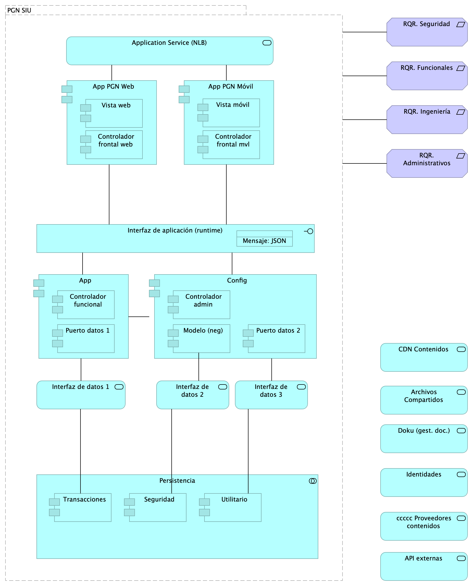
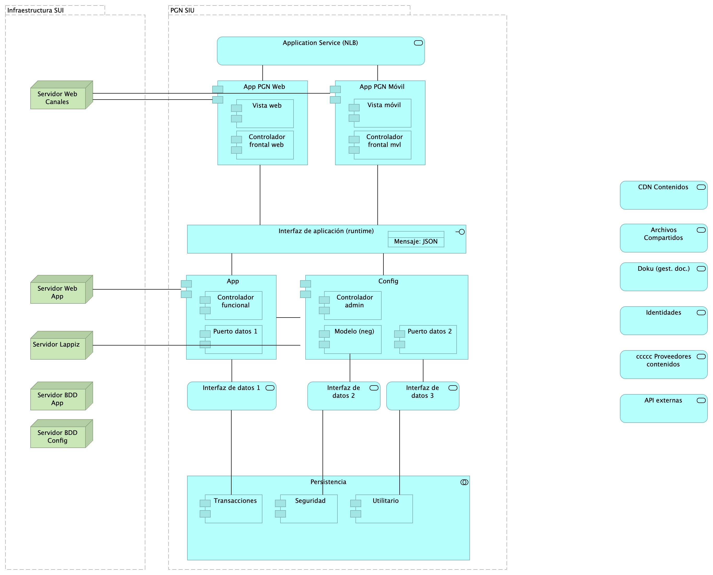

# Doc.3.Migración Funcional SUI
* [Patrón de Diseño Línea Base SUI PGN](#patrón-de-diseño-línea-base-sui-pgn)
	* [Lineabase.0.SIU applicación](#lineabase.0.siu-applicación)
	* [Lineabase.1.SIU componente](#lineabase.1.siu-componente)
	* [Lineabase.1a.SIU componentes. infraestrcutura](#lineabase.1a.siu-componentes.-infraestrcutura)
	* [Linebase.2.Portal](#linebase.2.portal)
* [Patrón de Diseño Migración SUI PGN](#patrón-de-diseño-migración-sui-pgn)
	* [Migracion.1a.SIU módulos](#migracion.1a.siu-módulos)
	* [Migracion.1b.SIU módulos componentes](#migracion.1b.siu-módulos-componentes)
	* [Migracion.1c.SIU modulos colaboración](#migracion.1c.siu-modulos-colaboración)
* [Organización cambios arquitectura](#organización-cambios-arquitectura)
	* [Organización. 1n. Mapa producto](#organización.-1n.-mapa-producto)
	* [Organización. 1n.1. Mapa producto PGN.1.Relatoría](#organización.-1n.1.-mapa-producto-pgn.1.relatoría)
	* [Organización. 2n.1a. Mapa producto PGN. Conciliacion](#organización.-2n.1a.-mapa-producto-pgn.-conciliacion)
* [Arquitectura de Seguridad, SUI Migración](#arquitectura-de-seguridad,-sui-migración)
	* [Seguridad. 1. Requerimientos](#seguridad.-1.-requerimientos)
	* [Seguridad. Linebase.2.Portal](#seguridad.-linebase.2.portal)
* [Análisis de Productos](#análisis-de-productos)
	* [Organización. 4n.1a. Mapa producto PGN. Comparativa](#organización.-4n.1a.-mapa-producto-pgn.-comparativa)
* [Riesgos Técnicos](#riesgos-técnicos)
	* [Riesgos.1. Migración funcional](#riesgos.1.-migración-funcional)
	* [Riesgos.2. Modelo Riesgo RSG10](#riesgos.2.-modelo-riesgo-rsg10)

\newpage

# Patrón de Diseño Línea Base SUI PGN
## Lineabase.0.SIU applicación

Procuraduría General de la Nación
Proyecto Migración SIU, 2023. Fase II

Línea base sistema único de información. PGN. Componentes originales Fase I.

versión 0.11

Procuraduría General de la Nación, proyecto Migración SIU, 2023, Fase II. Línea base del sistema único de información (SUI en adelante) de la PGN. Presentación de componentes de software  originales implementados en la Fase I del presente proyecto.

## Representación Arquitectónica
Con una arquitectura orientada a servicios SUI recopila:

1. Runtime: Es el servicio que interactúa con el usuario final (GUI) elaborado en Angular 11
1. API Tx: Servicio api rest base node encargado de realizar las transacciones básicas CRUD
1. API Config / Seguridad. Servicio Web API .Net Framework encargado de gestionar características con la autenticación y configuración

### Catálogo de Elementos
| Name| Type| Description| Properties
|:--------|:--------|:--------|:--------|
|**Application Collaboration**|application-collaboration|||
|**Application Collaboration**|application-collaboration|||
|**App**|application-component||*plataforma:* node Js |
|**App PGN Móvil**|application-component|||
|**App PGN Web**|application-component||*plataforma:* angular 11 |
|**Config**|application-component||*plataforma:* cs |
|**Punto acceso público**|application-interface|URL tipo C HTTP||
|**Application Service (NLB)**|application-service||*plataforma:* angular 11 |
|**Interfaz de datos 1**|application-service|||
|**Interfaz de datos 2**|application-service|||

## Lineabase.1.SIU componente

Distribución de los servicios y paquetes que integran la aplicación de SUI. 

Cuatro paquetes con tecnologías respectivas

1. Angular 11 (Web)
1. API Transaccional (Node Js)
1. API Config (C#)
1. Persistencia (SQL)

Asuntos de la Migración:

* Estrategia CMS central
* Motor de búsqueda
* Estatego como BI
* Conciliación y Doku
* Gestión de sesiones / caducidad

{#fig:id-id-4f2604a6793e41ce9eb978dca0209b03 width=}

_Fuente: ${4:Diagnóstico SOA. E-Service (2022).}_

 

### Catálogo de Elementos
| Name| Type| Description| Properties
|:--------|:--------|:--------|:--------|
|**Persistencia**|application-collaboration|||
|**App**|application-component||*plataforma:* node Js |
|**App PGN Móvil**|application-component|||
|**App PGN Web**|application-component||*plataforma:* angular 11 |
|**Config**|application-component||*plataforma:* cs |
|**Controlador admin**|application-component||*plataforma:* cs |
|**Controlador frontal mvl**|application-component||*plataforma:* js |
|**Controlador frontal web**|application-component||*plataforma:* js |
|**Controlador funcional**|application-component||*plataforma:* js |
|**Modelo (neg)**|application-component||*plataforma:* cs |
|**Puerto datos 1**|application-component||*plataforma:* js |
|**Puerto datos 2**|application-component||*plataforma:* cs |
|**Seguridad**|application-component||*plataforma:* sql |
|**Transacciones**|application-component||*plataforma:* sql |
|**Utilitario**|application-component||*plataforma:* no-sql |
|**Vista móvil**|application-component||*plataforma:* js |
|**Vista web**|application-component||*plataforma:* html |
|**Interfaz de aplicación (runtime)**|application-interface||*plataforma:* angular 11 |
|**API externas**|application-service|||
|**Application Service (NLB)**|application-service||*plataforma:* angular 11 |
|**Archivos Compartidos**|application-service|||
|**CDN Contenidos**|application-service|||
|**Doku (gest. doc.)**|application-service|||
|**Identidades**|application-service|||
|**Interfaz de datos 1**|application-service|||
|**Interfaz de datos 2**|application-service|||
|**Interfaz de datos 3**|application-service|||
|**ccccc Proveedores contenidos**|application-service|||
|**Mensaje: JSON**|data-object|||
|**PGN SIU**|grouping|El objetivo principal de la arquitectura del SUI de la migración es la centralización de los conceptos misionales: concentrar los conceptos misionales en componentes aislados; dejar por fuera de estos componentes misionales todo lo distintos a la misionalidad de la PGN. Los objetivos secundarios de esta arquitectura SUI de la migración son flexibilidad y extensibilidad. Dichos objetivos son independientes. Es decir, estos pueden ser maximizados sin conclifcto entre ellos. ||
|**RQR. Administrativos**|requirement|||
|**RQR. Funcionales**|requirement|||
|**RQR. Ingeniería**|requirement|||
|**RQR. Seguridad**|requirement|Requerimientos de seguridad, SUI, Migración, en aspectos de comunicación, autenticación, autorización y (manejo de) sesiones. ||

## Lineabase.1a.SIU componentes. infraestrcutura

Dependencias de infraestructura entre los servicios que integran el modelo de aplicación de SUI, Migración. 

* Servidor de Canales (App PGN web y móvil)
* Servidor Web App (App SUI)
* Servidor Lappiz (Config SUI)
* Servidor BDD App (Transaccional)
* Servidor BDD Config (Configuración)

{#fig:id-id-ae9dc2de036e435fbcba8497224653a7 width=}

_Fuente: ${4:Diagnóstico SOA. E-Service (2022).}_

 

### Catálogo de Elementos
| Name| Type| Description| Properties
|:--------|:--------|:--------|:--------|
|**Persistencia**|application-collaboration|||
|**App**|application-component||*plataforma:* node Js |
|**App PGN Móvil**|application-component|||
|**App PGN Web**|application-component||*plataforma:* angular 11 |
|**Config**|application-component||*plataforma:* cs |
|**Controlador admin**|application-component||*plataforma:* cs |
|**Controlador frontal mvl**|application-component||*plataforma:* js |
|**Controlador frontal web**|application-component||*plataforma:* js |
|**Controlador funcional**|application-component||*plataforma:* js |
|**Modelo (neg)**|application-component||*plataforma:* cs |
|**Puerto datos 1**|application-component||*plataforma:* js |
|**Puerto datos 2**|application-component||*plataforma:* cs |
|**Seguridad**|application-component||*plataforma:* sql |
|**Transacciones**|application-component||*plataforma:* sql |
|**Utilitario**|application-component||*plataforma:* no-sql |
|**Vista móvil**|application-component||*plataforma:* js |
|**Vista web**|application-component||*plataforma:* html |
|**Interfaz de aplicación (runtime)**|application-interface||*plataforma:* angular 11 |
|**API externas**|application-service|||
|**Application Service (NLB)**|application-service||*plataforma:* angular 11 |
|**Archivos Compartidos**|application-service|||
|**CDN Contenidos**|application-service|||
|**Doku (gest. doc.)**|application-service|||
|**Identidades**|application-service|||
|**Interfaz de datos 1**|application-service|||
|**Interfaz de datos 2**|application-service|||
|**Interfaz de datos 3**|application-service|||
|**ccccc Proveedores contenidos**|application-service|||
|**Mensaje: JSON**|data-object|||
|**Infraestructura SUI**|grouping|Soporte de infraestructura a los componentes del SUI Migración. Servidores y ambientes de cómputo para la ejecución del software base de los componentes misionales del SUI de PGN. ||
|**PGN SIU**|grouping|El objetivo principal de la arquitectura del SUI de la migración es la centralización de los conceptos misionales: concentrar los conceptos misionales en componentes aislados; dejar por fuera de estos componentes misionales todo lo distintos a la misionalidad de la PGN. Los objetivos secundarios de esta arquitectura SUI de la migración son flexibilidad y extensibilidad. Dichos objetivos son independientes. Es decir, estos pueden ser maximizados sin conclifcto entre ellos. ||
|**Servidor BDD App**|node|Sistema Operativo Windows Server 2019 Standard o Datacenter x64. RAM	8 GB. CPU 64 Bits, 4 Cores > 2 Ghz Discos	SO C: 126 GB, Backup E: 511 GB, SQL Data F: 510 GB, SQL Log   G: 510 GB, TempDB  G: 63.6 GB. ||
|**Servidor BDD Config**|node|Sistema Operativo Windows Server 2019 Standard o Datacenter x64. RAM	8 GB. CPU 64 Bits, 4 Cores > 2 Ghz Discos	SO C: 80 GB, Backup E: 250 GB, SQL Data F: 250 GB, SQL Log G: 250 GB, TempDB  G: 30 GB. ||
|**Servidor Lappiz **|node|Sistema Operativo Windows Server 2019 Standard o Datacenter x64. RAM 8 GB. CPU 64 Bits, 4 Cores > 2 Ghz Discos	SO C: 120 GB,  D: 16 GB. ||
|**Servidor Web App**|node|Windows Server 2019 Standard o Datacenter x64. Nombre físico. IP LAN. IP Pública. Windows Server 2019 Standard or Datacenter x64. RAM	8  GB. CPU	64 Bits. 4 Cores de 2 Ghz. Discos	SO C: 126 GB. SO D: 16 GB. ||
|**Servidor Web Canales**|node|Windows Server 2019 Standard o Datacenter x64. Nombre físico. IP LAN. IP Pública. Windows Server 2019 Standard or Datacenter x64. RAM	8  GB. CPU	64 Bits. 4 Cores de 2 Ghz. Discos	SO C: 126 GB. SO D: 16 GB. ||

## Linebase.2.Portal

El portal es el conjunto de los elementos físicos y lógicos necesarios para la implementación de la granja de servidores de SharePoint Server 2019 para el portal de la PROCURADURIA.

* Servidores Web Front End
* Servidores de Aplicaciones
* Servidores de SQL Server

{#fig:id-id-64947c69f63c422e9f18c81763910332 width=}

_Fuente: ${4:Diagnóstico SOA. E-Service (2022).}_

 

### Catálogo de Elementos

| Tema           | Tema | Tema | Tema |
|----------------|------|------|------|
| Application Collaboration Sharepoint | Application Collaboration |  |  |
| Application Interface | Application Interface |  |  |
| Servidor aplicaciones Sharepoint | Application Component |  |  |
| Servidor datos Sharepoint | Application Component |  |  |
| Servidor web Sharepoint | Application Component |  |  |

Table: Elementos de la vista. {#tbl:tblelement-Linebase.2.Portal-id}

<tr class="hidden id-model undefined id-id-64947c69f63c422e9f18c81763910332">
	<td>
	<td>Aggregation Relationship
	<td>Application Collaboration Sharepoint
	<td>Servidor web Sharepoint
	<td>

<tr class="hidden id-model undefined id-id-64947c69f63c422e9f18c81763910332">
	<td>
	<td>Aggregation Relationship
	<td>Application Collaboration Sharepoint
	<td>Servidor aplicaciones Sharepoint
	<td>

<tr class="hidden id-model undefined id-id-64947c69f63c422e9f18c81763910332">
	<td>
	<td>Aggregation Relationship
	<td>Application Collaboration Sharepoint
	<td>Servidor datos Sharepoint
	<td>

<tr class="hidden id-model undefined id-id-64947c69f63c422e9f18c81763910332">
	<td>
	<td>Association Relationship
	<td>Application Interface
	<td>Application Collaboration Sharepoint
	<td>

## Migracion.1a.SIU módulos

PGN. Migración Sistemas Misionales. Fase 2.

Submódulos Sistema Único de Información. Requerimientos asociados a submódulos.

versión 0.3

Identificación de submódulos del Sistema Único de Información (SUI) de la PGN. 

Todos los sistemas de información del SUI deben seguir la directiva de separar a los compontentes misionales de los utilitarior: el SUI de PGN estará constituídos por submódulos dispuestos en relación de utilitarios (que sirven) a los componentes misionales del SUI, ubicados en el centro en la diagrama.

Los submódulos del SUI, tal como están presentados, reúnen a las partes por el mismo rol en favor de la coherencia. Por ejemplo, los servicios de aplicación, en la imagen, contiene a todos aquellos utilitarios que prestan alguna utilidad momentánea al SUI migrado. Organizados así, estos submódulos utilitarios pueden ser intercambiados o ampliados sin perjuicio de los componentes misionales dell SUI (centro del diagrama) gracias a las _interfaces de unión_ en favor de la extensibilidad.

Las interfaces de unión indicadas arriba obligan a los submódulos a cumplir las exigencias de los componentes misionales del SUI.

Los submódulos identificados tienen los siguientes roles para el SUI migrado:

1. cc:Presentación
1. cc:Servicios de aplicación
1. cc:Portales y canales
1. cc:Administración y configuración
1. cc:Almacenamiento

### Requerimientos Asociados a los Submódulos
La disposición de los módulos y submódulos presentada, denominada SUI Migración en adelante, facilita la focalización de los requerimientos encontrados en el levantamiento realizado en el actual proyecto. Así, por ejemplo, los requerimientos funcionales se encuentran concentrados en el submódulo de presentación (ver imagen).

{#fig:id-id-f3f3865c516245bfb2d777de5b23efb6 width=}

_Fuente: ${4:Diagnóstico SOA. E-Service (2022).}_

 

### Catálogo de Elementos

| Tema           | Tema | Tema | Tema |
|----------------|------|------|------|
| Cliente PGN | Business Actor |  |  |
| Funcionario PGN | Business Actor |  |  |
| RQR. Administrativos | Requirement |  |  |
| RQR. Funcionales | Requirement |  |  |
| RQR. Ingeniería | Requirement |  |  |
| RQR. Misionales | Requirement |  |  |
| RQR. Seguridad | Requirement | Requerimientos de seguridad, SUI, Migración, en aspectos de comunicación, autenticación, autorización y (manejo de) sesiones.  |  |
| cc:Administración | Application Collaboration |  |  |
| cc:Almacenamiento | Application Collaboration |  |  |
| cc:PGN SUI (misional) | Application Collaboration |  |  |
| cc:Portales y canales | Application Collaboration | Submódulo de portales internos de la PGN a donde llega el SUI. Interfaz web que usa al SUI para llegar a direcciones y subdirecciones de la PGN. La plataforma principal de portales en este contexto es Sharepoint de Microsoft.  |  |
| cc:Presentación | Application Collaboration | Submódulo de presentación del SUI. interfaz gráfica, interfaz web visible a los usuarios clientes y funcionarios de la PGN.  |  |
| cc:Servicios de aplicación | Application Collaboration | Submódulo de servicios utilitarios que sirven al SUI. Servicios variados que cumplen roles facilitadores de las actividades misionales del SUI. Ejemplos de estos servicios son los de gestión documental, implementado por Doku en el contexto de PGN.   |  |
| interfaz | Application Interface |  |  |
| interfaz | Application Interface |  |  |
| interfaz | Application Interface |  |  |
| interfaz | Application Interface |  |  |
| interfaz | Application Interface |  |  |

Table: Elementos de la vista. {#tbl:tblelement-Migracion.1a.SIUmódulos-id}

<tr class="hidden id-model undefined id-id-f3f3865c516245bfb2d777de5b23efb6">
	<td>
	<td>Association Relationship
	<td>RQR. Seguridad
	<td>cc:PGN SUI (misional)
	<td>

<tr class="hidden id-model undefined id-id-f3f3865c516245bfb2d777de5b23efb6">
	<td>
	<td>Association Relationship
	<td>RQR. Funcionales
	<td>cc:Presentación
	<td>

<tr class="hidden id-model undefined id-id-f3f3865c516245bfb2d777de5b23efb6">
	<td>
	<td>Association Relationship
	<td>RQR. Ingeniería
	<td>cc:PGN SUI (misional)
	<td>

<tr class="hidden id-model undefined id-id-f3f3865c516245bfb2d777de5b23efb6">
	<td>
	<td>Association Relationship
	<td>RQR. Administrativos
	<td>cc:Administración
	<td>

<tr class="hidden id-model undefined id-id-f3f3865c516245bfb2d777de5b23efb6">
	<td>
	<td>Association Relationship
	<td>RQR. Misionales
	<td>cc:PGN SUI (misional)
	<td>

<tr class="hidden id-model undefined id-id-f3f3865c516245bfb2d777de5b23efb6">
	<td>
	<td>Serving Relationship
	<td>cc:Servicios de aplicación
	<td>cc:PGN SUI (misional)
	<td>

<tr class="hidden id-model undefined id-id-f3f3865c516245bfb2d777de5b23efb6">
	<td>
	<td>Serving Relationship
	<td>cc:Portales y canales
	<td>cc:PGN SUI (misional)
	<td>

<tr class="hidden id-model undefined id-id-f3f3865c516245bfb2d777de5b23efb6">
	<td>
	<td>Serving Relationship
	<td>cc:Administración
	<td>cc:PGN SUI (misional)
	<td>

<tr class="hidden id-model undefined id-id-f3f3865c516245bfb2d777de5b23efb6">
	<td>
	<td>Association Relationship
	<td>RQR. Seguridad
	<td>cc:Administración
	<td>

<tr class="hidden id-model undefined id-id-f3f3865c516245bfb2d777de5b23efb6">
	<td>
	<td>Association Relationship
	<td>Cliente PGN
	<td>cc:Portales y canales
	<td>

<tr class="hidden id-model undefined id-id-f3f3865c516245bfb2d777de5b23efb6">
	<td>sirve
	<td>Serving Relationship
	<td>cc:Presentación
	<td>cc:PGN SUI (misional)
	<td>

<tr class="hidden id-model undefined id-id-f3f3865c516245bfb2d777de5b23efb6">
	<td>sirve
	<td>Serving Relationship
	<td>cc:Almacenamiento
	<td>cc:PGN SUI (misional)
	<td>

<tr class="hidden id-model undefined id-id-f3f3865c516245bfb2d777de5b23efb6">
	<td>usa
	<td>Association Relationship
	<td>Funcionario PGN
	<td>cc:Presentación
	<td>

## Migracion.1b.SIU módulos componentes

PGN. Migración Sistemas Misionales. Fase 2.

Componentes internos de los submódulos Sistema Único de Información. 

versión 0.1

Presentación de los componentes internos de los submódulos del sistema único de información migración PGN. Organización intena de los servicios y paquetes que integran cada submódulo del SUI. Todos los sistemas de información del SUI siguen esta directiva: estarán constituídos por submódulos dispuestos en relación de utilitarios (que sirven) a los componentes misionales del SUI, ubicados en el centro en la diagrama. 

La organización de componentes de migración SUI facilita focalizar la selección de tecnologeias. Los componentes internos y tecnologías elegidas son las siguientes

1. Presentación: Angular 11 (Web)
1. PGN SUI: API Transaccional (Node Js)
1. Administración: API Config (C#)
1. Persistencia: (SQL)

Los submódulos del SUI, tal como están presentados, reúnen a las partes que tienen el mismo rol en favor de la coherencia. Así mismo, estos pueden ser intercambiados o ampliados sin perjuicio del SUI gracias a las interfaces de unión (en favor de la extensibilidad).

Las interfaces de unión indicadas arriba obligan a los submódulos a cumplir las exigencias de los componentes misionales del SUI.

{#fig:id-id-6dcada718c1446f69884dc7418828c51 width=}

_Fuente: ${4:Diagnóstico SOA. E-Service (2022).}_

 

### Catálogo de Elementos
| Name| Type| Description| Properties
|:--------|:--------|:--------|:--------|
|**App**|application-component||*plataforma:* node Js |
|**App PGN Móvil**|application-component|||
|**App PGN Web**|application-component||*plataforma:* angular 11 |
|**Config**|application-component||*plataforma:* cs |
|**Controlador admin**|application-component||*plataforma:* cs |
|**Controlador frontal mvl**|application-component||*plataforma:* js |
|**Controlador frontal web**|application-component||*plataforma:* js |
|**Controlador funcional**|application-component||*plataforma:* js |
|**Modelo (neg)**|application-component||*plataforma:* cs |
|**Puerto datos 1**|application-component||*plataforma:* js |
|**Puerto datos 2**|application-component||*plataforma:* cs |
|**Seguridad**|application-component||*plataforma:* sql |
|**Servidor aplicaciones Sharepoint**|application-component|||
|**Servidor datos Sharepoint**|application-component|||
|**Servidor web Sharepoint**|application-component|||
|**Transacciones**|application-component||*plataforma:* sql |
|**Utilitario**|application-component||*plataforma:* no-sql |
|**Vista móvil**|application-component||*plataforma:* js |
|**Vista web**|application-component||*plataforma:* html |
|**Application Interface**|application-interface|||
|**Interfaz de aplicación (runtime)**|application-interface||*plataforma:* angular 11 |
|**API externas**|application-service|||
|**Application Service (NLB)**|application-service||*plataforma:* angular 11 |
|**Archivos Compartidos**|application-service|||
|**CDN Contenidos**|application-service|||
|**Doku (gest. doc.)**|application-service|||
|**Identidades**|application-service|||
|**Interfaz de datos 1**|application-service|||
|**Interfaz de datos 2**|application-service|||
|**Interfaz de datos 3**|application-service|||
|**Office**|application-service|||
|**ccccc Proveedores contenidos**|application-service|||
|**Mensaje: JSON**|data-object|||
|**Administración**|grouping|||
|**Almacenamiento**|grouping|||
|**PGN SIU**|grouping|El objetivo principal de la arquitectura del SUI de la migración es la centralización de los conceptos misionales: concentrar los conceptos misionales en componentes aislados; dejar por fuera de estos componentes misionales todo lo distintos a la misionalidad de la PGN. Los objetivos secundarios de esta arquitectura SUI de la migración son flexibilidad y extensibilidad. Dichos objetivos son independientes. Es decir, estos pueden ser maximizados sin conclifcto entre ellos. ||
|**Portales**|grouping|Submódulo de portales internos de la PGN a donde llega el SUI. Interfaz web que usa al SUI para llegar a direcciones y subdirecciones de la PGN. La plataforma principal de portales en este contexto es Sharepoint de Microsoft. ||
|**Presentación**|grouping|Submódulo de presentación del SUI. interfaz gráfica, interfaz web visible a los usuarios clientes y funcionarios de la PGN. ||
|**Servicios de aplicación**|grouping|Submódulo de servicios utilitarios que sirven al SUI. Servicios variados que cumplen roles facilitadores de las actividades misionales del SUI. Ejemplos de estos servicios son los de gestión documental, implementado por Doku en el contexto de PGN. ||
|**RQR. Administrativos**|requirement|||
|**RQR. Funcionales**|requirement|||
|**RQR. Ingeniería**|requirement|||
|**RQR. Misionales**|requirement|||
|**RQR. Seguridad**|requirement|Requerimientos de seguridad, SUI, Migración, en aspectos de comunicación, autenticación, autorización y (manejo de) sesiones. ||
|**RQR. Seguridad**|requirement|Requerimientos de seguridad, SUI, Migración, en aspectos de comunicación, autenticación, autorización y (manejo de) sesiones. ||

## Migracion.1c.SIU modulos colaboración

PGN. Migración Sistemas Misionales. Fase 2.

Patrón de comunicación y colaboración módulo misional (PGN SUI) y submódulos.

versión 0.3

Patrón de Distribución y Colaboración estándar para el SUI.

La colaboración y comunicación de los componentes internos del SUI (grupo PFN SUI, en el diagrama) está mediada por interfaces. Estas son provistas por el grupo de componentes misionales, PGN SUI, hacia los submódulos externos. La intención es mantener reducido y controlado el número de interfaces.

La colaboración entre el SUI Migración con sistemas externos puede darse mediante buses de datos empresarial, sin perjuicio del patrón de comunicación estadar descrito en el diagrama.

{#fig:id-id-e5d2b80501c743edb14cecf221be73a9 width=}

_Fuente: ${4:Diagnóstico SOA. E-Service (2022).}_

 

### Catálogo de Elementos

| Tema           | Tema | Tema | Tema |
|----------------|------|------|------|
| cc:Almacenamiento | Application Collaboration |  |  |
| cc:PGN SUI (misional) | Application Collaboration |  |  |
| cc:Portales y canales | Application Collaboration | Submódulo de portales internos de la PGN a donde llega el SUI. Interfaz web que usa al SUI para llegar a direcciones y subdirecciones de la PGN. La plataforma principal de portales en este contexto es Sharepoint de Microsoft.  |  |
| interfaz | Application Interface |  |  |
| interfaz | Application Interface |  |  |

Table: Elementos de la vista. {#tbl:tblelement-Migracion.1c.SIUmoduloscolaboración-id}

<tr class="hidden id-model undefined id-id-e5d2b80501c743edb14cecf221be73a9">
	<td>API
	<td>Flow Relationship
	<td>cc:Portales y canales
	<td>interfaz
	<td>

<tr class="hidden id-model undefined id-id-e5d2b80501c743edb14cecf221be73a9">
	<td>API
	<td>Flow Relationship
	<td>cc:Almacenamiento
	<td>interfaz
	<td>

<tr class="hidden id-model undefined id-id-e5d2b80501c743edb14cecf221be73a9">
	<td>puerto
	<td>Flow Relationship
	<td>interfaz
	<td>cc:Almacenamiento
	<td>

<tr class="hidden id-model undefined id-id-e5d2b80501c743edb14cecf221be73a9">
	<td>puerto
	<td>Flow Relationship
	<td>interfaz
	<td>cc:Portales y canales
	<td>

<tr class="hidden id-model undefined id-id-e5d2b80501c743edb14cecf221be73a9">
	<td>puerto
	<td>Flow Relationship
	<td>cc:PGN SUI (misional)
	<td>interfaz
	<td>

<tr class="hidden id-model undefined id-id-e5d2b80501c743edb14cecf221be73a9">
	<td>puerto
	<td>Flow Relationship
	<td>cc:PGN SUI (misional)
	<td>interfaz
	<td>

<tr class="hidden id-model undefined id-id-e5d2b80501c743edb14cecf221be73a9">
	<td>puerto
	<td>Flow Relationship
	<td>interfaz
	<td>cc:PGN SUI (misional)
	<td>

<tr class="hidden id-model undefined id-id-e5d2b80501c743edb14cecf221be73a9">
	<td>puerto
	<td>Flow Relationship
	<td>interfaz
	<td>cc:PGN SUI (misional)
	<td>

## Migracion.2. datos

PGN. Migración Sistemas Misionales. Fase 2.

Modelo de acceso y procesamiento de datos de negocio. Módulos Sistema Único de Información. 

versión 0.1

Modelo de acceso y procesamiento a datos de negocio del SUI. Presentamos la organización de los ítems de datos de negocio necesarios para que los módulos del SUI puedan recolectar, procesar, integrar y almacenarlos de forma organizada y escalable.

Mediante esta organización, los datos de negocio son transportados desde sus respectivas fuentes mediante interfaces (por principio de extensión y mantenibilidad). Los datos externos, entendidos como los de otros proveedores, son obtenidos mediante un intermediario: el bus de datos del SUI.

Consideramos tres tipos datos: datos transaccionales, históricos y externos, y presentamos una manera distinta de tratarlos y transportarlos.

{#fig:id-id-d83ebcb4235c40c4ac68b7f373d4161f width=}

_Fuente: ${4:Diagnóstico SOA. E-Service (2022).}_

 

### Catálogo de Elementos

| Tema           | Tema | Tema | Tema |
|----------------|------|------|------|
| APP1.Relatoría | Application Component | Módulo del SUI. Relatoría pública. Publicación de información de referencia para funcionarios y personas naturales, cientes de la PGN.   |  |
| APP2.SIRI | Application Component |  |  |
| APP3.Control interno | Application Component |  |  |
| APP4.Hominis | Application Component | Módulo del SUI. Gestión de capital humano, funcionarios y cargos de representación y libre remoción de la PGN.  |  |
| APP5.SIM | Application Component |  |  |
| APP6.Estratego | Application Component |  |  |
| Bus de datos | Application Service | El patrón de bus de datos tiene el rol de unir y referir a los datos externos al SUI de tal manera que hace transparente la localización y el formato de este tipo de datos.  |  |
| Datos externos | Data Object |  |  |
| Datos históricos | Data Object |  |  |
| Datos transaccionales | Data Object |  |  |
| Interfaz de Acceso Proveedores | Application Interface | Interfaz de acceso a los tipos de datos externos al SUI.  |  |
| Interfaz de Almacenaniento | Application Interface | Interfaz de acceso a los repositorio, base de datos relacionales y no jerárquicas. Tipos de datos transaccionales, internos, del SUI.  |  |
| Procesamiento batch PGN | Application Process | Los procesos de lotes, que requieren volumenes de datos altos, deben hacer parte de la arquitectura de datos del SUI.  |  |
| cc:PGN SUI (misional) | Application Collaboration |  |  |

Table: Elementos de la vista. {#tbl:tblelement-Migracion.2.datos-id}

<tr class="hidden id-model undefined id-id-d83ebcb4235c40c4ac68b7f373d4161f">
	<td>
	<td>Aggregation Relationship
	<td>cc:PGN SUI (misional)
	<td>APP6.Estratego
	<td>

<tr class="hidden id-model undefined id-id-d83ebcb4235c40c4ac68b7f373d4161f">
	<td>
	<td>Aggregation Relationship
	<td>cc:PGN SUI (misional)
	<td>APP3.Control interno
	<td>

<tr class="hidden id-model undefined id-id-d83ebcb4235c40c4ac68b7f373d4161f">
	<td>
	<td>Aggregation Relationship
	<td>cc:PGN SUI (misional)
	<td>APP4.Hominis
	<td>

<tr class="hidden id-model undefined id-id-d83ebcb4235c40c4ac68b7f373d4161f">
	<td>
	<td>Aggregation Relationship
	<td>cc:PGN SUI (misional)
	<td>APP1.Relatoría
	<td>

<tr class="hidden id-model undefined id-id-d83ebcb4235c40c4ac68b7f373d4161f">
	<td>
	<td>Aggregation Relationship
	<td>cc:PGN SUI (misional)
	<td>APP5.SIM
	<td>

<tr class="hidden id-model undefined id-id-d83ebcb4235c40c4ac68b7f373d4161f">
	<td>
	<td>Aggregation Relationship
	<td>cc:PGN SUI (misional)
	<td>APP2.SIRI
	<td>

<tr class="hidden id-model undefined id-id-d83ebcb4235c40c4ac68b7f373d4161f">
	<td>
	<td>Association Relationship
	<td>cc:PGN SUI (misional)
	<td>Interfaz de Acceso Proveedores
	<td>

<tr class="hidden id-model undefined id-id-d83ebcb4235c40c4ac68b7f373d4161f">
	<td>
	<td>Association Relationship
	<td>cc:PGN SUI (misional)
	<td>Interfaz de Almacenaniento
	<td>

<tr class="hidden id-model undefined id-id-d83ebcb4235c40c4ac68b7f373d4161f">
	<td>
	<td>Association Relationship
	<td>cc:PGN SUI (misional)
	<td>Procesamiento batch PGN
	<td>

<tr class="hidden id-model undefined id-id-d83ebcb4235c40c4ac68b7f373d4161f">
	<td>
	<td>Association Relationship
	<td>Interfaz de Acceso Proveedores
	<td>Bus de datos
	<td>

<tr class="hidden id-model undefined id-id-d83ebcb4235c40c4ac68b7f373d4161f">
	<td>
	<td>Access Relationship
	<td>Interfaz de Almacenaniento
	<td>Datos transaccionales
	<td>

<tr class="hidden id-model undefined id-id-d83ebcb4235c40c4ac68b7f373d4161f">
	<td>
	<td>Access Relationship
	<td>Procesamiento batch PGN
	<td>Datos transaccionales
	<td>

<tr class="hidden id-model undefined id-id-d83ebcb4235c40c4ac68b7f373d4161f">
	<td>
	<td>Access Relationship
	<td>Bus de datos
	<td>Datos históricos
	<td>

<tr class="hidden id-model undefined id-id-d83ebcb4235c40c4ac68b7f373d4161f">
	<td>
	<td>Access Relationship
	<td>Bus de datos
	<td>Datos externos
	<td>

## Migracion.2a. datos Hominis

PGN. Migración Sistemas Misionales. Fase 2.

Entidades de datos de negocio. Submódulos Sistema Único de Información. Hominis

versión 0.1

Identificación de entidades de datos de negocio relacionadas al módulo de gestión de capital del SUI, Hominis.

Estas entidades de datos de negocio son los que llamamos los tipos de datos internos del SUI y deben ser consideradas para la creación de las API de manejo del ciclo de vida de los datos de este módulo.

{#fig:id-id-a0d2da66c54a40329bb8fb268e625b5f width=}

_Fuente: ${4:Diagnóstico SOA. E-Service (2022).}_

 

### Catálogo de Elementos

| Tema           | Tema | Tema | Tema |
|----------------|------|------|------|
| APP4.Hominis | Application Component | Módulo del SUI. Gestión de capital humano, funcionarios y cargos de representación y libre remoción de la PGN.  |  |
| DAT.Cargo | Business Object |  |  |
| DAT.Código Actuación | Business Object |  |  |
| DAT.Código Jurisdicción | Business Object |  |  |
| DAT.Código Regional | Business Object |  |  |
| DAT.Código SNIES | Business Object |  |  |
| DAT.Código dependencia superior | Business Object |  |  |
| DAT.Código regional | Business Object |  |  |
| DAT.Decreto de la creación | Business Object |  |  |
| DAT.Diciplina Area | Business Object |  |  |
| DAT.Encargo del cargo | Business Object |  |  |
| DAT.Ley vigente | Business Object |  |  |
| DAT.Materia | Business Object |  |  |
| DAT.Nivel | Business Object |  |  |
| DAT.Nombre Actuación | Business Object |  |  |
| DAT.Nombre Jurisdicción | Business Object |  |  |
| DAT.Nombre Regional | Business Object |  |  |
| DAT.Nombre dependencia superior | Business Object |  |  |
| DAT.Tipo de inscripcion | Business Object |  |  |
| DAT.Vinculación | Business Object |  |  |
| Hominis | Business Object | Entidades de datos de negocio de capital humano de la PGN. Sistema de información Homini.  |  |

Table: Elementos de la vista. {#tbl:tblelement-Migracion.2a.datosHominis-id}

<tr class="hidden id-model undefined id-id-a0d2da66c54a40329bb8fb268e625b5f">
	<td>
	<td>Composition Relationship
	<td>Hominis
	<td>DAT.Decreto de la creación
	<td>

<tr class="hidden id-model undefined id-id-a0d2da66c54a40329bb8fb268e625b5f">
	<td>
	<td>Composition Relationship
	<td>Hominis
	<td>DAT.Código Jurisdicción
	<td>

<tr class="hidden id-model undefined id-id-a0d2da66c54a40329bb8fb268e625b5f">
	<td>
	<td>Composition Relationship
	<td>Hominis
	<td>DAT.Código SNIES
	<td>

<tr class="hidden id-model undefined id-id-a0d2da66c54a40329bb8fb268e625b5f">
	<td>
	<td>Composition Relationship
	<td>Hominis
	<td>DAT.Nombre Regional
	<td>

<tr class="hidden id-model undefined id-id-a0d2da66c54a40329bb8fb268e625b5f">
	<td>
	<td>Composition Relationship
	<td>Hominis
	<td>DAT.Encargo del cargo
	<td>

<tr class="hidden id-model undefined id-id-a0d2da66c54a40329bb8fb268e625b5f">
	<td>
	<td>Composition Relationship
	<td>Hominis
	<td>DAT.Código Actuación
	<td>

<tr class="hidden id-model undefined id-id-a0d2da66c54a40329bb8fb268e625b5f">
	<td>
	<td>Composition Relationship
	<td>Hominis
	<td>DAT.Vinculación
	<td>

<tr class="hidden id-model undefined id-id-a0d2da66c54a40329bb8fb268e625b5f">
	<td>
	<td>Composition Relationship
	<td>Hominis
	<td>DAT.Nivel
	<td>

<tr class="hidden id-model undefined id-id-a0d2da66c54a40329bb8fb268e625b5f">
	<td>
	<td>Composition Relationship
	<td>Hominis
	<td>DAT.Nombre Actuación
	<td>

<tr class="hidden id-model undefined id-id-a0d2da66c54a40329bb8fb268e625b5f">
	<td>
	<td>Composition Relationship
	<td>Hominis
	<td>DAT.Cargo
	<td>

<tr class="hidden id-model undefined id-id-a0d2da66c54a40329bb8fb268e625b5f">
	<td>
	<td>Composition Relationship
	<td>Hominis
	<td>DAT.Código regional
	<td>

<tr class="hidden id-model undefined id-id-a0d2da66c54a40329bb8fb268e625b5f">
	<td>
	<td>Composition Relationship
	<td>Hominis
	<td>DAT.Tipo de inscripcion
	<td>

<tr class="hidden id-model undefined id-id-a0d2da66c54a40329bb8fb268e625b5f">
	<td>
	<td>Composition Relationship
	<td>Hominis
	<td>DAT.Código dependencia superior
	<td>

<tr class="hidden id-model undefined id-id-a0d2da66c54a40329bb8fb268e625b5f">
	<td>
	<td>Composition Relationship
	<td>Hominis
	<td>DAT.Nombre Jurisdicción
	<td>

<tr class="hidden id-model undefined id-id-a0d2da66c54a40329bb8fb268e625b5f">
	<td>
	<td>Composition Relationship
	<td>Hominis
	<td>DAT.Nombre dependencia superior
	<td>

<tr class="hidden id-model undefined id-id-a0d2da66c54a40329bb8fb268e625b5f">
	<td>
	<td>Composition Relationship
	<td>Hominis
	<td>DAT.Código Regional
	<td>

<tr class="hidden id-model undefined id-id-a0d2da66c54a40329bb8fb268e625b5f">
	<td>
	<td>Composition Relationship
	<td>Hominis
	<td>DAT.Diciplina Area
	<td>

<tr class="hidden id-model undefined id-id-a0d2da66c54a40329bb8fb268e625b5f">
	<td>
	<td>Composition Relationship
	<td>Hominis
	<td>DAT.Materia
	<td>

<tr class="hidden id-model undefined id-id-a0d2da66c54a40329bb8fb268e625b5f">
	<td>
	<td>Composition Relationship
	<td>Hominis
	<td>DAT.Ley vigente
	<td>

<tr class="hidden id-model undefined id-id-a0d2da66c54a40329bb8fb268e625b5f">
	<td>
	<td>Access Relationship
	<td>APP4.Hominis
	<td>DAT.Código dependencia superior
	<td>

<tr class="hidden id-model undefined id-id-a0d2da66c54a40329bb8fb268e625b5f">
	<td>
	<td>Access Relationship
	<td>APP4.Hominis
	<td>DAT.Diciplina Area
	<td>

<tr class="hidden id-model undefined id-id-a0d2da66c54a40329bb8fb268e625b5f">
	<td>
	<td>Access Relationship
	<td>APP4.Hominis
	<td>DAT.Código Actuación
	<td>

<tr class="hidden id-model undefined id-id-a0d2da66c54a40329bb8fb268e625b5f">
	<td>
	<td>Access Relationship
	<td>APP4.Hominis
	<td>DAT.Cargo
	<td>

<tr class="hidden id-model undefined id-id-a0d2da66c54a40329bb8fb268e625b5f">
	<td>
	<td>Access Relationship
	<td>APP4.Hominis
	<td>DAT.Decreto de la creación
	<td>

<tr class="hidden id-model undefined id-id-a0d2da66c54a40329bb8fb268e625b5f">
	<td>
	<td>Access Relationship
	<td>APP4.Hominis
	<td>DAT.Código regional
	<td>

<tr class="hidden id-model undefined id-id-a0d2da66c54a40329bb8fb268e625b5f">
	<td>
	<td>Access Relationship
	<td>APP4.Hominis
	<td>DAT.Código Jurisdicción
	<td>

<tr class="hidden id-model undefined id-id-a0d2da66c54a40329bb8fb268e625b5f">
	<td>
	<td>Access Relationship
	<td>APP4.Hominis
	<td>DAT.Código Regional
	<td>

<tr class="hidden id-model undefined id-id-a0d2da66c54a40329bb8fb268e625b5f">
	<td>
	<td>Access Relationship
	<td>APP4.Hominis
	<td>DAT.Código SNIES
	<td>

<tr class="hidden id-model undefined id-id-a0d2da66c54a40329bb8fb268e625b5f">
	<td>
	<td>Access Relationship
	<td>APP4.Hominis
	<td>DAT.Tipo de inscripcion
	<td>

<tr class="hidden id-model undefined id-id-a0d2da66c54a40329bb8fb268e625b5f">
	<td>
	<td>Access Relationship
	<td>APP4.Hominis
	<td>DAT.Vinculación
	<td>

<tr class="hidden id-model undefined id-id-a0d2da66c54a40329bb8fb268e625b5f">
	<td>
	<td>Access Relationship
	<td>APP4.Hominis
	<td>DAT.Nombre Jurisdicción
	<td>

<tr class="hidden id-model undefined id-id-a0d2da66c54a40329bb8fb268e625b5f">
	<td>
	<td>Access Relationship
	<td>APP4.Hominis
	<td>DAT.Nivel
	<td>

<tr class="hidden id-model undefined id-id-a0d2da66c54a40329bb8fb268e625b5f">
	<td>
	<td>Access Relationship
	<td>APP4.Hominis
	<td>DAT.Encargo del cargo
	<td>

<tr class="hidden id-model undefined id-id-a0d2da66c54a40329bb8fb268e625b5f">
	<td>
	<td>Access Relationship
	<td>APP4.Hominis
	<td>DAT.Materia
	<td>

<tr class="hidden id-model undefined id-id-a0d2da66c54a40329bb8fb268e625b5f">
	<td>
	<td>Access Relationship
	<td>APP4.Hominis
	<td>DAT.Ley vigente
	<td>

<tr class="hidden id-model undefined id-id-a0d2da66c54a40329bb8fb268e625b5f">
	<td>
	<td>Access Relationship
	<td>APP4.Hominis
	<td>DAT.Nombre Regional
	<td>

<tr class="hidden id-model undefined id-id-a0d2da66c54a40329bb8fb268e625b5f">
	<td>
	<td>Access Relationship
	<td>APP4.Hominis
	<td>DAT.Nombre Actuación
	<td>

<tr class="hidden id-model undefined id-id-a0d2da66c54a40329bb8fb268e625b5f">
	<td>
	<td>Access Relationship
	<td>APP4.Hominis
	<td>DAT.Nombre dependencia superior
	<td>

<tr class="hidden id-model undefined id-id-a0d2da66c54a40329bb8fb268e625b5f">
	<td>
	<td>Access Relationship
	<td>APP4.Hominis
	<td>Hominis
	<td>

## Migracion.2d. datos Control Interno

PGN. Migración Sistemas Misionales. Fase 2.

Entidades de datos de negocio. Submódulos Sistema Único de Información. Control Interno

versión 0.1

Identificación de entidades de datos de negocio relacionadas al módulo de seguimiento del desempeño de la PGN del SUI, Control Interno.

Estas entidades de datos de negocio son los que llamamos los tipos de datos internos del SUI y deben ser consideradas para la creación de las API de manejo del ciclo de vida de los datos de este módulo. 

{#fig:id-id-6dbb952c4479493fae6f0c7f80e180ed width=}

_Fuente: ${4:Diagnóstico SOA. E-Service (2022).}_

 

### Catálogo de Elementos

| Tema           | Tema | Tema | Tema |
|----------------|------|------|------|
| APP3.Control interno | Application Component |  |  |
| DAT.Dependencia | Business Object |  |  |
| DAT.Funcionario | Business Object |  |  |
| DAT.Proceso | Business Object |  |  |
| DAT.Tipo de proceso | Business Object |  |  |

Table: Elementos de la vista. {#tbl:tblelement-Migracion.2d.datosControlInterno-id}

<tr class="hidden id-model undefined id-id-6dbb952c4479493fae6f0c7f80e180ed">
	<td>
	<td>Association Relationship
	<td>DAT.Dependencia
	<td>APP3.Control interno
	<td>

<tr class="hidden id-model undefined id-id-6dbb952c4479493fae6f0c7f80e180ed">
	<td>
	<td>Association Relationship
	<td>DAT.Funcionario
	<td>APP3.Control interno
	<td>

<tr class="hidden id-model undefined id-id-6dbb952c4479493fae6f0c7f80e180ed">
	<td>
	<td>Association Relationship
	<td>DAT.Proceso
	<td>APP3.Control interno
	<td>

<tr class="hidden id-model undefined id-id-6dbb952c4479493fae6f0c7f80e180ed">
	<td>
	<td>Association Relationship
	<td>DAT.Tipo de proceso
	<td>APP3.Control interno
	<td>

## Migracion.2d. datos SIM

PGN. Migración Sistemas Misionales. Fase 2.

Entidades de datos de negocio. Submódulos Sistema Único de Información. SIM

versión 0.1

Identificación de entidades de datos de negocio relacionadas al módulo de SUI, SIM.

Estas entidades de datos de negocio son los que llamamos los tipos de datos internos del SUI y deben ser consideradas para la creación de las API de manejo del ciclo de vida de los datos de este módulo. 

{#fig:id-id-5f6183bf4bd84a1da1c33f8273c4c47b width=}

_Fuente: ${4:Diagnóstico SOA. E-Service (2022).}_

 

### Catálogo de Elementos

| Tema           | Tema | Tema | Tema |
|----------------|------|------|------|
| APP5.SIM | Application Component |  |  |
| DAT.Corregimiento | Business Object |  |  |
| DAT.Departamento | Business Object |  |  |
| DAT.Municipio | Business Object |  |  |
| DAT.País | Business Object |  |  |

Table: Elementos de la vista. {#tbl:tblelement-Migracion.2d.datosSIM-id}

<tr class="hidden id-model undefined id-id-5f6183bf4bd84a1da1c33f8273c4c47b">
	<td>
	<td>Association Relationship
	<td>APP5.SIM
	<td>DAT.Municipio
	<td>

<tr class="hidden id-model undefined id-id-5f6183bf4bd84a1da1c33f8273c4c47b">
	<td>
	<td>Association Relationship
	<td>APP5.SIM
	<td>DAT.Departamento
	<td>

<tr class="hidden id-model undefined id-id-5f6183bf4bd84a1da1c33f8273c4c47b">
	<td>
	<td>Association Relationship
	<td>APP5.SIM
	<td>DAT.País
	<td>

<tr class="hidden id-model undefined id-id-5f6183bf4bd84a1da1c33f8273c4c47b">
	<td>
	<td>Association Relationship
	<td>APP5.SIM
	<td>DAT.Corregimiento
	<td>

## Migracion.2d. datos SIRI

PGN. Migración Sistemas Misionales. Fase 2.

Entidades de datos de negocio. Submódulos Sistema Único de Información. SIRI

versión 0.1

Identificación de entidades de datos de negocio relacionadas al módulo del SUI, SIRI.

Estas entidades de datos de negocio son los que llamamos los tipos de datos internos del SUI y deben ser consideradas para la creación de las API de manejo del ciclo de vida de los datos de este módulo. 

{#fig:id-id-1db65b37e4354099bfc2a83f74cbeb51 width=}

_Fuente: ${4:Diagnóstico SOA. E-Service (2022).}_

 

### Catálogo de Elementos

| Tema           | Tema | Tema | Tema |
|----------------|------|------|------|
| APP2.SIRI | Application Component |  |  |
| DAT.Entidad | Business Object |  |  |

Table: Elementos de la vista. {#tbl:tblelement-Migracion.2d.datosSIRI-id}

<tr class="hidden id-model undefined id-id-1db65b37e4354099bfc2a83f74cbeb51">
	<td>
	<td>Access Relationship
	<td>APP2.SIRI
	<td>DAT.Entidad
	<td>

## Organización. 1n. Mapa producto

{#fig:id-id-26b58fc2a55d40b7a082500205f47e61 width=}

_Fuente: ${4:Diagnóstico SOA. E-Service (2022).}_

 

### Catálogo de Elementos

| Tema           | Tema | Tema | Tema |
|----------------|------|------|------|
| Características | Goal |  |  |
| Deliverable: (tiempo) | Deliverable |  |  |
| Hitos mercado | Value |  |  |
| Hoja ruta del producto | Grouping |  |  |
| Iteración | Work Package |  |  |
| Tiempo | Gap |  |  |
| Épicas | Capability |  |  |

Table: Elementos de la vista. {#tbl:tblelement-Organización.1n.Mapaproducto-id}

<tr class="hidden id-model undefined id-id-26b58fc2a55d40b7a082500205f47e61">
	<td>
	<td>Composition Relationship
	<td>Hoja ruta del producto
	<td>Hitos mercado
	<td>

<tr class="hidden id-model undefined id-id-26b58fc2a55d40b7a082500205f47e61">
	<td>
	<td>Composition Relationship
	<td>Hoja ruta del producto
	<td>Iteración
	<td>

<tr class="hidden id-model undefined id-id-26b58fc2a55d40b7a082500205f47e61">
	<td>
	<td>Composition Relationship
	<td>Hoja ruta del producto
	<td>Características
	<td>

<tr class="hidden id-model undefined id-id-26b58fc2a55d40b7a082500205f47e61">
	<td>
	<td>Composition Relationship
	<td>Hoja ruta del producto
	<td>Épicas
	<td>

<tr class="hidden id-model undefined id-id-26b58fc2a55d40b7a082500205f47e61">
	<td>
	<td>Composition Relationship
	<td>Hoja ruta del producto
	<td>Deliverable: (tiempo)
	<td>

<tr class="hidden id-model undefined id-id-26b58fc2a55d40b7a082500205f47e61">
	<td>
	<td>Realization Relationship
	<td>Iteración
	<td>Épicas
	<td>

<tr class="hidden id-model undefined id-id-26b58fc2a55d40b7a082500205f47e61">
	<td>
	<td>Realization Relationship
	<td>Iteración
	<td>Deliverable: (tiempo)
	<td>

<tr class="hidden id-model undefined id-id-26b58fc2a55d40b7a082500205f47e61">
	<td>
	<td>Association Relationship
	<td>Características
	<td>Hitos mercado
	<td>

<tr class="hidden id-model undefined id-id-26b58fc2a55d40b7a082500205f47e61">
	<td>
	<td>Realization Relationship
	<td>Épicas
	<td>Características
	<td>

## Organización. 1n.1. Mapa producto PGN. Relatoría (seguridad)

Procuraduría General de la Nación
Proyecto Migración SIU, 2023. Fase II

Relatoría. Organización de trabajo. 
Características funcionales, sistémicas, seguridad.

versión 0.7

.png){#fig:id-id-e1a40cd4109d4e12af8226d9b063dfb2 width=}

_Fuente: ${4:Diagnóstico SOA. E-Service (2022).}_

 

### Catálogo de Elementos

| Tema           | Tema | Tema | Tema |
|----------------|------|------|------|
| Administración de contenidos | Capability |  |  |
| Adopción, v1.2 | Value |  |  |
| Autenticación | Goal |  |  |
| Autorización | Goal |  |  |
| Búsqueda | Goal |  |  |
| Búsqueda de contenidos. Relatoría v0.1 | Value |  |  |
| Características | Goal |  |  |
| Componente de  comunicación segura SIU | Capability |  |  |
| Componente de autenticación SIU | Capability |  |  |
| Componente de autorización SIU | Capability |  |  |
| Contenidos | Goal | Se tendran que adecuar los contenidos audivisuales de los sitios web, con subtitulos o CLosed Caption y la apropiacion de lenguajes de señas.  |  |
| Deliverable: (tiempo) | Deliverable |  |  |
| Descripción (metatada) | Goal |  |  |
| Despliegue Relatoría v1.2 | Value |  |  |
| Funcionalidades de búsqueda | Capability |  |  |
| Funcionalidades de descripción de contenidos | Capability |  |  |
| Gestión contenidos. Rltría v1.0 | Value |  |  |
| Hitos mercado | Value |  |  |
| Hoja ruta del producto | Grouping |  |  |
| Indexación | Goal |  |  |
| Integración API CMS | Capability |  |  |
| Integridad | Goal |  |  |
| Iteración | Work Package |  |  |
| Iteración 2 | Work Package |  |  |
| Iteración 3 | Work Package |  |  |
| Iteración 4 | Work Package |  |  |
| Iteración 5 | Work Package |  |  |
| Iteración 6 | Work Package |  |  |
| Iteración 7 | Work Package |  |  |
| Motor de búsqueda | Capability |  |  |
| Organización contenidos. Rltría v0.5 | Value |  |  |
| Proceso de organización de contenidos | Capability |  |  |
| Proceso de recolección de contenidos | Capability |  |  |
| Proceso de sincronización automática de contenidos | Capability |  |  |
| Recolección | Goal |  |  |
| Sincronización (actualizcn) | Goal |  |  |
| rel.Iteración 1 | Work Package |  |  |
| Épicas | Capability |  |  |

Table: Elementos de la vista. {#tbl:tblelement-Organización.1n.1.MapaproductoPGN.Relatoría(seguridad)-id}

<tr class="hidden id-model undefined id-id-26b58fc2a55d40b7a082500205f47e61 id-id-e1a40cd4109d4e12af8226d9b063dfb2">
	<td>
	<td>Composition Relationship
	<td>Hoja ruta del producto
	<td>Hitos mercado
	<td>

<tr class="hidden id-model undefined id-id-26b58fc2a55d40b7a082500205f47e61 id-id-e1a40cd4109d4e12af8226d9b063dfb2">
	<td>
	<td>Composition Relationship
	<td>Hoja ruta del producto
	<td>Iteración
	<td>

<tr class="hidden id-model undefined id-id-26b58fc2a55d40b7a082500205f47e61 id-id-e1a40cd4109d4e12af8226d9b063dfb2">
	<td>
	<td>Composition Relationship
	<td>Hoja ruta del producto
	<td>Características
	<td>

<tr class="hidden id-model undefined id-id-26b58fc2a55d40b7a082500205f47e61 id-id-e1a40cd4109d4e12af8226d9b063dfb2">
	<td>
	<td>Composition Relationship
	<td>Hoja ruta del producto
	<td>Épicas
	<td>

<tr class="hidden id-model undefined id-id-26b58fc2a55d40b7a082500205f47e61 id-id-e1a40cd4109d4e12af8226d9b063dfb2">
	<td>
	<td>Composition Relationship
	<td>Hoja ruta del producto
	<td>Deliverable: (tiempo)
	<td>

<tr class="hidden id-model undefined id-id-26b58fc2a55d40b7a082500205f47e61 id-id-e1a40cd4109d4e12af8226d9b063dfb2">
	<td>
	<td>Realization Relationship
	<td>Iteración
	<td>Épicas
	<td>

<tr class="hidden id-model undefined id-id-26b58fc2a55d40b7a082500205f47e61 id-id-e1a40cd4109d4e12af8226d9b063dfb2">
	<td>
	<td>Realization Relationship
	<td>Iteración
	<td>Deliverable: (tiempo)
	<td>

<tr class="hidden id-model undefined id-id-26b58fc2a55d40b7a082500205f47e61 id-id-e1a40cd4109d4e12af8226d9b063dfb2">
	<td>
	<td>Association Relationship
	<td>Características
	<td>Hitos mercado
	<td>

<tr class="hidden id-model undefined id-id-26b58fc2a55d40b7a082500205f47e61 id-id-e1a40cd4109d4e12af8226d9b063dfb2">
	<td>
	<td>Realization Relationship
	<td>Épicas
	<td>Características
	<td>

<tr class="hidden id-model undefined id-id-e1a40cd4109d4e12af8226d9b063dfb2">
	<td>
	<td>Association Relationship
	<td>Indexación
	<td>Gestión contenidos. Rltría v1.0
	<td>

<tr class="hidden id-model undefined id-id-e1a40cd4109d4e12af8226d9b063dfb2">
	<td>
	<td>Association Relationship
	<td>Contenidos
	<td>Gestión contenidos. Rltría v1.0
	<td>

<tr class="hidden id-model undefined id-id-e1a40cd4109d4e12af8226d9b063dfb2">
	<td>
	<td>Association Relationship
	<td>Recolección
	<td>Organización contenidos. Rltría v0.5
	<td>

<tr class="hidden id-model undefined id-id-e1a40cd4109d4e12af8226d9b063dfb2">
	<td>
	<td>Association Relationship
	<td>Búsqueda
	<td>Búsqueda de contenidos. Relatoría v0.1
	<td>

<tr class="hidden id-model undefined id-id-e1a40cd4109d4e12af8226d9b063dfb2">
	<td>
	<td>Association Relationship
	<td>Sincronización (actualizcn)
	<td>Gestión contenidos. Rltría v1.0
	<td>
Principios que permiten optimizar la navegación, para que sea sencilla, intuitiva, agradable y Segura.

<tr class="hidden id-model undefined id-id-e1a40cd4109d4e12af8226d9b063dfb2">
	<td>
	<td>Association Relationship
	<td>Descripción (metatada)
	<td>Organización contenidos. Rltría v0.5
	<td>

<tr class="hidden id-model undefined id-id-e1a40cd4109d4e12af8226d9b063dfb2">
	<td>
	<td>Realization Relationship
	<td>Funcionalidades de búsqueda
	<td>Búsqueda
	<td>

<tr class="hidden id-model undefined id-id-e1a40cd4109d4e12af8226d9b063dfb2">
	<td>
	<td>Realization Relationship
	<td>Proceso de organización de contenidos
	<td>Indexación
	<td>

<tr class="hidden id-model undefined id-id-e1a40cd4109d4e12af8226d9b063dfb2">
	<td>
	<td>Realization Relationship
	<td>Funcionalidades de descripción de contenidos
	<td>Descripción (metatada)
	<td>

<tr class="hidden id-model undefined id-id-e1a40cd4109d4e12af8226d9b063dfb2">
	<td>
	<td>Realization Relationship
	<td>Proceso de sincronización automática de contenidos
	<td>Sincronización (actualizcn)
	<td>

<tr class="hidden id-model undefined id-id-e1a40cd4109d4e12af8226d9b063dfb2">
	<td>
	<td>Realization Relationship
	<td>Proceso de recolección de contenidos
	<td>Recolección
	<td>

<tr class="hidden id-model undefined id-id-e1a40cd4109d4e12af8226d9b063dfb2">
	<td>
	<td>Realization Relationship
	<td>Administración de contenidos
	<td>Contenidos
	<td>

<tr class="hidden id-model undefined id-id-e1a40cd4109d4e12af8226d9b063dfb2">
	<td>
	<td>Realization Relationship
	<td>Motor de búsqueda
	<td>Búsqueda
	<td>

<tr class="hidden id-model undefined id-id-e1a40cd4109d4e12af8226d9b063dfb2">
	<td>
	<td>Realization Relationship
	<td>Componente de autenticación SIU
	<td>Autenticación
	<td>

<tr class="hidden id-model undefined id-id-e1a40cd4109d4e12af8226d9b063dfb2">
	<td>
	<td>Realization Relationship
	<td>Componente de autorización SIU
	<td>Autorización
	<td>

<tr class="hidden id-model undefined id-id-e1a40cd4109d4e12af8226d9b063dfb2">
	<td>
	<td>Realization Relationship
	<td>Componente de  comunicación segura SIU
	<td>Integridad
	<td>

<tr class="hidden id-model undefined id-id-e1a40cd4109d4e12af8226d9b063dfb2">
	<td>
	<td>Realization Relationship
	<td>Integración API CMS
	<td>Recolección
	<td>

<tr class="hidden id-model undefined id-id-e1a40cd4109d4e12af8226d9b063dfb2">
	<td>
	<td>Realization Relationship
	<td>Integración API CMS
	<td>Descripción (metatada)
	<td>

<tr class="hidden id-model undefined id-id-e1a40cd4109d4e12af8226d9b063dfb2">
	<td>
	<td>Realization Relationship
	<td>Integración API CMS
	<td>Indexación
	<td>

<tr class="hidden id-model undefined id-id-e1a40cd4109d4e12af8226d9b063dfb2">
	<td>
	<td>Realization Relationship
	<td>Integración API CMS
	<td>Contenidos
	<td>

## Organización. 1n.1. Mapa producto PGN.1.Relatoría
{#fig:Organización.1n.1.MapaproductoPGN.1.Relatoría width=}

Organización y distribución de las características técnicas y funcionales del módulo de Relatoría. 

Características principales:
* Utilización de metadatos
* Búsqueda de contenido (intradocumental y por metadatos)
* Procesos de recolección y sincronización de contenidos

De arriba a abajo: 
1. Fila 1, planificación de espacios de trabajo (iteraciones, para este caso) restringido al alcance del proyecto Migración PGN 2023.
1. Debajo, lo hitos importantes organizados en el tiempo.
1. Fila 3. Evolución de las características en los aspectos funcionales, técnico, hardware y software del módulo Relatoría de PGN. 
1. FInalmente, fila final del diagrama, la entrega en el tiempo de las capacidades del módulo de relatoría (épicas, para el caso de Scrum). La prioridad de liberación de estas la determina el equipo funcional de este módulo de la PGN.

 

### Catálogo de Elementos
| Name| Type| Description| Properties
|:--------|:--------|:--------|:--------|
|**Administración de contenidos**|capability||*modulo:* relatoria |
|**Componente de  comunicación segura SIU**|capability||*modulo:* conciliacion |
|**Componente de autenticación SIU**|capability||*modulo:* conciliacion |
|**Componente de autorización SIU**|capability||*modulo:* conciliacion |
|**Funcionalidades de búsqueda**|capability||*modulo:* relatoria |
|**Funcionalidades de descripción de contenidos**|capability||*modulo:* relatoria |
|**Integración API CMS**|capability||*modulo:* relatoria |
|**Motor de búsqueda**|capability||*modulo:* relatoria |
|**Proceso de organización de contenidos**|capability||*modulo:* relatoria |
|**Proceso de recolección de contenidos**|capability||*modulo:* relatoria |
|**Proceso de sincronización automática de contenidos**|capability||*modulo:* relatoria |
|**Publicar contenidos**|capability||*modulo:* relatoria |
|**Épicas**|capability||*modulo:*  |
|**Deliverable: (tiempo)**|deliverable||*modulo:*  |
|**Autenticación**|goal||*modulo:* relatoria *caracteristica:* seguridad |
|**Autorización**|goal||*modulo:* relatoria *caracteristica:* seguridad |
|**Búsqueda**|goal||*modulo:* relatoria *caracteristica:* técnica, integración |
|**Características**|goal||*modulo:*  |
|**Contenidos**|goal||*modulo:* relatoria *caracteristica:* técnica, integración |
|**Descripción (metatada)**|goal||*modulo:* relatoria *caracteristica:* técnica, integración |
|**Indexación**|goal||*modulo:* relatoria *caracteristica:* técnica, integración |
|**Integridad**|goal||*modulo:* relatoria *caracteristica:* seguridad |
|**Recolección**|goal||*modulo:* relatoria *caracteristica:* técnica, integración |
|**Sincronización (actualizcn)**|goal||*modulo:* relatoria *caracteristica:* técnica, integración |
|**Hoja ruta del producto**|grouping||*modulo:* relatoria |
|**Adopción, v1.2**|value||*modulo:* relatoria |
|**Búsqueda de contenidos. Relatoría v0.1**|value||*modulo:* relatoria |
|**Despliegue Relatoría v1.2**|value||*modulo:* relatoria |
|**Gestión contenidos. Rltría v1.0**|value||*modulo:* relatoria |
|**Hitos mercado**|value||*modulo:*  |
|**Organización contenidos. Rltría v0.5**|value||*modulo:* relatoria |
|**Seguridad. Rltría v0.9**|value||*modulo:* relatoria |
|**Iteración**|work-package||*modulo:*  |
|**Iteración 2**|work-package||*modulo:* relatoria |
|**Iteración 2**|work-package||*modulo:* relatoria |
|**Iteración 3**|work-package||*modulo:* relatoria |
|**Iteración 3**|work-package||*modulo:* relatoria |
|**Iteración 4**|work-package||*modulo:* relatoria |
|**Iteración 4**|work-package||*modulo:* relatoria |
|**Iteración 5**|work-package||*modulo:* relatoria |
|**Iteración 5**|work-package||*modulo:* relatoria |
|**Iteración 6**|work-package||*modulo:* relatoria |
|**Iteración 6**|work-package||*modulo:* relatoria |
|**Iteración 7**|work-package||*modulo:* relatoria |
|**Iteración 7**|work-package||*modulo:* relatoria |
|**rel.Iteración 1**|work-package||*modulo:* relatoria |
|**rel.Iteración 1**|work-package||*modulo:* relatoria |

## Organización. 2n.1a. Mapa producto PGN. Conciliacion

Procuraduría General de la Nación
Proyecto Migración SIU, 2023. Fase II

Conciliación. Intervención, Preventico y Disciplinario. Organización de trabajo. Características funcionales, sistémicas, seguridad.

versión 0.3

{#fig:id-id-4523fca069074c39901d92e952d21734 width=}

_Fuente: ${4:Diagnóstico SOA. E-Service (2022).}_

 

### Catálogo de Elementos
| Name| Type| Description| Properties
|:--------|:--------|:--------|:--------|
|**Componente de  comunicación segura SIU**|capability||*modulo:* conciliacion |
|**Componente de autenticación SIU**|capability||*modulo:* conciliacion |
|**Componente de autorización SIU**|capability||*modulo:* conciliacion |
|**Flujo de trabajo  Preventico**|capability||*modulo:* conciliacion |
|**Flujo de trabajo Disciplinar**|capability||*modulo:* conciliacion |
|**Flujo de trabajo Intervención**|capability||*modulo:* conciliacion |
|**Integración API Dokus**|capability||*modulo:* conciliacion |
|**Motor de flujo de trabajo**|capability||*modulo:* conciliacion |
|**Panel de control flujos**|capability||*modulo:* conciliacion |
|**Reporte flujos de trabajo**|capability||*modulo:* conciliacion |
|**Épicas**|capability||*modulo:*  |
|**Deliverable: (tiempo)**|deliverable||*modulo:*  |
|**Acciones de acuerdo al estado**|goal|Realización de acciones específicas según el estado de los movimientos devolutivos.|*modulo:* siaf |
|**Almacén**|goal|Administración de almacenes.|*modulo:* siaf |
|**Asientos**|goal|Registro de asientos.|*modulo:* siaf |
|**Autenticación**|goal||*modulo:* conciliacion *caracteristica:* seguridad |
|**Autorización**|goal||*modulo:* conciliacion *caracteristica:* seguridad |
|**CRUD Campos**|goal|Operaciones CRUD (Crear, Leer, Actualizar, Eliminar) en campos de los asientos.|*modulo:* siaf |
|**Características**|goal||*modulo:*  |
|**Conciliación administrativa**|goal||*modulo:* conciliacion *caracteristica:* técnica, integración |
|**Conciliación civil**|goal||*modulo:* conciliacion *caracteristica:* técnica, integración |
|**Conciliación disciplinar**|goal||*modulo:* conciliacion *caracteristica:* técnica, integración |
|**Conciliación familia**|goal||*modulo:* conciliacion *caracteristica:* técnica, integración |
|**Conciliación preventivo**|goal||*modulo:* conciliacion *caracteristica:* técnica, integración |
|**Creación de movimiento**|goal|Generación de movimientos de acuerdo con los asientos abiertos.|*modulo:* siaf |
|**Cuenta de funcionario**|goal|Gestión de cuentas de funcionarios.|*modulo:* siaf |
|**Cuenta en Microsoft (Autenticación)**|goal|Autenticación mediante cuentas de Microsoft.|*modulo:* siaf |
|**Cálculo de total**|goal|Cálculo automático del total basado en la información de elementos.|*modulo:* siaf |
|**Código (autoincremental)**|goal|Generación automática de códigos que se reinician cada año.|*modulo:* siaf |
|**Dependiendo del tipo de movimiento**|goal|Gestión de movimientos según su tipo, incluyendo elementos como conceptos, beneficiarios y funcionarios (maestros).|*modulo:* siaf |
|**Diseño de flujos de Conciliación**|goal||*modulo:* conciliacion *caracteristica:* técnica, integración |
|**Elementos**|goal|Registro de elementos relacionados con los movimientos.|*modulo:* siaf |
|**Estado**|goal|Seguimiento del estado de los asientos.|*modulo:* siaf |
|**Fecha automática**|goal|Asignación automática de la fecha en los asientos.|*modulo:* siaf |
|**Filtrar por campos**|goal|Capacidad para filtrar los movimientos devolutivos según campos específicos.|*modulo:* siaf |
|**Funcionario Posesionado**|goal|Registro de información sobre funcionarios en posesión.|*modulo:* siaf |
|**Funcionarios (Nómina) vs Funcionarios (Siaf)**|goal|Comparación y actualización de información de funcionarios almacenada en Siaf con la información de nómina.|*modulo:* siaf |
|**Generar documento**|goal|Creación de documentos relacionados con los movimientos.|*modulo:* siaf |
|**Generar reportes**|goal|Creación de informes y reportes para proporcionar la información solicitada.|*modulo:* siaf |
|**Gestión de instancias (flujos)**|goal||*modulo:* conciliacion *caracteristica:* técnica, integración |
|**Gestión documental**|goal||*modulo:* conciliacion *caracteristica:* seguridad |
|**Informes de gestión flujos**|goal||*modulo:* conciliacion *caracteristica:* técnica, integración |
|**Integridad**|goal||*modulo:* conciliacion *caracteristica:* seguridad |
|**Login (Doble factor)**|goal|Autenticación de usuario mediante doble factor de seguridad|*modulo:* siaf |
|**Movimiento Consumible**|goal|Registro de movimientos relacionados con elementos consumibles.|*modulo:* siaf |
|**Movimiento devolutivo**|goal|Registro de movimientos devolutivos.|*modulo:* siaf |
|**Sincronización con Homminis**|goal|Sincronización de datos con el sistema Homminis.|*modulo:* siaf |
|**Vista CRUD**|goal|Interfaz para crear, leer, actualizar y eliminar registros en el almacén.|*modulo:* siaf |
|**Vista formulario personalizada**|goal|Personalización de formularios para la creación de asientos dependiendo del almacén.|*modulo:* siaf |
|**Vista tipo formulario personalizada**|goal|Personalización de formularios para ingresar datos relacionados con los asientos.|*modulo:* siaf |
|**Vista tipo lista personalizada**|goal|Visualización personalizada en forma de lista con filtros por campos específicos.|*modulo:* siaf |
|**Hoja ruta del producto**|grouping||*modulo:* relatoria |
|**Adopción, v1.2**|value||*modulo:* conciliacion |
|**Despliegue Conciliación v1.2**|value||*modulo:* conciliacion |
|**Flujo de trabajo Disciplinario. Conciliación v0.9**|value||*modulo:* conciliacion |
|**Flujo de trabajo Intervención. Conciliación v0.1 (copy)**|value||*modulo:* conciliacion |
|**Flujo de trabajo Preventivo. Conciliación v0.7**|value||*modulo:* conciliacion |
|**Gestión de flujos. Conciliación 1.0**|value||*modulo:* conciliacion |
|**Hitos mercado**|value||*modulo:*  |
|**Iteración**|work-package||*modulo:*  |
|**Iteración 1**|work-package||*modulo:* conciliacion |
|**Iteración 2**|work-package||*modulo:* conciliacion |
|**Iteración 3**|work-package||*modulo:* conciliacion |
|**Iteración 4**|work-package||*modulo:* conciliacion |
|**Iteración 5**|work-package||*modulo:* conciliacion |
|**Iteración 6**|work-package||*modulo:* conciliacion |
|**Iteración 7**|work-package||*modulo:* conciliacion |

\newpage

# Arquitectura de Seguridad, SUI Migración
## Seguridad. 1. Requerimientos
{#fig:Seguridad.1.Requerimientos width=}

### Catálogo de Elementos

| Tema           | Tema | Tema | Tema |
|----------------|------|------|------|
| Acciones de acuerdo al estado | Goal | Realización de acciones específicas según el estado de los movimientos devolutivos. |  |
| Almacén | Goal | Administración de almacenes. |  |
| Asientos | Goal | Registro de asientos. |  |
| CRUD Campos | Goal | Operaciones CRUD (Crear, Leer, Actualizar, Eliminar) en campos de los asientos. |  |
| Características | Goal |  |  |
| Creación de movimiento | Goal | Generación de movimientos de acuerdo con los asientos abiertos. |  |
| Cuenta de funcionario | Goal | Gestión de cuentas de funcionarios. |  |
| Cuenta en Microsoft (Autenticación) | Goal | Autenticación mediante cuentas de Microsoft. |  |
| Cálculo de total | Goal | Cálculo automático del total basado en la información de elementos. |  |
| Código (autoincremental) | Goal | Generación automática de códigos que se reinician cada año. |  |
| Deliverable: (tiempo) | Deliverable |  |  |
| Dependiendo del tipo de movimiento | Goal | Gestión de movimientos según su tipo, incluyendo elementos como conceptos, beneficiarios y funcionarios (maestros). |  |
| Elementos | Goal | Registro de elementos relacionados con los movimientos. |  |
| Estado | Goal | Seguimiento del estado de los asientos. |  |
| Fecha automática | Goal | Asignación automática de la fecha en los asientos. |  |
| Filtrar por campos | Goal | Capacidad para filtrar los movimientos devolutivos según campos específicos. |  |
| Funcionario Posesionado | Goal | Registro de información sobre funcionarios en posesión. |  |
| Funcionarios (Nómina) vs Funcionarios (Siaf) | Goal | Comparación y actualización de información de funcionarios almacenada en Siaf con la información de nómina. |  |
| Generar documento | Goal | Creación de documentos relacionados con los movimientos. |  |
| Generar reportes | Goal | Creación de informes y reportes para proporcionar la información solicitada. |  |
| Hitos mercado | Value |  |  |
| Hitos mercado | Value |  |  |
| Hitos mercado | Value |  |  |
| Hitos mercado | Value |  |  |
| Hitos mercado | Value |  |  |
| Hoja ruta del producto | Grouping |  |  |
| Iteración | Work Package |  |  |
| Iteración 1 | Work Package |  |  |
| Iteración 1 | Work Package |  |  |
| Iteración 1 | Work Package |  |  |
| Iteración 1 | Work Package |  |  |
| Iteración 1 | Work Package |  |  |
| Iteración 1 | Work Package |  |  |
| Iteración 1 | Work Package |  |  |
| Iteración 1 | Work Package |  |  |
| Iteración 9 | Work Package |  |  |
| Login (Doble factor) | Goal | Autenticación de usuario mediante doble factor de seguridad |  |
| Movimiento Consumible | Goal | Registro de movimientos relacionados con elementos consumibles. |  |
| Movimiento devolutivo | Goal | Registro de movimientos devolutivos. |  |
| Sincronización con Homminis | Goal | Sincronización de datos con el sistema Homminis. |  |
| Vista CRUD | Goal | Interfaz para crear, leer, actualizar y eliminar registros en el almacén. |  |
| Vista formulario personalizada | Goal | Personalización de formularios para la creación de asientos dependiendo del almacén. |  |
| Vista tipo formulario personalizada | Goal | Personalización de formularios para ingresar datos relacionados con los asientos. |  |
| Vista tipo lista personalizada | Goal | Visualización personalizada en forma de lista con filtros por campos específicos. |  |
| Épicas | Capability |  |  |
| Épicas | Capability |  |  |
| Épicas | Capability |  |  |
| Épicas | Capability |  |  |
| Épicas | Capability |  |  |
| Épicas | Capability |  |  |
| Épicas | Capability |  |  |
| Épicas | Capability |  |  |
| Épicas | Capability |  |  |
| Épicas (copy) (copy) (copy) (copy) | Capability |  |  |

Table: Elementos de la vista. {#tbl:tblelement-Organización.3n.1.MapaproductoPGN.SIAF-id}

<tr class="hidden id-model undefined id-id-26b58fc2a55d40b7a082500205f47e61 id-id-e1a40cd4109d4e12af8226d9b063dfb2 id-id-2dff7e836da042a9a55c3c635828070e id-id-b7bbdb516c71447e866452edcce2c9e8 id-id-9e62cc661c6a48ffb0b344b3dbe37852 id-id-4acba5538de34883abe9b4900042f7bd id-id-70003079a85b445a816e59199a97925a id-id-125d1b49b13f492ca225313c1b544613 id-id-4523fca069074c39901d92e952d21734 id-id-212758d2fc8748b7bcc05868ff393b18">
	<td>
	<td>Composition Relationship
	<td>Hoja ruta del producto
	<td>Hitos mercado
	<td>

<tr class="hidden id-model undefined id-id-26b58fc2a55d40b7a082500205f47e61 id-id-e1a40cd4109d4e12af8226d9b063dfb2 id-id-2dff7e836da042a9a55c3c635828070e id-id-b7bbdb516c71447e866452edcce2c9e8 id-id-9e62cc661c6a48ffb0b344b3dbe37852 id-id-4acba5538de34883abe9b4900042f7bd id-id-70003079a85b445a816e59199a97925a id-id-125d1b49b13f492ca225313c1b544613 id-id-4523fca069074c39901d92e952d21734 id-id-212758d2fc8748b7bcc05868ff393b18">
	<td>
	<td>Composition Relationship
	<td>Hoja ruta del producto
	<td>Iteración
	<td>

<tr class="hidden id-model undefined id-id-26b58fc2a55d40b7a082500205f47e61 id-id-e1a40cd4109d4e12af8226d9b063dfb2 id-id-2dff7e836da042a9a55c3c635828070e id-id-b7bbdb516c71447e866452edcce2c9e8 id-id-9e62cc661c6a48ffb0b344b3dbe37852 id-id-4acba5538de34883abe9b4900042f7bd id-id-70003079a85b445a816e59199a97925a id-id-125d1b49b13f492ca225313c1b544613 id-id-4523fca069074c39901d92e952d21734 id-id-212758d2fc8748b7bcc05868ff393b18">
	<td>
	<td>Composition Relationship
	<td>Hoja ruta del producto
	<td>Características
	<td>

<tr class="hidden id-model undefined id-id-26b58fc2a55d40b7a082500205f47e61 id-id-e1a40cd4109d4e12af8226d9b063dfb2 id-id-2dff7e836da042a9a55c3c635828070e id-id-b7bbdb516c71447e866452edcce2c9e8 id-id-9e62cc661c6a48ffb0b344b3dbe37852 id-id-4acba5538de34883abe9b4900042f7bd id-id-70003079a85b445a816e59199a97925a id-id-125d1b49b13f492ca225313c1b544613 id-id-4523fca069074c39901d92e952d21734 id-id-212758d2fc8748b7bcc05868ff393b18">
	<td>
	<td>Composition Relationship
	<td>Hoja ruta del producto
	<td>Épicas
	<td>

<tr class="hidden id-model undefined id-id-26b58fc2a55d40b7a082500205f47e61 id-id-e1a40cd4109d4e12af8226d9b063dfb2 id-id-2dff7e836da042a9a55c3c635828070e id-id-b7bbdb516c71447e866452edcce2c9e8 id-id-9e62cc661c6a48ffb0b344b3dbe37852 id-id-4acba5538de34883abe9b4900042f7bd id-id-70003079a85b445a816e59199a97925a id-id-125d1b49b13f492ca225313c1b544613 id-id-4523fca069074c39901d92e952d21734 id-id-212758d2fc8748b7bcc05868ff393b18">
	<td>
	<td>Composition Relationship
	<td>Hoja ruta del producto
	<td>Deliverable: (tiempo)
	<td>

<tr class="hidden id-model undefined id-id-26b58fc2a55d40b7a082500205f47e61 id-id-e1a40cd4109d4e12af8226d9b063dfb2 id-id-2dff7e836da042a9a55c3c635828070e id-id-b7bbdb516c71447e866452edcce2c9e8 id-id-9e62cc661c6a48ffb0b344b3dbe37852 id-id-4acba5538de34883abe9b4900042f7bd id-id-70003079a85b445a816e59199a97925a id-id-125d1b49b13f492ca225313c1b544613 id-id-4523fca069074c39901d92e952d21734 id-id-212758d2fc8748b7bcc05868ff393b18">
	<td>
	<td>Realization Relationship
	<td>Iteración
	<td>Épicas
	<td>

<tr class="hidden id-model undefined id-id-26b58fc2a55d40b7a082500205f47e61 id-id-e1a40cd4109d4e12af8226d9b063dfb2 id-id-2dff7e836da042a9a55c3c635828070e id-id-b7bbdb516c71447e866452edcce2c9e8 id-id-9e62cc661c6a48ffb0b344b3dbe37852 id-id-4acba5538de34883abe9b4900042f7bd id-id-70003079a85b445a816e59199a97925a id-id-125d1b49b13f492ca225313c1b544613 id-id-4523fca069074c39901d92e952d21734 id-id-212758d2fc8748b7bcc05868ff393b18">
	<td>
	<td>Realization Relationship
	<td>Iteración
	<td>Deliverable: (tiempo)
	<td>

<tr class="hidden id-model undefined id-id-26b58fc2a55d40b7a082500205f47e61 id-id-e1a40cd4109d4e12af8226d9b063dfb2 id-id-2dff7e836da042a9a55c3c635828070e id-id-b7bbdb516c71447e866452edcce2c9e8 id-id-9e62cc661c6a48ffb0b344b3dbe37852 id-id-4acba5538de34883abe9b4900042f7bd id-id-70003079a85b445a816e59199a97925a id-id-125d1b49b13f492ca225313c1b544613 id-id-4523fca069074c39901d92e952d21734 id-id-212758d2fc8748b7bcc05868ff393b18">
	<td>
	<td>Association Relationship
	<td>Características
	<td>Hitos mercado
	<td>

<tr class="hidden id-model undefined id-id-26b58fc2a55d40b7a082500205f47e61 id-id-e1a40cd4109d4e12af8226d9b063dfb2 id-id-2dff7e836da042a9a55c3c635828070e id-id-b7bbdb516c71447e866452edcce2c9e8 id-id-9e62cc661c6a48ffb0b344b3dbe37852 id-id-4acba5538de34883abe9b4900042f7bd id-id-70003079a85b445a816e59199a97925a id-id-125d1b49b13f492ca225313c1b544613 id-id-4523fca069074c39901d92e952d21734 id-id-212758d2fc8748b7bcc05868ff393b18">
	<td>
	<td>Realization Relationship
	<td>Épicas
	<td>Características
	<td>

<tr class="hidden id-model undefined id-id-212758d2fc8748b7bcc05868ff393b18">
	<td>
	<td>Association Relationship
	<td>Acciones de acuerdo al estado
	<td>Hitos mercado
	<td>

<tr class="hidden id-model undefined id-id-212758d2fc8748b7bcc05868ff393b18">
	<td>
	<td>Realization Relationship
	<td>Iteración 1
	<td>Épicas
	<td>

<tr class="hidden id-model undefined id-id-212758d2fc8748b7bcc05868ff393b18">
	<td>
	<td>Realization Relationship
	<td>Épicas
	<td>Cuenta en Microsoft (Autenticación)
	<td>

<tr class="hidden id-model undefined id-id-212758d2fc8748b7bcc05868ff393b18">
	<td>
	<td>Realization Relationship
	<td>Iteración 1
	<td>Épicas
	<td>

<tr class="hidden id-model undefined id-id-212758d2fc8748b7bcc05868ff393b18">
	<td>
	<td>Realization Relationship
	<td>Épicas
	<td>Cálculo de total
	<td>

<tr class="hidden id-model undefined id-id-212758d2fc8748b7bcc05868ff393b18">
	<td>
	<td>Realization Relationship
	<td>Iteración 1
	<td>Épicas
	<td>

<tr class="hidden id-model undefined id-id-212758d2fc8748b7bcc05868ff393b18">
	<td>
	<td>Realization Relationship
	<td>Épicas
	<td>Código (autoincremental)
	<td>

<tr class="hidden id-model undefined id-id-212758d2fc8748b7bcc05868ff393b18">
	<td>
	<td>Realization Relationship
	<td>Iteración 1
	<td>Épicas
	<td>

<tr class="hidden id-model undefined id-id-212758d2fc8748b7bcc05868ff393b18">
	<td>
	<td>Realization Relationship
	<td>Épicas
	<td>Funcionarios (Nómina) vs Funcionarios (Siaf)
	<td>

<tr class="hidden id-model undefined id-id-212758d2fc8748b7bcc05868ff393b18">
	<td>
	<td>Realization Relationship
	<td>Iteración 1
	<td>Épicas
	<td>

<tr class="hidden id-model undefined id-id-212758d2fc8748b7bcc05868ff393b18">
	<td>
	<td>Realization Relationship
	<td>Épicas
	<td>Generar documento
	<td>

<tr class="hidden id-model undefined id-id-212758d2fc8748b7bcc05868ff393b18">
	<td>
	<td>Realization Relationship
	<td>Iteración 1
	<td>Épicas
	<td>

<tr class="hidden id-model undefined id-id-212758d2fc8748b7bcc05868ff393b18">
	<td>
	<td>Realization Relationship
	<td>Épicas
	<td>Generar reportes
	<td>

<tr class="hidden id-model undefined id-id-212758d2fc8748b7bcc05868ff393b18">
	<td>
	<td>Realization Relationship
	<td>Iteración 1
	<td>Épicas
	<td>

<tr class="hidden id-model undefined id-id-212758d2fc8748b7bcc05868ff393b18">
	<td>
	<td>Realization Relationship
	<td>Épicas
	<td>Vista tipo formulario personalizada
	<td>

<tr class="hidden id-model undefined id-id-212758d2fc8748b7bcc05868ff393b18">
	<td>
	<td>Realization Relationship
	<td>Iteración 1
	<td>Épicas
	<td>

<tr class="hidden id-model undefined id-id-212758d2fc8748b7bcc05868ff393b18">
	<td>
	<td>Realization Relationship
	<td>Épicas
	<td>Vista tipo lista personalizada
	<td>

<tr class="hidden id-model undefined id-id-212758d2fc8748b7bcc05868ff393b18">
	<td>
	<td>Realization Relationship
	<td>Iteración 9
	<td>Épicas (copy) (copy) (copy) (copy)
	<td>

<tr class="hidden id-model undefined id-id-212758d2fc8748b7bcc05868ff393b18">
	<td>
	<td>Realization Relationship
	<td>Épicas (copy) (copy) (copy) (copy)
	<td>Vista formulario personalizada
	<td>

<tr class="hidden id-model undefined id-id-212758d2fc8748b7bcc05868ff393b18">
	<td>
	<td>Association Relationship
	<td>Hitos mercado
	<td>Dependiendo del tipo de movimiento
	<td>

<tr class="hidden id-model undefined id-id-212758d2fc8748b7bcc05868ff393b18">
	<td>
	<td>Association Relationship
	<td>Hitos mercado
	<td>Login (Doble factor)
	<td>

<tr class="hidden id-model undefined id-id-212758d2fc8748b7bcc05868ff393b18">
	<td>
	<td>Association Relationship
	<td>Hitos mercado
	<td>Movimiento devolutivo
	<td>

## Organización. 4n.1. Mapa producto PGN. Estratego

Procuraduría General de la Nación
Proyecto Migración SIU, 2023. Fase II

Conciliación. Intervención, Preventico y Estratego. Reportes estratégicos PGN. Organización de trabajo. Características funcionales, sistémicas, seguridad.

versión 0.2

{#fig:id-id-9636a665a6e945f0a5f43b53d1dd0f27 width=}

_Fuente: ${4:Diagnóstico SOA. E-Service (2022).}_

 

### Catálogo de Elementos

| Tema           | Tema | Tema | Tema |
|----------------|------|------|------|
| Acciones correctivas | Goal | Administrar los riesgos asociados a cada uno de los indicadores o planes. |  |
| Auditoria de mediciones | Goal | Gestionar las actividades de los usuarios, como el registro de indicadores, el tipo, etc. |  |
| Auditorias | Goal | Gestionar el control de logs de las actividades realizadas por el usuario en sesión. |  |
| Características | Goal |  |  |
| Deliverable: (tiempo) | Deliverable |  |  |
| Dependencias | Goal | Reportar al sistema, actividades, proyectos, indicadores. |  |
| Grupos (Roles) | Goal | Administrar los roles y permisos dentro del sistema |  |
| Gráficos | Goal | Generar y presentar gráficos |  |
| Históricos | Goal | Almacenar y consultar históricos dentro del sistema |  |
| Hitos mercado | Value |  |  |
| Hitos mercado | Value |  |  |
| Hitos mercado | Value |  |  |
| Hitos mercado | Value |  |  |
| Hitos mercado | Value |  |  |
| Hoja ruta del producto | Grouping |  |  |
| Informes | Goal | Generar documentos con los informes correspondientes. |  |
| Instrumento de cooperación | Goal | Administrar los proyectos de los cooperantes. |  |
| Iteración | Work Package |  |  |
| Iteración | Work Package |  |  |
| Iteración | Work Package |  |  |
| Iteración | Work Package |  |  |
| Iteración | Work Package |  |  |
| Iteración 1 | Work Package |  |  |
| Iteración 6 | Work Package |  |  |
| Organizaciones | Goal | Estructura principal. |  |
| Planes administrar | Goal | Administrar el plan estratégico institucional. |  |
| Planes asociar | Goal | Asociar recursos, presupuesto. |  |
| Planes generar | Goal | Generar planes estratégicos institucionales y asociar los planes de acción preventivos. |  |
| Portafolio | Goal | Gestionar el portafolio de todos los proyectos de la entidad. |  |
| Reportes | Goal | Generar reportes y exportarlos en diferentes tipos de archivo. |  |
| Usuarios | Goal | Administrar los usuarios del sistema |  |
| Épicas | Capability |  |  |
| Épicas | Capability |  |  |
| Épicas | Capability |  |  |
| Épicas | Capability |  |  |
| Épicas | Capability |  |  |
| Épicas | Capability |  |  |
| Épicas | Capability |  |  |

Table: Elementos de la vista. {#tbl:tblelement-Organización.4n.1.MapaproductoPGN.Estratego-id}

<tr class="hidden id-model undefined id-id-26b58fc2a55d40b7a082500205f47e61 id-id-e1a40cd4109d4e12af8226d9b063dfb2 id-id-2dff7e836da042a9a55c3c635828070e id-id-b7bbdb516c71447e866452edcce2c9e8 id-id-9e62cc661c6a48ffb0b344b3dbe37852 id-id-4acba5538de34883abe9b4900042f7bd id-id-70003079a85b445a816e59199a97925a id-id-125d1b49b13f492ca225313c1b544613 id-id-4523fca069074c39901d92e952d21734 id-id-212758d2fc8748b7bcc05868ff393b18 id-id-9636a665a6e945f0a5f43b53d1dd0f27">
	<td>
	<td>Composition Relationship
	<td>Hoja ruta del producto
	<td>Hitos mercado
	<td>

<tr class="hidden id-model undefined id-id-26b58fc2a55d40b7a082500205f47e61 id-id-e1a40cd4109d4e12af8226d9b063dfb2 id-id-2dff7e836da042a9a55c3c635828070e id-id-b7bbdb516c71447e866452edcce2c9e8 id-id-9e62cc661c6a48ffb0b344b3dbe37852 id-id-4acba5538de34883abe9b4900042f7bd id-id-70003079a85b445a816e59199a97925a id-id-125d1b49b13f492ca225313c1b544613 id-id-4523fca069074c39901d92e952d21734 id-id-212758d2fc8748b7bcc05868ff393b18 id-id-9636a665a6e945f0a5f43b53d1dd0f27">
	<td>
	<td>Composition Relationship
	<td>Hoja ruta del producto
	<td>Iteración
	<td>

<tr class="hidden id-model undefined id-id-26b58fc2a55d40b7a082500205f47e61 id-id-e1a40cd4109d4e12af8226d9b063dfb2 id-id-2dff7e836da042a9a55c3c635828070e id-id-b7bbdb516c71447e866452edcce2c9e8 id-id-9e62cc661c6a48ffb0b344b3dbe37852 id-id-4acba5538de34883abe9b4900042f7bd id-id-70003079a85b445a816e59199a97925a id-id-125d1b49b13f492ca225313c1b544613 id-id-4523fca069074c39901d92e952d21734 id-id-212758d2fc8748b7bcc05868ff393b18 id-id-9636a665a6e945f0a5f43b53d1dd0f27">
	<td>
	<td>Composition Relationship
	<td>Hoja ruta del producto
	<td>Características
	<td>

<tr class="hidden id-model undefined id-id-26b58fc2a55d40b7a082500205f47e61 id-id-e1a40cd4109d4e12af8226d9b063dfb2 id-id-2dff7e836da042a9a55c3c635828070e id-id-b7bbdb516c71447e866452edcce2c9e8 id-id-9e62cc661c6a48ffb0b344b3dbe37852 id-id-4acba5538de34883abe9b4900042f7bd id-id-70003079a85b445a816e59199a97925a id-id-125d1b49b13f492ca225313c1b544613 id-id-4523fca069074c39901d92e952d21734 id-id-212758d2fc8748b7bcc05868ff393b18 id-id-9636a665a6e945f0a5f43b53d1dd0f27">
	<td>
	<td>Composition Relationship
	<td>Hoja ruta del producto
	<td>Épicas
	<td>

<tr class="hidden id-model undefined id-id-26b58fc2a55d40b7a082500205f47e61 id-id-e1a40cd4109d4e12af8226d9b063dfb2 id-id-2dff7e836da042a9a55c3c635828070e id-id-b7bbdb516c71447e866452edcce2c9e8 id-id-9e62cc661c6a48ffb0b344b3dbe37852 id-id-4acba5538de34883abe9b4900042f7bd id-id-70003079a85b445a816e59199a97925a id-id-125d1b49b13f492ca225313c1b544613 id-id-4523fca069074c39901d92e952d21734 id-id-212758d2fc8748b7bcc05868ff393b18 id-id-9636a665a6e945f0a5f43b53d1dd0f27">
	<td>
	<td>Composition Relationship
	<td>Hoja ruta del producto
	<td>Deliverable: (tiempo)
	<td>

<tr class="hidden id-model undefined id-id-26b58fc2a55d40b7a082500205f47e61 id-id-e1a40cd4109d4e12af8226d9b063dfb2 id-id-2dff7e836da042a9a55c3c635828070e id-id-b7bbdb516c71447e866452edcce2c9e8 id-id-9e62cc661c6a48ffb0b344b3dbe37852 id-id-4acba5538de34883abe9b4900042f7bd id-id-70003079a85b445a816e59199a97925a id-id-125d1b49b13f492ca225313c1b544613 id-id-4523fca069074c39901d92e952d21734 id-id-212758d2fc8748b7bcc05868ff393b18 id-id-9636a665a6e945f0a5f43b53d1dd0f27">
	<td>
	<td>Realization Relationship
	<td>Iteración
	<td>Épicas
	<td>

<tr class="hidden id-model undefined id-id-26b58fc2a55d40b7a082500205f47e61 id-id-e1a40cd4109d4e12af8226d9b063dfb2 id-id-2dff7e836da042a9a55c3c635828070e id-id-b7bbdb516c71447e866452edcce2c9e8 id-id-9e62cc661c6a48ffb0b344b3dbe37852 id-id-4acba5538de34883abe9b4900042f7bd id-id-70003079a85b445a816e59199a97925a id-id-125d1b49b13f492ca225313c1b544613 id-id-4523fca069074c39901d92e952d21734 id-id-212758d2fc8748b7bcc05868ff393b18 id-id-9636a665a6e945f0a5f43b53d1dd0f27">
	<td>
	<td>Realization Relationship
	<td>Iteración
	<td>Deliverable: (tiempo)
	<td>

<tr class="hidden id-model undefined id-id-26b58fc2a55d40b7a082500205f47e61 id-id-e1a40cd4109d4e12af8226d9b063dfb2 id-id-2dff7e836da042a9a55c3c635828070e id-id-b7bbdb516c71447e866452edcce2c9e8 id-id-9e62cc661c6a48ffb0b344b3dbe37852 id-id-4acba5538de34883abe9b4900042f7bd id-id-70003079a85b445a816e59199a97925a id-id-125d1b49b13f492ca225313c1b544613 id-id-4523fca069074c39901d92e952d21734 id-id-212758d2fc8748b7bcc05868ff393b18 id-id-9636a665a6e945f0a5f43b53d1dd0f27">
	<td>
	<td>Association Relationship
	<td>Características
	<td>Hitos mercado
	<td>

<tr class="hidden id-model undefined id-id-26b58fc2a55d40b7a082500205f47e61 id-id-e1a40cd4109d4e12af8226d9b063dfb2 id-id-2dff7e836da042a9a55c3c635828070e id-id-b7bbdb516c71447e866452edcce2c9e8 id-id-9e62cc661c6a48ffb0b344b3dbe37852 id-id-4acba5538de34883abe9b4900042f7bd id-id-70003079a85b445a816e59199a97925a id-id-125d1b49b13f492ca225313c1b544613 id-id-4523fca069074c39901d92e952d21734 id-id-212758d2fc8748b7bcc05868ff393b18 id-id-9636a665a6e945f0a5f43b53d1dd0f27">
	<td>
	<td>Realization Relationship
	<td>Épicas
	<td>Características
	<td>

<tr class="hidden id-model undefined id-id-9636a665a6e945f0a5f43b53d1dd0f27">
	<td>
	<td>Association Relationship
	<td>Hitos mercado
	<td>Acciones correctivas
	<td>

<tr class="hidden id-model undefined id-id-9636a665a6e945f0a5f43b53d1dd0f27">
	<td>
	<td>Realization Relationship
	<td>Iteración 1
	<td>Épicas
	<td>

<tr class="hidden id-model undefined id-id-9636a665a6e945f0a5f43b53d1dd0f27">
	<td>
	<td>Realization Relationship
	<td>Épicas
	<td>Históricos
	<td>

<tr class="hidden id-model undefined id-id-9636a665a6e945f0a5f43b53d1dd0f27">
	<td>
	<td>Realization Relationship
	<td>Iteración
	<td>Épicas
	<td>

<tr class="hidden id-model undefined id-id-9636a665a6e945f0a5f43b53d1dd0f27">
	<td>
	<td>Realization Relationship
	<td>Épicas
	<td>Informes
	<td>

<tr class="hidden id-model undefined id-id-9636a665a6e945f0a5f43b53d1dd0f27">
	<td>
	<td>Realization Relationship
	<td>Iteración
	<td>Épicas
	<td>

<tr class="hidden id-model undefined id-id-9636a665a6e945f0a5f43b53d1dd0f27">
	<td>
	<td>Realization Relationship
	<td>Épicas
	<td>Instrumento de cooperación
	<td>

<tr class="hidden id-model undefined id-id-9636a665a6e945f0a5f43b53d1dd0f27">
	<td>
	<td>Realization Relationship
	<td>Iteración
	<td>Épicas
	<td>

<tr class="hidden id-model undefined id-id-9636a665a6e945f0a5f43b53d1dd0f27">
	<td>
	<td>Realization Relationship
	<td>Épicas
	<td>Usuarios
	<td>

<tr class="hidden id-model undefined id-id-9636a665a6e945f0a5f43b53d1dd0f27">
	<td>
	<td>Realization Relationship
	<td>Iteración
	<td>Épicas
	<td>

<tr class="hidden id-model undefined id-id-9636a665a6e945f0a5f43b53d1dd0f27">
	<td>
	<td>Realization Relationship
	<td>Épicas
	<td>Portafolio
	<td>

<tr class="hidden id-model undefined id-id-9636a665a6e945f0a5f43b53d1dd0f27">
	<td>
	<td>Realization Relationship
	<td>Iteración 6
	<td>Épicas
	<td>

<tr class="hidden id-model undefined id-id-9636a665a6e945f0a5f43b53d1dd0f27">
	<td>
	<td>Realization Relationship
	<td>Épicas
	<td>Reportes
	<td>

<tr class="hidden id-model undefined id-id-9636a665a6e945f0a5f43b53d1dd0f27">
	<td>
	<td>Association Relationship
	<td>Hitos mercado
	<td>Auditorias
	<td>

<tr class="hidden id-model undefined id-id-9636a665a6e945f0a5f43b53d1dd0f27">
	<td>
	<td>Association Relationship
	<td>Hitos mercado
	<td>Planes asociar
	<td>

<tr class="hidden id-model undefined id-id-9636a665a6e945f0a5f43b53d1dd0f27">
	<td>
	<td>Association Relationship
	<td>Hitos mercado
	<td>Planes administrar
	<td>

## Organización. 4n.1a. Mapa producto PGN. Comparativa

Procuraduría General de la Nación
Proyecto Migración SIU, 2023. Fase II

Mapa de Producto SIAf, Estratego. Comparativa funcional, técnica y de impacto.

versión 0.2

Mapa de productos. Comparativa funcional y técnica de módulos PGN, SIAF (izq.) y Estratego (derecha).

### Volumen Funcional
El análisis funcional de ambos módulos realizado durante el levantamiento (iteración 0) del presente proyecto arroja que SIAF tiene un 40% más de volumen que Estratego. Esto es, 16 funcionalidades de Estratego, mientras que SIAF suma 26. Ver imagen comparativa.

### Viabilidad de Alcance
Tomando en cuenta el criterio de calidad de la migración, objeto del presente contrato, 078-2023, de migrar módulos completos dentro de lo posible, y contrastando este criterio con el plazo del proyecto actual, que es de 4 meses, de los cuales ya se han ejecuta aproximadamente el 20% del mismo, es más viable la estrategia de migración de estratego sobre la de SIAF de la PGN por requerir menos iteraciones de desarrollo: seis (6) iteraciones, versus, nueve (9) de SIAF.

### Impacto / Beneficio a PGN
Los hitos de mercado del presente análisis producto, imagen arriba, dan cuenta  del beneficio e impacto de ambos proyectos de migración. Haciendo la comparación de los hitos de mercado de estos productos resalta que Estratego prima sobre SIAF en tanto que el peso cualitativo de las funciones estratégicas del primero son de mayor relevancia que las funciones operativos de inventario de SIAF. Basado en esto, Estratego reporta mayor beneficio y menos impacto en esfuerzo (por la razón anterior) que SIAF.

### Catálogo de Elementos
| Name| Type| Description| Properties
|:--------|:--------|:--------|:--------|
|**Épicas**|capability||*modulo:* estratego |
|**Épicas**|capability||*modulo:* estratego |
|**Épicas**|capability||*modulo:* estratego |
|**Épicas**|capability||*modulo:* estratego |
|**Épicas**|capability||*modulo:* estratego |
|**Épicas**|capability||*modulo:* estratego |
|**Épicas (copy)**|capability||*modulo:* siaf |
|**Épicas (copy)**|capability||*modulo:* siaf |
|**Épicas (copy)**|capability||*modulo:* siaf |
|**Épicas (copy)**|capability||*modulo:* siaf |
|**Épicas (copy)**|capability||*modulo:* siaf |
|**Épicas (copy)**|capability||*modulo:* siaf |
|**Épicas (copy)**|capability||*modulo:* siaf |
|**Épicas (copy)**|capability||*modulo:* siaf |
|**Épicas (copy) (copy) (copy) (copy) (copy)**|capability||*modulo:* siaf |
|**Acciones correctivas**|goal|Administrar los riesgos asociados a cada uno de los indicadores o planes.|*modulo:* estratego |
|**Acciones de acuerdo al estado (copy)**|goal|Realización de acciones específicas según el estado de los movimientos devolutivos.|*modulo:* siaf |
|**Almacén (copy)**|goal|Administración de almacenes.|*modulo:* siaf |
|**Asientos (copy)**|goal|Registro de asientos.|*modulo:* siaf |
|**Auditoria de mediciones**|goal|Gestionar las actividades de los usuarios, como el registro de indicadores, el tipo, etc.|*modulo:* estratego |
|**Auditorias**|goal|Gestionar el control de logs de las actividades realizadas por el usuario en sesión.|*modulo:* estratego |
|**CRUD Campos (copy)**|goal|Operaciones CRUD (Crear, Leer, Actualizar, Eliminar) en campos de los asientos.|*modulo:* siaf |
|**Creación de movimiento (copy)**|goal|Generación de movimientos de acuerdo con los asientos abiertos.|*modulo:* siaf |
|**Cuenta de funcionario (copy)**|goal|Gestión de cuentas de funcionarios.|*modulo:* siaf |
|**Cuenta en Microsoft (Autenticación) (copy)**|goal|Autenticación mediante cuentas de Microsoft.|*modulo:* siaf |
|**Cálculo de total (copy)**|goal|Cálculo automático del total basado en la información de elementos.|*modulo:* siaf |
|**Código (autoincremental) (copy)**|goal|Generación automática de códigos que se reinician cada año.|*modulo:* siaf |
|**Dependencias**|goal|Reportar al sistema, actividades, proyectos, indicadores.|*modulo:* estratego |
|**Dependiendo del tipo de movimiento (copy)**|goal|Gestión de movimientos según su tipo, incluyendo elementos como conceptos, beneficiarios y funcionarios (maestros).|*modulo:* siaf |
|**Elementos (copy)**|goal|Registro de elementos relacionados con los movimientos.|*modulo:* siaf |
|**Estado (copy)**|goal|Seguimiento del estado de los asientos.|*modulo:* siaf |
|**Fecha automática (copy)**|goal|Asignación automática de la fecha en los asientos.|*modulo:* siaf |
|**Filtrar por campos (copy)**|goal|Capacidad para filtrar los movimientos devolutivos según campos específicos.|*modulo:* siaf |
|**Funcionario Posesionado (copy)**|goal|Registro de información sobre funcionarios en posesión.|*modulo:* siaf |
|**Funcionarios (Nómina) vs Funcionarios (Siaf) (copy)**|goal|Comparación y actualización de información de funcionarios almacenada en Siaf con la información de nómina.|*modulo:* siaf |
|**Generar documento (copy)**|goal|Creación de documentos relacionados con los movimientos.|*modulo:* siaf |
|**Generar reportes (copy)**|goal|Creación de informes y reportes para proporcionar la información solicitada.|*modulo:* siaf |
|**Grupos (Roles)**|goal|Administrar los roles y permisos dentro del sistema|*modulo:* estratego |
|**Gráficos**|goal|Generar y presentar gráficos|*modulo:* estratego |
|**Históricos**|goal|Almacenar y consultar históricos dentro del sistema|*modulo:* estratego |
|**Informes**|goal|Generar documentos con los informes correspondientes.|*modulo:* estratego |
|**Instrumento de cooperación**|goal|Administrar los proyectos de los cooperantes.|*modulo:* estratego |
|**Login (Doble factor) (copy)**|goal|Autenticación de usuario mediante doble factor de seguridad|*modulo:* siaf |
|**Movimiento Consumible (copy)**|goal|Registro de movimientos relacionados con elementos consumibles.|*modulo:* siaf |
|**Movimiento devolutivo (copy)**|goal|Registro de movimientos devolutivos.|*modulo:* siaf |
|**Organizaciones**|goal|Estructura principal.|*modulo:* estratego |
|**Planes administrar**|goal|Administrar el plan estratégico institucional.|*modulo:* estratego |
|**Planes asociar**|goal|Asociar recursos, presupuesto.|*modulo:* estratego |
|**Planes generar**|goal|Generar planes estratégicos institucionales y asociar los planes de acción preventivos.|*modulo:* estratego |
|**Portafolio**|goal|Gestionar el portafolio de todos los proyectos de la entidad.|*modulo:* estratego |
|**Reportes**|goal|Generar reportes y exportarlos en diferentes tipos de archivo.|*modulo:* estratego |
|**Sincronización con Homminis (copy)**|goal|Sincronización de datos con el sistema Homminis.|*modulo:* siaf |
|**Usuarios**|goal|Administrar los usuarios del sistema|*modulo:* estratego |
|**Vista CRUD (copy)**|goal|Interfaz para crear, leer, actualizar y eliminar registros en el almacén.|*modulo:* siaf |
|**Vista formulario personalizada (copy)**|goal|Personalización de formularios para la creación de asientos dependiendo del almacén.|*modulo:* siaf |
|**Vista tipo formulario personalizada (copy)**|goal|Personalización de formularios para ingresar datos relacionados con los asientos.|*modulo:* siaf |
|**Vista tipo lista personalizada (copy)**|goal|Visualización personalizada en forma de lista con filtros por campos específicos.|*modulo:* siaf |
|**Hitos mercado**|value||*modulo:* estratego |
|**Hitos mercado**|value||*modulo:* estratego |
|**Hitos mercado**|value||*modulo:* estratego |
|**Hitos mercado**|value||*modulo:* estratego |
|**Hitos mercado (copy)**|value||*modulo:* siaf |
|**Hitos mercado (copy)**|value||*modulo:* siaf |
|**Hitos mercado (copy)**|value||*modulo:* siaf |
|**Hitos mercado (copy)**|value||*modulo:* siaf |
|**Iteración**|work-package||*modulo:* estratego |
|**Iteración**|work-package||*modulo:* estratego |
|**Iteración**|work-package||*modulo:* estratego |
|**Iteración**|work-package||*modulo:* estratego |
|**Iteración 1**|work-package||*modulo:* estratego |
|**Iteración 1 (copy)**|work-package||*modulo:* siaf |
|**Iteración 1 (copy)**|work-package||*modulo:* siaf |
|**Iteración 1 (copy)**|work-package||*modulo:* siaf |
|**Iteración 1 (copy)**|work-package||*modulo:* siaf |
|**Iteración 1 (copy)**|work-package||*modulo:* siaf |
|**Iteración 1 (copy)**|work-package||*modulo:* siaf |
|**Iteración 1 (copy)**|work-package||*modulo:* siaf |
|**Iteración 1 (copy)**|work-package||*modulo:* siaf |
|**Iteración 6**|work-package||*modulo:* estratego |
|**Iteración 9 (copy)**|work-package||*modulo:* siaf |

\newpage

# Riesgos Técnicos
## Riesgos.1. Migración funcional

Riesgos de la migración funcional:

* RSG1. Estrategia CMS central
* RSG2. Motor de búsqueda
* RSG3. Estatego como BI
* RSG4. Conciliación y Doku
* RSG5. Gestión de sesiones / caducidad
* RSG6. Componentes de negocio
* RSG7. Asignación de roles y permisos de Acceso 
* RSG8. Intentos de accesos no autorizados
* RSG9. Alteración de datos negocio
* RSG10. Validación decisiones de arquitectura

### Acciones de Mitigación

1. Informar a la PGN de las implicaciones junto con alternativas para la implementación de la acción de aprovechamiento: diseño del SCM central (sharepoint). La PGN debe decidir si o no a la acción propuesta.

1. Informar a la PGN de las implicaciones junto con alternativas para la implementación de la acción de aprovechamiento: diseño del motor de búsqueda compartido (sharepoint). La PGN debe decidir si o no a la acción propuesta.

1. Informar a la PGN de las implicaciones junto con alternativas para la implementación de la acción de manejo del riesgo: diseño de solución de inteligencia de negocio (Power BI). La PGN debe decidir si o no a la acción propuesta.

1. Informar a la PGN de las implicaciones junto con alternativas para la implementación de la acción de manejo del riesgo: ubicar la lógica, los flujos, y los datos misionales dentro del SIU. La PGN debe decidir si o no a la acción propuesta.

1. Informar a la PGN de las implicaciones junto con alternativas para la implementación de la acción de manejo del riesgo: facilitar la administración de seguridad en un solo lugar (distinto de localizarla en las aplicaciones web). La PGN debe decidir si o no a la acción propuesta.

{#fig:id-id-d58fdcecc4f542a39dce288e81a395ae width=}

_Fuente: ${4:Diagnóstico SOA. E-Service (2022).}_

 

### Catálogo de Elementos

| Tema           | Tema | Tema | Tema |
|----------------|------|------|------|
| RSG1. Estrategia CMS central | Constraint | Establecer desde el principio el gestor de contenidos compartido que los módulos del SUI migrados van a usar.  |  |
| RSG10. Validación decisiones de arquitectura | Constraint | Discutir la arquitectura de referencia de SUI Migración PGN. La arquitectura de referencia SUI informa de todas las fortalezas y consideraciones estructurales y de sistema, como extensibilidad, rendimiento y seguridad, que regirán a todos los módulos del SUI migrado.  |  |
| RSG2. Motor de búsqueda compartido | Constraint | Establecer desde el principio el motor de búsqueda de conteidos compartido para los módulos del SUI migrados.   |  |
| RSG3. Estatego como BI | Constraint | Definir la arquitectura de Estratego migrado: puede ser una solución de BI simple, o puede ser una aplicación web tradicional.  |  |
| RSG4. Conciliación y gestión documental (Doku) | Constraint | Definir la ubicación de los componentes misionales de Conciliación Administrativa (SIU). Debe estar fuera de Doku.  |  |
| RSG5. Gestión de sesiones / caducidad | Constraint | Establecer desde el principio el motor de búsqueda de conteidos compartido para los módulos del SUI migrados.   |  |
| RSG6. Componentes de negocio | Constraint | Incluir el esfuerzo de creación de componentes estrcturales y comunes a los módulos del SUI migrado requeridos por la arquitectura de referencia SUI.   Algunos componentes requeridos son:  * Administración de autorizaciones (integrado con el directorio PGN) * Motor de flujos de trabajo para diseño y organización del trabajo (Conciliación) * Componente de ruteo de documentos (Relatoría)   |  |
| RSG7. Asignación de roles y permisos de Acceso  | Constraint | RSG7. Asignación de roles y permisos de Acceso
 Los riesgos de autenticación como el Single Sign On (SSO), permite que si las credenciales de usuario se ven comprometidas, pueden dar permiso a un atacante acceder a todos o la mayoría de recursos y aplicaciones en la red. 
 Se ha propuesto controlar los accesos a partir de la documentación que identifica la metodología de clasificación y gestión de usuarios roles y procesos de autenticación, a partir del control de acceso basado en roles RBAC (Identidades y autenticación), que permite tener una reacción más oportuna para controlar los accesos a diferentes módulos de los diferentes sistemas de Información.  Los inicios de sesión de los usuarios asociados a cuenta de dominio de Active Directory deben tener en cuenta la asignación de roles de ingreso al servidor o roles de ingreso al motor de bases de datos. Las cuentas de usuario no deben ser creadas de administrador local (administrador), es una puerta de entrada para los ataques de fuerza bruta.
  |  |
| RSG8. Intentos de accesos no autorizados | Constraint | RSG8. Intentos de accesos no autorizados
 Los intentos no autorizados son una de las técnicas más comunes utilizadas en la actualidad, los diferentes tipos de amenazas de intrusiones SQL Injections, Denegaciones de Servicios, riesgos de Ransomware, Ingeniería social, malware y otras amenazas, permite que se proponga implementación de soluciones de Seguridad perimetral a partir de la implementación de WAF para controlar las peticiones externas y evaluación de vulnerabilidades y escaneo para conocer puertos abiertos y establecer medidas.
  |  |
| RSG9. Alteración de datos negocio | Constraint | RSG9. Alteración de datos almacenados en Base de Datos.
 Se deberán asignar usuarios para la conexión de cada base de datos.
 Se debe proporcionar seguridad a nivel de filas y columnas (ofuscamiento) para proteger los datos confidenciales en el nivel de columnas y filas RLS ((seguridad de nivel de fila).  
 Algunos de los métodos y características que se deben tener en cuenta a implementar es a partir del Alway encrypted, para cifrar los datos que se encuentran almacenados. 
 
  |  |
| Riesgos Migración Funcional SIU | Constraint | Conjunto de riesgos técnicos y arquitectura. Proyecto Migración SUI 2023, PGN.   |  |

Table: Elementos de la vista. {#tbl:tblelement-Riesgos.1.Migraciónfuncional-id}

<tr class="hidden id-model undefined id-id-d58fdcecc4f542a39dce288e81a395ae">
	<td>
	<td>Composition Relationship
	<td>Riesgos Migración Funcional SIU
	<td>RSG9. Alteración de datos negocio
	<td>

<tr class="hidden id-model undefined id-id-d58fdcecc4f542a39dce288e81a395ae">
	<td>
	<td>Composition Relationship
	<td>Riesgos Migración Funcional SIU
	<td>RSG6. Componentes de negocio
	<td>

<tr class="hidden id-model undefined id-id-d58fdcecc4f542a39dce288e81a395ae">
	<td>
	<td>Composition Relationship
	<td>Riesgos Migración Funcional SIU
	<td>RSG5. Gestión de sesiones / caducidad
	<td>

<tr class="hidden id-model undefined id-id-d58fdcecc4f542a39dce288e81a395ae">
	<td>
	<td>Composition Relationship
	<td>Riesgos Migración Funcional SIU
	<td>RSG4. Conciliación y gestión documental (Doku)
	<td>

<tr class="hidden id-model undefined id-id-d58fdcecc4f542a39dce288e81a395ae">
	<td>
	<td>Composition Relationship
	<td>Riesgos Migración Funcional SIU
	<td>RSG3. Estatego como BI
	<td>

<tr class="hidden id-model undefined id-id-d58fdcecc4f542a39dce288e81a395ae">
	<td>
	<td>Composition Relationship
	<td>Riesgos Migración Funcional SIU
	<td>RSG2. Motor de búsqueda compartido
	<td>

<tr class="hidden id-model undefined id-id-d58fdcecc4f542a39dce288e81a395ae">
	<td>
	<td>Composition Relationship
	<td>Riesgos Migración Funcional SIU
	<td>RSG1. Estrategia CMS central
	<td>

<tr class="hidden id-model undefined id-id-d58fdcecc4f542a39dce288e81a395ae">
	<td>
	<td>Composition Relationship
	<td>Riesgos Migración Funcional SIU
	<td>RSG8. Intentos de accesos no autorizados
	<td>

<tr class="hidden id-model undefined id-id-d58fdcecc4f542a39dce288e81a395ae">
	<td>
	<td>Composition Relationship
	<td>Riesgos Migración Funcional SIU
	<td>RSG7. Asignación de roles y permisos de Acceso 
	<td>

<tr class="hidden id-model undefined id-id-d58fdcecc4f542a39dce288e81a395ae">
	<td>
	<td>Composition Relationship
	<td>Riesgos Migración Funcional SIU
	<td>RSG10. Validación decisiones de arquitectura
	<td>

## Riesgos.2. Modelo Riesgo RSG10

Procuraduría General de la Nación
Proyecto Migración SIU, 2023. Fase II

Gestión de riesgos técnicos. RSG10. Validación decisiones de arquitectura. Agentes del riesgo, valoración, plan de acción.

versión 0.5

Para mitigar el riesgo 10, RSG10. Validación decisiones de arquitectura, que tiene como agente de riesgo a los arquitectos del contratista, Softgic, y al de la entidad, PGN, es necesario iniciar un proceso de evaluación y aprobación de la arquitectura. La frecuencia de este proceso será eventual, y como mínimo una vez cada dos semanas.

### Valoración del Riesgo

| Requisito      | Extensibilidad SUI |
|:-------------|:------------------|
| Descripción | Concentración de los componentes de negocio, misionales, del SUI protegidos de cambios provenientes de otros sistemas. Ver Patrón de Diseño Migración SUI, más adelante en el documento. |
| Calidad sistémica | La extensibilidad que optimiza el diseño Migración SUI está dada por el intercambio de submódulos no misionales, como el gestor documental, sin afectación de los componentes misionales que este diseño protege. |

Table: Valoración del riesgo RSG10. Validación decisiones de arquitectura. Migración SUI. {#tbl:requisito1-id}

{#fig:id-id-77e94c7adf4c47acac08d7fa168dccc3 width=}

_Fuente: ${4:Diagnóstico SOA. E-Service (2022).}_

 

### Catálogo de Elementos
| Name| Type| Description| Properties
|:--------|:--------|:--------|:--------|
|**Impacto**|assessment|||
|**Agente de riesgo PGN**|business-actor|Arquitecto PGN||
|**Agente de riesgo Softgic**|business-actor|Arquitecto Softgic||
|**Desconocimiento arq. de referencia SUI**|business-event|||
|**RSG10. Validación decisiones de arquitectura**|constraint|Discutir la arquitectura de referencia de SUI Migración PGN. La arquitectura de referencia SUI informa de todas las fortalezas y consideraciones estructurales y de sistema, como extensibilidad, rendimiento y seguridad, que regirán a todos los módulos del SUI migrado. ||
|**Evaluación  arquitectura de referencia SUI**|course-of-action|La frecuencia del proceso de evaluación de la arquitectura es eventual, mínimo una vez cada dos semanas. ||
|**Sesión semanal validación arquitectura**|requirement|||
|**Supervisor contrato 078-2023**|stakeholder|||

``Generated on: Thu Sep 21 2023 16:16:56 GMT-0500 (COT)``