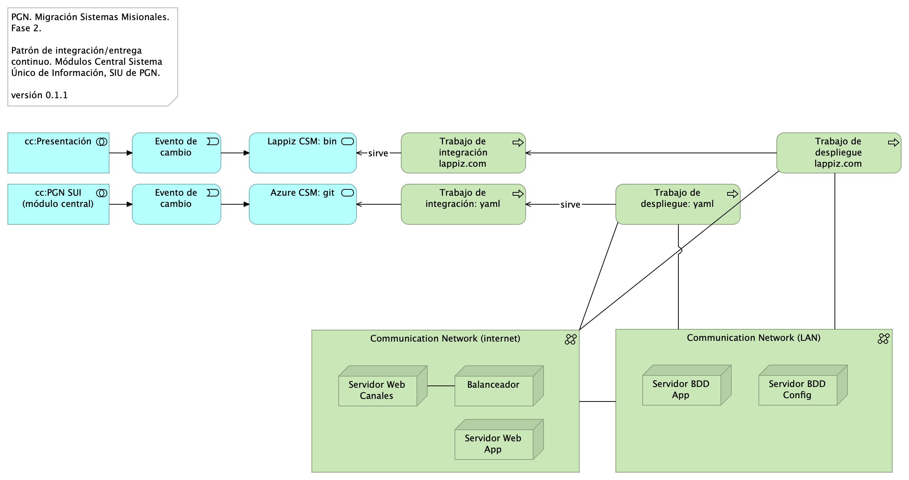

# Arquitectura de Software
* [Diagrama de Arquitectura de la Solución Propuesta: vista de integración](#diagrama-de-arquitectura-de-la-solución-propuesta:-vista-de-integración)
	* [Migracion.1a.b.SUI Contexto Módulos](#migracion.1a.b.sui-contexto-módulos)
	* [Migracion.1a.a.SUI Contexto Módulo](#migracion.1a.a.sui-contexto-módulo)
* [Diagrama de Arquitectura de la solución propuesta: vista física](#diagrama-de-arquitectura-de-la-solución-propuesta:-vista-física)
	* [Lineabase.0.SUI Aplicación. Física](#lineabase.0.sui-aplicación.-física)
* [Diagrama de Arquitectura de la Solución Propuesta: motivadores del negocio](#diagrama-de-arquitectura-de-la-solución-propuesta:-motivadores-del-negocio)
	* [Migracion.1a.a.SUI Contexto Módulo](#migracion.1a.a.sui-contexto-módulo)
	* [Riesgos.1. Migración funcional](#riesgos.1.-migración-funcional)
	* [Riesgos.2. Modelo Riesgo RSG10](#riesgos.2.-modelo-riesgo-rsg10)
	* [Riesgos.3. Modelo Riesgo RSG11](#riesgos.3.-modelo-riesgo-rsg11)
* [Diagrama de Arquitectura de la Solución Propuesta: interoperabilidad](#diagrama-de-arquitectura-de-la-solución-propuesta:-interoperabilidad)
	* [Migracion.1c.SUI Módulos Colaboración Aplicaciones](#migracion.1c.sui-módulos-colaboración-aplicaciones)
	* [Migracion.1d.SUI Módulos Colaboración Datos](#migracion.1d.sui-módulos-colaboración-datos)
* [Diagrama de Arquitectura de la Solución Propuesta: gestión de autenticación, usuarios y roles](#diagrama-de-arquitectura-de-la-solución-propuesta:-gestión-de-autenticación,-usuarios-y-roles)
	* [Seguridad.2. Lineabase.0.SUI Aplicación](#seguridad.2.-lineabase.0.sui-aplicación)
* [Diagrama de Clases y Componentes de solución](#diagrama-de-clases-y-componentes-de-solución)
	* [Migracion.1b.1. SUI Módulos Componentes](#migracion.1b.1.-sui-módulos-componentes)
	* [Migracion.1b.3. SUI Módulos Clases](#migracion.1b.3.-sui-módulos-clases)
	* [Migracion.1b.2. SUI Módulos Componentes. Brecha](#migracion.1b.2.-sui-módulos-componentes.-brecha)
* [Diagrama de Arquitectura de Integración Continua, DevOps y Despliegues de Capas](#diagrama-de-arquitectura-de-integración-continua,-devops-y-despliegues-de-capas)
	* [Migracion.4. CI](#migracion.4.-ci)
* [Documento de Relación de Tecnologías y Licenciamiento](#documento-de-relación-de-tecnologías-y-licenciamiento)
	* [Migracion.5. Licenciamiento](#migracion.5.-licenciamiento)
* [Requerimientos de Seguridad](#requerimientos-de-seguridad)
	* [Seguridad.3. Autenticación](#seguridad.3.-autenticación)
	* [Seguridad.4. Autorización](#seguridad.4.-autorización)
	* [Seguridad.5.Desarrollo Seguro](#seguridad.5.desarrollo-seguro)
	* [Seguridad. 6. Auditoría](#seguridad.-6.-auditoría)
	* [Seguridad. 7. Owasp](#seguridad.-7.-owasp)

\newpage

# Diagrama de Arquitectura de la Solución Propuesta: vista de integración
## Migracion.1a.b.SUI Contexto Módulos
{#fig:Migracion.1a.b.SUIContextoMódulos width=}

La vista presenta en contexto a los módulos SUI migrados y el estilo de comunicación vía API sincrónica/asincrónica (en verde en la imagen).

Cada módulo migrado atiende al funcionario que le corresponde, por ejemplo, Relatoría atiende a la dependencia Jurídica de la PGN. Los módulos comparten su información mediante el API local presente dentro de cada uno. Esto es, la información se mantiene protegida dentro de los dominios pero coordinada (se comparte con otros dominios).

El arreglo de datos de registros operativos y transaccionales es como sigue: cada módulo individual mantiene su registro de datos, estado y transacciones minimizado y protegido (individual y aislado). Salvo excepciones no consentidas por el diseño original, un módulo puede compartir el mismo almacén de datos con otro.

La coordinación de transacciones es realizada por la colaboración de las otras API individuales de cada módulo. Por ejemplo, si una relatoría nueva requiere alguna validación de Hominis, el módulo coordinador (c) inicia la transacción hacia Homini, y este, el módulo proveedor (p) responde con el resultado de la validación. El módulo coordinador misma operación se repite cuando la transacción involucra a más módulos proveedores (p). 

### Catálogo de Elementos
| Nombre| Tipo| Descripción| Prop.
|:--------|:--------|:--------|:--------|
|**cc:Administración**|application-collaboration|||
|**cc:Administración 2**|application-collaboration|||
|**cc:Administración 3**|application-collaboration|||
|**cc:Administración N**|application-collaboration|||
|**cc:Almacenamiento**|application-collaboration|Espacio de almacenamiento operativo y transaccional de un módulo central del SUI migrado.||
|**cc:Almacenamiento 2**|application-collaboration|Espacio de almacenamiento operativo y transaccional de un módulo central del SUI migrado.||
|**cc:Almacenamiento 3**|application-collaboration|Espacio de almacenamiento operativo y transaccional de un módulo central del SUI migrado.||
|**cc:Almacenamiento N**|application-collaboration|Espacio de almacenamiento operativo y transaccional de un módulo central del SUI migrado.||
|**cc:PGN SUI (módulo central)**|application-collaboration|Módulo central SUI migrado. Módulo independiente y asignado a un dominio particular de la PGN. ||
|**cc:PGN SUI (módulo central) 2**|application-collaboration|Módulo central SUI migrado. Módulo independiente y asignado a un dominio particular de la PGN. ||
|**cc:PGN SUI (módulo central) 3**|application-collaboration|Módulo central SUI migrado. Módulo independiente y asignado a un dominio particular de la PGN. ||
|**cc:PGN SUI (módulo central) N**|application-collaboration|Módulo central SUI migrado. Módulo independiente y asignado a un dominio particular de la PGN. ||
|**cc:Portales y canales**|application-collaboration|Submódulo de portales internos de la PGN a donde llega el SUI. Interfaz web que usa al SUI para llegar a direcciones y subdirecciones de la PGN. La plataforma principal de portales en este contexto es SharePoint de Microsoft. ||
|**cc:Presentación**|application-collaboration|Submódulo de presentación del SUI. interfaz gráfica, interfaz web visible a los usuarios clientes y funcionarios de la PGN. ||
|**cc:Servicios de aplicación**|application-collaboration|Submódulo de servicios utilitarios que sirven al SUI. Servicios variados que cumplen roles facilitadores de las actividades misionales del SUI. Ejemplos de estos servicios son los de gestión documental, implementado por Doku en el contexto de PGN. ||
|**API SUI**|application-interface|API de representación del módulo. Centralización de la comunicación con otros módulos del SUI migrado. ||
|**API SUI 2**|application-interface|API de representación del módulo. Centralización de la comunicación con otros módulos del SUI migrado. ||
|**API SUI 3**|application-interface|API de representación del módulo. Centralización de la comunicación con otros módulos del SUI migrado. ||
|**API SUI N**|application-interface|API de representación del módulo. Centralización de la comunicación con otros módulos del SUI migrado. ||
|**Cliente PGN**|business-actor|||
|**Cliente PGN**|business-actor|||
|**Cliente PGN**|business-actor|||
|**Cliente PGN**|business-actor|||
|**Funcionario PGN**|business-actor|||
|**Funcionario PGN**|business-actor|||
|**Funcionario PGN**|business-actor|||
|**Funcionario PGN**|business-actor|||

 

## Migracion.1a.a.SUI Contexto Módulo
{#fig:Migracion.1a.a.SUIContextoMódulo width=}

Identificación de submódulos del Sistema Único de Información (SUI) de la PGN. 

Todos los sistemas de información del SUI deben seguir la directiva de separar a los componentes misionales de los utilitarios: el SUI de PGN estará constituidos por submódulos dispuestos en relación de utilitarios (que sirven) a los componentes misionales del SUI, ubicados en el centro del diagrama.

Los submódulos del SUI, tal como están presentados, reúnen a las partes por el mismo rol en favor de la coherencia. Por ejemplo, los servicios de aplicación, en la imagen, contiene a todos aquellos utilitarios que prestan alguna utilidad momentánea al SUI migrado. Organizados así, estos submódulos utilitarios pueden ser intercambiados o ampliados sin perjuicio de los componentes misionales del SUI (centro del diagrama) gracias a las _interfaces de unión_ en favor de la extensibilidad.

Las interfaces de unión indicadas arriba obligan a los submódulos a cumplir las exigencias de los componentes misionales del SUI.

Los submódulos identificados tienen los siguientes roles para el SUI migrado:

1. cc:Presentación
1. cc:Servicios de aplicación
1. cc:Portales y canales
1. cc:Administración y configuración
1. cc:Almacenamiento

### Requerimientos Asociados a los Submódulos
La disposición de los módulos y submódulos presentada, denominada SUI Migración en adelante, facilita la focalización de los requerimientos encontrados en el levantamiento realizado en el actual proyecto. Así, por ejemplo, los requerimientos funcionales se encuentran concentrados en el submódulo de presentación (ver imagen).

### Catálogo de Elementos
| Nombre| Tipo| Descripción| Prop.
|:--------|:--------|:--------|:--------|
|**cc:Administración**|application-collaboration|||
|**cc:Almacenamiento**|application-collaboration|Espacio de almacenamiento operativo y transaccional de un módulo central del SUI migrado.||
|**cc:PGN SUI (módulo central)**|application-collaboration|Módulo central SUI migrado. Módulo independiente y asignado a un dominio particular de la PGN. ||
|**cc:Portales y canales**|application-collaboration|Submódulo de portales internos de la PGN a donde llega el SUI. Interfaz web que usa al SUI para llegar a direcciones y subdirecciones de la PGN. La plataforma principal de portales en este contexto es SharePoint de Microsoft. ||
|**cc:Presentación**|application-collaboration|Submódulo de presentación del SUI. interfaz gráfica, interfaz web visible a los usuarios clientes y funcionarios de la PGN. ||
|**cc:Servicios de aplicación**|application-collaboration|Submódulo de servicios utilitarios que sirven al SUI. Servicios variados que cumplen roles facilitadores de las actividades misionales del SUI. Ejemplos de estos servicios son los de gestión documental, implementado por Doku en el contexto de PGN. ||
|**interfaz**|application-interface|||
|**interfaz**|application-interface|||
|**interfaz**|application-interface|||
|**interfaz**|application-interface|||
|**interfaz**|application-interface|||
|**Cliente PGN**|business-actor|||
|**Funcionario PGN**|business-actor|||
|**ARQ01. Consistencia SUI**|constraint|Unifica las entidades de negocio PGN, entre las que se incluyen a conciliaciones, publicaciones de relatoría, resoluciones, en artefactos reutilizables. Distinto de que estas entidades (y su lógica de negocio) estén dispersos entre los sistemas del SUI, estarán concentradas en un único artefacto correspondiente. Calidad sistémica: la consistencia persigue que el resultado de la lógica de negocio sea la misma entre los módulos del SUI migrado. Esto redunda a mantenibilidad y gestión: tiende a tener un solo punto de cambio y dificulta la transferencia de dependencias implícitas a otros procesos.||
|**ARQ02. Mantenibilidad SUI**|constraint|Evitar las dependencias transitivas de los módulos misionales del SUI a componentes y sistemas de terceros o submódulos no misionales.  Calidad sistémica: la mantenibilidad por control de dependencias que optimiza el diseño Migración SUI está dada por el control de cambios no programados sobre los componentes misionales del SUI (corrupción de componentes). Ver Patrón de Diseño Migración SUI, más adelante en el documento.||
|**ARQ03. Extensibilidad SUI**|constraint|Concentración de los componentes de negocio, misionales, del SUI protegidos de cambios provenientes de otros sistemas. Ver Patrón de Diseño Migración SUI, más adelante en el documento. Calidad sistémica: la extensibilidad que optimiza el diseño Migración SUI está dada por el intercambio de submódulos no misionales, como el gestor documental, sin afectación de los componentes misionales que este diseño protege.||
|**RQR. Administrativos**|requirement|||
|**RQR. Funcionales**|requirement|||
|**RQR. Ingeniería**|requirement|||
|**RQR. Negocio**|requirement|||
|**RQR. Seguridad**|requirement|Requerimientos de seguridad, SUI, Migración, en aspectos de comunicación, autenticación, autorización y (manejo de) sesiones. ||
|**RQR. Seguridad**|requirement|Requerimientos de seguridad, SUI, Migración, en aspectos de comunicación, autenticación, autorización y (manejo de) sesiones. ||

 

\newpage

# Diagrama de Arquitectura de la solución propuesta: vista física
## Lineabase.0.SUI Aplicación. Física
{#fig:Lineabase.0.SUIAplicación.Física width=}

Procuraduría General de la Nación (PGN), módulo $APLICATIVO, 2023. Elementos físicos que soportan a la aplicación doc $APLICATIVO de la PGN, actual Fase I y existente en Fase II. Presentación de componentes de software y tecnología física (hardware) implementados en la Fase I y requeridos por Fase II (presente proyecto).

### Representación de Arquitectura
Con una arquitectura orientada a servicios $APLICATIVO recopila:

1. Runtime: Es el servicio que interactúa con el usuario final (GUI) elaborado en Angular 11
1. API Tx: Servicio API REST Base Node encargado de realizar las transacciones básicas CRUD
1. API Config / Seguridad. Servicio Web API .Net Framework encargado de gestionar características con la autenticación y configuración

 

### Especificaciones Plataformas y Versiones
* Angular, versión 11
* Node Js, versión 14.16
* Net Entity Framework, versión 4.7
* Sequelize, versión 5.3

 

### Especificaciones de Librerías y Dependencias
* Web Server (IIS) role
* Windows Process Activation Service feature
* Microsoft .NET Framework version 3.5
* Microsoft .NET Framework version 4.7.2
* Microsoft SQL Server 2012 Service Pack 4 Native Client
* Microsoft WCF Data Services 5.6
* Microsoft Identity Extensions
* Microsoft Information Protection and Control Client 2.1 (MSIPC)
* Cumulative Update Package 7 for Microsoft AppFabric 1.1 for Windows Server (KB 3092423)
* Visual C++ Redistributable Package for Visual Studio 2012
* Visual C++ Redistributable Package for Visual Studio 2017

 

### Especificaciones Base de Servidores

| Servidor de Aplicaciones | Especificaciones del Servidor            |
|-------------------|-------------------------------------------------|
| Sistema Operativo | Windows Server 2019 Standard or Datacenter x64  |
| RAM               | 16 GB                                            |
| CPU               | 64 Bits, mínimo 4 Cores > 2 Ghz                 |
| Discos            | C: 120 GB, D: 16 GB    |    
| Físico/virtual    | Virtual                                         |
| Roles / Features  | Web Server (IIS) role                           |
|                   | Windows Process Activation Service feature      |
|                   | Microsoft .NET Framework version 3.5            |

 

### Catálogo de Elementos
| Nombre| Tipo| Descripción| Prop.
|:--------|:--------|:--------|:--------|
|**Application Collaboration**|application-collaboration|||
|**Application Collaboration**|application-collaboration|||
|**App**|application-component||*plataforma:* node Js *brecha:* 100 |
|**App PGN Móvil**|application-component| |*plantilla:* element-md-bold *brecha:* 100 |
|**App PGN Web**|application-component||*plataforma:* angular 11 *brecha:* 100 |
|**Config**|application-component||*plataforma:* cs |
|**Punto acceso público**|application-interface|URL tipo C HTTP||
|**Application Service (NLB)**|application-service||*plataforma:* angular 11 *brecha:* 100 |
|**Interfaz de datos 1**|application-service|||
|**Interfaz de datos 2**|application-service|||
|**Communication Network (DMZ)**|communication-network|||
|**Communication Network (LAN)**|communication-network|||
|**Communication Network (internet)**|communication-network|||
|**Balanceador**|node|||
|**Servidor BDD App**|node|Sistema Operativo Windows Server 2019 Standard o Datacenter x64. RAM	8 GB. CPU 64 Bits, 4 Cores > 2 Ghz. Discos SO C: 126 GB, Backup E: 511 GB, SQL Data F: 510 GB, SQL Log   G: 510 GB, TempDB  G: 63.6 GB. ||
|**Servidor BDD Config**|node|Sistema Operativo Windows Server 2019 Standard o Datacenter x64. RAM	8 GB. CPU 64 Bits, 4 Cores > 2 Ghz. Discos SO C: 80 GB, Backup E: 250 GB, SQL Data F: 250 GB, SQL Log G: 250 GB, TempDB  G: 30 GB. ||
|**Servidor Web App**|node|Windows Server 2019 Standard o Datacenter x64. Nombre físico. IP LAN. IP Pública. Windows Server 2019 Standard or Datacenter x64. RAM 8  GB. CPU	64 Bits. 4 Cores de 2 Ghz. Discos SO C: 126 GB. SO D: 16 GB. ||
|**Servidor Web Canales**|node|Windows Server 2019 Standard o Datacenter x64. Nombre físico. IP LAN. IP Pública. Windows Server 2019 Standard or Datacenter x64. RAM	8  GB. CPU	64 Bits. 4 Cores de 2 Ghz. Discos	SO C: 126 GB. SO D: 16 GB. ||
|**www pgn com**|technology-interface|||

 

\newpage

# Diagrama de Arquitectura de la Solución Propuesta: motivadores del negocio
## Migracion.1a.a.SUI Contexto Módulo
{#fig:Migracion.1a.a.SUIContextoMódulo width=}

Identificación de submódulos del Sistema Único de Información (SUI) de la PGN. 

Todos los sistemas de información del SUI deben seguir la directiva de separar a los componentes misionales de los utilitarios: el SUI de PGN estará constituidos por submódulos dispuestos en relación de utilitarios (que sirven) a los componentes misionales del SUI, ubicados en el centro del diagrama.

Los submódulos del SUI, tal como están presentados, reúnen a las partes por el mismo rol en favor de la coherencia. Por ejemplo, los servicios de aplicación, en la imagen, contiene a todos aquellos utilitarios que prestan alguna utilidad momentánea al SUI migrado. Organizados así, estos submódulos utilitarios pueden ser intercambiados o ampliados sin perjuicio de los componentes misionales del SUI (centro del diagrama) gracias a las _interfaces de unión_ en favor de la extensibilidad.

Las interfaces de unión indicadas arriba obligan a los submódulos a cumplir las exigencias de los componentes misionales del SUI.

Los submódulos identificados tienen los siguientes roles para el SUI migrado:

1. cc:Presentación
1. cc:Servicios de aplicación
1. cc:Portales y canales
1. cc:Administración y configuración
1. cc:Almacenamiento

### Requerimientos Asociados a los Submódulos
La disposición de los módulos y submódulos presentada, denominada SUI Migración en adelante, facilita la focalización de los requerimientos encontrados en el levantamiento realizado en el actual proyecto. Así, por ejemplo, los requerimientos funcionales se encuentran concentrados en el submódulo de presentación (ver imagen).

### Catálogo de Elementos
| Nombre| Tipo| Descripción| Prop.
|:--------|:--------|:--------|:--------|
|**cc:Administración**|application-collaboration|||
|**cc:Almacenamiento**|application-collaboration|Espacio de almacenamiento operativo y transaccional de un módulo central del SUI migrado.||
|**cc:PGN SUI (módulo central)**|application-collaboration|Módulo central SUI migrado. Módulo independiente y asignado a un dominio particular de la PGN. ||
|**cc:Portales y canales**|application-collaboration|Submódulo de portales internos de la PGN a donde llega el SUI. Interfaz web que usa al SUI para llegar a direcciones y subdirecciones de la PGN. La plataforma principal de portales en este contexto es SharePoint de Microsoft. ||
|**cc:Presentación**|application-collaboration|Submódulo de presentación del SUI. interfaz gráfica, interfaz web visible a los usuarios clientes y funcionarios de la PGN. ||
|**cc:Servicios de aplicación**|application-collaboration|Submódulo de servicios utilitarios que sirven al SUI. Servicios variados que cumplen roles facilitadores de las actividades misionales del SUI. Ejemplos de estos servicios son los de gestión documental, implementado por Doku en el contexto de PGN. ||
|**interfaz**|application-interface|||
|**interfaz**|application-interface|||
|**interfaz**|application-interface|||
|**interfaz**|application-interface|||
|**interfaz**|application-interface|||
|**Cliente PGN**|business-actor|||
|**Funcionario PGN**|business-actor|||
|**ARQ01. Consistencia SUI**|constraint|Unifica las entidades de negocio PGN, entre las que se incluyen a conciliaciones, publicaciones de relatoría, resoluciones, en artefactos reutilizables. Distinto de que estas entidades (y su lógica de negocio) estén dispersos entre los sistemas del SUI, estarán concentradas en un único artefacto correspondiente. Calidad sistémica: la consistencia persigue que el resultado de la lógica de negocio sea la misma entre los módulos del SUI migrado. Esto redunda a mantenibilidad y gestión: tiende a tener un solo punto de cambio y dificulta la transferencia de dependencias implícitas a otros procesos.||
|**ARQ02. Mantenibilidad SUI**|constraint|Evitar las dependencias transitivas de los módulos misionales del SUI a componentes y sistemas de terceros o submódulos no misionales.  Calidad sistémica: la mantenibilidad por control de dependencias que optimiza el diseño Migración SUI está dada por el control de cambios no programados sobre los componentes misionales del SUI (corrupción de componentes). Ver Patrón de Diseño Migración SUI, más adelante en el documento.||
|**ARQ03. Extensibilidad SUI**|constraint|Concentración de los componentes de negocio, misionales, del SUI protegidos de cambios provenientes de otros sistemas. Ver Patrón de Diseño Migración SUI, más adelante en el documento. Calidad sistémica: la extensibilidad que optimiza el diseño Migración SUI está dada por el intercambio de submódulos no misionales, como el gestor documental, sin afectación de los componentes misionales que este diseño protege.||
|**RQR. Administrativos**|requirement|||
|**RQR. Funcionales**|requirement|||
|**RQR. Ingeniería**|requirement|||
|**RQR. Negocio**|requirement|||
|**RQR. Seguridad**|requirement|Requerimientos de seguridad, SUI, Migración, en aspectos de comunicación, autenticación, autorización y (manejo de) sesiones. ||
|**RQR. Seguridad**|requirement|Requerimientos de seguridad, SUI, Migración, en aspectos de comunicación, autenticación, autorización y (manejo de) sesiones. ||

 

## Riesgos.1. Migración funcional
{#fig:Riesgos.1.Migraciónfuncional width=}

Riesgos de la migración funcional:

* RSG1. Estrategia CMS central
* RSG2. Motor de búsqueda
* RSG3. Estratego como BI
* RSG4. Conciliación y Doku
* RSG5. Gestión de sesiones / caducidad
* RSG6. Componentes de negocio
* RSG7. Asignación de roles y permisos de Acceso 
* RSG8. Intentos de accesos no autorizados
* RSG9. Alteración de datos negocio
* RSG10. Validación decisiones de arquitectura
* RSG11. Estrategias de Migración de datos
* RSG12. Arquitectura de almacenamiento y distribución de datos $APLICATIVO
* RSG13. Sistema de autenticación híbrido

### Acciones de Mitigación

1. Informar a la PGN de las implicaciones junto con alternativas para la implementación de la acción de aprovechamiento: diseño del SCM central (SharePoint). La PGN debe decidir si o no a la acción propuesta.

1. Informar a la PGN de las implicaciones junto con alternativas para la implementación de la acción de aprovechamiento: diseño del motor de búsqueda compartido (SharePoint). La PGN debe decidir si o no a la acción propuesta.

1. Informar a la PGN de las implicaciones junto con alternativas para la implementación de la acción de manejo del riesgo: diseño de solución de inteligencia de negocio (Power BI). La PGN debe decidir si o no a la acción propuesta.

1. Informar a la PGN de las implicaciones junto con alternativas para la implementación de la acción de manejo del riesgo: ubicar la lógica, los flujos, y los datos misionales dentro del doc $APLICATIVO. La PGN debe decidir si o no a la acción propuesta.

1. Informar a la PGN de las implicaciones junto con alternativas para la implementación de la acción de manejo del riesgo: facilitar la administración de seguridad en un solo lugar (distinto de localizarla en las aplicaciones web). La PGN debe decidir si o no a la acción propuesta.

### Catálogo de Elementos
| Nombre| Tipo| Descripción| Prop.
|:--------|:--------|:--------|:--------|
|**RSG1. Estrategia CMS central**|constraint|Establecer desde el principio el gestor de contenidos compartido que los módulos del SUI migrados van a usar. ||
|**RSG10. Validación decisiones de arquitectura**|constraint|Discutir la arquitectura de referencia de SUI Migración PGN. La arquitectura de referencia SUI informa de todas las fortalezas y consideraciones estructurales y de sistema, como extensibilidad, rendimiento y seguridad, que regirán a todos los módulos del SUI migrado. ||
|**RSG11. Estrategias de Migración de datos**|constraint|Discutir el alcance y los recursos para la correcta migración de datos incluidas en contrato 078, Migración Funcional $APLICATIVO en atención al numeral 5.6 del anexo técnico del proyecto. | 5.6 MIGRACIÓN DE DATOS | Dentro del alcance de las actividades a desarrollar, el proveedor debe generar los mecanismos adecuados para hacer migración de la información que se encuentre en los sistemas actuales y que, por evolución de este, tenga datos relevantes que deban ser migrados a los ambientes y/o sistemas de información productos de la fábrica. | | Para este servicio el proveedor debe disponer del personal idóneo y las herramientas necesarias para hacer efectiva las actividades de migración de datos, utilizando las mejores prácticas de Extracción-Transformación-Carga (ETL) y protocolos de control de versiones robustos. Esta labor debe ser coordinada con las personas de la entidad que sean designadas por la Oficina de Tecnología, Innovación y Transformación Digital. ||
|**RSG12. Arquitectura de almacenamiento y distribución de datos SUI**|constraint|Definir la opción de organización y distribución de los almacenes de datos del $APLICATIVO.  opc1. Dispositivo físico/virtual (nodo, servidor, y esquema de base de datos) único, central, a todos los módulos del $APLICATIVO. opc2. Dispositivos virtuales autónomos por dominio de negocio: relatoría, inventario, información estratégica, intercomunicados. ||
|**RSG13. Sistema de autenticación híbrido**|constraint|Definir la estrategia de autenticación del $APLICATIVO (aplicable a todos los módulos del este). opc1. Híbrida: integrado, directorio empresarial (LDAP), y servicios de autenticación de confianza: Office 365 de PGN. opc2. Servicio de autenticación de confianza: Office 365 de PGN. ||
|**RSG2. Motor de búsqueda compartido**|constraint|Establecer desde el principio el motor de búsqueda de contenidos compartido para los módulos del SUI migrados. ||
|**RSG3. Estratego como BI**|constraint|Definir la arquitectura de Estratego migrado: puede ser una solución de BI simple, o puede ser una aplicación web tradicional. ||
|**RSG4. Conciliación y gestión documental (Doku)**|constraint|Definir la ubicación de los componentes misionales de Conciliación Administrativa ($APLICATIVO). Debe estar fuera de Doku. ||
|**RSG5. Gestión de sesiones / caducidad**|constraint|Establecer desde el principio el motor de búsqueda de contenidos compartido para los módulos del SUI migrados. ||
|**RSG6. Componentes de negocio**|constraint|Incluir el esfuerzo de creación de componentes estructurales y comunes a los módulos del SUI migrado requeridos por la arquitectura de referencia SUI.  Algunos componentes requeridos son: * Administración de autorizaciones (integrado con el directorio PGN) * Motor de flujos de trabajo para diseño y organización del trabajo (Conciliación) * Componente de ruteo de documentos (Relatoría) ||
|**RSG7. Asignación de roles y permisos de Acceso **|constraint|RSG7. Asignación de roles y permisos de Acceso. Los riesgos de autenticación como el Single Sign On (SSO), permite que si las credenciales de usuario se ven comprometidas, pueden dar permiso a un atacante acceder a todos o la mayoría de recursos y aplicaciones en la red. Se ha propuesto controlar los accesos a partir de la documentación que identifica la metodología de clasificación y gestión de usuarios roles y procesos de autenticación, a partir del control de acceso basado en roles RBAC (Identidades y autenticación), que permite tener una reacción más oportuna para controlar los accesos a diferentes módulos de los diferentes sistemas de Información.  Los inicios de sesión de los usuarios asociados a cuenta de dominio de Active Directory deben tener en cuenta la asignación de roles de ingreso al servidor o roles de ingreso al motor de bases de datos. Las cuentas de usuario no deben ser creadas de administrador local (administrador), es una puerta de entrada para los ataques de fuerza bruta. ||
|**RSG8. Intentos de accesos no autorizados**|constraint|RSG8. Intentos de accesos no autorizados. Los intentos no autorizados son una de las técnicas más comunes utilizadas en la actualidad, los diferentes tipos de amenazas de intrusiones SQL Injections, Denegaciones de Servicios, riesgos de Ransomware, Ingeniería social, malware y otras amenazas, permite que se proponga implementación de soluciones de Seguridad perimetral a partir de la implementación de WAF para controlar las peticiones externas y evaluación de vulnerabilidades y escaneo para conocer puertos abiertos y establecer medidas. ||
|**RSG9. Alteración de datos negocio**|constraint|RSG9. Alteración de datos almacenados en Base de Datos. Se deberán asignar usuarios para la conexión de cada base de datos. Se debe proporcionar seguridad a nivel de filas y columnas (ofuscamiento) para proteger los datos confidenciales en el nivel de columnas y filas RLS ((seguridad de nivel de fila). Algunos de los métodos y características que se deben tener en cuenta a implementar es a partir del Alway encrypted, para cifrar los datos que se encuentran almacenados.  ||
|**Riesgos Técnicos Migración Funcional SUI (078)**|constraint|Conjunto de riesgos técnicos y arquitectura. Proyecto Migración SUI 2023, PGN. ||

 

## Riesgos.2. Modelo Riesgo RSG10
{#fig:Riesgos.2.ModeloRiesgoRSG10 width=}

Para mitigar el riesgo 10, RSG10. Validación decisiones de arquitectura, que tiene como agente de riesgo a los arquitectos del contratista, Softgic, y al de la entidad, PGN, es necesario iniciar un proceso de evaluación y aprobación de la arquitectura. La frecuencia de este proceso será eventual, y como mínimo una vez cada dos semanas.

### Valoración del Riesgo

| Requisito      | Extensibilidad SUI |
|:-------------|:------------------|
| Descripción | Concentración de los componentes de negocio, misionales, del SUI protegidos de cambios provenientes de otros sistemas. Ver Patrón de Diseño Migración SUI, más adelante en el documento. |
| Calidad sistémica | La extensibilidad que optimiza el diseño Migración SUI está dada por el intercambio de submódulos no misionales, como el gestor documental, sin afectación de los componentes misionales que este diseño protege. |

Table: Valoración del riesgo RSG10. Validación decisiones de arquitectura. Migración SUI. {#tbl:requisito1-id}

### Catálogo de Elementos
| Nombre| Tipo| Descripción| Prop.
|:--------|:--------|:--------|:--------|
|**Impacto**|assessment|||
|**Agente de riesgo PGN**|business-actor|Arquitecto PGN||
|**Agente de riesgo Softgic**|business-actor|Arquitecto Softgic||
|**Desconocimiento arq. de referencia SUI**|business-event|||
|**RSG10. Validación decisiones de arquitectura**|constraint|Discutir la arquitectura de referencia de SUI Migración PGN. La arquitectura de referencia SUI informa de todas las fortalezas y consideraciones estructurales y de sistema, como extensibilidad, rendimiento y seguridad, que regirán a todos los módulos del SUI migrado. ||
|**Evaluación  arquitectura de referencia SUI**|course-of-action|La frecuencia del proceso de evaluación de la arquitectura es eventual, mínimo una vez cada dos semanas. ||
|**Definición tipos de datos módulos SUI**|requirement|||
|**Supervisor contrato 078-2023**|stakeholder|||

 

## Riesgos.3. Modelo Riesgo RSG11
{#fig:Riesgos.3.ModeloRiesgoRSG11 width=}

Para mitigar el riesgo 10, RSG10. Validación decisiones de arquitectura, que tiene como agente de riesgo a los arquitectos del contratista, Softgic, y al de la entidad, PGN, es necesario iniciar un proceso de evaluación y aprobación de la arquitectura. La frecuencia de este proceso será eventual, y como mínimo una vez cada dos semanas.

### Valoración del Riesgo

| Requisito      | Extensibilidad SUI |
|:-------------|:------------------|
| Descripción | Concentración de los componentes de negocio, misionales, del SUI protegidos de cambios provenientes de otros sistemas. Ver Patrón de Diseño Migración SUI, más adelante en el documento. |
| Calidad sistémica | La extensibilidad que optimiza el diseño Migración SUI está dada por el intercambio de submódulos no misionales, como el gestor documental, sin afectación de los componentes misionales que este diseño protege. |

Table: Valoración del riesgo RSG10. Validación decisiones de arquitectura. Migración SUI. {#tbl:requisito1-id}

### Catálogo de Elementos
| Nombre| Tipo| Descripción| Prop.
|:--------|:--------|:--------|:--------|
|**Impacto**|assessment|Excedente de trabajo en del proyecto 078, esfuerzo y presupuesto.||
|**Agente de riesgo PGN**|business-actor|Arquitecto PGN||
|**Agente de riesgo Softgic**|business-actor|Arquitecto Softgic||
|**Gestión alcance tipos de datos y criterios aceptación migración datos**|business-event|||
|**RSG11. Estrategias de Migración de datos**|constraint|Discutir el alcance y los recursos para la correcta migración de datos incluidas en contrato 078, Migración Funcional $APLICATIVO en atención al numeral 5.6 del anexo técnico del proyecto. | 5.6 MIGRACIÓN DE DATOS | Dentro del alcance de las actividades a desarrollar, el proveedor debe generar los mecanismos adecuados para hacer migración de la información que se encuentre en los sistemas actuales y que, por evolución de este, tenga datos relevantes que deban ser migrados a los ambientes y/o sistemas de información productos de la fábrica. | | Para este servicio el proveedor debe disponer del personal idóneo y las herramientas necesarias para hacer efectiva las actividades de migración de datos, utilizando las mejores prácticas de Extracción-Transformación-Carga (ETL) y protocolos de control de versiones robustos. Esta labor debe ser coordinada con las personas de la entidad que sean designadas por la Oficina de Tecnología, Innovación y Transformación Digital. ||
|**Evaluación tipos de datos, actividades y herramientas**|course-of-action|La frecuencia del proceso de evaluación de la arquitectura es eventual, mínimo una vez cada dos semanas. ||
|**Implementación de sincronización y lectura datos (migrados)**|course-of-action|La frecuencia del proceso de evaluación de la arquitectura es eventual, mínimo una vez cada dos semanas. ||
|**Definición mecanismo sincronización y extracción (lectura)**|requirement|||
|**Definición tipos de datos módulos SUI**|requirement|||
|**Supervisor contrato 078-2023**|stakeholder|||

 

\newpage

# Diagrama de Arquitectura de la Solución Propuesta: interoperabilidad
## Migracion.1c.SUI Módulos Colaboración Aplicaciones
{#fig:Migracion.1c.SUIMódulosColaboraciónAplicaciones width=}

Patrón de Distribución y Colaboración estándar para el SUI.

La colaboración y comunicación de los componentes internos del SUI (grupo PFN SUI, en el diagrama) está mediada por interfaces. Estas son provistas por el grupo de componentes misionales, PGN SUI, hacia los submódulos externos. La intención es mantener reducido y controlado el número de interfaces.

La colaboración entre el SUI Migración con sistemas externos puede darse mediante API de comunicación (o buses de datos empresarial que ya disponga la PGN), sin perjuicio del patrón de comunicación estándar descrito en el diagrama.

Los únicos elementos para la comunicación (e integración) son los indicados en la vista actual. En este diseño no considera tipos de comunicación mediante  mensajería, datos, u otros no mencionados en la vista.

### Catálogo de Elementos
| Nombre| Tipo| Descripción| Prop.
|:--------|:--------|:--------|:--------|
|**cc:Almacenamiento**|application-collaboration|Espacio de almacenamiento operativo y transaccional de un módulo central del SUI migrado.||
|**cc:PGN SUI (módulo central)**|application-collaboration|Módulo central SUI migrado. Módulo independiente y asignado a un dominio particular de la PGN. ||
|**cc:PGN SUI (módulo central)**|application-collaboration|Módulo central SUI migrado. Módulo independiente y asignado a un dominio particular de la PGN. ||
|**cc:PGN SUI (módulo central) 2**|application-collaboration|Módulo central SUI migrado. Módulo independiente y asignado a un dominio particular de la PGN. ||
|**cc:Portales y canales**|application-collaboration|Submódulo de portales internos de la PGN a donde llega el SUI. Interfaz web que usa al SUI para llegar a direcciones y subdirecciones de la PGN. La plataforma principal de portales en este contexto es SharePoint de Microsoft. ||
|**App**|application-component||*plataforma:* node Js *brecha:* 100 |
|**API SUI**|application-interface|API de representación del módulo. Centralización de la comunicación con otros módulos del SUI migrado. ||
|**API SUI**|application-interface|API de representación del módulo. Centralización de la comunicación con otros módulos del SUI migrado. ||
|**API SUI 2**|application-interface|API de representación del módulo. Centralización de la comunicación con otros módulos del SUI migrado. ||

 

## Migracion.1d.SUI Módulos Colaboración Datos
{#fig:Migracion.1d.SUIMódulosColaboraciónDatos width=5.32in}

Modelo de acceso a datos de negocio del SIM. 

La imagen siguiente presenta la organización de los ítems de transporte de datos de negocio necesarios para que los módulos del SUI puedan recolectar, procesar, integrar y almacenarlo de forma organizada y escalable.

Mediante esta organización, los datos de negocio son transportados desde sus respectivas fuentes mediante interfaces (principio de extensión y mantenibilidad referidos en las restricciones de la arquitectura del SUI Migrado). Los datos externos, entendidos como los de otros proveedores, son obtenidos mediante un intermediario: una API externa (_reverse proxy_).

Consideramos tres tipos datos: datos transaccionales, históricos y externos, y presentamos una manera distinta de tratarlos y transportarlos.

### Catálogo de Elementos
| Nombre| Tipo| Descripción| Prop.
|:--------|:--------|:--------|:--------|
|**cc:PGN SUI (módulo central)**|application-collaboration|Módulo central SUI migrado. Módulo independiente y asignado a un dominio particular de la PGN. ||
|**cc:PGN SUI (módulo central)**|application-collaboration|Módulo central SUI migrado. Módulo independiente y asignado a un dominio particular de la PGN. ||
|**cc:PGN SUI (módulo central) 2**|application-collaboration|Módulo central SUI migrado. Módulo independiente y asignado a un dominio particular de la PGN. ||
|**cc:PGN SUI (módulo central) 2**|application-collaboration|Módulo central SUI migrado. Módulo independiente y asignado a un dominio particular de la PGN. ||
|**cc:PGN SUI (módulo central) 3**|application-collaboration|Módulo central SUI migrado. Módulo independiente y asignado a un dominio particular de la PGN. ||
|**cc:PGN SUI (módulo central) 3**|application-collaboration|Módulo central SUI migrado. Módulo independiente y asignado a un dominio particular de la PGN. ||
|**cc:PGN SUI (módulo central) N**|application-collaboration|Módulo central SUI migrado. Módulo independiente y asignado a un dominio particular de la PGN. ||
|**cc:PGN SUI (módulo central) N**|application-collaboration|Módulo central SUI migrado. Módulo independiente y asignado a un dominio particular de la PGN. ||
|**API SUI**|application-interface|API de representación del módulo. Centralización de la comunicación con otros módulos del SUI migrado. ||
|**API SUI**|application-interface|API de representación del módulo. Centralización de la comunicación con otros módulos del SUI migrado. ||
|**API SUI 2**|application-interface|API de representación del módulo. Centralización de la comunicación con otros módulos del SUI migrado. ||
|**API SUI 2**|application-interface|API de representación del módulo. Centralización de la comunicación con otros módulos del SUI migrado. ||
|**API SUI 3**|application-interface|API de representación del módulo. Centralización de la comunicación con otros módulos del SUI migrado. ||
|**API SUI 3**|application-interface|API de representación del módulo. Centralización de la comunicación con otros módulos del SUI migrado. ||
|**API SUI N**|application-interface|API de representación del módulo. Centralización de la comunicación con otros módulos del SUI migrado. ||
|**API SUI N**|application-interface|API de representación del módulo. Centralización de la comunicación con otros módulos del SUI migrado. ||
|**interfaz**|application-interface|||
|**interfaz**|application-interface|||
|**interfaz**|application-interface|||
|**interfaz**|application-interface|||
|**interfaz**|application-interface|||
|**interfaz**|application-interface|||
|**Communication Network (LAN)**|communication-network|||
|**Communication Network (LAN)**|communication-network|||
|**Grouping**|grouping|||
|**Grouping**|grouping|||
|**Servidor BDD App**|node|Sistema Operativo Windows Server 2019 Standard o Datacenter x64. RAM	8 GB. CPU 64 Bits, 4 Cores > 2 Ghz. Discos SO C: 126 GB, Backup E: 511 GB, SQL Data F: 510 GB, SQL Log   G: 510 GB, TempDB  G: 63.6 GB. ||
|**Servidor BDD App**|node|Sistema Operativo Windows Server 2019 Standard o Datacenter x64. RAM	8 GB. CPU 64 Bits, 4 Cores > 2 Ghz. Discos SO C: 126 GB, Backup E: 511 GB, SQL Data F: 510 GB, SQL Log   G: 510 GB, TempDB  G: 63.6 GB. ||
|**Servidor BDD App 2**|node|Sistema Operativo Windows Server 2019 Standard o Datacenter x64. RAM	8 GB. CPU 64 Bits, 4 Cores > 2 Ghz Discos	SO C: 126 GB, Backup E: 511 GB, SQL Data F: 510 GB, SQL Log   G: 510 GB, TempDB  G: 63.6 GB. ||
|**Servidor BDD App 3**|node|Sistema Operativo Windows Server 2019 Standard o Datacenter x64. RAM	8 GB. CPU 64 Bits, 4 Cores > 2 Ghz Discos	SO C: 126 GB, Backup E: 511 GB, SQL Data F: 510 GB, SQL Log   G: 510 GB, TempDB  G: 63.6 GB. ||
|**Servidor BDD App 4**|node|Sistema Operativo Windows Server 2019 Standard o Datacenter x64. RAM	8 GB. CPU 64 Bits, 4 Cores > 2 Ghz Discos	SO C: 126 GB, Backup E: 511 GB, SQL Data F: 510 GB, SQL Log   G: 510 GB, TempDB  G: 63.6 GB. ||
|**Servidor BDD Config**|node|Sistema Operativo Windows Server 2019 Standard o Datacenter x64. RAM	8 GB. CPU 64 Bits, 4 Cores > 2 Ghz. Discos SO C: 80 GB, Backup E: 250 GB, SQL Data F: 250 GB, SQL Log G: 250 GB, TempDB  G: 30 GB. ||

 

\newpage

# Diagrama de Arquitectura de la Solución Propuesta: gestión de autenticación, usuarios y roles
## Seguridad.2. Lineabase.0.SUI Aplicación
{#fig:Seguridad.2.Lineabase.0.SUIAplicación width=}

## Metodología Seguridad $APLICATIVO
Los mecanismos de autorización para el acceso a los sistemas de información de la Procuraduría General de la Nación describen la forma de cómo se restringe el acceso a los diferentes módulos Misionales (SIM), Registros de Inhabilidades (SIRI), Nómina, Control Interno y relatoría, entre otros, y que se considera un mecanismo de protección que ayuda a reaccionar ante cualquier operación no autorizada. 

El control de acceso basado en roles (RBAC), enfoca la idea de que a los funcionarios se les otorgue los permisos de acceso a los recursos, basados en los roles y/o perfiles que este posee. Este control posee dos características fundamentales: i) los accesos son controlados por medio de los roles y/o perfiles asignados, quiere decir, a los servidores públicos, contratistas, terceros y otros colaboradores autorizados para interactuar con los sistemas de información se le asignan los roles y el encargado/responsable definirá los permisos, que a su vez están relacionados con los roles, ii) Los roles pueden ser definidos a nivel jerárquico, es decir que un rol podrá ser miembro de otro rol.  

Un proceso de autorización basado en roles, identifica tres factores importantes, i) Todos los servidores públicos, contratistas, terceros y otros Colaboradores, deben tener un rol asignado, si no es asignado no podrá realizar ninguna acción relacionada con el acceso, ii) un usuario podrá hacer uso de los permisos asociados a los roles asignados, el cual deberá realizar el inicio de sesión el usuario asignado del Directorio activo (DA), iii) los servidores públicos, contratistas, terceros y otros, solo podrán realizar acciones para las cuales han sido autorizados por medio de la activación de sus roles y/o perfiles.  

EL control definido para los accesos basados en roles RBAC, permitirá que solo las personas autorizadas de la PGN podrán acceder a ciertos recursos (programas, equipos, aplicaciones, bases de datos, etc.) definido por sus funciones laborales, lo que permitirá controlar los accesos desde diferentes escenarios: Sistemas de información, redes y aplicaciones. 

### Gestión de identidades y Control de acceso
Gestor de identidades: En esta gestión se planifica el ciclo de vida de las identidades de usuario y se realizan los procesos de sincronización, de acuerdo a los suministros de accesos establecidos por la entidad, los cuales son integrados con el servidor que gestiona la identidad y control de acceso.  

Gestor de roles: La asignación de roles es sincronizada con la identidad de usuario en el servidor de dominio. Para esta gestión se crean las reglas y condiciones que determinan si un usuario puede o no pertenecer a un rol definido por la entidad. 

Para el gobierno y gestión de identidades y de acceso, se identificó como primera medida la implementación de la siguiente metodología. 

### Reglas de Creación de Usuarios e Identifiación de Privilegios
En este ítem se deben identificar las herramientas con las que cuenta la  entidad, las cuales deberán ser registradas en el documento denominado: “Clasificación y gestión de usuarios, roles y perfiles.xlsx / Hoja_1 (Mecanismos)”. 
Identificación de Roles y Privilegios. 

Este ítem proporciona al sistema la definición de las políticas organizacionales en cuanto a la definición de los privilegios y roles de los diferentes actores en cada uno de los aplicativos con los que estos interactúan dentro de sus funciones, registradas en el documento denominado: “Clasificación y gestión de usuarios, roles y perfiles.xlsx / Hoja_2 (Roles)”. 

### Aprovisionamiento de Cuentas
Este ítem establece el proceso adecuado para el aprovisionamiento y des aprovisionamiento de cuentas de usuarios en las diferentes aplicaciones, permitiendo toda la gestión de ellas por medio de un sistema de directorio único y centralizado, Este aprovisionamiento se encuentra registrado en el documento denominado: “Clasificación y gestión de usuarios, roles y perfiles.xlsx / Hoja_4 y Hoja_5 (Permisos)”.

### Mecanismos de Control de Acceso
Este ítem controla que usuarios tienen permitido el acceso a los diferentes aplicativos o herramientas dentro de la organización permitiendo segregar las funciones dependiendo del rol del usuario en cada sistema, Este establecimiento se encuentra registrado en el documento denominado: “Clasificación y gestión de usuarios, roles y perfiles.xlsx / Hoja_3 (Acceso)”. 

### Definición de Privilegios y Accesos
Los accesos y privilegios serán identificados en la matriz, encargado identificar cada uno de los roles y perfiles que se tendrá cada usuario hacia los sistemas de información cumpliendo con el principio del menor privilegio, teniendo en cuenta que los usuarios deberán tener exclusivamente los permisos y privilegios que necesita para el desarrollo de sus actividades. La matriz identificará i) los roles que se deben crear para cada sistema de información, ii) los privilegios que requiere cada rol del sistema y iii) los niveles de accesos requeridos, (Consultar, Modificar, Eliminar) (CRUD) y iv) Tipos de usuarios, roles que pueden ser asignados al perfil, entre otros.  

### Configuración de Permisos 
La configuración con de los perfiles con sus accesos y privilegios en los sistemas de información se debe realizar empleando las herramientas propias de la procuraduría general de la nacional PGN, y serán asignados los permisos según la matriz de roles y permisos.  

En este ítem se deben identificar las herramientas con las que cuenta la entidad, las cuales deberán ser registradas en el documento denominado: “Clasificación y gestión de usuarios, roles y perfiles.xlsx / Hoja_1 (Mecanismos)”. 

### Identificación de Roles y Privilegios 
Este ítem proporciona al sistema la definición de las políticas organizacionales en cuanto a la definición de los privilegios y roles de los diferentes actores en cada uno de los aplicativos con los que estos interactúan dentro de sus funciones, registradas en el documento denominado: “Clasificación y gestión de usuarios, roles y perfiles.xlsx / Hoja_2 (Roles)”. 

### Aprovisionamiento de Cuentas 
Este ítem establece el proceso adecuado para el aprovisionamiento y des aprovisionamiento de cuentas de usuarios en las diferentes aplicaciones, permitiendo toda la gestión de ellas por medio de un sistema de directorio único y centralizado, Este aprovisionamiento se encuentra registrado en el documento denominado: “Clasificación y gestión de usuarios, roles y perfiles.xlsx / Hoja_4 y Hoja_5 (Permisos)”. 

### Establecimiento de mecanismos de control de acceso 
Este ítem controla que usuarios tienen permitido el acceso a los diferentes aplicativos o herramientas dentro de la organización permitiendo segregar las funciones dependiendo del rol del usuario en cada sistema, Este establecimiento se encuentra registrado en el documento denominado: “Clasificación y gestión de usuarios, roles y perfiles.xlsx / Hoja_3 (Acceso)”. 

### Definición de Privilegios y Accesos
Los accesos y privilegios serán identificados en la matriz, encargado identificar cada uno de los roles y perfiles que se tendrá cada usuario hacia los sistemas de información cumpliendo con el principio del menor privilegio, teniendo en cuenta que los usuarios deberán tener exclusivamente los permisos y privilegios que necesita para el desarrollo de sus actividades. La matriz identificará i) los roles que se deben crear para cada sistema de información, ii) los privilegios que requiere cada rol del sistema y iii) los niveles de accesos requeridos, (Consultar, Modificar, Eliminar) (CRUD) y iv) Tipos de usuarios, roles que pueden ser asignados al perfil, entre otros.  

### Configuración de Permisos
La configuración con de los perfiles con sus accesos y privilegios en los sistemas de información se debe realizar empleando las herramientas propias de la procuraduría general de la nacional PGN, y serán asignados los permisos según la matriz de roles y permisos.  

Con el objetivo de incrementar el nivel de seguridad, para el proceso de autenticación se tendrán en cuenta las siguientes consideraciones:  

Validación del proceso de gestión de usuarios: La fortaleza de la autenticación dependerá del proceso de gestión de usuarios implementado por parte de la entidad. Se debe tener en cuenta los lineamientos definidos en la política Específica de Control de Acceso.  

Autenticación con integración de Windows: La autenticación permitirá que los usuarios asignados al dominio, una vez que se ingresen las credenciales, y realizada la validación, se autorizará el acceso a los servicios y/o soluciones a partir de la integración del directorio activo con la integración del LDAP – (Lightweight Directory Access Protocol).  

Los tipos de autenticación realizadas a partir de las identidades administradas de los recursos de Azure, entidades de Servicio y Certificados, podrán ser integrado con los dominios del directorio activo (DA) local. Por lo que respecta a la autenticación, será generado con la asignación de usuarios y credenciales definidas alineadas con la política Específica de Control de Acceso., a partir de la integración será validado el ingreso a las diferentes soluciones y/o sistemas de información de la PGN.  

Manejo y uso de contraseñas: Los servidores públicos deberán tener en cuenta los lineamientos definidos para la creación y gestión de contraseñas del Sistema de Gestión de Seguridad de la Información SGSI de la Procuraduría General de la Nación. 

Utilización de canales cifrados: El proceso de autenticación tendrá mecanismos de transmisión seguro. El uso del TLS (Transport Layer Security), será necesario para el acceso a la página de autenticación que ayude a garantizar la autenticidad de la aplicación a los funcionarios, como en la transmisión de las credenciales.  

Bloqueo de cuentas: Aquellas cuentas sobre las que se han realizados múltiples intentos de conexiones fallidas, cinco (5) intentos erróneos, se tendrá implementado un bloqueo temporal o permanente como mecanismo de seguridad para evitar amenazas de ataques.  

Proteger la información propia de la PGN utilizando mecanismos de cifrado que permita garantizar los pilares de Segurida de la Información Confidencialidad e integridad, asimismo reducir los riesgos de la información mediante la ayuda de Técnicas Criptograficas. 

Como mecanismos se propone implementar estos mecanismos de cifrado, como el protocolo TLS ( Transport Layer Security) que permite a dos partes identificarse y autenticarse entre sí y comunicarse con confidencialidad e integridad de datos a partir de la conexión del usuario y un servidor WEB.

Se propone integrar certificados SSL, que permite cifrar la información confidencial a fin de que solo los autorizados puedan tener acceso a ella, y así evitar manipulación de información confidencial. La Seguridad que brinda SSL, da garantía para acceder a los aplicativos de PNG. 

### Cómo implementar certificados SSL
Podrán ser adquiridos a través del proveedor de dominios.

TLS el protocolo que surge para reforzar la seguridad de los certificados SSL, que funciona como mecanismo de encriptación para que sea realmente transparente el envío de la información, proporcionando una autenticación sólida, restringiendo la manipulación, interceptación y alteración de mensajes.

La última versión del TLS es la 1.3

### Representación Arquitectónica
Con una arquitectura orientada a servicios SUI recopila:

1. Runtime: Es el servicio que interactúa con el usuario final (GUI) elaborado en Angular 11
1. API Tx: Servicio API REST Base Node encargado de realizar las transacciones básicas CRUD
1. API Config / Seguridad. Servicio Web API .Net Framework encargado de gestionar características con la autenticación y configuración

 

### Catálogo de Elementos
| Nombre| Tipo| Descripción| Prop.
|:--------|:--------|:--------|:--------|
|**Application Collaboration**|application-collaboration|||
|**Application Collaboration**|application-collaboration|||
|**App**|application-component||*plataforma:* node Js *brecha:* 100 |
|**App PGN Móvil**|application-component| |*plantilla:* element-md-bold *brecha:* 100 |
|**App PGN Web**|application-component||*plataforma:* angular 11 *brecha:* 100 |
|**Config**|application-component||*plataforma:* cs |
|**Punto acceso público**|application-interface|URL tipo C HTTP||
|**Application Service (NLB)**|application-service||*plataforma:* angular 11 *brecha:* 100 |
|**Interfaz de datos 1**|application-service|||
|**Interfaz de datos 2**|application-service|||
|**Autenticación**|business-object|||
|**Autorización**|business-object|||
|**Cifrado de Datos en tránsito**|business-object|||
|**Cifrado de datos en tránsito**|business-object|||
|**Communication Network (DMZ)**|communication-network|||
|**Communication Network (LAN)**|communication-network|||
|**Communication Network (internet)**|communication-network|||
|**Balanceador**|node|||
|**Firewall BDD**|node||*brecha:* 100 |
|**Network Firewall/WAF**|node||*brecha:* 100 |
|**Servidor BDD App**|node|Sistema Operativo Windows Server 2019 Standard o Datacenter x64. RAM	8 GB. CPU 64 Bits, 4 Cores > 2 Ghz. Discos SO C: 126 GB, Backup E: 511 GB, SQL Data F: 510 GB, SQL Log   G: 510 GB, TempDB  G: 63.6 GB. ||
|**Servidor BDD Config**|node|Sistema Operativo Windows Server 2019 Standard o Datacenter x64. RAM	8 GB. CPU 64 Bits, 4 Cores > 2 Ghz. Discos SO C: 80 GB, Backup E: 250 GB, SQL Data F: 250 GB, SQL Log G: 250 GB, TempDB  G: 30 GB. ||
|**Servidor Web App**|node|Windows Server 2019 Standard o Datacenter x64. Nombre físico. IP LAN. IP Pública. Windows Server 2019 Standard or Datacenter x64. RAM 8  GB. CPU	64 Bits. 4 Cores de 2 Ghz. Discos SO C: 126 GB. SO D: 16 GB. ||
|**Servidor Web Canales**|node|Windows Server 2019 Standard o Datacenter x64. Nombre físico. IP LAN. IP Pública. Windows Server 2019 Standard or Datacenter x64. RAM	8  GB. CPU	64 Bits. 4 Cores de 2 Ghz. Discos	SO C: 126 GB. SO D: 16 GB. ||
|**Sistema de Seguridad (LDAP) 1**|node|Sistema de Seguridad (LDAP) 1. Control de acceso internet,  La autenticación podrá estar integrada con el directorio activo, a partir de la generación de codigo para ek ingreso con 2FA, que podrá generar un código la plataforma de correo corporativo, el cual solicitará el codigo de autenticacion y una vez ingreado podrá redirigir al sitio. |*brecha:* 100 |
|**Sistema de Seguridad (LDAP) 2**|node|Sistema de Seguridad (LDAP) 2. Control de acceso internet,  La solución se podra integrar con el directorio activo, a partir de la generación del 2FA, que podrá generar un  codigo por desde la plataforma de office 365, el cual solicitará el codigo de autenticacion y una vez ingreado podrá acceder al sitio.  |*brecha:* 100 |
|**www pgn com**|technology-interface|||

 

\newpage

# Diagrama de Clases y Componentes de solución
## Migracion.1b.1. SUI Módulos Componentes
{#fig:Migracion.1b.1.SUIMódulosComponentes width=}

Presentación de los componentes internos de los submódulos del sistema único de información migrado, SUI de PGN. Organización interna de los servicios y paquetes que integran cada submódulo del SUI. Todos los sistemas de información del SUI siguen esta directiva: estarán constituidos por submódulos dispuestos en relación de utilitarios (que sirven) a los componentes misionales del SUI, ubicados en el centro en el diagrama. 

La organización de componentes de migración SUI facilita focalizar la selección de tecnologías. Los componentes internos y tecnologías elegidas son las siguientes

1. Presentación: Angular 11 (Web)
1. PGN SUI: API Transaccional (Node Js)
1. Administración: API Config (C#)
1. Persistencia: (SQL)

Los submódulos del SUI, tal como están presentados, reúnen a las partes que tienen el mismo rol en favor de la coherencia. Así mismo, estos pueden ser intercambiados o ampliados sin perjuicio del SUI gracias a las interfaces de unión (en favor de la extensibilidad).

Las interfaces de unión indicadas arriba obligan a los submódulos a cumplir las exigencias de los componentes misionales del SUI.

### Consideraciones de Seguridad Vista Web
-	Verificados los SSL, se recomienda adquirir SSL seguros, con entidades certificadoras. 

Si se desea continuar con SSL de Let's Encrypt, se recomienda automatizar el proceso de actualización dado que al dejar estos en modo actualización manual es probable el olvido de esta actualización (Estos certificados se deben actualizar trimestralmente y no cuentan con las características de seguridad necesarias. 

4.	SERVICIOS IDENTIFICADOS:
Servidor web:  Microsoft-IIS/10.0 
Marco de Programación: ASP.NET
Huellas digitales identificadas:  
Huella digital SHA-256 “FC:79:06:7E:F5:24:20:50:F1:C0:74:F7:85:56:B9:05:B7:33:A3:2D:44:A0:48”
Huella digital SHA1 “8C:48:BD:E2:F5:18:18:C3:85:96:68:44:2E:28:A0:68:08:2F:0A:BE”

### Catálogo de Elementos
| Nombre| Tipo| Descripción| Prop.
|:--------|:--------|:--------|:--------|
|**cc:PGN SUI (módulo central)**|application-collaboration|Módulo central SUI migrado. Módulo independiente y asignado a un dominio particular de la PGN. ||
|**cc:Presentación**|application-collaboration|Submódulo de presentación del SUI. interfaz gráfica, interfaz web visible a los usuarios clientes y funcionarios de la PGN. ||
|**App**|application-component||*plataforma:* node Js *brecha:* 100 |
|**App PGN Móvil**|application-component| |*plantilla:* element-md-bold *brecha:* 100 |
|**App PGN Web**|application-component||*plataforma:* angular 11 *brecha:* 100 |
|**CU ejecutable**|application-component||*plataforma:* js |
|**CU ejecutable (n)**|application-component||*plataforma:* js |
|**Config**|application-component||*plataforma:* cs |
|**Configuración reportes**|application-component|Base de datos del servior de reportes del $APLICATIVO provisto por plataforma Microsoft SQL Server. ||
|**Controlador admin**|application-component||*plataforma:* cs |
|**Controlador frontal mvl**|application-component||*plataforma:* js |
|**Controlador frontal web**|application-component|-	Verificados los SSL, se recomienda adquirir SSL seguros, con entidades certificadoras.  Si se desea continuar con SSL de Let's Encrypt, se recomienda automatizar el proceso de actualización dado que al dejar estos en modo actualización manual es probable el olvido de esta actualización (Estos certificados se deben actualizar trimestralmente y no cuentan con las características de seguridad necesarias.  |*plataforma:* js |
|**Controlador funcional**|application-component||*plataforma:* js |
|**Diseñador reportes**|application-component|Apliación de escritorio / web para el diseño, creación y desarrollo de los reportes del $APLICATIVO. Provisto por plataforma Microsoft Power BI.||
|**Función PGN 1**|application-component|La unidad de cómputo que resulta en la aplicación de una regla de negocio. |*plataforma:* js |
|**Modelo (neg)**|application-component||*plataforma:* cs |
|**Puerto datos 1**|application-component||*plataforma:* js |
|**Puerto datos 2**|application-component||*plataforma:* cs |
|**Seguridad**|application-component||*plataforma:* sql *brecha:* 100 |
|**Servidor aplicaciones Sharepoint**|application-component|||
|**Servidor datos Sharepoint**|application-component|||
|**Servidor de Reportes**|application-component|Componente $APLICATIVO de publicación y distribución de reportes diseñados provisto por plataforma Microsoft SQL Server.||
|**Servidor web Sharepoint**|application-component|||
|**Transacciones**|application-component||*plataforma:* sql *brecha:* 100 |
|**Utilitario**|application-component||*plataforma:* no-sql |
|**Vista móvil**|application-component||*plataforma:* js |
|**Vista web**|application-component||*plataforma:* html |
|**Application Interface**|application-interface|||
|**Interfaz de aplicación (runtime)**|application-interface|Servidor web:  Microsoft-IIS/10.0  Marco de Programación: ASP.NET Huellas digitales identificadas:   Huella digital SHA-256 “FC:79:06:7E:F5:24:20:50:F1:C0:74:F7:85:56:B9:05:B7:33:A3:2D:44:A0:48” Huella digital SHA1 “8C:48:BD:E2:F5:18:18:C3:85:96:68:44:2E:28:A0:68:08:2F:0A:BE” |*plataforma:* angular 11 |
|**API externas**|application-service|||
|**Application Service (NLB)**|application-service||*plataforma:* angular 11 *brecha:* 100 |
|**Application Service (n)**|application-service|Implementación de un caso de uso de negocio, independiente y demostrable. Contiene a la unidad ejecutable del CU y a la entidad ||
|**Application Service 1**|application-service|Implementación de un caso de uso de negocio, independiente y demostrable. Contiene a la unidad ejecutable del CU y reutiliza (accede a) una entidad de negocio, que puede ser también una función PGN. ||
|**Archivos Compartidos**|application-service|||
|**CDN Contenidos**|application-service||*brecha:* 100 |
|**Doku (gest. doc.)**|application-service||*brecha:* 100 |
|**IGA: Identidades**|application-service|||
|**Interfaz de datos 1**|application-service|||
|**Interfaz de datos 2**|application-service|||
|**Interfaz de datos 3**|application-service|||
|**Office**|application-service|||
|**Proveedores contenidos**|application-service||*brecha:* 100 |
|**Reportería**|application-service|Servicio de diseño, publicación y distribución de reportes del $APLICATIVO. |*brecha:* 100 |
|**Entidad negocio PGN 1**|business-object|Representa un objeto de negocio del contexto de la entidad PGN,, por ejemplo: un decreto, una intervención, una conciliación. ||
|**ARQ01. Consistencia SUI**|constraint|Unifica las entidades de negocio PGN, entre las que se incluyen a conciliaciones, publicaciones de relatoría, resoluciones, en artefactos reutilizables. Distinto de que estas entidades (y su lógica de negocio) estén dispersos entre los sistemas del SUI, estarán concentradas en un único artefacto correspondiente. Calidad sistémica: la consistencia persigue que el resultado de la lógica de negocio sea la misma entre los módulos del SUI migrado. Esto redunda a mantenibilidad y gestión: tiende a tener un solo punto de cambio y dificulta la transferencia de dependencias implícitas a otros procesos.||
|**ARQ02. Mantenibilidad SUI**|constraint|Evitar las dependencias transitivas de los módulos misionales del SUI a componentes y sistemas de terceros o submódulos no misionales.  Calidad sistémica: la mantenibilidad por control de dependencias que optimiza el diseño Migración SUI está dada por el control de cambios no programados sobre los componentes misionales del SUI (corrupción de componentes). Ver Patrón de Diseño Migración SUI, más adelante en el documento.||
|**ARQ03. Extensibilidad SUI**|constraint|Concentración de los componentes de negocio, misionales, del SUI protegidos de cambios provenientes de otros sistemas. Ver Patrón de Diseño Migración SUI, más adelante en el documento. Calidad sistémica: la extensibilidad que optimiza el diseño Migración SUI está dada por el intercambio de submódulos no misionales, como el gestor documental, sin afectación de los componentes misionales que este diseño protege.||
|**Mensaje: JSON**|data-object|||
|**Administración**|grouping|||
|**Almacenamiento**|grouping|||
|**Portales**|grouping|Submódulo de portales internos de la PGN a donde llega el SUI. Interfaz web que usa al SUI para llegar a direcciones y subdirecciones de la PGN. La plataforma principal de portales en este contexto es Sharepoint de Microsoft. ||
|**Presentación**|grouping|Submódulo de presentación del SUI. interfaz gráfica, interfaz web visible a los usuarios clientes y funcionarios de la PGN. ||
|**Reportería**|grouping|||
|**Servicios de aplicación**|grouping|Submódulo de servicios utilitarios que sirven al SUI. Servicios variados que cumplen roles facilitadores de las actividades misionales del SUI. Ejemplos de estos servicios son los de gestión documental, implementado por Doku en el contexto de PGN. ||
|**RQR. Administrativos**|requirement|||
|**RQR. Funcionales**|requirement|||
|**RQR. Ingeniería**|requirement|||
|**RQR. Negocio**|requirement|||
|**RQR. Seguridad**|requirement|Requerimientos de seguridad, SUI, Migración, en aspectos de comunicación, autenticación, autorización y (manejo de) sesiones. ||
|**RQR. Seguridad**|requirement|Requerimientos de seguridad, SUI, Migración, en aspectos de comunicación, autenticación, autorización y (manejo de) sesiones. ||

 

## Migracion.1b.3. SUI Módulos Clases
{#fig:Migracion.1b.3.SUIMódulosClases width=}

El modelo de negocio del $APLICATIVO sigue el patrón de diseño descrito en esta vista.

El diseño actual antepone un servicio como punto de acceso a un caso de uso, de tal forma que este se encarga únicamente (por responsabilidad) de coordinar las entradas y las salidas del caso de uso.

El modelo propicia la separación de la lógica de aplicación y la lógica de negocio. En este diseño, la primera está encapsulada en el Caso de Uso ejecutable (en el diagrama), mientras que la lógica de negocio lo está en una función de negocio.

Los conceptos de negocio están representados por funciones PGN (en el diagrama). Ejemplo: en el dominio de una conciliación, Función PGN 1 puede representar una nueva radicación en cumplimiento de las reglas de ese dominio. Esta función de negocio es completamente independiente del modelo de datos subyacente. Nótese que las entidades de datos de negocio no son accesibles desde la función de negocio.

### Catálogo de Elementos
| Nombre| Tipo| Descripción| Prop.
|:--------|:--------|:--------|:--------|
|**cc:PGN SUI (módulo central)**|application-collaboration|Módulo central SUI migrado. Módulo independiente y asignado a un dominio particular de la PGN. ||
|**CU ejecutable**|application-component||*plataforma:* js |
|**Función PGN 1**|application-component|La unidad de cómputo que resulta en la aplicación de una regla de negocio. |*plataforma:* js |
|**Función PGN 2**|application-component|La unidad de cómputo que resulta en la aplicación de una regla de negocio. |*plataforma:* js |
|**Modelo entrada**|application-component|||
|**Modelo salida**|application-component|||
|**Entrada**|application-function|||
|**Estado **|application-function|||
|**Función negocio**|application-function|||
|**Reglas negocio**|application-function|||
|**Resultado**|application-function|||
|**Retorno**|application-function|||
|**Validación  entrada**|application-function|||
|**Validación negocio**|application-function|||
|**Verificación / consistencia**|application-function|||
|**CU <<i>>**|application-interface|||
|**Persistencia <<i>>**|application-interface|||
|**Application Service 1**|application-service|Implementación de un caso de uso de negocio, independiente y demostrable. Contiene a la unidad ejecutable del CU y reutiliza (accede a) una entidad de negocio, que puede ser también una función PGN. ||
|**Entidad negocio PGN 1**|business-object|Representa un objeto de negocio del contexto de la entidad PGN,, por ejemplo: un decreto, una intervención, una conciliación. ||

 

## Migracion.1b.2. SUI Módulos Componentes. Brecha
{#fig:Migracion.1b.2.SUIMódulosComponentes.Brecha width=}

Los elementos resaltados indican las extensiones a la arquitectura por concepto de Fase II del proyecto de migración SUI. 

Los componentes internos incorporados en la arquitectura tienen el propósito de implementar los casos de uso (CU) de cada módulo construido con esta organización (vista anterior). En la imagen los CU son expuestos por los servicios de aplicación, y estos a su vez, usan funciones de negocio (impulsadas por la plataforma de Lappiz). 

Todos los sistemas de información del SUI siguen esta directiva: estarán constituidos por submódulos dispuestos en relación de utilitarios (que sirven) a los componentes misionales del SUI, ubicados en el centro en el diagrama. 

### Catálogo de Elementos
| Nombre| Tipo| Descripción| Prop.
|:--------|:--------|:--------|:--------|
|**App**|application-component||*plataforma:* node Js *brecha:* 100 |
|**App PGN Móvil**|application-component| |*plantilla:* element-md-bold *brecha:* 100 |
|**App PGN Web**|application-component||*plataforma:* angular 11 *brecha:* 100 |
|**CU ejecutable**|application-component||*plataforma:* js |
|**CU ejecutable (n)**|application-component||*plataforma:* js |
|**Config**|application-component||*plataforma:* cs |
|**Controlador admin**|application-component||*plataforma:* cs |
|**Controlador frontal mvl**|application-component||*plataforma:* js |
|**Controlador frontal web**|application-component|-	Verificados los SSL, se recomienda adquirir SSL seguros, con entidades certificadoras.  Si se desea continuar con SSL de Let's Encrypt, se recomienda automatizar el proceso de actualización dado que al dejar estos en modo actualización manual es probable el olvido de esta actualización (Estos certificados se deben actualizar trimestralmente y no cuentan con las características de seguridad necesarias.  |*plataforma:* js |
|**Controlador funcional**|application-component||*plataforma:* js |
|**Función PGN 1**|application-component|La unidad de cómputo que resulta en la aplicación de una regla de negocio. |*plataforma:* js |
|**Modelo (neg)**|application-component||*plataforma:* cs |
|**Puerto datos 1**|application-component||*plataforma:* js |
|**Puerto datos 2**|application-component||*plataforma:* cs |
|**Seguridad**|application-component||*plataforma:* sql *brecha:* 100 |
|**Servidor aplicaciones Sharepoint**|application-component|||
|**Servidor datos Sharepoint**|application-component|||
|**Servidor web Sharepoint**|application-component|||
|**Transacciones**|application-component||*plataforma:* sql *brecha:* 100 |
|**Utilitario**|application-component||*plataforma:* no-sql |
|**Vista móvil**|application-component||*plataforma:* js |
|**Vista web**|application-component||*plataforma:* html |
|**Application Interface**|application-interface|||
|**Interfaz de aplicación (runtime)**|application-interface|Servidor web:  Microsoft-IIS/10.0  Marco de Programación: ASP.NET Huellas digitales identificadas:   Huella digital SHA-256 “FC:79:06:7E:F5:24:20:50:F1:C0:74:F7:85:56:B9:05:B7:33:A3:2D:44:A0:48” Huella digital SHA1 “8C:48:BD:E2:F5:18:18:C3:85:96:68:44:2E:28:A0:68:08:2F:0A:BE” |*plataforma:* angular 11 |
|**API externas**|application-service|||
|**Application Service (NLB)**|application-service||*plataforma:* angular 11 *brecha:* 100 |
|**Application Service (n)**|application-service|Implementación de un caso de uso de negocio, independiente y demostrable. Contiene a la unidad ejecutable del CU y a la entidad ||
|**Application Service 1**|application-service|Implementación de un caso de uso de negocio, independiente y demostrable. Contiene a la unidad ejecutable del CU y reutiliza (accede a) una entidad de negocio, que puede ser también una función PGN. ||
|**Archivos Compartidos**|application-service|||
|**CDN Contenidos**|application-service||*brecha:* 100 |
|**Doku (gest. doc.)**|application-service||*brecha:* 100 |
|**IGA: Identidades**|application-service|||
|**Interfaz de datos 1**|application-service|||
|**Interfaz de datos 2**|application-service|||
|**Interfaz de datos 3**|application-service|||
|**Office**|application-service|||
|**Proveedores contenidos**|application-service||*brecha:* 100 |
|**Entidad negocio PGN 1**|business-object|Representa un objeto de negocio del contexto de la entidad PGN,, por ejemplo: un decreto, una intervención, una conciliación. ||
|**ARQ01. Consistencia SUI**|constraint|Unifica las entidades de negocio PGN, entre las que se incluyen a conciliaciones, publicaciones de relatoría, resoluciones, en artefactos reutilizables. Distinto de que estas entidades (y su lógica de negocio) estén dispersos entre los sistemas del SUI, estarán concentradas en un único artefacto correspondiente. Calidad sistémica: la consistencia persigue que el resultado de la lógica de negocio sea la misma entre los módulos del SUI migrado. Esto redunda a mantenibilidad y gestión: tiende a tener un solo punto de cambio y dificulta la transferencia de dependencias implícitas a otros procesos.||
|**ARQ02. Mantenibilidad SUI**|constraint|Evitar las dependencias transitivas de los módulos misionales del SUI a componentes y sistemas de terceros o submódulos no misionales.  Calidad sistémica: la mantenibilidad por control de dependencias que optimiza el diseño Migración SUI está dada por el control de cambios no programados sobre los componentes misionales del SUI (corrupción de componentes). Ver Patrón de Diseño Migración SUI, más adelante en el documento.||
|**ARQ03. Extensibilidad SUI**|constraint|Concentración de los componentes de negocio, misionales, del SUI protegidos de cambios provenientes de otros sistemas. Ver Patrón de Diseño Migración SUI, más adelante en el documento. Calidad sistémica: la extensibilidad que optimiza el diseño Migración SUI está dada por el intercambio de submódulos no misionales, como el gestor documental, sin afectación de los componentes misionales que este diseño protege.||
|**Mensaje: JSON**|data-object|||
|**Administración**|grouping|||
|**Almacenamiento**|grouping|||
|**PGN SUI**|grouping|Esta vista presenta y describe los ítems de arquitectura del SUI Migrado que requieren licenciamiento para operar y cumplir con el objetivo principal de la migración que es la centralización de los conceptos misionales: concentrar los conceptos misionales en componentes aislados. Los elementos realtados en verde en el diagrama incurren en una renta, bien sea, o por consumo de cómputo en la nube de Microsoft, o por el costo de una licencia de uso. Por ejemplo, en el caso del servidor de reporte del SUI Migrado, es requerida una licencia de uso Power BI Pro, de pago mensual. ||
|**Portales**|grouping|Submódulo de portales internos de la PGN a donde llega el SUI. Interfaz web que usa al SUI para llegar a direcciones y subdirecciones de la PGN. La plataforma principal de portales en este contexto es Sharepoint de Microsoft. ||
|**Presentación**|grouping|Submódulo de presentación del SUI. interfaz gráfica, interfaz web visible a los usuarios clientes y funcionarios de la PGN. ||
|**Servicios de aplicación**|grouping|Submódulo de servicios utilitarios que sirven al SUI. Servicios variados que cumplen roles facilitadores de las actividades misionales del SUI. Ejemplos de estos servicios son los de gestión documental, implementado por Doku en el contexto de PGN. ||
|**RQR. Administrativos**|requirement|||
|**RQR. Funcionales**|requirement|||
|**RQR. Ingeniería**|requirement|||
|**RQR. Negocio**|requirement|||
|**RQR. Seguridad**|requirement|Requerimientos de seguridad, SUI, Migración, en aspectos de comunicación, autenticación, autorización y (manejo de) sesiones. ||
|**RQR. Seguridad**|requirement|Requerimientos de seguridad, SUI, Migración, en aspectos de comunicación, autenticación, autorización y (manejo de) sesiones. ||

 

\newpage

# Diagrama de Arquitectura de Integración Continua, DevOps y Despliegues de Capas
## Migracion.4. CI
{#fig:Migracion.4.CI width=}

Descripción de las cadenas de integración y despliegue continuo de submódulos (aplicaciones web, por ejemplo) del $APLICATIVO, 2023; integración y despliegue continuo de los módulos central del $APLICATIVO, 2023.

Las cadenas están separadas por tecnologías y plataformas distintas; son independientes y no presentan interbloqueos en cuanto a su ejecución. Pero, requieren administración integral.

Los trabajo de despliegue requieren las configuraciones de las cadenas y tareas de conexión tanto a los ambientes productivos y desarrollo.
 

### Catálogo de Elementos
| Nombre| Tipo| Descripción| Prop.
|:--------|:--------|:--------|:--------|
|**cc:PGN SUI (módulo central)**|application-collaboration|Módulo central SUI migrado. Módulo independiente y asignado a un dominio particular de la PGN. ||
|**cc:Presentación**|application-collaboration|Submódulo de presentación del SUI. interfaz gráfica, interfaz web visible a los usuarios clientes y funcionarios de la PGN. ||
|**Evento de cambio**|application-event|||
|**Evento de cambio**|application-event|||
|**Azure CSM: git**|application-service|||
|**Lappiz CSM: bin**|application-service|||
|**Communication Network (LAN)**|communication-network|||
|**Communication Network (internet)**|communication-network|||
|**Balanceador**|node|||
|**Servidor BDD App**|node|Sistema Operativo Windows Server 2019 Standard o Datacenter x64. RAM	8 GB. CPU 64 Bits, 4 Cores > 2 Ghz. Discos SO C: 126 GB, Backup E: 511 GB, SQL Data F: 510 GB, SQL Log   G: 510 GB, TempDB  G: 63.6 GB. ||
|**Servidor BDD Config**|node|Sistema Operativo Windows Server 2019 Standard o Datacenter x64. RAM	8 GB. CPU 64 Bits, 4 Cores > 2 Ghz. Discos SO C: 80 GB, Backup E: 250 GB, SQL Data F: 250 GB, SQL Log G: 250 GB, TempDB  G: 30 GB. ||
|**Servidor Web App**|node|Windows Server 2019 Standard o Datacenter x64. Nombre físico. IP LAN. IP Pública. Windows Server 2019 Standard or Datacenter x64. RAM 8  GB. CPU	64 Bits. 4 Cores de 2 Ghz. Discos SO C: 126 GB. SO D: 16 GB. ||
|**Servidor Web Canales**|node|Windows Server 2019 Standard o Datacenter x64. Nombre físico. IP LAN. IP Pública. Windows Server 2019 Standard or Datacenter x64. RAM	8  GB. CPU	64 Bits. 4 Cores de 2 Ghz. Discos	SO C: 126 GB. SO D: 16 GB. ||
|**Trabajo de despliegue lappiz.com**|technology-process|||
|**Trabajo de despliegue: yaml**|technology-process|||
|**Trabajo de integración lappiz.com**|technology-process|||
|**Trabajo de integración: yaml**|technology-process|||

 

\newpage

# Documento de Relación de Tecnologías y Licenciamiento
## Migracion.5. Licenciamiento
{#fig:Migracion.5.Licenciamiento width=}

Listado de los requisitos de licenciamiento a razón de los elementos usados por los módulos centrales del $APLICATIVO, 2023.

Los elementos resaltados de la vista actual requieren modelos de  licenciamiento variado, bien sea por usuario, núcleo, despliegue (instalación), o renta por consumo.

### Catálogo de Elementos
| Nombre| Tipo| Descripción| Prop.
|:--------|:--------|:--------|:--------|
|**Persistencia**|application-collaboration|||
|**App**|application-component||*plataforma:* node Js *brecha:* 100 |
|**App PGN Móvil**|application-component| |*plantilla:* element-md-bold *brecha:* 100 |
|**App PGN Web**|application-component||*plataforma:* angular 11 *brecha:* 100 |
|**Config**|application-component||*plataforma:* cs |
|**Controlador admin**|application-component||*plataforma:* cs |
|**Controlador frontal mvl**|application-component||*plataforma:* js |
|**Controlador frontal web**|application-component|-	Verificados los SSL, se recomienda adquirir SSL seguros, con entidades certificadoras.  Si se desea continuar con SSL de Let's Encrypt, se recomienda automatizar el proceso de actualización dado que al dejar estos en modo actualización manual es probable el olvido de esta actualización (Estos certificados se deben actualizar trimestralmente y no cuentan con las características de seguridad necesarias.  |*plataforma:* js |
|**Controlador funcional**|application-component||*plataforma:* js |
|**Modelo (neg)**|application-component||*plataforma:* cs |
|**Puerto datos 1**|application-component||*plataforma:* js |
|**Puerto datos 2**|application-component||*plataforma:* cs |
|**Seguridad**|application-component||*plataforma:* sql *brecha:* 100 |
|**Transacciones**|application-component||*plataforma:* sql *brecha:* 100 |
|**Utilitario**|application-component||*plataforma:* no-sql |
|**Vista móvil**|application-component||*plataforma:* js |
|**Vista web**|application-component||*plataforma:* html |
|**Interfaz de aplicación (runtime)**|application-interface|Servidor web:  Microsoft-IIS/10.0  Marco de Programación: ASP.NET Huellas digitales identificadas:   Huella digital SHA-256 “FC:79:06:7E:F5:24:20:50:F1:C0:74:F7:85:56:B9:05:B7:33:A3:2D:44:A0:48” Huella digital SHA1 “8C:48:BD:E2:F5:18:18:C3:85:96:68:44:2E:28:A0:68:08:2F:0A:BE” |*plataforma:* angular 11 |
|**API externas**|application-service|||
|**Application Service (NLB)**|application-service||*plataforma:* angular 11 *brecha:* 100 |
|**Archivos Compartidos**|application-service|||
|**CDN Contenidos**|application-service||*brecha:* 100 |
|**Doku (gest. doc.)**|application-service||*brecha:* 100 |
|**IGA: Identidades**|application-service|||
|**Interfaz de datos 1**|application-service|||
|**Interfaz de datos 2**|application-service|||
|**Interfaz de datos 3**|application-service|||
|**Proveedores contenidos**|application-service||*brecha:* 100 |
|**Reportería**|application-service|Servicio de diseño, publicación y distribución de reportes del $APLICATIVO. |*brecha:* 100 |
|**Mensaje: JSON**|data-object|||
|**PGN SUI**|grouping|Esta vista presenta y describe los ítems de arquitectura del SUI Migrado que requieren licenciamiento para operar y cumplir con el objetivo principal de la migración que es la centralización de los conceptos misionales: concentrar los conceptos misionales en componentes aislados. Los elementos realtados en verde en el diagrama incurren en una renta, bien sea, o por consumo de cómputo en la nube de Microsoft, o por el costo de una licencia de uso. Por ejemplo, en el caso del servidor de reporte del SUI Migrado, es requerida una licencia de uso Power BI Pro, de pago mensual. ||
|**RQR. Administrativos**|requirement|||
|**RQR. Funcionales**|requirement|||
|**RQR. Ingeniería**|requirement|||
|**RQR. Seguridad**|requirement|Requerimientos de seguridad, SUI, Migración, en aspectos de comunicación, autenticación, autorización y (manejo de) sesiones. ||

 

\newpage

# Requerimientos de Seguridad
## Seguridad.3. Autenticación
{#fig:Seguridad.3.Autenticación width=}

Autenticación: 
La autenticacion de usuarios estará enmarcada en en tres factores de autenticación:
control de acceso basado en roles (RBAC), mecanismo de control de acceso que define los roles y los privilegios para determinar si a un usuario se le debe dar acceso a un recurso.
Conexión de accecso por DA de Azure: Servicio de administración de acceso e identidades basado en la nube. 
Red Privada Virtual de Azure:  bloque de compilación fundamental para las redes privadas en Azure

Con el objetivo de incrementar el nivel de seguridad, para el proceso de autenticación se tendrán en cuenta las siguientes consideraciones: 

Validación del proceso de gestión de usuarios: La fortaleza de la autenticación dependerá del proceso de gestión de usuarios implementado por parte de la entidad. 
Se debe tener en cuenta los lineamientos definidos en la política Específica de Control de Acceso. 

Autenticación con integración de Windows: La autenticación permitirá que los usuarios asignados al dominio, una vez que se ingresen las credenciales, y realizada la validación, se autorizará el acceso a los servicios y/o soluciones a partir de la integración del directorio activo con la integración del LDAP – (Lightweight Directory Access Protocol). 

Los tipos de autenticación realizadas a partir de las identidades administradas de los recursos de Azure, entidades de Servicio y Certificados, podrán ser integrado con los dominios del directorio activo (DA) local. Por lo que respecta a la autenticación, será generado con la asignación de usuarios y credenciales definidas alineadas con la política Específica de Control de Acceso., a partir de la integración será validado el ingreso a las diferentes soluciones y/o sistemas de información de la PGN. 

Manejo y uso de contraseñas: Los servidores públicos deberán tener en cuenta los lineamientos definidos para la creación y gestión de contraseñas del Sistema de Gestión de Seguridad de la Información SGSI de la Procuraduría General de la Nación.

Utilización de canales cifrados: El proceso de autenticación tendrá mecanismos de transmisión seguro. El uso del TLS (Transport Layer Security), será necesario para el acceso a la página de autenticación que ayude a garantizar la autenticidad de la aplicación a los funcionarios, como en la transmisión de las credenciales. 

Bloqueo de cuentas: Aquellas cuentas sobre las que se han realizados múltiples intentos de conexiones fallidas, cinco (5) intentos erróneos, se tendrá implementado un bloqueo temporal o permanente como mecanismos de seguridad para evitar amenazas de ataques. 

La autenticación en el sistema de información comprende un Login de acceso contra Api config (Api Rest .Net Framework) y Active Directory. La misma API de configuración reconoce si el usuario es interno o externo (Es decir desde los usuarios el sistema conoce si debe hacer autenticación por directorio activo o en su defecto oAuth)

Administración de claves. 
Las contraseñas deberán cumplir con los requisitos de complejidad y completitud, teniendo en cuenta la longitud, caracteres numéricos, alfabéticos y especiales y que puedan ser cambiadas en un periodo de tiempo establecido, de acuerdo con los parámetros definidos en las políticas de acceso.   

La autenticacion de usuarios estará enmarcada en en tres factores de autenticación a partir del controlador de Dominio, y el acceso por VPN.

### Catálogo de Elementos
| Nombre| Tipo| Descripción| Prop.
|:--------|:--------|:--------|:--------|
|**Active directory Server**|application-component|Los tipos de autenticación realizadas a partir de las identidades administradas de los recursos de Azure, entidades de Servicio y Certificados, podrán ser integrado con los dominios del directorio activo (DA) local. Por lo que respecta a la autenticación, será generado con la asignación de usuarios y credenciales definidas alineadas con la política Específica de Control de Acceso., a partir de la integración será validado el ingreso a las diferentes soluciones y/o sistemas de información de la PGN.   ||
|**BD SQL Server**|application-component|Los datos estarán procesados y almacenados en las bases de datos, el cual tendrá implementados mecanismos de seguridad para el cifrado de los datos. ||
|**LDAP**|application-component|Autenticación con integración de Windows: La autenticación permitirá que los usuarios asignados al dominio, una vez que se ingresen las credenciales, y realizada la validación, se autorizará el acceso a los servicios y/o soluciones a partir de la integración del directorio activo con la integración del LDAP – (Lightweight Directory Access Protocol).  ||
|**Logs**|application-component|Registro de actividades que permitirá mantener trazabilidad a partir de los registros de auditoría que contenga información de fecha y hora, identificación del registro, tabla afectada, descripción del evento, tipo de evento, usuario que realiza la acción, identificación de sesión y dirección IP del usuario que efectuó la transacción. ||
|**Validación de autenticación**|application-component|Autenticación:  Con el objetivo de incrementar el nivel de seguridad, para el proceso de autenticación se tendrán que realizar las diferentes validaciones para el acceso a las soluciones desarrolladas.  Características de contraseñas:  Las contraseñas deberán exigir características especiales como mínimo ocho (8) caracteres, números, símbolos, letras mayúsculas y minúsculas. La aplicación al estar integrada con el directorio activo deberá validar las características requeridas, estará en la capacidad de aceptar o rechazar la contraseña.  Bloqueo de contraseña:  El sistema incluirá controles de bloqueo de cuenta después de un máximo de cinco (5) intentos errados, con el fin de evitar ataques por fuerza bruta. Como la aplicación estará integrada con el directorio activo, este será encargado de definir los números de intentos permitidos antes de bloquear la contraseña de los usuarios. Cierre de Sesión  Después de diez (10) minutos de inactividad el sistema deberá cerrar la sesión de trabajo. ||
|**Funcionarios Autenticación**|business-actor|Verificación que se realiza con la identidad del Servidor público, Contratista, Aprendiz y/o practicante de la entidad, proceso que se lleva a cabo cuando se ingresa al sistema, a la red o a cualquier base de datos. Los servidores públicos deberán tener en cuenta los lineamientos definidos para la creación y gestión de contraseñas del Sistema de Gestión de Seguridad de la Información SGSI de la Procuraduría General de la Nación, que definirá la complejidad para la administración de contraseñas (Conjunto de caracteres variado con minúsculas, mayúsculas y números, entre otros).  Se deberá permitir para la gestion de usuarios, acciones como (creación, suministros de accesos, asignación de privilegios, revocatoria de accesos, etc), roles y perfiles, grupos de usuarios, asociacion de acciones para cada rol, y la administración exclusiva de los administradores del sistema de Información. ||
|**Servidor público, Contratistas, Practicantes y/o aprendices.**|business-actor|Persona natural que hacee parte la Procuraduría General de la Nación. ||
|**Consultar**|business-interaction|Permitirá identificar los Servidores públicos, Contratistas, Practicantes y/o aprendices que podrán Consultar información sobre las diferentes soluciones.||
|**Modificar**|business-interaction|Permitirá identificar los Servidores públicos, Contratistas, Practicantes y/o aprendices que podrán Consultar información sobre las diferentes soluciones.||
|**Procesar**|business-interaction|Permitirá identificar los Servidores públicos, Contratistas, Practicantes y/o aprendices que podrán inactivar información sobre los diferentes sistemas de información.||
|**Registrar**|business-interaction|Permitirá definir los Servidores públicos, Contratistas, Practicantes y/o aprendices que podrán registrar información sobre las diferentes soluciones.||
|**Roles**|business-role|Se definirán los roles y perfiles para acceder a los diferentes módulos de las soluciones desarrolladas. ||

 

## Seguridad.4. Autorización
{#fig:Seguridad.4.Autorización width=}

Los mecanismos de autorización para el acceso a los sistemas de información de la procuraduría general de la nación describen la forma de cómo se restringe el acceso a los diferentes módulos (Misionales (SIM), Registros de Inhabilidades (SIRI), Nómina, Control Interno y relatoría, entre otros.), y que se considera un mecanismo de protección, que ayuda a reaccionar ante cualquier operación no autorizada. 

El control de acceso basado en roles (RBAC), enfoca la idea de que a los funcionarios se les otorgue los permisos de acceso a los recursos, basados en los roles y/o perfiles que este posee. Este control posee dos características fundamentales: i) los accesos son controlados por medio de los roles y/o perfiles asignados, quiere decir, a los servidores públicos, contratistas, terceros y otros colaboradores autorizados para interactuar con los sistemas de información se le asignan los roles y el encargado/responsable definirá los permisos, que a su vez están relacionados con los roles, ii) Los roles pueden ser definidos a nivel jerárquico, es decir que un rol podrá ser miembro de otro rol.  

Un proceso de autorización basado en roles, identifica tres factores importantes, i) Todos los servidores públicos, contratistas, terceros y otros colaboradores, deben tener un rol asignado, si no es asignado no podrá realizar ninguna acción relacionada con el acceso, ii) un usuario podrá hacer uso de los permisos asociados a los roles asignados, el cual deberá realizar el inicio de sesión el usuario asignado del Directorio activo (DA), iii) los servidores públicos, contratistas, terceros y otros, solo podrán realizar acciones para las cuales han sido autorizados por medio de la activación de sus roles y/o perfiles.  

EL control definido para los accesos basados en roles RBAC, permitirá que solo las personas autorizadas de la PGN podrán acceder a ciertos recursos (programas, equipos, aplicaciones, bases de datos, etc.) definido por sus funciones laborales, lo que permitirá controlar los accesos desde diferentes escenarios: Sistemas de información, redes y aplicaciones. 

Para consumo de Api Tx (Api rest node js) se cuenta con peticiones por métodos POST, PATCH, PUT, DELETE, esta no admite transacciones GET y siempre es requerido un bearer token y un sequelize model para garantizar transacciones exitosas.

Gestión de identidades y Control de acceso:  

Gestor de identidades: 
En esta gestión se planifica el ciclo de vida de las identidades de usuario y se realizan los procesos de sincronización, de acuerdo a los suministros de accesos establecidos por la entidad, los cuales son integrados con el servidor que gestiona la identidad y control de acceso.  

Gestor de roles: 
La asignación de roles es sincronizada con la identidad de usuario en el servidor de dominio. Para esta gestión se crean las reglas y condiciones que determinan si un usuario puede o no pertenecer a un rol definido por la entidad. 
Para el gobierno y gestión de identidades y de acceso, se identificó como primera medida la implementación de la siguiente metodología.

Identificación de Mecanismos:

En este ítem se deben identificar las herramientas con las que cuenta la    entidad, las cuales deberán ser registradas en el documento denominado: “Clasificación y gestión de usuarios, roles y perfiles.xlsx / Hoja_1 (Mecanismos)”.

Identificación de Roles y Privilegios:
Este ítem proporciona al sistema la definición de las políticas organizacionales en cuanto a la definición de los privilegios y roles de los diferentes actores en cada uno de los aplicativos con los que estos interactúan dentro de sus funciones, registradas en el documento denominado: “Clasificación y gestión de usuarios, roles y perfiles.xlsx / Hoja_2 (Roles)”.

Aprovisionamiento de cuentas:

Este ítem establece el proceso adecuado para el aprovisionamiento y des aprovisionamiento de cuentas de usuarios en las diferentes aplicaciones, permitiendo toda la gestión de ellas por medio de un sistema de directorio único y centralizado, Este aprovisionamiento se encuentra registrado en el documento denominado: “Clasificación y gestión de usuarios, roles y perfiles.xlsx / Hoja_4 y Hoja_5 (Permisos)”.

Establecimiento de mecanismos de control de acceso: 

Este ítem controla que usuarios tienen permitido el acceso a los diferentes aplicativos o herramientas dentro de la organización permitiendo segregar las funciones dependiendo del rol del usuario en cada sistema, Este establecimiento se encuentra registrado en el documento denominado: “Clasificación y gestión de usuarios, roles y perfiles.xlsx / Hoja_3 (Acceso)”.

Definición de Privilegios y accesos:

Los accesos y privilegios serán identificados en la matriz, encargado identificar cada uno de los roles y perfiles que se tendrá cada usuario hacia los sistemas de información cumpliendo con el principio del menor privilegio, teniendo en cuenta que los usuarios deberán tener exclusivamente los permisos y privilegios que necesita para el desarrollo de sus actividades. La matriz identificará i) los roles que se deben crear para cada sistema de información, ii) los privilegios que requiere cada rol del sistema y iii) los niveles de accesos requeridos, (Consultar, Modificar, Eliminar) (CRUD) y iv) Tipos de usuarios, roles que pueden ser asignados al perfil, entre otros. 
Configuración de permisos:

La configuración con de los perfiles con sus accesos y privilegios en los sistemas de información se debe realizar empleando las herramientas propias de la procuraduría general de la nacional PGN, y serán asignados los permisos según la matriz de roles y permisos. 

Control de acceso que define los roles y los privilegios para determinar si a un usuario se le debe dar acceso a un recurso. 
La información que sea considerada como Información pública reservada de acuerdo con los criterios definidos en la ley 1712 de 2014 “Por medio del cual se crea la ley de transparencia y del derecho de acceso a la información pública nacional.” podrá ser consultada solo por el personal autorizado definido de acuerdo con el control de acceso basado en roles.  Los perfiles o roles definirán el acceso a la información. 

Para los documentos restringidos que requieran firma por parte del líder del proceso o propietario, se propone revisar la implementación de un dispositivo criptográfico con uso de (CERTIFICADOS y FIRMA DIGITAL) con token integrado que podrá ser conectado en el puerto USB de la máquina del usuario.
La aprobación de los documentos por intermedio de esta firma permitirá la aprobación, integridad de los documentos, seguridad y validez jurídica. Se propone la gestión con un proveedor de certificado del ámbito nacional.

El control definido para los accesos basados en roles RBAC, permitirá que solo las personas autorizadas de la PGN podrán acceder a ciertos recursos (programas, equipos, aplicaciones, bases de datos, etc.) definido por sus funciones laborales, lo que permitirá controlar los accesos desde diferentes escenarios: Sistemas de información, redes y aplicaciones.

### Catálogo de Elementos
| Nombre| Tipo| Descripción| Prop.
|:--------|:--------|:--------|:--------|
|**cc:PGN SUI (módulo central)**|application-collaboration|Módulo central SUI migrado. Módulo independiente y asignado a un dominio particular de la PGN. ||
|**Active Directory Server**|application-component|Los tipos de autenticación realizadas a partir de las identidades administradas de los recursos de Azure, entidades de Servicio y Certificados, podrán ser integrado con los dominios del directorio activo (DA) local. Por lo que respecta a la autenticación, será generado con la asignación de usuarios y credenciales definidas alineadas con la política Específica de Control de Acceso., a partir de la integración será validado el ingreso a las diferentes soluciones y/o sistemas de información de la PGN.   ||
|**IGA (Gobernanza y administración de identidades)**|application-component|||
|**Gestión de funcionarios PGN**|business-actor|||
|**Oficial de Seguridad**|business-actor|||
|**Security Administrator**|business-actor|La autenticacion de usuarios estará enmarcada en en tres factores de autenticación: control de acceso basado en roles (RBAC), mecanismo de control de acceso que define los roles y los privilegios para determinar si a un usuario se le debe dar acceso a un recurso. Conexión de accecso por DA de Azure: Servicio de administración de acceso e identidades basado en la nube. Red Privada Virtual de Azure:  bloque de compilación fundamental para las redes privadas en Azure||
|**Servidor público, Contratistas, Practicantes y/o aprendices.**|business-actor|Persona natural que hacee parte la Procuraduría General de la Nación. ||

 

## Seguridad.5.Desarrollo Seguro
{#fig:Seguridad.5.DesarrolloSeguro width=}

METODOLOGÍA DE DESARROLLO.

La metodología de desarrollo seguro implementa las formas del desarrollo en cada una de las fases que se han requerido para los desarrollos de módulos misionales (SIM), Registro de Inhabilidades (SIRI), módulos de control interno, relatoría, entre otros, definido a partir de la metodología S-SDLC (Secure Software Development Life Cycle), que define los requisitos de seguridad a lo largo de las distintas fases de construcción del software: análisis de requerimientos, diseño y arquitectura del sistema, desarrollo del Sistema, Fase de pruebas y despliegue en productivo.

Migración de datos: Se presentarán los mecanismos adecuados para realizar la migración de la información que se encuentran en los sistemas de información desarrollados.
Principios de seguridad. 
El siguiente contenido relaciona los lineamientos de seguridad definidos en The Owasp Foundation (Open Web Application Security Project) que deberían cumplirse para el desarrollo de las diferentes soluciones de software. 

Principio de menor privilegio: La asignación de los permisos estará validados de tal forma que los Servidores Públicos, Contratistas, Practicantes y/o aprendices que interactúen con las diferentes soluciones dispongan mínimos privilegios necesarios para efectuar las actividades. 

Defensa en profundidad: Es importante identificar diferentes factores de riesgos que permita encontrar fallas en las soluciones, Este análisis podrá ser obtenido como resultado de las pruebas de seguridad, y como resultado las remediaciones que se deben implementar para ejecutar los planes de acción y lograr reducir las vulnerabilidades.

Segregación de permisos: Tener en cuenta que los permisos de acceso solo deben estar asignado a los responsables de los desarrollos con acceso con acceso a los diferentes ambientes. 

Seguridad en la ofuscación de datos.  Como se ha venido planteando, los mecanismos para el ofuscamiento de los datos, a partir de los diferentes mecanismos de cifrados, como el TLS, SSL y HTTPS. 

Solucionar de manera correcta los problemas de seguridad: La identificación de un problema de seguridad, y la solución deberá plantearse a partir de pruebas que permitan verificar que la falla de seguridad ha sido solucionada. Estos resultados serán dados con los reportes de la prueba realizadas sobre las soluciones a través de la metodología del OWASP (Open Web Application Security Project). 

Codificación: 
Se mencionan los principales controles que se deben tener en cuenta para la realización de la codificación del software: 
* Capa de datos. 
* Gestión de Logs. 
* Controles de acceso. 
* Codificación de caracteres. 

LINEAMIENTOS.
Tipo de sistema: 

Los sistemas de información debe ser aplicaciones web, compatible con los navegadores que encabecen el mercado, actualmente: Chrome, Internet Explorer, Mozilla Firefox, o cualquier otro navegador. Deberá ser compatible con dispositivos móviles, por lo que el diseño deberá ser responsive
Accesibilidad

Los sistemas web desarrollados deberán dar cumplimiento a los estándares de accesibilidad y usabilidad definidos por el Ministerio de las tecnologías de la Información y las comunicaciones MINTIC.

REPOSITORIO
El repositorio del código fuente se encuentra en Azure DevOps, y para ser accedido deberá ser con la cuenta de correo corporativo.

### Catálogo de Elementos
| Nombre| Tipo| Descripción| Prop.
|:--------|:--------|:--------|:--------|
|**Análisis de requerimientos**|application-component|Se identifican los requerimientos funcionales y no funcionales que sirven como instrumento para el desarrollo de las soluciones.  La etapa de análisis terminará con el entendimiento de los requerimientos y la priorización de estos.   La identificación de los nuevos requerimientos que surjan por parte del cliente, serán revisado y validados para su posterior aprobación.  ||
|**Desarrollo del Sistema.**|application-component|La presente fase del ciclo de vida, se da a partir de la construcción, adaptación e integración de la solución. El equipo de desarrollo implementará la solución, incorporando metodología ágil, con la planeación, ejecución de Sprint, con retroalimentación y retrospectivas cíclicas o iterativas hasta que finalice el desarrollo de la solución, se tendrá en cuenta el desarrollo de los códigos fuentes documentados y probados, bases de datos de las soluciones y la documentación técnica.||
|**Despliegue en productivo.**|application-component|Se despliega en producción para iniciar el consumo por parte de los servidores públicos, contratistas, aprendices y/o practicantes de la Procuraduría General de la Nación.  Se realizará el acompañamiento para el despliegue para garantizar el correcto funcionamiento de las soluciones desarrolladas, y las actividades de conocimientos con sus manuales establecidos.||
|**Diseño y arquitectura del Sistema.**|application-component|El detalle de los componentes se generará a partir de la definición de la arquitectura de software que definirá los patrones y lineamientos para la construcción de las soluciones, que estarán definidos en el documento de arquitectura de Software y planteará la arquitectura de i) Software, ii) datos, iii) infraestructura y iv) modelo de Seguridad. ||
|**Fase de Pruebas.**|application-component|El desarrollo de la presente fase permitirá crear el ambiente adecuado para la ejecución de las pruebas, que permitirá registrar los resultados de las pruebas realizadas.   Se realizan pruebas integrales y/o funcionales con el fin de determinar la correcta operación de las soluciones o si es necesario efectuar cambios sobre alguna inconsistencia presentada por algún error o problemas de ejecución en el sistema desarrollado.   Pruebas de Sistemas: Se tendrán en cuenta la realización de pruebas que permitan validar el correcto funcionamiento de cada módulo de las soluciones, con el fin de verificar que cada módulo funciones de forma correcta. (rendimiento, concurrencia, Pruebas de carga y estrés).  Pruebas de funcionalidad: Se realizarán las pruebas de herramientas para garantizar que las soluciones cumplen con los objetivos definidos y especificados, teniendo en consideración los diferentes escenarios de integración con otros aplicativos propios de la procuraduría general de la Nación.   Pruebas de vulnerabilidad: Se realizarán las pruebas de seguridad y generación de informe que permitirá identificar las posibles vulnerabilidades del desarrollo de las soluciones propuestas.  ||
|**Levantamiento y analisis de requerimientos**|application-component|||
|**Pruebas de seguridad (Open Web Application Securityu Project)**|business-process|||
|**Metodología de desarrollo Seguro.**|grouping|||

 

## Seguridad. 6. Auditoría
{#fig:Seguridad.6.Auditoría width=}

El histórico de transacciones queda registrado en cada tabla donde se guarda la información y una especial llamada HistoryLogs para el tema de auditoría. Ver la siguiente estructura que presenta el log dando cumplimiento al requerimiento de seguridad frente al registro de eventos:

Esto permite tener registro de la tabla afectada, los datos afectados, el registro afectado, el tipo de evento asociado a la transacción, la fecha de la transacción, la dirección IP del origen y el usuario quién realizó la misma.
Del mismo modo, cada entidad dentro del sistema cuenta con los atributos relacionados en el json como complemente a la trazabilidad de la información

### Catálogo de Elementos
| Nombre| Tipo| Descripción| Prop.
|:--------|:--------|:--------|:--------|
|**BD SQL Server**|application-component|Los datos estarán procesados y almacenados en las bases de datos, el cual tendra implementados mecanismos de seguridad para el cifrado de los datos.  Para el respaldo de las bases de datos en los ecosistemas de Dev, Test, Prod se cuenta con las siguientes políticas de retención de copias de seguridad y frecuencia de copias de seguridad definidas en el gestor de bases de datos.  Para la base de datos de seguridad y configuración de la aplicación se tiene un plan de copia completo cada 12 horas (PITR) en una franja de tiempo de 35 días. Adicionalmente cuenta con un LTR de conservación de 12 semanas  para las copias de seguridad semanales, 12 semanas de conservación para la primera copia de seguridad de cada mes, y una conservación de 12 semanas de una copia de seguridad anual. Para la base de datos de datos y trazabilidad de transacciones de la aplicación se tiene un plan de copia completo cada 12 horas (PITR) en una franja de tiempo de 35 días. Adicionalmente cuenta con un LTR de conservación de  52 semanas para copias de seguridad semanales, 52 semanas de conservación para la primera copia de seguridad de cada mes, y una conservación de 52 semanas de una copia de seguridad anual. Esto con la finalidad de que al  ser una base de datos transaccional precisa de una conservación completa de los años transaccionales.  ||
|**Logs de Auditoría.**|application-component|El histórico de transacciones queda registrado en cada tabla donde se guarda la información y una especial llamada HistoryLogs para el tema de auditoría. En los documentos definidos del proyecto se observa la estructura que presenta el log dando cumplimiento al requerimiento de seguridad frente al registro de eventos.  Esto permite tener registro de la tabla afectada, los datos afectados, el registro afectado, el tipo de evento asociado a la transacción, la fecha de la transacción, la dirección IP del origen y el usuario quién realizó la misma. Del mismo modo, cada entidad dentro del sistema cuenta con los atributos relacionados en el json como complemente a la trazabilidad de la información. Se tendrán registros de los ingresos al sistema la aplicación y las actividades realizados por los usuarios. ||
|**Servidores Públicos, Contratistas, Practucantes, y/o Aprendices.**|business-actor|||
|**Consultar**|business-interaction|Permitirá identificar  los Servidores públicos, Contratistas, Practicantes y/o aprendices que podran Consultar informacion sobre las diferentes soluciones. ||
|**Modificar**|business-interaction|Permitirá identificar  los Servidores públicos, Contratistas, Practicantes y/o aprendices que tendrán acceso a modificar/ Actualizar informacion sobre las diferentes soluciones. ||
|**Procesar**|business-interaction|Permitirá identificar  los Servidores públicos, Contratistas, Practicantes y/o aprendices que podran inactivar información sobre los diferentes sistemas de información. ||
|**Registrar**|business-interaction|Permitirá definir los Servidores públicos, Contratistas, Practicantes y/o aprendices que podran registrar informacion sobre las diferentes soluciones. ||
|**Roles**|business-role|||

 

## Seguridad. 7. Owasp
{#fig:Seguridad.7.Owasp width=}

El objetivo del presente requerimiento de seguridad tiene por objetivo valuar la preparación de Sistema Único de información de la entidad (SUI), con el objetivo de detectar posibles fallos de seguridad frente a los diferentes riesgos externos que puedan afectar la disponibilidad del sistema.

Durante todo el proceso se realizarán pruebas de análisis de vulnerabilidades que pueda tener el sistema. Se establecerán puntos donde el software esté preparado para dicho análisis. En conjunto con el líder de Seguridad, se analizarán las posibles vulnerabilidades y se revisarán cuáles pueden ser mitigadas y cuáles pueden ser omitidas. 
Para el paso a producción, se realizará un último análisis de vulnerabilidades y se tendrá en cuenta la revisión de las acciones de mitigación, con el fin que se hayan resuelto. 

La empresa establecerá buenas prácticas para el desarrollo seguro de software, a partir de la implementación del estándar internacional OWASP (Open Web Application Security Project). El propósito principal será garantizar la seguridad de las soluciones de la Procuraduría General de la Nación PGN.  Se tiene en cuenta lineamientos técnicos de acuerdo con las normas establecidas en top ten (10) del OWASP: 

Código de Inyección SQL:
Vulnerabilidad que se puede presentar por intermedio de peticiones o consultas a las bases de datos, y las entradas de la aplicación no son controladas debidamente. 

Controles: 
- Descarte de caracteres especiales, espacios que innecesarios del lado del cliente y/o servidor. 
- Verificación de caracteres incluidos en consultas SQL o LDAP, para el lado cliente como servidor. 
- Limitación cantidad de caracteres del campo creado. 
- Verificación del resultado de consulta, que genere resultado de consulta o ningún resultado (Si es mostrado más de un resultado, deberá ser considerado error). 
- Numero de intentos fallidos por ingreso de contraseñas. 

Falla en las autenticación y Administración de Sesión: 
Presentada debido a las fallas en la administración de las funciones de autenticación o sesión. (Como exposición de usuarios, contraseñas e identificador único).

Controles:
- Descarte por caracteres especiales. Espacios innecesarios como para el lado del servidor y cliente.
- Verificación de meta caracteres SQL o LDAP, para el lado del servidor y cliente.
- Validar el uso del método POST, si se envían datos de servidores públicos y/o contratistas.
- No permitir el almacenamiento de datos de los funcionarios en las cookies. 
- Limitación de los tiempos en las sesiones. 

Técnicas de Cross Site Scripting XSS:
Vulnebilidad presentada cuando los datos de entrada son utilizados para desarrollar el contenido del sistema de información, sin validar la información que se envía por la URL.

Controles: 
- Revisar la incorporación de caracteres especiales, espacios que no sean necesarios dentro del campo de texto, así como para el lado del cliente y el servidor. 

Referencias directas a objetos de forma insegura:
Presentada cuando se referencia a un objeto interno, tal como directorio, archivo, algún registro de la base de datos BD en la URL, y no establecen los respectivos controles para el acceso a los recursos. 

Controles:
- Evitar el uso de campo de referencia, podrá ser modificado con facilidad. 
- Verificación de objeto válido en el envío de datos. 
- Identificar los tipos de datos y objetos a enviar y los métodos de uso para cada uno de estos. 

Cross site Request Forgery (CSFR):
Presentado en aplicaciones donde las peticiones son fáciles de predecir a partir del uso de comandos que son transmitidos por un usuario desconocido. 

Controles: 
- Evitar variables en las URL, si es posible utilizarlas, se deberá comprobar la información que contiene. 
- Tener en cuenta el envío de información que se envía por las URL. 
- Tener en cuenta el uso de token como herramienta de validación. 
- Validación de sesiones. 

Pobre Mala Configuración de Seguridad:
Puedo presentarse cuando se dejan las cuentas de accesos por defecto, archivos y directorios si establecer controles de seguridad, generando puertas traseras que pueden ser aprovechadas por los ciberdelincuentes para vulnerar el sistema de información. 
Controles:
- Asignar nuevas configuraciones a las definidas de fábrica. 
- El personal de infraestructura deberá tener en cuenta los requerimientos de la aplicación para establecer las configuraciones adecuadas. 
- Se debe tener en cuenta la habilitación de los servicios estrictamente necesarios. 

Almacenamiento inseguro de Criptografía:
Se presenta por debilidades en el proceso de implementación de controles criptográficos, algoritmos de cifrado y almacenamiento inseguro de llaves. 

Controles: 
- Algoritmos de cifrado (AES, SHA-256). 
- Para el uso de controles asimétricos, tener en cuenta la custodia de las llaves privadas. 
- Seguridad en la capa de transporte TLS y certificados SSL. 
- Cifrado de datos sensibles. 

Falla al restringir acceso por URL: 
Se presenta cuando se generan solicitudes a las páginas y no se encuentran protegidas adecuadamente. Son modificadas las URL para obtener el acceso con privilegios. 

Controles: 
- La cuenta de algún servidor público con menor privilegio de acceso a la solución, modificar la URL para verificar el acceso, si es aceptado el acceso, se identifica que el sistema de información es vulnerable. 

Redirrecionamiento y reenvíos sin validación: 
Con frecuencia las aplicaciones envían hacia otras páginas cuando se ejecutan parámetros que no son validados, el atacante puede definir el sitio al que se quiere re direccionar. 

Controles: 
- Validación del campo de referencia, analizador de registros web, para proteger de ataques XSS y otros tipos de ataques. 
- Verificación de privilegios. 

Insuficiente protección de la capa de transporte: 
Se presenta si la información que viaja por internet no se encuentra debidamente protegida. Un usuario externo que monitoree la red, podrá obtener información (Usuarios, Contraseñas e Identificación). 
Controles: 
- Vulnerabilidad enfocada a nivel de infraestructura. Podrá ser utilizado un Snnifer para el monitoreo de la red. 

Los lineamientos de desarrollo seguro establecidos en The OWASP Foundation recomendados en la “Guía de desarrollo OWASP” y “OWASP Cheat Sheet, permitirá realizar pruebas de seguridad integrando el analisis de vulnerabilidades, y pruebas de Ethical Hacking. 
Los resultados permitirán identificar los requisitos de seguridad que los sistemas de información o servicios web deberán cumplir.
La metodología empleada tendrá las siguientes fases: 

* FASE DE RECONOCIMIENTO: 
Se recolectará toda la información posible, usando diferentes técnicas como:
* Recopilación de dominios/IPs/puertos/servicios
* Recopilación de metadatos
* Uso de Google Dorks.

* ANÁLSIS DE VULNERABILIDADES: 
Se analizará la información recopilada en la fase anterior y se realizará el descubrimiento de las vulnerabilidades. 

* EXPLOTACIÓN: 
* Se realizarán todas aquellas acciones que puedan comprometer al sistema auditado, las pruebas a implementar pueden ser de ataques tipo: 
* Inyección de código
* Inclusión de ficheros locales o remotos
* Evasión de autenticación
* Carencia de controles de autorización
* Ejecución de comandos en el lado del servidor
* Ataques tipo Cross Site Request Forgery
* Control de errores
* Gestión de sesiones
* Fugas de información
* Secuestros de sesión
* Comprobación de las condiciones para realizar una denegación de servicio.
	
* POST EXPLOTACIÓN:
Se definieron varios objetivos externos que correspondían, principalmente, a la aplicación web que estará expuestos a internet. 

En caso de encontrarse una vulnerabilidad que permita realizar otras acciones en el sistema auditado o en su entorno, se realizarán controles adiciones con el objetivo de comprobar la criticidad de esta.

HOST: apps-prod-suiruntime.azurewebsites.net
URL: tps://runtimetest.lappiz.io/#/auth/login/PGN_Lappiz

IP
135.181.185.207

En una posterior revisión se pudo evidenciar que el servidor web exponía información sobre su versión y detalles de la plataforma que podrían ayudar a un atacante mientras evalúa un ataque efectivo contra su infraestructura.
La base fundamental de todas las aplicaciones web es una petición http, que es una petición HTTP, las peticiones HTTP, es la forma en que se comunican clientes con servidores en la web.
Se evidenció cómo se realiza desde el cliente hacia un servidor web e internet en este caso es apps-prod-suiruntime.azurewebsites.net, En pantalla se observó  diferentes elementos que componen una petición HTTP, con el metodo GET, seguidamente se pudo observar la versión del protocolo HTTP que es fue versión 1.1, el protocolo fue diseñado cuando se creó la internet.

UserAgent: Un UserAgent es como una huella digital que identifica al cliente que se está utilizando, en este caso se está utilizando Mozilla 5.0, Windows NT 10, wid64, (x64), Chrome/115.0.5790.171 Safari/537.36, Muchas veces se utiliza por desarrolladores para manejar el comportamiento de una aplicación web.

El Login deberá evidenciar el control de errores, al momento de realizar la validación deberá mensaje de error para el caso que se autentique con credenciales erradas.

Se tiene propuesto realizar nuevas pruebas en ambiente productivo para determinar el nivel de expósición y revisar y tratar los resultados ante eventuales fallas de seguridad. 

### Catálogo de Elementos
| Nombre| Tipo| Descripción| Prop.
|:--------|:--------|:--------|:--------|
|**App PGN Móvil**|application-component|||
|**App PGN Web**|application-component|||
|**Cliente**|business-actor|||
|**Servidor web Aplicaciones**|node|||

 

``Generated on: Mon Dec 18 2023 09:40:27 GMT-0500 (COT)``