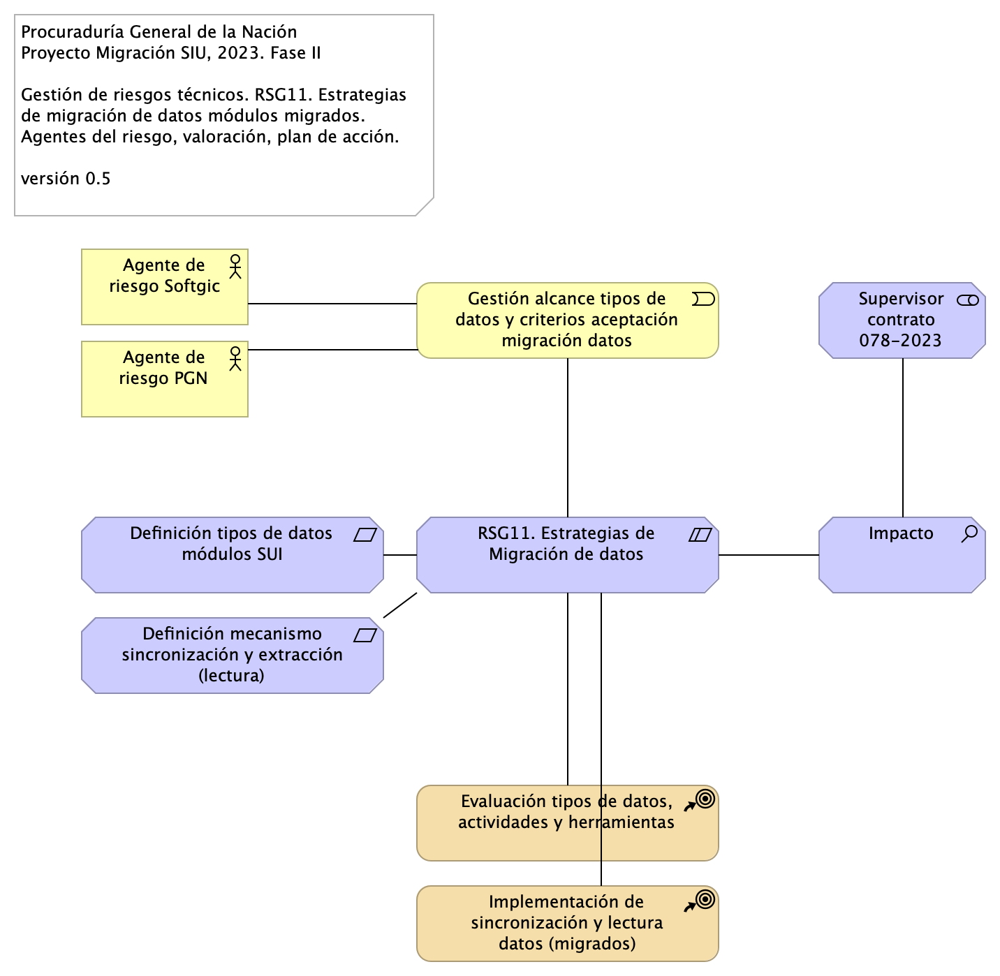

# Doc.4.PGN Contractual
* [Contexto](#contexto)
	* [Migracion.1a.a.SIU Contexto](#migracion.1a.a.siu-contexto)
	* [Migracion.1a.b.SIU Módulos](#migracion.1a.b.siu-módulos)
* [Física](#física)
	* [Lineabase.0.SIU applicación. física](#lineabase.0.siu-applicación.-física)
* [Motivadores](#motivadores)
	* [Migracion.1a.b.SIU Módulos](#migracion.1a.b.siu-módulos)
	* [Riesgos.1. Migración funcional](#riesgos.1.-migración-funcional)
	* [Riesgos.2. Modelo Riesgo RSG10](#riesgos.2.-modelo-riesgo-rsg10)
	* [Riesgos.3. Modelo Riesgo RSG11](#riesgos.3.-modelo-riesgo-rsg11)
* [Interoperabilidad](#interoperabilidad)
	* [Migracion.1c.SIU Modulos Colaboración](#migracion.1c.siu-modulos-colaboración)
* [Seguridad](#seguridad)
	* [Seguridad.2. Lineabase.0.SIU Applicación](#seguridad.2.-lineabase.0.siu-applicación)
* [Componentes](#componentes)
	* [Migracion.1b.1. SIU Módulos Componentes](#migracion.1b.1.-siu-módulos-componentes)
	* [Migracion.1b.2. SIU Módulos Componentes. Brecha](#migracion.1b.2.-siu-módulos-componentes.-brecha)
* [CI](#ci)
	* [Migracion.4. CI](#migracion.4.-ci)
* [Tecnología](#tecnología)

\newpage

# Contexto
## Migracion.1a.a.SIU Contexto
{#fig:Migracion.1a.a.SIUContexto width=}

La vista presenta en contexto a los módulos SUI migrados y el estilo de comunicación vía API sincreonica/asincrónica.

Cada módulo migrado atiende al funcionario que le corresponde, p. ejemplo, Relatoría atiende a la depedencia Jurídica de la PGN. Los módulos comparten su información mediante el API local presente dentro de cada uno. Esto es, la información se mantiene protegida en dominios pero coordinada (se comparte con otros dominios).

El arreglo de datos de registros operativos y transaccionales es como sigue: cada módulo individual mantiene su registro de datos, estado y transacciones minimizado y protegido (individual y aislado). Salvo excepciones no consentidas por el diseño original, un módulo puede compartir el mismo almacen de datos con otro.

### Catálogo de Elementos
| Name| Type| Description| Properties
|:--------|:--------|:--------|:--------|
|**cc:Administración**|application-collaboration|||
|**cc:Almacenamient 2**|application-collaboration|Espacio de almancenamiento operativo y transaccional de un módulo central del SUI migrado.||
|**cc:Almacenamiento**|application-collaboration|Espacio de almancenamiento operativo y transaccional de un módulo central del SUI migrado.||
|**cc:Almacenamiento 3**|application-collaboration|Espacio de almancenamiento operativo y transaccional de un módulo central del SUI migrado.||
|**cc:Almacenamiento N**|application-collaboration|Espacio de almancenamiento operativo y transaccional de un módulo central del SUI migrado.||
|**cc:PGN SUI (módulo central)**|application-collaboration|Módulo central SUI migrado. Módulo independiente y asignado a un dominio partigular de la PGN. ||
|**cc:PGN SUI (módulo central) 2**|application-collaboration|Módulo central SUI migrado. Módulo independiente y asignado a un dominio partigular de la PGN. ||
|**cc:PGN SUI (módulo central) 3**|application-collaboration|Módulo central SUI migrado. Módulo independiente y asignado a un dominio partigular de la PGN. ||
|**cc:PGN SUI (módulo central) N**|application-collaboration|Módulo central SUI migrado. Módulo independiente y asignado a un dominio partigular de la PGN. ||
|**cc:Portales y canales**|application-collaboration|Submódulo de portales internos de la PGN a donde llega el SUI. Interfaz web que usa al SUI para llegar a direcciones y subdirecciones de la PGN. La plataforma principal de portales en este contexto es Sharepoint de Microsoft. ||
|**cc:Presentación**|application-collaboration|Submódulo de presentación del SUI. interfaz gráfica, interfaz web visible a los usuarios clientes y funcionarios de la PGN. ||
|**cc:Servicios de aplicación**|application-collaboration|Submódulo de servicios utilitarios que sirven al SUI. Servicios variados que cumplen roles facilitadores de las actividades misionales del SUI. Ejemplos de estos servicios son los de gestión documental, implementado por Doku en el contexto de PGN. ||
|**API SUI**|application-interface|API de representación del módulo. Centrlalización de la comunicación con otros módulos del SUI migrado. ||
|**API SUI 2**|application-interface|API de representación del módulo. Centrlalización de la comunicación con otros módulos del SUI migrado. ||
|**API SUI 3**|application-interface|API de representación del módulo. Centrlalización de la comunicación con otros módulos del SUI migrado. ||
|**API SUI N**|application-interface|API de representación del módulo. Centrlalización de la comunicación con otros módulos del SUI migrado. ||
|**Cliente PGN**|business-actor|||
|**Cliente PGN**|business-actor|||
|**Cliente PGN**|business-actor|||
|**Cliente PGN**|business-actor|||
|**Funcionario PGN**|business-actor|||
|**Funcionario PGN**|business-actor|||
|**Funcionario PGN**|business-actor|||
|**Funcionario PGN**|business-actor|||

## Migracion.1a.b.SIU Módulos
{#fig:Migracion.1a.b.SIUMódulos width=}

Identificación de submódulos del Sistema Único de Información (SUI) de la PGN. 

Todos los sistemas de información del SUI deben seguir la directiva de separar a los componentes misionales de los utilitarios: el SUI de PGN estará constituidos por submódulos dispuestos en relación de utilitarios (que sirven) a los componentes misionales del SUI, ubicados en el centro en la diagrama.

Los submódulos del SUI, tal como están presentados, reúnen a las partes por el mismo rol en favor de la coherencia. Por ejemplo, los servicios de aplicación, en la imagen, contiene a todos aquellos utilitarios que prestan alguna utilidad momentánea al SUI migrado. Organizados así, estos submódulos utilitarios pueden ser intercambiados o ampliados sin perjuicio de los componentes misionales dell SUI (centro del diagrama) gracias a las _interfaces de unión_ en favor de la extensibilidad.

Las interfaces de unión indicadas arriba obligan a los submódulos a cumplir las exigencias de los componentes misionales del SUI.

Los submódulos identificados tienen los siguientes roles para el SUI migrado:

1. cc:Presentación
1. cc:Servicios de aplicación
1. cc:Portales y canales
1. cc:Administración y configuración
1. cc:Almacenamiento

### Requerimientos Asociados a los Submódulos
La disposición de los módulos y submódulos presentada, denominada SUI Migración en adelante, facilita la focalización de los requerimientos encontrados en el levantamiento realizado en el actual proyecto. Así, por ejemplo, los requerimientos funcionales se encuentran concentrados en el submódulo de presentación (ver imagen).

### Catálogo de Elementos
| Name| Type| Description| Properties
|:--------|:--------|:--------|:--------|
|**cc:Administración**|application-collaboration|||
|**cc:Almacenamiento**|application-collaboration|Espacio de almancenamiento operativo y transaccional de un módulo central del SUI migrado.||
|**cc:PGN SUI (módulo central)**|application-collaboration|Módulo central SUI migrado. Módulo independiente y asignado a un dominio partigular de la PGN. ||
|**cc:Portales y canales**|application-collaboration|Submódulo de portales internos de la PGN a donde llega el SUI. Interfaz web que usa al SUI para llegar a direcciones y subdirecciones de la PGN. La plataforma principal de portales en este contexto es Sharepoint de Microsoft. ||
|**cc:Presentación**|application-collaboration|Submódulo de presentación del SUI. interfaz gráfica, interfaz web visible a los usuarios clientes y funcionarios de la PGN. ||
|**cc:Servicios de aplicación**|application-collaboration|Submódulo de servicios utilitarios que sirven al SUI. Servicios variados que cumplen roles facilitadores de las actividades misionales del SUI. Ejemplos de estos servicios son los de gestión documental, implementado por Doku en el contexto de PGN. ||
|**interfaz**|application-interface|||
|**interfaz**|application-interface|||
|**interfaz**|application-interface|||
|**interfaz**|application-interface|||
|**interfaz**|application-interface|||
|**Cliente PGN**|business-actor|||
|**Funcionario PGN**|business-actor|||
|**ARQ01. Consistencia SUI**|constraint|Unifica las entidades de negocio PGN, entre las que se incluyen a conciliaciones, publicaciones de relatoría, resoluciones, en artefactos reutilizables. Distinto de que estas entidades (y su lógica de negocio) estén dispersos entre los sistemas del SUI, estarán concentradas en un único artefacto correspondiente. Calidad sistémica: la consistencia persigue que el resultado de la lógica de negocio sea la misma entre los módulos del SUI migrado. Esto redunda a mantenibilidad y gestión: tiende a tener un solo punto de cambio y dificulta la transferencia de dependencias implícitas a otros procesos.||
|**ARQ02. Mantenibilidad SUI**|constraint|Evitar las dependencia transitivas de los módulos misionales del SUI a componentes y sistemas de terceros o submódulos no misionales.  Calidad sistémica: la mantenibilidad por control de dependencias que optimiza el diseño Migración SUI está dada por el control de cambios no programados sobre los componentes misionales del SUI (corrupción de componentes). Ver Patrón de Diseño Migración SUI, más adelante en el documento.||
|**ARQ03. Extensibilidad SUI**|constraint|Concentración de los componentes de negocio, misionales, del SUI protegidos de cambios provenientes de otros sistemas. Ver Patrón de Diseño Migración SUI, más adelante en el documento. Calidad sistémica: la extensibilidad que optimiza el diseño Migración SUI está dada por el intercambio de submódulos no misionales, como el gestor documental, sin afectación de los componentes misionales que este diseño protege.||
|**RQR. Administrativos**|requirement|||
|**RQR. Funcionales**|requirement|||
|**RQR. Ingeniería**|requirement|||
|**RQR. Negocio**|requirement|||
|**RQR. Seguridad**|requirement|Requerimientos de seguridad, SUI, Migración, en aspectos de comunicación, autenticación, autorización y (manejo de) sesiones. ||
|**RQR. Seguridad**|requirement|Requerimientos de seguridad, SUI, Migración, en aspectos de comunicación, autenticación, autorización y (manejo de) sesiones. ||

\newpage

# Física
## Lineabase.0.SIU applicación. física
{#fig:Lineabase.0.SIUapplicación.física width=}

Procuraduría General de la Nación (PGN), módulo SIU migrado, 2023. Elementos físicos que soportan a la aplicación Sistema de Información Único (SIU en adelante) de la PGN, actual Fase I y existente en Fase II. Presentación de componentes de software y tecnologeia física (hardware) implementados en la Fase I y requeridos por Fase II (presente proyecto).

## Representación Arquitectónica
Con una arquitectura orientada a servicios SUI recopila:

1. Runtime: Es el servicio que interactúa con el usuario final (GUI) elaborado en Angular 11
1. API Tx: Servicio api rest base node encargado de realizar las transacciones básicas CRUD
1. API Config / Seguridad. Servicio Web API .Net Framework encargado de gestionar características con la autenticación y configuración

 

### Catálogo de Elementos
| Name| Type| Description| Properties
|:--------|:--------|:--------|:--------|
|**Application Collaboration**|application-collaboration|||
|**Application Collaboration**|application-collaboration|||
|**App**|application-component||*plataforma:* node Js |
|**App PGN Móvil**|application-component|A partir de los lineamientos de desarrollo seguro establecidos en The OWASP Foundation recomendados en la “Guía de desarrollo OWASP” y “OWAS Cheat Sheet, se realizaran pruebas de seguridad a partir del analisis de vulnerabilidades, y pruebas de Ethikal Hacking.  Protección de datos personales,  Los sistemas de información que recogen, procesan y almacenan información de los derechos de las personas se deben almacenar de forma adecuada, la información que pueda ser vulnerada puede generar obliaciones legales y éticas con respecto a la perdida de informacion confidencial por parte de ciudadanos del pais.  La informacion contenida en las bases de datos debe tener los mecanismos de cifrado que en otros apartados se han mencionado.  La legislación que hay que tener como referencia, ley 1581 de 2012. Decreto 1377 de 2013 La metodologia empleada tendrá las siguientes fases:  •	FASE DE RECONOCIMIENTO:  Se recolectará toda la información posible, usando diferentes técnicas como: o	Recopilación de dominios/IPs/puertos/servicios o	Recopilación de metadatos o	Uso de Google Dorks. •	ANÁLSIS DE VULNERABILIDADES:  Se analizará la información recopilada en la fase anterior y se realizará el descubrimiento de las vulnerabilidades.  •	EXPLOTACIÓN:  •	Se realizarán todas aquellas acciones que puedan comprometer al sistema auditado, las pruebas a implementar pueden ser de ataques tipo:  o	Inyección de código o	Inclusión de ficheros locales o remotos o	Evasión de autenticación o	Carencia de controles de autorización o	Ejecución de comandos en el lado del servidor o	Ataques tipo Cross Site Request Forgery o	Control de errores o	Gestión de sesiones o	Fugas de información o	Secuestros de sesión o	Comprobación de las condiciones para realizar una denegación de servicio. 	 •	POST EXPLOTACIÓN: En caso de encontrarse una vulnerabilidad que permita realizar otras acciones en el sistema auditado o en su entorno, se realizarán controles adiciones con el objetivo de comprobar la criticidad de esta. No	URL	IP 1.	https://runtimetest.lappiz.io/#/auth/login/PGN_Lappiz 135.181.185.207 |*plantilla:* element-md-new |
|**App PGN Web**|application-component|A partir de los lineamientos de desarrollo seguro establecidos en The OWASP Foundation recomendados en la “Guía de desarrollo OWASP” y “OWAS Cheat Sheet, se realizaran pruebas de seguridad a partir del analisis de vulnerabilidades, y pruebas de Ethical Hacking.  Los resultados permitirán identificar los requisitos de seguridad que los sistemas de informacion o servicios web deberán cumplir. La metodologia empleada tendrá las siguientes fases:  •	FASE DE RECONOCIMIENTO:  Se recolectará toda la información posible, usando diferentes técnicas como: o	Recopilación de dominios/IPs/puertos/servicios o	Recopilación de metadatos o	Uso de Google Dorks. •	ANÁLSIS DE VULNERABILIDADES:  Se analizará la información recopilada en la fase anterior y se realizará el descubrimiento de las vulnerabilidades.  •	EXPLOTACIÓN:  •	Se realizarán todas aquellas acciones que puedan comprometer al sistema auditado, las pruebas a implementar pueden ser de ataques tipo:  o	Inyección de código o	Inclusión de ficheros locales o remotos o	Evasión de autenticación o	Carencia de controles de autorización o	Ejecución de comandos en el lado del servidor o	Ataques tipo Cross Site Request Forgery o	Control de errores o	Gestión de sesiones o	Fugas de información o	Secuestros de sesión o	Comprobación de las condiciones para realizar una denegación de servicio. 	 •	POST EXPLOTACIÓN: En caso de encontrarse una vulnerabilidad que permita realizar otras acciones en el sistema auditado o en su entorno, se realizarán controles adiciones con el objetivo de comprobar la criticidad de esta. No	URL	IP 1.	https://runtimetest.lappiz.io/#/auth/login/PGN_Lappiz 135.181.185.207 El Login deberá evidenciar el control de errores, al momento de realizar la validación deberá mensaje de error para el caso que se autentique con credenciales erradas. |*plataforma:* angular 11 |
|**Config**|application-component||*plataforma:* cs |
|**Punto acceso público**|application-interface|URL tipo C HTTP||
|**Application Service (NLB)**|application-service||*plataforma:* angular 11 |
|**Interfaz de datos 1**|application-service|||
|**Interfaz de datos 2**|application-service|||
|**Communication Network (DMZ)**|communication-network|||
|**Communication Network (LAN)**|communication-network|||
|**Communication Network (internet)**|communication-network|||
|**Balanceador**|node|||
|**Servidor BDD App**|node|Sistema Operativo Windows Server 2019 Standard o Datacenter x64. RAM	8 GB. CPU 64 Bits, 4 Cores > 2 Ghz Discos	SO C: 126 GB, Backup E: 511 GB, SQL Data F: 510 GB, SQL Log   G: 510 GB, TempDB  G: 63.6 GB. ||
|**Servidor BDD Config**|node|Sistema Operativo Windows Server 2019 Standard o Datacenter x64. RAM	8 GB. CPU 64 Bits, 4 Cores > 2 Ghz Discos	SO C: 80 GB, Backup E: 250 GB, SQL Data F: 250 GB, SQL Log G: 250 GB, TempDB  G: 30 GB. ||
|**Servidor Web App**|node|Windows Server 2019 Standard o Datacenter x64. Nombre físico. IP LAN. IP Pública. Windows Server 2019 Standard or Datacenter x64. RAM	8  GB. CPU	64 Bits. 4 Cores de 2 Ghz. Discos	SO C: 126 GB. SO D: 16 GB. ||
|**Servidor Web Canales**|node|Windows Server 2019 Standard o Datacenter x64. Nombre físico. IP LAN. IP Pública. Windows Server 2019 Standard or Datacenter x64. RAM	8  GB. CPU	64 Bits. 4 Cores de 2 Ghz. Discos	SO C: 126 GB. SO D: 16 GB. ||
|**www pgn com**|technology-interface|||

\newpage

# Motivadores
## Migracion.1a.b.SIU Módulos
{#fig:Migracion.1a.b.SIUMódulos width=}

Identificación de submódulos del Sistema Único de Información (SUI) de la PGN. 

Todos los sistemas de información del SUI deben seguir la directiva de separar a los componentes misionales de los utilitarios: el SUI de PGN estará constituidos por submódulos dispuestos en relación de utilitarios (que sirven) a los componentes misionales del SUI, ubicados en el centro en la diagrama.

Los submódulos del SUI, tal como están presentados, reúnen a las partes por el mismo rol en favor de la coherencia. Por ejemplo, los servicios de aplicación, en la imagen, contiene a todos aquellos utilitarios que prestan alguna utilidad momentánea al SUI migrado. Organizados así, estos submódulos utilitarios pueden ser intercambiados o ampliados sin perjuicio de los componentes misionales dell SUI (centro del diagrama) gracias a las _interfaces de unión_ en favor de la extensibilidad.

Las interfaces de unión indicadas arriba obligan a los submódulos a cumplir las exigencias de los componentes misionales del SUI.

Los submódulos identificados tienen los siguientes roles para el SUI migrado:

1. cc:Presentación
1. cc:Servicios de aplicación
1. cc:Portales y canales
1. cc:Administración y configuración
1. cc:Almacenamiento

### Requerimientos Asociados a los Submódulos
La disposición de los módulos y submódulos presentada, denominada SUI Migración en adelante, facilita la focalización de los requerimientos encontrados en el levantamiento realizado en el actual proyecto. Así, por ejemplo, los requerimientos funcionales se encuentran concentrados en el submódulo de presentación (ver imagen).

### Catálogo de Elementos
| Name| Type| Description| Properties
|:--------|:--------|:--------|:--------|
|**cc:Administración**|application-collaboration|||
|**cc:Almacenamiento**|application-collaboration|Espacio de almancenamiento operativo y transaccional de un módulo central del SUI migrado.||
|**cc:PGN SUI (módulo central)**|application-collaboration|Módulo central SUI migrado. Módulo independiente y asignado a un dominio partigular de la PGN. ||
|**cc:Portales y canales**|application-collaboration|Submódulo de portales internos de la PGN a donde llega el SUI. Interfaz web que usa al SUI para llegar a direcciones y subdirecciones de la PGN. La plataforma principal de portales en este contexto es Sharepoint de Microsoft. ||
|**cc:Presentación**|application-collaboration|Submódulo de presentación del SUI. interfaz gráfica, interfaz web visible a los usuarios clientes y funcionarios de la PGN. ||
|**cc:Servicios de aplicación**|application-collaboration|Submódulo de servicios utilitarios que sirven al SUI. Servicios variados que cumplen roles facilitadores de las actividades misionales del SUI. Ejemplos de estos servicios son los de gestión documental, implementado por Doku en el contexto de PGN. ||
|**interfaz**|application-interface|||
|**interfaz**|application-interface|||
|**interfaz**|application-interface|||
|**interfaz**|application-interface|||
|**interfaz**|application-interface|||
|**Cliente PGN**|business-actor|||
|**Funcionario PGN**|business-actor|||
|**ARQ01. Consistencia SUI**|constraint|Unifica las entidades de negocio PGN, entre las que se incluyen a conciliaciones, publicaciones de relatoría, resoluciones, en artefactos reutilizables. Distinto de que estas entidades (y su lógica de negocio) estén dispersos entre los sistemas del SUI, estarán concentradas en un único artefacto correspondiente. Calidad sistémica: la consistencia persigue que el resultado de la lógica de negocio sea la misma entre los módulos del SUI migrado. Esto redunda a mantenibilidad y gestión: tiende a tener un solo punto de cambio y dificulta la transferencia de dependencias implícitas a otros procesos.||
|**ARQ02. Mantenibilidad SUI**|constraint|Evitar las dependencia transitivas de los módulos misionales del SUI a componentes y sistemas de terceros o submódulos no misionales.  Calidad sistémica: la mantenibilidad por control de dependencias que optimiza el diseño Migración SUI está dada por el control de cambios no programados sobre los componentes misionales del SUI (corrupción de componentes). Ver Patrón de Diseño Migración SUI, más adelante en el documento.||
|**ARQ03. Extensibilidad SUI**|constraint|Concentración de los componentes de negocio, misionales, del SUI protegidos de cambios provenientes de otros sistemas. Ver Patrón de Diseño Migración SUI, más adelante en el documento. Calidad sistémica: la extensibilidad que optimiza el diseño Migración SUI está dada por el intercambio de submódulos no misionales, como el gestor documental, sin afectación de los componentes misionales que este diseño protege.||
|**RQR. Administrativos**|requirement|||
|**RQR. Funcionales**|requirement|||
|**RQR. Ingeniería**|requirement|||
|**RQR. Negocio**|requirement|||
|**RQR. Seguridad**|requirement|Requerimientos de seguridad, SUI, Migración, en aspectos de comunicación, autenticación, autorización y (manejo de) sesiones. ||
|**RQR. Seguridad**|requirement|Requerimientos de seguridad, SUI, Migración, en aspectos de comunicación, autenticación, autorización y (manejo de) sesiones. ||

## Riesgos.1. Migración funcional
{#fig:Riesgos.1.Migraciónfuncional width=}

Riesgos de la migración funcional:

* RSG1. Estrategia CMS central
* RSG2. Motor de búsqueda
* RSG3. Estatego como BI
* RSG4. Conciliación y Doku
* RSG5. Gestión de sesiones / caducidad
* RSG6. Componentes de negocio
* RSG7. Asignación de roles y permisos de Acceso 
* RSG8. Intentos de accesos no autorizados
* RSG9. Alteración de datos negocio
* RSG10. Validación decisiones de arquitectura

### Acciones de Mitigación

1. Informar a la PGN de las implicaciones junto con alternativas para la implementación de la acción de aprovechamiento: diseño del SCM central (sharepoint). La PGN debe decidir si o no a la acción propuesta.

1. Informar a la PGN de las implicaciones junto con alternativas para la implementación de la acción de aprovechamiento: diseño del motor de búsqueda compartido (sharepoint). La PGN debe decidir si o no a la acción propuesta.

1. Informar a la PGN de las implicaciones junto con alternativas para la implementación de la acción de manejo del riesgo: diseño de solución de inteligencia de negocio (Power BI). La PGN debe decidir si o no a la acción propuesta.

1. Informar a la PGN de las implicaciones junto con alternativas para la implementación de la acción de manejo del riesgo: ubicar la lógica, los flujos, y los datos misionales dentro del SIU. La PGN debe decidir si o no a la acción propuesta.

1. Informar a la PGN de las implicaciones junto con alternativas para la implementación de la acción de manejo del riesgo: facilitar la administración de seguridad en un solo lugar (distinto de localizarla en las aplicaciones web). La PGN debe decidir si o no a la acción propuesta.

### Catálogo de Elementos
| Name| Type| Description| Properties
|:--------|:--------|:--------|:--------|
|**RSG1. Estrategia CMS central**|constraint|Establecer desde el principio el gestor de contenidos compartido que los módulos del SUI migrados van a usar. ||
|**RSG10. Validación decisiones de arquitectura**|constraint|Discutir la arquitectura de referencia de SUI Migración PGN. La arquitectura de referencia SUI informa de todas las fortalezas y consideraciones estructurales y de sistema, como extensibilidad, rendimiento y seguridad, que regirán a todos los módulos del SUI migrado. ||
|**RSG11. Estrategias de Migración de datos**|constraint|Discutir el alcance y los recursos para la correcta migración de datos incluídas en contrato 078, Migración Funcional SIU en atención al numeral 5.6 del anexo técnico del proyecto. | 5.6 MIGRACIÓN DE DATOS | Dentro del alcance de las actividades a desarrollar, el proveedor debe generar los mecanismos adecuados para hacer migración de la información que se encuentre en los sistemas actuales y que, por evolución de este, tenga datos relevantes que deban ser migrados a los ambientes y/o sistemas de información productos de la fábrica. | | Para este servicio el proveedor debe disponer del personal idóneo y las herramientas necesarias para hacer efectiva las actividades de migración de datos, utilizando las mejores prácticas de Extracción-Transformación-Carga (ETL) y protocolos de control de versiones robustos. Esta labor debe ser coordinada con las personas de la entidad que sean designadas por la Oficina de Tecnología, Innovación y Transformación Digital. ||
|**RSG2. Motor de búsqueda compartido**|constraint|Establecer desde el principio el motor de búsqueda de conteidos compartido para los módulos del SUI migrados. ||
|**RSG3. Estatego como BI**|constraint|Definir la arquitectura de Estratego migrado: puede ser una solución de BI simple, o puede ser una aplicación web tradicional. ||
|**RSG4. Conciliación y gestión documental (Doku)**|constraint|Definir la ubicación de los componentes misionales de Conciliación Administrativa (SIU). Debe estar fuera de Doku. ||
|**RSG5. Gestión de sesiones / caducidad**|constraint|Establecer desde el principio el motor de búsqueda de conteidos compartido para los módulos del SUI migrados. ||
|**RSG6. Componentes de negocio**|constraint|Incluir el esfuerzo de creación de componentes estrcturales y comunes a los módulos del SUI migrado requeridos por la arquitectura de referencia SUI.  Algunos componentes requeridos son: * Administración de autorizaciones (integrado con el directorio PGN) * Motor de flujos de trabajo para diseño y organización del trabajo (Conciliación) * Componente de ruteo de documentos (Relatoría) ||
|**RSG7. Asignación de roles y permisos de Acceso **|constraint|RSG7. Asignación de roles y permisos de Acceso Los riesgos de autenticación como el Single Sign On (SSO), permite que si las credenciales de usuario se ven comprometidas, pueden dar permiso a un atacante acceder a todos o la mayoría de recursos y aplicaciones en la red.  Se ha propuesto controlar los accesos a partir de la documentación que identifica la metodología de clasificación y gestión de usuarios roles y procesos de autenticación, a partir del control de acceso basado en roles RBAC (Identidades y autenticación), que permite tener una reacción más oportuna para controlar los accesos a diferentes módulos de los diferentes sistemas de Información.  Los inicios de sesión de los usuarios asociados a cuenta de dominio de Active Directory deben tener en cuenta la asignación de roles de ingreso al servidor o roles de ingreso al motor de bases de datos. Las cuentas de usuario no deben ser creadas de administrador local (administrador), es una puerta de entrada para los ataques de fuerza bruta. ||
|**RSG8. Intentos de accesos no autorizados**|constraint|RSG8. Intentos de accesos no autorizados Los intentos no autorizados son una de las técnicas más comunes utilizadas en la actualidad, los diferentes tipos de amenazas de intrusiones SQL Injections, Denegaciones de Servicios, riesgos de Ransomware, Ingeniería social, malware y otras amenazas, permite que se proponga implementación de soluciones de Seguridad perimetral a partir de la implementación de WAF para controlar las peticiones externas y evaluación de vulnerabilidades y escaneo para conocer puertos abiertos y establecer medidas. ||
|**RSG9. Alteración de datos negocio**|constraint|RSG9. Alteración de datos almacenados en Base de Datos. Se deberán asignar usuarios para la conexión de cada base de datos. Se debe proporcionar seguridad a nivel de filas y columnas (ofuscamiento) para proteger los datos confidenciales en el nivel de columnas y filas RLS ((seguridad de nivel de fila).  Algunos de los métodos y características que se deben tener en cuenta a implementar es a partir del Alway encrypted, para cifrar los datos que se encuentran almacenados.  ||
|**Riesgos Técnicos Migración Funcional SUI (078)**|constraint|Conjunto de riesgos técnicos y arquitectura. Proyecto Migración SUI 2023, PGN. ||

## Riesgos.2. Modelo Riesgo RSG10
{#fig:Riesgos.2.ModeloRiesgoRSG10 width=}

Para mitigar el riesgo 10, RSG10. Validación decisiones de arquitectura, que tiene como agente de riesgo a los arquitectos del contratista, Softgic, y al de la entidad, PGN, es necesario iniciar un proceso de evaluación y aprobación de la arquitectura. La frecuencia de este proceso será eventual, y como mínimo una vez cada dos semanas.

### Valoración del Riesgo

| Requisito      | Extensibilidad SUI |
|:-------------|:------------------|
| Descripción | Concentración de los componentes de negocio, misionales, del SUI protegidos de cambios provenientes de otros sistemas. Ver Patrón de Diseño Migración SUI, más adelante en el documento. |
| Calidad sistémica | La extensibilidad que optimiza el diseño Migración SUI está dada por el intercambio de submódulos no misionales, como el gestor documental, sin afectación de los componentes misionales que este diseño protege. |

Table: Valoración del riesgo RSG10. Validación decisiones de arquitectura. Migración SUI. {#tbl:requisito1-id}

### Catálogo de Elementos
| Name| Type| Description| Properties
|:--------|:--------|:--------|:--------|
|**Impacto**|assessment|||
|**Agente de riesgo PGN**|business-actor|Arquitecto PGN||
|**Agente de riesgo Softgic**|business-actor|Arquitecto Softgic||
|**Desconocimiento arq. de referencia SUI**|business-event|||
|**RSG10. Validación decisiones de arquitectura**|constraint|Discutir la arquitectura de referencia de SUI Migración PGN. La arquitectura de referencia SUI informa de todas las fortalezas y consideraciones estructurales y de sistema, como extensibilidad, rendimiento y seguridad, que regirán a todos los módulos del SUI migrado. ||
|**Evaluación  arquitectura de referencia SUI**|course-of-action|La frecuencia del proceso de evaluación de la arquitectura es eventual, mínimo una vez cada dos semanas. ||
|**Definición tipos de datos módulos SUI**|requirement|||
|**Supervisor contrato 078-2023**|stakeholder|||

## Riesgos.3. Modelo Riesgo RSG11
{#fig:Riesgos.3.ModeloRiesgoRSG11 width=}

Para mitigar el riesgo 10, RSG10. Validación decisiones de arquitectura, que tiene como agente de riesgo a los arquitectos del contratista, Softgic, y al de la entidad, PGN, es necesario iniciar un proceso de evaluación y aprobación de la arquitectura. La frecuencia de este proceso será eventual, y como mínimo una vez cada dos semanas.

### Valoración del Riesgo

| Requisito      | Extensibilidad SUI |
|:-------------|:------------------|
| Descripción | Concentración de los componentes de negocio, misionales, del SUI protegidos de cambios provenientes de otros sistemas. Ver Patrón de Diseño Migración SUI, más adelante en el documento. |
| Calidad sistémica | La extensibilidad que optimiza el diseño Migración SUI está dada por el intercambio de submódulos no misionales, como el gestor documental, sin afectación de los componentes misionales que este diseño protege. |

Table: Valoración del riesgo RSG10. Validación decisiones de arquitectura. Migración SUI. {#tbl:requisito1-id}

### Catálogo de Elementos
| Name| Type| Description| Properties
|:--------|:--------|:--------|:--------|
|**Impacto**|assessment|Sobretrabajo del proyecto 078, esfuerzo y presupuesto.||
|**Agente de riesgo PGN**|business-actor|Arquitecto PGN||
|**Agente de riesgo Softgic**|business-actor|Arquitecto Softgic||
|**Gestión alcance tipos de datos y criterios aceptación migración datos**|business-event|||
|**RSG11. Estrategias de Migración de datos**|constraint|Discutir el alcance y los recursos para la correcta migración de datos incluídas en contrato 078, Migración Funcional SIU en atención al numeral 5.6 del anexo técnico del proyecto. | 5.6 MIGRACIÓN DE DATOS | Dentro del alcance de las actividades a desarrollar, el proveedor debe generar los mecanismos adecuados para hacer migración de la información que se encuentre en los sistemas actuales y que, por evolución de este, tenga datos relevantes que deban ser migrados a los ambientes y/o sistemas de información productos de la fábrica. | | Para este servicio el proveedor debe disponer del personal idóneo y las herramientas necesarias para hacer efectiva las actividades de migración de datos, utilizando las mejores prácticas de Extracción-Transformación-Carga (ETL) y protocolos de control de versiones robustos. Esta labor debe ser coordinada con las personas de la entidad que sean designadas por la Oficina de Tecnología, Innovación y Transformación Digital. ||
|**Evaluación tipos de datos, actividades y herramientas**|course-of-action|La frecuencia del proceso de evaluación de la arquitectura es eventual, mínimo una vez cada dos semanas. ||
|**Implementación de sincronización y lectura datos (migrados)**|course-of-action|La frecuencia del proceso de evaluación de la arquitectura es eventual, mínimo una vez cada dos semanas. ||
|**Definición mecanismo sincronización y extracción (lectura)**|requirement|||
|**Definición tipos de datos módulos SUI**|requirement|||
|**Supervisor contrato 078-2023**|stakeholder|||

\newpage

# Interoperabilidad
## Migracion.1c.SIU Modulos Colaboración
{#fig:Migracion.1c.SIUModulosColaboración width=}

Patrón de Distribución y Colaboración estándar para el SUI.

La colaboración y comunicación de los componentes internos del SUI (grupo PFN SUI, en el diagrama) está mediada por interfaces. Estas son provistas por el grupo de componentes misionales, PGN SUI, hacia los submódulos externos. La intención es mantener reducido y controlado el número de interfaces.

La colaboración entre el SUI Migración con sistemas externos puede darse mediante API de comunicación (o buses de datos empresarial que ya disponga la PGN), sin perjuicio del patrón de comunicación estadar descrito en el diagrama.

Los únicos elementos para la comunicación (e integración) son los indicados en la vista actual. En este diseño no considera tipos de comunición mediante  mesajería, datos, ni 

### Catálogo de Elementos
| Name| Type| Description| Properties
|:--------|:--------|:--------|:--------|
|**cc:Almacenamiento**|application-collaboration|Espacio de almancenamiento operativo y transaccional de un módulo central del SUI migrado.||
|**cc:PGN SUI (módulo central)**|application-collaboration|Módulo central SUI migrado. Módulo independiente y asignado a un dominio partigular de la PGN. ||
|**cc:PGN SUI (módulo central)**|application-collaboration|Módulo central SUI migrado. Módulo independiente y asignado a un dominio partigular de la PGN. ||
|**cc:PGN SUI (módulo central) 2**|application-collaboration|Módulo central SUI migrado. Módulo independiente y asignado a un dominio partigular de la PGN. ||
|**cc:Portales y canales**|application-collaboration|Submódulo de portales internos de la PGN a donde llega el SUI. Interfaz web que usa al SUI para llegar a direcciones y subdirecciones de la PGN. La plataforma principal de portales en este contexto es Sharepoint de Microsoft. ||
|**App**|application-component||*plataforma:* node Js |
|**API SUI**|application-interface|API de representación del módulo. Centrlalización de la comunicación con otros módulos del SUI migrado. ||
|**API SUI**|application-interface|API de representación del módulo. Centrlalización de la comunicación con otros módulos del SUI migrado. ||
|**API SUI 2**|application-interface|API de representación del módulo. Centrlalización de la comunicación con otros módulos del SUI migrado. ||

\newpage

# Seguridad
## Seguridad.2. Lineabase.0.SIU Applicación
{#fig:Seguridad.2.Lineabase.0.SIUApplicación width=}

## Representación Arquitectónica
Con una arquitectura orientada a servicios SUI recopila:

1. Runtime: Es el servicio que interactúa con el usuario final (GUI) elaborado en Angular 11
1. API Tx: Servicio api rest base node encargado de realizar las transacciones básicas CRUD
1. API Config / Seguridad. Servicio Web API .Net Framework encargado de gestionar características con la autenticación y configuración

### Catálogo de Elementos
| Name| Type| Description| Properties
|:--------|:--------|:--------|:--------|
|**Application Collaboration**|application-collaboration|||
|**Application Collaboration**|application-collaboration|||
|**App**|application-component||*plataforma:* node Js |
|**App PGN Móvil**|application-component|A partir de los lineamientos de desarrollo seguro establecidos en The OWASP Foundation recomendados en la “Guía de desarrollo OWASP” y “OWAS Cheat Sheet, se realizaran pruebas de seguridad a partir del analisis de vulnerabilidades, y pruebas de Ethikal Hacking.  Protección de datos personales,  Los sistemas de información que recogen, procesan y almacenan información de los derechos de las personas se deben almacenar de forma adecuada, la información que pueda ser vulnerada puede generar obliaciones legales y éticas con respecto a la perdida de informacion confidencial por parte de ciudadanos del pais.  La informacion contenida en las bases de datos debe tener los mecanismos de cifrado que en otros apartados se han mencionado.  La legislación que hay que tener como referencia, ley 1581 de 2012. Decreto 1377 de 2013 La metodologia empleada tendrá las siguientes fases:  •	FASE DE RECONOCIMIENTO:  Se recolectará toda la información posible, usando diferentes técnicas como: o	Recopilación de dominios/IPs/puertos/servicios o	Recopilación de metadatos o	Uso de Google Dorks. •	ANÁLSIS DE VULNERABILIDADES:  Se analizará la información recopilada en la fase anterior y se realizará el descubrimiento de las vulnerabilidades.  •	EXPLOTACIÓN:  •	Se realizarán todas aquellas acciones que puedan comprometer al sistema auditado, las pruebas a implementar pueden ser de ataques tipo:  o	Inyección de código o	Inclusión de ficheros locales o remotos o	Evasión de autenticación o	Carencia de controles de autorización o	Ejecución de comandos en el lado del servidor o	Ataques tipo Cross Site Request Forgery o	Control de errores o	Gestión de sesiones o	Fugas de información o	Secuestros de sesión o	Comprobación de las condiciones para realizar una denegación de servicio. 	 •	POST EXPLOTACIÓN: En caso de encontrarse una vulnerabilidad que permita realizar otras acciones en el sistema auditado o en su entorno, se realizarán controles adiciones con el objetivo de comprobar la criticidad de esta. No	URL	IP 1.	https://runtimetest.lappiz.io/#/auth/login/PGN_Lappiz 135.181.185.207 |*plantilla:* element-md-new |
|**App PGN Web**|application-component|A partir de los lineamientos de desarrollo seguro establecidos en The OWASP Foundation recomendados en la “Guía de desarrollo OWASP” y “OWAS Cheat Sheet, se realizaran pruebas de seguridad a partir del analisis de vulnerabilidades, y pruebas de Ethical Hacking.  Los resultados permitirán identificar los requisitos de seguridad que los sistemas de informacion o servicios web deberán cumplir. La metodologia empleada tendrá las siguientes fases:  •	FASE DE RECONOCIMIENTO:  Se recolectará toda la información posible, usando diferentes técnicas como: o	Recopilación de dominios/IPs/puertos/servicios o	Recopilación de metadatos o	Uso de Google Dorks. •	ANÁLSIS DE VULNERABILIDADES:  Se analizará la información recopilada en la fase anterior y se realizará el descubrimiento de las vulnerabilidades.  •	EXPLOTACIÓN:  •	Se realizarán todas aquellas acciones que puedan comprometer al sistema auditado, las pruebas a implementar pueden ser de ataques tipo:  o	Inyección de código o	Inclusión de ficheros locales o remotos o	Evasión de autenticación o	Carencia de controles de autorización o	Ejecución de comandos en el lado del servidor o	Ataques tipo Cross Site Request Forgery o	Control de errores o	Gestión de sesiones o	Fugas de información o	Secuestros de sesión o	Comprobación de las condiciones para realizar una denegación de servicio. 	 •	POST EXPLOTACIÓN: En caso de encontrarse una vulnerabilidad que permita realizar otras acciones en el sistema auditado o en su entorno, se realizarán controles adiciones con el objetivo de comprobar la criticidad de esta. No	URL	IP 1.	https://runtimetest.lappiz.io/#/auth/login/PGN_Lappiz 135.181.185.207 El Login deberá evidenciar el control de errores, al momento de realizar la validación deberá mensaje de error para el caso que se autentique con credenciales erradas. |*plataforma:* angular 11 |
|**Config**|application-component||*plataforma:* cs |
|**Pruebas**|application-component|FASE DE RECONOCIMIENTO:   Se recolectará toda la información posible, usando diferentes técnicas como:  Recopilación de dominios/IPs/puertos/servicios  Recopilación de metadatos  Uso de Google Dorks.  ANÁLSIS DE VULNERABILIDADES:   Se analizará la información recopilada en la fase anterior y se realizará el descubrimiento de las vulnerabilidades.   EXPLOTACIÓN:   Se realizarán todas aquellas acciones que puedan comprometer al sistema auditado, las pruebas a implementar pueden ser de ataques tipo:   Inyección de código  Inclusión de ficheros locales o remotos  Evasión de autenticación  Carencia de controles de autorización  Ejecución de comandos en el lado del servidor  Ataques tipo Cross Site Request Forgery  Control de errores  Gestión de sesiones  Fugas de información  Secuestros de sesión  Comprobación de las condiciones para realizar una denegación de servicio.  POST EXPLOTACIÓN:  En caso de encontrarse una vulnerabilidad que permita realizar otras acciones en el sistema auditado o en su entorno, se realizarán controles adiciones con el objetivo de comprobar la criticidad de esta. ||
|**Punto acceso público**|application-interface|URL tipo C HTTP||
|**Application Service (NLB)**|application-service||*plataforma:* angular 11 |
|**Interfaz de datos 1**|application-service|||
|**Interfaz de datos 2**|application-service|||
|**Autenticación**|business-object|Con el objetivo de incrementar el nivel de seguridad, para el proceso de autenticación se tendrán en cuenta las siguientes consideraciones:   Validación del proceso de gestión de usuarios: La fortaleza de la autenticación dependerá del proceso de gestión de usuarios implementado por parte de la entidad. Se debe tener en cuenta los lineamientos definidos en la política Específica de Control de Acceso.   Autenticación con integración de Windows: La autenticación permitirá que los usuarios asignados al dominio, una vez que se ingresen las credenciales, y realizada la validación, se autorizará el acceso a los servicios y/o soluciones a partir de la integración del directorio activo con la integración del LDAP – (Lightweight Directory Access Protocol).   Los tipos de autenticación realizadas a partir de las identidades administradas de los recursos de Azure, entidades de Servicio y Certificados, podrán ser integrado con los dominios del directorio activo (DA) local. Por lo que respecta a la autenticación, será generado con la asignación de usuarios y credenciales definidas alineadas con la política Específica de Control de Acceso., a partir de la integración será validado el ingreso a las diferentes soluciones y/o sistemas de información de la PGN.   Manejo y uso de contraseñas: Los servidores públicos deberán tener en cuenta los lineamientos definidos para la creación y gestión de contraseñas del Sistema de Gestión de Seguridad de la Información SGSI de la Procuraduría General de la Nación.  Utilización de canales cifrados: El proceso de autenticación tendrá mecanismos de transmisión seguro. El uso del TLS (Transport Layer Security), será necesario para el acceso a la página de autenticación que ayude a garantizar la autenticidad de la aplicación a los funcionarios, como en la transmisión de las credenciales.   Bloqueo de cuentas: Aquellas cuentas sobre las que se han realizados múltiples intentos de conexiones fallidas, cinco (5) intentos erróneos, se tendrá implementado un bloqueo temporal o permanente como mecanismo de seguridad para evitar amenazas de ataques.  ||
|**Autorización**|business-object|Metodología  Los mecanismos de autorización para el acceso a los sistemas de información de la procuraduría general de la nación describen la forma de cómo se restringe el acceso a los diferentes módulos (Misionales (SIM), Registros de Inhabilidades (SIRI), Nómina, Control Interno y relatoría, entre otros.), y que se considera un mecanismo de protección, que ayuda a reaccionar ante cualquier operación no autorizada. El control de acceso basado en roles (RBAC), enfoca la idea de que a los funcionarios se les otorgue los permisos de acceso a los recursos, basados en los roles y/o perfiles que este posee. Este control posee dos características fundamentales: i) los accesos son controlados por medio de los roles y/o perfiles asignados, quiere decir, a los servidores públicos, contratistas, terceros y otros colaboradores autorizados para interactuar con los sistemas de información se le asignan los roles y el encargado/responsable definirá los permisos, que a su vez están relacionados con los roles, ii) Los roles pueden ser definidos a nivel jerárquico, es decir que un rol podrá ser miembro de otro rol.   Un proceso de autorización basado en roles, identifica tres factores importantes, i) Todos los servidores públicos, contratistas, terceros y otros  Colaboradores, deben tener un rol asignado, si no es asignado no podrá realizar ninguna acción relacionada con el acceso, ii) un usuario podrá hacer uso de los permisos asociados a los roles asignados, el cual deberá realizar el inicio de sesión el usuario asignado del Directorio activo (DA), iii) los servidores públicos, contratistas, terceros y otros, solo podrán realizar acciones para las cuales han sido autorizados por medio de la activación de sus roles y/o perfiles.   EL control definido para los accesos basados en roles RBAC, permitirá que solo las personas autorizadas de la PGN podrán acceder a ciertos recursos (programas, equipos, aplicaciones, bases de datos, etc.) definido por sus funciones laborales, lo que permitirá controlar los accesos desde diferentes escenarios: Sistemas de información, redes y aplicaciones.  Gestión de identidades y Control de acceso:   Gestor de identidades: En esta gestión se planifica el ciclo de vida de las identidades de usuario y se realizan los procesos de sincronización, de acuerdo a los suministros de accesos establecidos por la entidad, los cuales son integrados con el servidor que gestiona la identidad y control de acceso.   Gestor de roles: La asignación de roles es sincronizada con la identidad de usuario en el servidor de dominio. Para esta gestión se crean las reglas y condiciones que determinan si un usuario puede o no pertenecer a un rol definido por la entidad.  Para el gobierno y gestión de identidades y de acceso, se identificó como primera medida la implementación de la siguiente metodología.  REGLAS PARA LA CREACIÓN DE USUARIOS.  Identificación de Mecanismos:    En este ítem se deben identificar las herramientas con las que cuenta la    entidad, las cuales deberán ser registradas en el documento denominado: “Clasificación y gestión de usuarios, roles y perfiles.xlsx / Hoja_1 (Mecanismos)”.  Identificación de Roles y Privilegios  Este ítem proporciona al sistema la definición de las políticas organizacionales en cuanto a la definición de los privilegios y roles de los diferentes actores en cada uno de los aplicativos con los que estos interactúan dentro de sus funciones, registradas en el documento denominado: “Clasificación y gestión de usuarios, roles y perfiles.xlsx / Hoja_2 (Roles)”.  Aprovisionamiento de cuentas  Este ítem establece el proceso adecuado para el aprovisionamiento y des aprovisionamiento de cuentas de usuarios en las diferentes aplicaciones, permitiendo toda la gestión de ellas por medio de un sistema de directorio único y centralizado, Este aprovisionamiento se encuentra registrado en el documento denominado: “Clasificación y gestión de usuarios, roles y perfiles.xlsx / Hoja_4 y Hoja_5 (Permisos)”.  Establecimiento de mecanismos de control de acceso:   Este ítem controla que usuarios tienen permitido el acceso a los diferentes aplicativos o herramientas dentro de la organización permitiendo segregar las funciones dependiendo del rol del usuario en cada sistema, Este establecimiento se encuentra registrado en el documento denominado: “Clasificación y gestión de usuarios, roles y perfiles.xlsx / Hoja_3 (Acceso)”.  Definición de Privilegios y accesos.   Los accesos y privilegios serán identificados en la matriz, encargado identificar cada uno de los roles y perfiles que se tendrá cada usuario hacia los sistemas de información cumpliendo con el principio del menor privilegio, teniendo en cuenta que los usuarios deberán tener exclusivamente los permisos y privilegios que necesita para el desarrollo de sus actividades. La matriz identificará i) los roles que se deben crear para cada sistema de información, ii) los privilegios que requiere cada rol del sistema y iii) los niveles de accesos requeridos, (Consultar, Modificar, Eliminar) (CRUD) y iv) Tipos de usuarios, roles que pueden ser asignados al perfil, entre otros.   Configuración de permisos  La configuración con de los perfiles con sus accesos y privilegios en los sistemas de información se debe realizar empleando las herramientas propias de la procuraduría general de la nacional PGN, y serán asignados los permisos según la matriz de roles y permisos.   Identificación de Mecanismos:  En este ítem se deben identificar las herramientas con las que cuenta la    entidad, las cuales deberán ser registradas en el documento denominado: “Clasificación y gestión de usuarios, roles y perfiles.xlsx / Hoja_1 (Mecanismos)”.  Identificación de Roles y Privilegios  Este ítem proporciona al sistema la definición de las políticas organizacionales en cuanto a la definición de los privilegios y roles de los diferentes actores en cada uno de los aplicativos con los que estos interactúan dentro de sus funciones, registradas en el documento denominado: “Clasificación y gestión de usuarios, roles y perfiles.xlsx / Hoja_2 (Roles)”.  Aprovisionamiento de cuentas  Este ítem establece el proceso adecuado para el aprovisionamiento y des aprovisionamiento de cuentas de usuarios en las diferentes aplicaciones, permitiendo toda la gestión de ellas por medio de un sistema de directorio único y centralizado, Este aprovisionamiento se encuentra registrado en el documento denominado: “Clasificación y gestión de usuarios, roles y perfiles.xlsx / Hoja_4 y Hoja_5 (Permisos)”.  Establecimiento de mecanismos de control de acceso:   Este ítem controla que usuarios tienen permitido el acceso a los diferentes aplicativos o herramientas dentro de la organización permitiendo segregar las funciones dependiendo del rol del usuario en cada sistema, Este establecimiento se encuentra registrado en el documento denominado: “Clasificación y gestión de usuarios, roles y perfiles.xlsx / Hoja_3 (Acceso)”.  Definición de Privilegios y accesos.   Los accesos y privilegios serán identificados en la matriz, encargado identificar cada uno de los roles y perfiles que se tendrá cada usuario hacia los sistemas de información cumpliendo con el principio del menor privilegio, teniendo en cuenta que los usuarios deberán tener exclusivamente los permisos y privilegios que necesita para el desarrollo de sus actividades. La matriz identificará i) los roles que se deben crear para cada sistema de información, ii) los privilegios que requiere cada rol del sistema y iii) los niveles de accesos requeridos, (Consultar, Modificar, Eliminar) (CRUD) y iv) Tipos de usuarios, roles que pueden ser asignados al perfil, entre otros.   Configuración de permisos  La configuración con de los perfiles con sus accesos y privilegios en los sistemas de información se debe realizar empleando las herramientas propias de la procuraduría general de la nacional PGN, y serán asignados los permisos según la matriz de roles y permisos.  ||
|**Cifrado de Datos en tránsito**|business-object|Proteger la información propia de la PGN utilizando mecanismos de cifrado que permita garantizar los pilares de Segurida de la Información Confidencialidad e integridad, asimismo reducir los riesgos de la información mediante la ayuda de Técnicas Criptograficas.  Como mecanismos se propone implementar estos  mecanismos de cifrado, como el protocolo TLS ( Transport Layer Security) que permite a dos partes identificarse y autenticarse entre sí y comunicarse con confidencialidad e integridad de datos a partir de la conexión del usuario y un servidor WEB. Se propone integrar certificados SSL, que permite cifrar la información confidencial a fin de que solo los autorizados puedan tener acceso a ella, y asi evitar manipulacion de información confidencial. La Seguridad  que brinda SSL, da garantía para acceder a los aplicativos de PNG.  Como implementar certificados SSL? Podran ser adquiridos a través del proveedor de dominios. TLS el protocolo que surge para reforzar la seguridad de los certificados SSL, que funciona como mecanismo de encriptación para que sea realmente transparente el envio de la información, proporcionando una autenticación solida, restringiendo la manipulación, interceptación y alteración de mensajes. La ultima versión del TLS es la 1.3 ||
|**Cifrado de datos en tránsito**|business-object|Proteger la información propia de la PGN utilizando mecanismos de cifrado que permita garantizar los pilares de Segurida de la Información Confidencialidad e integridad, asimismo reducir los riesgos de la información mediante la ayuda de Técnicas Criptograficas. Como mecanismos se propone implementar estos  mecanismos de cifrado, como el protocolo TLS ( Transport Layer Security) que permite a dos partes identificarse y autenticarse entre sí y comunicarse con confidencialidad e integridad de datos a partir de la conexión del usuario y un servidor WEB. Se propone integrar certificados SSL, que permite cifrar la información confidencial a fin de que solo los autorizados puedan tener acceso a ella, y asi evitar manipulacion de información confidencial. La Seguridad  que brinda SSL, da garantía para acceder a los aplicativos de PNG.  Como implementar certificados SSL? Podran ser adquiridos a través del proveedor de dominios. TLS el protocolo que surge para reforzar la seguridad de los certificados SSL, que funciona como mecanismo de encriptación para que sea realmente transparente el envio de la información, proporcionando una autenticación solida, restringiendo la manipulación, interceptación y alteración de mensajes. La ultima versión del TLS es la 1.3||
|**Communication Network (DMZ)**|communication-network|||
|**Communication Network (LAN)**|communication-network|||
|**Communication Network (internet)**|communication-network|||
|**Balanceador**|node|||
|**Firewall BDD**|node||*brecha:* 100 |
|**Network Firewall/WAF**|node||*brecha:* 100 |
|**Servidor BDD App**|node|Sistema Operativo Windows Server 2019 Standard o Datacenter x64. RAM	8 GB. CPU 64 Bits, 4 Cores > 2 Ghz Discos	SO C: 126 GB, Backup E: 511 GB, SQL Data F: 510 GB, SQL Log   G: 510 GB, TempDB  G: 63.6 GB. ||
|**Servidor BDD Config**|node|Sistema Operativo Windows Server 2019 Standard o Datacenter x64. RAM	8 GB. CPU 64 Bits, 4 Cores > 2 Ghz Discos	SO C: 80 GB, Backup E: 250 GB, SQL Data F: 250 GB, SQL Log G: 250 GB, TempDB  G: 30 GB. ||
|**Servidor Web App**|node|Windows Server 2019 Standard o Datacenter x64. Nombre físico. IP LAN. IP Pública. Windows Server 2019 Standard or Datacenter x64. RAM	8  GB. CPU	64 Bits. 4 Cores de 2 Ghz. Discos	SO C: 126 GB. SO D: 16 GB. ||
|**Servidor Web Canales**|node|Windows Server 2019 Standard o Datacenter x64. Nombre físico. IP LAN. IP Pública. Windows Server 2019 Standard or Datacenter x64. RAM	8  GB. CPU	64 Bits. 4 Cores de 2 Ghz. Discos	SO C: 126 GB. SO D: 16 GB. ||
|**Sistema de Seguridad (LDAP) 1**|node|Sistema de Seguridad (LDAP) 1. Control de acceso internet,  La autenticación podrá estar integrada con el directorio activo, a partir de la generación de codigo para ek ingreso con 2FA, que podrá generar un código la plataforma de correo corporativo, el cual solicitará el codigo de autenticacion y una vez ingreado podrá redirigir al sitio. |*brecha:* 100 |
|**Sistema de Seguridad (LDAP) 2**|node|Sistema de Seguridad (LDAP) 2. Control de acceso internet,  La solución se podra integrar con el directorio activo, a partir de la generación del 2FA, que podrá generar un  codigo por desde la plataforma de office 365, el cual solicitará el codigo de autenticacion y una vez ingreado podrá acceder al sitio.  |*brecha:* 100 |
|**www pgn com**|technology-interface|||

\newpage

# Componentes
## Migracion.1b.1. SIU Módulos Componentes
{#fig:Migracion.1b.1.SIUMódulosComponentes width=}

Presentación de los componentes internos de los submódulos del sistema único de información migrado, SUI de PGN. Organización intena de los servicios y paquetes que integran cada submódulo del SUI. Todos los sistemas de información del SUI siguen esta directiva: estarán constituídos por submódulos dispuestos en relación de utilitarios (que sirven) a los componentes misionales del SUI, ubicados en el centro en la diagrama. 

La organización de componentes de migración SUI facilita focalizar la selección de tecnologeias. Los componentes internos y tecnologías elegidas son las siguientes

1. Presentación: Angular 11 (Web)
1. PGN SUI: API Transaccional (Node Js)
1. Administración: API Config (C#)
1. Persistencia: (SQL)

Los submódulos del SUI, tal como están presentados, reúnen a las partes que tienen el mismo rol en favor de la coherencia. Así mismo, estos pueden ser intercambiados o ampliados sin perjuicio del SUI gracias a las interfaces de unión (en favor de la extensibilidad).

Las interfaces de unión indicadas arriba obligan a los submódulos a cumplir las exigencias de los componentes misionales del SUI.

### Catálogo de Elementos
| Name| Type| Description| Properties
|:--------|:--------|:--------|:--------|
|**cc:PGN SUI (módulo central)**|application-collaboration|Módulo central SUI migrado. Módulo independiente y asignado a un dominio partigular de la PGN. ||
|**cc:Presentación**|application-collaboration|Submódulo de presentación del SUI. interfaz gráfica, interfaz web visible a los usuarios clientes y funcionarios de la PGN. ||
|**App**|application-component||*plataforma:* node Js |
|**App PGN Móvil**|application-component|A partir de los lineamientos de desarrollo seguro establecidos en The OWASP Foundation recomendados en la “Guía de desarrollo OWASP” y “OWAS Cheat Sheet, se realizaran pruebas de seguridad a partir del analisis de vulnerabilidades, y pruebas de Ethikal Hacking.  Protección de datos personales,  Los sistemas de información que recogen, procesan y almacenan información de los derechos de las personas se deben almacenar de forma adecuada, la información que pueda ser vulnerada puede generar obliaciones legales y éticas con respecto a la perdida de informacion confidencial por parte de ciudadanos del pais.  La informacion contenida en las bases de datos debe tener los mecanismos de cifrado que en otros apartados se han mencionado.  La legislación que hay que tener como referencia, ley 1581 de 2012. Decreto 1377 de 2013 La metodologia empleada tendrá las siguientes fases:  •	FASE DE RECONOCIMIENTO:  Se recolectará toda la información posible, usando diferentes técnicas como: o	Recopilación de dominios/IPs/puertos/servicios o	Recopilación de metadatos o	Uso de Google Dorks. •	ANÁLSIS DE VULNERABILIDADES:  Se analizará la información recopilada en la fase anterior y se realizará el descubrimiento de las vulnerabilidades.  •	EXPLOTACIÓN:  •	Se realizarán todas aquellas acciones que puedan comprometer al sistema auditado, las pruebas a implementar pueden ser de ataques tipo:  o	Inyección de código o	Inclusión de ficheros locales o remotos o	Evasión de autenticación o	Carencia de controles de autorización o	Ejecución de comandos en el lado del servidor o	Ataques tipo Cross Site Request Forgery o	Control de errores o	Gestión de sesiones o	Fugas de información o	Secuestros de sesión o	Comprobación de las condiciones para realizar una denegación de servicio. 	 •	POST EXPLOTACIÓN: En caso de encontrarse una vulnerabilidad que permita realizar otras acciones en el sistema auditado o en su entorno, se realizarán controles adiciones con el objetivo de comprobar la criticidad de esta. No	URL	IP 1.	https://runtimetest.lappiz.io/#/auth/login/PGN_Lappiz 135.181.185.207 |*plantilla:* element-md-new |
|**App PGN Web**|application-component|A partir de los lineamientos de desarrollo seguro establecidos en The OWASP Foundation recomendados en la “Guía de desarrollo OWASP” y “OWAS Cheat Sheet, se realizaran pruebas de seguridad a partir del analisis de vulnerabilidades, y pruebas de Ethical Hacking.  Los resultados permitirán identificar los requisitos de seguridad que los sistemas de informacion o servicios web deberán cumplir. La metodologia empleada tendrá las siguientes fases:  •	FASE DE RECONOCIMIENTO:  Se recolectará toda la información posible, usando diferentes técnicas como: o	Recopilación de dominios/IPs/puertos/servicios o	Recopilación de metadatos o	Uso de Google Dorks. •	ANÁLSIS DE VULNERABILIDADES:  Se analizará la información recopilada en la fase anterior y se realizará el descubrimiento de las vulnerabilidades.  •	EXPLOTACIÓN:  •	Se realizarán todas aquellas acciones que puedan comprometer al sistema auditado, las pruebas a implementar pueden ser de ataques tipo:  o	Inyección de código o	Inclusión de ficheros locales o remotos o	Evasión de autenticación o	Carencia de controles de autorización o	Ejecución de comandos en el lado del servidor o	Ataques tipo Cross Site Request Forgery o	Control de errores o	Gestión de sesiones o	Fugas de información o	Secuestros de sesión o	Comprobación de las condiciones para realizar una denegación de servicio. 	 •	POST EXPLOTACIÓN: En caso de encontrarse una vulnerabilidad que permita realizar otras acciones en el sistema auditado o en su entorno, se realizarán controles adiciones con el objetivo de comprobar la criticidad de esta. No	URL	IP 1.	https://runtimetest.lappiz.io/#/auth/login/PGN_Lappiz 135.181.185.207 El Login deberá evidenciar el control de errores, al momento de realizar la validación deberá mensaje de error para el caso que se autentique con credenciales erradas. |*plataforma:* angular 11 |
|**CU ejecutable**|application-component||*plataforma:* js |
|**CU ejecutable (n)**|application-component||*plataforma:* js |
|**Config**|application-component||*plataforma:* cs |
|**Controlador admin**|application-component||*plataforma:* cs |
|**Controlador frontal mvl**|application-component||*plataforma:* js |
|**Controlador frontal web**|application-component|-	Verificados los SSL, se recomienda adquirir SSL seguros, con entidades certificadoras.  Si se desea continuar con SSL de Let's Encrypt, se recomienda automatizar el proceso de actualización dado que al dejar estos en modo actualización manual es probable el olvido de esta actualización (Estos certificados se deben actualizar trimestralmente y no cuentan con las características de seguridad necesarias.  |*plataforma:* js |
|**Controlador funcional**|application-component||*plataforma:* js |
|**Función PGN**|application-component|La unidad de cómputo que resulta en la aplicación de una regla de negocio. |*plataforma:* js |
|**Modelo (neg)**|application-component||*plataforma:* cs |
|**Puerto datos 1**|application-component||*plataforma:* js |
|**Puerto datos 2**|application-component||*plataforma:* cs |
|**Seguridad**|application-component||*plataforma:* sql |
|**Servidor aplicaciones Sharepoint**|application-component|||
|**Servidor datos Sharepoint**|application-component|||
|**Servidor web Sharepoint**|application-component|||
|**Transacciones**|application-component||*plataforma:* sql |
|**Utilitario**|application-component||*plataforma:* no-sql |
|**Vista móvil**|application-component||*plataforma:* js |
|**Vista web**|application-component|-	Verificados los SSL, se recomienda adquirir SSL seguros, con entidades certificadoras.  Si se desea continuar con SSL de Let's Encrypt, se recomienda automatizar el proceso de actualización dado que al dejar estos en modo actualización manual es probable el olvido de esta actualización (Estos certificados se deben actualizar trimestralmente y no cuentan con las características de seguridad necesarias.  4.	SERVICIOS IDENTIFICADOS: Servidor web:  Microsoft-IIS/10.0  Marco de Programación: ASP.NET Huellas digitales identificadas:   Huella digital SHA-256 “FC:79:06:7E:F5:24:20:50:F1:C0:74:F7:85:56:B9:05:B7:33:A3:2D:44:A0:48” Huella digital SHA1 “8C:48:BD:E2:F5:18:18:C3:85:96:68:44:2E:28:A0:68:08:2F:0A:BE” |*plataforma:* html |
|**Application Interface**|application-interface|||
|**Interfaz de aplicación (runtime)**|application-interface|Servidor web:  Microsoft-IIS/10.0  Marco de Programación: ASP.NET Huellas digitales identificadas:   Huella digital SHA-256 “FC:79:06:7E:F5:24:20:50:F1:C0:74:F7:85:56:B9:05:B7:33:A3:2D:44:A0:48” Huella digital SHA1 “8C:48:BD:E2:F5:18:18:C3:85:96:68:44:2E:28:A0:68:08:2F:0A:BE” |*plataforma:* angular 11 |
|**API externas**|application-service|||
|**Application Service (NLB)**|application-service||*plataforma:* angular 11 |
|**Application Service (n)**|application-service|Implementación de un caso de uso de negocio, independiente y demostrable. Contiene a la unidad ejecutable del CU y a la entidad ||
|**Application Service 1**|application-service|Implementación de un caso de uso de negocio, independiente y demostrable. Contiene a la unidad ejecutable del CU y reutiliza (accede a) una entidad de negocio, que puede ser también una función PGN. ||
|**Archivos Compartidos**|application-service|||
|**CDN Contenidos**|application-service|||
|**Doku (gest. doc.)**|application-service|||
|**Identidades**|application-service|||
|**Interfaz de datos 1**|application-service|||
|**Interfaz de datos 2**|application-service|||
|**Interfaz de datos 3**|application-service|||
|**Office**|application-service|||
|**ccccc Proveedores contenidos**|application-service|||
|**Entidad negocio PGN**|business-object|Repreesnta un objeto de negocio del contexto de la entidad PGN,, por ejemplo: un decreto, una intervención, una conciliación. ||
|**ARQ01. Consistencia SUI**|constraint|Unifica las entidades de negocio PGN, entre las que se incluyen a conciliaciones, publicaciones de relatoría, resoluciones, en artefactos reutilizables. Distinto de que estas entidades (y su lógica de negocio) estén dispersos entre los sistemas del SUI, estarán concentradas en un único artefacto correspondiente. Calidad sistémica: la consistencia persigue que el resultado de la lógica de negocio sea la misma entre los módulos del SUI migrado. Esto redunda a mantenibilidad y gestión: tiende a tener un solo punto de cambio y dificulta la transferencia de dependencias implícitas a otros procesos.||
|**ARQ02. Mantenibilidad SUI**|constraint|Evitar las dependencia transitivas de los módulos misionales del SUI a componentes y sistemas de terceros o submódulos no misionales.  Calidad sistémica: la mantenibilidad por control de dependencias que optimiza el diseño Migración SUI está dada por el control de cambios no programados sobre los componentes misionales del SUI (corrupción de componentes). Ver Patrón de Diseño Migración SUI, más adelante en el documento.||
|**ARQ03. Extensibilidad SUI**|constraint|Concentración de los componentes de negocio, misionales, del SUI protegidos de cambios provenientes de otros sistemas. Ver Patrón de Diseño Migración SUI, más adelante en el documento. Calidad sistémica: la extensibilidad que optimiza el diseño Migración SUI está dada por el intercambio de submódulos no misionales, como el gestor documental, sin afectación de los componentes misionales que este diseño protege.||
|**Mensaje: JSON**|data-object|||
|**Administración**|grouping|||
|**Almacenamiento**|grouping|||
|**Portales**|grouping|Submódulo de portales internos de la PGN a donde llega el SUI. Interfaz web que usa al SUI para llegar a direcciones y subdirecciones de la PGN. La plataforma principal de portales en este contexto es Sharepoint de Microsoft. ||
|**Presentación**|grouping|Submódulo de presentación del SUI. interfaz gráfica, interfaz web visible a los usuarios clientes y funcionarios de la PGN. ||
|**Servicios de aplicación**|grouping|Submódulo de servicios utilitarios que sirven al SUI. Servicios variados que cumplen roles facilitadores de las actividades misionales del SUI. Ejemplos de estos servicios son los de gestión documental, implementado por Doku en el contexto de PGN. ||
|**RQR. Administrativos**|requirement|||
|**RQR. Funcionales**|requirement|||
|**RQR. Ingeniería**|requirement|||
|**RQR. Negocio**|requirement|||
|**RQR. Seguridad**|requirement|Requerimientos de seguridad, SUI, Migración, en aspectos de comunicación, autenticación, autorización y (manejo de) sesiones. ||
|**RQR. Seguridad**|requirement|Requerimientos de seguridad, SUI, Migración, en aspectos de comunicación, autenticación, autorización y (manejo de) sesiones. ||

## Migracion.1b.2. SIU Módulos Componentes. Brecha
{#fig:Migracion.1b.2.SIUMódulosComponentes.Brecha width=}

Los elementos resaltados indican las extensiones a la arqutecutra por concepto de Fase II del proyecto de migración SUI. 

Los componentes internos incorporados en la arquitectura tienen el propósito de implementar los casos de uso (CU) de cada módulo construído con esta organización (vista anterior). En la imagen los CU son expuestos por los servicios de aplicación, y estos a su vez, usan funciones de negocio (impulsadas por la plataforma de Lappiz). 

Todos los sistemas de información del SUI siguen esta directiva: estarán constituídos por submódulos dispuestos en relación de utilitarios (que sirven) a los componentes misionales del SUI, ubicados en el centro en la diagrama. 

### Catálogo de Elementos
| Name| Type| Description| Properties
|:--------|:--------|:--------|:--------|
|**App**|application-component||*plataforma:* node Js |
|**App PGN Móvil**|application-component|A partir de los lineamientos de desarrollo seguro establecidos en The OWASP Foundation recomendados en la “Guía de desarrollo OWASP” y “OWAS Cheat Sheet, se realizaran pruebas de seguridad a partir del analisis de vulnerabilidades, y pruebas de Ethikal Hacking.  Protección de datos personales,  Los sistemas de información que recogen, procesan y almacenan información de los derechos de las personas se deben almacenar de forma adecuada, la información que pueda ser vulnerada puede generar obliaciones legales y éticas con respecto a la perdida de informacion confidencial por parte de ciudadanos del pais.  La informacion contenida en las bases de datos debe tener los mecanismos de cifrado que en otros apartados se han mencionado.  La legislación que hay que tener como referencia, ley 1581 de 2012. Decreto 1377 de 2013 La metodologia empleada tendrá las siguientes fases:  •	FASE DE RECONOCIMIENTO:  Se recolectará toda la información posible, usando diferentes técnicas como: o	Recopilación de dominios/IPs/puertos/servicios o	Recopilación de metadatos o	Uso de Google Dorks. •	ANÁLSIS DE VULNERABILIDADES:  Se analizará la información recopilada en la fase anterior y se realizará el descubrimiento de las vulnerabilidades.  •	EXPLOTACIÓN:  •	Se realizarán todas aquellas acciones que puedan comprometer al sistema auditado, las pruebas a implementar pueden ser de ataques tipo:  o	Inyección de código o	Inclusión de ficheros locales o remotos o	Evasión de autenticación o	Carencia de controles de autorización o	Ejecución de comandos en el lado del servidor o	Ataques tipo Cross Site Request Forgery o	Control de errores o	Gestión de sesiones o	Fugas de información o	Secuestros de sesión o	Comprobación de las condiciones para realizar una denegación de servicio. 	 •	POST EXPLOTACIÓN: En caso de encontrarse una vulnerabilidad que permita realizar otras acciones en el sistema auditado o en su entorno, se realizarán controles adiciones con el objetivo de comprobar la criticidad de esta. No	URL	IP 1.	https://runtimetest.lappiz.io/#/auth/login/PGN_Lappiz 135.181.185.207 |*plantilla:* element-md-new |
|**App PGN Web**|application-component|A partir de los lineamientos de desarrollo seguro establecidos en The OWASP Foundation recomendados en la “Guía de desarrollo OWASP” y “OWAS Cheat Sheet, se realizaran pruebas de seguridad a partir del analisis de vulnerabilidades, y pruebas de Ethical Hacking.  Los resultados permitirán identificar los requisitos de seguridad que los sistemas de informacion o servicios web deberán cumplir. La metodologia empleada tendrá las siguientes fases:  •	FASE DE RECONOCIMIENTO:  Se recolectará toda la información posible, usando diferentes técnicas como: o	Recopilación de dominios/IPs/puertos/servicios o	Recopilación de metadatos o	Uso de Google Dorks. •	ANÁLSIS DE VULNERABILIDADES:  Se analizará la información recopilada en la fase anterior y se realizará el descubrimiento de las vulnerabilidades.  •	EXPLOTACIÓN:  •	Se realizarán todas aquellas acciones que puedan comprometer al sistema auditado, las pruebas a implementar pueden ser de ataques tipo:  o	Inyección de código o	Inclusión de ficheros locales o remotos o	Evasión de autenticación o	Carencia de controles de autorización o	Ejecución de comandos en el lado del servidor o	Ataques tipo Cross Site Request Forgery o	Control de errores o	Gestión de sesiones o	Fugas de información o	Secuestros de sesión o	Comprobación de las condiciones para realizar una denegación de servicio. 	 •	POST EXPLOTACIÓN: En caso de encontrarse una vulnerabilidad que permita realizar otras acciones en el sistema auditado o en su entorno, se realizarán controles adiciones con el objetivo de comprobar la criticidad de esta. No	URL	IP 1.	https://runtimetest.lappiz.io/#/auth/login/PGN_Lappiz 135.181.185.207 El Login deberá evidenciar el control de errores, al momento de realizar la validación deberá mensaje de error para el caso que se autentique con credenciales erradas. |*plataforma:* angular 11 |
|**CU ejecutable**|application-component||*plataforma:* js |
|**CU ejecutable (n)**|application-component||*plataforma:* js |
|**Config**|application-component||*plataforma:* cs |
|**Controlador admin**|application-component||*plataforma:* cs |
|**Controlador frontal mvl**|application-component||*plataforma:* js |
|**Controlador frontal web**|application-component|-	Verificados los SSL, se recomienda adquirir SSL seguros, con entidades certificadoras.  Si se desea continuar con SSL de Let's Encrypt, se recomienda automatizar el proceso de actualización dado que al dejar estos en modo actualización manual es probable el olvido de esta actualización (Estos certificados se deben actualizar trimestralmente y no cuentan con las características de seguridad necesarias.  |*plataforma:* js |
|**Controlador funcional**|application-component||*plataforma:* js |
|**Función PGN**|application-component|La unidad de cómputo que resulta en la aplicación de una regla de negocio. |*plataforma:* js |
|**Modelo (neg)**|application-component||*plataforma:* cs |
|**Puerto datos 1**|application-component||*plataforma:* js |
|**Puerto datos 2**|application-component||*plataforma:* cs |
|**Seguridad**|application-component||*plataforma:* sql |
|**Servidor aplicaciones Sharepoint**|application-component|||
|**Servidor datos Sharepoint**|application-component|||
|**Servidor web Sharepoint**|application-component|||
|**Transacciones**|application-component||*plataforma:* sql |
|**Utilitario**|application-component||*plataforma:* no-sql |
|**Vista móvil**|application-component||*plataforma:* js |
|**Vista web**|application-component|-	Verificados los SSL, se recomienda adquirir SSL seguros, con entidades certificadoras.  Si se desea continuar con SSL de Let's Encrypt, se recomienda automatizar el proceso de actualización dado que al dejar estos en modo actualización manual es probable el olvido de esta actualización (Estos certificados se deben actualizar trimestralmente y no cuentan con las características de seguridad necesarias.  4.	SERVICIOS IDENTIFICADOS: Servidor web:  Microsoft-IIS/10.0  Marco de Programación: ASP.NET Huellas digitales identificadas:   Huella digital SHA-256 “FC:79:06:7E:F5:24:20:50:F1:C0:74:F7:85:56:B9:05:B7:33:A3:2D:44:A0:48” Huella digital SHA1 “8C:48:BD:E2:F5:18:18:C3:85:96:68:44:2E:28:A0:68:08:2F:0A:BE” |*plataforma:* html |
|**Application Interface**|application-interface|||
|**Interfaz de aplicación (runtime)**|application-interface|Servidor web:  Microsoft-IIS/10.0  Marco de Programación: ASP.NET Huellas digitales identificadas:   Huella digital SHA-256 “FC:79:06:7E:F5:24:20:50:F1:C0:74:F7:85:56:B9:05:B7:33:A3:2D:44:A0:48” Huella digital SHA1 “8C:48:BD:E2:F5:18:18:C3:85:96:68:44:2E:28:A0:68:08:2F:0A:BE” |*plataforma:* angular 11 |
|**API externas**|application-service|||
|**Application Service (NLB)**|application-service||*plataforma:* angular 11 |
|**Application Service (n)**|application-service|Implementación de un caso de uso de negocio, independiente y demostrable. Contiene a la unidad ejecutable del CU y a la entidad ||
|**Application Service 1**|application-service|Implementación de un caso de uso de negocio, independiente y demostrable. Contiene a la unidad ejecutable del CU y reutiliza (accede a) una entidad de negocio, que puede ser también una función PGN. ||
|**Archivos Compartidos**|application-service|||
|**CDN Contenidos**|application-service|||
|**Doku (gest. doc.)**|application-service|||
|**Identidades**|application-service|||
|**Interfaz de datos 1**|application-service|||
|**Interfaz de datos 2**|application-service|||
|**Interfaz de datos 3**|application-service|||
|**Office**|application-service|||
|**ccccc Proveedores contenidos**|application-service|||
|**Entidad negocio PGN**|business-object|Repreesnta un objeto de negocio del contexto de la entidad PGN,, por ejemplo: un decreto, una intervención, una conciliación. ||
|**ARQ01. Consistencia SUI**|constraint|Unifica las entidades de negocio PGN, entre las que se incluyen a conciliaciones, publicaciones de relatoría, resoluciones, en artefactos reutilizables. Distinto de que estas entidades (y su lógica de negocio) estén dispersos entre los sistemas del SUI, estarán concentradas en un único artefacto correspondiente. Calidad sistémica: la consistencia persigue que el resultado de la lógica de negocio sea la misma entre los módulos del SUI migrado. Esto redunda a mantenibilidad y gestión: tiende a tener un solo punto de cambio y dificulta la transferencia de dependencias implícitas a otros procesos.||
|**ARQ02. Mantenibilidad SUI**|constraint|Evitar las dependencia transitivas de los módulos misionales del SUI a componentes y sistemas de terceros o submódulos no misionales.  Calidad sistémica: la mantenibilidad por control de dependencias que optimiza el diseño Migración SUI está dada por el control de cambios no programados sobre los componentes misionales del SUI (corrupción de componentes). Ver Patrón de Diseño Migración SUI, más adelante en el documento.||
|**ARQ03. Extensibilidad SUI**|constraint|Concentración de los componentes de negocio, misionales, del SUI protegidos de cambios provenientes de otros sistemas. Ver Patrón de Diseño Migración SUI, más adelante en el documento. Calidad sistémica: la extensibilidad que optimiza el diseño Migración SUI está dada por el intercambio de submódulos no misionales, como el gestor documental, sin afectación de los componentes misionales que este diseño protege.||
|**Mensaje: JSON**|data-object|||
|**Administración**|grouping|||
|**Almacenamiento**|grouping|||
|**PGN SIU**|grouping|El objetivo principal de la arquitectura del SUI de la migración es la centralización de los conceptos misionales: concentrar los conceptos misionales en componentes aislados; dejar por fuera de estos componentes misionales todo lo distintos a la misionalidad de la PGN. Los objetivos secundarios de esta arquitectura SUI de la migración son flexibilidad y extensibilidad. Dichos objetivos son independientes. Es decir, estos pueden ser maximizados sin conclifcto entre ellos. ||
|**Portales**|grouping|Submódulo de portales internos de la PGN a donde llega el SUI. Interfaz web que usa al SUI para llegar a direcciones y subdirecciones de la PGN. La plataforma principal de portales en este contexto es Sharepoint de Microsoft. ||
|**Presentación**|grouping|Submódulo de presentación del SUI. interfaz gráfica, interfaz web visible a los usuarios clientes y funcionarios de la PGN. ||
|**Servicios de aplicación**|grouping|Submódulo de servicios utilitarios que sirven al SUI. Servicios variados que cumplen roles facilitadores de las actividades misionales del SUI. Ejemplos de estos servicios son los de gestión documental, implementado por Doku en el contexto de PGN. ||
|**RQR. Administrativos**|requirement|||
|**RQR. Funcionales**|requirement|||
|**RQR. Ingeniería**|requirement|||
|**RQR. Negocio**|requirement|||
|**RQR. Seguridad**|requirement|Requerimientos de seguridad, SUI, Migración, en aspectos de comunicación, autenticación, autorización y (manejo de) sesiones. ||
|**RQR. Seguridad**|requirement|Requerimientos de seguridad, SUI, Migración, en aspectos de comunicación, autenticación, autorización y (manejo de) sesiones. ||

\newpage

# CI
## Migracion.4. CI
{#fig:Migracion.4.CI width=}

Descripción de las cadenas de integración y despliegue continuo de a) submódulos (aplicaciones web, por ejemplo) del SIU Migrado, 2023; e integración y despliegue continuo de los meodulos central del SIU Migrado, 2023.

Las cadenas están separadas por tecnologeias y plataformas distintas; son independientes y no presentan interbloqueos en cuanto a su ejecución. Pero, requieren administración integral.

Los trabajo de despligue requieren las configuraciones de las cadenas y tareas de conexión tanto a los ambientes productivos y desarrollo.
 

### Catálogo de Elementos
| Name| Type| Description| Properties
|:--------|:--------|:--------|:--------|
|**cc:PGN SUI (módulo central)**|application-collaboration|Módulo central SUI migrado. Módulo independiente y asignado a un dominio partigular de la PGN. ||
|**cc:Presentación**|application-collaboration|Submódulo de presentación del SUI. interfaz gráfica, interfaz web visible a los usuarios clientes y funcionarios de la PGN. ||
|**Evento de cambio**|application-event|||
|**Evento de cambio**|application-event|||
|**Azure CSM: git**|application-service|||
|**Lappiz CSM: bin**|application-service|||
|**Communication Network (LAN)**|communication-network|||
|**Communication Network (internet)**|communication-network|||
|**Balanceador**|node|||
|**Servidor BDD App**|node|Sistema Operativo Windows Server 2019 Standard o Datacenter x64. RAM	8 GB. CPU 64 Bits, 4 Cores > 2 Ghz Discos	SO C: 126 GB, Backup E: 511 GB, SQL Data F: 510 GB, SQL Log   G: 510 GB, TempDB  G: 63.6 GB. ||
|**Servidor BDD Config**|node|Sistema Operativo Windows Server 2019 Standard o Datacenter x64. RAM	8 GB. CPU 64 Bits, 4 Cores > 2 Ghz Discos	SO C: 80 GB, Backup E: 250 GB, SQL Data F: 250 GB, SQL Log G: 250 GB, TempDB  G: 30 GB. ||
|**Servidor Web App**|node|Windows Server 2019 Standard o Datacenter x64. Nombre físico. IP LAN. IP Pública. Windows Server 2019 Standard or Datacenter x64. RAM	8  GB. CPU	64 Bits. 4 Cores de 2 Ghz. Discos	SO C: 126 GB. SO D: 16 GB. ||
|**Servidor Web Canales**|node|Windows Server 2019 Standard o Datacenter x64. Nombre físico. IP LAN. IP Pública. Windows Server 2019 Standard or Datacenter x64. RAM	8  GB. CPU	64 Bits. 4 Cores de 2 Ghz. Discos	SO C: 126 GB. SO D: 16 GB. ||
|**Trabajo de despliegue lappiz.com**|technology-process|||
|**Trabajo de despliegue: yaml**|technology-process|||
|**Trabajo de integración lappiz.com**|technology-process|||
|**Trabajo de integración: yaml**|technology-process|||

\newpage

# Tecnología

``Generated on: Tue Oct 17 2023 12:53:35 GMT-0500 (COT)``