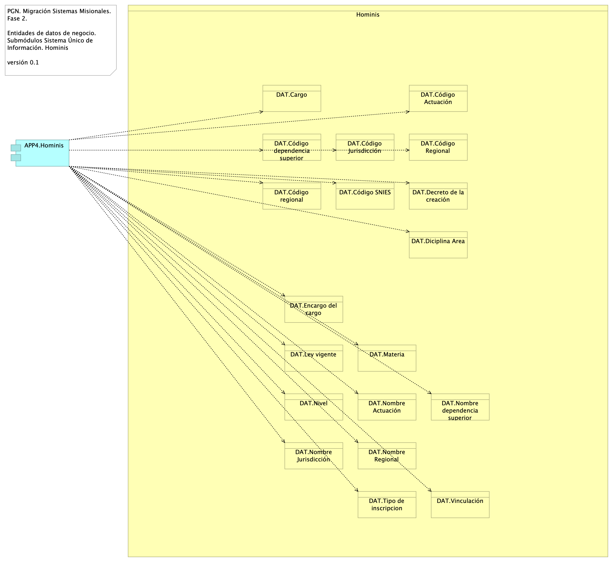
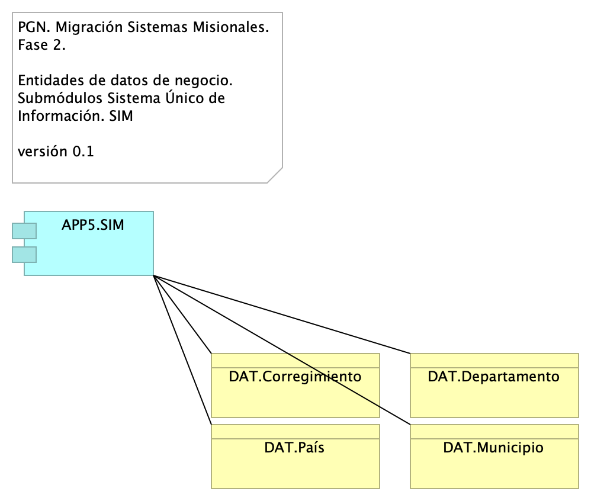

# Documento de Arquitectura Datos SUI

 ___ 
* [Descripción de Entidades de Datos Migración SUI PGN](#descripción-de-entidades-de-datos-migración-sui-pgn)
	* [Migracion.2. datos](#migracion.2.-datos)
	* [Migracion.2a. datos Hominis](#migracion.2a.-datos-hominis)
	* [Migracion.2c. datos Control interno](#migracion.2c.-datos-control-interno)
	* [Migracion.2d. datos SIRI](#migracion.2d.-datos-siri)
	* [Migracion.2b. datos SIM](#migracion.2b.-datos-sim)

\newpage
# Descripción de Entidades de Datos Migración SUI PGN
## Migracion.2. datos
{#fig:Migracion.2.datos width=}

Modelo de acceso y procesamiento a datos de negocio del SUI. Presentamos la organización de los ítems de datos de negocio necesarios para que los módulos del SUI puedan recolectar, procesar, integrary almacenarlos de forma organizada y escalable.

Mediante esta organización, los datos de negocio son transportados desde sus respectivas fuentes mediante interfaces (por principio de extensión y mantenibilidad). Los datos externos, entendidos como los de otros proveedores, son obtenidos mediante un intermediario: el bus de datos del SUI.

Consideramos tres tipos datos: datos transaccionales, históricos y externos, y presentamos una manera distinta de tratarlos y transportarlos.

### Catálogo de Elementos
| Name| Type| Description| Properties
|:--------|:--------|:--------|:--------|
|**cc:PGN SUI (misional)**|application-collaboration|||
|**APP1.Relatoría**|application-component|||
|**APP2.SIRI**|application-component|||
|**APP3.Control interno**|application-component|||
|**APP4.Hominis**|application-component|||
|**APP5.SIM**|application-component|||
|**APP6.Estratego**|application-component|||
|**Interfaz de Acceso Proveedores**|application-interface|||
|**Interfaz de Almacenaniento**|application-interface|||
|**Procesamiento batch PGN**|application-process|||
|**Bus de datos**|application-service|||
|**Datos externos**|data-object|||
|**Datos históricos**|data-object|||
|**Datos transaccionales**|data-object|||

## Migracion.2a. datos Hominis
{#fig:Migracion.2a.datosHominis width=}

### Catálogo de Elementos
| Name| Type| Description| Properties
|:--------|:--------|:--------|:--------|
|**APP4.Hominis**|application-component|||
|**DAT.Cargo**|business-object|||
|**DAT.Código Actuación**|business-object|||
|**DAT.Código Jurisdicción**|business-object|||
|**DAT.Código Regional**|business-object|||
|**DAT.Código SNIES**|business-object|||
|**DAT.Código dependencia superior**|business-object|||
|**DAT.Código regional**|business-object|||
|**DAT.Decreto de la creación**|business-object|||
|**DAT.Diciplina Area**|business-object|||
|**DAT.Encargo del cargo**|business-object|||
|**DAT.Ley vigente**|business-object|||
|**DAT.Materia**|business-object|||
|**DAT.Nivel**|business-object|||
|**DAT.Nombre Actuación**|business-object|||
|**DAT.Nombre Jurisdicción**|business-object|||
|**DAT.Nombre Regional**|business-object|||
|**DAT.Nombre dependencia superior**|business-object|||
|**DAT.Tipo de inscripcion**|business-object|||
|**DAT.Vinculación**|business-object|||

## Migracion.2c. datos Control interno
{#fig:Migracion.2c.datosControlinterno width=}

### Catálogo de Elementos
| Name| Type| Description| Properties
|:--------|:--------|:--------|:--------|
|**APP3.Control interno**|application-component|||
|**DAT.Dependencia**|business-object|||
|**DAT.Funcionario**|business-object|||
|**DAT.Proceso**|business-object|||
|**DAT.Tipo de proceso**|business-object|||

## Migracion.2d. datos SIRI
{#fig:Migracion.2d.datosSIRI width=}

### Catálogo de Elementos
| Name| Type| Description| Properties
|:--------|:--------|:--------|:--------|
|**APP2.SIRI**|application-component|||
|**DAT.Entidad**|business-object|||

## Migracion.2b. datos SIM
{#fig:Migracion.2b.datosSIM width=}

### Catálogo de Elementos
| Name| Type| Description| Properties
|:--------|:--------|:--------|:--------|
|**APP5.SIM**|application-component|||
|**DAT.Corregimiento**|business-object|||
|**DAT.Departamento**|business-object|||
|**DAT.Municipio**|business-object|||
|**DAT.País**|business-object|||

``Generated on: Tue Sep 12 2023 19:00:59 GMT-0500 (COT)``