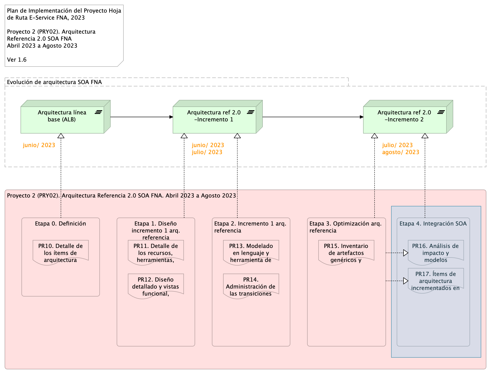

---
prnombre: "Análisis de impacto y modelos actualizados de los ítems de arquitectura"
...

\newpage

>    E-Service. Fase II
>
>    $PROYECTO. $PROY_DESCR. Contenido de los Productos Contractuales
>
>    Contrato 1812020
>
>    FNA, Stefanini
>
>    $FECHA_COMPILACION
>
>    **Versión** 1.$COMMIT

 

# Producto 16: PR16. $PR16_NOMBRE
Similar al ejercicio del producto 6, Modelos actualizados de los ítems de arquitectura impactados (PR06), del proyecto PRY01 de esta misma consultoría, en este producto hacemos lo propio respecto de los modelos de la arquitectura de referencia 2.0 del FNA. Por tanto, en este producto organizamos y consolidamos en el depósito de arquitectura del FNA (propuesto por esta misma consultoría) la información de los modelos de la arquitectura de referencia SOA 2.0 del FNA. A este lo complementa el análisis de impacto inicial que trate sobre las implicaciones de la adopción de los cambios funcionales y tecnológicos enunciados por esta arquitectura camino a ser el mapa de viaje de la transformación de las capacidades de negocio y de arquitectura del FNA (ver [Producto 11](<../../fna-dd-f2-pry2-e1/content/11.detalle roles recursos.md>) de este proyecto).

Al repositorio línea base entregado por el proyecto 1 (anterior a este) agregamos nuevos modelos a razón de la  arquitectura de referencia y del ejercicio de este producto.

| Tipo de Entrada      |          |
|----------------------|---------:|
| Arquitectura         | 12       |
| Funcional            | 4        |
| **Total Contenidos** | **1311** |

**Nota**: los análisis de este producto están dirigidos a cumplir los objetivos del proyecto PRY01, Gobierno SOA: desarrollo, gestión, gobierno de arquitectura y adopción.

 

## Justificación
Uno de los objetivos nominales, y objeto del proyecto actual, es la creación de la primera versión de la arquitectura de referencia SOA del FNA proyecto. Objetivo que se pliega al de _aumentar la relevancia de los modelos de arquitectura del Fondo Nacional_. En este proyecto 2 de Fase, II E-Service, los modelos son instrumentos de encuentro para el entendimiento, análisis, y comunicación entre actores, como ingenieros, arquitectos, proveedores, líderes de grupo. Se cumple también la máxima de proyectos anteriores de esta misma consultoría: los modelos, en este caso de la arquitectura de referencia, son el sujeto principal, y la evidencia, de la existencia del gobierno. Por estas razones es que los modelos de referencia SOA 2.0 creados aquí tienen la importancia tal para ser entregados en contribución al repositorio de arquitectura de la empresa.

## Contenidos
1. Detalle de ítems de la línea base de arquitectura de referencia 2.0 del FNA
1. Repositorio de arquitectura del FNA, versión 0.5, actualizado con arquitectura de referencia
1. Consideraciones para la adopción y puesta en marcha de los cambios en las arquitecturas del FNA
1. Anexo. Herramienta de navegación del repositorio de arquitectura del FNA versión 0.3

 

## Criterios de Aceptación
* Repositorio de arquitectura del FNA, actualizado, versión 0.3
* Herramienta de navegación del repositorio de arquitectura del FNA versión 0.3

 

## Repositorio de Arquitectura del FNA, versión 0.5
{#fig: width=}

_Fuente: Diagnóstico SOA. E-Service (2022)._

## Modelo de Implementación del $PROYECTO
{#fig: width=}

_Fuente: Elaboración propia._

 
