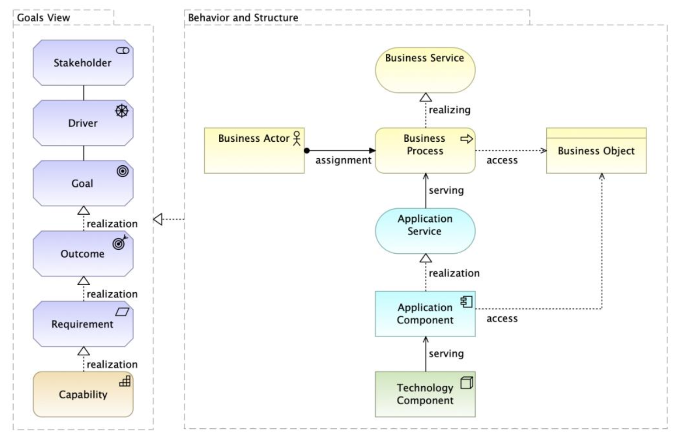

---
prnombre: "Análisis de impacto y modelos actualizados de los ítems de arquitectura"
...

\newpage

| Tema           | $PR06_NOMBRE: **Detalle de ítems de la arquitectura de referencia del FNA actualizados**  |
|----------------|-------------------------------------------------------------------------------------------|
| Palabras clave | SOA, Arquitectura de Referencia, Diseño, Modelos, Bloques de Construcción  |
| Autor          |                                                                            |
| Fuente         |                                                                            |
| Versión        | **1.$COMMIT** del $FECHA_COMPILACION                                       |
| Vínculos       | [Ejecución Plan de Trabajo SOA](onenote:#N001d.sharepoint.com); [Procesos de Negocio FNA](onenote:#N003a.com) |

 

# Detalle de Ítems de Arquitectura de Referencia del FNA Actualizados
En este proyecto denominamos ítems de línea base a los extractos de modelos y sus partes entregados por anteriores consultorías a esta fase de E-Service. El detalle de esta entrega la podemos resumir en el siguiente cuadro.

## Extracto de Modelos Analizados en Fase II, E-Service: modelos de arquitectura de referencia del FNA
Los modelos seleccionados (extractos) que presentamos en el siguiente cuadro confirman la línea base de modelos del FNA. Estos modelos fueron actualizados por el ejercicio actual y por tanto, los entregamos al FNA a razón de este producto, PR06.

Estos modelos se encuentran por ahora, mientras dura el $PROYECTO, $PROY_DESCR, en la siguiente ubicación del repositorio intermedio de entregas, [Repositorio SOA](https://stefaninilatam.sharepoint.com/:f:/r/sites/PROYECTOARQUITECTURAE-SERVICEFNA/Documentos%20compartidos/General/Repositorio%20SOA/Modelos?csf=1&web=1&e=LSEm4L).

| Archivo                      | Modificación |
|------------------------------|--------------|
| ae_fna.archimate             | Contenedor principal de arquitectura del FNA |
| ae_fna_as_is.archimate       | Contenedor secundario de arquitectura del FNA |
| arquitectura fna.archimate   | Contenedor de modelos de aplicación de arquitectura del FNA |
| fna_proyectos v2.0.archimate | Modelos de transición del FNA |

Table: FNA_Arquitectura, proyecto "arquitectura fna.archimate". Extracto de Modelos Analizados en Fase II, E-Service: arquitectura de referencia FNA. {#tbl:relaciones-id}

 

## Modelamiento de los Bloques de Construcción Abstractos
En esta sección cubrimos patrones de modelamiento en Archimate y los patrones de diseño de los componentes genéricos que pueden usarse como procedimientos y fuentes de consulta al modelar conceptos y soluciones relacionadas con las arquitecturas, incluso las de referencia del Fondo Nacional.

Nota: ArchiMate es una notación completa, con una amplia gama de elementos y relaciones. Basta un subconjunto de elementos ArchiMate y solo un pequeño conjunto de tipos de diagrama son suficientes para la mayoría de los propósitos de modelado.

### Vista Tríptico Funcional: Negocio, Arquitectura, Tecnología
{#fig:123.png width=}

 

