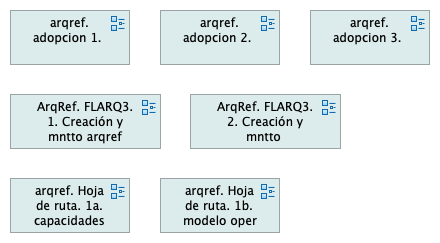
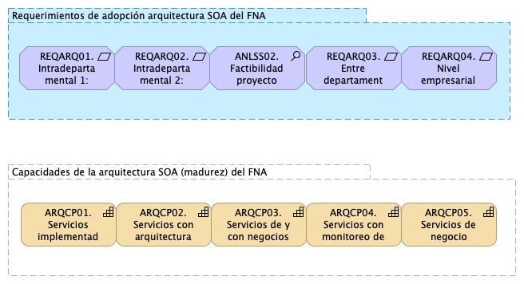
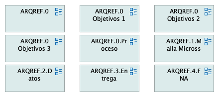

---
prnombre: "Análisis de impacto y modelos actualizados de los ítems de arquitectura"
...

\newpage

| Tema           | $PR06_NOMBRE: **Repositorio de arquitectura del FNA, versión 0.5** |
|----------------|--------------------------------------------------------|
| Palabras clave | SOA, Arquitectura de Referencia, Diseño, Modelos, Bloques de Construcción  |
| Autor          |                                            |
| Fuente         |                                            |
| Versión        | **1.$COMMIT** del $FECHA_COMPILACION       |
| Vínculos       | [Ejecución Plan de Trabajo SOA](onenote:#N001d.sharepoint.com); [Procesos de Negocio FNA](onenote:#N003a.com) |

 

# Repositorio de Arquitectura del FNA, versión 0.5
Como resultado del ejercicio de desarrollo de la arquitectura de referencia SOA 2.0 del FNA, objeto de este proyecto, el repositorio de modelos versión 0.2 aumenta el número de versionamiento para distinguir este contenido adicional del anterior.

Esta nueva versión del repositorio de arquitectura del FNA, versión 0.5, contiene modelos temáticos que tratan exclusivamente el proceso y el producto de la arquitectura de referencia. El proceso en este contexto es entendido como las acciones de gestión, mantenimiento, extensión y todo el trabajo alrededor de la temática, que es la arquitectura de referencia. A esto le llamaremos _Contenidos #1 del Repositorio_ versión 0.5.

Su complemento, el producto, son los modelos de arquitectura de referencia propiamente dichos. A esto le llamaremos _Contenidos #2 del Repositorio_ versión 0.5.

## Contenidos #1 del Repositorio : Los Procesos de la Arquitectura de Referencia
{#fig:arqrefFNA1.png width=}

### Modelos de Adopción Agregados al Repositorio FNA, versión 0.5
{#fig:arqref.adopcion1.png width=}

## Repositorio: Los Procesos de la Arquitectura de Referencia
{#fig:arqrefFNA2.png width=}

### Modelos Contenidos Agregados al Repositorio FNA, versión 0.5
A razón del desarrollo de este producto los modelos agregados al repositorio FNA, versión 0.5 son los siguientes.

#### Modelo Funcional de Referencia

{#fig:arqref.0.png width=}

#### Modelo Contextual de Referencia

{#fig:arqimage1.png width=}

