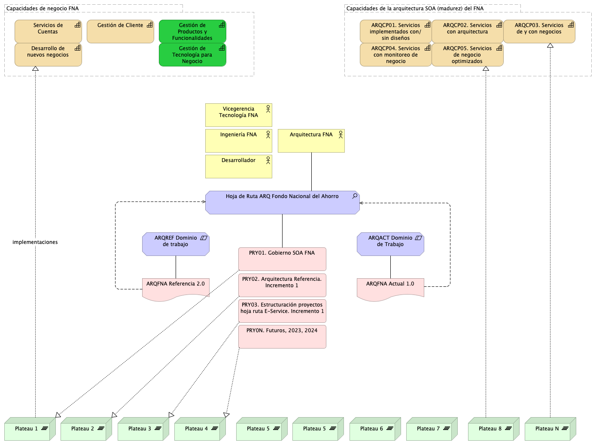

---
prnombre: "Análisis de impacto y modelos actualizados de los ítems de arquitectura"
...

\newpage

| Tema           | $PR06_NOMBRE: **Consideraciones para la adopción y puesta en marcha de los cambios en las arquitecturas del FNA** |
|----------------|--------------------------------------------------------|
| Palabras clave | SOA, Arquitectura de Referencia, Diseño, Modelos, Bloques de Construcción  |
| Autor          |                                            |
| Fuente         |                                            |
| Versión        | **1.$COMMIT** del $FECHA_COMPILACION       |
| Vínculos       | [Ejecución Plan de Trabajo SOA](onenote:#N001d.sharepoint.com); [Procesos de Negocio FNA](onenote:#N003a.com) |

 

# Consideraciones para Adopción y Puesta en Marcha de las Arquitecturas del FNA

## Modelo Operativo para la Puesta en Marcha de las Arquitecturas y Transiciones en el FNA
Establecemos como entidad principal para la gestión de las transiciones y aumentar las posibilidades de la materialización de la arquitectura de referencia SOA 2.0 que estamos proponiendo en el ejercicio de este proyecto.

En la imagen siguiente se puede ver a la hoja de ruta, la entidad principal del modelo de puesta en marcha de la arquitectura propuesta.

{#fig:arqrefFNA1.png width=}

En la parte inferior de la imagen se encuentran las transiciones de la arquitectura. Estas vienen impulsadas por los requerimientos de arquitectura mediados por los espacios de trabajo (en la parte media de la imagen), también llamados proyectos tecnológicos. 

Existe una relación directa entre los requerimientos de arquitectura que los arquitectos del FNA reciben y gestionan (ver Oficina de Arquitectura del FNA) y las transiciones de arquitectura (Plateau, en lenguaje Archimate). Es decir, las los requerimientos se materializan en transiciones. La hoja de ruta, ente principal del modelo, gestiona estas transiciones.

 
