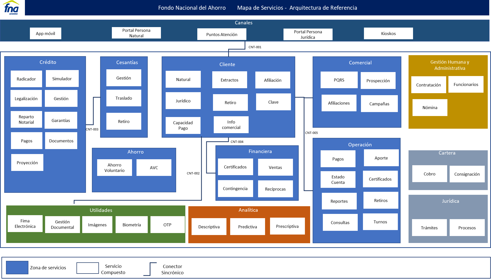

---
prnombre: "Ítems de arquitectura incrementados en ejecución"
...

\newpage

| Tema           | $PR06_NOMBRE: **Detalle de ítems de la línea base del FNA actualizados** |
|----------------|--------------------------------------------------------|
| Palabras clave | SOA, Contexto, Áreas, Procesos, Objetivos  |
| Autor          |                                            |
| Fuente         |                                            |
| Versión        | **1.$COMMIT** del $FECHA_COMPILACION       |
| Vínculos       | [Ejecución Plan de Trabajo SOA](onenote:#N001d.sharepoint.com); [Procesos de Negocio FNA](onenote:#N003a.com) |

 

# Detalle de Ítems de Arquitectura de Referencia del FNA Entregados
En este proyecto denominamos ítems de arquitectura de referencia a los extractos, modelos y sus partes entregados por esta consultoría, E-Service Fase II. El detalle de esta entrega queda establecido en los siguientes temas.

## Extracto de Modelos Analizados en Fase II, E-Service: arquitectura de referencia FNA
Los modelos seleccionados (extractos) que presentamos en el siguiente cuadro conforman la arquitectura de referencia del FNA. Estos modelos fueron creados y posteriormente actualizados por el ejercicio actual, y por tanto, los entregamos al FNA a razón de este producto, PR17.

Estos modelos se encuentran por ahora, mientras dura el $PROYECTO, $PROY_DESCR, en la siguiente ubicación del repositorio intermedio de entregas, [Repositorio SOA](https://stefaninilatam.sharepoint.com/:f:/r/sites/PROYECTOARQUITECTURAE-SERVICEFNA/Documentos%20compartidos/General/Repositorio%20SOA/Modelos?csf=1&web=1&e=LSEm4L).

| Tema           | $PR07_NOMBRE: **Subtema** |
|----------------|---------------------------|
| arqref.adopcion 1 | Arquitectura de Referencia SOA 2.0 del FNA. Consideraciones para la adopción. Capacidades y requerimientos para la adopción de arquitecturas en el FNA. versión 0.2 |
| arqref.adopcion 2 | Arquitectura de Referencia SOA 2.0 del FNA. Consideraciones para la adopción. Relación capacidades y requerimientos para la adopción de arquitecturas en el FNA. versión 0.1 |
| arqref.adopcion 3 | Arquitectura de Referencia SOA 2.0 del FNA. Consideraciones para la adopción en contexto con Gobierno FNA.. versión 0.2 |
| arqref. Hoja de ruta. 1b. modelo oper SOA | Gobierno SOA del FNA. FLUJ03. Flujo de Trabajo Creación y Mantenimiento de Arquitecturas de Referencia FNA. Nivel 1. versión 0.2 |
| ArqRef. FLARQ3. 1. Creación y mntto  | Arquitectura de Referencia SOA 2.0 del FNA. FLUJ03. Flujo de Trabajo Creación y Mantenimiento de Arquitecturas de Referencia FNA. Nivel 1. versión 0.2 |
| ArqRef. FLARQ3. 2. Creación y mntto arqref | Arquitectura de Referencia SOA 2.0 del FNA. Estructura interna. FLARQ03. Flujo de Trabajo Creación y Mantenimiento de Arquitecturas de Referencia FNA. versión 0.3 |
| arqref. Hoja de ruta. 1a. capacidades ||
| arqref. Hoja de ruta. 1b. modelo oper SOA ||
| ARQREF.0 ||
| ARQREF.0 Objetivos 1 ||
| ARQREF.0 Objetivos 2 ||
| ARQREF.0 Objetivos 3 ||
| ARQREF.0.Proceso ||
| ARQREF.1.Malla Micross ||
| ARQREF.2.Datos ||
| ARQREF.3.Entrega ||
| ARQREF.4.FNA ||

Table: (Fuente) FNA_Arquitectura, proyecto "arquitectura fna.archimate". Extracto de Modelos Analizados en Fase II, E-Service: arquitectura de referencia FNA. {#tbl:relaciones-id}

 

## Criterios de Desarrollo de la Arquitectura de Referencia FNA
Un aspecto clave para mantener el sentido de completitud y orden de los modelos de la arquitectura de referencia del FNA es la vista de contexto desarrollada por esta consultoría para el Proyecto 2, Arquitectura de Referencia SOA 2.0 del FNA. Esta vista, o cualquier que haga las veces, es también el criterio que permite unir modelos de la arquitectura de referencia del FNA.

{#fig:vistafuncional.png width=}

_Fuente: Diagnóstico SOA. E-Service (2022)._

 

