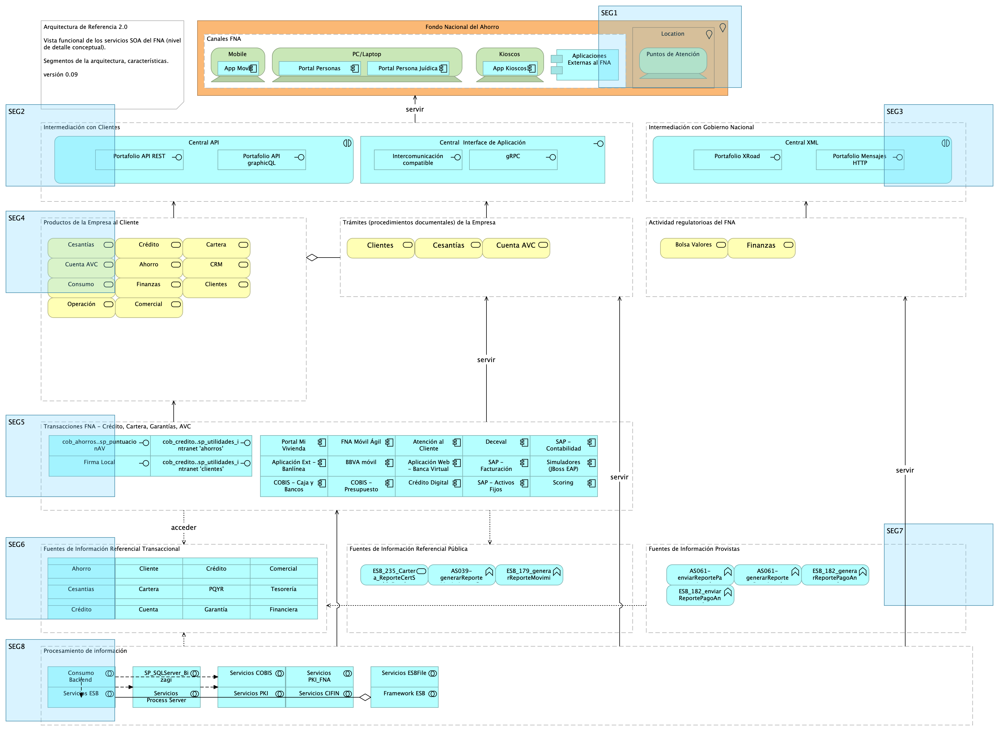

## Análisis de los Modelos Actualizados
Procedemos a describir los modelos creados concernientes a este producto, arquitectura de referencia del FNA. Mencionaremos detalles como los ítems relevantes que explican el concepto general de esta arquitectura, que es la relación con la misión del Fondo Nacional, las implicaciones necesarias que se extienden a la oficina de arquitectura del FNA (PRY01 de esta consultoría), y a los involucrados a los que impactan los planteamientos que desde estos modelos hacemos.

### Relación Arquitectura y Misión del FNA
El modelo de arquitectura de referencia SOA 2.0 entregado por este proyecto hace relación con la misionalidad de la empresa en aspectos como los segmentos funcionales. Estos segmentos se visualizan en el diagrama conceptual (ver [ARQREF0. Vista Funcional de la Arquitectura de Referencia 2.0. Servicios y Aplicaciones]). Traemos a mención estos segmentos mediados por el carácter público y misional del FNA.

#### Segmentos del Modelo Funcional de la Arquitectura de Referencia
1. Canales. Sitios físicos o electrónicos en relación con los clientes.
1. Intermediación con Clientes. Medio físicos o electrónicos de interoperatividad del FNA con los clientes.
1. Productos de la Empresa al Cliente. Productos de negocio ofertados, relación con clientes. Son colecciones de servicios que funcionan como una unidad.
1. Trámites (procedimientos documentales) FNA. Procesos relacionados con los productos o clientes del FNA. Basados en documentación física o digital. Ejemplo, trámite de afiliaciones y retiros, el retiro de cesantías, aperturas, etc.
1. Transacciones FNA. Unidades de intercambio de beneficios y registros de Crédito, Cartera, Garantías, Cuenta AVC.
1. Fuentes de Información Referencial Transaccional. Acceso a información requerida por las transacciones del FNA, como listas blancas, seguros, Registraduría.
1. Fuentes de Información Provistas. Exposición de entidades y componentes de datos (reportes, esquemas, archivos...) al Bco. de la República, Ministerios, entre otros.
1. Procesamiento de información. Procesamiento de lotes diario o eventual del FNA, como contabilidad, elaboración de certificados, envío de mensajes electrónicos, descarga de información, emisión de documentos digitales, indexaciones, etc.

#### Segmentos del Modelo Público de la Arquitectura de Referencia
1. Intermediación con Gobierno Nacional. Medio físicos o electrónicos de interoperatividad del FNA con entidades del Estado, como la Superintendencia Financiera de Colombia, Min Hacienda y MinTIC.
1. Actividad regulatoria del FNA. Procesos de intercambio de funciones regulatorias o sancionatorias e intercambio de información de seguridad debida al cumplimiento exigido por el Gobierno Nacional.
1. Fuentes de Información Referencial Pública. Acceso a datos de entidades públicas, como Formatos de  Ministerios, Registros de Asobancos, tasas del Bco. de la República.
1. Procesamiento de información. Procesamiento de lotes diario o eventual del FNA, como contabilidad, elaboración de certificados, envío de mensajes electrónicos, descarga de información, emisión de documentos digitales, indexaciones, etc.

Los segmentos están ilustrados en la vista funcional siguiente. Primera versión del modelo de referencia del dominio de servicios y aplicaciones 2.0 del FNA. 

{#fig:ARQREF.0.a1.Segmentos.png width= height=}

La arquitectura de referencia, desde la perspectiva funcional, informa el cómo de su organización tecnológica-misional, lo cual es conveniente para la alineación negocio con tecnología. 

    Importante: la relación tecnología y negocio está presente en los modelos de la arquitectura de referencia SOA 2.0 del FNA. Gracias a esta relación los modelos se vuelven la clave pueden gestionar la demanda de transición de cada segmento, la demanda de los servicios SOA del Fondo, y si estos responden o no a las necesidades de las vicepresidencias de crédito y de operaciones del Fondo Nacional.

 
