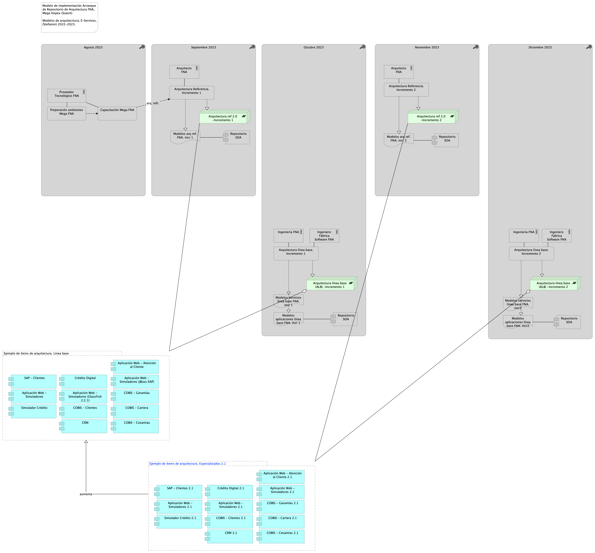

# Anexos
## Anexo 1. Migración de Arquitectura de Referencia del FNA (LIN01)
La estrategia de migración de los modelos que planteamos es dividir el trabajo en dos líneas de migración: modelos de línea base (LIN01. Arquitectura Referencia. Incremento 1 en el diagrama del modelo de implementación), y modelos de arquitectura de referencia (LIN02. Arquitectura línea base. Incremento 1). 

{#fig:5a.Repositorioarq.png width=}

_Fuente: Diagnóstico SOA. E-Service (2022)._

## Anexo 2. Migración de Línea Base de Modelos de Arquitectura FNA (LIN02)
La segunda línea de migración presenta mayores complicaciones que la anterior. Se trata de modelos de línea base (LIN02 Arquitectura línea base, en el diagrama del modelo de implementación abajo) que ya describen una realidad existente en el FNA. Por tanto, requiere de tanto más de validación como de depuración.

{#fig:5b.Repositorioarq.png width=}

_Fuente: Diagnóstico SOA. E-Service (2022)._

 
