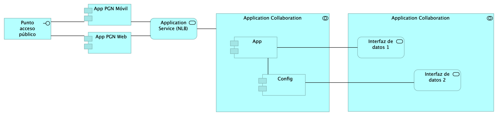

## Lineabase.0.SIU applicación
{#fig:Lineabase.0.SIUapplicación width=}

Procuraduría General de la Nación, proyecto Migración SIU, 2023, Fase II. Línea base del sistema único de información (SUI en adelante) de la PGN. Presentación de componentes de software  originales implementados en la Fase I del presente proyecto.

## Representación Arquitectónica
Con una arquitectura orientada a servicios SUI recopila:

1. Runtime: Es el servicio que interactúa con el usuario final (GUI) elaborado en Angular 11
1. API Tx: Servicio api rest base node encargado de realizar las transacciones básicas CRUD
1. API Config / Seguridad. Servicio Web API .Net Framework encargado de gestionar características con la autenticación y configuración

 

### Catálogo de Elementos
| Name| Type| Description| Properties
|:--------|:--------|:--------|:--------|
|**Application Collaboration**|application-collaboration|||
|**Application Collaboration**|application-collaboration|||
|**App**|application-component||*plataforma:* node Js *brecha:* 100 |
|**App PGN Móvil**|application-component|A partir de los lineamientos de desarrollo seguro establecidos en The OWASP Foundation recomendados en la “Guía de desarrollo OWASP” y “OWAS Cheat Sheet, se realizaran pruebas de seguridad a partir del analisis de vulnerabilidades, y pruebas de Ethikal Hacking.  Protección de datos personales,  Los sistemas de información que recogen, procesan y almacenan información de los derechos de las personas se deben almacenar de forma adecuada, la información que pueda ser vulnerada puede generar obliaciones legales y éticas con respecto a la perdida de informacion confidencial por parte de ciudadanos del pais.  La informacion contenida en las bases de datos debe tener los mecanismos de cifrado que en otros apartados se han mencionado.  La legislación que hay que tener como referencia, ley 1581 de 2012. Decreto 1377 de 2013 La metodologia empleada tendrá las siguientes fases:  •	FASE DE RECONOCIMIENTO:  Se recolectará toda la información posible, usando diferentes técnicas como: o	Recopilación de dominios/IPs/puertos/servicios o	Recopilación de metadatos o	Uso de Google Dorks. •	ANÁLSIS DE VULNERABILIDADES:  Se analizará la información recopilada en la fase anterior y se realizará el descubrimiento de las vulnerabilidades.  •	EXPLOTACIÓN:  •	Se realizarán todas aquellas acciones que puedan comprometer al sistema auditado, las pruebas a implementar pueden ser de ataques tipo:  o	Inyección de código o	Inclusión de ficheros locales o remotos o	Evasión de autenticación o	Carencia de controles de autorización o	Ejecución de comandos en el lado del servidor o	Ataques tipo Cross Site Request Forgery o	Control de errores o	Gestión de sesiones o	Fugas de información o	Secuestros de sesión o	Comprobación de las condiciones para realizar una denegación de servicio. 	 •	POST EXPLOTACIÓN: En caso de encontrarse una vulnerabilidad que permita realizar otras acciones en el sistema auditado o en su entorno, se realizarán controles adiciones con el objetivo de comprobar la criticidad de esta. No	URL	IP 1.	https://runtimetest.lappiz.io/#/auth/login/PGN_Lappiz 135.181.185.207 |*plantilla:* element-md-bold *brecha:* 100 |
|**App PGN Web**|application-component|A partir de los lineamientos de desarrollo seguro establecidos en The OWASP Foundation recomendados en la “Guía de desarrollo OWASP” y “OWAS Cheat Sheet, se realizaran pruebas de seguridad a partir del analisis de vulnerabilidades, y pruebas de Ethical Hacking.  Los resultados permitirán identificar los requisitos de seguridad que los sistemas de informacion o servicios web deberán cumplir. La metodologia empleada tendrá las siguientes fases:  •	FASE DE RECONOCIMIENTO:  Se recolectará toda la información posible, usando diferentes técnicas como: o	Recopilación de dominios/IPs/puertos/servicios o	Recopilación de metadatos o	Uso de Google Dorks. •	ANÁLSIS DE VULNERABILIDADES:  Se analizará la información recopilada en la fase anterior y se realizará el descubrimiento de las vulnerabilidades.  •	EXPLOTACIÓN:  •	Se realizarán todas aquellas acciones que puedan comprometer al sistema auditado, las pruebas a implementar pueden ser de ataques tipo:  o	Inyección de código o	Inclusión de ficheros locales o remotos o	Evasión de autenticación o	Carencia de controles de autorización o	Ejecución de comandos en el lado del servidor o	Ataques tipo Cross Site Request Forgery o	Control de errores o	Gestión de sesiones o	Fugas de información o	Secuestros de sesión o	Comprobación de las condiciones para realizar una denegación de servicio. 	 •	POST EXPLOTACIÓN: En caso de encontrarse una vulnerabilidad que permita realizar otras acciones en el sistema auditado o en su entorno, se realizarán controles adiciones con el objetivo de comprobar la criticidad de esta. No	URL	IP 1.	https://runtimetest.lappiz.io/#/auth/login/PGN_Lappiz 135.181.185.207 El Login deberá evidenciar el control de errores, al momento de realizar la validación deberá mensaje de error para el caso que se autentique con credenciales erradas. |*plataforma:* angular 11 *brecha:* 100 |
|**Config**|application-component||*plataforma:* cs |
|**Punto acceso público**|application-interface|URL tipo C HTTP||
|**Application Service (NLB)**|application-service||*plataforma:* angular 11 *brecha:* 100 |
|**Interfaz de datos 1**|application-service|||
|**Interfaz de datos 2**|application-service|||
