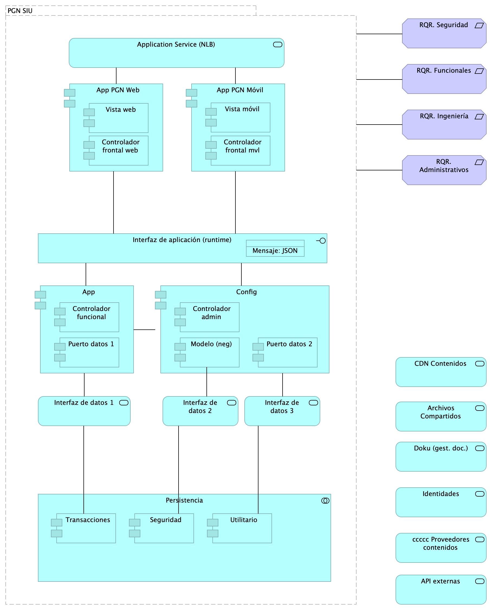

## Lineabase.1.SUI componente
{#fig:Lineabase.1.SIUcomponente width=5.89in}

Distribución de los servicios y paquetes que integran la aplicación de SUI. 

Cuatro paquetes con tecnologías respectivas

1. Angular 11 (Web)
1. API Transaccional (Node Js)
1. API Config (C#)
1. Persistencia (SQL)

Asuntos de la Migración:

* Estrategia CMS central
* Motor de búsqueda
* Estatego como BI
* Conciliación y Doku
* Gestión de sesiones / caducidad

### Catálogo de Elementos
| Name| Type| Description| Properties
|:--------|:--------|:--------|:--------|
|**Persistencia**|application-collaboration|||
|**App**|application-component||*plataforma:* node Js *brecha:* 100 |
|**App PGN Móvil**|application-component|A partir de los lineamientos de desarrollo seguro establecidos en The OWASP Foundation recomendados en la “Guía de desarrollo OWASP” y “OWAS Cheat Sheet, se realizaran pruebas de seguridad a partir del analisis de vulnerabilidades, y pruebas de Ethikal Hacking.  Protección de datos personales,  Los sistemas de información que recogen, procesan y almacenan información de los derechos de las personas se deben almacenar de forma adecuada, la información que pueda ser vulnerada puede generar obliaciones legales y éticas con respecto a la perdida de informacion confidencial por parte de ciudadanos del pais.  La informacion contenida en las bases de datos debe tener los mecanismos de cifrado que en otros apartados se han mencionado.  La legislación que hay que tener como referencia, ley 1581 de 2012. Decreto 1377 de 2013 La metodologia empleada tendrá las siguientes fases:  •	FASE DE RECONOCIMIENTO:  Se recolectará toda la información posible, usando diferentes técnicas como: o	Recopilación de dominios/IPs/puertos/servicios o	Recopilación de metadatos o	Uso de Google Dorks. •	ANÁLSIS DE VULNERABILIDADES:  Se analizará la información recopilada en la fase anterior y se realizará el descubrimiento de las vulnerabilidades.  •	EXPLOTACIÓN:  •	Se realizarán todas aquellas acciones que puedan comprometer al sistema auditado, las pruebas a implementar pueden ser de ataques tipo:  o	Inyección de código o	Inclusión de ficheros locales o remotos o	Evasión de autenticación o	Carencia de controles de autorización o	Ejecución de comandos en el lado del servidor o	Ataques tipo Cross Site Request Forgery o	Control de errores o	Gestión de sesiones o	Fugas de información o	Secuestros de sesión o	Comprobación de las condiciones para realizar una denegación de servicio. 	 •	POST EXPLOTACIÓN: En caso de encontrarse una vulnerabilidad que permita realizar otras acciones en el sistema auditado o en su entorno, se realizarán controles adiciones con el objetivo de comprobar la criticidad de esta. No	URL	IP 1.	https://runtimetest.lappiz.io/#/auth/login/PGN_Lappiz 135.181.185.207 |*plantilla:* element-md-bold *brecha:* 100 |
|**App PGN Web**|application-component|A partir de los lineamientos de desarrollo seguro establecidos en The OWASP Foundation recomendados en la “Guía de desarrollo OWASP” y “OWAS Cheat Sheet, se realizaran pruebas de seguridad a partir del analisis de vulnerabilidades, y pruebas de Ethical Hacking.  Los resultados permitirán identificar los requisitos de seguridad que los sistemas de informacion o servicios web deberán cumplir. La metodologia empleada tendrá las siguientes fases:  •	FASE DE RECONOCIMIENTO:  Se recolectará toda la información posible, usando diferentes técnicas como: o	Recopilación de dominios/IPs/puertos/servicios o	Recopilación de metadatos o	Uso de Google Dorks. •	ANÁLSIS DE VULNERABILIDADES:  Se analizará la información recopilada en la fase anterior y se realizará el descubrimiento de las vulnerabilidades.  •	EXPLOTACIÓN:  •	Se realizarán todas aquellas acciones que puedan comprometer al sistema auditado, las pruebas a implementar pueden ser de ataques tipo:  o	Inyección de código o	Inclusión de ficheros locales o remotos o	Evasión de autenticación o	Carencia de controles de autorización o	Ejecución de comandos en el lado del servidor o	Ataques tipo Cross Site Request Forgery o	Control de errores o	Gestión de sesiones o	Fugas de información o	Secuestros de sesión o	Comprobación de las condiciones para realizar una denegación de servicio. 	 •	POST EXPLOTACIÓN: En caso de encontrarse una vulnerabilidad que permita realizar otras acciones en el sistema auditado o en su entorno, se realizarán controles adiciones con el objetivo de comprobar la criticidad de esta. No	URL	IP 1.	https://runtimetest.lappiz.io/#/auth/login/PGN_Lappiz 135.181.185.207 El Login deberá evidenciar el control de errores, al momento de realizar la validación deberá mensaje de error para el caso que se autentique con credenciales erradas. |*plataforma:* angular 11 *brecha:* 100 |
|**Config**|application-component||*plataforma:* cs |
|**Controlador admin**|application-component||*plataforma:* cs |
|**Controlador frontal mvl**|application-component||*plataforma:* js |
|**Controlador frontal web**|application-component|-	Verificados los SSL, se recomienda adquirir SSL seguros, con entidades certificadoras.  Si se desea continuar con SSL de Let's Encrypt, se recomienda automatizar el proceso de actualización dado que al dejar estos en modo actualización manual es probable el olvido de esta actualización (Estos certificados se deben actualizar trimestralmente y no cuentan con las características de seguridad necesarias.  |*plataforma:* js |
|**Controlador funcional**|application-component||*plataforma:* js |
|**Modelo (neg)**|application-component||*plataforma:* cs |
|**Puerto datos 1**|application-component||*plataforma:* js |
|**Puerto datos 2**|application-component||*plataforma:* cs |
|**Seguridad**|application-component||*plataforma:* sql *brecha:* 100 |
|**Transacciones**|application-component||*plataforma:* sql *brecha:* 100 |
|**Utilitario**|application-component||*plataforma:* no-sql |
|**Vista móvil**|application-component||*plataforma:* js |
|**Vista web**|application-component|-	Verificados los SSL, se recomienda adquirir SSL seguros, con entidades certificadoras.  Si se desea continuar con SSL de Let's Encrypt, se recomienda automatizar el proceso de actualización dado que al dejar estos en modo actualización manual es probable el olvido de esta actualización (Estos certificados se deben actualizar trimestralmente y no cuentan con las características de seguridad necesarias.  4.	SERVICIOS IDENTIFICADOS: Servidor web:  Microsoft-IIS/10.0  Marco de Programación: ASP.NET Huellas digitales identificadas:   Huella digital SHA-256 “FC:79:06:7E:F5:24:20:50:F1:C0:74:F7:85:56:B9:05:B7:33:A3:2D:44:A0:48” Huella digital SHA1 “8C:48:BD:E2:F5:18:18:C3:85:96:68:44:2E:28:A0:68:08:2F:0A:BE” |*plataforma:* html |
|**Interfaz de aplicación (runtime)**|application-interface|Servidor web:  Microsoft-IIS/10.0  Marco de Programación: ASP.NET Huellas digitales identificadas:   Huella digital SHA-256 “FC:79:06:7E:F5:24:20:50:F1:C0:74:F7:85:56:B9:05:B7:33:A3:2D:44:A0:48” Huella digital SHA1 “8C:48:BD:E2:F5:18:18:C3:85:96:68:44:2E:28:A0:68:08:2F:0A:BE” |*plataforma:* angular 11 |
|**API externas**|application-service|||
|**Application Service (NLB)**|application-service||*plataforma:* angular 11 *brecha:* 100 |
|**Archivos Compartidos**|application-service|||
|**CDN Contenidos**|application-service||*brecha:* 100 |
|**Doku (gest. doc.)**|application-service||*brecha:* 100 |
|**Identidades**|application-service|||
|**Interfaz de datos 1**|application-service|||
|**Interfaz de datos 2**|application-service|||
|**Interfaz de datos 3**|application-service|||
|**ccccc Proveedores contenidos**|application-service||*brecha:* 100 |
|**Mensaje: JSON**|data-object|||
|**PGN SUI**|grouping|El objetivo principal de la arquitectura del SUI de la migración es la centralización de los conceptos misionales: concentrar los conceptos misionales en componentes aislados; dejar por fuera de estos componentes misionales todo lo distintos a la misionalidad de la PGN. Los objetivos secundarios de esta arquitectura SUI de la migración son flexibilidad y extensibilidad. Dichos objetivos son independientes. Es decir, estos pueden ser maximizados sin conclifcto entre ellos. El api transaccional construida en Node js con ORM Sequelize cuenta con obligatoriedad de token tipo bearer generado desde Api config (Api security token generado con autenticación de directorio activo o login de usuario  externo) cuenta con un modelo de capas donde primero se encuentra un DTO consistente en estructura de datos y métodos de “check permissions” (un endpoint del api de seguridad para validar privilegios sobre las acciones de  la petición en ingreso) luego dependiendo del tipo de transacción se tiene una capa para Lappiz functions, Lappiz Jobs (Tareas programables) y Lappiz model (Generado con base ORM sequelize). Todas las transacciones una vez  son validadas en token y permisos, pasan a un tenedor de conexión para modificar las cadenas de conexión en marcha y saber que usuario de bd va a efectuar la operación y con qué privilegios. Todas las peticiones entran en  un modelo natural de node js compuesto por un Event queue y un evento Loop; estas peticiones se procesan en la base de datos y todas las excepciones controladas se registran en un log de errores en formato txt con las especificaciones y devolviendo errores controlados con protocolos HTTPs al Runtime (front de SUI).||
|**RQR. Administrativos**|requirement|||
|**RQR. Funcionales**|requirement|||
|**RQR. Ingeniería**|requirement|||
|**RQR. Seguridad**|requirement|Requerimientos de seguridad, SUI, Migración, en aspectos de comunicación, autenticación, autorización y (manejo de) sesiones. ||
