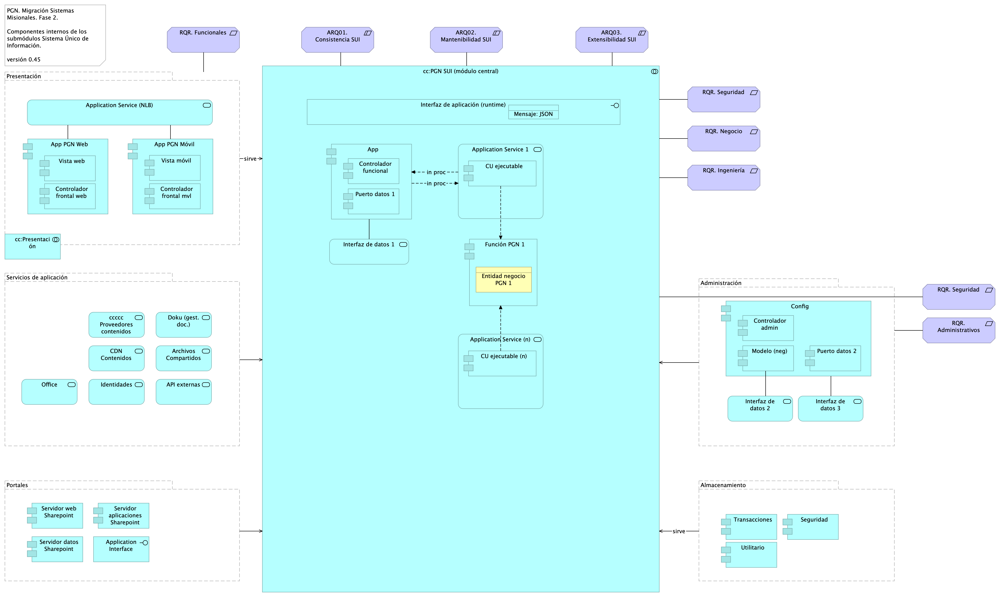

## Migracion.1b.1. SIU Módulos Componentes
{#fig:Migracion.1b.1.SIUMódulosComponentes width=}

Presentación de los componentes internos de los submódulos del sistema único de información migrado, SUI de PGN. Organización intena de los servicios y paquetes que integran cada submódulo del SUI. Todos los sistemas de información del SUI siguen esta directiva: estarán constituídos por submódulos dispuestos en relación de utilitarios (que sirven) a los componentes misionales del SUI, ubicados en el centro en la diagrama. 

La organización de componentes de migración SUI facilita focalizar la selección de tecnologeias. Los componentes internos y tecnologías elegidas son las siguientes

1. Presentación: Angular 11 (Web)
1. PGN SUI: API Transaccional (Node Js)
1. Administración: API Config (C#)
1. Persistencia: (SQL)

Los submódulos del SUI, tal como están presentados, reúnen a las partes que tienen el mismo rol en favor de la coherencia. Así mismo, estos pueden ser intercambiados o ampliados sin perjuicio del SUI gracias a las interfaces de unión (en favor de la extensibilidad).

Las interfaces de unión indicadas arriba obligan a los submódulos a cumplir las exigencias de los componentes misionales del SUI.

### Catálogo de Elementos
| Name| Type| Description| Properties
|:--------|:--------|:--------|:--------|
|**cc:PGN SUI (módulo central)**|application-collaboration|Módulo central SUI migrado. Módulo independiente y asignado a un dominio partigular de la PGN. ||
|**cc:Presentación**|application-collaboration|Submódulo de presentación del SUI. interfaz gráfica, interfaz web visible a los usuarios clientes y funcionarios de la PGN. ||
|**App**|application-component||*plataforma:* node Js *brecha:* 100 |
|**App PGN Móvil**|application-component|A partir de los lineamientos de desarrollo seguro establecidos en The OWASP Foundation recomendados en la “Guía de desarrollo OWASP” y “OWAS Cheat Sheet, se realizaran pruebas de seguridad a partir del analisis de vulnerabilidades, y pruebas de Ethikal Hacking.  Protección de datos personales,  Los sistemas de información que recogen, procesan y almacenan información de los derechos de las personas se deben almacenar de forma adecuada, la información que pueda ser vulnerada puede generar obliaciones legales y éticas con respecto a la perdida de informacion confidencial por parte de ciudadanos del pais.  La informacion contenida en las bases de datos debe tener los mecanismos de cifrado que en otros apartados se han mencionado.  La legislación que hay que tener como referencia, ley 1581 de 2012. Decreto 1377 de 2013 La metodologia empleada tendrá las siguientes fases:  •	FASE DE RECONOCIMIENTO:  Se recolectará toda la información posible, usando diferentes técnicas como: o	Recopilación de dominios/IPs/puertos/servicios o	Recopilación de metadatos o	Uso de Google Dorks. •	ANÁLSIS DE VULNERABILIDADES:  Se analizará la información recopilada en la fase anterior y se realizará el descubrimiento de las vulnerabilidades.  •	EXPLOTACIÓN:  •	Se realizarán todas aquellas acciones que puedan comprometer al sistema auditado, las pruebas a implementar pueden ser de ataques tipo:  o	Inyección de código o	Inclusión de ficheros locales o remotos o	Evasión de autenticación o	Carencia de controles de autorización o	Ejecución de comandos en el lado del servidor o	Ataques tipo Cross Site Request Forgery o	Control de errores o	Gestión de sesiones o	Fugas de información o	Secuestros de sesión o	Comprobación de las condiciones para realizar una denegación de servicio. 	 •	POST EXPLOTACIÓN: En caso de encontrarse una vulnerabilidad que permita realizar otras acciones en el sistema auditado o en su entorno, se realizarán controles adiciones con el objetivo de comprobar la criticidad de esta. No	URL	IP 1.	https://runtimetest.lappiz.io/#/auth/login/PGN_Lappiz 135.181.185.207 |*plantilla:* element-md-bold *brecha:* 100 |
|**App PGN Web**|application-component|A partir de los lineamientos de desarrollo seguro establecidos en The OWASP Foundation recomendados en la “Guía de desarrollo OWASP” y “OWAS Cheat Sheet, se realizaran pruebas de seguridad a partir del analisis de vulnerabilidades, y pruebas de Ethical Hacking.  Los resultados permitirán identificar los requisitos de seguridad que los sistemas de informacion o servicios web deberán cumplir. La metodologia empleada tendrá las siguientes fases:  •	FASE DE RECONOCIMIENTO:  Se recolectará toda la información posible, usando diferentes técnicas como: o	Recopilación de dominios/IPs/puertos/servicios o	Recopilación de metadatos o	Uso de Google Dorks. •	ANÁLSIS DE VULNERABILIDADES:  Se analizará la información recopilada en la fase anterior y se realizará el descubrimiento de las vulnerabilidades.  •	EXPLOTACIÓN:  •	Se realizarán todas aquellas acciones que puedan comprometer al sistema auditado, las pruebas a implementar pueden ser de ataques tipo:  o	Inyección de código o	Inclusión de ficheros locales o remotos o	Evasión de autenticación o	Carencia de controles de autorización o	Ejecución de comandos en el lado del servidor o	Ataques tipo Cross Site Request Forgery o	Control de errores o	Gestión de sesiones o	Fugas de información o	Secuestros de sesión o	Comprobación de las condiciones para realizar una denegación de servicio. 	 •	POST EXPLOTACIÓN: En caso de encontrarse una vulnerabilidad que permita realizar otras acciones en el sistema auditado o en su entorno, se realizarán controles adiciones con el objetivo de comprobar la criticidad de esta. No	URL	IP 1.	https://runtimetest.lappiz.io/#/auth/login/PGN_Lappiz 135.181.185.207 El Login deberá evidenciar el control de errores, al momento de realizar la validación deberá mensaje de error para el caso que se autentique con credenciales erradas. |*plataforma:* angular 11 *brecha:* 100 |
|**CU ejecutable**|application-component||*plataforma:* js |
|**CU ejecutable (n)**|application-component||*plataforma:* js |
|**Config**|application-component||*plataforma:* cs |
|**Controlador admin**|application-component||*plataforma:* cs |
|**Controlador frontal mvl**|application-component||*plataforma:* js |
|**Controlador frontal web**|application-component|-	Verificados los SSL, se recomienda adquirir SSL seguros, con entidades certificadoras.  Si se desea continuar con SSL de Let's Encrypt, se recomienda automatizar el proceso de actualización dado que al dejar estos en modo actualización manual es probable el olvido de esta actualización (Estos certificados se deben actualizar trimestralmente y no cuentan con las características de seguridad necesarias.  |*plataforma:* js |
|**Controlador funcional**|application-component||*plataforma:* js |
|**Función PGN**|application-component|La unidad de cómputo que resulta en la aplicación de una regla de negocio. |*plataforma:* js |
|**Modelo (neg)**|application-component||*plataforma:* cs |
|**Puerto datos 1**|application-component||*plataforma:* js |
|**Puerto datos 2**|application-component||*plataforma:* cs |
|**Seguridad**|application-component||*plataforma:* sql *brecha:* 100 |
|**Servidor aplicaciones Sharepoint**|application-component|||
|**Servidor datos Sharepoint**|application-component|||
|**Servidor web Sharepoint**|application-component|||
|**Transacciones**|application-component||*plataforma:* sql *brecha:* 100 |
|**Utilitario**|application-component||*plataforma:* no-sql |
|**Vista móvil**|application-component||*plataforma:* js |
|**Vista web**|application-component|-	Verificados los SSL, se recomienda adquirir SSL seguros, con entidades certificadoras.  Si se desea continuar con SSL de Let's Encrypt, se recomienda automatizar el proceso de actualización dado que al dejar estos en modo actualización manual es probable el olvido de esta actualización (Estos certificados se deben actualizar trimestralmente y no cuentan con las características de seguridad necesarias.  4.	SERVICIOS IDENTIFICADOS: Servidor web:  Microsoft-IIS/10.0  Marco de Programación: ASP.NET Huellas digitales identificadas:   Huella digital SHA-256 “FC:79:06:7E:F5:24:20:50:F1:C0:74:F7:85:56:B9:05:B7:33:A3:2D:44:A0:48” Huella digital SHA1 “8C:48:BD:E2:F5:18:18:C3:85:96:68:44:2E:28:A0:68:08:2F:0A:BE” |*plataforma:* html |
|**Application Interface**|application-interface|||
|**Interfaz de aplicación (runtime)**|application-interface|Servidor web:  Microsoft-IIS/10.0  Marco de Programación: ASP.NET Huellas digitales identificadas:   Huella digital SHA-256 “FC:79:06:7E:F5:24:20:50:F1:C0:74:F7:85:56:B9:05:B7:33:A3:2D:44:A0:48” Huella digital SHA1 “8C:48:BD:E2:F5:18:18:C3:85:96:68:44:2E:28:A0:68:08:2F:0A:BE” |*plataforma:* angular 11 |
|**API externas**|application-service|||
|**Application Service (NLB)**|application-service||*plataforma:* angular 11 *brecha:* 100 |
|**Application Service (n)**|application-service|Implementación de un caso de uso de negocio, independiente y demostrable. Contiene a la unidad ejecutable del CU y a la entidad ||
|**Application Service 1**|application-service|Implementación de un caso de uso de negocio, independiente y demostrable. Contiene a la unidad ejecutable del CU y reutiliza (accede a) una entidad de negocio, que puede ser también una función PGN. ||
|**Archivos Compartidos**|application-service|||
|**CDN Contenidos**|application-service||*brecha:* 100 |
|**Doku (gest. doc.)**|application-service||*brecha:* 100 |
|**Identidades**|application-service|||
|**Interfaz de datos 1**|application-service|||
|**Interfaz de datos 2**|application-service|||
|**Interfaz de datos 3**|application-service|||
|**Office**|application-service|||
|**ccccc Proveedores contenidos**|application-service||*brecha:* 100 |
|**Entidad negocio PGN**|business-object|Repreesnta un objeto de negocio del contexto de la entidad PGN,, por ejemplo: un decreto, una intervención, una conciliación. ||
|**ARQ01. Consistencia SUI**|constraint|Unifica las entidades de negocio PGN, entre las que se incluyen a conciliaciones, publicaciones de relatoría, resoluciones, en artefactos reutilizables. Distinto de que estas entidades (y su lógica de negocio) estén dispersos entre los sistemas del SUI, estarán concentradas en un único artefacto correspondiente. Calidad sistémica: la consistencia persigue que el resultado de la lógica de negocio sea la misma entre los módulos del SUI migrado. Esto redunda a mantenibilidad y gestión: tiende a tener un solo punto de cambio y dificulta la transferencia de dependencias implícitas a otros procesos.||
|**ARQ02. Mantenibilidad SUI**|constraint|Evitar las dependencia transitivas de los módulos misionales del SUI a componentes y sistemas de terceros o submódulos no misionales.  Calidad sistémica: la mantenibilidad por control de dependencias que optimiza el diseño Migración SUI está dada por el control de cambios no programados sobre los componentes misionales del SUI (corrupción de componentes). Ver Patrón de Diseño Migración SUI, más adelante en el documento.||
|**ARQ03. Extensibilidad SUI**|constraint|Concentración de los componentes de negocio, misionales, del SUI protegidos de cambios provenientes de otros sistemas. Ver Patrón de Diseño Migración SUI, más adelante en el documento. Calidad sistémica: la extensibilidad que optimiza el diseño Migración SUI está dada por el intercambio de submódulos no misionales, como el gestor documental, sin afectación de los componentes misionales que este diseño protege.||
|**Mensaje: JSON**|data-object|||
|**Administración**|grouping|||
|**Almacenamiento**|grouping|||
|**Portales**|grouping|Submódulo de portales internos de la PGN a donde llega el SUI. Interfaz web que usa al SUI para llegar a direcciones y subdirecciones de la PGN. La plataforma principal de portales en este contexto es Sharepoint de Microsoft. ||
|**Presentación**|grouping|Submódulo de presentación del SUI. interfaz gráfica, interfaz web visible a los usuarios clientes y funcionarios de la PGN. ||
|**Servicios de aplicación**|grouping|Submódulo de servicios utilitarios que sirven al SUI. Servicios variados que cumplen roles facilitadores de las actividades misionales del SUI. Ejemplos de estos servicios son los de gestión documental, implementado por Doku en el contexto de PGN. ||
|**RQR. Administrativos**|requirement|||
|**RQR. Funcionales**|requirement|||
|**RQR. Ingeniería**|requirement|||
|**RQR. Negocio**|requirement|||
|**RQR. Seguridad**|requirement|Requerimientos de seguridad, SUI, Migración, en aspectos de comunicación, autenticación, autorización y (manejo de) sesiones. ||
|**RQR. Seguridad**|requirement|Requerimientos de seguridad, SUI, Migración, en aspectos de comunicación, autenticación, autorización y (manejo de) sesiones. ||
