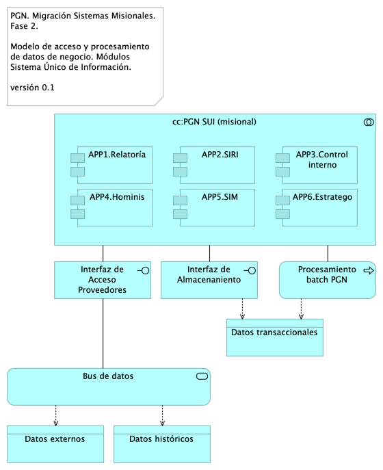

## Migracion.2. datos
{#fig:Migracion.2.datos width=}

Modelo de acceso y procesamiento a datos de negocio del SUI. Presentamos la organización de los ítems de datos de negocio necesarios para que los módulos del SUI puedan recolectar, procesar, integrary almacenarlos de forma organizada y escalable.

Mediante esta organización, los datos de negocio son transportados desde sus respectivas fuentes mediante interfaces (por principio de extensión y mantenibilidad). Los datos externos, entendidos como los de otros proveedores, son obtenidos mediante un intermediario: el bus de datos del SUI.

Consideramos tres tipos datos: datos transaccionales, históricos y externos, y presentamos una manera distinta de tratarlos y transportarlos.

### Catálogo de Elementos
| Name| Type| Description| Properties
|:--------|:--------|:--------|:--------|
|**cc:PGN SUI (misional)**|application-collaboration|||
|**APP1.Relatoría**|application-component|||
|**APP2.SIRI**|application-component|||
|**APP3.Control interno**|application-component|||
|**APP4.Hominis**|application-component|||
|**APP5.SIM**|application-component|||
|**APP6.Estratego**|application-component|||
|**Interfaz de Acceso Proveedores**|application-interface|||
|**Interfaz de Almacenaniento**|application-interface|||
|**Procesamiento batch PGN**|application-process|||
|**Bus de datos**|application-service|||
|**Datos externos**|data-object|||
|**Datos históricos**|data-object|||
|**Datos transaccionales**|data-object|||
