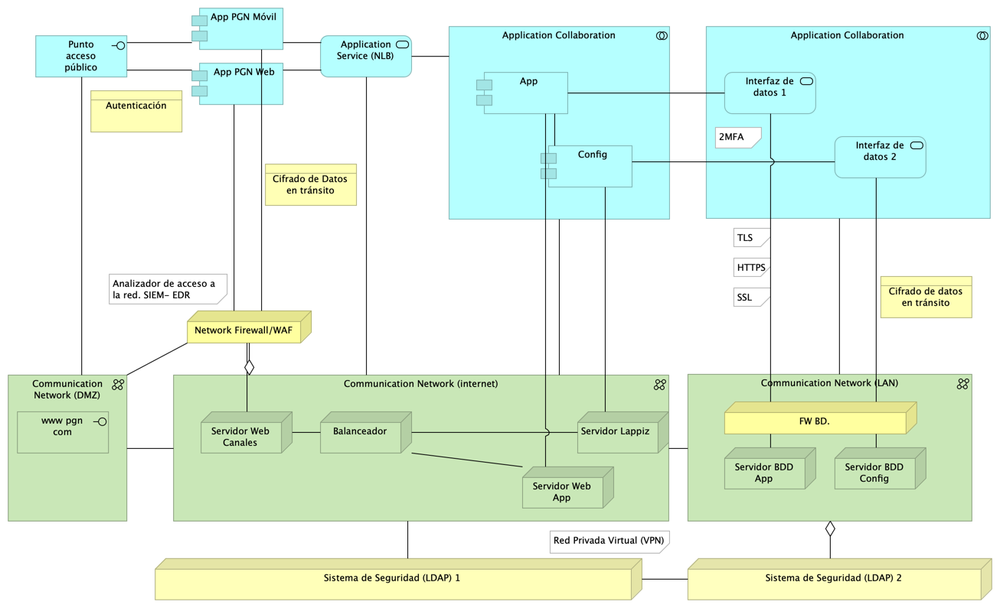

## Seguridad. Lineabase.0.SIU applicación
{#fig:Seguridad.Lineabase.0.SIUapplicación width=}

# Representación Arquitectónica
Con una arquitectura orientada a servicios SUI recopila:

1. Runtime: Es el servicio que interactúa con el usuario final (GUI) elaborado en Angular 11
1. API Tx: Servicio api rest base node encargado de realizar las transacciones básicas CRUD
1. API Config / Seguridad. Servicio Web API .Net Framework encargado de gestionar características con la autenticación y configuración

### Catálogo de Elementos
| Name| Type| Description| Properties
|:--------|:--------|:--------|:--------|
|**Application Collaboration**|application-collaboration|||
|**Application Collaboration**|application-collaboration|||
|**App**|application-component||*plataforma:* node Js |
|**App PGN Móvil**|application-component|||
|**App PGN Web**|application-component||*plataforma:* angular 11 |
|**Config**|application-component||*plataforma:* cs |
|**Punto acceso público**|application-interface|URL tipo C HTTP||
|**Application Service (NLB)**|application-service||*plataforma:* angular 11 |
|**Interfaz de datos 1**|application-service|||
|**Interfaz de datos 2**|application-service|||
|**Communication Network (DMZ)**|communication-network|||
|**Communication Network (LAN)**|communication-network|||
|**Communication Network (internet)**|communication-network|||
|**Balanceador**|node|||
|**FW BD.**|node|||
|**Network Firewall**|node|||
|**Servidor BDD App**|node|||
|**Servidor BDD Config**|node|||
|**Servidor Lappiz **|node|||
|**Servidor Web App**|node|||
|**Servidor Web Canales**|node|Nombre físico IP LAN IP Pública ||
|**Sistema de Seguridad (LDAP) 1**|node|Sistema de Seguridad (LDAP) 1. Control de acceso internet ||
|**Sistema de Seguridad (LDAP) 2**|node|Sistema de Seguridad (LDAP) 2. Control de acceso a datos||
|**Analizador de acceso a la red. SIEM- EDR**|resource|||
|**www pgn com**|technology-interface|||
|**Asignación de Tokens**|value-stream|||
|**HTTPS, TLS, SSL**|value-stream|||
|**Requiere 2 MFA**|value-stream|||
|**Uso de claves criptograficas.**|value-stream|||
|**Uso de claves criptograficas. (copy)**|value-stream|||
