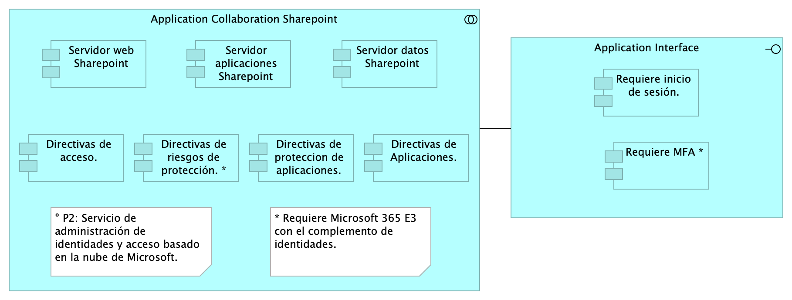

## Seguridad. Linebase.2.Portal
{#fig:Seguridad.Linebase.2.Portal width=}

El portal es el conjunto de los elementos físicos y lógicos necesarios para la implementación de la granja de servidores de SharePoint Server 2019 para el portal de la Procuraduría.

* Servidores Web Front End
* Servidores de Aplicaciones
* Servidores de SQL Server

### Catálogo de Elementos
| Name| Type| Description| Properties
|:--------|:--------|:--------|:--------|
|**Application Collaboration Sharepoint**|application-collaboration|||
|**Directivas de Aplicaciones.**|application-component|Requiere Microsoft 365 E3 con el complemento de identidades, La restricciones de acceso a las cargas de trabajo de productividad es un elemento clave, en la que los recursos locales y en la nube se autentican y se autorizan.  La autenticación por medio del AD con agentes que permiten ampliar su funcionalidad.||
|**Directivas de acceso.**|application-component|El control de acceso se da a partir de la autenticacion del directorio activo, y la integración del Single Sign-On (SSO), con el inicio unico de sesión fluido en todas las aplicaciones.  Se tendrá en cuenta la implementación con multiples capas de autenticación, autenticacion multifactor MFA ||
|**Directivas de proteccion de aplicaciones.**|application-component|||
|**Directivas de riesgos de protección. ***|application-component|||
|**Requiere MFA ***|application-component|Se deberá incorporar el 2FA para los accesos a la informacion que reposa en el SharePoint, que permita a los usuarios iniciar sesión de forma segura a través del uso de sus dispositivos móviles. ||
|**Requiere inicio de sesión.**|application-component|Presenta el formulario de inicio de sesión al usuario final que enviará la solicitud por medio del método POST, que envia datos de información al servidor. para que el servidor los agregue a su base de datos. ||
|**Servidor aplicaciones Sharepoint**|application-component|||
|**Servidor datos Sharepoint**|application-component|||
|**Servidor web Sharepoint**|application-component|||
|**Application Interface**|application-interface|||
