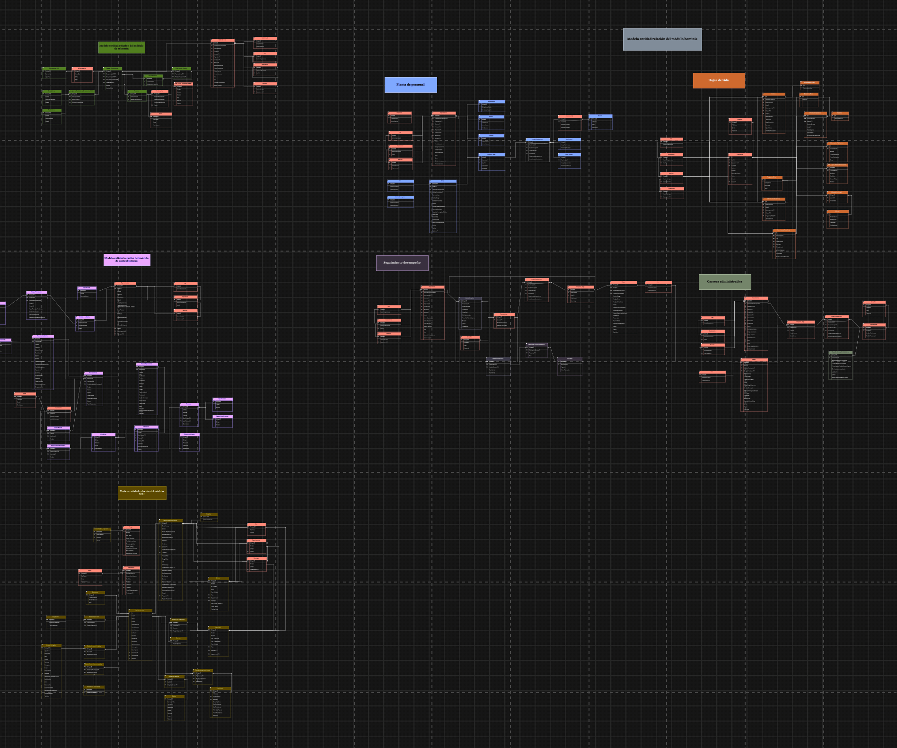

## Entregables de Arquitectura de Información (Datos)
* Diagrama Modelo de Datos Conceptual
* Diagrama Modelo de Datos Físico (diagramas entidad-relación)
* Diagrama Modelo de Datos Lógico
* Documento Diccionarios de Datos
* Mapa de Información (flujos de información)
* Modelo Ontológico

------

## Diagrama Modelo de Datos Conceptual
:::::::::::::: {.columns}
::: {.column width="30%"}
{#fig:Migracion.2a.a1.DatosInformación width=5.32in}
:::
::: {.column width="70%"}
### Migracion.2a.a1.Datos Información
Modelo de información. Organización y jerarquía de los grupos de datos (dominios) del SUI Migrado, 2023. 

Dominios Principales de Información SUI Migrado

* Dominio común: SIM
* Dominios individuales
	* Hominis: Planta de personal, Hojas de vida, Seguimiento de desempeño, Carrera administrativa
	* Conjunto de datos Relatoría
	* Control Interno
	* Conciliación Administrativa
:::
::::::::::::::

## Diagrama Modelo de Datos Físico (diagramas entidad-relación)
:::::::::::::: {.columns}
::: {.column width="30%"}
{#fig:Migracion.2a.a3.DatosModeloFísico width=}
:::
::: {.column width="70%"}
### Migracion.2a.a3. Datos Modelo Físico 
Los modelos físicos representados en diagramas entidad - relación (ER) de los módulos SUI Migrado, como Hominis, Control Interno, Relatoría, SIRI, serán entregados como documentos aparte, anexos al documento actual en formato reproducible.

El formato reproducible en el que entregamos el modelo físico mediante la herramienta libre Draw.io.
:::
::::::::::::::

## Diagrama Modelo de Datos Lógico
:::::::::::::: {.columns}
::: {.column width="30%"}
{#fig:Migracion.2c1.DatosSIM width=}
:::
::: {.column width="70%"}
### Migracion.2c1. Datos SIM

Identificación de entidades de datos de negocio relacionadas a los módulos SUI Migrado.

Las entidades de negocio son tipos de datos internos del SUI consideradas para el manejo del ciclo de vida de los datos.
:::
::::::::::::::

------

## Entregables de Arquitectura de Infraestructura (Datos)
*  Diagrama de Infraestructura de TI
* Documento sobre especificaciones técnicas de infraestructura TI

------
