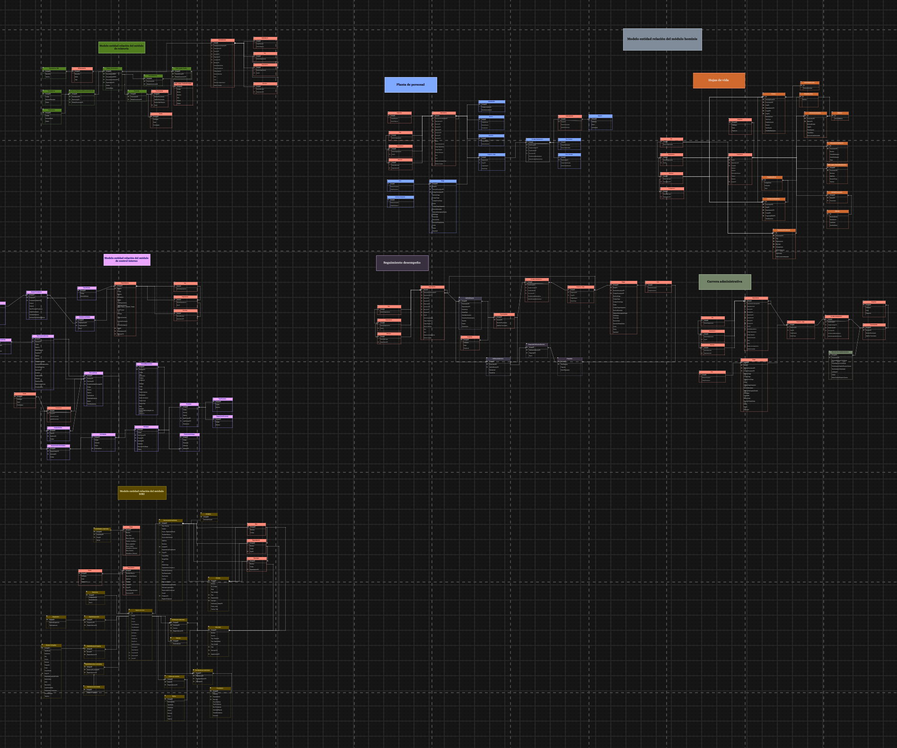
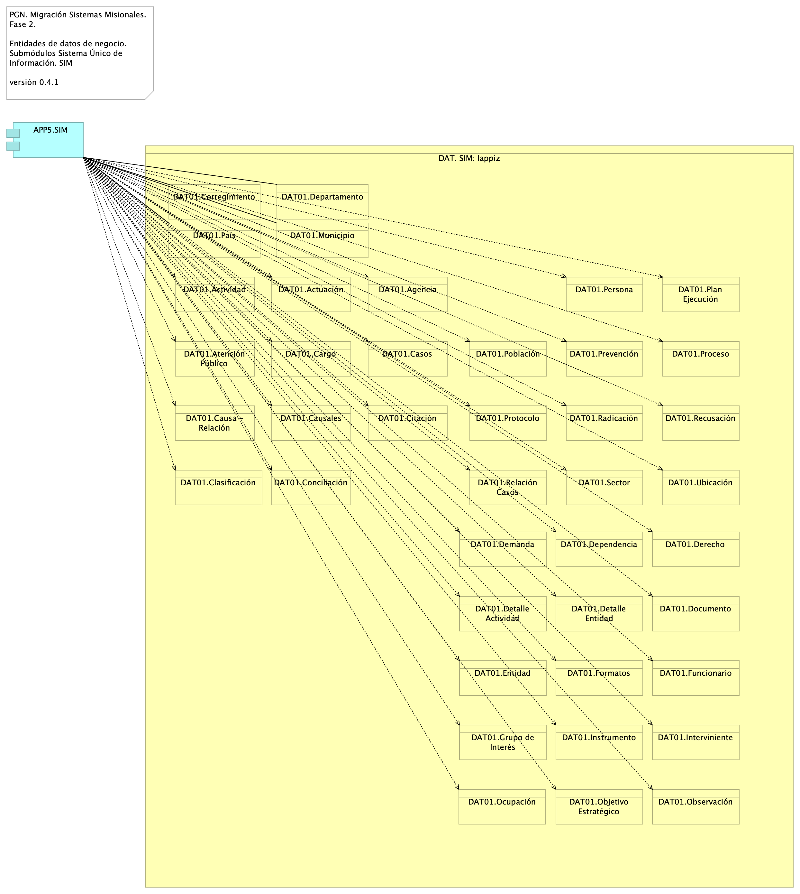

## Entregables de Arquitectura de Software
* Diagrama de Arquitectura de la Solución Propuesta: vista de integración
* Diagrama de Arquitectura de la solución propuesta: vista física
* Diagrama de Arquitectura de la Solución Propuesta: motivadores del negocio
* Diagrama de Arquitectura de la Solución Propuesta: interoperabilidad
* Diagrama de Arquitectura de la Solución Propuesta: gestión de autenticación, usuarios y roles
* Diagrama de Clases y Componentes de Solución
* Diagrama de Arquitectura de Integración Continua, DevOps y Despliegues de Capas
* Documento de Relación de Tecnologías y Licenciamiento

------

## Diagrama de Arquitectura de la Solución Propuesta: vista de integración
:::::::::::::: {.columns}
::: {.column width="70%"}
{#fig:Migracion.1a.b.SIUContextoMódulos width=}
:::
::: {.column width="30%"}
La vista presenta en contexto a los módulos SUI migrados e indica los modos de comunicación, sincrónica/asincrónica, que utilizan.
:::
::::::::::::::

## Diagrama de Arquitectura de la solución propuesta: vista física
:::::::::::::: {.columns}
::: {.column width="70%"}
{#fig:Lineabase.0.SIUAplicación.Física width=}
:::
::: {.column width="30%"}
Elementos de infraestructura física (hardware) para la implementación Fase II (presente proyecto) del  Sistema de Información Único, SUI de la PGN
:::
::::::::::::::

## Diagrama de Arquitectura de la Solución Propuesta: motivadores del negocio
:::::::::::::: {.columns}
::: {.column width="70%"}
{#fig:Migracion.1a.a.SIUContextoMódulo width=}
:::
::: {.column width="30%"}
Módulos y submódulos del Sistema Único de Información (SUI) de la PGN. Todos los sistemas de información del SUI separan a los componentes misionales de los utilitarios.
:::
::::::::::::::

## Diagrama de Arquitectura de la Solución Propuesta: interoperabilidad
:::::::::::::: {.columns}
::: {.column width="70%"}
{#fig:Migracion.1c.SIUMódulosColaboración width=}
:::
::: {.column width="70%"}
### Migracion.1c.SUI Módulos Colaboración
Colaboración y comunicación de los componentes internos del SUI mediada por interfaces provistas por el grupo de componentes misionales, PGN SUI: mantener reducido y controlado el número de interfaces.
:::
::::::::::::::

## Diagrama de Arquitectura de la Solución Propuesta: gestión de autenticación, usuarios y roles
:::::::::::::: {.columns}
::: {.column width="70%"}
{#fig:Seguridad.2.Lineabase.0.SIUAplicación width=}
:::
::: {.column width="70%"}
### Lineabase.0.SUI Aplicación
Métodos de Seguridad del SUI Migrado

* Control de acceso y autorización basado en roles (RBAC)
* Gestión de identidades
* Aprovisionamiento de Cuentas
:::
::::::::::::::

## Diagrama de Clases y Componentes de Solución (a)
:::::::::::::: {.columns}
::: {.column width="30%"}
{#fig:Migracion.1b.1.SIUMódulosComponentes width=}
:::
::: {.column width="70%"}
### Migracion.1b.1. SUI Módulos Componentes
Componentes internos de los submódulos del sistema único de información migrado, SUI de PGN. Organización interna de los servicios y paquetes que integran cada submódulo del SUI. Todos los sistemas de información del SUI siguen esta directiva: estarán constituidos por submódulos dispuestos en relación de utilitarios (que sirven) a los componentes misionales del SUI, ubicados en el centro en el diagrama.
:::
::::::::::::::

## Diagrama de Clases y Componentes de Solución (b)
:::::::::::::: {.columns}
::: {.column width="30%"}
{#fig:Migracion.1b.3.SIUMódulosClases width=}
:::
::: {.column width="70%"}
### Migracion.1b.3. SUI Módulos Clases
* El diseño actual antepone un servicio como punto de acceso a un caso de uso, de tal forma que este se encarga únicamente (por responsabilidad) de coordinar las entradas y las salidas del caso de uso
* El modelo propicia la separación de la lógica de aplicación y la lógica de negocio. En este diseño, la primera está encapsulada en el Caso de Uso ejecutable (en el diagrama), mientras que la lógica de negocio lo está en una función de negocio.
:::
::::::::::::::

## Diagrama de Arquitectura de Integración Continua, DevOps y Despliegues de Capas
:::::::::::::: {.columns}
::: {.column width="30%"}
{#fig:Migracion.4.CI width=}
:::
::: {.column width="70%"}
### Migracion.4. CI
Las cadenas están separadas por tecnologías y plataformas distintas; son independientes y no presentan interbloqueos en cuanto a su ejecución. Pero, requieren administración integral.
:::
::::::::::::::

## Documento de Relación de Tecnologías y Licenciamiento
:::::::::::::: {.columns}
::: {.column width="30%"}
{#fig:Migracion.5.Licenciamiento width=}
:::
::: {.column width="70%"}
### Migracion.5. Licenciamiento
Los elementos resaltados de la vista actual requieren modelos de  licenciamiento variado, bien sea por usuario, núcleo, despliegue (instalación), o renta por consumo.
:::
::::::::::::::

## Entregables de # Arquitectura de Información (Datos)
* Diagrama Modelo de Datos Conceptual
* Diagrama Modelo de Datos Físico (diagramas entidad-relación)
* Diagrama Modelo de Datos Lógico
* Documento Diccionarios de Datos
* Mapa de Información (flujos de información)
* Modelo Ontológico

------

## Diagrama Modelo de Datos Conceptual
:::::::::::::: {.columns}
::: {.column width="30%"}
{#fig:Migracion.2a.a1.DatosInformación width=5.32in}
:::
::: {.column width="70%"}
### Migracion.2a.a1.Datos Información
Modelo de información. Organización y jerarquía de los grupos de datos (dominios) del SUI Migrado, 2023. 

Dominios Principales de Información SUI Migrado

* Dominio común: SIM
* Dominios individuales
	* Hominis: Planta de personal, Hojas de vida, Seguimiento de desempeño, Carrera administrativa
	* Conjunto de datos Relatoría
	* Control Interno
	* Conciliación Administrativa
:::
::::::::::::::

## Diagrama Modelo de Datos Físico (diagramas entidad-relación)
:::::::::::::: {.columns}
::: {.column width="30%"}
{#fig:Migracion.2a.a3.DatosModeloFísico width=}
:::
::: {.column width="70%"}
### Migracion.2a.a3. Datos Modelo Físico 
Los modelos físicos representados en diagramas entidad - relación (ER) de los módulos SUI Migrado, como Hominis, Control Interno, Relatoría, SIRI, serán entregados como documentos aparte, anexos al documento actual en formato reproducible.

El formato reproducible en el que entregamos el modelo físico mediante la herramienta libre Draw.io.
:::
::::::::::::::

## Diagrama Modelo de Datos Lógico
:::::::::::::: {.columns}
::: {.column width="30%"}
{#fig:Migracion.2c1.DatosSIM width=}
:::
::: {.column width="70%"}
### Migracion.2c1. Datos SIM

Identificación de entidades de datos de negocio relacionadas a los módulos SUI Migrado.

Las entidades de negocio son tipos de datos internos del SUI consideradas para el manejo del ciclo de vida de los datos.
:::
::::::::::::::

