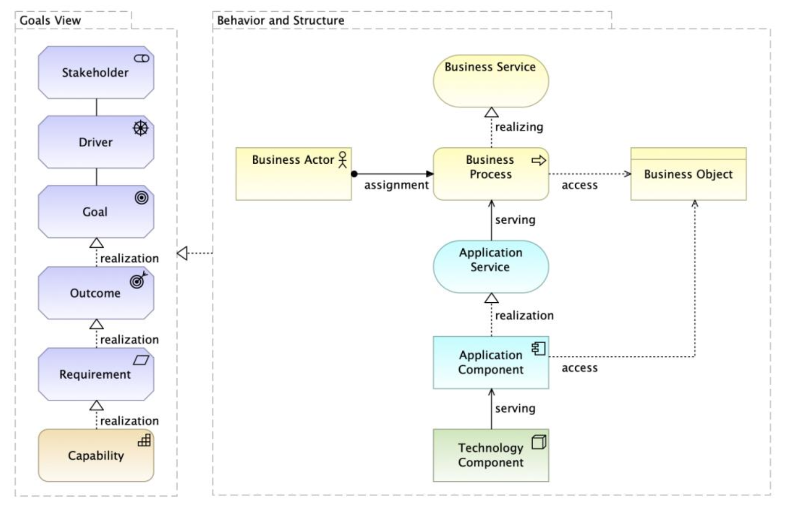
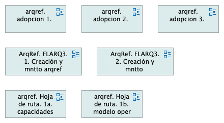
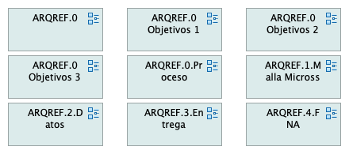
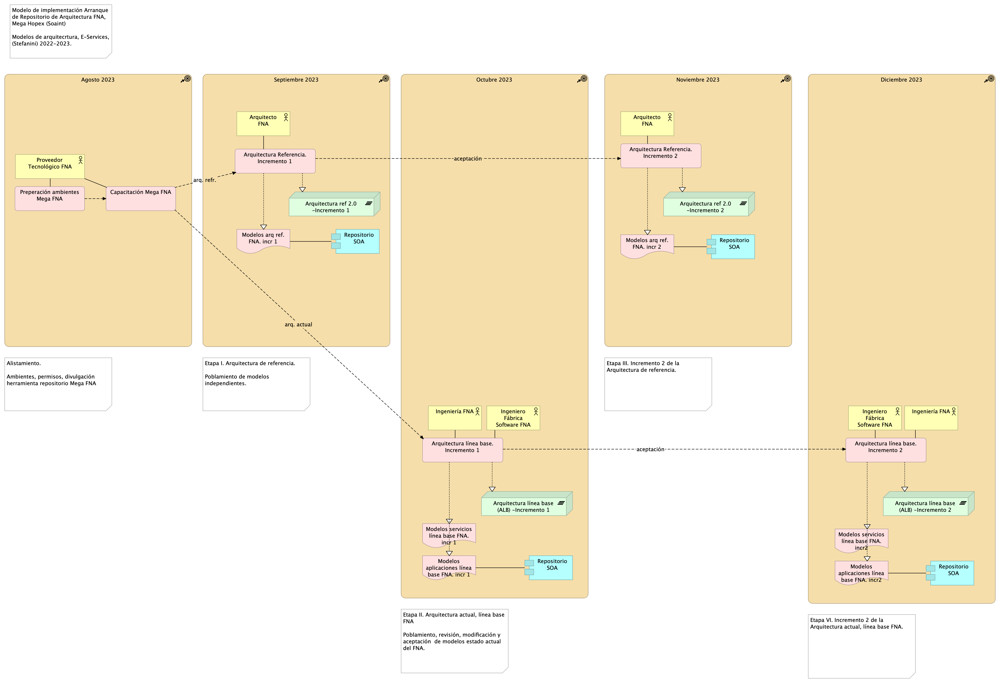
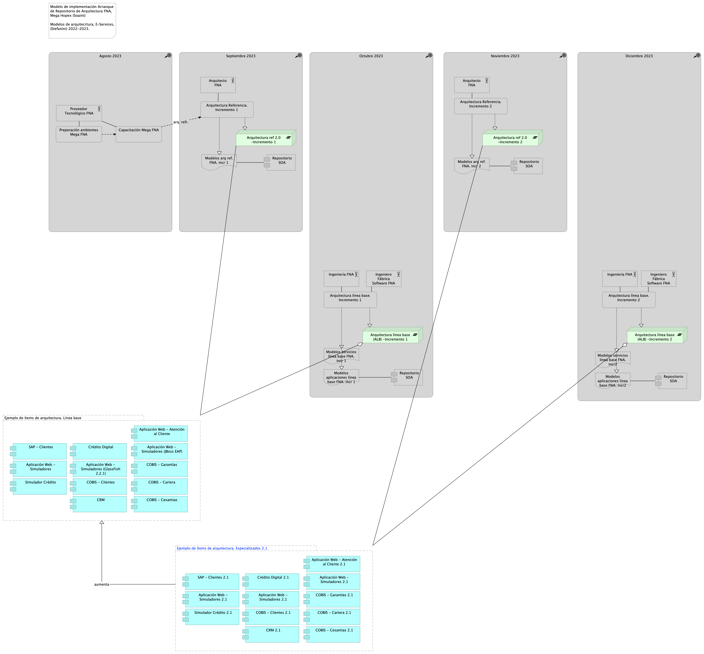

title: E-Service Etapa 2. Arquitectura de Referencia SOA 2.0 del FNA
geometry:
  - top=1in
  - bottom=1in
fignos-cleveref: True
fignos-plus-name: Fig.
fignos-caption-name: Imagen
tablenos-caption-name: Tabla
...

<small><em>Los productos de esta etapa ([Web](https://hwong23.github.io/pgn-078/v/79a07f05ed8d1d2bf4cbb85b646502cd8ff824b6/))
están basados en el resultado de la consultoría "Arquitectura E-Service",
[Sharepoint STEF@79a07f0](https://stefaninilatam.sharepoint.com/:f:/r/sites/PROYECTOARQUITECTURAE-SERVICEFNA/Documentos%20compartidos/General/Repositorio%20SOA/Procesos%20Fase%20II/181-2020.%20E-SERV.%20Fase%202-ETAPA%200.%20docx?csf=1&web=1&e=BiNcBP)
del August 28, 2023.
</em></small>

|    **Versión** del producto 1.79a07f0 de 28 Aug 2023

 

## Autores

+ **Harry Wong, ing.**
   
    · {.inline_icon width=16 height=16}
    [e_hwong](https://github.com/e_hwong)
     
  <small>
     Arquitecto SOA, Stefanini
  </small>

+ **Wilson Morales, ing.**
   
    · {.inline_icon width=16 height=16}
    [wmorales](https://github.com/wmorales)
     
  <small>
     Software, Aplicaciones
  </small>

+ **Sergio Andrés Castro Hernandez, ing.**
   
    · {.inline_icon width=16 height=16}
    [fhernandez](https://github.com/fhernandez)
     
  <small>
     SOA, Arquitectura
  </small>

+ **Viviana M. Martinez, ing.**
   
    · {.inline_icon width=16 height=16}
    [vmmartinez](https://github.com/vmmartinez)
     
  <small>
     Analista, Proyectos
  </small>

::: {#correspondence}
✉ — Enviar mensajes a Harry Wong, ing. \<e_hwong@stefanini.com\>.

:::

 

## Objetivo del Documento
Entrega de los productos de la Etapa 2, PR11 y PR12, del proyecto PR02, Arquitectura de Referencia SOA 2.0 del FNA, flujos de trabajo y personas que ejercitan y conforman (cumplen) con el gobierno SOA del FNA a desplegar a cargo de la oficina de arquitectura.

##  Control de Cambios {.page_break_before}
| Tema           | PRY02 Arquitectura de Referencia SOA 2.0 del FNA      |
|----------------|----------------------------|
| Palabras clave | SOA, E-Service, FNA, Análisis de brecha, GAP, Comparativa              |
| Autor          |                            |
| Fuente         |                            |
| Versión        | 1.79a07f0 del 28 Aug 2023 |
| Vínculos       | [N003a Vista Segmento SOA FNA](N03a%a20Vsta%20aSegenta%20SOA%20FNA.md) |

 

 

## Contenidos
\toc

---
prnombre: "Análisis de impacto y modelos actualizados de los ítems de arquitectura"
...

\newpage

>    E-Service. Fase II
>
>    PRY02. Arquitectura de Referencia SOA 2.0 del FNA. Contenido de los Productos Contractuales
>
>    Contrato 1812020
>
>    FNA, Stefanini
>
>    28 Aug 2023
>
>    **Versión** 1.79a07f0

 

# Producto 16: PR16. Análisis de impacto y modelos actualizados de los ítems de arquitectura
Similar al ejercicio del producto 6, Modelos actualizados de los ítems de arquitectura impactados (PR06), del proyecto PRY01 de esta misma consultoría, en este producto hacemos lo propio respecto de los modelos de la arquitectura de referencia 2.0 del FNA. Por tanto, en este producto organizamos y consolidamos en el depósito de arquitectura del FNA (propuesto por esta misma consultoría) la información de los modelos de la arquitectura de referencia SOA 2.0 del FNA. A este lo complementa el análisis de impacto inicial que trate sobre las implicaciones de la adopción de los cambios funcionales y tecnológicos enunciados por esta arquitectura camino a ser el mapa de viaje de la transformación de las capacidades de negocio y de arquitectura del FNA (ver [Producto 11](<../../fna-dd-f2-pry2-e1/content/11.detalle roles recursos.md>) de este proyecto).

Al repositorio línea base entregado por el proyecto 1 (anterior a este) agregamos nuevos modelos a razón de la  arquitectura de referencia y del ejercicio de este producto.

| Tipo de Entrada      |          |
|----------------------|---------:|
| Arquitectura         | 12       |
| Funcional            | 4        |
| **Total Contenidos** | **1311** |

**Nota**: los análisis de este producto están dirigidos a cumplir los objetivos del proyecto PRY01, Gobierno SOA: desarrollo, gestión, gobierno de arquitectura y adopción.

 

## Justificación
Uno de los objetivos nominales, y objeto del proyecto actual, es la creación de la primera versión de la arquitectura de referencia SOA del FNA proyecto. Objetivo que se pliega al de _aumentar la relevancia de los modelos de arquitectura del Fondo Nacional_. En este proyecto 2 de Fase, II E-Service, los modelos son instrumentos de encuentro para el entendimiento, análisis, y comunicación entre actores, como ingenieros, arquitectos, proveedores, líderes de grupo. Se cumple también la máxima de proyectos anteriores de esta misma consultoría: los modelos, en este caso de la arquitectura de referencia, son el sujeto principal, y la evidencia, de la existencia del gobierno. Por estas razones es que los modelos de referencia SOA 2.0 creados aquí tienen la importancia tal para ser entregados en contribución al repositorio de arquitectura de la empresa.

## Contenidos
1. Detalle de ítems de la línea base de arquitectura de referencia 2.0 del FNA
1. Repositorio de arquitectura del FNA, versión 0.5, actualizado con arquitectura de referencia
1. Consideraciones para la adopción y puesta en marcha de los cambios en las arquitecturas del FNA
1. Anexo. Herramienta de navegación del repositorio de arquitectura del FNA versión 0.3

 

## Criterios de Aceptación
* Repositorio de arquitectura del FNA, actualizado, versión 0.3
* Herramienta de navegación del repositorio de arquitectura del FNA versión 0.3

 

## Repositorio de Arquitectura del FNA, versión 0.5
{#fig: width=}

_Fuente: Diagnóstico SOA. E-Service (2022)._

## Modelo de Implementación del PRY02
{#fig: width=}

_Fuente: Elaboración propia._

 

---
prnombre: "Análisis de impacto y modelos actualizados de los ítems de arquitectura"
...

\newpage

| Tema           | Modelos actualizados de los ítems de arquitectura impactados por el proyecto: **Detalle de ítems de la arquitectura de referencia del FNA actualizados**  |
|----------------|-------------------------------------------------------------------------------------------|
| Palabras clave | SOA, Arquitectura de Referencia, Diseño, Modelos, Bloques de Construcción  |
| Autor          |                                                                            |
| Fuente         |                                                                            |
| Versión        | **1.79a07f0** del 28 Aug 2023                                       |
| Vínculos       | [Ejecución Plan de Trabajo SOA](onenote:#N001d.sharepoint.com); [Procesos de Negocio FNA](onenote:#N003a.com) |

 

# Detalle de Ítems de Arquitectura de Referencia del FNA Actualizados
En este proyecto denominamos ítems de línea base a los extractos de modelos y sus partes entregados por anteriores consultorías a esta fase de E-Service. El detalle de esta entrega la podemos resumir en el siguiente cuadro.

## Extracto de Modelos Analizados en Fase II, E-Service: modelos de arquitectura de referencia del FNA
Los modelos seleccionados (extractos) que presentamos en el siguiente cuadro confirman la línea base de modelos del FNA. Estos modelos fueron actualizados por el ejercicio actual y por tanto, los entregamos al FNA a razón de este producto, PR06.

Estos modelos se encuentran por ahora, mientras dura el PRY02, Arquitectura de Referencia SOA 2.0 del FNA, en la siguiente ubicación del repositorio intermedio de entregas, [Repositorio SOA](https://stefaninilatam.sharepoint.com/:f:/r/sites/PROYECTOARQUITECTURAE-SERVICEFNA/Documentos%20compartidos/General/Repositorio%20SOA/Modelos?csf=1&web=1&e=LSEm4L).

| Archivo                      | Modificación |
|------------------------------|--------------|
| ae_fna.archimate             | Contenedor principal de arquitectura del FNA |
| ae_fna_as_is.archimate       | Contenedor secundario de arquitectura del FNA |
| arquitectura fna.archimate   | Contenedor de modelos de aplicación de arquitectura del FNA |
| fna_proyectos v2.0.archimate | Modelos de transición del FNA |

Table: FNA_Arquitectura, proyecto "arquitectura fna.archimate". Extracto de Modelos Analizados en Fase II, E-Service: arquitectura de referencia FNA. {#tbl:relaciones-id}

 

## Modelamiento de los Bloques de Construcción Abstractos
En esta sección cubrimos patrones de modelamiento en Archimate y los patrones de diseño de los componentes genéricos que pueden usarse como procedimientos y fuentes de consulta al modelar conceptos y soluciones relacionadas con las arquitecturas, incluso las de referencia del Fondo Nacional.

Nota: ArchiMate es una notación completa, con una amplia gama de elementos y relaciones. Basta un subconjunto de elementos ArchiMate y solo un pequeño conjunto de tipos de diagrama son suficientes para la mayoría de los propósitos de modelado.

### Vista Tríptico Funcional: Negocio, Arquitectura, Tecnología
{#fig:123.png width=}

 

---
prnombre: "Análisis de impacto y modelos actualizados de los ítems de arquitectura"
...

\newpage

| Tema           | Modelos actualizados de los ítems de arquitectura impactados por el proyecto: **Repositorio de arquitectura del FNA, versión 0.5** |
|----------------|--------------------------------------------------------|
| Palabras clave | SOA, Arquitectura de Referencia, Diseño, Modelos, Bloques de Construcción  |
| Autor          |                                            |
| Fuente         |                                            |
| Versión        | **1.79a07f0** del 28 Aug 2023       |
| Vínculos       | [Ejecución Plan de Trabajo SOA](onenote:#N001d.sharepoint.com); [Procesos de Negocio FNA](onenote:#N003a.com) |

 

# Repositorio de Arquitectura del FNA, versión 0.5
Como resultado del ejercicio de desarrollo de la arquitectura de referencia SOA 2.0 del FNA, objeto de este proyecto, el repositorio de modelos versión 0.2 aumenta el número de versionamiento para distinguir este contenido adicional del anterior.

Esta nueva versión del repositorio de arquitectura del FNA, versión 0.5, contiene modelos temáticos que tratan exclusivamente el proceso y el producto de la arquitectura de referencia. El proceso en este contexto es entendido como las acciones de gestión, mantenimiento, extensión y todo el trabajo alrededor de la temática, que es la arquitectura de referencia. A esto le llamaremos _Contenidos #1 del Repositorio_ versión 0.5.

Su complemento, el producto, son los modelos de arquitectura de referencia propiamente dichos. A esto le llamaremos _Contenidos #2 del Repositorio_ versión 0.5.

## Contenidos #1 del Repositorio : Los Procesos de la Arquitectura de Referencia
{#fig:arqrefFNA1.png width=}

### Modelos de Adopción Agregados al Repositorio FNA, versión 0.5
{#fig:arqref.adopcion1.png width=}

## Repositorio: Los Procesos de la Arquitectura de Referencia
{#fig:arqrefFNA2.png width=}

### Modelos Contenidos Agregados al Repositorio FNA, versión 0.5
A razón del desarrollo de este producto los modelos agregados al repositorio FNA, versión 0.5 son los siguientes.

#### Modelo Funcional de Referencia

{#fig:arqref.0.png width=}

#### Modelo Contextual de Referencia

{#fig:arqimage1.png width=}

---
prnombre: "Análisis de impacto y modelos actualizados de los ítems de arquitectura"
...

\newpage

| Tema           | Modelos actualizados de los ítems de arquitectura impactados por el proyecto: **Consideraciones para la adopción y puesta en marcha de los cambios en las arquitecturas del FNA** |
|----------------|--------------------------------------------------------|
| Palabras clave | SOA, Arquitectura de Referencia, Diseño, Modelos, Bloques de Construcción  |
| Autor          |                                            |
| Fuente         |                                            |
| Versión        | **1.79a07f0** del 28 Aug 2023       |
| Vínculos       | [Ejecución Plan de Trabajo SOA](onenote:#N001d.sharepoint.com); [Procesos de Negocio FNA](onenote:#N003a.com) |

 

# Consideraciones para Adopción y Puesta en Marcha de las Arquitecturas del FNA

## Modelo Operativo para la Puesta en Marcha de las Arquitecturas y Transiciones en el FNA
Establecemos como entidad principal para la gestión de las transiciones y aumentar las posibilidades de la materialización de la arquitectura de referencia SOA 2.0 que estamos proponiendo en el ejercicio de este proyecto.

En la imagen siguiente se puede ver a la hoja de ruta, la entidad principal del modelo de puesta en marcha de la arquitectura propuesta.

{#fig:arqrefFNA1.png width=}

En la parte inferior de la imagen se encuentran las transiciones de la arquitectura. Estas vienen impulsadas por los requerimientos de arquitectura mediados por los espacios de trabajo (en la parte media de la imagen), también llamados proyectos tecnológicos. 

Existe una relación directa entre los requerimientos de arquitectura que los arquitectos del FNA reciben y gestionan (ver Oficina de Arquitectura del FNA) y las transiciones de arquitectura (Plateau, en lenguaje Archimate). Es decir, las los requerimientos se materializan en transiciones. La hoja de ruta, ente principal del modelo, gestiona estas transiciones.

 

---
prnombre: "Ítems de arquitectura incrementados en ejecución"
...

\newpage

>    E-Service. Fase II
>
>    PRY02. Arquitectura de Referencia SOA 2.0 del FNA. Contenido de los Productos Contractuales
>
>    Contrato 1812020
>
>    FNA, Stefanini
>
>    28 Aug 2023
>
>    **Versión** 1.79a07f0

 

# Producto 7: PR17. Ítems de arquitectura incrementados en ejecución
Resultado de las primeras actividades del proyecto actual, PRY02, es la creación de modelos dedicados a la arquitectura de referencia SOA 2.0 del FNA. En este producto, PR17, , realizamos la entrega de estos modelos de la consultoría dedicadas a la organización de la información de arquitectura de referencia e ingeniería, instrumentos necesarios todos para la toma de decisiones y comparativas del futuro de la empresa. 

Esta información de ingeniería en la forma de modelos se suma a la entrega producto 06, Modelos actualizados de los ítems de arquitectura impactados por el proyecto (PR06) del proyecto 1, Gobierno SOA del FNA, a la que llamamos la _línea base de arquitectura del FNA_, que funciona como un inventario inicial de modelos equiparable a un repositorio de arquitectura, versión 0.1.

A este producto del proyecto, PRY02, y en virtud de las actividades desarrolladas aquí (las cuales han actualizados la línea base de este repositorio) le corresponde hacer entrega de estas modificaciones al FNA.

 

**Nota**: los análisis de este producto están dirigidos a cumplir los objetivos del proyecto PRY02, Arquitectura de Referencia FNA: desarrollo, gestión, gobierno de arquitectura y adopción.

 

## Justificación
Uno de los objetivos nominales de la gestión de la arquitectura de referencia SOA del FNA, objeto de este proyecto, es _aumentar la relevancia de los modelos de arquitectura de la empresa_. En este proyecto (PRY02), el conjunto de modelos que conforman la arquitectura de referencia 2.0 del FNA son instrumentos de evolución y de justificación de esta. A partir de estos modelos es posible también devenir análisis, estimaciones comparativas todas acciones necesarias para el proceso de arquitectura del FNA (definido en el proyecto 1 de esta consultoría). Por último, todo esta información debe ser debidamente comunicada a todos los actores (ingenieros, arquitectos, proveedores, líderes de grupo). 

Los modelos de arquitectura de referencia 2.0 del FNA son también sujetos del gobierno, lo cual articula a ambos proyectos, el de gobierno (PRY01) con este.

## Contenidos
1. Detalle de ítems de arquitectura de referencia SOA 2.0 del FNA
1. Modelos actualizados del repositorio de arquitectura del FNA versión 0.3
1. Herramienta de navegación del repositorio de arquitectura del FNA

 

## Criterios de Aceptación
* Repositorio de arquitectura del FNA, actualizado, versión 0.3
* Herramienta de navegación del repositorio de arquitectura del FNA

 

## Repositorio de Arquitectura del FNA, versión 0.1
{#fig: width=}

_Fuente: Diagnóstico SOA. E-Service (2022)._

## Modelo de Implementación del PRY02
{#fig: width=}

_Fuente: Elaboración propia._

 

---
prnombre: "Ítems de arquitectura incrementados en ejecución"
...

\newpage

| Tema           | Modelos actualizados de los ítems de arquitectura impactados por el proyecto: **Detalle de ítems de la línea base del FNA actualizados** |
|----------------|--------------------------------------------------------|
| Palabras clave | SOA, Contexto, Áreas, Procesos, Objetivos  |
| Autor          |                                            |
| Fuente         |                                            |
| Versión        | **1.79a07f0** del 28 Aug 2023       |
| Vínculos       | [Ejecución Plan de Trabajo SOA](onenote:#N001d.sharepoint.com); [Procesos de Negocio FNA](onenote:#N003a.com) |

 

# Detalle de Ítems de Arquitectura de Referencia del FNA Entregados
En este proyecto denominamos ítems de arquitectura de referencia a los extractos, modelos y sus partes entregados por esta consultoría, E-Service Fase II. El detalle de esta entrega queda establecido en los siguientes temas.

## Extracto de Modelos Analizados en Fase II, E-Service: arquitectura de referencia FNA
Los modelos seleccionados (extractos) que presentamos en el siguiente cuadro conforman la arquitectura de referencia del FNA. Estos modelos fueron creados y posteriormente actualizados por el ejercicio actual, y por tanto, los entregamos al FNA a razón de este producto, PR17.

Estos modelos se encuentran por ahora, mientras dura el PRY02, Arquitectura de Referencia SOA 2.0 del FNA, en la siguiente ubicación del repositorio intermedio de entregas, [Repositorio SOA](https://stefaninilatam.sharepoint.com/:f:/r/sites/PROYECTOARQUITECTURAE-SERVICEFNA/Documentos%20compartidos/General/Repositorio%20SOA/Modelos?csf=1&web=1&e=LSEm4L).

| Tema           | : **Subtema** |
|----------------|---------------------------|
| arqref.adopcion 1 | Arquitectura de Referencia SOA 2.0 del FNA. Consideraciones para la adopción. Capacidades y requerimientos para la adopción de arquitecturas en el FNA. versión 0.2 |
| arqref.adopcion 2 | Arquitectura de Referencia SOA 2.0 del FNA. Consideraciones para la adopción. Relación capacidades y requerimientos para la adopción de arquitecturas en el FNA. versión 0.1 |
| arqref.adopcion 3 | Arquitectura de Referencia SOA 2.0 del FNA. Consideraciones para la adopción en contexto con Gobierno FNA.. versión 0.2 |
| arqref. Hoja de ruta. 1b. modelo oper SOA | Gobierno SOA del FNA. FLUJ03. Flujo de Trabajo Creación y Mantenimiento de Arquitecturas de Referencia FNA. Nivel 1. versión 0.2 |
| ArqRef. FLARQ3. 1. Creación y mntto  | Arquitectura de Referencia SOA 2.0 del FNA. FLUJ03. Flujo de Trabajo Creación y Mantenimiento de Arquitecturas de Referencia FNA. Nivel 1. versión 0.2 |
| ArqRef. FLARQ3. 2. Creación y mntto arqref | Arquitectura de Referencia SOA 2.0 del FNA. Estructura interna. FLARQ03. Flujo de Trabajo Creación y Mantenimiento de Arquitecturas de Referencia FNA. versión 0.3 |
| arqref. Hoja de ruta. 1a. capacidades ||
| arqref. Hoja de ruta. 1b. modelo oper SOA ||
| ARQREF.0 ||
| ARQREF.0 Objetivos 1 ||
| ARQREF.0 Objetivos 2 ||
| ARQREF.0 Objetivos 3 ||
| ARQREF.0.Proceso ||
| ARQREF.1.Malla Micross ||
| ARQREF.2.Datos ||
| ARQREF.3.Entrega ||
| ARQREF.4.FNA ||

Table: (Fuente) FNA_Arquitectura, proyecto "arquitectura fna.archimate". Extracto de Modelos Analizados en Fase II, E-Service: arquitectura de referencia FNA. {#tbl:relaciones-id}

 

## Criterios de Desarrollo de la Arquitectura de Referencia FNA
Un aspecto clave para mantener el sentido de completitud y orden de los modelos de la arquitectura de referencia del FNA es la vista de contexto desarrollada por esta consultoría para el Proyecto 2, Arquitectura de Referencia SOA 2.0 del FNA. Esta vista, o cualquier que haga las veces, es también el criterio que permite unir modelos de la arquitectura de referencia del FNA.

{#fig:vistafuncional.png width=}

_Fuente: Diagnóstico SOA. E-Service (2022)._

 

## Análisis de los Modelos Actualizados
Procedemos a describir los modelos creados concernientes a este producto, arquitectura de referencia del FNA. Mencionaremos detalles como los ítems relevantes que explican el concepto general de esta arquitectura, que es la relación con la misión del Fondo Nacional, las implicaciones necesarias que se extienden a la oficina de arquitectura del FNA (PRY01 de esta consultoría), y a los involucrados a los que impactan los planteamientos que desde estos modelos hacemos.

### Relación Arquitectura y Misión del FNA
El modelo de arquitectura de referencia SOA 2.0 entregado por este proyecto hace relación con la misionalidad de la empresa en aspectos como los segmentos funcionales. Estos segmentos se visualizan en el diagrama conceptual (ver [ARQREF0. Vista Funcional de la Arquitectura de Referencia 2.0. Servicios y Aplicaciones]). Traemos a mención estos segmentos mediados por el carácter público y misional del FNA.

#### Segmentos del Modelo Funcional de la Arquitectura de Referencia
1. Canales. Sitios físicos o electrónicos en relación con los clientes.
1. Intermediación con Clientes. Medio físicos o electrónicos de interoperatividad del FNA con los clientes.
1. Productos de la Empresa al Cliente. Productos de negocio ofertados, relación con clientes. Son colecciones de servicios que funcionan como una unidad.
1. Trámites (procedimientos documentales) FNA. Procesos relacionados con los productos o clientes del FNA. Basados en documentación física o digital. Ejemplo, trámite de afiliaciones y retiros, el retiro de cesantías, aperturas, etc.
1. Transacciones FNA. Unidades de intercambio de beneficios y registros de Crédito, Cartera, Garantías, Cuenta AVC.
1. Fuentes de Información Referencial Transaccional. Acceso a información requerida por las transacciones del FNA, como listas blancas, seguros, Registraduría.
1. Fuentes de Información Provistas. Exposición de entidades y componentes de datos (reportes, esquemas, archivos...) al Bco. de la República, Ministerios, entre otros.
1. Procesamiento de información. Procesamiento de lotes diario o eventual del FNA, como contabilidad, elaboración de certificados, envío de mensajes electrónicos, descarga de información, emisión de documentos digitales, indexaciones, etc.

#### Segmentos del Modelo Público de la Arquitectura de Referencia
1. Intermediación con Gobierno Nacional. Medio físicos o electrónicos de interoperatividad del FNA con entidades del Estado, como la Superintendencia Financiera de Colombia, Min Hacienda y MinTIC.
1. Actividad regulatoria del FNA. Procesos de intercambio de funciones regulatorias o sancionatorias e intercambio de información de seguridad debida al cumplimiento exigido por el Gobierno Nacional.
1. Fuentes de Información Referencial Pública. Acceso a datos de entidades públicas, como Formatos de  Ministerios, Registros de Asobancos, tasas del Bco. de la República.
1. Procesamiento de información. Procesamiento de lotes diario o eventual del FNA, como contabilidad, elaboración de certificados, envío de mensajes electrónicos, descarga de información, emisión de documentos digitales, indexaciones, etc.

Los segmentos están ilustrados en la vista funcional siguiente. Primera versión del modelo de referencia del dominio de servicios y aplicaciones 2.0 del FNA. 

{#fig:ARQREF.0.a1.Segmentos.png width= height=}

La arquitectura de referencia, desde la perspectiva funcional, informa el cómo de su organización tecnológica-misional, lo cual es conveniente para la alineación negocio con tecnología. 

    Importante: la relación tecnología y negocio está presente en los modelos de la arquitectura de referencia SOA 2.0 del FNA. Gracias a esta relación los modelos se vuelven la clave pueden gestionar la demanda de transición de cada segmento, la demanda de los servicios SOA del Fondo, y si estos responden o no a las necesidades de las vicepresidencias de crédito y de operaciones del Fondo Nacional.

 

---
prnombre: "Ítems de arquitectura incrementados en ejecución"
...

\newpage

| Tema           | : **Herramienta de navegación del repositorio de arquitectura del FNA**                           |
|----------------|---------------------------------------------------------------------------------------------------------------|
| Palabras clave | SOA, Arquitectura de Referencia, Diseño, Modelos, Bloques de Construcción                                     |
| Autor          |                                                                                                               |
| Fuente         |                                                                                                               |
| Versión        | **1.79a07f0** del 28 Aug 2023                                                                          |
| Vínculos       | [Ejecución Plan de Trabajo SOA](onenote:#N001d.sharepoint.com); [Procesos de Negocio FNA](onenote:#N003a.com) |

 

# Repositorio de Arquitectura del FNA Actualizado con Arquitectura de referencia Inicial
El repositorio de arquitectura cumple el rol adicional de impulsar la evolución de la alineación de la tecnología con las áreas misionales del Fondo (objetivo fundamental del gobierno FNA. Ver Proyecto 01 de esta consultoría) dado que el repositorio de arquitectura del FNA contiene ahora información inicial del instrumento de planeación llamado arquitectura de referencia 2.0 del FNA.

| **Contenidos ARQREF 2.0 FNA**      |          |
|------------------------------------|----------|
| Adopción                           | 3        |
| Arquitectura                       | 10       |
| Hoja de Ruta                       | 2        |
| Oficina Arq. FNA                   | 4        |
| **Total Contenidos agregados**     | **19** |

Table: Clasificación de información de modelos agregados al repositorio del FNA, versión 0.5. {#tbl:contenidos-id}

_Fuente: elaboración propia._

 

Para iniciar los proyectos de transición y de gestión de la tecnología para el negocio de FNA, basados en estos modelos, hay que continuar aportando información y llevar los niveles de detalle a más aspectos de la arquitectura, así como evitar los problemas de colaboración del repositorio, como los siguientes:

1. Redundancias y el atraso de la información de los modelos y conceptos. 
1. Incompletitud en el modelamiento de conceptos, como las capacidades de negocio, o los procesos de negocio del FNA.
1. Inconsistencia en el lenguaje de modelado. Falta estandarizar nombres y formas de representación de los mismo conceptos entre modelos.

 

# Herramienta de Navegación del Repositorio de Arquitectura del FNA, versión 0.5
Para apoyar la gestión de la alineación de la tecnología del Fondo guiada por la arquitectura, hemos creado una herramienta de búsqueda, navegación y clasificación de los contenidos del repositorio del FNA

{#fig:libreria.png width=}

_Fuente: elaboración propia._

## Anexo 2. Modelos FNA Actualizados por Arquitectura de Referencia
La siguiente tabla indica los modelos actualizados por el ejercicio actual y por tanto, entregados al FNA, objeto de este producto, PR17.

Estos modelos se encuentran por ahora, mientras dura el proyecto en repositorio intermedio de entregas [Repositorio SOA](https://stefaninilatam.sharepoint.com/:f:/r/sites/PROYECTOARQUITECTURAE-SERVICEFNA/Documentos%20compartidos/General/Repositorio%20SOA/Modelos?csf=1&web=1&e=LSEm4L).

| Archivo                      | Modificación |
|------------------------------|--------------|
| ae_fna.archimate             | Contenedor principal de arquitectura del FNA |
| ae_fna_as_is.archimate       | Contenedor secundario de arquitectura del FNA |
| arquitectura fna.archimate   | Contenedor de modelos de aplicación de arquitectura del FNA |
| fna_proyectos v2.0.archimate | Modelos de transición del FNA |

Table: FNA_Arquitectura, proyecto "arquitectura fna.archimate". Extracto de Modelos Analizados en Fase II, E-Service: arquitectura de referencia FNA. {#tbl:relaciones-id}

# Anexos
## Anexo 1. Migración de Arquitectura de Referencia del FNA (LIN01)
La estrategia de migración de los modelos que planteamos es dividir el trabajo en dos líneas de migración: modelos de línea base (LIN01. Arquitectura Referencia. Incremento 1 en el diagrama del modelo de implementación), y modelos de arquitectura de referencia (LIN02. Arquitectura línea base. Incremento 1). 

{#fig:5a.Repositorioarq.png width=}

_Fuente: Diagnóstico SOA. E-Service (2022)._

## Anexo 2. Migración de Línea Base de Modelos de Arquitectura FNA (LIN02)
La segunda línea de migración presenta mayores complicaciones que la anterior. Se trata de modelos de línea base (LIN02 Arquitectura línea base, en el diagrama del modelo de implementación abajo) que ya describen una realidad existente en el FNA. Por tanto, requiere de tanto más de validación como de depuración.

{#fig:5b.Repositorioarq.png width=}

_Fuente: Diagnóstico SOA. E-Service (2022)._

 

\newpage

# Referencias {.page_break_before}
<!-- Explicitly insert bibliography here -->

@eservices1-22 @eservices3-22 @eservices4-22 @eservices5-23 @eservices6-12 @eservices7-23 @bptrends07

