---
keywords:
- SOA
- madurez
- gobierno
- PGN
lang: en-US
date-meta: '2023-09-25'
author-meta:
- Harry Wong, ing.
header-includes: |
  <!--
  Manubot generated metadata rendered from header-includes-template.html.
  Suggest improvements at https://github.com/manubot/manubot/blob/main/manubot/process/header-includes-template.html
  -->
  <meta name="dc.format" content="text/html" />
  <meta property="og:type" content="article" />
  <meta name="dc.date" content="2023-09-25" />
  <meta name="citation_publication_date" content="2023-09-25" />
  <meta property="article:published_time" content="2023-09-25" />
  <meta name="dc.modified" content="2023-09-25T22:30:16+00:00" />
  <meta property="article:modified_time" content="2023-09-25T22:30:16+00:00" />
  <meta name="dc.language" content="en-US" />
  <meta name="citation_language" content="en-US" />
  <meta name="dc.relation.ispartof" content="Manubot" />
  <meta name="dc.publisher" content="Manubot" />
  <meta name="citation_journal_title" content="Manubot" />
  <meta name="citation_technical_report_institution" content="Manubot" />
  <meta name="citation_author" content="Harry Wong, ing." />
  <meta name="citation_author_institution" content="Arquitecto, Softgic" />
  <link rel="canonical" href="https://hwong23.github.io/pgn-078/" />
  <meta property="og:url" content="https://hwong23.github.io/pgn-078/" />
  <meta property="twitter:url" content="https://hwong23.github.io/pgn-078/" />
  <meta name="citation_fulltext_html_url" content="https://hwong23.github.io/pgn-078/" />
  <meta name="citation_pdf_url" content="https://hwong23.github.io/pgn-078/manuscript.pdf" />
  <link rel="alternate" type="application/pdf" href="https://hwong23.github.io/pgn-078/manuscript.pdf" />
  <link rel="alternate" type="text/html" href="https://hwong23.github.io/pgn-078/v/3e81c4f7d95291af9a901ad17d5363903381d98b/" />
  <meta name="manubot_html_url_versioned" content="https://hwong23.github.io/pgn-078/v/3e81c4f7d95291af9a901ad17d5363903381d98b/" />
  <meta name="manubot_pdf_url_versioned" content="https://hwong23.github.io/pgn-078/v/3e81c4f7d95291af9a901ad17d5363903381d98b/manuscript.pdf" />
  <meta property="og:type" content="article" />
  <meta property="twitter:card" content="summary_large_image" />
  <link rel="icon" type="image/png" sizes="192x192" href="https://manubot.org/favicon-192x192.png" />
  <link rel="mask-icon" href="https://manubot.org/safari-pinned-tab.svg" color="#ad1457" />
  <meta name="theme-color" content="#ad1457" />
  <!-- end Manubot generated metadata -->
bibliography:
- content/manual-references.bib
- content/manual-references.json
manubot-output-bibliography: output/references.json
manubot-output-citekeys: output/citations.tsv
manubot-requests-cache-path: ci/cache/requests-cache
manubot-clear-requests-cache: false
...

---
title: Documento de Arquitectura Migración Funcional PGN SIU
subtitle: OP 078-2023 - Fase 2, PGN Migración Funcional SIU
geometry:
  - top=1in
  - bottom=1in
fignos-cleveref: True
fignos-plus-name: Fig.
fignos-caption-name: Imagen
tablenos-caption-name: Tabla
...

 

 

 

 

 

 

| **Versión** del producto 1.3e81c4f de 25 Sep 2023

| **Presentado a**

| Procuraduría General de la Nación (PGN)

|

| **Fecha**

| 25 Sep 2023

\newpage

<small><em>Los productos de esta etapa, Migración Funcional SIU, Contrato 078-2023, 
([Web](https://hwong23.github.io/pgn-078/v/3e81c4f7d95291af9a901ad17d5363903381d98b/))
están basados en el resultado de la Fase 1 del proyecto PGN SIU del 2022,
[Sharepoint Softgic@3e81c4f](http://softgic.sharepoint.com)
del September 25, 2023.
</em></small>

 

## Autores

+ **Harry Wong, ing.**
   
    · {.inline_icon width=16 height=16}
    [e_hwong](https://github.com/e_hwong)
     
  <small>
     Arquitecto, Softgic
  </small>

::: {#correspondence}
✉ — Enviar mensajes a Harry Wong, ing. \<harry.wong@softgic.co\>.

:::

 

## Objetivo del Documento
Descripción de los productos del trabajo de arquitectura de la Fase 2, proyecto Migración Funcional SIU de la Procuraduría General de la Nación (PGN en adelante), Contrato 078-2023. El principal propósito de este documento es informar de las decisiones sobre la disposición lógica y física de las partes del sistema. Por tanto, el documento contiene información estratégica, no un diseño detallado. Puntualmente, refleja decisiones sobre la plataforma tecnológica seleccionada, así como consideraciones importantes para el diseño y desarrollo, con procura de garantizar una solución técnicamente viable y óptima para el proyecto.

 

##  Control de Cambios {.page_break_before}
| Tema           | OP 078-2023 Fase 2, PGN Migración Funcional SIU      |
|----------------|----------------------------|
| Palabras clave | SIU, Softgic, PGN, Análisis de brecha, GAP, Comparativa              |
| Autor          |                            |
| Fuente         |                            |
| Versión        | 1.3e81c4f del 25 Sep 2023 |
| Vínculos       | [N003a Vista Segmento PGN SIU](N03a%a20Vsta%20aSegenta%20SOA%20PGN.md) |

 

 

\newpage

## Contenidos
\toc

 

\newpage

# Introducción

## Propósito
Este documento tiene como propósito presentar la arquitectura del aplicativo Sistema Único de Información (SUI) para Procuraduría General de la Nación (PGN). según los requerimientos definidos durante la etapa de preventa y luego detallados en las historias de usuario.

La arquitectura será una guía para que el diseño y la implementación de los componentes que conforman la solución sean cobijados bajo lineamientos y premisas bien definidos, permitiendo a los elementos del sistema interactuar entre sí de forma coherente. La arquitectura será tomada como un diseño estratégico que establece restricciones globales para el diseño, define un marco inicial de trabajo para la implementación de los requerimientos funcionales y no funcionales.

La definición arquitectónica de este proyecto será un proceso evolutivo como tal. Este documento puede ser susceptible a cambios a medida que se vayan agregando nuevas funcionalidades o requisitos al sistema.

Uno de los principales propósitos de este documento es hacer una representación de las decisiones de disposición lógica y física de las partes del sistema; por tanto, es un diseño estratégico, no un diseño detallado. Puntualmente, refleja decisiones sobre la plataforma tecnológica seleccionada, así como consideraciones importantes para el diseño y desarrollo, con procura de garantizar una solución técnicamente viable y óptima para el proyecto.

 

 

\newpage

# Restricciones Principales
Informamos de las restricciones que hacen parte del proyecto, y por tanto, a considera en el ejercicio de arquitectura del presente proyecto.

Lista de restricciones de la migración SUI, 2023.

1. Restricciones de hardware o software en servidores. Los equipos de infraestructura del proyecto actual a tener en cuenta en los diseños de la solución de esta Fase 2 serán los mismos de la anterior Fase 1. Esto es, los que están descritos en el anexo técnico del contrato del proyecto.
1. Disponibilidad de recursos. Los recursos de implementación y validación de calidad de esta Fase del proyecto son los mismos a tener en cuenta en los diseños de la solución de esta Fase 2. Otros recursos a considerar son los descritos en el anexo técnico del contrato del proyecto.
1. Estándares. Los estándares seleccionados por la solución de este proyecto, (Fase 2, PGN Migración Funcional SIU, están determinados por el uso de las plataformas específicas determinadas por la implementación (desarrollo del software).
1. Requerimientos de interoperabilidad. Los recursos de interoperabilidad y colaboración entre sistemas, módulos, submódulos y aplicaciones de terceros relacionados con esta Fase del proyecto son los mismos a tener en cuenta en los diseños de la solución de esta Fase 2. Otros recursos a considerar son los descritos en el anexo técnico del contrato del proyecto.
1. Requerimientos de protocolos o interfaces. Los recursos de red, y protocolos de comunicación o transporte de esta Fase del proyecto a tener en cuenta en los diseños de la solución de esta Fase 2 parten de la base de los considerados en la anterior Fase 1. Otros recursos a considerar son los descritos en el anexo técnico del contrato del proyecto.
1. Seguridad. Las restricciones de seguridad del proyecto actual a tener en cuenta en los diseños de la solución de esta Fase 2 parten de la base de las de la anterior Fase 1. Esto es, los que están descritos en el anexo técnico del contrato del proyecto.

 

## Restricciones Secundarias
Otras restricciones a detallar.

1. Repositorio de datos.
1. Memoria, disco, CPU.
1. Requerimientos de rendimiento.

 

# Requisitos de Arquitectura (no funcional)
Entendemos como requisitos de arquitectura aquellos requerimientos no visibles pero estructurales, medibles, y que impactan al funcionamiento, desarrollo y mantenimiento de la solución migración SUI, objeto de este proyecto, OP 078-2023.
 
Definiremos estos requisitos de la solución a tener en cuenta al momento del desarrollo.

## Requerimientos generales
1. **Parametrización**. Crear desarrollos parametrizables necesarios para permitir la administración de la información de uso general.
1. **Interoperabilidad**. Crear desarrollos de SUI interoperables con otros sistemas de información de la entidad según requerimientos de los procesos.
1. **Diseño**. Los desarrollos complementarios deben responder a los criterios de bajo acoplamiento y alta cohesión.
1. **Reglas de negocio**. Las soluciones deben disponer de todas las validaciones y controles que garanticen la calidad, seguridad y unicidad de la información.
1. Para los casos que aplique, la solución debe contar con una integración con el servicio de correo de la Entidad.
1. Todos los desarrollos complementarios serán en su totalidad propiedad de la entidad, para lo cual la entidad podrá modificar y/o actualizar a futuro los procesos modelados, acorde a las necesidades; por tanto, deberán entregarse los derechos intelectuales y patrimoniales como parte de la documentación y el código fuente que corresponda.

\newpage

## Requisitos de Arquitectura (no funcional) Particulares

### Extensibilidad SUI
| Requisito      | Extensibilidad SUI |
|----------------|--------------------|
| Descripción | Concentración de los componentes de negocio, misionales, del SUI protegidos de cambios provenientes de otros sistemas. Ver Patrón de Diseño Migración SUI, más adelante en el documento. |
| Calidad sistémica | La extensibilidad que optimiza el diseño Migración SUI está dada por el intercambio de submódulos no misionales, como el gestor documental, sin afectación de los componentes misionales que este diseño protege. |

Table: Requisito no. 1, Migración SUI, Flexibilidad. {#tbl:requisito1-id}

### Mantenibilidad SUI

| Requisito      | Mantenibilidad SUI |
|----------------|--------------------|
| Descripción | Evitar las dependencia transitivas de los módulos misionales del SUI a componentes y sistemas de terceros o submódulos no misionales.  |
| Calidad sistémica | La mantenibilidad por control de dependencias que optimiza el diseño Migración SUI está dada por el control de cambios no programados sobre los componentes misionales del SUI (corrupción de componentes). Ver Patrón de Diseño Migración SUI, más adelante en el documento. |

Table: Requisito no. 2. {#tbl:requisito2-id}

<!--
Single-page HTML Export

Created with Archi (https://www.archimatetool.com) and the following jArchi script:
https://github.com/archi-contribs/jarchi-single-page-html-export

Copyright (c) 2020 Phillip Beauvoir & Jean-Baptiste Sarrodie - MIT License
-->
PGN-078

## Doc.1.Datos SUI

undefined

{#fig:id-id-da6ff55a01c445e5b57abe5bba908702 width=}

_Fuente: ${4:Diagnóstico SOA. E-Service (2022).}_

 

### Catálogo de Elementos

| Tema           | Tema | Tema | Tema |
|----------------|------|------|------|
| Descripción de Entidades de Datos Migración SUI PGN | Grouping |  |  |

Table: Elementos de la vista. {#tbl:tblelement-Doc.1.DatosSUI-id}

## Doc.2.Infraestructura SUI

undefined

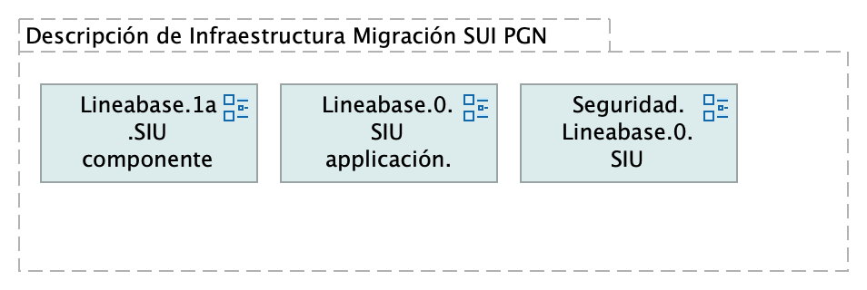{#fig:id-id-d20f6681ac6249bf88591c49616de26a width=}

_Fuente: ${4:Diagnóstico SOA. E-Service (2022).}_

 

### Catálogo de Elementos

| Tema           | Tema | Tema | Tema |
|----------------|------|------|------|
| Descripción de Infraestructura Migración SUI PGN | Grouping |  |  |

Table: Elementos de la vista. {#tbl:tblelement-Doc.2.InfraestructuraSUI-id}

## Doc.3.Migración Funcional SUI

undefined

{#fig:id-id-feee5640a7664190836510f20d08a457 width=}

_Fuente: ${4:Diagnóstico SOA. E-Service (2022).}_

 

### Catálogo de Elementos

| Tema           | Tema | Tema | Tema |
|----------------|------|------|------|
| Análisis de Productos | Grouping |  |  |
| Arquitectura de Seguridad, SUI Migración | Grouping |  |  |
| Organización cambios arquitectura | Grouping |  |  |
| Patrón de Diseño Línea Base SUI PGN | Grouping |  |  |
| Patrón de Diseño Migración SUI PGN | Grouping |  |  |
| Riesgos Técnicos | Grouping |  |  |

Table: Elementos de la vista. {#tbl:tblelement-Doc.3.MigraciónFuncionalSUI-id}

<tr class="hidden id-model undefined id-id-feee5640a7664190836510f20d08a457">
	<td>
	<td>Flow Relationship
	<td>Patrón de Diseño Línea Base SUI PGN
	<td>Riesgos Técnicos
	<td>

<tr class="hidden id-model undefined id-id-feee5640a7664190836510f20d08a457">
	<td>
	<td>Flow Relationship
	<td>Patrón de Diseño Migración SUI PGN
	<td>Organización cambios arquitectura
	<td>

<tr class="hidden id-model undefined id-id-feee5640a7664190836510f20d08a457">
	<td>
	<td>Flow Relationship
	<td>Organización cambios arquitectura
	<td>Arquitectura de Seguridad, SUI Migración
	<td>

<tr class="hidden id-model undefined id-id-feee5640a7664190836510f20d08a457">
	<td>
	<td>Triggering Relationship
	<td>Arquitectura de Seguridad, SUI Migración
	<td>Análisis de Productos
	<td>

<tr class="hidden id-model undefined id-id-feee5640a7664190836510f20d08a457">
	<td>
	<td>Flow Relationship
	<td>Riesgos Técnicos
	<td>Patrón de Diseño Migración SUI PGN
	<td>

## Lineabase.0.SIU applicación

Procuraduría General de la Nación
Proyecto Migración SIU, 2023. Fase II

Línea base sistema único de información. PGN. Componentes originales Fase I.

versión 0.11

Procuraduría General de la Nación, proyecto Migración SIU, 2023, Fase II. Línea base del sistema único de información (SUI en adelante) de la PGN. Presentación de componentes de software  originales implementados en la Fase I del presente proyecto.

## Representación Arquitectónica
Con una arquitectura orientada a servicios SUI recopila:

1. Runtime: Es el servicio que interactúa con el usuario final (GUI) elaborado en Angular 11
1. API Tx: Servicio api rest base node encargado de realizar las transacciones básicas CRUD
1. API Config / Seguridad. Servicio Web API .Net Framework encargado de gestionar características con la autenticación y configuración

&lt;br&gt;

{#fig:id-id-d1c66332737c4f8294474c4bbd0ebd52 width=}

_Fuente: ${4:Diagnóstico SOA. E-Service (2022).}_

 

### Catálogo de Elementos

| Tema           | Tema | Tema | Tema |
|----------------|------|------|------|
| **App** | Application Component |  |  |
| **App PGN Móvil** | Application Component |  |  |
| **App PGN Web** | Application Component |  |  |
| **Application Collaboration** | Application Collaboration |  |  |
| **Application Collaboration** | Application Collaboration |  |  |
| **Application Service (NLB)** | Application Service |  |  |
| **Config** | Application Component |  |  |
| **Interfaz de datos 1** | Application Service |  |  |
| **Interfaz de datos 2** | Application Service |  |  |
| **Punto acceso público** | Application Interface | URL tipo C HTTP |  |

Table: Elementos de la vista. {#tbl:tblelement-Lineabase.0.SIUapplicación-id}

<tr class="hidden id-model undefined id-id-d1c66332737c4f8294474c4bbd0ebd52">
	<td>
	<td>Assignment Relationship
	<td>Application Collaboration
	<td>Interfaz de datos 1
	<td>

<tr class="hidden id-model undefined id-id-d1c66332737c4f8294474c4bbd0ebd52">
	<td>
	<td>Assignment Relationship
	<td>Application Collaboration
	<td>Interfaz de datos 2
	<td>

<tr class="hidden id-model undefined id-id-d1c66332737c4f8294474c4bbd0ebd52">
	<td>
	<td>Aggregation Relationship
	<td>Application Collaboration
	<td>App
	<td>

<tr class="hidden id-model undefined id-id-d1c66332737c4f8294474c4bbd0ebd52">
	<td>
	<td>Aggregation Relationship
	<td>Application Collaboration
	<td>Config
	<td>

<tr class="hidden id-model undefined id-id-d1c66332737c4f8294474c4bbd0ebd52">
	<td>
	<td>Association Relationship
	<td>App
	<td>Config
	<td>

<tr class="hidden id-model undefined id-id-d1c66332737c4f8294474c4bbd0ebd52">
	<td>
	<td>Association Relationship
	<td>App
	<td>Interfaz de datos 1
	<td>

<tr class="hidden id-model undefined id-id-d1c66332737c4f8294474c4bbd0ebd52">
	<td>
	<td>Association Relationship
	<td>Config
	<td>Interfaz de datos 2
	<td>

<tr class="hidden id-model undefined id-id-d1c66332737c4f8294474c4bbd0ebd52">
	<td>
	<td>Association Relationship
	<td>Punto acceso público
	<td>App PGN Móvil
	<td>

<tr class="hidden id-model undefined id-id-d1c66332737c4f8294474c4bbd0ebd52">
	<td>
	<td>Association Relationship
	<td>Punto acceso público
	<td>App PGN Web
	<td>

<tr class="hidden id-model undefined id-id-d1c66332737c4f8294474c4bbd0ebd52">
	<td>
	<td>Association Relationship
	<td>Application Service (NLB)
	<td>App PGN Web
	<td>

<tr class="hidden id-model undefined id-id-d1c66332737c4f8294474c4bbd0ebd52">
	<td>
	<td>Association Relationship
	<td>Application Service (NLB)
	<td>App PGN Móvil
	<td>

<tr class="hidden id-model undefined id-id-d1c66332737c4f8294474c4bbd0ebd52">
	<td>
	<td>Association Relationship
	<td>Application Service (NLB)
	<td>Application Collaboration
	<td>

## Lineabase.0.SIU applicación. física

## Representación Arquitectónica
Con una arquitectura orientada a servicios SUI recopila:

1. Runtime: Es el servicio que interactúa con el usuario final (GUI) elaborado en Angular 11
1. API Tx: Servicio api rest base node encargado de realizar las transacciones básicas CRUD
1. API Config / Seguridad. Servicio Web API .Net Framework encargado de gestionar características con la autenticación y configuración

{#fig:id-id-f3eee2e860604899903c6b48c2f76335 width=}

_Fuente: ${4:Diagnóstico SOA. E-Service (2022).}_

 

### Catálogo de Elementos

| Tema           | Tema | Tema | Tema |
|----------------|------|------|------|
| App | Application Component |  |  |
| App PGN Móvil | Application Component |  |  |
| App PGN Web | Application Component |  |  |
| Application Collaboration | Application Collaboration |  |  |
| Application Collaboration | Application Collaboration |  |  |
| Application Service (NLB) | Application Service |  |  |
| Balanceador | Node |  |  |
| Communication Network (DMZ) | Communication Network |  |  |
| Communication Network (LAN) | Communication Network |  |  |
| Communication Network (internet) | Communication Network |  |  |
| Config | Application Component |  |  |
| Interfaz de datos 1 | Application Service |  |  |
| Interfaz de datos 2 | Application Service |  |  |
| Punto acceso público | Application Interface | URL tipo C HTTP |  |
| Servidor BDD App | Node | Sistema Operativo Windows Server 2019 Standard o Datacenter x64. RAM	8 GB. CPU 64 Bits, 4 Cores > 2 Ghz Discos	SO C: 126 GB, Backup E: 511 GB, SQL Data F: 510 GB, SQL Log   G: 510 GB, TempDB  G: 63.6 GB.  |  |
| Servidor BDD Config | Node | Sistema Operativo Windows Server 2019 Standard o Datacenter x64. RAM	8 GB. CPU 64 Bits, 4 Cores > 2 Ghz Discos	SO C: 80 GB, Backup E: 250 GB, SQL Data F: 250 GB, SQL Log G: 250 GB, TempDB  G: 30 GB.  |  |
| Servidor Lappiz  | Node | Sistema Operativo Windows Server 2019 Standard o Datacenter x64. RAM 8 GB. CPU 64 Bits, 4 Cores > 2 Ghz Discos	SO C: 120 GB,  D: 16 GB.   |  |
| Servidor Web App | Node | Windows Server 2019 Standard o Datacenter x64. Nombre físico. IP LAN. IP Pública. Windows Server 2019 Standard or Datacenter x64. RAM	8  GB. CPU	64 Bits. 4 Cores de 2 Ghz. Discos	SO C: 126 GB. SO D: 16 GB.  |  |
| Servidor Web Canales | Node | Windows Server 2019 Standard o Datacenter x64. Nombre físico. IP LAN. IP Pública. Windows Server 2019 Standard or Datacenter x64. RAM	8  GB. CPU	64 Bits. 4 Cores de 2 Ghz. Discos	SO C: 126 GB. SO D: 16 GB.  |  |
| www pgn com | Technology Interface |  |  |

Table: Elementos de la vista. {#tbl:tblelement-Lineabase.0.SIUapplicación.física-id}

<tr class="hidden id-model undefined id-id-f3eee2e860604899903c6b48c2f76335">
	<td>
	<td>Association Relationship
	<td>Application Collaboration
	<td>Communication Network (LAN)
	<td>

<tr class="hidden id-model undefined id-id-d1c66332737c4f8294474c4bbd0ebd52 id-id-f3eee2e860604899903c6b48c2f76335">
	<td>
	<td>Assignment Relationship
	<td>Application Collaboration
	<td>Interfaz de datos 1
	<td>

<tr class="hidden id-model undefined id-id-d1c66332737c4f8294474c4bbd0ebd52 id-id-f3eee2e860604899903c6b48c2f76335">
	<td>
	<td>Assignment Relationship
	<td>Application Collaboration
	<td>Interfaz de datos 2
	<td>

<tr class="hidden id-model undefined id-id-f3eee2e860604899903c6b48c2f76335">
	<td>
	<td>Association Relationship
	<td>Application Collaboration
	<td>Communication Network (internet)
	<td>

<tr class="hidden id-model undefined id-id-d1c66332737c4f8294474c4bbd0ebd52 id-id-f3eee2e860604899903c6b48c2f76335">
	<td>
	<td>Aggregation Relationship
	<td>Application Collaboration
	<td>App
	<td>

<tr class="hidden id-model undefined id-id-d1c66332737c4f8294474c4bbd0ebd52 id-id-f3eee2e860604899903c6b48c2f76335">
	<td>
	<td>Aggregation Relationship
	<td>Application Collaboration
	<td>Config
	<td>

<tr class="hidden id-model undefined id-id-d1c66332737c4f8294474c4bbd0ebd52 id-id-f3eee2e860604899903c6b48c2f76335">
	<td>
	<td>Association Relationship
	<td>App
	<td>Config
	<td>

<tr class="hidden id-model undefined id-id-d1c66332737c4f8294474c4bbd0ebd52 id-id-f3eee2e860604899903c6b48c2f76335">
	<td>
	<td>Association Relationship
	<td>App
	<td>Interfaz de datos 1
	<td>

<tr class="hidden id-model undefined id-id-d1c66332737c4f8294474c4bbd0ebd52 id-id-f3eee2e860604899903c6b48c2f76335">
	<td>
	<td>Association Relationship
	<td>Config
	<td>Interfaz de datos 2
	<td>

<tr class="hidden id-model undefined id-id-f3eee2e860604899903c6b48c2f76335">
	<td>
	<td>Association Relationship
	<td>Config
	<td>Servidor Lappiz 
	<td>

<tr class="hidden id-model undefined id-id-f3eee2e860604899903c6b48c2f76335">
	<td>
	<td>Aggregation Relationship
	<td>Communication Network (LAN)
	<td>Servidor BDD App
	<td>

<tr class="hidden id-model undefined id-id-f3eee2e860604899903c6b48c2f76335">
	<td>
	<td>Aggregation Relationship
	<td>Communication Network (LAN)
	<td>Servidor BDD Config
	<td>

<tr class="hidden id-model undefined id-id-f3eee2e860604899903c6b48c2f76335">
	<td>
	<td>Aggregation Relationship
	<td>Communication Network (internet)
	<td>Servidor Web Canales
	<td>

<tr class="hidden id-model undefined id-id-f3eee2e860604899903c6b48c2f76335">
	<td>
	<td>Aggregation Relationship
	<td>Communication Network (internet)
	<td>Balanceador
	<td>

<tr class="hidden id-model undefined id-id-f3eee2e860604899903c6b48c2f76335">
	<td>
	<td>Aggregation Relationship
	<td>Communication Network (internet)
	<td>Servidor Lappiz 
	<td>

<tr class="hidden id-model undefined id-id-f3eee2e860604899903c6b48c2f76335">
	<td>
	<td>Aggregation Relationship
	<td>Communication Network (internet)
	<td>Servidor Web App
	<td>

<tr class="hidden id-model undefined id-id-f3eee2e860604899903c6b48c2f76335">
	<td>
	<td>Association Relationship
	<td>Communication Network (internet)
	<td>Communication Network (LAN)
	<td>

<tr class="hidden id-model undefined id-id-f3eee2e860604899903c6b48c2f76335">
	<td>
	<td>Association Relationship
	<td>Servidor Web Canales
	<td>Balanceador
	<td>

<tr class="hidden id-model undefined id-id-f3eee2e860604899903c6b48c2f76335">
	<td>
	<td>Association Relationship
	<td>Servidor Web App
	<td>App
	<td>

<tr class="hidden id-model undefined id-id-d1c66332737c4f8294474c4bbd0ebd52 id-id-f3eee2e860604899903c6b48c2f76335">
	<td>
	<td>Association Relationship
	<td>Punto acceso público
	<td>App PGN Móvil
	<td>

<tr class="hidden id-model undefined id-id-d1c66332737c4f8294474c4bbd0ebd52 id-id-f3eee2e860604899903c6b48c2f76335">
	<td>
	<td>Association Relationship
	<td>Punto acceso público
	<td>App PGN Web
	<td>

<tr class="hidden id-model undefined id-id-f3eee2e860604899903c6b48c2f76335">
	<td>
	<td>Aggregation Relationship
	<td>Communication Network (DMZ)
	<td>www pgn com
	<td>

<tr class="hidden id-model undefined id-id-f3eee2e860604899903c6b48c2f76335">
	<td>
	<td>Association Relationship
	<td>Communication Network (DMZ)
	<td>Communication Network (internet)
	<td>

<tr class="hidden id-model undefined id-id-d1c66332737c4f8294474c4bbd0ebd52 id-id-f3eee2e860604899903c6b48c2f76335">
	<td>
	<td>Association Relationship
	<td>Application Service (NLB)
	<td>App PGN Web
	<td>

<tr class="hidden id-model undefined id-id-d1c66332737c4f8294474c4bbd0ebd52 id-id-f3eee2e860604899903c6b48c2f76335">
	<td>
	<td>Association Relationship
	<td>Application Service (NLB)
	<td>App PGN Móvil
	<td>

<tr class="hidden id-model undefined id-id-d1c66332737c4f8294474c4bbd0ebd52 id-id-f3eee2e860604899903c6b48c2f76335">
	<td>
	<td>Association Relationship
	<td>Application Service (NLB)
	<td>Application Collaboration
	<td>

## Lineabase.1.SIU componente

Distribución de los servicios y paquetes que integran la aplicación de SUI. 

Cuatro paquetes con tecnologías respectivas

1. Angular 11 (Web)
1. API Transaccional (Node Js)
1. API Config (C#)
1. Persistencia (SQL)

Asuntos de la Migración:

* Estrategia CMS central
* Motor de búsqueda
* Estatego como BI
* Conciliación y Doku
* Gestión de sesiones / caducidad

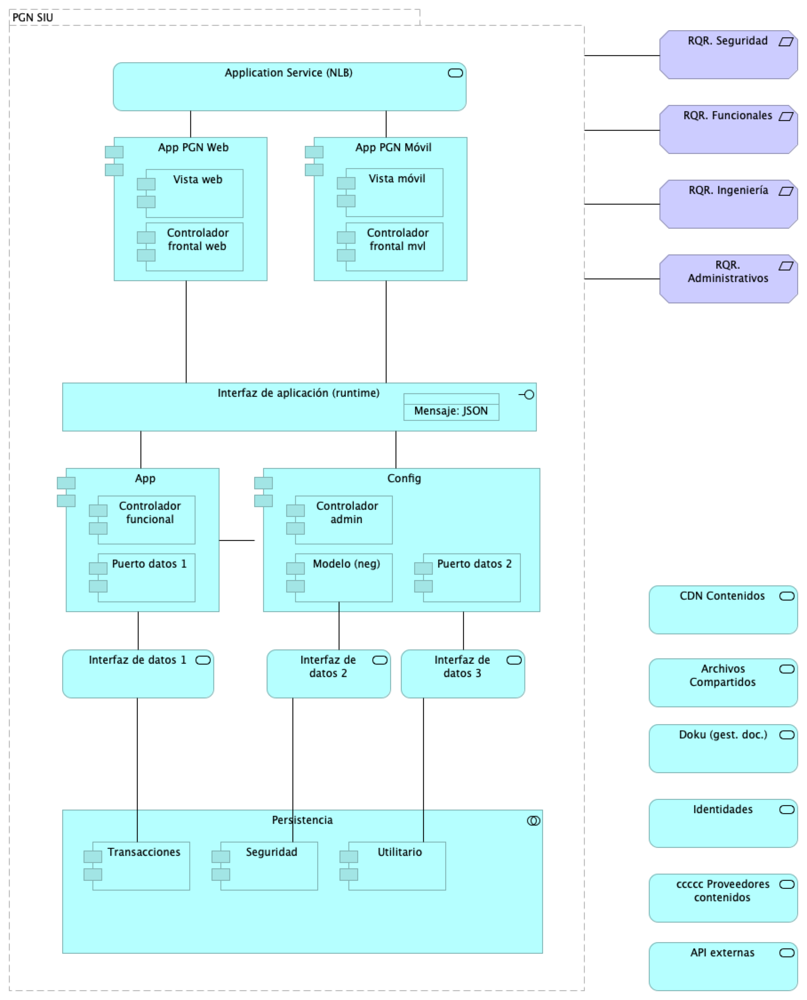{#fig:id-id-4f2604a6793e41ce9eb978dca0209b03 width=}

_Fuente: ${4:Diagnóstico SOA. E-Service (2022).}_

 

### Catálogo de Elementos

| Tema           | Tema | Tema | Tema |
|----------------|------|------|------|
| API externas | Application Service |  |  |
| App | Application Component |  |  |
| App PGN Móvil | Application Component |  |  |
| App PGN Web | Application Component |  |  |
| Application Service (NLB) | Application Service |  |  |
| Archivos Compartidos | Application Service |  |  |
| CDN Contenidos | Application Service |  |  |
| Config | Application Component |  |  |
| Controlador admin | Application Component |  |  |
| Controlador frontal mvl | Application Component |  |  |
| Controlador frontal web | Application Component |  |  |
| Controlador funcional | Application Component |  |  |
| Doku (gest. doc.) | Application Service |  |  |
| Identidades | Application Service |  |  |
| Interfaz de aplicación (runtime) | Application Interface |  |  |
| Interfaz de datos 1 | Application Service |  |  |
| Interfaz de datos 2 | Application Service |  |  |
| Interfaz de datos 3 | Application Service |  |  |
| Mensaje: JSON | Data Object |  |  |
| Modelo (neg) | Application Component |  |  |
| PGN SIU | Grouping | El objetivo principal de la arquitectura del SUI de la migración es la centralización de los conceptos misionales: concentrar los conceptos misionales en componentes aislados; dejar por fuera de estos componentes misionales todo lo distintos a la misionalidad de la PGN.  Los objetivos secundarios de esta arquitectura SUI de la migración son flexibilidad y extensibilidad. Dichos objetivos son independientes. Es decir, estos pueden ser maximizados sin conclifcto entre ellos.   |  |
| Persistencia | Application Collaboration |  |  |
| Puerto datos 1 | Application Component |  |  |
| Puerto datos 2 | Application Component |  |  |
| RQR. Administrativos | Requirement |  |  |
| RQR. Funcionales | Requirement |  |  |
| RQR. Ingeniería | Requirement |  |  |
| RQR. Seguridad | Requirement | Requerimientos de seguridad, SUI, Migración, en aspectos de comunicación, autenticación, autorización y (manejo de) sesiones.  |  |
| Seguridad | Application Component |  |  |
| Transacciones | Application Component |  |  |
| Utilitario | Application Component |  |  |
| Vista móvil | Application Component |  |  |
| Vista web | Application Component |  |  |
| ccccc Proveedores contenidos | Application Service |  |  |

Table: Elementos de la vista. {#tbl:tblelement-Lineabase.1.SIUcomponente-id}

<tr class="hidden id-model undefined id-id-4f2604a6793e41ce9eb978dca0209b03">
	<td>
	<td>Composition Relationship
	<td>PGN SIU
	<td>Persistencia
	<td>

<tr class="hidden id-model undefined id-id-4f2604a6793e41ce9eb978dca0209b03">
	<td>
	<td>Composition Relationship
	<td>PGN SIU
	<td>Interfaz de datos 1
	<td>

<tr class="hidden id-model undefined id-id-4f2604a6793e41ce9eb978dca0209b03">
	<td>
	<td>Composition Relationship
	<td>PGN SIU
	<td>Interfaz de aplicación (runtime)
	<td>

<tr class="hidden id-model undefined id-id-4f2604a6793e41ce9eb978dca0209b03">
	<td>
	<td>Composition Relationship
	<td>PGN SIU
	<td>App PGN Móvil
	<td>

<tr class="hidden id-model undefined id-id-4f2604a6793e41ce9eb978dca0209b03">
	<td>
	<td>Composition Relationship
	<td>PGN SIU
	<td>App PGN Web
	<td>

<tr class="hidden id-model undefined id-id-4f2604a6793e41ce9eb978dca0209b03">
	<td>
	<td>Composition Relationship
	<td>PGN SIU
	<td>Interfaz de datos 2
	<td>

<tr class="hidden id-model undefined id-id-4f2604a6793e41ce9eb978dca0209b03">
	<td>
	<td>Composition Relationship
	<td>PGN SIU
	<td>Config
	<td>

<tr class="hidden id-model undefined id-id-4f2604a6793e41ce9eb978dca0209b03">
	<td>
	<td>Composition Relationship
	<td>PGN SIU
	<td>Interfaz de datos 3
	<td>

<tr class="hidden id-model undefined id-id-4f2604a6793e41ce9eb978dca0209b03">
	<td>
	<td>Composition Relationship
	<td>PGN SIU
	<td>Application Service (NLB)
	<td>

<tr class="hidden id-model undefined id-id-4f2604a6793e41ce9eb978dca0209b03">
	<td>
	<td>Composition Relationship
	<td>PGN SIU
	<td>App
	<td>

<tr class="hidden id-model undefined id-id-4f2604a6793e41ce9eb978dca0209b03">
	<td>
	<td>Association Relationship
	<td>PGN SIU
	<td>RQR. Seguridad
	<td>

<tr class="hidden id-model undefined id-id-4f2604a6793e41ce9eb978dca0209b03">
	<td>
	<td>Association Relationship
	<td>Interfaz de datos 1
	<td>Transacciones
	<td>

<tr class="hidden id-model undefined id-id-4f2604a6793e41ce9eb978dca0209b03">
	<td>
	<td>Aggregation Relationship
	<td>Persistencia
	<td>Transacciones
	<td>

<tr class="hidden id-model undefined id-id-4f2604a6793e41ce9eb978dca0209b03">
	<td>
	<td>Aggregation Relationship
	<td>Persistencia
	<td>Seguridad
	<td>

<tr class="hidden id-model undefined id-id-4f2604a6793e41ce9eb978dca0209b03">
	<td>
	<td>Aggregation Relationship
	<td>Persistencia
	<td>Utilitario
	<td>

<tr class="hidden id-model undefined id-id-4f2604a6793e41ce9eb978dca0209b03">
	<td>
	<td>Access Relationship
	<td>Interfaz de aplicación (runtime)
	<td>Mensaje: JSON
	<td>

<tr class="hidden id-model undefined id-id-4f2604a6793e41ce9eb978dca0209b03">
	<td>
	<td>Composition Relationship
	<td>App PGN Móvil
	<td>Controlador frontal mvl
	<td>

<tr class="hidden id-model undefined id-id-4f2604a6793e41ce9eb978dca0209b03">
	<td>
	<td>Composition Relationship
	<td>App PGN Móvil
	<td>Vista móvil
	<td>

<tr class="hidden id-model undefined id-id-4f2604a6793e41ce9eb978dca0209b03">
	<td>
	<td>Association Relationship
	<td>App PGN Móvil
	<td>Interfaz de aplicación (runtime)
	<td>

<tr class="hidden id-model undefined id-id-4f2604a6793e41ce9eb978dca0209b03">
	<td>
	<td>Composition Relationship
	<td>App PGN Web
	<td>Controlador frontal web
	<td>

<tr class="hidden id-model undefined id-id-4f2604a6793e41ce9eb978dca0209b03">
	<td>
	<td>Composition Relationship
	<td>App PGN Web
	<td>Vista web
	<td>

<tr class="hidden id-model undefined id-id-4f2604a6793e41ce9eb978dca0209b03">
	<td>
	<td>Association Relationship
	<td>App PGN Web
	<td>Interfaz de aplicación (runtime)
	<td>

<tr class="hidden id-model undefined id-id-4f2604a6793e41ce9eb978dca0209b03">
	<td>
	<td>Association Relationship
	<td>Interfaz de datos 2
	<td>Seguridad
	<td>

<tr class="hidden id-model undefined id-id-4f2604a6793e41ce9eb978dca0209b03">
	<td>
	<td>Composition Relationship
	<td>Config
	<td>Modelo (neg)
	<td>

<tr class="hidden id-model undefined id-id-4f2604a6793e41ce9eb978dca0209b03">
	<td>
	<td>Composition Relationship
	<td>Config
	<td>Controlador admin
	<td>

<tr class="hidden id-model undefined id-id-4f2604a6793e41ce9eb978dca0209b03">
	<td>
	<td>Composition Relationship
	<td>Config
	<td>Puerto datos 2
	<td>

<tr class="hidden id-model undefined id-id-4f2604a6793e41ce9eb978dca0209b03">
	<td>
	<td>Association Relationship
	<td>Config
	<td>Interfaz de datos 3
	<td>

<tr class="hidden id-model undefined id-id-4f2604a6793e41ce9eb978dca0209b03">
	<td>
	<td>Association Relationship
	<td>Modelo (neg)
	<td>Interfaz de datos 2
	<td>

<tr class="hidden id-model undefined id-id-4f2604a6793e41ce9eb978dca0209b03">
	<td>
	<td>Association Relationship
	<td>Interfaz de datos 3
	<td>Utilitario
	<td>

<tr class="hidden id-model undefined id-id-d1c66332737c4f8294474c4bbd0ebd52 id-id-f3eee2e860604899903c6b48c2f76335 id-id-4f2604a6793e41ce9eb978dca0209b03">
	<td>
	<td>Association Relationship
	<td>Application Service (NLB)
	<td>App PGN Web
	<td>

<tr class="hidden id-model undefined id-id-d1c66332737c4f8294474c4bbd0ebd52 id-id-f3eee2e860604899903c6b48c2f76335 id-id-4f2604a6793e41ce9eb978dca0209b03">
	<td>
	<td>Association Relationship
	<td>Application Service (NLB)
	<td>App PGN Móvil
	<td>

<tr class="hidden id-model undefined id-id-4f2604a6793e41ce9eb978dca0209b03">
	<td>
	<td>Composition Relationship
	<td>App
	<td>Puerto datos 1
	<td>

<tr class="hidden id-model undefined id-id-4f2604a6793e41ce9eb978dca0209b03">
	<td>
	<td>Composition Relationship
	<td>App
	<td>Controlador funcional
	<td>

<tr class="hidden id-model undefined id-id-d1c66332737c4f8294474c4bbd0ebd52 id-id-f3eee2e860604899903c6b48c2f76335 id-id-4f2604a6793e41ce9eb978dca0209b03">
	<td>
	<td>Association Relationship
	<td>App
	<td>Interfaz de datos 1
	<td>

<tr class="hidden id-model undefined id-id-d1c66332737c4f8294474c4bbd0ebd52 id-id-f3eee2e860604899903c6b48c2f76335 id-id-4f2604a6793e41ce9eb978dca0209b03">
	<td>
	<td>Association Relationship
	<td>App
	<td>Config
	<td>

<tr class="hidden id-model undefined id-id-4f2604a6793e41ce9eb978dca0209b03">
	<td>
	<td>Association Relationship
	<td>RQR. Funcionales
	<td>PGN SIU
	<td>

<tr class="hidden id-model undefined id-id-4f2604a6793e41ce9eb978dca0209b03">
	<td>
	<td>Association Relationship
	<td>RQR. Ingeniería
	<td>PGN SIU
	<td>

<tr class="hidden id-model undefined id-id-4f2604a6793e41ce9eb978dca0209b03">
	<td>
	<td>Association Relationship
	<td>RQR. Administrativos
	<td>PGN SIU
	<td>

## Lineabase.1a.SIU componentes. infraestrcutura

Dependencias de infraestructura entre los servicios que integran el modelo de aplicación de SUI, Migración. 

* Servidor de Canales (App PGN web y móvil)
* Servidor Web App (App SUI)
* Servidor Lappiz (Config SUI)
* Servidor BDD App (Transaccional)
* Servidor BDD Config (Configuración)

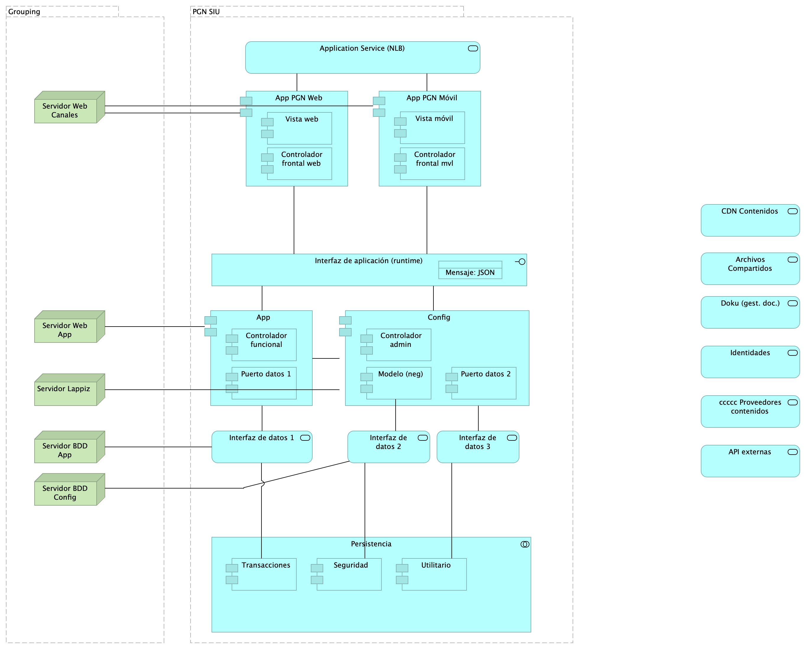{#fig:id-id-ae9dc2de036e435fbcba8497224653a7 width=}

_Fuente: ${4:Diagnóstico SOA. E-Service (2022).}_

 

### Catálogo de Elementos

| Tema           | Tema | Tema | Tema |
|----------------|------|------|------|
| API externas | Application Service |  |  |
| App | Application Component |  |  |
| App PGN Móvil | Application Component |  |  |
| App PGN Web | Application Component |  |  |
| Application Service (NLB) | Application Service |  |  |
| Archivos Compartidos | Application Service |  |  |
| CDN Contenidos | Application Service |  |  |
| Config | Application Component |  |  |
| Controlador admin | Application Component |  |  |
| Controlador frontal mvl | Application Component |  |  |
| Controlador frontal web | Application Component |  |  |
| Controlador funcional | Application Component |  |  |
| Doku (gest. doc.) | Application Service |  |  |
| Identidades | Application Service |  |  |
| Infraestructura SUI | Grouping | Soporte de infraestructura a los componentes del SUI Migración. Servidores y ambientes de cómputo para la ejecución del software base de los componentes misionales del SUI de PGN.  |  |
| Interfaz de aplicación (runtime) | Application Interface |  |  |
| Interfaz de datos 1 | Application Service |  |  |
| Interfaz de datos 2 | Application Service |  |  |
| Interfaz de datos 3 | Application Service |  |  |
| Mensaje: JSON | Data Object |  |  |
| Modelo (neg) | Application Component |  |  |
| PGN SIU | Grouping | El objetivo principal de la arquitectura del SUI de la migración es la centralización de los conceptos misionales: concentrar los conceptos misionales en componentes aislados; dejar por fuera de estos componentes misionales todo lo distintos a la misionalidad de la PGN.  Los objetivos secundarios de esta arquitectura SUI de la migración son flexibilidad y extensibilidad. Dichos objetivos son independientes. Es decir, estos pueden ser maximizados sin conclifcto entre ellos.   |  |
| Persistencia | Application Collaboration |  |  |
| Puerto datos 1 | Application Component |  |  |
| Puerto datos 2 | Application Component |  |  |
| Seguridad | Application Component |  |  |
| Servidor BDD App | Node | Sistema Operativo Windows Server 2019 Standard o Datacenter x64. RAM	8 GB. CPU 64 Bits, 4 Cores > 2 Ghz Discos	SO C: 126 GB, Backup E: 511 GB, SQL Data F: 510 GB, SQL Log   G: 510 GB, TempDB  G: 63.6 GB.  |  |
| Servidor BDD Config | Node | Sistema Operativo Windows Server 2019 Standard o Datacenter x64. RAM	8 GB. CPU 64 Bits, 4 Cores > 2 Ghz Discos	SO C: 80 GB, Backup E: 250 GB, SQL Data F: 250 GB, SQL Log G: 250 GB, TempDB  G: 30 GB.  |  |
| Servidor Lappiz  | Node | Sistema Operativo Windows Server 2019 Standard o Datacenter x64. RAM 8 GB. CPU 64 Bits, 4 Cores > 2 Ghz Discos	SO C: 120 GB,  D: 16 GB.   |  |
| Servidor Web App | Node | Windows Server 2019 Standard o Datacenter x64. Nombre físico. IP LAN. IP Pública. Windows Server 2019 Standard or Datacenter x64. RAM	8  GB. CPU	64 Bits. 4 Cores de 2 Ghz. Discos	SO C: 126 GB. SO D: 16 GB.  |  |
| Servidor Web Canales | Node | Windows Server 2019 Standard o Datacenter x64. Nombre físico. IP LAN. IP Pública. Windows Server 2019 Standard or Datacenter x64. RAM	8  GB. CPU	64 Bits. 4 Cores de 2 Ghz. Discos	SO C: 126 GB. SO D: 16 GB.  |  |
| Transacciones | Application Component |  |  |
| Utilitario | Application Component |  |  |
| Vista móvil | Application Component |  |  |
| Vista web | Application Component |  |  |
| ccccc Proveedores contenidos | Application Service |  |  |

Table: Elementos de la vista. {#tbl:tblelement-Lineabase.1a.SIUcomponentes.infraestrcutura-id}

<tr class="hidden id-model undefined id-id-4f2604a6793e41ce9eb978dca0209b03 id-id-ae9dc2de036e435fbcba8497224653a7">
	<td>
	<td>Composition Relationship
	<td>PGN SIU
	<td>Persistencia
	<td>

<tr class="hidden id-model undefined id-id-4f2604a6793e41ce9eb978dca0209b03 id-id-ae9dc2de036e435fbcba8497224653a7">
	<td>
	<td>Aggregation Relationship
	<td>Persistencia
	<td>Transacciones
	<td>

<tr class="hidden id-model undefined id-id-4f2604a6793e41ce9eb978dca0209b03 id-id-ae9dc2de036e435fbcba8497224653a7">
	<td>
	<td>Aggregation Relationship
	<td>Persistencia
	<td>Seguridad
	<td>

<tr class="hidden id-model undefined id-id-4f2604a6793e41ce9eb978dca0209b03 id-id-ae9dc2de036e435fbcba8497224653a7">
	<td>
	<td>Aggregation Relationship
	<td>Persistencia
	<td>Utilitario
	<td>

<tr class="hidden id-model undefined id-id-4f2604a6793e41ce9eb978dca0209b03 id-id-ae9dc2de036e435fbcba8497224653a7">
	<td>
	<td>Composition Relationship
	<td>App PGN Web
	<td>Controlador frontal web
	<td>

<tr class="hidden id-model undefined id-id-4f2604a6793e41ce9eb978dca0209b03 id-id-ae9dc2de036e435fbcba8497224653a7">
	<td>
	<td>Composition Relationship
	<td>App PGN Web
	<td>Vista web
	<td>

<tr class="hidden id-model undefined id-id-4f2604a6793e41ce9eb978dca0209b03 id-id-ae9dc2de036e435fbcba8497224653a7">
	<td>
	<td>Association Relationship
	<td>App PGN Web
	<td>Interfaz de aplicación (runtime)
	<td>

<tr class="hidden id-model undefined id-id-4f2604a6793e41ce9eb978dca0209b03 id-id-ae9dc2de036e435fbcba8497224653a7">
	<td>
	<td>Composition Relationship
	<td>App PGN Móvil
	<td>Controlador frontal mvl
	<td>

<tr class="hidden id-model undefined id-id-4f2604a6793e41ce9eb978dca0209b03 id-id-ae9dc2de036e435fbcba8497224653a7">
	<td>
	<td>Composition Relationship
	<td>App PGN Móvil
	<td>Vista móvil
	<td>

<tr class="hidden id-model undefined id-id-4f2604a6793e41ce9eb978dca0209b03 id-id-ae9dc2de036e435fbcba8497224653a7">
	<td>
	<td>Association Relationship
	<td>App PGN Móvil
	<td>Interfaz de aplicación (runtime)
	<td>

<tr class="hidden id-model undefined id-id-4f2604a6793e41ce9eb978dca0209b03 id-id-ae9dc2de036e435fbcba8497224653a7">
	<td>
	<td>Access Relationship
	<td>Interfaz de aplicación (runtime)
	<td>Mensaje: JSON
	<td>

<tr class="hidden id-model undefined id-id-4f2604a6793e41ce9eb978dca0209b03 id-id-ae9dc2de036e435fbcba8497224653a7">
	<td>
	<td>Composition Relationship
	<td>App
	<td>Puerto datos 1
	<td>

<tr class="hidden id-model undefined id-id-4f2604a6793e41ce9eb978dca0209b03 id-id-ae9dc2de036e435fbcba8497224653a7">
	<td>
	<td>Composition Relationship
	<td>App
	<td>Controlador funcional
	<td>

<tr class="hidden id-model undefined id-id-d1c66332737c4f8294474c4bbd0ebd52 id-id-f3eee2e860604899903c6b48c2f76335 id-id-4f2604a6793e41ce9eb978dca0209b03 id-id-ae9dc2de036e435fbcba8497224653a7">
	<td>
	<td>Association Relationship
	<td>App
	<td>Interfaz de datos 1
	<td>

<tr class="hidden id-model undefined id-id-d1c66332737c4f8294474c4bbd0ebd52 id-id-f3eee2e860604899903c6b48c2f76335 id-id-4f2604a6793e41ce9eb978dca0209b03 id-id-ae9dc2de036e435fbcba8497224653a7">
	<td>
	<td>Association Relationship
	<td>App
	<td>Config
	<td>

<tr class="hidden id-model undefined id-id-4f2604a6793e41ce9eb978dca0209b03 id-id-ae9dc2de036e435fbcba8497224653a7">
	<td>
	<td>Composition Relationship
	<td>Config
	<td>Modelo (neg)
	<td>

<tr class="hidden id-model undefined id-id-4f2604a6793e41ce9eb978dca0209b03 id-id-ae9dc2de036e435fbcba8497224653a7">
	<td>
	<td>Composition Relationship
	<td>Config
	<td>Controlador admin
	<td>

<tr class="hidden id-model undefined id-id-4f2604a6793e41ce9eb978dca0209b03 id-id-ae9dc2de036e435fbcba8497224653a7">
	<td>
	<td>Composition Relationship
	<td>Config
	<td>Puerto datos 2
	<td>

<tr class="hidden id-model undefined id-id-4f2604a6793e41ce9eb978dca0209b03 id-id-ae9dc2de036e435fbcba8497224653a7">
	<td>
	<td>Association Relationship
	<td>Config
	<td>Interfaz de datos 3
	<td>

<tr class="hidden id-model undefined id-id-f3eee2e860604899903c6b48c2f76335 id-id-ae9dc2de036e435fbcba8497224653a7">
	<td>
	<td>Association Relationship
	<td>Config
	<td>Servidor Lappiz 
	<td>

<tr class="hidden id-model undefined id-id-4f2604a6793e41ce9eb978dca0209b03 id-id-ae9dc2de036e435fbcba8497224653a7">
	<td>
	<td>Association Relationship
	<td>Modelo (neg)
	<td>Interfaz de datos 2
	<td>

<tr class="hidden id-model undefined id-id-4f2604a6793e41ce9eb978dca0209b03 id-id-ae9dc2de036e435fbcba8497224653a7">
	<td>
	<td>Association Relationship
	<td>Interfaz de datos 1
	<td>Transacciones
	<td>

<tr class="hidden id-model undefined id-id-4f2604a6793e41ce9eb978dca0209b03 id-id-ae9dc2de036e435fbcba8497224653a7">
	<td>
	<td>Association Relationship
	<td>Interfaz de datos 3
	<td>Utilitario
	<td>

<tr class="hidden id-model undefined id-id-4f2604a6793e41ce9eb978dca0209b03 id-id-ae9dc2de036e435fbcba8497224653a7">
	<td>
	<td>Association Relationship
	<td>Interfaz de datos 2
	<td>Seguridad
	<td>

<tr class="hidden id-model undefined id-id-d1c66332737c4f8294474c4bbd0ebd52 id-id-f3eee2e860604899903c6b48c2f76335 id-id-4f2604a6793e41ce9eb978dca0209b03 id-id-ae9dc2de036e435fbcba8497224653a7">
	<td>
	<td>Association Relationship
	<td>Application Service (NLB)
	<td>App PGN Web
	<td>

<tr class="hidden id-model undefined id-id-d1c66332737c4f8294474c4bbd0ebd52 id-id-f3eee2e860604899903c6b48c2f76335 id-id-4f2604a6793e41ce9eb978dca0209b03 id-id-ae9dc2de036e435fbcba8497224653a7">
	<td>
	<td>Association Relationship
	<td>Application Service (NLB)
	<td>App PGN Móvil
	<td>

<tr class="hidden id-model undefined id-id-ae9dc2de036e435fbcba8497224653a7">
	<td>
	<td>Association Relationship
	<td>Servidor Web Canales
	<td>App PGN Web
	<td>

<tr class="hidden id-model undefined id-id-ae9dc2de036e435fbcba8497224653a7">
	<td>
	<td>Association Relationship
	<td>Servidor Web Canales
	<td>App PGN Móvil
	<td>

<tr class="hidden id-model undefined id-id-f3eee2e860604899903c6b48c2f76335 id-id-ae9dc2de036e435fbcba8497224653a7">
	<td>
	<td>Association Relationship
	<td>Servidor Web App
	<td>App
	<td>

## Linebase.2.Portal

El portal es el conjunto de los elementos físicos y lógicos necesarios para la implementación de la granja de servidores de SharePoint Server 2019 para el portal de la PROCURADURIA.

* Servidores Web Front End
* Servidores de Aplicaciones
* Servidores de SQL Server

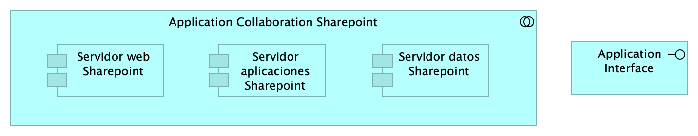{#fig:id-id-64947c69f63c422e9f18c81763910332 width=}

_Fuente: ${4:Diagnóstico SOA. E-Service (2022).}_

 

### Catálogo de Elementos

| Tema           | Tema | Tema | Tema |
|----------------|------|------|------|
| Application Collaboration Sharepoint | Application Collaboration |  |  |
| Application Interface | Application Interface |  |  |
| Servidor aplicaciones Sharepoint | Application Component |  |  |
| Servidor datos Sharepoint | Application Component |  |  |
| Servidor web Sharepoint | Application Component |  |  |

Table: Elementos de la vista. {#tbl:tblelement-Linebase.2.Portal-id}

<tr class="hidden id-model undefined id-id-64947c69f63c422e9f18c81763910332">
	<td>
	<td>Aggregation Relationship
	<td>Application Collaboration Sharepoint
	<td>Servidor web Sharepoint
	<td>

<tr class="hidden id-model undefined id-id-64947c69f63c422e9f18c81763910332">
	<td>
	<td>Aggregation Relationship
	<td>Application Collaboration Sharepoint
	<td>Servidor aplicaciones Sharepoint
	<td>

<tr class="hidden id-model undefined id-id-64947c69f63c422e9f18c81763910332">
	<td>
	<td>Aggregation Relationship
	<td>Application Collaboration Sharepoint
	<td>Servidor datos Sharepoint
	<td>

<tr class="hidden id-model undefined id-id-64947c69f63c422e9f18c81763910332">
	<td>
	<td>Association Relationship
	<td>Application Interface
	<td>Application Collaboration Sharepoint
	<td>

## Migracion.1a.SIU módulos

PGN. Migración Sistemas Misionales. Fase 2.

Submódulos Sistema Único de Información. Requerimientos asociados a submódulos.

versión 0.3

Identificación de submódulos del Sistema Único de Información (SUI) de la PGN. 

Todos los sistemas de información del SUI deben seguir la directiva de separar a los compontentes misionales de los utilitarior: el SUI de PGN estará constituídos por submódulos dispuestos en relación de utilitarios (que sirven) a los componentes misionales del SUI, ubicados en el centro en la diagrama.

Los submódulos del SUI, tal como están presentados, reúnen a las partes por el mismo rol en favor de la coherencia. Por ejemplo, los servicios de aplicación, en la imagen, contiene a todos aquellos utilitarios que prestan alguna utilidad momentánea al SUI migrado. Organizados así, estos submódulos utilitarios pueden ser intercambiados o ampliados sin perjuicio de los componentes misionales dell SUI (centro del diagrama) gracias a las _interfaces de unión_ en favor de la extensibilidad.

Las interfaces de unión indicadas arriba obligan a los submódulos a cumplir las exigencias de los componentes misionales del SUI.

Los submódulos identificados tienen los siguientes roles para el SUI migrado:

1. cc:Presentación
1. cc:Servicios de aplicación
1. cc:Portales y canales
1. cc:Administración y configuración
1. cc:Almacenamiento

### Requerimientos Asociados a los Submódulos
La disposición de los módulos y submódulos presentada, denominada SUI Migración en adelante, facilita la focalización de los requerimientos encontrados en el levantamiento realizado en el actual proyecto. Así, por ejemplo, los requerimientos funcionales se encuentran concentrados en el submódulo de presentación (ver imagen).

{#fig:id-id-f3f3865c516245bfb2d777de5b23efb6 width=}

_Fuente: ${4:Diagnóstico SOA. E-Service (2022).}_

 

### Catálogo de Elementos

| Tema           | Tema | Tema | Tema |
|----------------|------|------|------|
| Cliente PGN | Business Actor |  |  |
| Funcionario PGN | Business Actor |  |  |
| RQR. Administrativos | Requirement |  |  |
| RQR. Funcionales | Requirement |  |  |
| RQR. Ingeniería | Requirement |  |  |
| RQR. Misionales | Requirement |  |  |
| RQR. Seguridad | Requirement | Requerimientos de seguridad, SUI, Migración, en aspectos de comunicación, autenticación, autorización y (manejo de) sesiones.  |  |
| cc:Administración | Application Collaboration |  |  |
| cc:Almacenamiento | Application Collaboration |  |  |
| cc:PGN SUI (misional) | Application Collaboration |  |  |
| cc:Portales y canales | Application Collaboration | Submódulo de portales internos de la PGN a donde llega el SUI. Interfaz web que usa al SUI para llegar a direcciones y subdirecciones de la PGN. La plataforma principal de portales en este contexto es Sharepoint de Microsoft.  |  |
| cc:Presentación | Application Collaboration | Submódulo de presentación del SUI. interfaz gráfica, interfaz web visible a los usuarios clientes y funcionarios de la PGN.  |  |
| cc:Servicios de aplicación | Application Collaboration | Submódulo de servicios utilitarios que sirven al SUI. Servicios variados que cumplen roles facilitadores de las actividades misionales del SUI. Ejemplos de estos servicios son los de gestión documental, implementado por Doku en el contexto de PGN.   |  |
| interfaz | Application Interface |  |  |
| interfaz | Application Interface |  |  |
| interfaz | Application Interface |  |  |
| interfaz | Application Interface |  |  |
| interfaz | Application Interface |  |  |

Table: Elementos de la vista. {#tbl:tblelement-Migracion.1a.SIUmódulos-id}

<tr class="hidden id-model undefined id-id-f3f3865c516245bfb2d777de5b23efb6">
	<td>
	<td>Association Relationship
	<td>RQR. Seguridad
	<td>cc:PGN SUI (misional)
	<td>

<tr class="hidden id-model undefined id-id-f3f3865c516245bfb2d777de5b23efb6">
	<td>
	<td>Association Relationship
	<td>RQR. Funcionales
	<td>cc:Presentación
	<td>

<tr class="hidden id-model undefined id-id-f3f3865c516245bfb2d777de5b23efb6">
	<td>
	<td>Association Relationship
	<td>RQR. Ingeniería
	<td>cc:PGN SUI (misional)
	<td>

<tr class="hidden id-model undefined id-id-f3f3865c516245bfb2d777de5b23efb6">
	<td>
	<td>Association Relationship
	<td>RQR. Administrativos
	<td>cc:Administración
	<td>

<tr class="hidden id-model undefined id-id-f3f3865c516245bfb2d777de5b23efb6">
	<td>
	<td>Association Relationship
	<td>RQR. Misionales
	<td>cc:PGN SUI (misional)
	<td>

<tr class="hidden id-model undefined id-id-f3f3865c516245bfb2d777de5b23efb6">
	<td>
	<td>Serving Relationship
	<td>cc:Servicios de aplicación
	<td>cc:PGN SUI (misional)
	<td>

<tr class="hidden id-model undefined id-id-f3f3865c516245bfb2d777de5b23efb6">
	<td>
	<td>Serving Relationship
	<td>cc:Portales y canales
	<td>cc:PGN SUI (misional)
	<td>

<tr class="hidden id-model undefined id-id-f3f3865c516245bfb2d777de5b23efb6">
	<td>
	<td>Serving Relationship
	<td>cc:Administración
	<td>cc:PGN SUI (misional)
	<td>

<tr class="hidden id-model undefined id-id-f3f3865c516245bfb2d777de5b23efb6">
	<td>
	<td>Association Relationship
	<td>RQR. Seguridad
	<td>cc:Administración
	<td>

<tr class="hidden id-model undefined id-id-f3f3865c516245bfb2d777de5b23efb6">
	<td>
	<td>Association Relationship
	<td>Cliente PGN
	<td>cc:Portales y canales
	<td>

<tr class="hidden id-model undefined id-id-f3f3865c516245bfb2d777de5b23efb6">
	<td>sirve
	<td>Serving Relationship
	<td>cc:Presentación
	<td>cc:PGN SUI (misional)
	<td>

<tr class="hidden id-model undefined id-id-f3f3865c516245bfb2d777de5b23efb6">
	<td>sirve
	<td>Serving Relationship
	<td>cc:Almacenamiento
	<td>cc:PGN SUI (misional)
	<td>

<tr class="hidden id-model undefined id-id-f3f3865c516245bfb2d777de5b23efb6">
	<td>usa
	<td>Association Relationship
	<td>Funcionario PGN
	<td>cc:Presentación
	<td>

## Migracion.1b.SIU módulos componentes

PGN. Migración Sistemas Misionales. Fase 2.

Componentes internos de los submódulos Sistema Único de Información. 

versión 0.1

Presentación de los componentes internos de los submódulos del sistema único de información migración PGN. Organización intena de los servicios y paquetes que integran cada submódulo del SUI. Todos los sistemas de información del SUI siguen esta directiva: estarán constituídos por submódulos dispuestos en relación de utilitarios (que sirven) a los componentes misionales del SUI, ubicados en el centro en la diagrama. 

La organización de componentes de migración SUI facilita focalizar la selección de tecnologeias. Los componentes internos y tecnologías elegidas son las siguientes

1. Presentación: Angular 11 (Web)
1. PGN SUI: API Transaccional (Node Js)
1. Administración: API Config (C#)
1. Persistencia: (SQL)

Los submódulos del SUI, tal como están presentados, reúnen a las partes que tienen el mismo rol en favor de la coherencia. Así mismo, estos pueden ser intercambiados o ampliados sin perjuicio del SUI gracias a las interfaces de unión (en favor de la extensibilidad).

Las interfaces de unión indicadas arriba obligan a los submódulos a cumplir las exigencias de los componentes misionales del SUI.

{#fig:id-id-6dcada718c1446f69884dc7418828c51 width=}

_Fuente: ${4:Diagnóstico SOA. E-Service (2022).}_

 

### Catálogo de Elementos

| Tema           | Tema | Tema | Tema |
|----------------|------|------|------|
| API externas | Application Service |  |  |
| Administración | Grouping |  |  |
| Almacenamiento | Grouping |  |  |
| App | Application Component |  |  |
| App PGN Móvil | Application Component |  |  |
| App PGN Web | Application Component |  |  |
| Application Interface | Application Interface |  |  |
| Application Service (NLB) | Application Service |  |  |
| Archivos Compartidos | Application Service |  |  |
| CDN Contenidos | Application Service |  |  |
| Config | Application Component |  |  |
| Controlador admin | Application Component |  |  |
| Controlador frontal mvl | Application Component |  |  |
| Controlador frontal web | Application Component |  |  |
| Controlador funcional | Application Component |  |  |
| Doku (gest. doc.) | Application Service |  |  |
| Identidades | Application Service |  |  |
| Interfaz de aplicación (runtime) | Application Interface |  |  |
| Interfaz de datos 1 | Application Service |  |  |
| Interfaz de datos 2 | Application Service |  |  |
| Interfaz de datos 3 | Application Service |  |  |
| Mensaje: JSON | Data Object |  |  |
| Modelo (neg) | Application Component |  |  |
| Office | Application Service |  |  |
| PGN SIU | Grouping | El objetivo principal de la arquitectura del SUI de la migración es la centralización de los conceptos misionales: concentrar los conceptos misionales en componentes aislados; dejar por fuera de estos componentes misionales todo lo distintos a la misionalidad de la PGN.  Los objetivos secundarios de esta arquitectura SUI de la migración son flexibilidad y extensibilidad. Dichos objetivos son independientes. Es decir, estos pueden ser maximizados sin conclifcto entre ellos.   |  |
| Portales | Grouping | Submódulo de portales internos de la PGN a donde llega el SUI. Interfaz web que usa al SUI para llegar a direcciones y subdirecciones de la PGN. La plataforma principal de portales en este contexto es Sharepoint de Microsoft.  |  |
| Presentación | Grouping | Submódulo de presentación del SUI. interfaz gráfica, interfaz web visible a los usuarios clientes y funcionarios de la PGN.  |  |
| Puerto datos 1 | Application Component |  |  |
| Puerto datos 2 | Application Component |  |  |
| RQR. Administrativos | Requirement |  |  |
| RQR. Funcionales | Requirement |  |  |
| RQR. Ingeniería | Requirement |  |  |
| RQR. Misionales | Requirement |  |  |
| RQR. Seguridad | Requirement | Requerimientos de seguridad, SUI, Migración, en aspectos de comunicación, autenticación, autorización y (manejo de) sesiones.  |  |
| Seguridad | Application Component |  |  |
| Servicios de aplicación | Grouping | Submódulo de servicios utilitarios que sirven al SUI. Servicios variados que cumplen roles facilitadores de las actividades misionales del SUI. Ejemplos de estos servicios son los de gestión documental, implementado por Doku en el contexto de PGN.  |  |
| Servidor aplicaciones Sharepoint | Application Component |  |  |
| Servidor datos Sharepoint | Application Component |  |  |
| Servidor web Sharepoint | Application Component |  |  |
| Transacciones | Application Component |  |  |
| Utilitario | Application Component |  |  |
| Vista móvil | Application Component |  |  |
| Vista web | Application Component |  |  |
| ccccc Proveedores contenidos | Application Service |  |  |

Table: Elementos de la vista. {#tbl:tblelement-Migracion.1b.SIUmóduloscomponentes-id}

<tr class="hidden id-model undefined id-id-4f2604a6793e41ce9eb978dca0209b03 id-id-6dcada718c1446f69884dc7418828c51">
	<td>
	<td>Composition Relationship
	<td>PGN SIU
	<td>Interfaz de datos 1
	<td>

<tr class="hidden id-model undefined id-id-4f2604a6793e41ce9eb978dca0209b03 id-id-6dcada718c1446f69884dc7418828c51">
	<td>
	<td>Composition Relationship
	<td>PGN SIU
	<td>Interfaz de aplicación (runtime)
	<td>

<tr class="hidden id-model undefined id-id-4f2604a6793e41ce9eb978dca0209b03 id-id-6dcada718c1446f69884dc7418828c51">
	<td>
	<td>Composition Relationship
	<td>PGN SIU
	<td>App
	<td>

<tr class="hidden id-model undefined id-id-4f2604a6793e41ce9eb978dca0209b03 id-id-6dcada718c1446f69884dc7418828c51">
	<td>
	<td>Association Relationship
	<td>PGN SIU
	<td>RQR. Seguridad
	<td>

<tr class="hidden id-model undefined id-id-4f2604a6793e41ce9eb978dca0209b03 id-id-ae9dc2de036e435fbcba8497224653a7 id-id-6dcada718c1446f69884dc7418828c51">
	<td>
	<td>Access Relationship
	<td>Interfaz de aplicación (runtime)
	<td>Mensaje: JSON
	<td>

<tr class="hidden id-model undefined id-id-4f2604a6793e41ce9eb978dca0209b03 id-id-ae9dc2de036e435fbcba8497224653a7 id-id-6dcada718c1446f69884dc7418828c51">
	<td>
	<td>Composition Relationship
	<td>App
	<td>Puerto datos 1
	<td>

<tr class="hidden id-model undefined id-id-4f2604a6793e41ce9eb978dca0209b03 id-id-ae9dc2de036e435fbcba8497224653a7 id-id-6dcada718c1446f69884dc7418828c51">
	<td>
	<td>Composition Relationship
	<td>App
	<td>Controlador funcional
	<td>

<tr class="hidden id-model undefined id-id-d1c66332737c4f8294474c4bbd0ebd52 id-id-f3eee2e860604899903c6b48c2f76335 id-id-4f2604a6793e41ce9eb978dca0209b03 id-id-ae9dc2de036e435fbcba8497224653a7 id-id-6dcada718c1446f69884dc7418828c51">
	<td>
	<td>Association Relationship
	<td>App
	<td>Interfaz de datos 1
	<td>

<tr class="hidden id-model undefined id-id-6dcada718c1446f69884dc7418828c51">
	<td>
	<td>Association Relationship
	<td>RQR. Funcionales
	<td>Presentación
	<td>

<tr class="hidden id-model undefined id-id-4f2604a6793e41ce9eb978dca0209b03 id-id-6dcada718c1446f69884dc7418828c51">
	<td>
	<td>Association Relationship
	<td>RQR. Ingeniería
	<td>PGN SIU
	<td>

<tr class="hidden id-model undefined id-id-6dcada718c1446f69884dc7418828c51">
	<td>
	<td>Composition Relationship
	<td>Presentación
	<td>App PGN Web
	<td>

<tr class="hidden id-model undefined id-id-6dcada718c1446f69884dc7418828c51">
	<td>
	<td>Composition Relationship
	<td>Presentación
	<td>Application Service (NLB)
	<td>

<tr class="hidden id-model undefined id-id-6dcada718c1446f69884dc7418828c51">
	<td>
	<td>Composition Relationship
	<td>Presentación
	<td>App PGN Móvil
	<td>

<tr class="hidden id-model undefined id-id-4f2604a6793e41ce9eb978dca0209b03 id-id-ae9dc2de036e435fbcba8497224653a7 id-id-6dcada718c1446f69884dc7418828c51">
	<td>
	<td>Composition Relationship
	<td>App PGN Web
	<td>Vista web
	<td>

<tr class="hidden id-model undefined id-id-4f2604a6793e41ce9eb978dca0209b03 id-id-ae9dc2de036e435fbcba8497224653a7 id-id-6dcada718c1446f69884dc7418828c51">
	<td>
	<td>Composition Relationship
	<td>App PGN Web
	<td>Controlador frontal web
	<td>

<tr class="hidden id-model undefined id-id-d1c66332737c4f8294474c4bbd0ebd52 id-id-f3eee2e860604899903c6b48c2f76335 id-id-4f2604a6793e41ce9eb978dca0209b03 id-id-ae9dc2de036e435fbcba8497224653a7 id-id-6dcada718c1446f69884dc7418828c51">
	<td>
	<td>Association Relationship
	<td>Application Service (NLB)
	<td>App PGN Web
	<td>

<tr class="hidden id-model undefined id-id-d1c66332737c4f8294474c4bbd0ebd52 id-id-f3eee2e860604899903c6b48c2f76335 id-id-4f2604a6793e41ce9eb978dca0209b03 id-id-ae9dc2de036e435fbcba8497224653a7 id-id-6dcada718c1446f69884dc7418828c51">
	<td>
	<td>Association Relationship
	<td>Application Service (NLB)
	<td>App PGN Móvil
	<td>

<tr class="hidden id-model undefined id-id-4f2604a6793e41ce9eb978dca0209b03 id-id-ae9dc2de036e435fbcba8497224653a7 id-id-6dcada718c1446f69884dc7418828c51">
	<td>
	<td>Composition Relationship
	<td>App PGN Móvil
	<td>Vista móvil
	<td>

<tr class="hidden id-model undefined id-id-4f2604a6793e41ce9eb978dca0209b03 id-id-ae9dc2de036e435fbcba8497224653a7 id-id-6dcada718c1446f69884dc7418828c51">
	<td>
	<td>Composition Relationship
	<td>App PGN Móvil
	<td>Controlador frontal mvl
	<td>

<tr class="hidden id-model undefined id-id-6dcada718c1446f69884dc7418828c51">
	<td>
	<td>Composition Relationship
	<td>Almacenamiento
	<td>Transacciones
	<td>

<tr class="hidden id-model undefined id-id-6dcada718c1446f69884dc7418828c51">
	<td>
	<td>Composition Relationship
	<td>Almacenamiento
	<td>Seguridad
	<td>

<tr class="hidden id-model undefined id-id-6dcada718c1446f69884dc7418828c51">
	<td>
	<td>Composition Relationship
	<td>Almacenamiento
	<td>Utilitario
	<td>

<tr class="hidden id-model undefined id-id-6dcada718c1446f69884dc7418828c51">
	<td>
	<td>Association Relationship
	<td>RQR. Misionales
	<td>PGN SIU
	<td>

<tr class="hidden id-model undefined id-id-6dcada718c1446f69884dc7418828c51">
	<td>
	<td>Composition Relationship
	<td>Administración
	<td>Config
	<td>

<tr class="hidden id-model undefined id-id-6dcada718c1446f69884dc7418828c51">
	<td>
	<td>Composition Relationship
	<td>Administración
	<td>Interfaz de datos 2
	<td>

<tr class="hidden id-model undefined id-id-6dcada718c1446f69884dc7418828c51">
	<td>
	<td>Composition Relationship
	<td>Administración
	<td>Interfaz de datos 3
	<td>

<tr class="hidden id-model undefined id-id-6dcada718c1446f69884dc7418828c51">
	<td>
	<td>Association Relationship
	<td>Administración
	<td>RQR. Administrativos
	<td>

<tr class="hidden id-model undefined id-id-6dcada718c1446f69884dc7418828c51">
	<td>
	<td>Serving Relationship
	<td>Administración
	<td>PGN SIU
	<td>

<tr class="hidden id-model undefined id-id-4f2604a6793e41ce9eb978dca0209b03 id-id-ae9dc2de036e435fbcba8497224653a7 id-id-6dcada718c1446f69884dc7418828c51">
	<td>
	<td>Composition Relationship
	<td>Config
	<td>Modelo (neg)
	<td>

<tr class="hidden id-model undefined id-id-4f2604a6793e41ce9eb978dca0209b03 id-id-ae9dc2de036e435fbcba8497224653a7 id-id-6dcada718c1446f69884dc7418828c51">
	<td>
	<td>Composition Relationship
	<td>Config
	<td>Controlador admin
	<td>

<tr class="hidden id-model undefined id-id-4f2604a6793e41ce9eb978dca0209b03 id-id-ae9dc2de036e435fbcba8497224653a7 id-id-6dcada718c1446f69884dc7418828c51">
	<td>
	<td>Composition Relationship
	<td>Config
	<td>Puerto datos 2
	<td>

<tr class="hidden id-model undefined id-id-4f2604a6793e41ce9eb978dca0209b03 id-id-ae9dc2de036e435fbcba8497224653a7 id-id-6dcada718c1446f69884dc7418828c51">
	<td>
	<td>Association Relationship
	<td>Config
	<td>Interfaz de datos 3
	<td>

<tr class="hidden id-model undefined id-id-4f2604a6793e41ce9eb978dca0209b03 id-id-ae9dc2de036e435fbcba8497224653a7 id-id-6dcada718c1446f69884dc7418828c51">
	<td>
	<td>Association Relationship
	<td>Modelo (neg)
	<td>Interfaz de datos 2
	<td>

<tr class="hidden id-model undefined id-id-6dcada718c1446f69884dc7418828c51">
	<td>
	<td>Composition Relationship
	<td>Servicios de aplicación
	<td>Archivos Compartidos
	<td>

<tr class="hidden id-model undefined id-id-6dcada718c1446f69884dc7418828c51">
	<td>
	<td>Composition Relationship
	<td>Servicios de aplicación
	<td>API externas
	<td>

<tr class="hidden id-model undefined id-id-6dcada718c1446f69884dc7418828c51">
	<td>
	<td>Composition Relationship
	<td>Servicios de aplicación
	<td>ccccc Proveedores contenidos
	<td>

<tr class="hidden id-model undefined id-id-6dcada718c1446f69884dc7418828c51">
	<td>
	<td>Composition Relationship
	<td>Servicios de aplicación
	<td>Identidades
	<td>

<tr class="hidden id-model undefined id-id-6dcada718c1446f69884dc7418828c51">
	<td>
	<td>Composition Relationship
	<td>Servicios de aplicación
	<td>Doku (gest. doc.)
	<td>

<tr class="hidden id-model undefined id-id-6dcada718c1446f69884dc7418828c51">
	<td>
	<td>Composition Relationship
	<td>Servicios de aplicación
	<td>CDN Contenidos
	<td>

<tr class="hidden id-model undefined id-id-6dcada718c1446f69884dc7418828c51">
	<td>
	<td>Composition Relationship
	<td>Servicios de aplicación
	<td>Office
	<td>

<tr class="hidden id-model undefined id-id-6dcada718c1446f69884dc7418828c51">
	<td>
	<td>Serving Relationship
	<td>Servicios de aplicación
	<td>PGN SIU
	<td>

<tr class="hidden id-model undefined id-id-6dcada718c1446f69884dc7418828c51">
	<td>
	<td>Composition Relationship
	<td>Portales
	<td>Servidor web Sharepoint
	<td>

<tr class="hidden id-model undefined id-id-6dcada718c1446f69884dc7418828c51">
	<td>
	<td>Composition Relationship
	<td>Portales
	<td>Servidor aplicaciones Sharepoint
	<td>

<tr class="hidden id-model undefined id-id-6dcada718c1446f69884dc7418828c51">
	<td>
	<td>Composition Relationship
	<td>Portales
	<td>Servidor datos Sharepoint
	<td>

<tr class="hidden id-model undefined id-id-6dcada718c1446f69884dc7418828c51">
	<td>
	<td>Composition Relationship
	<td>Portales
	<td>Application Interface
	<td>

<tr class="hidden id-model undefined id-id-6dcada718c1446f69884dc7418828c51">
	<td>
	<td>Serving Relationship
	<td>Portales
	<td>PGN SIU
	<td>

<tr class="hidden id-model undefined id-id-6dcada718c1446f69884dc7418828c51">
	<td>
	<td>Association Relationship
	<td>RQR. Seguridad
	<td>Administración
	<td>

<tr class="hidden id-model undefined id-id-6dcada718c1446f69884dc7418828c51">
	<td>sirve
	<td>Serving Relationship
	<td>Presentación
	<td>PGN SIU
	<td>

<tr class="hidden id-model undefined id-id-6dcada718c1446f69884dc7418828c51">
	<td>sirve
	<td>Serving Relationship
	<td>Almacenamiento
	<td>PGN SIU
	<td>

## Migracion.1c.SIU modulos colaboración

PGN. Migración Sistemas Misionales. Fase 2.

Patrón de comunicación y colaboración módulo misional (PGN SUI) y submódulos.

versión 0.3

Patrón de Distribución y Colaboración estándar para el SUI.

La colaboración y comunicación de los componentes internos del SUI (grupo PFN SUI, en el diagrama) está mediada por interfaces. Estas son provistas por el grupo de componentes misionales, PGN SUI, hacia los submódulos externos. La intención es mantener reducido y controlado el número de interfaces.

La colaboración entre el SUI Migración con sistemas externos puede darse mediante buses de datos empresarial, sin perjuicio del patrón de comunicación estadar descrito en el diagrama.

{#fig:id-id-e5d2b80501c743edb14cecf221be73a9 width=}

_Fuente: ${4:Diagnóstico SOA. E-Service (2022).}_

 

### Catálogo de Elementos

| Tema           | Tema | Tema | Tema |
|----------------|------|------|------|
| cc:Almacenamiento | Application Collaboration |  |  |
| cc:PGN SUI (misional) | Application Collaboration |  |  |
| cc:Portales y canales | Application Collaboration | Submódulo de portales internos de la PGN a donde llega el SUI. Interfaz web que usa al SUI para llegar a direcciones y subdirecciones de la PGN. La plataforma principal de portales en este contexto es Sharepoint de Microsoft.  |  |
| interfaz | Application Interface |  |  |
| interfaz | Application Interface |  |  |

Table: Elementos de la vista. {#tbl:tblelement-Migracion.1c.SIUmoduloscolaboración-id}

<tr class="hidden id-model undefined id-id-e5d2b80501c743edb14cecf221be73a9">
	<td>API
	<td>Flow Relationship
	<td>cc:Portales y canales
	<td>interfaz
	<td>

<tr class="hidden id-model undefined id-id-e5d2b80501c743edb14cecf221be73a9">
	<td>API
	<td>Flow Relationship
	<td>cc:Almacenamiento
	<td>interfaz
	<td>

<tr class="hidden id-model undefined id-id-e5d2b80501c743edb14cecf221be73a9">
	<td>puerto
	<td>Flow Relationship
	<td>interfaz
	<td>cc:Almacenamiento
	<td>

<tr class="hidden id-model undefined id-id-e5d2b80501c743edb14cecf221be73a9">
	<td>puerto
	<td>Flow Relationship
	<td>interfaz
	<td>cc:Portales y canales
	<td>

<tr class="hidden id-model undefined id-id-e5d2b80501c743edb14cecf221be73a9">
	<td>puerto
	<td>Flow Relationship
	<td>cc:PGN SUI (misional)
	<td>interfaz
	<td>

<tr class="hidden id-model undefined id-id-e5d2b80501c743edb14cecf221be73a9">
	<td>puerto
	<td>Flow Relationship
	<td>cc:PGN SUI (misional)
	<td>interfaz
	<td>

<tr class="hidden id-model undefined id-id-e5d2b80501c743edb14cecf221be73a9">
	<td>puerto
	<td>Flow Relationship
	<td>interfaz
	<td>cc:PGN SUI (misional)
	<td>

<tr class="hidden id-model undefined id-id-e5d2b80501c743edb14cecf221be73a9">
	<td>puerto
	<td>Flow Relationship
	<td>interfaz
	<td>cc:PGN SUI (misional)
	<td>

## Migracion.2. datos

PGN. Migración Sistemas Misionales. Fase 2.

Modelo de acceso y procesamiento de datos de negocio. Módulos Sistema Único de Información. 

versión 0.1

Modelo de acceso y procesamiento a datos de negocio del SUI. Presentamos la organización de los ítems de datos de negocio necesarios para que los módulos del SUI puedan recolectar, procesar, integrar y almacenarlos de forma organizada y escalable.

Mediante esta organización, los datos de negocio son transportados desde sus respectivas fuentes mediante interfaces (por principio de extensión y mantenibilidad). Los datos externos, entendidos como los de otros proveedores, son obtenidos mediante un intermediario: el bus de datos del SUI.

Consideramos tres tipos datos: datos transaccionales, históricos y externos, y presentamos una manera distinta de tratarlos y transportarlos.

{#fig:id-id-d83ebcb4235c40c4ac68b7f373d4161f width=}

_Fuente: ${4:Diagnóstico SOA. E-Service (2022).}_

 

### Catálogo de Elementos

| Tema           | Tema | Tema | Tema |
|----------------|------|------|------|
| APP1.Relatoría | Application Component | Módulo del SUI. Relatoría pública. Publicación de información de referencia para funcionarios y personas naturales, cientes de la PGN.   |  |
| APP2.SIRI | Application Component |  |  |
| APP3.Control interno | Application Component |  |  |
| APP4.Hominis | Application Component | Módulo del SUI. Gestión de capital humano, funcionarios y cargos de representación y libre remoción de la PGN.  |  |
| APP5.SIM | Application Component |  |  |
| APP6.Estratego | Application Component |  |  |
| Bus de datos | Application Service | El patrón de bus de datos tiene el rol de unir y referir a los datos externos al SUI de tal manera que hace transparente la localización y el formato de este tipo de datos.  |  |
| Datos externos | Data Object |  |  |
| Datos históricos | Data Object |  |  |
| Datos transaccionales | Data Object |  |  |
| Interfaz de Acceso Proveedores | Application Interface | Interfaz de acceso a los tipos de datos externos al SUI.  |  |
| Interfaz de Almacenaniento | Application Interface | Interfaz de acceso a los repositorio, base de datos relacionales y no jerárquicas. Tipos de datos transaccionales, internos, del SUI.  |  |
| Procesamiento batch PGN | Application Process | Los procesos de lotes, que requieren volumenes de datos altos, deben hacer parte de la arquitectura de datos del SUI.  |  |
| cc:PGN SUI (misional) | Application Collaboration |  |  |

Table: Elementos de la vista. {#tbl:tblelement-Migracion.2.datos-id}

<tr class="hidden id-model undefined id-id-d83ebcb4235c40c4ac68b7f373d4161f">
	<td>
	<td>Aggregation Relationship
	<td>cc:PGN SUI (misional)
	<td>APP6.Estratego
	<td>

<tr class="hidden id-model undefined id-id-d83ebcb4235c40c4ac68b7f373d4161f">
	<td>
	<td>Aggregation Relationship
	<td>cc:PGN SUI (misional)
	<td>APP3.Control interno
	<td>

<tr class="hidden id-model undefined id-id-d83ebcb4235c40c4ac68b7f373d4161f">
	<td>
	<td>Aggregation Relationship
	<td>cc:PGN SUI (misional)
	<td>APP4.Hominis
	<td>

<tr class="hidden id-model undefined id-id-d83ebcb4235c40c4ac68b7f373d4161f">
	<td>
	<td>Aggregation Relationship
	<td>cc:PGN SUI (misional)
	<td>APP1.Relatoría
	<td>

<tr class="hidden id-model undefined id-id-d83ebcb4235c40c4ac68b7f373d4161f">
	<td>
	<td>Aggregation Relationship
	<td>cc:PGN SUI (misional)
	<td>APP5.SIM
	<td>

<tr class="hidden id-model undefined id-id-d83ebcb4235c40c4ac68b7f373d4161f">
	<td>
	<td>Aggregation Relationship
	<td>cc:PGN SUI (misional)
	<td>APP2.SIRI
	<td>

<tr class="hidden id-model undefined id-id-d83ebcb4235c40c4ac68b7f373d4161f">
	<td>
	<td>Association Relationship
	<td>cc:PGN SUI (misional)
	<td>Interfaz de Acceso Proveedores
	<td>

<tr class="hidden id-model undefined id-id-d83ebcb4235c40c4ac68b7f373d4161f">
	<td>
	<td>Association Relationship
	<td>cc:PGN SUI (misional)
	<td>Interfaz de Almacenaniento
	<td>

<tr class="hidden id-model undefined id-id-d83ebcb4235c40c4ac68b7f373d4161f">
	<td>
	<td>Association Relationship
	<td>cc:PGN SUI (misional)
	<td>Procesamiento batch PGN
	<td>

<tr class="hidden id-model undefined id-id-d83ebcb4235c40c4ac68b7f373d4161f">
	<td>
	<td>Association Relationship
	<td>Interfaz de Acceso Proveedores
	<td>Bus de datos
	<td>

<tr class="hidden id-model undefined id-id-d83ebcb4235c40c4ac68b7f373d4161f">
	<td>
	<td>Access Relationship
	<td>Interfaz de Almacenaniento
	<td>Datos transaccionales
	<td>

<tr class="hidden id-model undefined id-id-d83ebcb4235c40c4ac68b7f373d4161f">
	<td>
	<td>Access Relationship
	<td>Procesamiento batch PGN
	<td>Datos transaccionales
	<td>

<tr class="hidden id-model undefined id-id-d83ebcb4235c40c4ac68b7f373d4161f">
	<td>
	<td>Access Relationship
	<td>Bus de datos
	<td>Datos históricos
	<td>

<tr class="hidden id-model undefined id-id-d83ebcb4235c40c4ac68b7f373d4161f">
	<td>
	<td>Access Relationship
	<td>Bus de datos
	<td>Datos externos
	<td>

## Migracion.2a. datos Hominis

PGN. Migración Sistemas Misionales. Fase 2.

Entidades de datos de negocio. Submódulos Sistema Único de Información. Hominis

versión 0.1

Identificación de entidades de datos de negocio relacionadas al módulo de gestión de capital del SUI, Hominis.

Estas entidades de datos de negocio son los que llamamos los tipos de datos internos del SUI y deben ser consideradas para la creación de las API de manejo del ciclo de vida de los datos de este módulo.

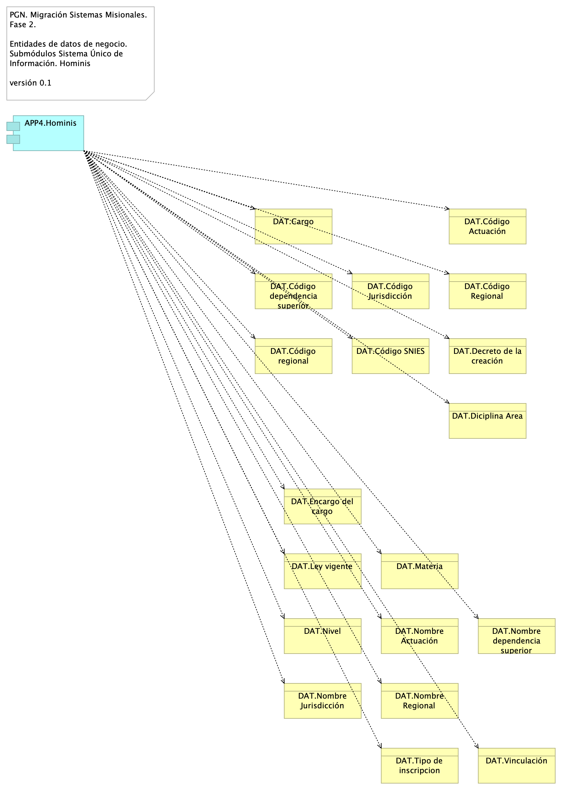{#fig:id-id-a0d2da66c54a40329bb8fb268e625b5f width=}

_Fuente: ${4:Diagnóstico SOA. E-Service (2022).}_

 

### Catálogo de Elementos

| Tema           | Tema | Tema | Tema |
|----------------|------|------|------|
| APP4.Hominis | Application Component | Módulo del SUI. Gestión de capital humano, funcionarios y cargos de representación y libre remoción de la PGN.  |  |
| DAT.Cargo | Business Object |  |  |
| DAT.Código Actuación | Business Object |  |  |
| DAT.Código Jurisdicción | Business Object |  |  |
| DAT.Código Regional | Business Object |  |  |
| DAT.Código SNIES | Business Object |  |  |
| DAT.Código dependencia superior | Business Object |  |  |
| DAT.Código regional | Business Object |  |  |
| DAT.Decreto de la creación | Business Object |  |  |
| DAT.Diciplina Area | Business Object |  |  |
| DAT.Encargo del cargo | Business Object |  |  |
| DAT.Ley vigente | Business Object |  |  |
| DAT.Materia | Business Object |  |  |
| DAT.Nivel | Business Object |  |  |
| DAT.Nombre Actuación | Business Object |  |  |
| DAT.Nombre Jurisdicción | Business Object |  |  |
| DAT.Nombre Regional | Business Object |  |  |
| DAT.Nombre dependencia superior | Business Object |  |  |
| DAT.Tipo de inscripcion | Business Object |  |  |
| DAT.Vinculación | Business Object |  |  |
| Hominis | Business Object | Entidades de datos de negocio de capital humano de la PGN. Sistema de información Homini.  |  |

Table: Elementos de la vista. {#tbl:tblelement-Migracion.2a.datosHominis-id}

<tr class="hidden id-model undefined id-id-a0d2da66c54a40329bb8fb268e625b5f">
	<td>
	<td>Composition Relationship
	<td>Hominis
	<td>DAT.Decreto de la creación
	<td>

<tr class="hidden id-model undefined id-id-a0d2da66c54a40329bb8fb268e625b5f">
	<td>
	<td>Composition Relationship
	<td>Hominis
	<td>DAT.Código Jurisdicción
	<td>

<tr class="hidden id-model undefined id-id-a0d2da66c54a40329bb8fb268e625b5f">
	<td>
	<td>Composition Relationship
	<td>Hominis
	<td>DAT.Código SNIES
	<td>

<tr class="hidden id-model undefined id-id-a0d2da66c54a40329bb8fb268e625b5f">
	<td>
	<td>Composition Relationship
	<td>Hominis
	<td>DAT.Nombre Regional
	<td>

<tr class="hidden id-model undefined id-id-a0d2da66c54a40329bb8fb268e625b5f">
	<td>
	<td>Composition Relationship
	<td>Hominis
	<td>DAT.Encargo del cargo
	<td>

<tr class="hidden id-model undefined id-id-a0d2da66c54a40329bb8fb268e625b5f">
	<td>
	<td>Composition Relationship
	<td>Hominis
	<td>DAT.Código Actuación
	<td>

<tr class="hidden id-model undefined id-id-a0d2da66c54a40329bb8fb268e625b5f">
	<td>
	<td>Composition Relationship
	<td>Hominis
	<td>DAT.Vinculación
	<td>

<tr class="hidden id-model undefined id-id-a0d2da66c54a40329bb8fb268e625b5f">
	<td>
	<td>Composition Relationship
	<td>Hominis
	<td>DAT.Nivel
	<td>

<tr class="hidden id-model undefined id-id-a0d2da66c54a40329bb8fb268e625b5f">
	<td>
	<td>Composition Relationship
	<td>Hominis
	<td>DAT.Nombre Actuación
	<td>

<tr class="hidden id-model undefined id-id-a0d2da66c54a40329bb8fb268e625b5f">
	<td>
	<td>Composition Relationship
	<td>Hominis
	<td>DAT.Cargo
	<td>

<tr class="hidden id-model undefined id-id-a0d2da66c54a40329bb8fb268e625b5f">
	<td>
	<td>Composition Relationship
	<td>Hominis
	<td>DAT.Código regional
	<td>

<tr class="hidden id-model undefined id-id-a0d2da66c54a40329bb8fb268e625b5f">
	<td>
	<td>Composition Relationship
	<td>Hominis
	<td>DAT.Tipo de inscripcion
	<td>

<tr class="hidden id-model undefined id-id-a0d2da66c54a40329bb8fb268e625b5f">
	<td>
	<td>Composition Relationship
	<td>Hominis
	<td>DAT.Código dependencia superior
	<td>

<tr class="hidden id-model undefined id-id-a0d2da66c54a40329bb8fb268e625b5f">
	<td>
	<td>Composition Relationship
	<td>Hominis
	<td>DAT.Nombre Jurisdicción
	<td>

<tr class="hidden id-model undefined id-id-a0d2da66c54a40329bb8fb268e625b5f">
	<td>
	<td>Composition Relationship
	<td>Hominis
	<td>DAT.Nombre dependencia superior
	<td>

<tr class="hidden id-model undefined id-id-a0d2da66c54a40329bb8fb268e625b5f">
	<td>
	<td>Composition Relationship
	<td>Hominis
	<td>DAT.Código Regional
	<td>

<tr class="hidden id-model undefined id-id-a0d2da66c54a40329bb8fb268e625b5f">
	<td>
	<td>Composition Relationship
	<td>Hominis
	<td>DAT.Diciplina Area
	<td>

<tr class="hidden id-model undefined id-id-a0d2da66c54a40329bb8fb268e625b5f">
	<td>
	<td>Composition Relationship
	<td>Hominis
	<td>DAT.Materia
	<td>

<tr class="hidden id-model undefined id-id-a0d2da66c54a40329bb8fb268e625b5f">
	<td>
	<td>Composition Relationship
	<td>Hominis
	<td>DAT.Ley vigente
	<td>

<tr class="hidden id-model undefined id-id-a0d2da66c54a40329bb8fb268e625b5f">
	<td>
	<td>Access Relationship
	<td>APP4.Hominis
	<td>DAT.Código dependencia superior
	<td>

<tr class="hidden id-model undefined id-id-a0d2da66c54a40329bb8fb268e625b5f">
	<td>
	<td>Access Relationship
	<td>APP4.Hominis
	<td>DAT.Diciplina Area
	<td>

<tr class="hidden id-model undefined id-id-a0d2da66c54a40329bb8fb268e625b5f">
	<td>
	<td>Access Relationship
	<td>APP4.Hominis
	<td>DAT.Código Actuación
	<td>

<tr class="hidden id-model undefined id-id-a0d2da66c54a40329bb8fb268e625b5f">
	<td>
	<td>Access Relationship
	<td>APP4.Hominis
	<td>DAT.Cargo
	<td>

<tr class="hidden id-model undefined id-id-a0d2da66c54a40329bb8fb268e625b5f">
	<td>
	<td>Access Relationship
	<td>APP4.Hominis
	<td>DAT.Decreto de la creación
	<td>

<tr class="hidden id-model undefined id-id-a0d2da66c54a40329bb8fb268e625b5f">
	<td>
	<td>Access Relationship
	<td>APP4.Hominis
	<td>DAT.Código regional
	<td>

<tr class="hidden id-model undefined id-id-a0d2da66c54a40329bb8fb268e625b5f">
	<td>
	<td>Access Relationship
	<td>APP4.Hominis
	<td>DAT.Código Jurisdicción
	<td>

<tr class="hidden id-model undefined id-id-a0d2da66c54a40329bb8fb268e625b5f">
	<td>
	<td>Access Relationship
	<td>APP4.Hominis
	<td>DAT.Código Regional
	<td>

<tr class="hidden id-model undefined id-id-a0d2da66c54a40329bb8fb268e625b5f">
	<td>
	<td>Access Relationship
	<td>APP4.Hominis
	<td>DAT.Código SNIES
	<td>

<tr class="hidden id-model undefined id-id-a0d2da66c54a40329bb8fb268e625b5f">
	<td>
	<td>Access Relationship
	<td>APP4.Hominis
	<td>DAT.Tipo de inscripcion
	<td>

<tr class="hidden id-model undefined id-id-a0d2da66c54a40329bb8fb268e625b5f">
	<td>
	<td>Access Relationship
	<td>APP4.Hominis
	<td>DAT.Vinculación
	<td>

<tr class="hidden id-model undefined id-id-a0d2da66c54a40329bb8fb268e625b5f">
	<td>
	<td>Access Relationship
	<td>APP4.Hominis
	<td>DAT.Nombre Jurisdicción
	<td>

<tr class="hidden id-model undefined id-id-a0d2da66c54a40329bb8fb268e625b5f">
	<td>
	<td>Access Relationship
	<td>APP4.Hominis
	<td>DAT.Nivel
	<td>

<tr class="hidden id-model undefined id-id-a0d2da66c54a40329bb8fb268e625b5f">
	<td>
	<td>Access Relationship
	<td>APP4.Hominis
	<td>DAT.Encargo del cargo
	<td>

<tr class="hidden id-model undefined id-id-a0d2da66c54a40329bb8fb268e625b5f">
	<td>
	<td>Access Relationship
	<td>APP4.Hominis
	<td>DAT.Materia
	<td>

<tr class="hidden id-model undefined id-id-a0d2da66c54a40329bb8fb268e625b5f">
	<td>
	<td>Access Relationship
	<td>APP4.Hominis
	<td>DAT.Ley vigente
	<td>

<tr class="hidden id-model undefined id-id-a0d2da66c54a40329bb8fb268e625b5f">
	<td>
	<td>Access Relationship
	<td>APP4.Hominis
	<td>DAT.Nombre Regional
	<td>

<tr class="hidden id-model undefined id-id-a0d2da66c54a40329bb8fb268e625b5f">
	<td>
	<td>Access Relationship
	<td>APP4.Hominis
	<td>DAT.Nombre Actuación
	<td>

<tr class="hidden id-model undefined id-id-a0d2da66c54a40329bb8fb268e625b5f">
	<td>
	<td>Access Relationship
	<td>APP4.Hominis
	<td>DAT.Nombre dependencia superior
	<td>

<tr class="hidden id-model undefined id-id-a0d2da66c54a40329bb8fb268e625b5f">
	<td>
	<td>Access Relationship
	<td>APP4.Hominis
	<td>Hominis
	<td>

## Migracion.2d. datos Control Interno

PGN. Migración Sistemas Misionales. Fase 2.

Entidades de datos de negocio. Submódulos Sistema Único de Información. Control Interno

versión 0.1

Identificación de entidades de datos de negocio relacionadas al módulo de seguimiento del desempeño de la PGN del SUI, Control Interno.

Estas entidades de datos de negocio son los que llamamos los tipos de datos internos del SUI y deben ser consideradas para la creación de las API de manejo del ciclo de vida de los datos de este módulo. 

{#fig:id-id-6dbb952c4479493fae6f0c7f80e180ed width=}

_Fuente: ${4:Diagnóstico SOA. E-Service (2022).}_

 

### Catálogo de Elementos

| Tema           | Tema | Tema | Tema |
|----------------|------|------|------|
| APP3.Control interno | Application Component |  |  |
| DAT.Dependencia | Business Object |  |  |
| DAT.Funcionario | Business Object |  |  |
| DAT.Proceso | Business Object |  |  |
| DAT.Tipo de proceso | Business Object |  |  |

Table: Elementos de la vista. {#tbl:tblelement-Migracion.2d.datosControlInterno-id}

<tr class="hidden id-model undefined id-id-6dbb952c4479493fae6f0c7f80e180ed">
	<td>
	<td>Association Relationship
	<td>DAT.Dependencia
	<td>APP3.Control interno
	<td>

<tr class="hidden id-model undefined id-id-6dbb952c4479493fae6f0c7f80e180ed">
	<td>
	<td>Association Relationship
	<td>DAT.Funcionario
	<td>APP3.Control interno
	<td>

<tr class="hidden id-model undefined id-id-6dbb952c4479493fae6f0c7f80e180ed">
	<td>
	<td>Association Relationship
	<td>DAT.Proceso
	<td>APP3.Control interno
	<td>

<tr class="hidden id-model undefined id-id-6dbb952c4479493fae6f0c7f80e180ed">
	<td>
	<td>Association Relationship
	<td>DAT.Tipo de proceso
	<td>APP3.Control interno
	<td>

## Migracion.2d. datos SIM

PGN. Migración Sistemas Misionales. Fase 2.

Entidades de datos de negocio. Submódulos Sistema Único de Información. SIM

versión 0.1

Identificación de entidades de datos de negocio relacionadas al módulo de SUI, SIM.

Estas entidades de datos de negocio son los que llamamos los tipos de datos internos del SUI y deben ser consideradas para la creación de las API de manejo del ciclo de vida de los datos de este módulo. 

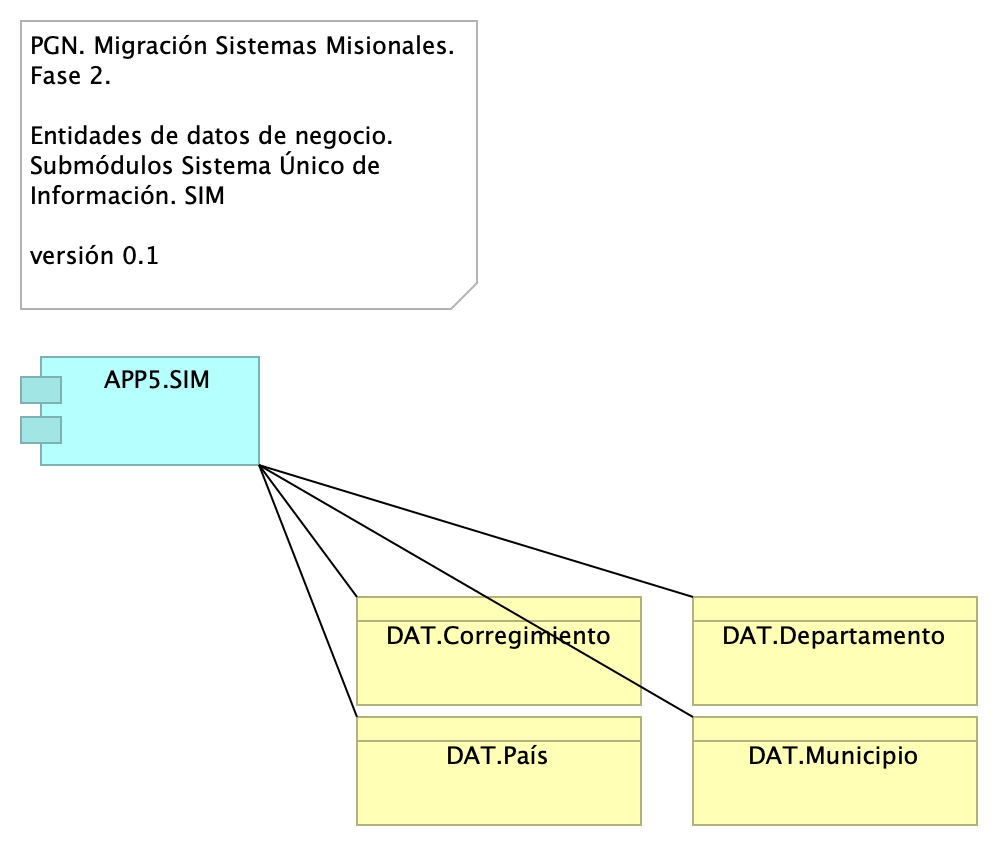{#fig:id-id-5f6183bf4bd84a1da1c33f8273c4c47b width=}

_Fuente: ${4:Diagnóstico SOA. E-Service (2022).}_

 

### Catálogo de Elementos

| Tema           | Tema | Tema | Tema |
|----------------|------|------|------|
| APP5.SIM | Application Component |  |  |
| DAT.Corregimiento | Business Object |  |  |
| DAT.Departamento | Business Object |  |  |
| DAT.Municipio | Business Object |  |  |
| DAT.País | Business Object |  |  |

Table: Elementos de la vista. {#tbl:tblelement-Migracion.2d.datosSIM-id}

<tr class="hidden id-model undefined id-id-5f6183bf4bd84a1da1c33f8273c4c47b">
	<td>
	<td>Association Relationship
	<td>APP5.SIM
	<td>DAT.Municipio
	<td>

<tr class="hidden id-model undefined id-id-5f6183bf4bd84a1da1c33f8273c4c47b">
	<td>
	<td>Association Relationship
	<td>APP5.SIM
	<td>DAT.Departamento
	<td>

<tr class="hidden id-model undefined id-id-5f6183bf4bd84a1da1c33f8273c4c47b">
	<td>
	<td>Association Relationship
	<td>APP5.SIM
	<td>DAT.País
	<td>

<tr class="hidden id-model undefined id-id-5f6183bf4bd84a1da1c33f8273c4c47b">
	<td>
	<td>Association Relationship
	<td>APP5.SIM
	<td>DAT.Corregimiento
	<td>

## Migracion.2d. datos SIRI

PGN. Migración Sistemas Misionales. Fase 2.

Entidades de datos de negocio. Submódulos Sistema Único de Información. SIRI

versión 0.1

Identificación de entidades de datos de negocio relacionadas al módulo del SUI, SIRI.

Estas entidades de datos de negocio son los que llamamos los tipos de datos internos del SUI y deben ser consideradas para la creación de las API de manejo del ciclo de vida de los datos de este módulo. 

{#fig:id-id-1db65b37e4354099bfc2a83f74cbeb51 width=}

_Fuente: ${4:Diagnóstico SOA. E-Service (2022).}_

 

### Catálogo de Elementos

| Tema           | Tema | Tema | Tema |
|----------------|------|------|------|
| APP2.SIRI | Application Component |  |  |
| DAT.Entidad | Business Object |  |  |

Table: Elementos de la vista. {#tbl:tblelement-Migracion.2d.datosSIRI-id}

<tr class="hidden id-model undefined id-id-1db65b37e4354099bfc2a83f74cbeb51">
	<td>
	<td>Access Relationship
	<td>APP2.SIRI
	<td>DAT.Entidad
	<td>

## Organización. 1n. Mapa producto

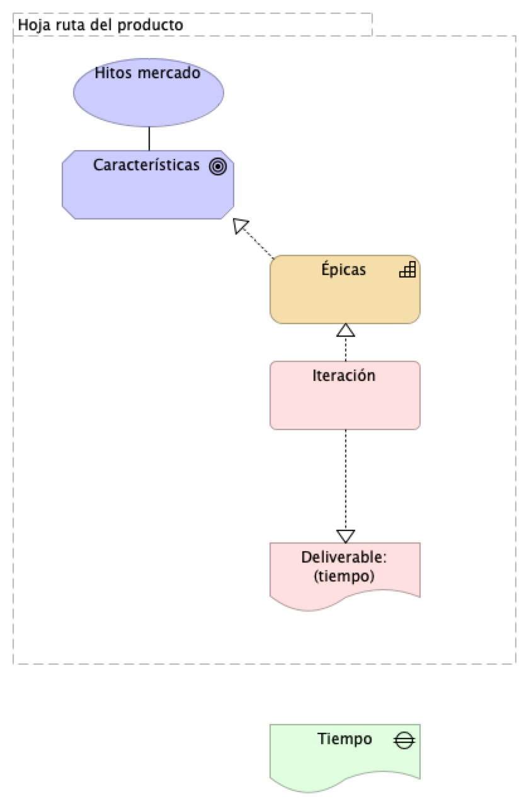{#fig:id-id-26b58fc2a55d40b7a082500205f47e61 width=}

_Fuente: ${4:Diagnóstico SOA. E-Service (2022).}_

 

### Catálogo de Elementos

| Tema           | Tema | Tema | Tema |
|----------------|------|------|------|
| Características | Goal |  |  |
| Deliverable: (tiempo) | Deliverable |  |  |
| Hitos mercado | Value |  |  |
| Hoja ruta del producto | Grouping |  |  |
| Iteración | Work Package |  |  |
| Tiempo | Gap |  |  |
| Épicas | Capability |  |  |

Table: Elementos de la vista. {#tbl:tblelement-Organización.1n.Mapaproducto-id}

<tr class="hidden id-model undefined id-id-26b58fc2a55d40b7a082500205f47e61">
	<td>
	<td>Composition Relationship
	<td>Hoja ruta del producto
	<td>Hitos mercado
	<td>

<tr class="hidden id-model undefined id-id-26b58fc2a55d40b7a082500205f47e61">
	<td>
	<td>Composition Relationship
	<td>Hoja ruta del producto
	<td>Iteración
	<td>

<tr class="hidden id-model undefined id-id-26b58fc2a55d40b7a082500205f47e61">
	<td>
	<td>Composition Relationship
	<td>Hoja ruta del producto
	<td>Características
	<td>

<tr class="hidden id-model undefined id-id-26b58fc2a55d40b7a082500205f47e61">
	<td>
	<td>Composition Relationship
	<td>Hoja ruta del producto
	<td>Épicas
	<td>

<tr class="hidden id-model undefined id-id-26b58fc2a55d40b7a082500205f47e61">
	<td>
	<td>Composition Relationship
	<td>Hoja ruta del producto
	<td>Deliverable: (tiempo)
	<td>

<tr class="hidden id-model undefined id-id-26b58fc2a55d40b7a082500205f47e61">
	<td>
	<td>Realization Relationship
	<td>Iteración
	<td>Épicas
	<td>

<tr class="hidden id-model undefined id-id-26b58fc2a55d40b7a082500205f47e61">
	<td>
	<td>Realization Relationship
	<td>Iteración
	<td>Deliverable: (tiempo)
	<td>

<tr class="hidden id-model undefined id-id-26b58fc2a55d40b7a082500205f47e61">
	<td>
	<td>Association Relationship
	<td>Características
	<td>Hitos mercado
	<td>

<tr class="hidden id-model undefined id-id-26b58fc2a55d40b7a082500205f47e61">
	<td>
	<td>Realization Relationship
	<td>Épicas
	<td>Características
	<td>

## Organización. 1n.1. Mapa producto PGN. Relatoría (seguridad)

Procuraduría General de la Nación
Proyecto Migración SIU, 2023. Fase II

Relatoría. Organización de trabajo. 
Características funcionales, sistémicas, seguridad.

versión 0.7

.png){#fig:id-id-e1a40cd4109d4e12af8226d9b063dfb2 width=}

_Fuente: ${4:Diagnóstico SOA. E-Service (2022).}_

 

### Catálogo de Elementos

| Tema           | Tema | Tema | Tema |
|----------------|------|------|------|
| Administración de contenidos | Capability |  |  |
| Adopción, v1.2 | Value |  |  |
| Autenticación | Goal |  |  |
| Autorización | Goal |  |  |
| Búsqueda | Goal |  |  |
| Búsqueda de contenidos. Relatoría v0.1 | Value |  |  |
| Características | Goal |  |  |
| Componente de  comunicación segura SIU | Capability |  |  |
| Componente de autenticación SIU | Capability |  |  |
| Componente de autorización SIU | Capability |  |  |
| Contenidos | Goal | Se tendran que adecuar los contenidos audivisuales de los sitios web, con subtitulos o CLosed Caption y la apropiacion de lenguajes de señas.  |  |
| Deliverable: (tiempo) | Deliverable |  |  |
| Descripción (metatada) | Goal |  |  |
| Despliegue Relatoría v1.2 | Value |  |  |
| Funcionalidades de búsqueda | Capability |  |  |
| Funcionalidades de descripción de contenidos | Capability |  |  |
| Gestión contenidos. Rltría v1.0 | Value |  |  |
| Hitos mercado | Value |  |  |
| Hoja ruta del producto | Grouping |  |  |
| Indexación | Goal |  |  |
| Integración API CMS | Capability |  |  |
| Integridad | Goal |  |  |
| Iteración | Work Package |  |  |
| Iteración 2 | Work Package |  |  |
| Iteración 3 | Work Package |  |  |
| Iteración 4 | Work Package |  |  |
| Iteración 5 | Work Package |  |  |
| Iteración 6 | Work Package |  |  |
| Iteración 7 | Work Package |  |  |
| Motor de búsqueda | Capability |  |  |
| Organización contenidos. Rltría v0.5 | Value |  |  |
| Proceso de organización de contenidos | Capability |  |  |
| Proceso de recolección de contenidos | Capability |  |  |
| Proceso de sincronización automática de contenidos | Capability |  |  |
| Recolección | Goal |  |  |
| Sincronización (actualizcn) | Goal |  |  |
| rel.Iteración 1 | Work Package |  |  |
| Épicas | Capability |  |  |

Table: Elementos de la vista. {#tbl:tblelement-Organización.1n.1.MapaproductoPGN.Relatoría(seguridad)-id}

<tr class="hidden id-model undefined id-id-26b58fc2a55d40b7a082500205f47e61 id-id-e1a40cd4109d4e12af8226d9b063dfb2">
	<td>
	<td>Composition Relationship
	<td>Hoja ruta del producto
	<td>Hitos mercado
	<td>

<tr class="hidden id-model undefined id-id-26b58fc2a55d40b7a082500205f47e61 id-id-e1a40cd4109d4e12af8226d9b063dfb2">
	<td>
	<td>Composition Relationship
	<td>Hoja ruta del producto
	<td>Iteración
	<td>

<tr class="hidden id-model undefined id-id-26b58fc2a55d40b7a082500205f47e61 id-id-e1a40cd4109d4e12af8226d9b063dfb2">
	<td>
	<td>Composition Relationship
	<td>Hoja ruta del producto
	<td>Características
	<td>

<tr class="hidden id-model undefined id-id-26b58fc2a55d40b7a082500205f47e61 id-id-e1a40cd4109d4e12af8226d9b063dfb2">
	<td>
	<td>Composition Relationship
	<td>Hoja ruta del producto
	<td>Épicas
	<td>

<tr class="hidden id-model undefined id-id-26b58fc2a55d40b7a082500205f47e61 id-id-e1a40cd4109d4e12af8226d9b063dfb2">
	<td>
	<td>Composition Relationship
	<td>Hoja ruta del producto
	<td>Deliverable: (tiempo)
	<td>

<tr class="hidden id-model undefined id-id-26b58fc2a55d40b7a082500205f47e61 id-id-e1a40cd4109d4e12af8226d9b063dfb2">
	<td>
	<td>Realization Relationship
	<td>Iteración
	<td>Épicas
	<td>

<tr class="hidden id-model undefined id-id-26b58fc2a55d40b7a082500205f47e61 id-id-e1a40cd4109d4e12af8226d9b063dfb2">
	<td>
	<td>Realization Relationship
	<td>Iteración
	<td>Deliverable: (tiempo)
	<td>

<tr class="hidden id-model undefined id-id-26b58fc2a55d40b7a082500205f47e61 id-id-e1a40cd4109d4e12af8226d9b063dfb2">
	<td>
	<td>Association Relationship
	<td>Características
	<td>Hitos mercado
	<td>

<tr class="hidden id-model undefined id-id-26b58fc2a55d40b7a082500205f47e61 id-id-e1a40cd4109d4e12af8226d9b063dfb2">
	<td>
	<td>Realization Relationship
	<td>Épicas
	<td>Características
	<td>

<tr class="hidden id-model undefined id-id-e1a40cd4109d4e12af8226d9b063dfb2">
	<td>
	<td>Association Relationship
	<td>Indexación
	<td>Gestión contenidos. Rltría v1.0
	<td>

<tr class="hidden id-model undefined id-id-e1a40cd4109d4e12af8226d9b063dfb2">
	<td>
	<td>Association Relationship
	<td>Contenidos
	<td>Gestión contenidos. Rltría v1.0
	<td>

<tr class="hidden id-model undefined id-id-e1a40cd4109d4e12af8226d9b063dfb2">
	<td>
	<td>Association Relationship
	<td>Recolección
	<td>Organización contenidos. Rltría v0.5
	<td>

<tr class="hidden id-model undefined id-id-e1a40cd4109d4e12af8226d9b063dfb2">
	<td>
	<td>Association Relationship
	<td>Búsqueda
	<td>Búsqueda de contenidos. Relatoría v0.1
	<td>

<tr class="hidden id-model undefined id-id-e1a40cd4109d4e12af8226d9b063dfb2">
	<td>
	<td>Association Relationship
	<td>Sincronización (actualizcn)
	<td>Gestión contenidos. Rltría v1.0
	<td>
Principios que permiten optimizar la navegación, para que sea sencilla, intuitiva, agradable y Segura.

<tr class="hidden id-model undefined id-id-e1a40cd4109d4e12af8226d9b063dfb2">
	<td>
	<td>Association Relationship
	<td>Descripción (metatada)
	<td>Organización contenidos. Rltría v0.5
	<td>

<tr class="hidden id-model undefined id-id-e1a40cd4109d4e12af8226d9b063dfb2">
	<td>
	<td>Realization Relationship
	<td>Funcionalidades de búsqueda
	<td>Búsqueda
	<td>

<tr class="hidden id-model undefined id-id-e1a40cd4109d4e12af8226d9b063dfb2">
	<td>
	<td>Realization Relationship
	<td>Proceso de organización de contenidos
	<td>Indexación
	<td>

<tr class="hidden id-model undefined id-id-e1a40cd4109d4e12af8226d9b063dfb2">
	<td>
	<td>Realization Relationship
	<td>Funcionalidades de descripción de contenidos
	<td>Descripción (metatada)
	<td>

<tr class="hidden id-model undefined id-id-e1a40cd4109d4e12af8226d9b063dfb2">
	<td>
	<td>Realization Relationship
	<td>Proceso de sincronización automática de contenidos
	<td>Sincronización (actualizcn)
	<td>

<tr class="hidden id-model undefined id-id-e1a40cd4109d4e12af8226d9b063dfb2">
	<td>
	<td>Realization Relationship
	<td>Proceso de recolección de contenidos
	<td>Recolección
	<td>

<tr class="hidden id-model undefined id-id-e1a40cd4109d4e12af8226d9b063dfb2">
	<td>
	<td>Realization Relationship
	<td>Administración de contenidos
	<td>Contenidos
	<td>

<tr class="hidden id-model undefined id-id-e1a40cd4109d4e12af8226d9b063dfb2">
	<td>
	<td>Realization Relationship
	<td>Motor de búsqueda
	<td>Búsqueda
	<td>

<tr class="hidden id-model undefined id-id-e1a40cd4109d4e12af8226d9b063dfb2">
	<td>
	<td>Realization Relationship
	<td>Componente de autenticación SIU
	<td>Autenticación
	<td>

<tr class="hidden id-model undefined id-id-e1a40cd4109d4e12af8226d9b063dfb2">
	<td>
	<td>Realization Relationship
	<td>Componente de autorización SIU
	<td>Autorización
	<td>

<tr class="hidden id-model undefined id-id-e1a40cd4109d4e12af8226d9b063dfb2">
	<td>
	<td>Realization Relationship
	<td>Componente de  comunicación segura SIU
	<td>Integridad
	<td>

<tr class="hidden id-model undefined id-id-e1a40cd4109d4e12af8226d9b063dfb2">
	<td>
	<td>Realization Relationship
	<td>Integración API CMS
	<td>Recolección
	<td>

<tr class="hidden id-model undefined id-id-e1a40cd4109d4e12af8226d9b063dfb2">
	<td>
	<td>Realization Relationship
	<td>Integración API CMS
	<td>Descripción (metatada)
	<td>

<tr class="hidden id-model undefined id-id-e1a40cd4109d4e12af8226d9b063dfb2">
	<td>
	<td>Realization Relationship
	<td>Integración API CMS
	<td>Indexación
	<td>

<tr class="hidden id-model undefined id-id-e1a40cd4109d4e12af8226d9b063dfb2">
	<td>
	<td>Realization Relationship
	<td>Integración API CMS
	<td>Contenidos
	<td>

## Organización. 1n.1. Mapa producto PGN.1.Relatoría

Procuraduría General de la Nación
Proyecto Migración SIU, 2023. Fase II

SIREL (Relatoría). Organización de trabajo. 
Características funcionales, sistémicas, seguridad.

versión 0.12

Organización y distribución de las características técnicas y funcionales del módulo de Relatoría. 

Características principales:
* Utilización de metadatos
* Búsqueda de contenido (intradocumental y por metadatos)
* Procesos de recolección y sincronización de contenidos

De arriba a abajo: 
1. Fila 1, planificación de espacios de trabajo (iteraciones, para este caso) restringido al alcance del proyecto Migración PGN 2023.
1. Debajo, lo hitos importantes organizados en el tiempo.
1. Fila 3. Evolución de las características en los aspectos funcionales, técnico, hardware y software del módulo Relatoría de PGN. 
1. FInalmente, fila final del diagrama, la entrega en el tiempo de las capacidades del módulo de relatoría (épicas, para el caso de Scrum). La prioridad de liberación de estas la determina el equipo funcional de este módulo de la PGN.

&lt;br&gt;

{#fig:id-id-2dff7e836da042a9a55c3c635828070e width=}

_Fuente: ${4:Diagnóstico SOA. E-Service (2022).}_

 

### Catálogo de Elementos

| Tema           | Tema | Tema | Tema |
|----------------|------|------|------|
| Administración de contenidos | Capability |  |  |
| Adopción, v1.2 | Value |  |  |
| Autenticación | Goal |  |  |
| Autorización | Goal |  |  |
| Búsqueda | Goal |  |  |
| Búsqueda de contenidos. Relatoría v0.1 | Value |  |  |
| Características | Goal |  |  |
| Componente de  comunicación segura SIU | Capability |  |  |
| Componente de autenticación SIU | Capability |  |  |
| Componente de autorización SIU | Capability |  |  |
| Contenidos | Goal | Se tendran que adecuar los contenidos audivisuales de los sitios web, con subtitulos o CLosed Caption y la apropiacion de lenguajes de señas.  |  |
| Deliverable: (tiempo) | Deliverable |  |  |
| Descripción (metatada) | Goal |  |  |
| Despliegue Relatoría v1.2 | Value |  |  |
| Funcionalidades de búsqueda | Capability |  |  |
| Funcionalidades de descripción de contenidos | Capability |  |  |
| Gestión contenidos. Rltría v1.0 | Value |  |  |
| Hitos mercado | Value |  |  |
| Hoja ruta del producto | Grouping |  |  |
| Indexación | Goal |  |  |
| Integración API CMS | Capability |  |  |
| Integridad | Goal |  |  |
| Iteración | Work Package |  |  |
| Iteración 2 | Work Package |  |  |
| Iteración 3 | Work Package |  |  |
| Iteración 4 | Work Package |  |  |
| Iteración 5 | Work Package |  |  |
| Iteración 6 | Work Package |  |  |
| Iteración 7 | Work Package |  |  |
| Motor de búsqueda | Capability |  |  |
| Organización contenidos. Rltría v0.5 | Value |  |  |
| Proceso de organización de contenidos | Capability |  |  |
| Proceso de recolección de contenidos | Capability |  |  |
| Proceso de sincronización automática de contenidos | Capability |  |  |
| Publicar contenidos | Capability |  |  |
| Recolección | Goal |  |  |
| Seguridad. Rltría v0.9 | Value |  |  |
| Sincronización (actualizcn) | Goal |  |  |
| rel.Iteración 1 | Work Package |  |  |
| Épicas | Capability |  |  |

Table: Elementos de la vista. {#tbl:tblelement-Organización.1n.1.MapaproductoPGN.1.Relatoría-id}

<tr class="hidden id-model undefined id-id-26b58fc2a55d40b7a082500205f47e61 id-id-e1a40cd4109d4e12af8226d9b063dfb2 id-id-2dff7e836da042a9a55c3c635828070e">
	<td>
	<td>Composition Relationship
	<td>Hoja ruta del producto
	<td>Hitos mercado
	<td>

<tr class="hidden id-model undefined id-id-26b58fc2a55d40b7a082500205f47e61 id-id-e1a40cd4109d4e12af8226d9b063dfb2 id-id-2dff7e836da042a9a55c3c635828070e">
	<td>
	<td>Composition Relationship
	<td>Hoja ruta del producto
	<td>Iteración
	<td>

<tr class="hidden id-model undefined id-id-26b58fc2a55d40b7a082500205f47e61 id-id-e1a40cd4109d4e12af8226d9b063dfb2 id-id-2dff7e836da042a9a55c3c635828070e">
	<td>
	<td>Composition Relationship
	<td>Hoja ruta del producto
	<td>Características
	<td>

<tr class="hidden id-model undefined id-id-26b58fc2a55d40b7a082500205f47e61 id-id-e1a40cd4109d4e12af8226d9b063dfb2 id-id-2dff7e836da042a9a55c3c635828070e">
	<td>
	<td>Composition Relationship
	<td>Hoja ruta del producto
	<td>Épicas
	<td>

<tr class="hidden id-model undefined id-id-26b58fc2a55d40b7a082500205f47e61 id-id-e1a40cd4109d4e12af8226d9b063dfb2 id-id-2dff7e836da042a9a55c3c635828070e">
	<td>
	<td>Composition Relationship
	<td>Hoja ruta del producto
	<td>Deliverable: (tiempo)
	<td>

<tr class="hidden id-model undefined id-id-26b58fc2a55d40b7a082500205f47e61 id-id-e1a40cd4109d4e12af8226d9b063dfb2 id-id-2dff7e836da042a9a55c3c635828070e">
	<td>
	<td>Realization Relationship
	<td>Iteración
	<td>Épicas
	<td>

<tr class="hidden id-model undefined id-id-26b58fc2a55d40b7a082500205f47e61 id-id-e1a40cd4109d4e12af8226d9b063dfb2 id-id-2dff7e836da042a9a55c3c635828070e">
	<td>
	<td>Realization Relationship
	<td>Iteración
	<td>Deliverable: (tiempo)
	<td>

<tr class="hidden id-model undefined id-id-26b58fc2a55d40b7a082500205f47e61 id-id-e1a40cd4109d4e12af8226d9b063dfb2 id-id-2dff7e836da042a9a55c3c635828070e">
	<td>
	<td>Association Relationship
	<td>Características
	<td>Hitos mercado
	<td>

<tr class="hidden id-model undefined id-id-26b58fc2a55d40b7a082500205f47e61 id-id-e1a40cd4109d4e12af8226d9b063dfb2 id-id-2dff7e836da042a9a55c3c635828070e">
	<td>
	<td>Realization Relationship
	<td>Épicas
	<td>Características
	<td>

<tr class="hidden id-model undefined id-id-e1a40cd4109d4e12af8226d9b063dfb2 id-id-2dff7e836da042a9a55c3c635828070e">
	<td>
	<td>Association Relationship
	<td>Indexación
	<td>Gestión contenidos. Rltría v1.0
	<td>

<tr class="hidden id-model undefined id-id-e1a40cd4109d4e12af8226d9b063dfb2 id-id-2dff7e836da042a9a55c3c635828070e">
	<td>
	<td>Association Relationship
	<td>Contenidos
	<td>Gestión contenidos. Rltría v1.0
	<td>

<tr class="hidden id-model undefined id-id-e1a40cd4109d4e12af8226d9b063dfb2 id-id-2dff7e836da042a9a55c3c635828070e">
	<td>
	<td>Association Relationship
	<td>Recolección
	<td>Organización contenidos. Rltría v0.5
	<td>

<tr class="hidden id-model undefined id-id-e1a40cd4109d4e12af8226d9b063dfb2 id-id-2dff7e836da042a9a55c3c635828070e">
	<td>
	<td>Association Relationship
	<td>Búsqueda
	<td>Búsqueda de contenidos. Relatoría v0.1
	<td>

<tr class="hidden id-model undefined id-id-e1a40cd4109d4e12af8226d9b063dfb2 id-id-2dff7e836da042a9a55c3c635828070e">
	<td>
	<td>Association Relationship
	<td>Sincronización (actualizcn)
	<td>Gestión contenidos. Rltría v1.0
	<td>
Principios que permiten optimizar la navegación, para que sea sencilla, intuitiva, agradable y Segura.

<tr class="hidden id-model undefined id-id-e1a40cd4109d4e12af8226d9b063dfb2 id-id-2dff7e836da042a9a55c3c635828070e">
	<td>
	<td>Association Relationship
	<td>Descripción (metatada)
	<td>Organización contenidos. Rltría v0.5
	<td>

<tr class="hidden id-model undefined id-id-e1a40cd4109d4e12af8226d9b063dfb2 id-id-2dff7e836da042a9a55c3c635828070e">
	<td>
	<td>Realization Relationship
	<td>Funcionalidades de búsqueda
	<td>Búsqueda
	<td>

<tr class="hidden id-model undefined id-id-e1a40cd4109d4e12af8226d9b063dfb2 id-id-2dff7e836da042a9a55c3c635828070e">
	<td>
	<td>Realization Relationship
	<td>Proceso de organización de contenidos
	<td>Indexación
	<td>

<tr class="hidden id-model undefined id-id-e1a40cd4109d4e12af8226d9b063dfb2 id-id-2dff7e836da042a9a55c3c635828070e">
	<td>
	<td>Realization Relationship
	<td>Funcionalidades de descripción de contenidos
	<td>Descripción (metatada)
	<td>

<tr class="hidden id-model undefined id-id-e1a40cd4109d4e12af8226d9b063dfb2 id-id-2dff7e836da042a9a55c3c635828070e">
	<td>
	<td>Realization Relationship
	<td>Proceso de sincronización automática de contenidos
	<td>Sincronización (actualizcn)
	<td>

<tr class="hidden id-model undefined id-id-e1a40cd4109d4e12af8226d9b063dfb2 id-id-2dff7e836da042a9a55c3c635828070e">
	<td>
	<td>Realization Relationship
	<td>Proceso de recolección de contenidos
	<td>Recolección
	<td>

<tr class="hidden id-model undefined id-id-e1a40cd4109d4e12af8226d9b063dfb2 id-id-2dff7e836da042a9a55c3c635828070e">
	<td>
	<td>Realization Relationship
	<td>Administración de contenidos
	<td>Contenidos
	<td>

<tr class="hidden id-model undefined id-id-e1a40cd4109d4e12af8226d9b063dfb2 id-id-2dff7e836da042a9a55c3c635828070e">
	<td>
	<td>Realization Relationship
	<td>Motor de búsqueda
	<td>Búsqueda
	<td>

<tr class="hidden id-model undefined id-id-2dff7e836da042a9a55c3c635828070e">
	<td>
	<td>Association Relationship
	<td>Autenticación
	<td>Seguridad. Rltría v0.9
	<td>

<tr class="hidden id-model undefined id-id-2dff7e836da042a9a55c3c635828070e">
	<td>
	<td>Association Relationship
	<td>Autorización
	<td>Seguridad. Rltría v0.9
	<td>

<tr class="hidden id-model undefined id-id-2dff7e836da042a9a55c3c635828070e">
	<td>
	<td>Association Relationship
	<td>Integridad
	<td>Seguridad. Rltría v0.9
	<td>

<tr class="hidden id-model undefined id-id-e1a40cd4109d4e12af8226d9b063dfb2 id-id-2dff7e836da042a9a55c3c635828070e">
	<td>
	<td>Realization Relationship
	<td>Componente de autenticación SIU
	<td>Autenticación
	<td>

<tr class="hidden id-model undefined id-id-e1a40cd4109d4e12af8226d9b063dfb2 id-id-2dff7e836da042a9a55c3c635828070e">
	<td>
	<td>Realization Relationship
	<td>Componente de autorización SIU
	<td>Autorización
	<td>

<tr class="hidden id-model undefined id-id-e1a40cd4109d4e12af8226d9b063dfb2 id-id-2dff7e836da042a9a55c3c635828070e">
	<td>
	<td>Realization Relationship
	<td>Componente de  comunicación segura SIU
	<td>Integridad
	<td>

<tr class="hidden id-model undefined id-id-e1a40cd4109d4e12af8226d9b063dfb2 id-id-2dff7e836da042a9a55c3c635828070e">
	<td>
	<td>Realization Relationship
	<td>Integración API CMS
	<td>Recolección
	<td>

<tr class="hidden id-model undefined id-id-e1a40cd4109d4e12af8226d9b063dfb2 id-id-2dff7e836da042a9a55c3c635828070e">
	<td>
	<td>Realization Relationship
	<td>Integración API CMS
	<td>Descripción (metatada)
	<td>

<tr class="hidden id-model undefined id-id-e1a40cd4109d4e12af8226d9b063dfb2 id-id-2dff7e836da042a9a55c3c635828070e">
	<td>
	<td>Realization Relationship
	<td>Integración API CMS
	<td>Indexación
	<td>

<tr class="hidden id-model undefined id-id-e1a40cd4109d4e12af8226d9b063dfb2 id-id-2dff7e836da042a9a55c3c635828070e">
	<td>
	<td>Realization Relationship
	<td>Integración API CMS
	<td>Contenidos
	<td>

<tr class="hidden id-model undefined id-id-2dff7e836da042a9a55c3c635828070e">
	<td>
	<td>Realization Relationship
	<td>rel.Iteración 1
	<td>Funcionalidades de búsqueda
	<td>

<tr class="hidden id-model undefined id-id-2dff7e836da042a9a55c3c635828070e">
	<td>
	<td>Realization Relationship
	<td>Iteración 2
	<td>Proceso de recolección de contenidos
	<td>

<tr class="hidden id-model undefined id-id-2dff7e836da042a9a55c3c635828070e">
	<td>
	<td>Realization Relationship
	<td>Iteración 2
	<td>Motor de búsqueda
	<td>

<tr class="hidden id-model undefined id-id-2dff7e836da042a9a55c3c635828070e">
	<td>
	<td>Realization Relationship
	<td>Iteración 2
	<td>Integración API CMS
	<td>

<tr class="hidden id-model undefined id-id-2dff7e836da042a9a55c3c635828070e">
	<td>
	<td>Realization Relationship
	<td>Iteración 3
	<td>Funcionalidades de descripción de contenidos
	<td>

<tr class="hidden id-model undefined id-id-2dff7e836da042a9a55c3c635828070e">
	<td>
	<td>Realization Relationship
	<td>Iteración 3
	<td>Integración API CMS
	<td>

<tr class="hidden id-model undefined id-id-2dff7e836da042a9a55c3c635828070e">
	<td>
	<td>Realization Relationship
	<td>Iteración 3
	<td>Administración de contenidos
	<td>

<tr class="hidden id-model undefined id-id-2dff7e836da042a9a55c3c635828070e">
	<td>
	<td>Realization Relationship
	<td>Iteración 4
	<td>Proceso de organización de contenidos
	<td>

<tr class="hidden id-model undefined id-id-2dff7e836da042a9a55c3c635828070e">
	<td>
	<td>Realization Relationship
	<td>Iteración 4
	<td>Publicar contenidos
	<td>

<tr class="hidden id-model undefined id-id-2dff7e836da042a9a55c3c635828070e">
	<td>
	<td>Realization Relationship
	<td>Iteración 5
	<td>Proceso de sincronización automática de contenidos
	<td>

<tr class="hidden id-model undefined id-id-2dff7e836da042a9a55c3c635828070e">
	<td>
	<td>Realization Relationship
	<td>Publicar contenidos
	<td>Contenidos
	<td>

## Organización. 1n.1a. Mapa producto PGN. Relatoría

Procuraduría General de la Nación
Proyecto Migración SIU, 2023. Fase II

Relatoría. Organización de trabajo. 
Características funcionales, sistémicas, seguridad.

versión 0.7

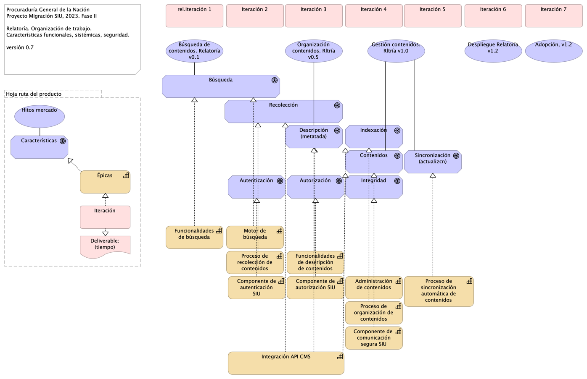{#fig:id-id-b7bbdb516c71447e866452edcce2c9e8 width=}

_Fuente: ${4:Diagnóstico SOA. E-Service (2022).}_

 

### Catálogo de Elementos

| Tema           | Tema | Tema | Tema |
|----------------|------|------|------|
| Administración de contenidos | Capability |  |  |
| Adopción, v1.2 | Value |  |  |
| Autenticación | Goal |  |  |
| Autorización | Goal |  |  |
| Búsqueda | Goal |  |  |
| Búsqueda de contenidos. Relatoría v0.1 | Value |  |  |
| Características | Goal |  |  |
| Componente de  comunicación segura SIU | Capability |  |  |
| Componente de autenticación SIU | Capability |  |  |
| Componente de autorización SIU | Capability |  |  |
| Contenidos | Goal | Se tendran que adecuar los contenidos audivisuales de los sitios web, con subtitulos o CLosed Caption y la apropiacion de lenguajes de señas.  |  |
| Deliverable: (tiempo) | Deliverable |  |  |
| Descripción (metatada) | Goal |  |  |
| Despliegue Relatoría v1.2 | Value |  |  |
| Funcionalidades de búsqueda | Capability |  |  |
| Funcionalidades de descripción de contenidos | Capability |  |  |
| Gestión contenidos. Rltría v1.0 | Value |  |  |
| Hitos mercado | Value |  |  |
| Hoja ruta del producto | Grouping |  |  |
| Indexación | Goal |  |  |
| Integración API CMS | Capability |  |  |
| Integridad | Goal |  |  |
| Iteración | Work Package |  |  |
| Iteración 2 | Work Package |  |  |
| Iteración 3 | Work Package |  |  |
| Iteración 4 | Work Package |  |  |
| Iteración 5 | Work Package |  |  |
| Iteración 6 | Work Package |  |  |
| Iteración 7 | Work Package |  |  |
| Motor de búsqueda | Capability |  |  |
| Organización contenidos. Rltría v0.5 | Value |  |  |
| Proceso de organización de contenidos | Capability |  |  |
| Proceso de recolección de contenidos | Capability |  |  |
| Proceso de sincronización automática de contenidos | Capability |  |  |
| Recolección | Goal |  |  |
| Sincronización (actualizcn) | Goal |  |  |
| rel.Iteración 1 | Work Package |  |  |
| Épicas | Capability |  |  |

Table: Elementos de la vista. {#tbl:tblelement-Organización.1n.1a.MapaproductoPGN.Relatoría-id}

<tr class="hidden id-model undefined id-id-26b58fc2a55d40b7a082500205f47e61 id-id-e1a40cd4109d4e12af8226d9b063dfb2 id-id-2dff7e836da042a9a55c3c635828070e id-id-b7bbdb516c71447e866452edcce2c9e8">
	<td>
	<td>Composition Relationship
	<td>Hoja ruta del producto
	<td>Hitos mercado
	<td>

<tr class="hidden id-model undefined id-id-26b58fc2a55d40b7a082500205f47e61 id-id-e1a40cd4109d4e12af8226d9b063dfb2 id-id-2dff7e836da042a9a55c3c635828070e id-id-b7bbdb516c71447e866452edcce2c9e8">
	<td>
	<td>Composition Relationship
	<td>Hoja ruta del producto
	<td>Iteración
	<td>

<tr class="hidden id-model undefined id-id-26b58fc2a55d40b7a082500205f47e61 id-id-e1a40cd4109d4e12af8226d9b063dfb2 id-id-2dff7e836da042a9a55c3c635828070e id-id-b7bbdb516c71447e866452edcce2c9e8">
	<td>
	<td>Composition Relationship
	<td>Hoja ruta del producto
	<td>Características
	<td>

<tr class="hidden id-model undefined id-id-26b58fc2a55d40b7a082500205f47e61 id-id-e1a40cd4109d4e12af8226d9b063dfb2 id-id-2dff7e836da042a9a55c3c635828070e id-id-b7bbdb516c71447e866452edcce2c9e8">
	<td>
	<td>Composition Relationship
	<td>Hoja ruta del producto
	<td>Épicas
	<td>

<tr class="hidden id-model undefined id-id-26b58fc2a55d40b7a082500205f47e61 id-id-e1a40cd4109d4e12af8226d9b063dfb2 id-id-2dff7e836da042a9a55c3c635828070e id-id-b7bbdb516c71447e866452edcce2c9e8">
	<td>
	<td>Composition Relationship
	<td>Hoja ruta del producto
	<td>Deliverable: (tiempo)
	<td>

<tr class="hidden id-model undefined id-id-26b58fc2a55d40b7a082500205f47e61 id-id-e1a40cd4109d4e12af8226d9b063dfb2 id-id-2dff7e836da042a9a55c3c635828070e id-id-b7bbdb516c71447e866452edcce2c9e8">
	<td>
	<td>Realization Relationship
	<td>Iteración
	<td>Épicas
	<td>

<tr class="hidden id-model undefined id-id-26b58fc2a55d40b7a082500205f47e61 id-id-e1a40cd4109d4e12af8226d9b063dfb2 id-id-2dff7e836da042a9a55c3c635828070e id-id-b7bbdb516c71447e866452edcce2c9e8">
	<td>
	<td>Realization Relationship
	<td>Iteración
	<td>Deliverable: (tiempo)
	<td>

<tr class="hidden id-model undefined id-id-26b58fc2a55d40b7a082500205f47e61 id-id-e1a40cd4109d4e12af8226d9b063dfb2 id-id-2dff7e836da042a9a55c3c635828070e id-id-b7bbdb516c71447e866452edcce2c9e8">
	<td>
	<td>Association Relationship
	<td>Características
	<td>Hitos mercado
	<td>

<tr class="hidden id-model undefined id-id-26b58fc2a55d40b7a082500205f47e61 id-id-e1a40cd4109d4e12af8226d9b063dfb2 id-id-2dff7e836da042a9a55c3c635828070e id-id-b7bbdb516c71447e866452edcce2c9e8">
	<td>
	<td>Realization Relationship
	<td>Épicas
	<td>Características
	<td>

<tr class="hidden id-model undefined id-id-e1a40cd4109d4e12af8226d9b063dfb2 id-id-2dff7e836da042a9a55c3c635828070e id-id-b7bbdb516c71447e866452edcce2c9e8">
	<td>
	<td>Association Relationship
	<td>Indexación
	<td>Gestión contenidos. Rltría v1.0
	<td>

<tr class="hidden id-model undefined id-id-e1a40cd4109d4e12af8226d9b063dfb2 id-id-2dff7e836da042a9a55c3c635828070e id-id-b7bbdb516c71447e866452edcce2c9e8">
	<td>
	<td>Association Relationship
	<td>Contenidos
	<td>Gestión contenidos. Rltría v1.0
	<td>

<tr class="hidden id-model undefined id-id-e1a40cd4109d4e12af8226d9b063dfb2 id-id-2dff7e836da042a9a55c3c635828070e id-id-b7bbdb516c71447e866452edcce2c9e8">
	<td>
	<td>Association Relationship
	<td>Recolección
	<td>Organización contenidos. Rltría v0.5
	<td>

<tr class="hidden id-model undefined id-id-e1a40cd4109d4e12af8226d9b063dfb2 id-id-2dff7e836da042a9a55c3c635828070e id-id-b7bbdb516c71447e866452edcce2c9e8">
	<td>
	<td>Association Relationship
	<td>Búsqueda
	<td>Búsqueda de contenidos. Relatoría v0.1
	<td>

<tr class="hidden id-model undefined id-id-e1a40cd4109d4e12af8226d9b063dfb2 id-id-2dff7e836da042a9a55c3c635828070e id-id-b7bbdb516c71447e866452edcce2c9e8">
	<td>
	<td>Association Relationship
	<td>Sincronización (actualizcn)
	<td>Gestión contenidos. Rltría v1.0
	<td>
Principios que permiten optimizar la navegación, para que sea sencilla, intuitiva, agradable y Segura.

<tr class="hidden id-model undefined id-id-e1a40cd4109d4e12af8226d9b063dfb2 id-id-2dff7e836da042a9a55c3c635828070e id-id-b7bbdb516c71447e866452edcce2c9e8">
	<td>
	<td>Association Relationship
	<td>Descripción (metatada)
	<td>Organización contenidos. Rltría v0.5
	<td>

<tr class="hidden id-model undefined id-id-e1a40cd4109d4e12af8226d9b063dfb2 id-id-2dff7e836da042a9a55c3c635828070e id-id-b7bbdb516c71447e866452edcce2c9e8">
	<td>
	<td>Realization Relationship
	<td>Funcionalidades de búsqueda
	<td>Búsqueda
	<td>

<tr class="hidden id-model undefined id-id-e1a40cd4109d4e12af8226d9b063dfb2 id-id-2dff7e836da042a9a55c3c635828070e id-id-b7bbdb516c71447e866452edcce2c9e8">
	<td>
	<td>Realization Relationship
	<td>Proceso de organización de contenidos
	<td>Indexación
	<td>

<tr class="hidden id-model undefined id-id-e1a40cd4109d4e12af8226d9b063dfb2 id-id-2dff7e836da042a9a55c3c635828070e id-id-b7bbdb516c71447e866452edcce2c9e8">
	<td>
	<td>Realization Relationship
	<td>Funcionalidades de descripción de contenidos
	<td>Descripción (metatada)
	<td>

<tr class="hidden id-model undefined id-id-e1a40cd4109d4e12af8226d9b063dfb2 id-id-2dff7e836da042a9a55c3c635828070e id-id-b7bbdb516c71447e866452edcce2c9e8">
	<td>
	<td>Realization Relationship
	<td>Proceso de sincronización automática de contenidos
	<td>Sincronización (actualizcn)
	<td>

<tr class="hidden id-model undefined id-id-e1a40cd4109d4e12af8226d9b063dfb2 id-id-2dff7e836da042a9a55c3c635828070e id-id-b7bbdb516c71447e866452edcce2c9e8">
	<td>
	<td>Realization Relationship
	<td>Proceso de recolección de contenidos
	<td>Recolección
	<td>

<tr class="hidden id-model undefined id-id-e1a40cd4109d4e12af8226d9b063dfb2 id-id-2dff7e836da042a9a55c3c635828070e id-id-b7bbdb516c71447e866452edcce2c9e8">
	<td>
	<td>Realization Relationship
	<td>Administración de contenidos
	<td>Contenidos
	<td>

<tr class="hidden id-model undefined id-id-e1a40cd4109d4e12af8226d9b063dfb2 id-id-2dff7e836da042a9a55c3c635828070e id-id-b7bbdb516c71447e866452edcce2c9e8">
	<td>
	<td>Realization Relationship
	<td>Motor de búsqueda
	<td>Búsqueda
	<td>

<tr class="hidden id-model undefined id-id-e1a40cd4109d4e12af8226d9b063dfb2 id-id-2dff7e836da042a9a55c3c635828070e id-id-b7bbdb516c71447e866452edcce2c9e8">
	<td>
	<td>Realization Relationship
	<td>Componente de autenticación SIU
	<td>Autenticación
	<td>

<tr class="hidden id-model undefined id-id-e1a40cd4109d4e12af8226d9b063dfb2 id-id-2dff7e836da042a9a55c3c635828070e id-id-b7bbdb516c71447e866452edcce2c9e8">
	<td>
	<td>Realization Relationship
	<td>Componente de autorización SIU
	<td>Autorización
	<td>

<tr class="hidden id-model undefined id-id-e1a40cd4109d4e12af8226d9b063dfb2 id-id-2dff7e836da042a9a55c3c635828070e id-id-b7bbdb516c71447e866452edcce2c9e8">
	<td>
	<td>Realization Relationship
	<td>Componente de  comunicación segura SIU
	<td>Integridad
	<td>

<tr class="hidden id-model undefined id-id-e1a40cd4109d4e12af8226d9b063dfb2 id-id-2dff7e836da042a9a55c3c635828070e id-id-b7bbdb516c71447e866452edcce2c9e8">
	<td>
	<td>Realization Relationship
	<td>Integración API CMS
	<td>Recolección
	<td>

<tr class="hidden id-model undefined id-id-e1a40cd4109d4e12af8226d9b063dfb2 id-id-2dff7e836da042a9a55c3c635828070e id-id-b7bbdb516c71447e866452edcce2c9e8">
	<td>
	<td>Realization Relationship
	<td>Integración API CMS
	<td>Descripción (metatada)
	<td>

<tr class="hidden id-model undefined id-id-e1a40cd4109d4e12af8226d9b063dfb2 id-id-2dff7e836da042a9a55c3c635828070e id-id-b7bbdb516c71447e866452edcce2c9e8">
	<td>
	<td>Realization Relationship
	<td>Integración API CMS
	<td>Indexación
	<td>

<tr class="hidden id-model undefined id-id-e1a40cd4109d4e12af8226d9b063dfb2 id-id-2dff7e836da042a9a55c3c635828070e id-id-b7bbdb516c71447e866452edcce2c9e8">
	<td>
	<td>Realization Relationship
	<td>Integración API CMS
	<td>Contenidos
	<td>

## Organización. 1n.a. Mapa producto arquitectura

{#fig:id-id-9e62cc661c6a48ffb0b344b3dbe37852 width=}

_Fuente: ${4:Diagnóstico SOA. E-Service (2022).}_

 

### Catálogo de Elementos

| Tema           | Tema | Tema | Tema |
|----------------|------|------|------|
| Application Component | Application Component |  |  |
| Características | Goal |  |  |
| Deliverable: (tiempo) | Deliverable |  |  |
| Evolución arquitectura | Plateau |  |  |
| Gap | Gap |  |  |
| Hitos mercado | Value |  |  |
| Hoja ruta aquitectura | Grouping |  |  |
| Hoja ruta del producto | Grouping |  |  |
| Iteración | Work Package |  |  |
| Épicas | Capability |  |  |

Table: Elementos de la vista. {#tbl:tblelement-Organización.1n.a.Mapaproductoarquitectura-id}

<tr class="hidden id-model undefined id-id-26b58fc2a55d40b7a082500205f47e61 id-id-e1a40cd4109d4e12af8226d9b063dfb2 id-id-2dff7e836da042a9a55c3c635828070e id-id-b7bbdb516c71447e866452edcce2c9e8 id-id-9e62cc661c6a48ffb0b344b3dbe37852">
	<td>
	<td>Composition Relationship
	<td>Hoja ruta del producto
	<td>Hitos mercado
	<td>

<tr class="hidden id-model undefined id-id-26b58fc2a55d40b7a082500205f47e61 id-id-e1a40cd4109d4e12af8226d9b063dfb2 id-id-2dff7e836da042a9a55c3c635828070e id-id-b7bbdb516c71447e866452edcce2c9e8 id-id-9e62cc661c6a48ffb0b344b3dbe37852">
	<td>
	<td>Composition Relationship
	<td>Hoja ruta del producto
	<td>Iteración
	<td>

<tr class="hidden id-model undefined id-id-26b58fc2a55d40b7a082500205f47e61 id-id-e1a40cd4109d4e12af8226d9b063dfb2 id-id-2dff7e836da042a9a55c3c635828070e id-id-b7bbdb516c71447e866452edcce2c9e8 id-id-9e62cc661c6a48ffb0b344b3dbe37852">
	<td>
	<td>Composition Relationship
	<td>Hoja ruta del producto
	<td>Características
	<td>

<tr class="hidden id-model undefined id-id-26b58fc2a55d40b7a082500205f47e61 id-id-e1a40cd4109d4e12af8226d9b063dfb2 id-id-2dff7e836da042a9a55c3c635828070e id-id-b7bbdb516c71447e866452edcce2c9e8 id-id-9e62cc661c6a48ffb0b344b3dbe37852">
	<td>
	<td>Composition Relationship
	<td>Hoja ruta del producto
	<td>Épicas
	<td>

<tr class="hidden id-model undefined id-id-26b58fc2a55d40b7a082500205f47e61 id-id-e1a40cd4109d4e12af8226d9b063dfb2 id-id-2dff7e836da042a9a55c3c635828070e id-id-b7bbdb516c71447e866452edcce2c9e8 id-id-9e62cc661c6a48ffb0b344b3dbe37852">
	<td>
	<td>Composition Relationship
	<td>Hoja ruta del producto
	<td>Deliverable: (tiempo)
	<td>

<tr class="hidden id-model undefined id-id-26b58fc2a55d40b7a082500205f47e61 id-id-e1a40cd4109d4e12af8226d9b063dfb2 id-id-2dff7e836da042a9a55c3c635828070e id-id-b7bbdb516c71447e866452edcce2c9e8 id-id-9e62cc661c6a48ffb0b344b3dbe37852">
	<td>
	<td>Realization Relationship
	<td>Iteración
	<td>Épicas
	<td>

<tr class="hidden id-model undefined id-id-9e62cc661c6a48ffb0b344b3dbe37852">
	<td>
	<td>Realization Relationship
	<td>Iteración
	<td>Evolución arquitectura
	<td>

<tr class="hidden id-model undefined id-id-26b58fc2a55d40b7a082500205f47e61 id-id-e1a40cd4109d4e12af8226d9b063dfb2 id-id-2dff7e836da042a9a55c3c635828070e id-id-b7bbdb516c71447e866452edcce2c9e8 id-id-9e62cc661c6a48ffb0b344b3dbe37852">
	<td>
	<td>Realization Relationship
	<td>Iteración
	<td>Deliverable: (tiempo)
	<td>

<tr class="hidden id-model undefined id-id-26b58fc2a55d40b7a082500205f47e61 id-id-e1a40cd4109d4e12af8226d9b063dfb2 id-id-2dff7e836da042a9a55c3c635828070e id-id-b7bbdb516c71447e866452edcce2c9e8 id-id-9e62cc661c6a48ffb0b344b3dbe37852">
	<td>
	<td>Association Relationship
	<td>Características
	<td>Hitos mercado
	<td>

<tr class="hidden id-model undefined id-id-26b58fc2a55d40b7a082500205f47e61 id-id-e1a40cd4109d4e12af8226d9b063dfb2 id-id-2dff7e836da042a9a55c3c635828070e id-id-b7bbdb516c71447e866452edcce2c9e8 id-id-9e62cc661c6a48ffb0b344b3dbe37852">
	<td>
	<td>Realization Relationship
	<td>Épicas
	<td>Características
	<td>

<tr class="hidden id-model undefined id-id-9e62cc661c6a48ffb0b344b3dbe37852">
	<td>
	<td>Composition Relationship
	<td>Hoja ruta aquitectura
	<td>Gap
	<td>

<tr class="hidden id-model undefined id-id-9e62cc661c6a48ffb0b344b3dbe37852">
	<td>
	<td>Composition Relationship
	<td>Hoja ruta aquitectura
	<td>Evolución arquitectura
	<td>

<tr class="hidden id-model undefined id-id-9e62cc661c6a48ffb0b344b3dbe37852">
	<td>
	<td>Composition Relationship
	<td>Hoja ruta aquitectura
	<td>Application Component
	<td>

<tr class="hidden id-model undefined id-id-9e62cc661c6a48ffb0b344b3dbe37852">
	<td>
	<td>Association Relationship
	<td>Gap
	<td>Evolución arquitectura
	<td>

<tr class="hidden id-model undefined id-id-9e62cc661c6a48ffb0b344b3dbe37852">
	<td>
	<td>Aggregation Relationship
	<td>Evolución arquitectura
	<td>Application Component
	<td>

## Organización. 1n.b. Mapa producto arquitectura PGN

{#fig:id-id-4acba5538de34883abe9b4900042f7bd width=}

_Fuente: ${4:Diagnóstico SOA. E-Service (2022).}_

 

### Catálogo de Elementos

| Tema           | Tema | Tema | Tema |
|----------------|------|------|------|
| Application Component | Application Component |  |  |
| Características | Goal |  |  |
| Deliverable: (tiempo) | Deliverable |  |  |
| Evolución arquitectura | Plateau |  |  |
| Gap | Gap |  |  |
| Hitos mercado | Value |  |  |
| Hoja ruta aquitectura | Grouping |  |  |
| Hoja ruta del producto | Grouping |  |  |
| Iteración | Work Package |  |  |
| Épicas | Capability |  |  |

Table: Elementos de la vista. {#tbl:tblelement-Organización.1n.b.MapaproductoarquitecturaPGN-id}

<tr class="hidden id-model undefined id-id-26b58fc2a55d40b7a082500205f47e61 id-id-e1a40cd4109d4e12af8226d9b063dfb2 id-id-2dff7e836da042a9a55c3c635828070e id-id-b7bbdb516c71447e866452edcce2c9e8 id-id-9e62cc661c6a48ffb0b344b3dbe37852 id-id-4acba5538de34883abe9b4900042f7bd">
	<td>
	<td>Composition Relationship
	<td>Hoja ruta del producto
	<td>Hitos mercado
	<td>

<tr class="hidden id-model undefined id-id-26b58fc2a55d40b7a082500205f47e61 id-id-e1a40cd4109d4e12af8226d9b063dfb2 id-id-2dff7e836da042a9a55c3c635828070e id-id-b7bbdb516c71447e866452edcce2c9e8 id-id-9e62cc661c6a48ffb0b344b3dbe37852 id-id-4acba5538de34883abe9b4900042f7bd">
	<td>
	<td>Composition Relationship
	<td>Hoja ruta del producto
	<td>Iteración
	<td>

<tr class="hidden id-model undefined id-id-26b58fc2a55d40b7a082500205f47e61 id-id-e1a40cd4109d4e12af8226d9b063dfb2 id-id-2dff7e836da042a9a55c3c635828070e id-id-b7bbdb516c71447e866452edcce2c9e8 id-id-9e62cc661c6a48ffb0b344b3dbe37852 id-id-4acba5538de34883abe9b4900042f7bd">
	<td>
	<td>Composition Relationship
	<td>Hoja ruta del producto
	<td>Características
	<td>

<tr class="hidden id-model undefined id-id-26b58fc2a55d40b7a082500205f47e61 id-id-e1a40cd4109d4e12af8226d9b063dfb2 id-id-2dff7e836da042a9a55c3c635828070e id-id-b7bbdb516c71447e866452edcce2c9e8 id-id-9e62cc661c6a48ffb0b344b3dbe37852 id-id-4acba5538de34883abe9b4900042f7bd">
	<td>
	<td>Composition Relationship
	<td>Hoja ruta del producto
	<td>Épicas
	<td>

<tr class="hidden id-model undefined id-id-26b58fc2a55d40b7a082500205f47e61 id-id-e1a40cd4109d4e12af8226d9b063dfb2 id-id-2dff7e836da042a9a55c3c635828070e id-id-b7bbdb516c71447e866452edcce2c9e8 id-id-9e62cc661c6a48ffb0b344b3dbe37852 id-id-4acba5538de34883abe9b4900042f7bd">
	<td>
	<td>Composition Relationship
	<td>Hoja ruta del producto
	<td>Deliverable: (tiempo)
	<td>

<tr class="hidden id-model undefined id-id-26b58fc2a55d40b7a082500205f47e61 id-id-e1a40cd4109d4e12af8226d9b063dfb2 id-id-2dff7e836da042a9a55c3c635828070e id-id-b7bbdb516c71447e866452edcce2c9e8 id-id-9e62cc661c6a48ffb0b344b3dbe37852 id-id-4acba5538de34883abe9b4900042f7bd">
	<td>
	<td>Realization Relationship
	<td>Iteración
	<td>Épicas
	<td>

<tr class="hidden id-model undefined id-id-9e62cc661c6a48ffb0b344b3dbe37852 id-id-4acba5538de34883abe9b4900042f7bd">
	<td>
	<td>Realization Relationship
	<td>Iteración
	<td>Evolución arquitectura
	<td>

<tr class="hidden id-model undefined id-id-26b58fc2a55d40b7a082500205f47e61 id-id-e1a40cd4109d4e12af8226d9b063dfb2 id-id-2dff7e836da042a9a55c3c635828070e id-id-b7bbdb516c71447e866452edcce2c9e8 id-id-9e62cc661c6a48ffb0b344b3dbe37852 id-id-4acba5538de34883abe9b4900042f7bd">
	<td>
	<td>Realization Relationship
	<td>Iteración
	<td>Deliverable: (tiempo)
	<td>

<tr class="hidden id-model undefined id-id-26b58fc2a55d40b7a082500205f47e61 id-id-e1a40cd4109d4e12af8226d9b063dfb2 id-id-2dff7e836da042a9a55c3c635828070e id-id-b7bbdb516c71447e866452edcce2c9e8 id-id-9e62cc661c6a48ffb0b344b3dbe37852 id-id-4acba5538de34883abe9b4900042f7bd">
	<td>
	<td>Association Relationship
	<td>Características
	<td>Hitos mercado
	<td>

<tr class="hidden id-model undefined id-id-26b58fc2a55d40b7a082500205f47e61 id-id-e1a40cd4109d4e12af8226d9b063dfb2 id-id-2dff7e836da042a9a55c3c635828070e id-id-b7bbdb516c71447e866452edcce2c9e8 id-id-9e62cc661c6a48ffb0b344b3dbe37852 id-id-4acba5538de34883abe9b4900042f7bd">
	<td>
	<td>Realization Relationship
	<td>Épicas
	<td>Características
	<td>

<tr class="hidden id-model undefined id-id-9e62cc661c6a48ffb0b344b3dbe37852 id-id-4acba5538de34883abe9b4900042f7bd">
	<td>
	<td>Composition Relationship
	<td>Hoja ruta aquitectura
	<td>Gap
	<td>

<tr class="hidden id-model undefined id-id-9e62cc661c6a48ffb0b344b3dbe37852 id-id-4acba5538de34883abe9b4900042f7bd">
	<td>
	<td>Composition Relationship
	<td>Hoja ruta aquitectura
	<td>Evolución arquitectura
	<td>

<tr class="hidden id-model undefined id-id-9e62cc661c6a48ffb0b344b3dbe37852 id-id-4acba5538de34883abe9b4900042f7bd">
	<td>
	<td>Composition Relationship
	<td>Hoja ruta aquitectura
	<td>Application Component
	<td>

<tr class="hidden id-model undefined id-id-9e62cc661c6a48ffb0b344b3dbe37852 id-id-4acba5538de34883abe9b4900042f7bd">
	<td>
	<td>Association Relationship
	<td>Gap
	<td>Evolución arquitectura
	<td>

<tr class="hidden id-model undefined id-id-9e62cc661c6a48ffb0b344b3dbe37852 id-id-4acba5538de34883abe9b4900042f7bd">
	<td>
	<td>Aggregation Relationship
	<td>Evolución arquitectura
	<td>Application Component
	<td>

## Organización. 1n.b. Mapa producto arquitectura PGN (Seguridad)

.png){#fig:id-id-70003079a85b445a816e59199a97925a width=}

_Fuente: ${4:Diagnóstico SOA. E-Service (2022).}_

 

### Catálogo de Elementos

| Tema           | Tema | Tema | Tema |
|----------------|------|------|------|
| Application Component | Application Component |  |  |
| Características | Goal |  |  |
| Deliverable: (tiempo) | Deliverable |  |  |
| Evolución arquitectura | Plateau |  |  |
| Gap | Gap |  |  |
| Hitos mercado | Value |  |  |
| Hoja ruta aquitectura | Grouping |  |  |
| Hoja ruta del producto | Grouping |  |  |
| Iteración | Work Package |  |  |
| Épicas | Capability |  |  |

Table: Elementos de la vista. {#tbl:tblelement-Organización.1n.b.MapaproductoarquitecturaPGN(Seguridad)-id}

<tr class="hidden id-model undefined id-id-26b58fc2a55d40b7a082500205f47e61 id-id-e1a40cd4109d4e12af8226d9b063dfb2 id-id-2dff7e836da042a9a55c3c635828070e id-id-b7bbdb516c71447e866452edcce2c9e8 id-id-9e62cc661c6a48ffb0b344b3dbe37852 id-id-4acba5538de34883abe9b4900042f7bd id-id-70003079a85b445a816e59199a97925a">
	<td>
	<td>Composition Relationship
	<td>Hoja ruta del producto
	<td>Hitos mercado
	<td>

<tr class="hidden id-model undefined id-id-26b58fc2a55d40b7a082500205f47e61 id-id-e1a40cd4109d4e12af8226d9b063dfb2 id-id-2dff7e836da042a9a55c3c635828070e id-id-b7bbdb516c71447e866452edcce2c9e8 id-id-9e62cc661c6a48ffb0b344b3dbe37852 id-id-4acba5538de34883abe9b4900042f7bd id-id-70003079a85b445a816e59199a97925a">
	<td>
	<td>Composition Relationship
	<td>Hoja ruta del producto
	<td>Iteración
	<td>

<tr class="hidden id-model undefined id-id-26b58fc2a55d40b7a082500205f47e61 id-id-e1a40cd4109d4e12af8226d9b063dfb2 id-id-2dff7e836da042a9a55c3c635828070e id-id-b7bbdb516c71447e866452edcce2c9e8 id-id-9e62cc661c6a48ffb0b344b3dbe37852 id-id-4acba5538de34883abe9b4900042f7bd id-id-70003079a85b445a816e59199a97925a">
	<td>
	<td>Composition Relationship
	<td>Hoja ruta del producto
	<td>Características
	<td>

<tr class="hidden id-model undefined id-id-26b58fc2a55d40b7a082500205f47e61 id-id-e1a40cd4109d4e12af8226d9b063dfb2 id-id-2dff7e836da042a9a55c3c635828070e id-id-b7bbdb516c71447e866452edcce2c9e8 id-id-9e62cc661c6a48ffb0b344b3dbe37852 id-id-4acba5538de34883abe9b4900042f7bd id-id-70003079a85b445a816e59199a97925a">
	<td>
	<td>Composition Relationship
	<td>Hoja ruta del producto
	<td>Épicas
	<td>

<tr class="hidden id-model undefined id-id-26b58fc2a55d40b7a082500205f47e61 id-id-e1a40cd4109d4e12af8226d9b063dfb2 id-id-2dff7e836da042a9a55c3c635828070e id-id-b7bbdb516c71447e866452edcce2c9e8 id-id-9e62cc661c6a48ffb0b344b3dbe37852 id-id-4acba5538de34883abe9b4900042f7bd id-id-70003079a85b445a816e59199a97925a">
	<td>
	<td>Composition Relationship
	<td>Hoja ruta del producto
	<td>Deliverable: (tiempo)
	<td>

<tr class="hidden id-model undefined id-id-26b58fc2a55d40b7a082500205f47e61 id-id-e1a40cd4109d4e12af8226d9b063dfb2 id-id-2dff7e836da042a9a55c3c635828070e id-id-b7bbdb516c71447e866452edcce2c9e8 id-id-9e62cc661c6a48ffb0b344b3dbe37852 id-id-4acba5538de34883abe9b4900042f7bd id-id-70003079a85b445a816e59199a97925a">
	<td>
	<td>Realization Relationship
	<td>Iteración
	<td>Épicas
	<td>

<tr class="hidden id-model undefined id-id-9e62cc661c6a48ffb0b344b3dbe37852 id-id-4acba5538de34883abe9b4900042f7bd id-id-70003079a85b445a816e59199a97925a">
	<td>
	<td>Realization Relationship
	<td>Iteración
	<td>Evolución arquitectura
	<td>

<tr class="hidden id-model undefined id-id-26b58fc2a55d40b7a082500205f47e61 id-id-e1a40cd4109d4e12af8226d9b063dfb2 id-id-2dff7e836da042a9a55c3c635828070e id-id-b7bbdb516c71447e866452edcce2c9e8 id-id-9e62cc661c6a48ffb0b344b3dbe37852 id-id-4acba5538de34883abe9b4900042f7bd id-id-70003079a85b445a816e59199a97925a">
	<td>
	<td>Realization Relationship
	<td>Iteración
	<td>Deliverable: (tiempo)
	<td>

<tr class="hidden id-model undefined id-id-26b58fc2a55d40b7a082500205f47e61 id-id-e1a40cd4109d4e12af8226d9b063dfb2 id-id-2dff7e836da042a9a55c3c635828070e id-id-b7bbdb516c71447e866452edcce2c9e8 id-id-9e62cc661c6a48ffb0b344b3dbe37852 id-id-4acba5538de34883abe9b4900042f7bd id-id-70003079a85b445a816e59199a97925a">
	<td>
	<td>Association Relationship
	<td>Características
	<td>Hitos mercado
	<td>

<tr class="hidden id-model undefined id-id-26b58fc2a55d40b7a082500205f47e61 id-id-e1a40cd4109d4e12af8226d9b063dfb2 id-id-2dff7e836da042a9a55c3c635828070e id-id-b7bbdb516c71447e866452edcce2c9e8 id-id-9e62cc661c6a48ffb0b344b3dbe37852 id-id-4acba5538de34883abe9b4900042f7bd id-id-70003079a85b445a816e59199a97925a">
	<td>
	<td>Realization Relationship
	<td>Épicas
	<td>Características
	<td>

<tr class="hidden id-model undefined id-id-9e62cc661c6a48ffb0b344b3dbe37852 id-id-4acba5538de34883abe9b4900042f7bd id-id-70003079a85b445a816e59199a97925a">
	<td>
	<td>Composition Relationship
	<td>Hoja ruta aquitectura
	<td>Gap
	<td>

<tr class="hidden id-model undefined id-id-9e62cc661c6a48ffb0b344b3dbe37852 id-id-4acba5538de34883abe9b4900042f7bd id-id-70003079a85b445a816e59199a97925a">
	<td>
	<td>Composition Relationship
	<td>Hoja ruta aquitectura
	<td>Evolución arquitectura
	<td>

<tr class="hidden id-model undefined id-id-9e62cc661c6a48ffb0b344b3dbe37852 id-id-4acba5538de34883abe9b4900042f7bd id-id-70003079a85b445a816e59199a97925a">
	<td>
	<td>Composition Relationship
	<td>Hoja ruta aquitectura
	<td>Application Component
	<td>

<tr class="hidden id-model undefined id-id-9e62cc661c6a48ffb0b344b3dbe37852 id-id-4acba5538de34883abe9b4900042f7bd id-id-70003079a85b445a816e59199a97925a">
	<td>
	<td>Association Relationship
	<td>Gap
	<td>Evolución arquitectura
	<td>

<tr class="hidden id-model undefined id-id-9e62cc661c6a48ffb0b344b3dbe37852 id-id-4acba5538de34883abe9b4900042f7bd id-id-70003079a85b445a816e59199a97925a">
	<td>
	<td>Aggregation Relationship
	<td>Evolución arquitectura
	<td>Application Component
	<td>

## Organización. 2n.1. Mapa producto PGN. Conciliacion

Procuraduría General de la Nación
Proyecto Migración SIU, 2023. Fase II

Conciliación Administrativa (...).  Organización de trabajo. 
Características funcionales, sistémicas, seguridad.

versión 0.1

{#fig:id-id-125d1b49b13f492ca225313c1b544613 width=}

_Fuente: ${4:Diagnóstico SOA. E-Service (2022).}_

 

### Catálogo de Elementos

| Tema           | Tema | Tema | Tema |
|----------------|------|------|------|
| Adopción, v1.2 | Value |  |  |
| Autenticación | Goal |  |  |
| Autorización | Goal |  |  |
| Características | Goal |  |  |
| Componente de  comunicación segura SIU | Capability |  |  |
| Componente de autenticación SIU | Capability |  |  |
| Componente de autorización SIU | Capability |  |  |
| Conciliación administrativa | Goal |  |  |
| Conciliación civil | Goal |  |  |
| Conciliación disciplinar | Goal |  |  |
| Conciliación familia | Goal |  |  |
| Conciliación preventivo | Goal |  |  |
| Deliverable: (tiempo) | Deliverable |  |  |
| Despliegue Conciliación v1.2 | Value |  |  |
| Diseño de flujos de Conciliación | Goal |  |  |
| Flujo de trabajo  Preventico | Capability |  |  |
| Flujo de trabajo Disciplinar | Capability |  |  |
| Flujo de trabajo Disciplinario. Conciliación v0.9 | Value |  |  |
| Flujo de trabajo Intervención | Capability |  |  |
| Flujo de trabajo Intervención. Conciliación v0.1 (copy) | Value |  |  |
| Flujo de trabajo Preventivo. Conciliación v0.7 | Value |  |  |
| Gestión de flujos. Conciliación 1.0 | Value |  |  |
| Gestión de instancias (flujos) | Goal |  |  |
| Gestión documental | Goal |  |  |
| Hitos mercado | Value |  |  |
| Hoja ruta del producto | Grouping |  |  |
| Informes de gestión flujos | Goal |  |  |
| Integración API Dokus | Capability |  |  |
| Integridad | Goal |  |  |
| Iteración | Work Package |  |  |
| Iteración 1 | Work Package |  |  |
| Iteración 2 | Work Package |  |  |
| Iteración 3 | Work Package |  |  |
| Iteración 4 | Work Package |  |  |
| Iteración 5 | Work Package |  |  |
| Iteración 6 | Work Package |  |  |
| Iteración 7 | Work Package |  |  |
| Motor de flujo de trabajo | Capability |  |  |
| Panel de control flujos | Capability |  |  |
| Reporte flujos de trabajo | Capability |  |  |
| Épicas | Capability |  |  |

Table: Elementos de la vista. {#tbl:tblelement-Organización.2n.1.MapaproductoPGN.Conciliacion-id}

<tr class="hidden id-model undefined id-id-26b58fc2a55d40b7a082500205f47e61 id-id-e1a40cd4109d4e12af8226d9b063dfb2 id-id-2dff7e836da042a9a55c3c635828070e id-id-b7bbdb516c71447e866452edcce2c9e8 id-id-9e62cc661c6a48ffb0b344b3dbe37852 id-id-4acba5538de34883abe9b4900042f7bd id-id-70003079a85b445a816e59199a97925a id-id-125d1b49b13f492ca225313c1b544613">
	<td>
	<td>Composition Relationship
	<td>Hoja ruta del producto
	<td>Hitos mercado
	<td>

<tr class="hidden id-model undefined id-id-26b58fc2a55d40b7a082500205f47e61 id-id-e1a40cd4109d4e12af8226d9b063dfb2 id-id-2dff7e836da042a9a55c3c635828070e id-id-b7bbdb516c71447e866452edcce2c9e8 id-id-9e62cc661c6a48ffb0b344b3dbe37852 id-id-4acba5538de34883abe9b4900042f7bd id-id-70003079a85b445a816e59199a97925a id-id-125d1b49b13f492ca225313c1b544613">
	<td>
	<td>Composition Relationship
	<td>Hoja ruta del producto
	<td>Iteración
	<td>

<tr class="hidden id-model undefined id-id-26b58fc2a55d40b7a082500205f47e61 id-id-e1a40cd4109d4e12af8226d9b063dfb2 id-id-2dff7e836da042a9a55c3c635828070e id-id-b7bbdb516c71447e866452edcce2c9e8 id-id-9e62cc661c6a48ffb0b344b3dbe37852 id-id-4acba5538de34883abe9b4900042f7bd id-id-70003079a85b445a816e59199a97925a id-id-125d1b49b13f492ca225313c1b544613">
	<td>
	<td>Composition Relationship
	<td>Hoja ruta del producto
	<td>Características
	<td>

<tr class="hidden id-model undefined id-id-26b58fc2a55d40b7a082500205f47e61 id-id-e1a40cd4109d4e12af8226d9b063dfb2 id-id-2dff7e836da042a9a55c3c635828070e id-id-b7bbdb516c71447e866452edcce2c9e8 id-id-9e62cc661c6a48ffb0b344b3dbe37852 id-id-4acba5538de34883abe9b4900042f7bd id-id-70003079a85b445a816e59199a97925a id-id-125d1b49b13f492ca225313c1b544613">
	<td>
	<td>Composition Relationship
	<td>Hoja ruta del producto
	<td>Épicas
	<td>

<tr class="hidden id-model undefined id-id-26b58fc2a55d40b7a082500205f47e61 id-id-e1a40cd4109d4e12af8226d9b063dfb2 id-id-2dff7e836da042a9a55c3c635828070e id-id-b7bbdb516c71447e866452edcce2c9e8 id-id-9e62cc661c6a48ffb0b344b3dbe37852 id-id-4acba5538de34883abe9b4900042f7bd id-id-70003079a85b445a816e59199a97925a id-id-125d1b49b13f492ca225313c1b544613">
	<td>
	<td>Composition Relationship
	<td>Hoja ruta del producto
	<td>Deliverable: (tiempo)
	<td>

<tr class="hidden id-model undefined id-id-26b58fc2a55d40b7a082500205f47e61 id-id-e1a40cd4109d4e12af8226d9b063dfb2 id-id-2dff7e836da042a9a55c3c635828070e id-id-b7bbdb516c71447e866452edcce2c9e8 id-id-9e62cc661c6a48ffb0b344b3dbe37852 id-id-4acba5538de34883abe9b4900042f7bd id-id-70003079a85b445a816e59199a97925a id-id-125d1b49b13f492ca225313c1b544613">
	<td>
	<td>Realization Relationship
	<td>Iteración
	<td>Épicas
	<td>

<tr class="hidden id-model undefined id-id-26b58fc2a55d40b7a082500205f47e61 id-id-e1a40cd4109d4e12af8226d9b063dfb2 id-id-2dff7e836da042a9a55c3c635828070e id-id-b7bbdb516c71447e866452edcce2c9e8 id-id-9e62cc661c6a48ffb0b344b3dbe37852 id-id-4acba5538de34883abe9b4900042f7bd id-id-70003079a85b445a816e59199a97925a id-id-125d1b49b13f492ca225313c1b544613">
	<td>
	<td>Realization Relationship
	<td>Iteración
	<td>Deliverable: (tiempo)
	<td>

<tr class="hidden id-model undefined id-id-26b58fc2a55d40b7a082500205f47e61 id-id-e1a40cd4109d4e12af8226d9b063dfb2 id-id-2dff7e836da042a9a55c3c635828070e id-id-b7bbdb516c71447e866452edcce2c9e8 id-id-9e62cc661c6a48ffb0b344b3dbe37852 id-id-4acba5538de34883abe9b4900042f7bd id-id-70003079a85b445a816e59199a97925a id-id-125d1b49b13f492ca225313c1b544613">
	<td>
	<td>Association Relationship
	<td>Características
	<td>Hitos mercado
	<td>

<tr class="hidden id-model undefined id-id-26b58fc2a55d40b7a082500205f47e61 id-id-e1a40cd4109d4e12af8226d9b063dfb2 id-id-2dff7e836da042a9a55c3c635828070e id-id-b7bbdb516c71447e866452edcce2c9e8 id-id-9e62cc661c6a48ffb0b344b3dbe37852 id-id-4acba5538de34883abe9b4900042f7bd id-id-70003079a85b445a816e59199a97925a id-id-125d1b49b13f492ca225313c1b544613">
	<td>
	<td>Realization Relationship
	<td>Épicas
	<td>Características
	<td>

<tr class="hidden id-model undefined id-id-125d1b49b13f492ca225313c1b544613">
	<td>
	<td>Realization Relationship
	<td>Componente de autenticación SIU
	<td>Autenticación
	<td>

<tr class="hidden id-model undefined id-id-125d1b49b13f492ca225313c1b544613">
	<td>
	<td>Realization Relationship
	<td>Componente de autorización SIU
	<td>Autorización
	<td>

<tr class="hidden id-model undefined id-id-125d1b49b13f492ca225313c1b544613">
	<td>
	<td>Realization Relationship
	<td>Componente de  comunicación segura SIU
	<td>Integridad
	<td>

<tr class="hidden id-model undefined id-id-125d1b49b13f492ca225313c1b544613">
	<td>
	<td>Association Relationship
	<td>Diseño de flujos de Conciliación
	<td>Flujo de trabajo Intervención. Conciliación v0.1 (copy)
	<td>

<tr class="hidden id-model undefined id-id-125d1b49b13f492ca225313c1b544613">
	<td>
	<td>Association Relationship
	<td>Diseño de flujos de Conciliación
	<td>Flujo de trabajo Preventivo. Conciliación v0.7
	<td>

<tr class="hidden id-model undefined id-id-125d1b49b13f492ca225313c1b544613">
	<td>
	<td>Association Relationship
	<td>Diseño de flujos de Conciliación
	<td>Flujo de trabajo Disciplinario. Conciliación v0.9
	<td>

<tr class="hidden id-model undefined id-id-125d1b49b13f492ca225313c1b544613">
	<td>
	<td>Association Relationship
	<td>Conciliación administrativa
	<td>Flujo de trabajo Intervención. Conciliación v0.1 (copy)
	<td>

<tr class="hidden id-model undefined id-id-125d1b49b13f492ca225313c1b544613">
	<td>
	<td>Association Relationship
	<td>Conciliación civil
	<td>Flujo de trabajo Intervención. Conciliación v0.1 (copy)
	<td>

<tr class="hidden id-model undefined id-id-125d1b49b13f492ca225313c1b544613">
	<td>
	<td>Association Relationship
	<td>Conciliación familia
	<td>Flujo de trabajo Intervención. Conciliación v0.1 (copy)
	<td>

<tr class="hidden id-model undefined id-id-125d1b49b13f492ca225313c1b544613">
	<td>
	<td>Realization Relationship
	<td>Flujo de trabajo Intervención
	<td>Conciliación administrativa
	<td>

<tr class="hidden id-model undefined id-id-125d1b49b13f492ca225313c1b544613">
	<td>
	<td>Realization Relationship
	<td>Flujo de trabajo Intervención
	<td>Conciliación civil
	<td>

<tr class="hidden id-model undefined id-id-125d1b49b13f492ca225313c1b544613">
	<td>
	<td>Realization Relationship
	<td>Flujo de trabajo Intervención
	<td>Conciliación familia
	<td>

<tr class="hidden id-model undefined id-id-125d1b49b13f492ca225313c1b544613">
	<td>
	<td>Realization Relationship
	<td>Flujo de trabajo Disciplinar
	<td>Conciliación disciplinar
	<td>

<tr class="hidden id-model undefined id-id-125d1b49b13f492ca225313c1b544613">
	<td>
	<td>Realization Relationship
	<td>Flujo de trabajo  Preventico
	<td>Conciliación preventivo
	<td>

<tr class="hidden id-model undefined id-id-125d1b49b13f492ca225313c1b544613">
	<td>
	<td>Realization Relationship
	<td>Motor de flujo de trabajo
	<td>Diseño de flujos de Conciliación
	<td>

<tr class="hidden id-model undefined id-id-125d1b49b13f492ca225313c1b544613">
	<td>
	<td>Realization Relationship
	<td>Panel de control flujos
	<td>Gestión de instancias (flujos)
	<td>

<tr class="hidden id-model undefined id-id-125d1b49b13f492ca225313c1b544613">
	<td>
	<td>Realization Relationship
	<td>Reporte flujos de trabajo
	<td>Informes de gestión flujos
	<td>

<tr class="hidden id-model undefined id-id-125d1b49b13f492ca225313c1b544613">
	<td>
	<td>Realization Relationship
	<td>Integración API Dokus
	<td>Gestión documental
	<td>

<tr class="hidden id-model undefined id-id-125d1b49b13f492ca225313c1b544613">
	<td>
	<td>Realization Relationship
	<td>Iteración 1
	<td>Flujo de trabajo Intervención
	<td>

<tr class="hidden id-model undefined id-id-125d1b49b13f492ca225313c1b544613">
	<td>
	<td>Realization Relationship
	<td>Iteración 1
	<td>Motor de flujo de trabajo
	<td>

<tr class="hidden id-model undefined id-id-125d1b49b13f492ca225313c1b544613">
	<td>
	<td>Realization Relationship
	<td>Iteración 1
	<td>Integración API Dokus
	<td>

<tr class="hidden id-model undefined id-id-125d1b49b13f492ca225313c1b544613">
	<td>
	<td>Realization Relationship
	<td>Iteración 2
	<td>Flujo de trabajo  Preventico
	<td>

<tr class="hidden id-model undefined id-id-125d1b49b13f492ca225313c1b544613">
	<td>
	<td>Realization Relationship
	<td>Iteración 2
	<td>Motor de flujo de trabajo
	<td>

<tr class="hidden id-model undefined id-id-125d1b49b13f492ca225313c1b544613">
	<td>
	<td>Realization Relationship
	<td>Iteración 2
	<td>Integración API Dokus
	<td>

<tr class="hidden id-model undefined id-id-125d1b49b13f492ca225313c1b544613">
	<td>
	<td>Realization Relationship
	<td>Iteración 3
	<td>Flujo de trabajo Disciplinar
	<td>

<tr class="hidden id-model undefined id-id-125d1b49b13f492ca225313c1b544613">
	<td>
	<td>Realization Relationship
	<td>Iteración 3
	<td>Motor de flujo de trabajo
	<td>

<tr class="hidden id-model undefined id-id-125d1b49b13f492ca225313c1b544613">
	<td>
	<td>Realization Relationship
	<td>Iteración 3
	<td>Componente de autenticación SIU
	<td>

<tr class="hidden id-model undefined id-id-125d1b49b13f492ca225313c1b544613">
	<td>
	<td>Realization Relationship
	<td>Iteración 4
	<td>Panel de control flujos
	<td>

<tr class="hidden id-model undefined id-id-125d1b49b13f492ca225313c1b544613">
	<td>
	<td>Realization Relationship
	<td>Iteración 4
	<td>Componente de autorización SIU
	<td>

<tr class="hidden id-model undefined id-id-125d1b49b13f492ca225313c1b544613">
	<td>
	<td>Realization Relationship
	<td>Iteración 5
	<td>Panel de control flujos
	<td>

<tr class="hidden id-model undefined id-id-125d1b49b13f492ca225313c1b544613">
	<td>
	<td>Realization Relationship
	<td>Iteración 5
	<td>Reporte flujos de trabajo
	<td>

<tr class="hidden id-model undefined id-id-125d1b49b13f492ca225313c1b544613">
	<td>
	<td>Realization Relationship
	<td>Iteración 5
	<td>Componente de  comunicación segura SIU
	<td>

<tr class="hidden id-model undefined id-id-125d1b49b13f492ca225313c1b544613">
	<td>
	<td>Association Relationship
	<td>Iteración 6
	<td>Despliegue Conciliación v1.2
	<td>

<tr class="hidden id-model undefined id-id-125d1b49b13f492ca225313c1b544613">
	<td>
	<td>Association Relationship
	<td>Iteración 7
	<td>Adopción, v1.2
	<td>

## Organización. 2n.1a. Mapa producto PGN. Conciliacion

Procuraduría General de la Nación
Proyecto Migración SIU, 2023. Fase II

Conciliación. Intervención, Preventico y Disciplinario. Organización de trabajo. Características funcionales, sistémicas, seguridad.

versión 0.3

{#fig:id-id-4523fca069074c39901d92e952d21734 width=}

_Fuente: ${4:Diagnóstico SOA. E-Service (2022).}_

 

### Catálogo de Elementos

| Tema           | Tema | Tema | Tema |
|----------------|------|------|------|
| Acciones de acuerdo al estado | Goal | Realización de acciones específicas según el estado de los movimientos devolutivos. |  |
| Adopción, v1.2 | Value |  |  |
| Almacén | Goal | Administración de almacenes. |  |
| Asientos | Goal | Registro de asientos. |  |
| Autenticación | Goal |  |  |
| Autorización | Goal |  |  |
| CRUD Campos | Goal | Operaciones CRUD (Crear, Leer, Actualizar, Eliminar) en campos de los asientos. |  |
| Características | Goal |  |  |
| Componente de  comunicación segura SIU | Capability |  |  |
| Componente de autenticación SIU | Capability |  |  |
| Componente de autorización SIU | Capability |  |  |
| Conciliación administrativa | Goal |  |  |
| Conciliación civil | Goal |  |  |
| Conciliación disciplinar | Goal |  |  |
| Conciliación familia | Goal |  |  |
| Conciliación preventivo | Goal |  |  |
| Creación de movimiento | Goal | Generación de movimientos de acuerdo con los asientos abiertos. |  |
| Cuenta de funcionario | Goal | Gestión de cuentas de funcionarios. |  |
| Cuenta en Microsoft (Autenticación) | Goal | Autenticación mediante cuentas de Microsoft. |  |
| Cálculo de total | Goal | Cálculo automático del total basado en la información de elementos. |  |
| Código (autoincremental) | Goal | Generación automática de códigos que se reinician cada año. |  |
| Deliverable: (tiempo) | Deliverable |  |  |
| Dependiendo del tipo de movimiento | Goal | Gestión de movimientos según su tipo, incluyendo elementos como conceptos, beneficiarios y funcionarios (maestros). |  |
| Despliegue Conciliación v1.2 | Value |  |  |
| Diseño de flujos de Conciliación | Goal |  |  |
| Elementos | Goal | Registro de elementos relacionados con los movimientos. |  |
| Estado | Goal | Seguimiento del estado de los asientos. |  |
| Fecha automática | Goal | Asignación automática de la fecha en los asientos. |  |
| Filtrar por campos | Goal | Capacidad para filtrar los movimientos devolutivos según campos específicos. |  |
| Flujo de trabajo  Preventico | Capability |  |  |
| Flujo de trabajo Disciplinar | Capability |  |  |
| Flujo de trabajo Disciplinario. Conciliación v0.9 | Value |  |  |
| Flujo de trabajo Intervención | Capability |  |  |
| Flujo de trabajo Intervención. Conciliación v0.1 (copy) | Value |  |  |
| Flujo de trabajo Preventivo. Conciliación v0.7 | Value |  |  |
| Funcionario Posesionado | Goal | Registro de información sobre funcionarios en posesión. |  |
| Funcionarios (Nómina) vs Funcionarios (Siaf) | Goal | Comparación y actualización de información de funcionarios almacenada en Siaf con la información de nómina. |  |
| Generar documento | Goal | Creación de documentos relacionados con los movimientos. |  |
| Generar reportes | Goal | Creación de informes y reportes para proporcionar la información solicitada. |  |
| Gestión de flujos. Conciliación 1.0 | Value |  |  |
| Gestión de instancias (flujos) | Goal |  |  |
| Gestión documental | Goal |  |  |
| Hitos mercado | Value |  |  |
| Hoja ruta del producto | Grouping |  |  |
| Informes de gestión flujos | Goal |  |  |
| Integración API Dokus | Capability |  |  |
| Integridad | Goal |  |  |
| Iteración | Work Package |  |  |
| Iteración 1 | Work Package |  |  |
| Iteración 2 | Work Package |  |  |
| Iteración 3 | Work Package |  |  |
| Iteración 4 | Work Package |  |  |
| Iteración 5 | Work Package |  |  |
| Iteración 6 | Work Package |  |  |
| Iteración 7 | Work Package |  |  |
| Login (Doble factor) | Goal | Autenticación de usuario mediante doble factor de seguridad |  |
| Motor de flujo de trabajo | Capability |  |  |
| Movimiento Consumible | Goal | Registro de movimientos relacionados con elementos consumibles. |  |
| Movimiento devolutivo | Goal | Registro de movimientos devolutivos. |  |
| Panel de control flujos | Capability |  |  |
| Reporte flujos de trabajo | Capability |  |  |
| Sincronización con Homminis | Goal | Sincronización de datos con el sistema Homminis. |  |
| Vista CRUD | Goal | Interfaz para crear, leer, actualizar y eliminar registros en el almacén. |  |
| Vista formulario personalizada | Goal | Personalización de formularios para la creación de asientos dependiendo del almacén. |  |
| Vista tipo formulario personalizada | Goal | Personalización de formularios para ingresar datos relacionados con los asientos. |  |
| Vista tipo lista personalizada | Goal | Visualización personalizada en forma de lista con filtros por campos específicos. |  |
| Épicas | Capability |  |  |

Table: Elementos de la vista. {#tbl:tblelement-Organización.2n.1a.MapaproductoPGN.Conciliacion-id}

<tr class="hidden id-model undefined id-id-26b58fc2a55d40b7a082500205f47e61 id-id-e1a40cd4109d4e12af8226d9b063dfb2 id-id-2dff7e836da042a9a55c3c635828070e id-id-b7bbdb516c71447e866452edcce2c9e8 id-id-9e62cc661c6a48ffb0b344b3dbe37852 id-id-4acba5538de34883abe9b4900042f7bd id-id-70003079a85b445a816e59199a97925a id-id-125d1b49b13f492ca225313c1b544613 id-id-4523fca069074c39901d92e952d21734">
	<td>
	<td>Composition Relationship
	<td>Hoja ruta del producto
	<td>Hitos mercado
	<td>

<tr class="hidden id-model undefined id-id-26b58fc2a55d40b7a082500205f47e61 id-id-e1a40cd4109d4e12af8226d9b063dfb2 id-id-2dff7e836da042a9a55c3c635828070e id-id-b7bbdb516c71447e866452edcce2c9e8 id-id-9e62cc661c6a48ffb0b344b3dbe37852 id-id-4acba5538de34883abe9b4900042f7bd id-id-70003079a85b445a816e59199a97925a id-id-125d1b49b13f492ca225313c1b544613 id-id-4523fca069074c39901d92e952d21734">
	<td>
	<td>Composition Relationship
	<td>Hoja ruta del producto
	<td>Iteración
	<td>

<tr class="hidden id-model undefined id-id-26b58fc2a55d40b7a082500205f47e61 id-id-e1a40cd4109d4e12af8226d9b063dfb2 id-id-2dff7e836da042a9a55c3c635828070e id-id-b7bbdb516c71447e866452edcce2c9e8 id-id-9e62cc661c6a48ffb0b344b3dbe37852 id-id-4acba5538de34883abe9b4900042f7bd id-id-70003079a85b445a816e59199a97925a id-id-125d1b49b13f492ca225313c1b544613 id-id-4523fca069074c39901d92e952d21734">
	<td>
	<td>Composition Relationship
	<td>Hoja ruta del producto
	<td>Características
	<td>

<tr class="hidden id-model undefined id-id-26b58fc2a55d40b7a082500205f47e61 id-id-e1a40cd4109d4e12af8226d9b063dfb2 id-id-2dff7e836da042a9a55c3c635828070e id-id-b7bbdb516c71447e866452edcce2c9e8 id-id-9e62cc661c6a48ffb0b344b3dbe37852 id-id-4acba5538de34883abe9b4900042f7bd id-id-70003079a85b445a816e59199a97925a id-id-125d1b49b13f492ca225313c1b544613 id-id-4523fca069074c39901d92e952d21734">
	<td>
	<td>Composition Relationship
	<td>Hoja ruta del producto
	<td>Épicas
	<td>

<tr class="hidden id-model undefined id-id-26b58fc2a55d40b7a082500205f47e61 id-id-e1a40cd4109d4e12af8226d9b063dfb2 id-id-2dff7e836da042a9a55c3c635828070e id-id-b7bbdb516c71447e866452edcce2c9e8 id-id-9e62cc661c6a48ffb0b344b3dbe37852 id-id-4acba5538de34883abe9b4900042f7bd id-id-70003079a85b445a816e59199a97925a id-id-125d1b49b13f492ca225313c1b544613 id-id-4523fca069074c39901d92e952d21734">
	<td>
	<td>Composition Relationship
	<td>Hoja ruta del producto
	<td>Deliverable: (tiempo)
	<td>

<tr class="hidden id-model undefined id-id-26b58fc2a55d40b7a082500205f47e61 id-id-e1a40cd4109d4e12af8226d9b063dfb2 id-id-2dff7e836da042a9a55c3c635828070e id-id-b7bbdb516c71447e866452edcce2c9e8 id-id-9e62cc661c6a48ffb0b344b3dbe37852 id-id-4acba5538de34883abe9b4900042f7bd id-id-70003079a85b445a816e59199a97925a id-id-125d1b49b13f492ca225313c1b544613 id-id-4523fca069074c39901d92e952d21734">
	<td>
	<td>Realization Relationship
	<td>Iteración
	<td>Épicas
	<td>

<tr class="hidden id-model undefined id-id-26b58fc2a55d40b7a082500205f47e61 id-id-e1a40cd4109d4e12af8226d9b063dfb2 id-id-2dff7e836da042a9a55c3c635828070e id-id-b7bbdb516c71447e866452edcce2c9e8 id-id-9e62cc661c6a48ffb0b344b3dbe37852 id-id-4acba5538de34883abe9b4900042f7bd id-id-70003079a85b445a816e59199a97925a id-id-125d1b49b13f492ca225313c1b544613 id-id-4523fca069074c39901d92e952d21734">
	<td>
	<td>Realization Relationship
	<td>Iteración
	<td>Deliverable: (tiempo)
	<td>

<tr class="hidden id-model undefined id-id-26b58fc2a55d40b7a082500205f47e61 id-id-e1a40cd4109d4e12af8226d9b063dfb2 id-id-2dff7e836da042a9a55c3c635828070e id-id-b7bbdb516c71447e866452edcce2c9e8 id-id-9e62cc661c6a48ffb0b344b3dbe37852 id-id-4acba5538de34883abe9b4900042f7bd id-id-70003079a85b445a816e59199a97925a id-id-125d1b49b13f492ca225313c1b544613 id-id-4523fca069074c39901d92e952d21734">
	<td>
	<td>Association Relationship
	<td>Características
	<td>Hitos mercado
	<td>

<tr class="hidden id-model undefined id-id-26b58fc2a55d40b7a082500205f47e61 id-id-e1a40cd4109d4e12af8226d9b063dfb2 id-id-2dff7e836da042a9a55c3c635828070e id-id-b7bbdb516c71447e866452edcce2c9e8 id-id-9e62cc661c6a48ffb0b344b3dbe37852 id-id-4acba5538de34883abe9b4900042f7bd id-id-70003079a85b445a816e59199a97925a id-id-125d1b49b13f492ca225313c1b544613 id-id-4523fca069074c39901d92e952d21734">
	<td>
	<td>Realization Relationship
	<td>Épicas
	<td>Características
	<td>

<tr class="hidden id-model undefined id-id-125d1b49b13f492ca225313c1b544613 id-id-4523fca069074c39901d92e952d21734">
	<td>
	<td>Realization Relationship
	<td>Componente de autenticación SIU
	<td>Autenticación
	<td>

<tr class="hidden id-model undefined id-id-125d1b49b13f492ca225313c1b544613 id-id-4523fca069074c39901d92e952d21734">
	<td>
	<td>Realization Relationship
	<td>Componente de autorización SIU
	<td>Autorización
	<td>

<tr class="hidden id-model undefined id-id-125d1b49b13f492ca225313c1b544613 id-id-4523fca069074c39901d92e952d21734">
	<td>
	<td>Realization Relationship
	<td>Componente de  comunicación segura SIU
	<td>Integridad
	<td>

<tr class="hidden id-model undefined id-id-125d1b49b13f492ca225313c1b544613 id-id-4523fca069074c39901d92e952d21734">
	<td>
	<td>Association Relationship
	<td>Diseño de flujos de Conciliación
	<td>Flujo de trabajo Intervención. Conciliación v0.1 (copy)
	<td>

<tr class="hidden id-model undefined id-id-125d1b49b13f492ca225313c1b544613 id-id-4523fca069074c39901d92e952d21734">
	<td>
	<td>Association Relationship
	<td>Diseño de flujos de Conciliación
	<td>Flujo de trabajo Preventivo. Conciliación v0.7
	<td>

<tr class="hidden id-model undefined id-id-125d1b49b13f492ca225313c1b544613 id-id-4523fca069074c39901d92e952d21734">
	<td>
	<td>Association Relationship
	<td>Diseño de flujos de Conciliación
	<td>Flujo de trabajo Disciplinario. Conciliación v0.9
	<td>

<tr class="hidden id-model undefined id-id-125d1b49b13f492ca225313c1b544613 id-id-4523fca069074c39901d92e952d21734">
	<td>
	<td>Association Relationship
	<td>Conciliación administrativa
	<td>Flujo de trabajo Intervención. Conciliación v0.1 (copy)
	<td>

<tr class="hidden id-model undefined id-id-125d1b49b13f492ca225313c1b544613 id-id-4523fca069074c39901d92e952d21734">
	<td>
	<td>Association Relationship
	<td>Conciliación civil
	<td>Flujo de trabajo Intervención. Conciliación v0.1 (copy)
	<td>

<tr class="hidden id-model undefined id-id-125d1b49b13f492ca225313c1b544613 id-id-4523fca069074c39901d92e952d21734">
	<td>
	<td>Association Relationship
	<td>Conciliación familia
	<td>Flujo de trabajo Intervención. Conciliación v0.1 (copy)
	<td>

<tr class="hidden id-model undefined id-id-125d1b49b13f492ca225313c1b544613 id-id-4523fca069074c39901d92e952d21734">
	<td>
	<td>Realization Relationship
	<td>Flujo de trabajo Intervención
	<td>Conciliación administrativa
	<td>

<tr class="hidden id-model undefined id-id-125d1b49b13f492ca225313c1b544613 id-id-4523fca069074c39901d92e952d21734">
	<td>
	<td>Realization Relationship
	<td>Flujo de trabajo Intervención
	<td>Conciliación civil
	<td>

<tr class="hidden id-model undefined id-id-125d1b49b13f492ca225313c1b544613 id-id-4523fca069074c39901d92e952d21734">
	<td>
	<td>Realization Relationship
	<td>Flujo de trabajo Intervención
	<td>Conciliación familia
	<td>

<tr class="hidden id-model undefined id-id-125d1b49b13f492ca225313c1b544613 id-id-4523fca069074c39901d92e952d21734">
	<td>
	<td>Realization Relationship
	<td>Flujo de trabajo Disciplinar
	<td>Conciliación disciplinar
	<td>

<tr class="hidden id-model undefined id-id-125d1b49b13f492ca225313c1b544613 id-id-4523fca069074c39901d92e952d21734">
	<td>
	<td>Realization Relationship
	<td>Flujo de trabajo  Preventico
	<td>Conciliación preventivo
	<td>

<tr class="hidden id-model undefined id-id-125d1b49b13f492ca225313c1b544613 id-id-4523fca069074c39901d92e952d21734">
	<td>
	<td>Realization Relationship
	<td>Motor de flujo de trabajo
	<td>Diseño de flujos de Conciliación
	<td>

<tr class="hidden id-model undefined id-id-125d1b49b13f492ca225313c1b544613 id-id-4523fca069074c39901d92e952d21734">
	<td>
	<td>Realization Relationship
	<td>Panel de control flujos
	<td>Gestión de instancias (flujos)
	<td>

<tr class="hidden id-model undefined id-id-125d1b49b13f492ca225313c1b544613 id-id-4523fca069074c39901d92e952d21734">
	<td>
	<td>Realization Relationship
	<td>Reporte flujos de trabajo
	<td>Informes de gestión flujos
	<td>

<tr class="hidden id-model undefined id-id-125d1b49b13f492ca225313c1b544613 id-id-4523fca069074c39901d92e952d21734">
	<td>
	<td>Realization Relationship
	<td>Integración API Dokus
	<td>Gestión documental
	<td>

## Organización. 3n.1. Mapa producto PGN. SIAF

Procuraduría General de la Nación
Proyecto Migración SIU, 2023. Fase II

SIAF. Inventario PGN. Organización de trabajo. Características funcionales, sistémicas, seguridad.

versión 0.2

{#fig:id-id-212758d2fc8748b7bcc05868ff393b18 width=}

_Fuente: ${4:Diagnóstico SOA. E-Service (2022).}_

 

### Catálogo de Elementos

| Tema           | Tema | Tema | Tema |
|----------------|------|------|------|
| Acciones de acuerdo al estado | Goal | Realización de acciones específicas según el estado de los movimientos devolutivos. |  |
| Almacén | Goal | Administración de almacenes. |  |
| Asientos | Goal | Registro de asientos. |  |
| CRUD Campos | Goal | Operaciones CRUD (Crear, Leer, Actualizar, Eliminar) en campos de los asientos. |  |
| Características | Goal |  |  |
| Creación de movimiento | Goal | Generación de movimientos de acuerdo con los asientos abiertos. |  |
| Cuenta de funcionario | Goal | Gestión de cuentas de funcionarios. |  |
| Cuenta en Microsoft (Autenticación) | Goal | Autenticación mediante cuentas de Microsoft. |  |
| Cálculo de total | Goal | Cálculo automático del total basado en la información de elementos. |  |
| Código (autoincremental) | Goal | Generación automática de códigos que se reinician cada año. |  |
| Deliverable: (tiempo) | Deliverable |  |  |
| Dependiendo del tipo de movimiento | Goal | Gestión de movimientos según su tipo, incluyendo elementos como conceptos, beneficiarios y funcionarios (maestros). |  |
| Elementos | Goal | Registro de elementos relacionados con los movimientos. |  |
| Estado | Goal | Seguimiento del estado de los asientos. |  |
| Fecha automática | Goal | Asignación automática de la fecha en los asientos. |  |
| Filtrar por campos | Goal | Capacidad para filtrar los movimientos devolutivos según campos específicos. |  |
| Funcionario Posesionado | Goal | Registro de información sobre funcionarios en posesión. |  |
| Funcionarios (Nómina) vs Funcionarios (Siaf) | Goal | Comparación y actualización de información de funcionarios almacenada en Siaf con la información de nómina. |  |
| Generar documento | Goal | Creación de documentos relacionados con los movimientos. |  |
| Generar reportes | Goal | Creación de informes y reportes para proporcionar la información solicitada. |  |
| Hitos mercado | Value |  |  |
| Hitos mercado | Value |  |  |
| Hitos mercado | Value |  |  |
| Hitos mercado | Value |  |  |
| Hitos mercado | Value |  |  |
| Hoja ruta del producto | Grouping |  |  |
| Iteración | Work Package |  |  |
| Iteración 1 | Work Package |  |  |
| Iteración 1 | Work Package |  |  |
| Iteración 1 | Work Package |  |  |
| Iteración 1 | Work Package |  |  |
| Iteración 1 | Work Package |  |  |
| Iteración 1 | Work Package |  |  |
| Iteración 1 | Work Package |  |  |
| Iteración 1 | Work Package |  |  |
| Iteración 9 | Work Package |  |  |
| Login (Doble factor) | Goal | Autenticación de usuario mediante doble factor de seguridad |  |
| Movimiento Consumible | Goal | Registro de movimientos relacionados con elementos consumibles. |  |
| Movimiento devolutivo | Goal | Registro de movimientos devolutivos. |  |
| Sincronización con Homminis | Goal | Sincronización de datos con el sistema Homminis. |  |
| Vista CRUD | Goal | Interfaz para crear, leer, actualizar y eliminar registros en el almacén. |  |
| Vista formulario personalizada | Goal | Personalización de formularios para la creación de asientos dependiendo del almacén. |  |
| Vista tipo formulario personalizada | Goal | Personalización de formularios para ingresar datos relacionados con los asientos. |  |
| Vista tipo lista personalizada | Goal | Visualización personalizada en forma de lista con filtros por campos específicos. |  |
| Épicas | Capability |  |  |
| Épicas | Capability |  |  |
| Épicas | Capability |  |  |
| Épicas | Capability |  |  |
| Épicas | Capability |  |  |
| Épicas | Capability |  |  |
| Épicas | Capability |  |  |
| Épicas | Capability |  |  |
| Épicas | Capability |  |  |
| Épicas (copy) (copy) (copy) (copy) | Capability |  |  |

Table: Elementos de la vista. {#tbl:tblelement-Organización.3n.1.MapaproductoPGN.SIAF-id}

<tr class="hidden id-model undefined id-id-26b58fc2a55d40b7a082500205f47e61 id-id-e1a40cd4109d4e12af8226d9b063dfb2 id-id-2dff7e836da042a9a55c3c635828070e id-id-b7bbdb516c71447e866452edcce2c9e8 id-id-9e62cc661c6a48ffb0b344b3dbe37852 id-id-4acba5538de34883abe9b4900042f7bd id-id-70003079a85b445a816e59199a97925a id-id-125d1b49b13f492ca225313c1b544613 id-id-4523fca069074c39901d92e952d21734 id-id-212758d2fc8748b7bcc05868ff393b18">
	<td>
	<td>Composition Relationship
	<td>Hoja ruta del producto
	<td>Hitos mercado
	<td>

<tr class="hidden id-model undefined id-id-26b58fc2a55d40b7a082500205f47e61 id-id-e1a40cd4109d4e12af8226d9b063dfb2 id-id-2dff7e836da042a9a55c3c635828070e id-id-b7bbdb516c71447e866452edcce2c9e8 id-id-9e62cc661c6a48ffb0b344b3dbe37852 id-id-4acba5538de34883abe9b4900042f7bd id-id-70003079a85b445a816e59199a97925a id-id-125d1b49b13f492ca225313c1b544613 id-id-4523fca069074c39901d92e952d21734 id-id-212758d2fc8748b7bcc05868ff393b18">
	<td>
	<td>Composition Relationship
	<td>Hoja ruta del producto
	<td>Iteración
	<td>

<tr class="hidden id-model undefined id-id-26b58fc2a55d40b7a082500205f47e61 id-id-e1a40cd4109d4e12af8226d9b063dfb2 id-id-2dff7e836da042a9a55c3c635828070e id-id-b7bbdb516c71447e866452edcce2c9e8 id-id-9e62cc661c6a48ffb0b344b3dbe37852 id-id-4acba5538de34883abe9b4900042f7bd id-id-70003079a85b445a816e59199a97925a id-id-125d1b49b13f492ca225313c1b544613 id-id-4523fca069074c39901d92e952d21734 id-id-212758d2fc8748b7bcc05868ff393b18">
	<td>
	<td>Composition Relationship
	<td>Hoja ruta del producto
	<td>Características
	<td>

<tr class="hidden id-model undefined id-id-26b58fc2a55d40b7a082500205f47e61 id-id-e1a40cd4109d4e12af8226d9b063dfb2 id-id-2dff7e836da042a9a55c3c635828070e id-id-b7bbdb516c71447e866452edcce2c9e8 id-id-9e62cc661c6a48ffb0b344b3dbe37852 id-id-4acba5538de34883abe9b4900042f7bd id-id-70003079a85b445a816e59199a97925a id-id-125d1b49b13f492ca225313c1b544613 id-id-4523fca069074c39901d92e952d21734 id-id-212758d2fc8748b7bcc05868ff393b18">
	<td>
	<td>Composition Relationship
	<td>Hoja ruta del producto
	<td>Épicas
	<td>

<tr class="hidden id-model undefined id-id-26b58fc2a55d40b7a082500205f47e61 id-id-e1a40cd4109d4e12af8226d9b063dfb2 id-id-2dff7e836da042a9a55c3c635828070e id-id-b7bbdb516c71447e866452edcce2c9e8 id-id-9e62cc661c6a48ffb0b344b3dbe37852 id-id-4acba5538de34883abe9b4900042f7bd id-id-70003079a85b445a816e59199a97925a id-id-125d1b49b13f492ca225313c1b544613 id-id-4523fca069074c39901d92e952d21734 id-id-212758d2fc8748b7bcc05868ff393b18">
	<td>
	<td>Composition Relationship
	<td>Hoja ruta del producto
	<td>Deliverable: (tiempo)
	<td>

<tr class="hidden id-model undefined id-id-26b58fc2a55d40b7a082500205f47e61 id-id-e1a40cd4109d4e12af8226d9b063dfb2 id-id-2dff7e836da042a9a55c3c635828070e id-id-b7bbdb516c71447e866452edcce2c9e8 id-id-9e62cc661c6a48ffb0b344b3dbe37852 id-id-4acba5538de34883abe9b4900042f7bd id-id-70003079a85b445a816e59199a97925a id-id-125d1b49b13f492ca225313c1b544613 id-id-4523fca069074c39901d92e952d21734 id-id-212758d2fc8748b7bcc05868ff393b18">
	<td>
	<td>Realization Relationship
	<td>Iteración
	<td>Épicas
	<td>

<tr class="hidden id-model undefined id-id-26b58fc2a55d40b7a082500205f47e61 id-id-e1a40cd4109d4e12af8226d9b063dfb2 id-id-2dff7e836da042a9a55c3c635828070e id-id-b7bbdb516c71447e866452edcce2c9e8 id-id-9e62cc661c6a48ffb0b344b3dbe37852 id-id-4acba5538de34883abe9b4900042f7bd id-id-70003079a85b445a816e59199a97925a id-id-125d1b49b13f492ca225313c1b544613 id-id-4523fca069074c39901d92e952d21734 id-id-212758d2fc8748b7bcc05868ff393b18">
	<td>
	<td>Realization Relationship
	<td>Iteración
	<td>Deliverable: (tiempo)
	<td>

<tr class="hidden id-model undefined id-id-26b58fc2a55d40b7a082500205f47e61 id-id-e1a40cd4109d4e12af8226d9b063dfb2 id-id-2dff7e836da042a9a55c3c635828070e id-id-b7bbdb516c71447e866452edcce2c9e8 id-id-9e62cc661c6a48ffb0b344b3dbe37852 id-id-4acba5538de34883abe9b4900042f7bd id-id-70003079a85b445a816e59199a97925a id-id-125d1b49b13f492ca225313c1b544613 id-id-4523fca069074c39901d92e952d21734 id-id-212758d2fc8748b7bcc05868ff393b18">
	<td>
	<td>Association Relationship
	<td>Características
	<td>Hitos mercado
	<td>

<tr class="hidden id-model undefined id-id-26b58fc2a55d40b7a082500205f47e61 id-id-e1a40cd4109d4e12af8226d9b063dfb2 id-id-2dff7e836da042a9a55c3c635828070e id-id-b7bbdb516c71447e866452edcce2c9e8 id-id-9e62cc661c6a48ffb0b344b3dbe37852 id-id-4acba5538de34883abe9b4900042f7bd id-id-70003079a85b445a816e59199a97925a id-id-125d1b49b13f492ca225313c1b544613 id-id-4523fca069074c39901d92e952d21734 id-id-212758d2fc8748b7bcc05868ff393b18">
	<td>
	<td>Realization Relationship
	<td>Épicas
	<td>Características
	<td>

<tr class="hidden id-model undefined id-id-212758d2fc8748b7bcc05868ff393b18">
	<td>
	<td>Association Relationship
	<td>Acciones de acuerdo al estado
	<td>Hitos mercado
	<td>

<tr class="hidden id-model undefined id-id-212758d2fc8748b7bcc05868ff393b18">
	<td>
	<td>Realization Relationship
	<td>Iteración 1
	<td>Épicas
	<td>

<tr class="hidden id-model undefined id-id-212758d2fc8748b7bcc05868ff393b18">
	<td>
	<td>Realization Relationship
	<td>Épicas
	<td>Cuenta en Microsoft (Autenticación)
	<td>

<tr class="hidden id-model undefined id-id-212758d2fc8748b7bcc05868ff393b18">
	<td>
	<td>Realization Relationship
	<td>Iteración 1
	<td>Épicas
	<td>

<tr class="hidden id-model undefined id-id-212758d2fc8748b7bcc05868ff393b18">
	<td>
	<td>Realization Relationship
	<td>Épicas
	<td>Cálculo de total
	<td>

<tr class="hidden id-model undefined id-id-212758d2fc8748b7bcc05868ff393b18">
	<td>
	<td>Realization Relationship
	<td>Iteración 1
	<td>Épicas
	<td>

<tr class="hidden id-model undefined id-id-212758d2fc8748b7bcc05868ff393b18">
	<td>
	<td>Realization Relationship
	<td>Épicas
	<td>Código (autoincremental)
	<td>

<tr class="hidden id-model undefined id-id-212758d2fc8748b7bcc05868ff393b18">
	<td>
	<td>Realization Relationship
	<td>Iteración 1
	<td>Épicas
	<td>

<tr class="hidden id-model undefined id-id-212758d2fc8748b7bcc05868ff393b18">
	<td>
	<td>Realization Relationship
	<td>Épicas
	<td>Funcionarios (Nómina) vs Funcionarios (Siaf)
	<td>

<tr class="hidden id-model undefined id-id-212758d2fc8748b7bcc05868ff393b18">
	<td>
	<td>Realization Relationship
	<td>Iteración 1
	<td>Épicas
	<td>

<tr class="hidden id-model undefined id-id-212758d2fc8748b7bcc05868ff393b18">
	<td>
	<td>Realization Relationship
	<td>Épicas
	<td>Generar documento
	<td>

<tr class="hidden id-model undefined id-id-212758d2fc8748b7bcc05868ff393b18">
	<td>
	<td>Realization Relationship
	<td>Iteración 1
	<td>Épicas
	<td>

<tr class="hidden id-model undefined id-id-212758d2fc8748b7bcc05868ff393b18">
	<td>
	<td>Realization Relationship
	<td>Épicas
	<td>Generar reportes
	<td>

<tr class="hidden id-model undefined id-id-212758d2fc8748b7bcc05868ff393b18">
	<td>
	<td>Realization Relationship
	<td>Iteración 1
	<td>Épicas
	<td>

<tr class="hidden id-model undefined id-id-212758d2fc8748b7bcc05868ff393b18">
	<td>
	<td>Realization Relationship
	<td>Épicas
	<td>Vista tipo formulario personalizada
	<td>

<tr class="hidden id-model undefined id-id-212758d2fc8748b7bcc05868ff393b18">
	<td>
	<td>Realization Relationship
	<td>Iteración 1
	<td>Épicas
	<td>

<tr class="hidden id-model undefined id-id-212758d2fc8748b7bcc05868ff393b18">
	<td>
	<td>Realization Relationship
	<td>Épicas
	<td>Vista tipo lista personalizada
	<td>

<tr class="hidden id-model undefined id-id-212758d2fc8748b7bcc05868ff393b18">
	<td>
	<td>Realization Relationship
	<td>Iteración 9
	<td>Épicas (copy) (copy) (copy) (copy)
	<td>

<tr class="hidden id-model undefined id-id-212758d2fc8748b7bcc05868ff393b18">
	<td>
	<td>Realization Relationship
	<td>Épicas (copy) (copy) (copy) (copy)
	<td>Vista formulario personalizada
	<td>

<tr class="hidden id-model undefined id-id-212758d2fc8748b7bcc05868ff393b18">
	<td>
	<td>Association Relationship
	<td>Hitos mercado
	<td>Dependiendo del tipo de movimiento
	<td>

<tr class="hidden id-model undefined id-id-212758d2fc8748b7bcc05868ff393b18">
	<td>
	<td>Association Relationship
	<td>Hitos mercado
	<td>Login (Doble factor)
	<td>

<tr class="hidden id-model undefined id-id-212758d2fc8748b7bcc05868ff393b18">
	<td>
	<td>Association Relationship
	<td>Hitos mercado
	<td>Movimiento devolutivo
	<td>

## Organización. 4n.1. Mapa producto PGN. Estratego

Procuraduría General de la Nación
Proyecto Migración SIU, 2023. Fase II

Conciliación. Intervención, Preventico y Estratego. Reportes estratégicos PGN. Organización de trabajo. Características funcionales, sistémicas, seguridad.

versión 0.2

{#fig:id-id-9636a665a6e945f0a5f43b53d1dd0f27 width=}

_Fuente: ${4:Diagnóstico SOA. E-Service (2022).}_

 

### Catálogo de Elementos

| Tema           | Tema | Tema | Tema |
|----------------|------|------|------|
| Acciones correctivas | Goal | Administrar los riesgos asociados a cada uno de los indicadores o planes. |  |
| Auditoria de mediciones | Goal | Gestionar las actividades de los usuarios, como el registro de indicadores, el tipo, etc. |  |
| Auditorias | Goal | Gestionar el control de logs de las actividades realizadas por el usuario en sesión. |  |
| Características | Goal |  |  |
| Deliverable: (tiempo) | Deliverable |  |  |
| Dependencias | Goal | Reportar al sistema, actividades, proyectos, indicadores. |  |
| Grupos (Roles) | Goal | Administrar los roles y permisos dentro del sistema |  |
| Gráficos | Goal | Generar y presentar gráficos |  |
| Históricos | Goal | Almacenar y consultar históricos dentro del sistema |  |
| Hitos mercado | Value |  |  |
| Hitos mercado | Value |  |  |
| Hitos mercado | Value |  |  |
| Hitos mercado | Value |  |  |
| Hitos mercado | Value |  |  |
| Hoja ruta del producto | Grouping |  |  |
| Informes | Goal | Generar documentos con los informes correspondientes. |  |
| Instrumento de cooperación | Goal | Administrar los proyectos de los cooperantes. |  |
| Iteración | Work Package |  |  |
| Iteración | Work Package |  |  |
| Iteración | Work Package |  |  |
| Iteración | Work Package |  |  |
| Iteración | Work Package |  |  |
| Iteración 1 | Work Package |  |  |
| Iteración 6 | Work Package |  |  |
| Organizaciones | Goal | Estructura principal. |  |
| Planes administrar | Goal | Administrar el plan estratégico institucional. |  |
| Planes asociar | Goal | Asociar recursos, presupuesto. |  |
| Planes generar | Goal | Generar planes estratégicos institucionales y asociar los planes de acción preventivos. |  |
| Portafolio | Goal | Gestionar el portafolio de todos los proyectos de la entidad. |  |
| Reportes | Goal | Generar reportes y exportarlos en diferentes tipos de archivo. |  |
| Usuarios | Goal | Administrar los usuarios del sistema |  |
| Épicas | Capability |  |  |
| Épicas | Capability |  |  |
| Épicas | Capability |  |  |
| Épicas | Capability |  |  |
| Épicas | Capability |  |  |
| Épicas | Capability |  |  |
| Épicas | Capability |  |  |

Table: Elementos de la vista. {#tbl:tblelement-Organización.4n.1.MapaproductoPGN.Estratego-id}

<tr class="hidden id-model undefined id-id-26b58fc2a55d40b7a082500205f47e61 id-id-e1a40cd4109d4e12af8226d9b063dfb2 id-id-2dff7e836da042a9a55c3c635828070e id-id-b7bbdb516c71447e866452edcce2c9e8 id-id-9e62cc661c6a48ffb0b344b3dbe37852 id-id-4acba5538de34883abe9b4900042f7bd id-id-70003079a85b445a816e59199a97925a id-id-125d1b49b13f492ca225313c1b544613 id-id-4523fca069074c39901d92e952d21734 id-id-212758d2fc8748b7bcc05868ff393b18 id-id-9636a665a6e945f0a5f43b53d1dd0f27">
	<td>
	<td>Composition Relationship
	<td>Hoja ruta del producto
	<td>Hitos mercado
	<td>

<tr class="hidden id-model undefined id-id-26b58fc2a55d40b7a082500205f47e61 id-id-e1a40cd4109d4e12af8226d9b063dfb2 id-id-2dff7e836da042a9a55c3c635828070e id-id-b7bbdb516c71447e866452edcce2c9e8 id-id-9e62cc661c6a48ffb0b344b3dbe37852 id-id-4acba5538de34883abe9b4900042f7bd id-id-70003079a85b445a816e59199a97925a id-id-125d1b49b13f492ca225313c1b544613 id-id-4523fca069074c39901d92e952d21734 id-id-212758d2fc8748b7bcc05868ff393b18 id-id-9636a665a6e945f0a5f43b53d1dd0f27">
	<td>
	<td>Composition Relationship
	<td>Hoja ruta del producto
	<td>Iteración
	<td>

<tr class="hidden id-model undefined id-id-26b58fc2a55d40b7a082500205f47e61 id-id-e1a40cd4109d4e12af8226d9b063dfb2 id-id-2dff7e836da042a9a55c3c635828070e id-id-b7bbdb516c71447e866452edcce2c9e8 id-id-9e62cc661c6a48ffb0b344b3dbe37852 id-id-4acba5538de34883abe9b4900042f7bd id-id-70003079a85b445a816e59199a97925a id-id-125d1b49b13f492ca225313c1b544613 id-id-4523fca069074c39901d92e952d21734 id-id-212758d2fc8748b7bcc05868ff393b18 id-id-9636a665a6e945f0a5f43b53d1dd0f27">
	<td>
	<td>Composition Relationship
	<td>Hoja ruta del producto
	<td>Características
	<td>

<tr class="hidden id-model undefined id-id-26b58fc2a55d40b7a082500205f47e61 id-id-e1a40cd4109d4e12af8226d9b063dfb2 id-id-2dff7e836da042a9a55c3c635828070e id-id-b7bbdb516c71447e866452edcce2c9e8 id-id-9e62cc661c6a48ffb0b344b3dbe37852 id-id-4acba5538de34883abe9b4900042f7bd id-id-70003079a85b445a816e59199a97925a id-id-125d1b49b13f492ca225313c1b544613 id-id-4523fca069074c39901d92e952d21734 id-id-212758d2fc8748b7bcc05868ff393b18 id-id-9636a665a6e945f0a5f43b53d1dd0f27">
	<td>
	<td>Composition Relationship
	<td>Hoja ruta del producto
	<td>Épicas
	<td>

<tr class="hidden id-model undefined id-id-26b58fc2a55d40b7a082500205f47e61 id-id-e1a40cd4109d4e12af8226d9b063dfb2 id-id-2dff7e836da042a9a55c3c635828070e id-id-b7bbdb516c71447e866452edcce2c9e8 id-id-9e62cc661c6a48ffb0b344b3dbe37852 id-id-4acba5538de34883abe9b4900042f7bd id-id-70003079a85b445a816e59199a97925a id-id-125d1b49b13f492ca225313c1b544613 id-id-4523fca069074c39901d92e952d21734 id-id-212758d2fc8748b7bcc05868ff393b18 id-id-9636a665a6e945f0a5f43b53d1dd0f27">
	<td>
	<td>Composition Relationship
	<td>Hoja ruta del producto
	<td>Deliverable: (tiempo)
	<td>

<tr class="hidden id-model undefined id-id-26b58fc2a55d40b7a082500205f47e61 id-id-e1a40cd4109d4e12af8226d9b063dfb2 id-id-2dff7e836da042a9a55c3c635828070e id-id-b7bbdb516c71447e866452edcce2c9e8 id-id-9e62cc661c6a48ffb0b344b3dbe37852 id-id-4acba5538de34883abe9b4900042f7bd id-id-70003079a85b445a816e59199a97925a id-id-125d1b49b13f492ca225313c1b544613 id-id-4523fca069074c39901d92e952d21734 id-id-212758d2fc8748b7bcc05868ff393b18 id-id-9636a665a6e945f0a5f43b53d1dd0f27">
	<td>
	<td>Realization Relationship
	<td>Iteración
	<td>Épicas
	<td>

<tr class="hidden id-model undefined id-id-26b58fc2a55d40b7a082500205f47e61 id-id-e1a40cd4109d4e12af8226d9b063dfb2 id-id-2dff7e836da042a9a55c3c635828070e id-id-b7bbdb516c71447e866452edcce2c9e8 id-id-9e62cc661c6a48ffb0b344b3dbe37852 id-id-4acba5538de34883abe9b4900042f7bd id-id-70003079a85b445a816e59199a97925a id-id-125d1b49b13f492ca225313c1b544613 id-id-4523fca069074c39901d92e952d21734 id-id-212758d2fc8748b7bcc05868ff393b18 id-id-9636a665a6e945f0a5f43b53d1dd0f27">
	<td>
	<td>Realization Relationship
	<td>Iteración
	<td>Deliverable: (tiempo)
	<td>

<tr class="hidden id-model undefined id-id-26b58fc2a55d40b7a082500205f47e61 id-id-e1a40cd4109d4e12af8226d9b063dfb2 id-id-2dff7e836da042a9a55c3c635828070e id-id-b7bbdb516c71447e866452edcce2c9e8 id-id-9e62cc661c6a48ffb0b344b3dbe37852 id-id-4acba5538de34883abe9b4900042f7bd id-id-70003079a85b445a816e59199a97925a id-id-125d1b49b13f492ca225313c1b544613 id-id-4523fca069074c39901d92e952d21734 id-id-212758d2fc8748b7bcc05868ff393b18 id-id-9636a665a6e945f0a5f43b53d1dd0f27">
	<td>
	<td>Association Relationship
	<td>Características
	<td>Hitos mercado
	<td>

<tr class="hidden id-model undefined id-id-26b58fc2a55d40b7a082500205f47e61 id-id-e1a40cd4109d4e12af8226d9b063dfb2 id-id-2dff7e836da042a9a55c3c635828070e id-id-b7bbdb516c71447e866452edcce2c9e8 id-id-9e62cc661c6a48ffb0b344b3dbe37852 id-id-4acba5538de34883abe9b4900042f7bd id-id-70003079a85b445a816e59199a97925a id-id-125d1b49b13f492ca225313c1b544613 id-id-4523fca069074c39901d92e952d21734 id-id-212758d2fc8748b7bcc05868ff393b18 id-id-9636a665a6e945f0a5f43b53d1dd0f27">
	<td>
	<td>Realization Relationship
	<td>Épicas
	<td>Características
	<td>

<tr class="hidden id-model undefined id-id-9636a665a6e945f0a5f43b53d1dd0f27">
	<td>
	<td>Association Relationship
	<td>Hitos mercado
	<td>Acciones correctivas
	<td>

<tr class="hidden id-model undefined id-id-9636a665a6e945f0a5f43b53d1dd0f27">
	<td>
	<td>Realization Relationship
	<td>Iteración 1
	<td>Épicas
	<td>

<tr class="hidden id-model undefined id-id-9636a665a6e945f0a5f43b53d1dd0f27">
	<td>
	<td>Realization Relationship
	<td>Épicas
	<td>Históricos
	<td>

<tr class="hidden id-model undefined id-id-9636a665a6e945f0a5f43b53d1dd0f27">
	<td>
	<td>Realization Relationship
	<td>Iteración
	<td>Épicas
	<td>

<tr class="hidden id-model undefined id-id-9636a665a6e945f0a5f43b53d1dd0f27">
	<td>
	<td>Realization Relationship
	<td>Épicas
	<td>Informes
	<td>

<tr class="hidden id-model undefined id-id-9636a665a6e945f0a5f43b53d1dd0f27">
	<td>
	<td>Realization Relationship
	<td>Iteración
	<td>Épicas
	<td>

<tr class="hidden id-model undefined id-id-9636a665a6e945f0a5f43b53d1dd0f27">
	<td>
	<td>Realization Relationship
	<td>Épicas
	<td>Instrumento de cooperación
	<td>

<tr class="hidden id-model undefined id-id-9636a665a6e945f0a5f43b53d1dd0f27">
	<td>
	<td>Realization Relationship
	<td>Iteración
	<td>Épicas
	<td>

<tr class="hidden id-model undefined id-id-9636a665a6e945f0a5f43b53d1dd0f27">
	<td>
	<td>Realization Relationship
	<td>Épicas
	<td>Usuarios
	<td>

<tr class="hidden id-model undefined id-id-9636a665a6e945f0a5f43b53d1dd0f27">
	<td>
	<td>Realization Relationship
	<td>Iteración
	<td>Épicas
	<td>

<tr class="hidden id-model undefined id-id-9636a665a6e945f0a5f43b53d1dd0f27">
	<td>
	<td>Realization Relationship
	<td>Épicas
	<td>Portafolio
	<td>

<tr class="hidden id-model undefined id-id-9636a665a6e945f0a5f43b53d1dd0f27">
	<td>
	<td>Realization Relationship
	<td>Iteración 6
	<td>Épicas
	<td>

<tr class="hidden id-model undefined id-id-9636a665a6e945f0a5f43b53d1dd0f27">
	<td>
	<td>Realization Relationship
	<td>Épicas
	<td>Reportes
	<td>

<tr class="hidden id-model undefined id-id-9636a665a6e945f0a5f43b53d1dd0f27">
	<td>
	<td>Association Relationship
	<td>Hitos mercado
	<td>Auditorias
	<td>

<tr class="hidden id-model undefined id-id-9636a665a6e945f0a5f43b53d1dd0f27">
	<td>
	<td>Association Relationship
	<td>Hitos mercado
	<td>Planes asociar
	<td>

<tr class="hidden id-model undefined id-id-9636a665a6e945f0a5f43b53d1dd0f27">
	<td>
	<td>Association Relationship
	<td>Hitos mercado
	<td>Planes administrar
	<td>

## Organización. 4n.1a. Mapa producto PGN. Comparativa

Procuraduría General de la Nación
Proyecto Migración SIU, 2023. Fase II

Mapa de Producto SIAf, Estratego. Comparativa funcional, técnica y de impacto.

versión 0.2

Mapa de productos. Comparativa funcional y técnica de módulos PGN, SIAF (izq.) y Estratego (derecha).

### Volumen Funcional
El análisis funcional de ambos módulos realizado durante el levantamiento (iteración 0) del presente proyecto arroja que SIAF tiene un 40% más de volumen que Estratego. Esto es, 16 funcionalidades de Estratego, mientras que SIAF suma 26. Ver imagen comparativa.

### Viabilidad de Alcance
Tomando en cuenta el criterio de calidad de la migración, objeto del presente contrato, 078-2023, de migrar módulos completos dentro de lo posible, y contrastando este criterio con el plazo del proyecto actual, que es de 4 meses, de los cuales ya se han ejecuta aproximadamente el 20% del mismo, es más viable la estrategia de migración de estratego sobre la de SIAF de la PGN por requerir menos iteraciones de desarrollo: seis (6) iteraciones, versus, nueve (9) de SIAF.

### Impacto / Beneficio a PGN
Los hitos de mercado del presente análisis producto, imagen arriba, dan cuenta  del beneficio e impacto de ambos proyectos de migración. Haciendo la comparación de los hitos de mercado de estos productos resalta que Estratego prima sobre SIAF en tanto que el peso cualitativo de las funciones estratégicas del primero son de mayor relevancia que las funciones operativos de inventario de SIAF. Basado en esto, Estratego reporta mayor beneficio y menos impacto en esfuerzo (por la razón anterior) que SIAF.

En conclusion, por los criterios de viabilidad y tamaño funcional y por el impacto estratégico, Estratego resulta en la migración a seleccionar sobre la del modulo SIAF. Esta estrategia satisface además la restricción de migrar moóulos completos sobre migración parcial.

{#fig:id-id-b5106e7c489b4c6f9cd32559208d8275 width=}

_Fuente: ${4:Diagnóstico SOA. E-Service (2022).}_

 

### Catálogo de Elementos

| Tema           | Tema | Tema | Tema |
|----------------|------|------|------|
| Acciones correctivas | Goal | Administrar los riesgos asociados a cada uno de los indicadores o planes. |  |
| Acciones de acuerdo al estado (copy) | Goal | Realización de acciones específicas según el estado de los movimientos devolutivos. |  |
| Almacén (copy) | Goal | Administración de almacenes. |  |
| Asientos (copy) | Goal | Registro de asientos. |  |
| Auditoria de mediciones | Goal | Gestionar las actividades de los usuarios, como el registro de indicadores, el tipo, etc. |  |
| Auditorias | Goal | Gestionar el control de logs de las actividades realizadas por el usuario en sesión. |  |
| CRUD Campos (copy) | Goal | Operaciones CRUD (Crear, Leer, Actualizar, Eliminar) en campos de los asientos. |  |
| Creación de movimiento (copy) | Goal | Generación de movimientos de acuerdo con los asientos abiertos. |  |
| Cuenta de funcionario (copy) | Goal | Gestión de cuentas de funcionarios. |  |
| Cuenta en Microsoft (Autenticación) (copy) | Goal | Autenticación mediante cuentas de Microsoft. |  |
| Cálculo de total (copy) | Goal | Cálculo automático del total basado en la información de elementos. |  |
| Código (autoincremental) (copy) | Goal | Generación automática de códigos que se reinician cada año. |  |
| Dependencias | Goal | Reportar al sistema, actividades, proyectos, indicadores. |  |
| Dependiendo del tipo de movimiento (copy) | Goal | Gestión de movimientos según su tipo, incluyendo elementos como conceptos, beneficiarios y funcionarios (maestros). |  |
| Elementos (copy) | Goal | Registro de elementos relacionados con los movimientos. |  |
| Estado (copy) | Goal | Seguimiento del estado de los asientos. |  |
| Fecha automática (copy) | Goal | Asignación automática de la fecha en los asientos. |  |
| Filtrar por campos (copy) | Goal | Capacidad para filtrar los movimientos devolutivos según campos específicos. |  |
| Funcionario Posesionado (copy) | Goal | Registro de información sobre funcionarios en posesión. |  |
| Funcionarios (Nómina) vs Funcionarios (Siaf) (copy) | Goal | Comparación y actualización de información de funcionarios almacenada en Siaf con la información de nómina. |  |
| Generar documento (copy) | Goal | Creación de documentos relacionados con los movimientos. |  |
| Generar reportes (copy) | Goal | Creación de informes y reportes para proporcionar la información solicitada. |  |
| Grupos (Roles) | Goal | Administrar los roles y permisos dentro del sistema |  |
| Gráficos | Goal | Generar y presentar gráficos |  |
| Históricos | Goal | Almacenar y consultar históricos dentro del sistema |  |
| Hitos mercado | Value |  |  |
| Hitos mercado | Value |  |  |
| Hitos mercado | Value |  |  |
| Hitos mercado | Value |  |  |
| Hitos mercado | Value |  |  |
| Hitos mercado | Value |  |  |
| Hitos mercado | Value |  |  |
| Hitos mercado | Value |  |  |
| Informes | Goal | Generar documentos con los informes correspondientes. |  |
| Instrumento de cooperación | Goal | Administrar los proyectos de los cooperantes. |  |
| Iteración | Work Package |  |  |
| Iteración | Work Package |  |  |
| Iteración | Work Package |  |  |
| Iteración | Work Package |  |  |
| Iteración 1 | Work Package |  |  |
| Iteración 1 (copy) | Work Package |  |  |
| Iteración 1 (copy) | Work Package |  |  |
| Iteración 1 (copy) | Work Package |  |  |
| Iteración 1 (copy) | Work Package |  |  |
| Iteración 1 (copy) | Work Package |  |  |
| Iteración 1 (copy) | Work Package |  |  |
| Iteración 1 (copy) | Work Package |  |  |
| Iteración 1 (copy) | Work Package |  |  |
| Iteración 6 | Work Package |  |  |
| Iteración 9 (copy) | Work Package |  |  |
| Login (Doble factor) (copy) | Goal | Autenticación de usuario mediante doble factor de seguridad |  |
| Movimiento Consumible (copy) | Goal | Registro de movimientos relacionados con elementos consumibles. |  |
| Movimiento devolutivo (copy) | Goal | Registro de movimientos devolutivos. |  |
| Organizaciones | Goal | Estructura principal. |  |
| Planes administrar | Goal | Administrar el plan estratégico institucional. |  |
| Planes asociar | Goal | Asociar recursos, presupuesto. |  |
| Planes generar | Goal | Generar planes estratégicos institucionales y asociar los planes de acción preventivos. |  |
| Portafolio | Goal | Gestionar el portafolio de todos los proyectos de la entidad. |  |
| Reportes | Goal | Generar reportes y exportarlos en diferentes tipos de archivo. |  |
| Sincronización con Homminis (copy) | Goal | Sincronización de datos con el sistema Homminis. |  |
| Usuarios | Goal | Administrar los usuarios del sistema |  |
| Vista CRUD (copy) | Goal | Interfaz para crear, leer, actualizar y eliminar registros en el almacén. |  |
| Vista formulario personalizada (copy) | Goal | Personalización de formularios para la creación de asientos dependiendo del almacén. |  |
| Vista tipo formulario personalizada (copy) | Goal | Personalización de formularios para ingresar datos relacionados con los asientos. |  |
| Vista tipo lista personalizada (copy) | Goal | Visualización personalizada en forma de lista con filtros por campos específicos. |  |
| Épicas | Capability |  |  |
| Épicas | Capability |  |  |
| Épicas | Capability |  |  |
| Épicas | Capability |  |  |
| Épicas | Capability |  |  |
| Épicas | Capability |  |  |
| Épicas (copy) | Capability |  |  |
| Épicas (copy) | Capability |  |  |
| Épicas (copy) | Capability |  |  |
| Épicas (copy) | Capability |  |  |
| Épicas (copy) | Capability |  |  |
| Épicas (copy) | Capability |  |  |
| Épicas (copy) | Capability |  |  |
| Épicas (copy) | Capability |  |  |
| Épicas (copy) (copy) (copy) (copy) (copy) | Capability |  |  |

Table: Elementos de la vista. {#tbl:tblelement-Organización.4n.1a.MapaproductoPGN.Comparativa-id}

<tr class="hidden id-model undefined id-id-9636a665a6e945f0a5f43b53d1dd0f27 id-id-b5106e7c489b4c6f9cd32559208d8275">
	<td>
	<td>Association Relationship
	<td>Hitos mercado
	<td>Acciones correctivas
	<td>

<tr class="hidden id-model undefined id-id-9636a665a6e945f0a5f43b53d1dd0f27 id-id-b5106e7c489b4c6f9cd32559208d8275">
	<td>
	<td>Realization Relationship
	<td>Iteración 1
	<td>Épicas
	<td>

<tr class="hidden id-model undefined id-id-9636a665a6e945f0a5f43b53d1dd0f27 id-id-b5106e7c489b4c6f9cd32559208d8275">
	<td>
	<td>Realization Relationship
	<td>Épicas
	<td>Históricos
	<td>

<tr class="hidden id-model undefined id-id-9636a665a6e945f0a5f43b53d1dd0f27 id-id-b5106e7c489b4c6f9cd32559208d8275">
	<td>
	<td>Realization Relationship
	<td>Iteración
	<td>Épicas
	<td>

<tr class="hidden id-model undefined id-id-9636a665a6e945f0a5f43b53d1dd0f27 id-id-b5106e7c489b4c6f9cd32559208d8275">
	<td>
	<td>Realization Relationship
	<td>Épicas
	<td>Informes
	<td>

<tr class="hidden id-model undefined id-id-9636a665a6e945f0a5f43b53d1dd0f27 id-id-b5106e7c489b4c6f9cd32559208d8275">
	<td>
	<td>Realization Relationship
	<td>Iteración
	<td>Épicas
	<td>

<tr class="hidden id-model undefined id-id-9636a665a6e945f0a5f43b53d1dd0f27 id-id-b5106e7c489b4c6f9cd32559208d8275">
	<td>
	<td>Realization Relationship
	<td>Épicas
	<td>Instrumento de cooperación
	<td>

<tr class="hidden id-model undefined id-id-9636a665a6e945f0a5f43b53d1dd0f27 id-id-b5106e7c489b4c6f9cd32559208d8275">
	<td>
	<td>Realization Relationship
	<td>Iteración
	<td>Épicas
	<td>

<tr class="hidden id-model undefined id-id-9636a665a6e945f0a5f43b53d1dd0f27 id-id-b5106e7c489b4c6f9cd32559208d8275">
	<td>
	<td>Realization Relationship
	<td>Épicas
	<td>Usuarios
	<td>

<tr class="hidden id-model undefined id-id-9636a665a6e945f0a5f43b53d1dd0f27 id-id-b5106e7c489b4c6f9cd32559208d8275">
	<td>
	<td>Realization Relationship
	<td>Iteración
	<td>Épicas
	<td>

<tr class="hidden id-model undefined id-id-9636a665a6e945f0a5f43b53d1dd0f27 id-id-b5106e7c489b4c6f9cd32559208d8275">
	<td>
	<td>Realization Relationship
	<td>Épicas
	<td>Portafolio
	<td>

<tr class="hidden id-model undefined id-id-9636a665a6e945f0a5f43b53d1dd0f27 id-id-b5106e7c489b4c6f9cd32559208d8275">
	<td>
	<td>Realization Relationship
	<td>Iteración 6
	<td>Épicas
	<td>

<tr class="hidden id-model undefined id-id-9636a665a6e945f0a5f43b53d1dd0f27 id-id-b5106e7c489b4c6f9cd32559208d8275">
	<td>
	<td>Realization Relationship
	<td>Épicas
	<td>Reportes
	<td>

<tr class="hidden id-model undefined id-id-9636a665a6e945f0a5f43b53d1dd0f27 id-id-b5106e7c489b4c6f9cd32559208d8275">
	<td>
	<td>Association Relationship
	<td>Hitos mercado
	<td>Auditorias
	<td>

<tr class="hidden id-model undefined id-id-9636a665a6e945f0a5f43b53d1dd0f27 id-id-b5106e7c489b4c6f9cd32559208d8275">
	<td>
	<td>Association Relationship
	<td>Hitos mercado
	<td>Planes asociar
	<td>

<tr class="hidden id-model undefined id-id-9636a665a6e945f0a5f43b53d1dd0f27 id-id-b5106e7c489b4c6f9cd32559208d8275">
	<td>
	<td>Association Relationship
	<td>Hitos mercado
	<td>Planes administrar
	<td>

<tr class="hidden id-model undefined id-id-b5106e7c489b4c6f9cd32559208d8275">
	<td>
	<td>Association Relationship
	<td>Acciones de acuerdo al estado (copy)
	<td>Hitos mercado
	<td>

<tr class="hidden id-model undefined id-id-b5106e7c489b4c6f9cd32559208d8275">
	<td>
	<td>Realization Relationship
	<td>Iteración 1 (copy)
	<td>Épicas (copy)
	<td>

<tr class="hidden id-model undefined id-id-b5106e7c489b4c6f9cd32559208d8275">
	<td>
	<td>Realization Relationship
	<td>Épicas (copy)
	<td>Cuenta en Microsoft (Autenticación) (copy)
	<td>

<tr class="hidden id-model undefined id-id-b5106e7c489b4c6f9cd32559208d8275">
	<td>
	<td>Realization Relationship
	<td>Iteración 1 (copy)
	<td>Épicas (copy)
	<td>

<tr class="hidden id-model undefined id-id-b5106e7c489b4c6f9cd32559208d8275">
	<td>
	<td>Realization Relationship
	<td>Épicas (copy)
	<td>Cálculo de total (copy)
	<td>

<tr class="hidden id-model undefined id-id-b5106e7c489b4c6f9cd32559208d8275">
	<td>
	<td>Realization Relationship
	<td>Iteración 1 (copy)
	<td>Épicas (copy)
	<td>

<tr class="hidden id-model undefined id-id-b5106e7c489b4c6f9cd32559208d8275">
	<td>
	<td>Realization Relationship
	<td>Épicas (copy)
	<td>Código (autoincremental) (copy)
	<td>

<tr class="hidden id-model undefined id-id-b5106e7c489b4c6f9cd32559208d8275">
	<td>
	<td>Realization Relationship
	<td>Iteración 1 (copy)
	<td>Épicas (copy)
	<td>

<tr class="hidden id-model undefined id-id-b5106e7c489b4c6f9cd32559208d8275">
	<td>
	<td>Realization Relationship
	<td>Épicas (copy)
	<td>Funcionarios (Nómina) vs Funcionarios (Siaf) (copy)
	<td>

<tr class="hidden id-model undefined id-id-b5106e7c489b4c6f9cd32559208d8275">
	<td>
	<td>Realization Relationship
	<td>Iteración 1 (copy)
	<td>Épicas (copy)
	<td>

<tr class="hidden id-model undefined id-id-b5106e7c489b4c6f9cd32559208d8275">
	<td>
	<td>Realization Relationship
	<td>Épicas (copy)
	<td>Generar documento (copy)
	<td>

<tr class="hidden id-model undefined id-id-b5106e7c489b4c6f9cd32559208d8275">
	<td>
	<td>Realization Relationship
	<td>Iteración 1 (copy)
	<td>Épicas (copy)
	<td>

<tr class="hidden id-model undefined id-id-b5106e7c489b4c6f9cd32559208d8275">
	<td>
	<td>Realization Relationship
	<td>Épicas (copy)
	<td>Generar reportes (copy)
	<td>

<tr class="hidden id-model undefined id-id-b5106e7c489b4c6f9cd32559208d8275">
	<td>
	<td>Realization Relationship
	<td>Iteración 1 (copy)
	<td>Épicas (copy)
	<td>

<tr class="hidden id-model undefined id-id-b5106e7c489b4c6f9cd32559208d8275">
	<td>
	<td>Realization Relationship
	<td>Épicas (copy)
	<td>Vista tipo formulario personalizada (copy)
	<td>

<tr class="hidden id-model undefined id-id-b5106e7c489b4c6f9cd32559208d8275">
	<td>
	<td>Realization Relationship
	<td>Iteración 1 (copy)
	<td>Épicas (copy)
	<td>

<tr class="hidden id-model undefined id-id-b5106e7c489b4c6f9cd32559208d8275">
	<td>
	<td>Realization Relationship
	<td>Épicas (copy)
	<td>Vista tipo lista personalizada (copy)
	<td>

<tr class="hidden id-model undefined id-id-b5106e7c489b4c6f9cd32559208d8275">
	<td>
	<td>Realization Relationship
	<td>Iteración 9 (copy)
	<td>Épicas (copy) (copy) (copy) (copy) (copy)
	<td>

<tr class="hidden id-model undefined id-id-b5106e7c489b4c6f9cd32559208d8275">
	<td>
	<td>Realization Relationship
	<td>Épicas (copy) (copy) (copy) (copy) (copy)
	<td>Vista formulario personalizada (copy)
	<td>

<tr class="hidden id-model undefined id-id-b5106e7c489b4c6f9cd32559208d8275">
	<td>
	<td>Association Relationship
	<td>Hitos mercado
	<td>Dependiendo del tipo de movimiento (copy)
	<td>

<tr class="hidden id-model undefined id-id-b5106e7c489b4c6f9cd32559208d8275">
	<td>
	<td>Association Relationship
	<td>Hitos mercado
	<td>Login (Doble factor) (copy)
	<td>

<tr class="hidden id-model undefined id-id-b5106e7c489b4c6f9cd32559208d8275">
	<td>
	<td>Association Relationship
	<td>Hitos mercado
	<td>Movimiento devolutivo (copy)
	<td>

## Riesgos.1. Migración funcional

Riesgos de la migración funcional:

* RSG1. Estrategia CMS central
* RSG2. Motor de búsqueda
* RSG3. Estatego como BI
* RSG4. Conciliación y Doku
* RSG5. Gestión de sesiones / caducidad
* RSG6. Componentes de negocio
* RSG7. Asignación de roles y permisos de Acceso 
* RSG8. Intentos de accesos no autorizados
* RSG9. Alteración de datos negocio
* RSG10. Validación decisiones de arquitectura

### Acciones de Mitigación

1. Informar a la PGN de las implicaciones junto con alternativas para la implementación de la acción de aprovechamiento: diseño del SCM central (sharepoint). La PGN debe decidir si o no a la acción propuesta.

1. Informar a la PGN de las implicaciones junto con alternativas para la implementación de la acción de aprovechamiento: diseño del motor de búsqueda compartido (sharepoint). La PGN debe decidir si o no a la acción propuesta.

1. Informar a la PGN de las implicaciones junto con alternativas para la implementación de la acción de manejo del riesgo: diseño de solución de inteligencia de negocio (Power BI). La PGN debe decidir si o no a la acción propuesta.

1. Informar a la PGN de las implicaciones junto con alternativas para la implementación de la acción de manejo del riesgo: ubicar la lógica, los flujos, y los datos misionales dentro del SIU. La PGN debe decidir si o no a la acción propuesta.

1. Informar a la PGN de las implicaciones junto con alternativas para la implementación de la acción de manejo del riesgo: facilitar la administración de seguridad en un solo lugar (distinto de localizarla en las aplicaciones web). La PGN debe decidir si o no a la acción propuesta.

{#fig:id-id-d58fdcecc4f542a39dce288e81a395ae width=}

_Fuente: ${4:Diagnóstico SOA. E-Service (2022).}_

 

### Catálogo de Elementos

| Tema           | Tema | Tema | Tema |
|----------------|------|------|------|
| RSG1. Estrategia CMS central | Constraint | Establecer desde el principio el gestor de contenidos compartido que los módulos del SUI migrados van a usar.  |  |
| RSG10. Validación decisiones de arquitectura | Constraint | Discutir la arquitectura de referencia de SUI Migración PGN. La arquitectura de referencia SUI informa de todas las fortalezas y consideraciones estructurales y de sistema, como extensibilidad, rendimiento y seguridad, que regirán a todos los módulos del SUI migrado.  |  |
| RSG2. Motor de búsqueda compartido | Constraint | Establecer desde el principio el motor de búsqueda de conteidos compartido para los módulos del SUI migrados.   |  |
| RSG3. Estatego como BI | Constraint | Definir la arquitectura de Estratego migrado: puede ser una solución de BI simple, o puede ser una aplicación web tradicional.  |  |
| RSG4. Conciliación y gestión documental (Doku) | Constraint | Definir la ubicación de los componentes misionales de Conciliación Administrativa (SIU). Debe estar fuera de Doku.  |  |
| RSG5. Gestión de sesiones / caducidad | Constraint | Establecer desde el principio el motor de búsqueda de conteidos compartido para los módulos del SUI migrados.   |  |
| RSG6. Componentes de negocio | Constraint | Incluir el esfuerzo de creación de componentes estrcturales y comunes a los módulos del SUI migrado requeridos por la arquitectura de referencia SUI.   Algunos componentes requeridos son:  * Administración de autorizaciones (integrado con el directorio PGN) * Motor de flujos de trabajo para diseño y organización del trabajo (Conciliación) * Componente de ruteo de documentos (Relatoría)   |  |
| RSG7. Asignación de roles y permisos de Acceso  | Constraint | RSG7. Asignación de roles y permisos de Acceso
 Los riesgos de autenticación como el Single Sign On (SSO), permite que si las credenciales de usuario se ven comprometidas, pueden dar permiso a un atacante acceder a todos o la mayoría de recursos y aplicaciones en la red. 
 Se ha propuesto controlar los accesos a partir de la documentación que identifica la metodología de clasificación y gestión de usuarios roles y procesos de autenticación, a partir del control de acceso basado en roles RBAC (Identidades y autenticación), que permite tener una reacción más oportuna para controlar los accesos a diferentes módulos de los diferentes sistemas de Información.  Los inicios de sesión de los usuarios asociados a cuenta de dominio de Active Directory deben tener en cuenta la asignación de roles de ingreso al servidor o roles de ingreso al motor de bases de datos. Las cuentas de usuario no deben ser creadas de administrador local (administrador), es una puerta de entrada para los ataques de fuerza bruta.
  |  |
| RSG8. Intentos de accesos no autorizados | Constraint | RSG8. Intentos de accesos no autorizados
 Los intentos no autorizados son una de las técnicas más comunes utilizadas en la actualidad, los diferentes tipos de amenazas de intrusiones SQL Injections, Denegaciones de Servicios, riesgos de Ransomware, Ingeniería social, malware y otras amenazas, permite que se proponga implementación de soluciones de Seguridad perimetral a partir de la implementación de WAF para controlar las peticiones externas y evaluación de vulnerabilidades y escaneo para conocer puertos abiertos y establecer medidas.
  |  |
| RSG9. Alteración de datos negocio | Constraint | RSG9. Alteración de datos almacenados en Base de Datos.
 Se deberán asignar usuarios para la conexión de cada base de datos.
 Se debe proporcionar seguridad a nivel de filas y columnas (ofuscamiento) para proteger los datos confidenciales en el nivel de columnas y filas RLS ((seguridad de nivel de fila).  
 Algunos de los métodos y características que se deben tener en cuenta a implementar es a partir del Alway encrypted, para cifrar los datos que se encuentran almacenados. 
 
  |  |
| Riesgos Migración Funcional SIU | Constraint | Conjunto de riesgos técnicos y arquitectura. Proyecto Migración SUI 2023, PGN.   |  |

Table: Elementos de la vista. {#tbl:tblelement-Riesgos.1.Migraciónfuncional-id}

<tr class="hidden id-model undefined id-id-d58fdcecc4f542a39dce288e81a395ae">
	<td>
	<td>Composition Relationship
	<td>Riesgos Migración Funcional SIU
	<td>RSG9. Alteración de datos negocio
	<td>

<tr class="hidden id-model undefined id-id-d58fdcecc4f542a39dce288e81a395ae">
	<td>
	<td>Composition Relationship
	<td>Riesgos Migración Funcional SIU
	<td>RSG6. Componentes de negocio
	<td>

<tr class="hidden id-model undefined id-id-d58fdcecc4f542a39dce288e81a395ae">
	<td>
	<td>Composition Relationship
	<td>Riesgos Migración Funcional SIU
	<td>RSG5. Gestión de sesiones / caducidad
	<td>

<tr class="hidden id-model undefined id-id-d58fdcecc4f542a39dce288e81a395ae">
	<td>
	<td>Composition Relationship
	<td>Riesgos Migración Funcional SIU
	<td>RSG4. Conciliación y gestión documental (Doku)
	<td>

<tr class="hidden id-model undefined id-id-d58fdcecc4f542a39dce288e81a395ae">
	<td>
	<td>Composition Relationship
	<td>Riesgos Migración Funcional SIU
	<td>RSG3. Estatego como BI
	<td>

<tr class="hidden id-model undefined id-id-d58fdcecc4f542a39dce288e81a395ae">
	<td>
	<td>Composition Relationship
	<td>Riesgos Migración Funcional SIU
	<td>RSG2. Motor de búsqueda compartido
	<td>

<tr class="hidden id-model undefined id-id-d58fdcecc4f542a39dce288e81a395ae">
	<td>
	<td>Composition Relationship
	<td>Riesgos Migración Funcional SIU
	<td>RSG1. Estrategia CMS central
	<td>

<tr class="hidden id-model undefined id-id-d58fdcecc4f542a39dce288e81a395ae">
	<td>
	<td>Composition Relationship
	<td>Riesgos Migración Funcional SIU
	<td>RSG8. Intentos de accesos no autorizados
	<td>

<tr class="hidden id-model undefined id-id-d58fdcecc4f542a39dce288e81a395ae">
	<td>
	<td>Composition Relationship
	<td>Riesgos Migración Funcional SIU
	<td>RSG7. Asignación de roles y permisos de Acceso 
	<td>

<tr class="hidden id-model undefined id-id-d58fdcecc4f542a39dce288e81a395ae">
	<td>
	<td>Composition Relationship
	<td>Riesgos Migración Funcional SIU
	<td>RSG10. Validación decisiones de arquitectura
	<td>

## Riesgos.2. Modelo Riesgo RSG10

Procuraduría General de la Nación
Proyecto Migración SIU, 2023. Fase II

Gestión de riesgos técnicos. RSG10. Validación decisiones de arquitectura. Agentes del riesgo, valoración, plan de acción.

versión 0.5

Para mitigar el riesgo 10, RSG10. Validación decisiones de arquitectura, que tiene como agente de riesgo a los arquitectos del contratista, Softgic, y al de la entidad, PGN, es necesario iniciar un proceso de evaluación y aprobación de la arquitectura. La frecuencia de este proceso será eventual, y como mínimo una vez cada dos semanas.

### Valoración del Riesgo

| Requisito      | Extensibilidad SUI |
|:-------------|:------------------|
| Descripción | Concentración de los componentes de negocio, misionales, del SUI protegidos de cambios provenientes de otros sistemas. Ver Patrón de Diseño Migración SUI, más adelante en el documento. |
| Calidad sistémica | La extensibilidad que optimiza el diseño Migración SUI está dada por el intercambio de submódulos no misionales, como el gestor documental, sin afectación de los componentes misionales que este diseño protege. |

Table: Valoración del riesgo RSG10. Validación decisiones de arquitectura. Migración SUI. {#tbl:requisito1-id}

{#fig:id-id-77e94c7adf4c47acac08d7fa168dccc3 width=}

_Fuente: ${4:Diagnóstico SOA. E-Service (2022).}_

 

### Catálogo de Elementos

| Tema           | Tema | Tema | Tema |
|----------------|------|------|------|
| Agente de riesgo PGN | Business Actor | Arquitecto PGN |  |
| Agente de riesgo Softgic | Business Actor | Arquitecto Softgic |  |
| Desconocimiento arq. de referencia SUI | Business Event |  |  |
| Evaluación  arquitectura de referencia SUI | Course Of-Action | La frecuencia del proceso de evaluación de la arquitectura es eventual, mínimo una vez cada dos semanas.  |  |
| Impacto | Assessment |  |  |
| RSG10. Validación decisiones de arquitectura | Constraint | Discutir la arquitectura de referencia de SUI Migración PGN. La arquitectura de referencia SUI informa de todas las fortalezas y consideraciones estructurales y de sistema, como extensibilidad, rendimiento y seguridad, que regirán a todos los módulos del SUI migrado.  |  |
| Sesión semanal validación arquitectura | Requirement |  |  |
| Supervisor contrato 078-2023 | Stakeholder |  |  |

Table: Elementos de la vista. {#tbl:tblelement-Riesgos.2.ModeloRiesgoRSG10-id}

<tr class="hidden id-model undefined id-id-77e94c7adf4c47acac08d7fa168dccc3">
	<td>
	<td>Association Relationship
	<td>Sesión semanal validación arquitectura
	<td>RSG10. Validación decisiones de arquitectura
	<td>

<tr class="hidden id-model undefined id-id-77e94c7adf4c47acac08d7fa168dccc3">
	<td>
	<td>Association Relationship
	<td>Supervisor contrato 078-2023
	<td>Impacto
	<td>

<tr class="hidden id-model undefined id-id-77e94c7adf4c47acac08d7fa168dccc3">
	<td>
	<td>Association Relationship
	<td>Desconocimiento arq. de referencia SUI
	<td>RSG10. Validación decisiones de arquitectura
	<td>

<tr class="hidden id-model undefined id-id-77e94c7adf4c47acac08d7fa168dccc3">
	<td>
	<td>Association Relationship
	<td>Agente de riesgo Softgic
	<td>Desconocimiento arq. de referencia SUI
	<td>

<tr class="hidden id-model undefined id-id-77e94c7adf4c47acac08d7fa168dccc3">
	<td>
	<td>Association Relationship
	<td>Evaluación  arquitectura de referencia SUI
	<td>RSG10. Validación decisiones de arquitectura
	<td>

<tr class="hidden id-model undefined id-id-77e94c7adf4c47acac08d7fa168dccc3">
	<td>
	<td>Association Relationship
	<td>Agente de riesgo PGN
	<td>Desconocimiento arq. de referencia SUI
	<td>

<tr class="hidden id-model undefined id-id-77e94c7adf4c47acac08d7fa168dccc3">
	<td>
	<td>Association Relationship
	<td>RSG10. Validación decisiones de arquitectura
	<td>Impacto
	<td>

## Seguridad Migracion.1a.SIU submódulos

PGN. Migración Sistemas Misionales. Fase 2.

Submódulos Sistema Único de Información. Requerimientos asociados a submódulos.

versión 0.3

Identificación de submódulos del Sistema Único de Información (SUI) de la PGN. 

Todos los sistemas de información del SUI siguen esta directiva: estarán constituídos por submódulos dispuestos en relación de utilitarios (que sirven) a los componentes misionales del SUI, ubicados en el centro en la diagrama. 

Los submódulos del SUI, tal como están presentados, reúnen a las partes que tienen el mismo rol en favor de la coherencia. Así mismo, estos pueden ser intercambiados o ampliados sin perjuicio del SUI gracias a las interfaces de unión (en favor de la extensibilidad).

Las interfaces de unión indicadas arriba obligan a los submódulos a cumplir las exigencias de los componentes misionales del SUI.

Los submódulos identificados tienen los siguientes roles para el SUI migrado:

1. cc:Presentación
1. cc:Servicios de aplicación
1. cc:Portales y canales
1. cc:Administración y configuración
1. cc:Almacenamiento

### Requerimientos Asociados a los Submódulos
La disposición de los módulos y submódulos presentada, denominada SUI Migración en adelante, facilita la focalización de los requerimientos encontrados en el levantamiento realizado por el actual proyecto. Así, por ejemplo, los requerimientos funcionales se encuentran concentrados en el submódulo de presentación (ver imagen).

{#fig:id-id-550a012b7cc7456ba096cdabbe1731fb width=}

_Fuente: ${4:Diagnóstico SOA. E-Service (2022).}_

 

### Catálogo de Elementos

| Tema           | Tema | Tema | Tema |
|----------------|------|------|------|
| Cliente PGN | Business Actor |  |  |
| Funcionario PGN | Business Actor |  |  |
| RQR. Administrativos | Requirement |  |  |
| RQR. Funcionales | Requirement |  |  |
| RQR. Ingeniería | Requirement |  |  |
| RQR. Misionales | Requirement |  |  |
| RQR. Seguridad | Requirement | Requerimientos de seguridad, SUI, Migración, en aspectos de comunicación, autenticación, autorización y (manejo de) sesiones.  |  |
| cc:Administración | Application Collaboration |  |  |
| cc:Almacenamiento | Application Collaboration |  |  |
| cc:PGN SUI (misional) | Application Collaboration |  |  |
| cc:Portales y canales | Application Collaboration | Submódulo de portales internos de la PGN a donde llega el SUI. Interfaz web que usa al SUI para llegar a direcciones y subdirecciones de la PGN. La plataforma principal de portales en este contexto es Sharepoint de Microsoft.  |  |
| cc:Presentación | Application Collaboration | Submódulo de presentación del SUI. interfaz gráfica, interfaz web visible a los usuarios clientes y funcionarios de la PGN.  |  |
| cc:Servicios de aplicación | Application Collaboration | Submódulo de servicios utilitarios que sirven al SUI. Servicios variados que cumplen roles facilitadores de las actividades misionales del SUI. Ejemplos de estos servicios son los de gestión documental, implementado por Doku en el contexto de PGN.   |  |
| interfaz | Application Interface |  |  |
| interfaz | Application Interface |  |  |
| interfaz | Application Interface |  |  |
| interfaz | Application Interface |  |  |
| interfaz | Application Interface |  |  |

Table: Elementos de la vista. {#tbl:tblelement-SeguridadMigracion.1a.SIUsubmódulos-id}

<tr class="hidden id-model undefined id-id-f3f3865c516245bfb2d777de5b23efb6 id-id-550a012b7cc7456ba096cdabbe1731fb">
	<td>
	<td>Association Relationship
	<td>RQR. Seguridad
	<td>cc:PGN SUI (misional)
	<td>

<tr class="hidden id-model undefined id-id-f3f3865c516245bfb2d777de5b23efb6 id-id-550a012b7cc7456ba096cdabbe1731fb">
	<td>
	<td>Association Relationship
	<td>RQR. Funcionales
	<td>cc:Presentación
	<td>

<tr class="hidden id-model undefined id-id-f3f3865c516245bfb2d777de5b23efb6 id-id-550a012b7cc7456ba096cdabbe1731fb">
	<td>
	<td>Association Relationship
	<td>RQR. Ingeniería
	<td>cc:PGN SUI (misional)
	<td>

<tr class="hidden id-model undefined id-id-f3f3865c516245bfb2d777de5b23efb6 id-id-550a012b7cc7456ba096cdabbe1731fb">
	<td>
	<td>Association Relationship
	<td>RQR. Administrativos
	<td>cc:Administración
	<td>

<tr class="hidden id-model undefined id-id-f3f3865c516245bfb2d777de5b23efb6 id-id-550a012b7cc7456ba096cdabbe1731fb">
	<td>
	<td>Association Relationship
	<td>RQR. Misionales
	<td>cc:PGN SUI (misional)
	<td>

<tr class="hidden id-model undefined id-id-f3f3865c516245bfb2d777de5b23efb6 id-id-550a012b7cc7456ba096cdabbe1731fb">
	<td>
	<td>Serving Relationship
	<td>cc:Servicios de aplicación
	<td>cc:PGN SUI (misional)
	<td>

<tr class="hidden id-model undefined id-id-f3f3865c516245bfb2d777de5b23efb6 id-id-550a012b7cc7456ba096cdabbe1731fb">
	<td>
	<td>Serving Relationship
	<td>cc:Portales y canales
	<td>cc:PGN SUI (misional)
	<td>

<tr class="hidden id-model undefined id-id-f3f3865c516245bfb2d777de5b23efb6 id-id-550a012b7cc7456ba096cdabbe1731fb">
	<td>
	<td>Serving Relationship
	<td>cc:Administración
	<td>cc:PGN SUI (misional)
	<td>

<tr class="hidden id-model undefined id-id-f3f3865c516245bfb2d777de5b23efb6 id-id-550a012b7cc7456ba096cdabbe1731fb">
	<td>
	<td>Association Relationship
	<td>RQR. Seguridad
	<td>cc:Administración
	<td>

<tr class="hidden id-model undefined id-id-f3f3865c516245bfb2d777de5b23efb6 id-id-550a012b7cc7456ba096cdabbe1731fb">
	<td>
	<td>Association Relationship
	<td>Cliente PGN
	<td>cc:Portales y canales
	<td>

<tr class="hidden id-model undefined id-id-f3f3865c516245bfb2d777de5b23efb6 id-id-550a012b7cc7456ba096cdabbe1731fb">
	<td>sirve
	<td>Serving Relationship
	<td>cc:Presentación
	<td>cc:PGN SUI (misional)
	<td>

<tr class="hidden id-model undefined id-id-f3f3865c516245bfb2d777de5b23efb6 id-id-550a012b7cc7456ba096cdabbe1731fb">
	<td>sirve
	<td>Serving Relationship
	<td>cc:Almacenamiento
	<td>cc:PGN SUI (misional)
	<td>

<tr class="hidden id-model undefined id-id-f3f3865c516245bfb2d777de5b23efb6 id-id-550a012b7cc7456ba096cdabbe1731fb">
	<td>usa
	<td>Association Relationship
	<td>Funcionario PGN
	<td>cc:Presentación
	<td>

## Seguridad. 1. Requerimientos

PGN. Migración Sistemas Misionales. Fase 2.

Submódulos Sistema Único de Información. Requerimientos asociados a submódulos.

versión 0.1

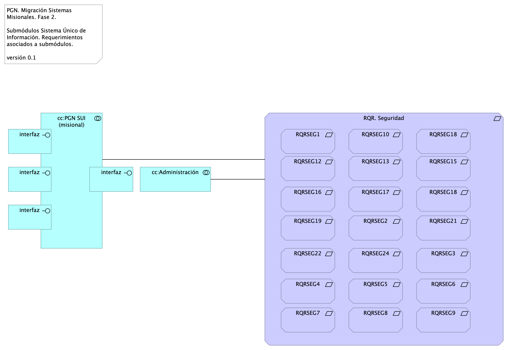{#fig:id-id-0c529bbdd5674f7b990738a9d12f0da2 width=}

_Fuente: ${4:Diagnóstico SOA. E-Service (2022).}_

 

### Catálogo de Elementos

| Tema           | Tema | Tema | Tema |
|----------------|------|------|------|
| RQR. Seguridad | Requirement | Requerimientos de seguridad, SUI, Migración, en aspectos de comunicación, autenticación, autorización y (manejo de) sesiones.  |  |
| RQRSEG1 | Requirement | 1. Las soluciones deben dar cumplimiento a las políticas institucionales del sistema de gestión de seguridad de la información establecidas por la entidad que busca garantizar la confidencialidad, integridad y disponibilidad de la información que se genera, procesa, almacena y/o transmite en los sistemas de Información de la Entidad. |  |
| RQRSEG10 | Requirement | 1. Debe incluir un mecanismo de cifrado de los datos que se transportan entre los diferentes componentes tecnológicos y los datos sensibles de la base de datos que representen un alto nivel de confidencialidad. |  |
| RQRSEG12 | Requirement | 1. Debe contemplar el cumplimiento de la normatividad vigente en cuanto a protección de datos personales y debe permitir el manejo de excepciones. |  |
| RQRSEG13 | Requirement | 1. Para los casos que aplique se debe permitir el manejo de certificados y/o firmas digitales en los documentos que así se definan para efectos de aprobación y digitalización. |  |
| RQRSEG15 | Requirement | 1. Debe funcionar sobre protocolo SSL (certificados internos de la entidad cuando los sistemas de información sean internas y certificados validos públicamente cuando los sistemas de información estén expuestas a internet). |  |
| RQRSEG16 | Requirement | 1. Debe entregar un procedimiento para el respaldo de la información de acuerdo con las necesidades de la entidad. |  |
| RQRSEG17 | Requirement | 1. Debe incluir uso de criptografía para transacciones y/o campos sensibles según lo indiquen las normas vigentes y las necesidades específicas del negocio de acuerdo como lo determine la entidad. |  |
| RQRSEG18 | Requirement |  "1. Debe contemplar un modelo de datos que garantice base de datos única para evitar que se pueda presentar duplicidad de información. " |  |
| RQRSEG18 | Requirement | 1. Debe contemplar un modelo de datos que garantice base de datos única para evitar que se pueda presentar duplicidad de información.,id-d1a6b80e7a6c4538b922f333f4d7ec7a,requirement
 RQRSEG11,"1. A nivel de la base de datos debe poder definirse reglas de validación de integridad de datos (unicidad, referencial y negocio). |  |
| RQRSEG19 | Requirement | 1. En la información confidencial solo puede ser consultada por los perfiles autorizados e igualmente restringir documentos de consulta según los privilegios o permisos asociados. |  |
| RQRSEG2 | Requirement | 1. Las soluciones de automatización de procesos a implementar deben permitir la Gestión de Seguridad de Usuarios, grupos de usuarios y asignación de Roles y perfiles de usuarios, permitiendo asociar las acciones disponibles en la solución con respecto a roles de usuario, permitiendo parametrizar las funcionalidades que cada actor puede usar en la solución. |  |
| RQRSEG21 | Requirement | 1. Debe cerrar las transacciones luego de máximo 10 minutos de inactividad. """ |  |
| RQRSEG22 | Requirement | 1. Debe incluir controles de bloqueo de cuenta después de un máximo de 5 intentos erróneos a fin de evitar ataques de fuerza bruta. |  |
| RQRSEG24 | Requirement | 1. Debe cumplir con todos los lineamientos de desarrollo seguro establecidos en The OWASP Foundation recomendados en la “Guía de desarrollo OWASP” y “OWAS Cheat Sheet |  |
| RQRSEG25 | Requirement |  "1. Debe incluir un mecanismo de cifrado de los datos que se transportan entre los diferentes componentes tecnológicos y los datos sensibles de la base de datos que representen un alto nivel de confidencialidad." |  |
| RQRSEG26 | Requirement |  "1. Para los casos que aplique se debe permitir el manejo de certificados o firmas digitales en los documentos que así se definan para efectos de aprobación y digitalización. " |  |
| RQRSEG27 | Requirement |  "1. Debe contemplar las prácticas de desarrollo seguro de aplicaciones y/o implementación segura de productos, para su naturaleza Web based. " |  |
| RQRSEG28 | Requirement |  "1. A nivel de la base de datos debe poder definirse reglas de validación de integridad de datos (unicidad, referencial y negocio). " |  |
| RQRSEG29 | Requirement |  "1. Debe evidenciar el resultado positivo frente apruebas de ethical hacking, análisis de vulnerabilidades, carga, estrés y desempeño antes de la puesta en operación de acuerdo con los lineamientos de la entidad. " |  |
| RQRSEG3 | Requirement | 1. Un usuario puede estar asociado a uno o más roles, de tal manera que los menús de navegación de la solución se muestran o despliegan dependiendo de las acciones asociadas a cada rol de usuario, permitiendo así que cuando el usuario es autenticado correctamente, la solución verifica los roles que tiene activos para otorgarle únicamente las acciones autorizadas. |  |
| RQRSEG4 | Requirement | 1. El diseño de la solución debe definir los criterios necesarios para asegurar la trazabilidad y auditoría sobre las acciones de creación, actualización, modificación o borrado de los componentes de información, de tal manera que la solución debe permitirle al administrador de la solución parametrizar las tablas y eventos que pueden auditarse. |  |
| RQRSEG5 | Requirement | 1. Las soluciones deben tener en cuenta mecanismos que aseguren el registro histórico para poder mantener la trazabilidad de las acciones realizadas por los usuarios, contemplando el registro de auditoría que contiene información de fecha y hora, identificación del registro, tabla afectada, descripción del evento, tipo de evento, usuario que realiza la acción, identificación de sesión y dirección IP del usuario que efectuó la transacción. |  |
| RQRSEG6 | Requirement | 1. La solución debe proveer una consulta que permita a un usuario con los privilegios asignados, consultar los registros de auditoría, aplicando criterios de filtro (usuario, maquina, rango de fechas y tipo de operación). |  |
| RQRSEG7 | Requirement | 1. Las soluciones deben integrarse con LDAP – (Lightweight Directory Access Protocol) para los procesos de inicio de sesión y autenticación. La solución debe soportar la integración Nativa con Active Directory de Microsoft. Para usuarios externos el mecanismo de autorización, autenticación y acceso será controlado a través del modelo de seguridad de la solución (no habrá autenticación para usuarios externos). |  |
| RQRSEG8 | Requirement | 1. Las soluciones deben cumplir con los lineamientos de seguridad relacionados a su utilización a través de redes públicas y privadas, garantizando la confidencialidad e integridad de la información y acceso a ella. |  |
| RQRSEG9 | Requirement | 1. Debe evidenciar que, a través de pruebas de vulnerabilidad, garantiza la seguridad de la información. Estas pruebas deben suministrar evidencia de que se usaron umbrales de seguridad para establecer niveles mínimos aceptables de calidad de la seguridad y de la privacidad. |  |
| cc:Administración | Application Collaboration |  |  |
| cc:PGN SUI (misional) | Application Collaboration |  |  |
| interfaz | Application Interface |  |  |
| interfaz | Application Interface |  |  |
| interfaz | Application Interface |  |  |
| interfaz | Application Interface |  |  |

Table: Elementos de la vista. {#tbl:tblelement-Seguridad.1.Requerimientos-id}

<tr class="hidden id-model undefined id-id-f3f3865c516245bfb2d777de5b23efb6 id-id-550a012b7cc7456ba096cdabbe1731fb id-id-0c529bbdd5674f7b990738a9d12f0da2">
	<td>
	<td>Association Relationship
	<td>RQR. Seguridad
	<td>cc:PGN SUI (misional)
	<td>

<tr class="hidden id-model undefined id-id-f3f3865c516245bfb2d777de5b23efb6 id-id-550a012b7cc7456ba096cdabbe1731fb id-id-0c529bbdd5674f7b990738a9d12f0da2">
	<td>
	<td>Association Relationship
	<td>RQR. Seguridad
	<td>cc:Administración
	<td>

<tr class="hidden id-model undefined id-id-0c529bbdd5674f7b990738a9d12f0da2">
	<td>
	<td>Composition Relationship
	<td>RQR. Seguridad
	<td>RQRSEG7
	<td>

<tr class="hidden id-model undefined id-id-0c529bbdd5674f7b990738a9d12f0da2">
	<td>
	<td>Composition Relationship
	<td>RQR. Seguridad
	<td>RQRSEG18
	<td>

<tr class="hidden id-model undefined id-id-0c529bbdd5674f7b990738a9d12f0da2">
	<td>
	<td>Composition Relationship
	<td>RQR. Seguridad
	<td>RQRSEG18
	<td>

<tr class="hidden id-model undefined id-id-0c529bbdd5674f7b990738a9d12f0da2">
	<td>
	<td>Composition Relationship
	<td>RQR. Seguridad
	<td>RQRSEG17
	<td>

<tr class="hidden id-model undefined id-id-0c529bbdd5674f7b990738a9d12f0da2">
	<td>
	<td>Composition Relationship
	<td>RQR. Seguridad
	<td>RQRSEG21
	<td>

<tr class="hidden id-model undefined id-id-0c529bbdd5674f7b990738a9d12f0da2">
	<td>
	<td>Composition Relationship
	<td>RQR. Seguridad
	<td>RQRSEG1
	<td>

<tr class="hidden id-model undefined id-id-0c529bbdd5674f7b990738a9d12f0da2">
	<td>
	<td>Composition Relationship
	<td>RQR. Seguridad
	<td>RQRSEG22
	<td>

<tr class="hidden id-model undefined id-id-0c529bbdd5674f7b990738a9d12f0da2">
	<td>
	<td>Composition Relationship
	<td>RQR. Seguridad
	<td>RQRSEG9
	<td>

<tr class="hidden id-model undefined id-id-0c529bbdd5674f7b990738a9d12f0da2">
	<td>
	<td>Composition Relationship
	<td>RQR. Seguridad
	<td>RQRSEG13
	<td>

<tr class="hidden id-model undefined id-id-0c529bbdd5674f7b990738a9d12f0da2">
	<td>
	<td>Composition Relationship
	<td>RQR. Seguridad
	<td>RQRSEG8
	<td>

<tr class="hidden id-model undefined id-id-0c529bbdd5674f7b990738a9d12f0da2">
	<td>
	<td>Composition Relationship
	<td>RQR. Seguridad
	<td>RQRSEG10
	<td>

<tr class="hidden id-model undefined id-id-0c529bbdd5674f7b990738a9d12f0da2">
	<td>
	<td>Composition Relationship
	<td>RQR. Seguridad
	<td>RQRSEG2
	<td>

<tr class="hidden id-model undefined id-id-0c529bbdd5674f7b990738a9d12f0da2">
	<td>
	<td>Composition Relationship
	<td>RQR. Seguridad
	<td>RQRSEG5
	<td>

<tr class="hidden id-model undefined id-id-0c529bbdd5674f7b990738a9d12f0da2">
	<td>
	<td>Composition Relationship
	<td>RQR. Seguridad
	<td>RQRSEG3
	<td>

<tr class="hidden id-model undefined id-id-0c529bbdd5674f7b990738a9d12f0da2">
	<td>
	<td>Composition Relationship
	<td>RQR. Seguridad
	<td>RQRSEG19
	<td>

<tr class="hidden id-model undefined id-id-0c529bbdd5674f7b990738a9d12f0da2">
	<td>
	<td>Composition Relationship
	<td>RQR. Seguridad
	<td>RQRSEG15
	<td>

<tr class="hidden id-model undefined id-id-0c529bbdd5674f7b990738a9d12f0da2">
	<td>
	<td>Composition Relationship
	<td>RQR. Seguridad
	<td>RQRSEG6
	<td>

<tr class="hidden id-model undefined id-id-0c529bbdd5674f7b990738a9d12f0da2">
	<td>
	<td>Composition Relationship
	<td>RQR. Seguridad
	<td>RQRSEG4
	<td>

<tr class="hidden id-model undefined id-id-0c529bbdd5674f7b990738a9d12f0da2">
	<td>
	<td>Composition Relationship
	<td>RQR. Seguridad
	<td>RQRSEG24
	<td>

<tr class="hidden id-model undefined id-id-0c529bbdd5674f7b990738a9d12f0da2">
	<td>
	<td>Composition Relationship
	<td>RQR. Seguridad
	<td>RQRSEG12
	<td>

<tr class="hidden id-model undefined id-id-0c529bbdd5674f7b990738a9d12f0da2">
	<td>
	<td>Composition Relationship
	<td>RQR. Seguridad
	<td>RQRSEG16
	<td>

<tr class="hidden id-model undefined id-id-0c529bbdd5674f7b990738a9d12f0da2">
	<td>
	<td>Composition Relationship
	<td>RQR. Seguridad
	<td>RQRSEG26
	<td>

<tr class="hidden id-model undefined id-id-0c529bbdd5674f7b990738a9d12f0da2">
	<td>
	<td>Composition Relationship
	<td>RQR. Seguridad
	<td>RQRSEG28
	<td>

<tr class="hidden id-model undefined id-id-0c529bbdd5674f7b990738a9d12f0da2">
	<td>
	<td>Composition Relationship
	<td>RQR. Seguridad
	<td>RQRSEG25
	<td>

<tr class="hidden id-model undefined id-id-0c529bbdd5674f7b990738a9d12f0da2">
	<td>
	<td>Composition Relationship
	<td>RQR. Seguridad
	<td>RQRSEG29
	<td>

<tr class="hidden id-model undefined id-id-0c529bbdd5674f7b990738a9d12f0da2">
	<td>
	<td>Composition Relationship
	<td>RQR. Seguridad
	<td>RQRSEG27
	<td>

## Seguridad. Lineabase.0.SIU applicación

2MFA

## Representación Arquitectónica
Con una arquitectura orientada a servicios SUI recopila:

1. Runtime: Es el servicio que interactúa con el usuario final (GUI) elaborado en Angular 11
1. API Tx: Servicio api rest base node encargado de realizar las transacciones básicas CRUD
1. API Config / Seguridad. Servicio Web API .Net Framework encargado de gestionar características con la autenticación y configuración

{#fig:id-id-280f63efee9b49e892eb38e7104d2d85 width=}

_Fuente: ${4:Diagnóstico SOA. E-Service (2022).}_

 

### Catálogo de Elementos

| Tema           | Tema | Tema | Tema |
|----------------|------|------|------|
| App | Application Component |  |  |
| App PGN Móvil | Application Component |  |  |
| App PGN Web | Application Component |  |  |
| Application Collaboration | Application Collaboration |  |  |
| Application Collaboration | Application Collaboration |  |  |
| Application Service (NLB) | Application Service |  |  |
| Autenticación | Business Object | Establecer mecanismos de cifrado, como el protocolo TLS ( Transport Layer Security) que permite a dos partes identificarse y autenticarse entre sí y comunicarse con confidencialidad e integridad de datos a partir de la conexión del usuario y un servidor WEB. |  |
| Balanceador | Node |  |  |
| Cifrado de Datos en tránsito | Business Object | Establecer mecanismos de cifrado, como el protocolo TLS ( Transport Layer Security) que permite a dos partes identificarse y autenticarse entre sí y comunicarse con confidencialidad e integridad de datos a partir de la conexión del usuario y un servidor WEB. |  |
| Cifrado de datos en tránsito | Business Object | Establecer mecanismos de cifrado, como el protocolo TLS ( Transport Layer Security) que permite a dos partes identificarse y autenticarse entre sí y comunicarse con confidencialidad e integridad de datos a partir de la conexión del usuario y un servidor WEB. |  |
| Communication Network (DMZ) | Communication Network |  |  |
| Communication Network (LAN) | Communication Network |  |  |
| Communication Network (internet) | Communication Network |  |  |
| Config | Application Component |  |  |
| FW BD. | Node |  |  |
| Interfaz de datos 1 | Application Service |  |  |
| Interfaz de datos 2 | Application Service |  |  |
| Network Firewall/WAF | Node |  |  |
| Punto acceso público | Application Interface | URL tipo C HTTP |  |
| Servidor BDD App | Node | Sistema Operativo Windows Server 2019 Standard o Datacenter x64. RAM	8 GB. CPU 64 Bits, 4 Cores > 2 Ghz Discos	SO C: 126 GB, Backup E: 511 GB, SQL Data F: 510 GB, SQL Log   G: 510 GB, TempDB  G: 63.6 GB.  |  |
| Servidor BDD Config | Node | Sistema Operativo Windows Server 2019 Standard o Datacenter x64. RAM	8 GB. CPU 64 Bits, 4 Cores > 2 Ghz Discos	SO C: 80 GB, Backup E: 250 GB, SQL Data F: 250 GB, SQL Log G: 250 GB, TempDB  G: 30 GB.  |  |
| Servidor Lappiz  | Node | Sistema Operativo Windows Server 2019 Standard o Datacenter x64. RAM 8 GB. CPU 64 Bits, 4 Cores > 2 Ghz Discos	SO C: 120 GB,  D: 16 GB.   |  |
| Servidor Web App | Node | Windows Server 2019 Standard o Datacenter x64. Nombre físico. IP LAN. IP Pública. Windows Server 2019 Standard or Datacenter x64. RAM	8  GB. CPU	64 Bits. 4 Cores de 2 Ghz. Discos	SO C: 126 GB. SO D: 16 GB.  |  |
| Servidor Web Canales | Node | Windows Server 2019 Standard o Datacenter x64. Nombre físico. IP LAN. IP Pública. Windows Server 2019 Standard or Datacenter x64. RAM	8  GB. CPU	64 Bits. 4 Cores de 2 Ghz. Discos	SO C: 126 GB. SO D: 16 GB.  |  |
| Sistema de Seguridad (LDAP) 1 | Node | Sistema de Seguridad (LDAP) 1. Control de acceso internet  |  |
| Sistema de Seguridad (LDAP) 2 | Node | Sistema de Seguridad (LDAP) 2. Control de acceso a datos |  |
| www pgn com | Technology Interface |  |  |

Table: Elementos de la vista. {#tbl:tblelement-Seguridad.Lineabase.0.SIUapplicación-id}

<tr class="hidden id-model undefined id-id-f3eee2e860604899903c6b48c2f76335 id-id-280f63efee9b49e892eb38e7104d2d85">
	<td>
	<td>Association Relationship
	<td>Application Collaboration
	<td>Communication Network (LAN)
	<td>

<tr class="hidden id-model undefined id-id-d1c66332737c4f8294474c4bbd0ebd52 id-id-f3eee2e860604899903c6b48c2f76335 id-id-280f63efee9b49e892eb38e7104d2d85">
	<td>
	<td>Assignment Relationship
	<td>Application Collaboration
	<td>Interfaz de datos 1
	<td>

<tr class="hidden id-model undefined id-id-d1c66332737c4f8294474c4bbd0ebd52 id-id-f3eee2e860604899903c6b48c2f76335 id-id-280f63efee9b49e892eb38e7104d2d85">
	<td>
	<td>Assignment Relationship
	<td>Application Collaboration
	<td>Interfaz de datos 2
	<td>

<tr class="hidden id-model undefined id-id-280f63efee9b49e892eb38e7104d2d85">
	<td>
	<td>Association Relationship
	<td>Interfaz de datos 1
	<td>FW BD.
	<td>

<tr class="hidden id-model undefined id-id-280f63efee9b49e892eb38e7104d2d85">
	<td>
	<td>Association Relationship
	<td>Interfaz de datos 2
	<td>FW BD.
	<td>

<tr class="hidden id-model undefined id-id-f3eee2e860604899903c6b48c2f76335 id-id-280f63efee9b49e892eb38e7104d2d85">
	<td>
	<td>Association Relationship
	<td>Application Collaboration
	<td>Communication Network (internet)
	<td>

<tr class="hidden id-model undefined id-id-d1c66332737c4f8294474c4bbd0ebd52 id-id-f3eee2e860604899903c6b48c2f76335 id-id-280f63efee9b49e892eb38e7104d2d85">
	<td>
	<td>Aggregation Relationship
	<td>Application Collaboration
	<td>App
	<td>

<tr class="hidden id-model undefined id-id-d1c66332737c4f8294474c4bbd0ebd52 id-id-f3eee2e860604899903c6b48c2f76335 id-id-280f63efee9b49e892eb38e7104d2d85">
	<td>
	<td>Aggregation Relationship
	<td>Application Collaboration
	<td>Config
	<td>

<tr class="hidden id-model undefined id-id-d1c66332737c4f8294474c4bbd0ebd52 id-id-f3eee2e860604899903c6b48c2f76335 id-id-4f2604a6793e41ce9eb978dca0209b03 id-id-ae9dc2de036e435fbcba8497224653a7 id-id-280f63efee9b49e892eb38e7104d2d85">
	<td>
	<td>Association Relationship
	<td>App
	<td>Config
	<td>

<tr class="hidden id-model undefined id-id-d1c66332737c4f8294474c4bbd0ebd52 id-id-f3eee2e860604899903c6b48c2f76335 id-id-4f2604a6793e41ce9eb978dca0209b03 id-id-ae9dc2de036e435fbcba8497224653a7 id-id-6dcada718c1446f69884dc7418828c51 id-id-280f63efee9b49e892eb38e7104d2d85">
	<td>
	<td>Association Relationship
	<td>App
	<td>Interfaz de datos 1
	<td>

<tr class="hidden id-model undefined id-id-d1c66332737c4f8294474c4bbd0ebd52 id-id-f3eee2e860604899903c6b48c2f76335 id-id-280f63efee9b49e892eb38e7104d2d85">
	<td>
	<td>Association Relationship
	<td>Config
	<td>Interfaz de datos 2
	<td>

<tr class="hidden id-model undefined id-id-f3eee2e860604899903c6b48c2f76335 id-id-ae9dc2de036e435fbcba8497224653a7 id-id-280f63efee9b49e892eb38e7104d2d85">
	<td>
	<td>Association Relationship
	<td>Config
	<td>Servidor Lappiz 
	<td>

<tr class="hidden id-model undefined id-id-f3eee2e860604899903c6b48c2f76335 id-id-280f63efee9b49e892eb38e7104d2d85">
	<td>
	<td>Aggregation Relationship
	<td>Communication Network (LAN)
	<td>Servidor BDD App
	<td>

<tr class="hidden id-model undefined id-id-f3eee2e860604899903c6b48c2f76335 id-id-280f63efee9b49e892eb38e7104d2d85">
	<td>
	<td>Aggregation Relationship
	<td>Communication Network (LAN)
	<td>Servidor BDD Config
	<td>

<tr class="hidden id-model undefined id-id-280f63efee9b49e892eb38e7104d2d85">
	<td>
	<td>Aggregation Relationship
	<td>Communication Network (LAN)
	<td>Sistema de Seguridad (LDAP) 2
	<td>

<tr class="hidden id-model undefined id-id-280f63efee9b49e892eb38e7104d2d85">
	<td>
	<td>Aggregation Relationship
	<td>Communication Network (LAN)
	<td>FW BD.
	<td>

<tr class="hidden id-model undefined id-id-280f63efee9b49e892eb38e7104d2d85">
	<td>
	<td>Association Relationship
	<td>FW BD.
	<td>Servidor BDD App
	<td>

<tr class="hidden id-model undefined id-id-280f63efee9b49e892eb38e7104d2d85">
	<td>
	<td>Association Relationship
	<td>FW BD.
	<td>Servidor BDD Config
	<td>

<tr class="hidden id-model undefined id-id-f3eee2e860604899903c6b48c2f76335 id-id-280f63efee9b49e892eb38e7104d2d85">
	<td>
	<td>Aggregation Relationship
	<td>Communication Network (internet)
	<td>Servidor Web Canales
	<td>

<tr class="hidden id-model undefined id-id-f3eee2e860604899903c6b48c2f76335 id-id-280f63efee9b49e892eb38e7104d2d85">
	<td>
	<td>Aggregation Relationship
	<td>Communication Network (internet)
	<td>Balanceador
	<td>

<tr class="hidden id-model undefined id-id-f3eee2e860604899903c6b48c2f76335 id-id-280f63efee9b49e892eb38e7104d2d85">
	<td>
	<td>Aggregation Relationship
	<td>Communication Network (internet)
	<td>Servidor Lappiz 
	<td>

<tr class="hidden id-model undefined id-id-f3eee2e860604899903c6b48c2f76335 id-id-280f63efee9b49e892eb38e7104d2d85">
	<td>
	<td>Aggregation Relationship
	<td>Communication Network (internet)
	<td>Servidor Web App
	<td>

<tr class="hidden id-model undefined id-id-f3eee2e860604899903c6b48c2f76335 id-id-280f63efee9b49e892eb38e7104d2d85">
	<td>
	<td>Association Relationship
	<td>Communication Network (internet)
	<td>Communication Network (LAN)
	<td>

<tr class="hidden id-model undefined id-id-280f63efee9b49e892eb38e7104d2d85">
	<td>
	<td>Aggregation Relationship
	<td>Communication Network (internet)
	<td>Network Firewall/WAF
	<td>

<tr class="hidden id-model undefined id-id-f3eee2e860604899903c6b48c2f76335 id-id-280f63efee9b49e892eb38e7104d2d85">
	<td>
	<td>Association Relationship
	<td>Servidor Web Canales
	<td>Balanceador
	<td>

<tr class="hidden id-model undefined id-id-280f63efee9b49e892eb38e7104d2d85">
	<td>
	<td>Association Relationship
	<td>Balanceador
	<td>Servidor Web App
	<td>

<tr class="hidden id-model undefined id-id-280f63efee9b49e892eb38e7104d2d85">
	<td>
	<td>Association Relationship
	<td>Balanceador
	<td>Servidor Lappiz 
	<td>

<tr class="hidden id-model undefined id-id-f3eee2e860604899903c6b48c2f76335 id-id-ae9dc2de036e435fbcba8497224653a7 id-id-280f63efee9b49e892eb38e7104d2d85">
	<td>
	<td>Association Relationship
	<td>Servidor Web App
	<td>App
	<td>

<tr class="hidden id-model undefined id-id-280f63efee9b49e892eb38e7104d2d85">
	<td>
	<td>Association Relationship
	<td>App PGN Web
	<td>Network Firewall/WAF
	<td>

<tr class="hidden id-model undefined id-id-d1c66332737c4f8294474c4bbd0ebd52 id-id-f3eee2e860604899903c6b48c2f76335 id-id-280f63efee9b49e892eb38e7104d2d85">
	<td>
	<td>Association Relationship
	<td>Punto acceso público
	<td>App PGN Móvil
	<td>

<tr class="hidden id-model undefined id-id-d1c66332737c4f8294474c4bbd0ebd52 id-id-f3eee2e860604899903c6b48c2f76335 id-id-280f63efee9b49e892eb38e7104d2d85">
	<td>
	<td>Association Relationship
	<td>Punto acceso público
	<td>App PGN Web
	<td>

<tr class="hidden id-model undefined id-id-280f63efee9b49e892eb38e7104d2d85">
	<td>
	<td>Association Relationship
	<td>Punto acceso público
	<td>Communication Network (DMZ)
	<td>

<tr class="hidden id-model undefined id-id-f3eee2e860604899903c6b48c2f76335 id-id-280f63efee9b49e892eb38e7104d2d85">
	<td>
	<td>Aggregation Relationship
	<td>Communication Network (DMZ)
	<td>www pgn com
	<td>

<tr class="hidden id-model undefined id-id-f3eee2e860604899903c6b48c2f76335 id-id-280f63efee9b49e892eb38e7104d2d85">
	<td>
	<td>Association Relationship
	<td>Communication Network (DMZ)
	<td>Communication Network (internet)
	<td>

<tr class="hidden id-model undefined id-id-d1c66332737c4f8294474c4bbd0ebd52 id-id-f3eee2e860604899903c6b48c2f76335 id-id-4f2604a6793e41ce9eb978dca0209b03 id-id-ae9dc2de036e435fbcba8497224653a7 id-id-6dcada718c1446f69884dc7418828c51 id-id-280f63efee9b49e892eb38e7104d2d85">
	<td>
	<td>Association Relationship
	<td>Application Service (NLB)
	<td>App PGN Web
	<td>

<tr class="hidden id-model undefined id-id-d1c66332737c4f8294474c4bbd0ebd52 id-id-f3eee2e860604899903c6b48c2f76335 id-id-4f2604a6793e41ce9eb978dca0209b03 id-id-ae9dc2de036e435fbcba8497224653a7 id-id-6dcada718c1446f69884dc7418828c51 id-id-280f63efee9b49e892eb38e7104d2d85">
	<td>
	<td>Association Relationship
	<td>Application Service (NLB)
	<td>App PGN Móvil
	<td>

<tr class="hidden id-model undefined id-id-d1c66332737c4f8294474c4bbd0ebd52 id-id-f3eee2e860604899903c6b48c2f76335 id-id-280f63efee9b49e892eb38e7104d2d85">
	<td>
	<td>Association Relationship
	<td>Application Service (NLB)
	<td>Application Collaboration
	<td>

<tr class="hidden id-model undefined id-id-280f63efee9b49e892eb38e7104d2d85">
	<td>
	<td>Association Relationship
	<td>Application Service (NLB)
	<td>Communication Network (internet)
	<td>

<tr class="hidden id-model undefined id-id-280f63efee9b49e892eb38e7104d2d85">
	<td>
	<td>Association Relationship
	<td>Sistema de Seguridad (LDAP) 1
	<td>Sistema de Seguridad (LDAP) 2
	<td>

<tr class="hidden id-model undefined id-id-280f63efee9b49e892eb38e7104d2d85">
	<td>
	<td>Association Relationship
	<td>Sistema de Seguridad (LDAP) 1
	<td>Communication Network (internet)
	<td>

<tr class="hidden id-model undefined id-id-280f63efee9b49e892eb38e7104d2d85">
	<td>
	<td>Association Relationship
	<td>Network Firewall/WAF
	<td>App PGN Móvil
	<td>

<tr class="hidden id-model undefined id-id-280f63efee9b49e892eb38e7104d2d85">
	<td>
	<td>Association Relationship
	<td>Network Firewall/WAF
	<td>Servidor Web Canales
	<td>

<tr class="hidden id-model undefined id-id-280f63efee9b49e892eb38e7104d2d85">
	<td>
	<td>Association Relationship
	<td>Network Firewall/WAF
	<td>Communication Network (DMZ)
	<td>

## Seguridad. Lineabase.1a.SIU componentes (corregida)

SSL

Dependencias de infraestructura entre los servicios que integran el modelo de aplicación de SUI, Migración. 

* Servidor de Canales (App PGN web y móvil)
* Servidor Web App (App SUI)
* Servidor Lappiz (Config SUI)
* Servidor BDD App (Transaccional)
* Servidor BDD Config (Configuración)

.png){#fig:id-id-1cf93f4f9b4e49e3af39acf22f3c2445 width=}

_Fuente: ${4:Diagnóstico SOA. E-Service (2022).}_

 

### Catálogo de Elementos

| Tema           | Tema | Tema | Tema |
|----------------|------|------|------|
| API externas | Application Service |  |  |
| Acceso Público | Device |  |  |
| Acceso Público | Device |  |  |
| Acceso Público | Device |  |  |
| App | Application Component |  |  |
| App PGN Móvil | Application Component |  |  |
| App PGN Web | Application Component |  |  |
| Application Service (NLB) | Application Service |  |  |
| Archivos Compartidos | Application Service |  |  |
| Autorizacion de usuario. | Resource |  |  |
| CDN Contenidos | Application Service |  |  |
| Config | Application Component |  |  |
| Controlador admin | Application Component |  |  |
| Controlador frontal mvl | Application Component |  |  |
| Controlador frontal web | Application Component |  |  |
| Controlador funcional | Application Component |  |  |
| Doku (gest. doc.) | Application Service |  |  |
| Identidades | Application Service |  |  |
| Infraestructura SUI | Grouping | Soporte de infraestructura a los componentes del SUI Migración. Servidores y ambientes de cómputo para la ejecución del software base de los componentes misionales del SUI de PGN.  |  |
| Interfaz de aplicación (runtime) | Application Interface |  |  |
| Interfaz de datos 1 | Application Service |  |  |
| Interfaz de datos 2 | Application Service |  |  |
| Interfaz de datos 3 | Application Service |  |  |
| Key public | Resource |  |  |
| Key public | Resource |  |  |
| Key public | Resource |  |  |
| Mensaje: JSON | Data Object |  |  |
| Modelo (neg) | Application Component |  |  |
| PGN SIU | Grouping | El objetivo principal de la arquitectura del SUI de la migración es la centralización de los conceptos misionales: concentrar los conceptos misionales en componentes aislados; dejar por fuera de estos componentes misionales todo lo distintos a la misionalidad de la PGN.  Los objetivos secundarios de esta arquitectura SUI de la migración son flexibilidad y extensibilidad. Dichos objetivos son independientes. Es decir, estos pueden ser maximizados sin conclifcto entre ellos.   |  |
| Persistencia | Application Collaboration |  |  |
| Puerto datos 1 | Application Component |  |  |
| Puerto datos 2 | Application Component |  |  |
| Scannig port | Resource |  |  |
| Seguridad | Application Component |  |  |
| Servidor BDD App | Node | Sistema Operativo Windows Server 2019 Standard o Datacenter x64. RAM	8 GB. CPU 64 Bits, 4 Cores > 2 Ghz Discos	SO C: 126 GB, Backup E: 511 GB, SQL Data F: 510 GB, SQL Log   G: 510 GB, TempDB  G: 63.6 GB.  |  |
| Servidor BDD Config | Node | Sistema Operativo Windows Server 2019 Standard o Datacenter x64. RAM	8 GB. CPU 64 Bits, 4 Cores > 2 Ghz Discos	SO C: 80 GB, Backup E: 250 GB, SQL Data F: 250 GB, SQL Log G: 250 GB, TempDB  G: 30 GB.  |  |
| Servidor Lappiz  | Node | Sistema Operativo Windows Server 2019 Standard o Datacenter x64. RAM 8 GB. CPU 64 Bits, 4 Cores > 2 Ghz Discos	SO C: 120 GB,  D: 16 GB.   |  |
| Servidor Web App | Node | Windows Server 2019 Standard o Datacenter x64. Nombre físico. IP LAN. IP Pública. Windows Server 2019 Standard or Datacenter x64. RAM	8  GB. CPU	64 Bits. 4 Cores de 2 Ghz. Discos	SO C: 126 GB. SO D: 16 GB.  |  |
| Servidor Web Canales | Node | Windows Server 2019 Standard o Datacenter x64. Nombre físico. IP LAN. IP Pública. Windows Server 2019 Standard or Datacenter x64. RAM	8  GB. CPU	64 Bits. 4 Cores de 2 Ghz. Discos	SO C: 126 GB. SO D: 16 GB.  |  |
| Sistema de Seguridad (LDAP) Control de acceso. | Node |  |  |
| Transacciones | Application Component |  |  |
| Utilitario | Application Component |  |  |
| Vista móvil | Application Component |  |  |
| Vista web | Application Component |  |  |
| WAF Web Aplication firewall | Node |  |  |
| ccccc Proveedores contenidos | Application Service |  |  |

Table: Elementos de la vista. {#tbl:tblelement-Seguridad.Lineabase.1a.SIUcomponentes(corregida)-id}

<tr class="hidden id-model undefined id-id-4f2604a6793e41ce9eb978dca0209b03 id-id-ae9dc2de036e435fbcba8497224653a7 id-id-1cf93f4f9b4e49e3af39acf22f3c2445">
	<td>
	<td>Composition Relationship
	<td>PGN SIU
	<td>Persistencia
	<td>

<tr class="hidden id-model undefined id-id-1cf93f4f9b4e49e3af39acf22f3c2445">
	<td>
	<td>Composition Relationship
	<td>PGN SIU
	<td>WAF Web Aplication firewall
	<td>

<tr class="hidden id-model undefined id-id-4f2604a6793e41ce9eb978dca0209b03 id-id-6dcada718c1446f69884dc7418828c51 id-id-1cf93f4f9b4e49e3af39acf22f3c2445">
	<td>
	<td>Composition Relationship
	<td>PGN SIU
	<td>Interfaz de datos 1
	<td>

<tr class="hidden id-model undefined id-id-4f2604a6793e41ce9eb978dca0209b03 id-id-1cf93f4f9b4e49e3af39acf22f3c2445">
	<td>
	<td>Composition Relationship
	<td>PGN SIU
	<td>Interfaz de datos 2
	<td>

<tr class="hidden id-model undefined id-id-4f2604a6793e41ce9eb978dca0209b03 id-id-1cf93f4f9b4e49e3af39acf22f3c2445">
	<td>
	<td>Composition Relationship
	<td>PGN SIU
	<td>Interfaz de datos 3
	<td>

<tr class="hidden id-model undefined id-id-4f2604a6793e41ce9eb978dca0209b03 id-id-1cf93f4f9b4e49e3af39acf22f3c2445">
	<td>
	<td>Composition Relationship
	<td>PGN SIU
	<td>Config
	<td>

<tr class="hidden id-model undefined id-id-4f2604a6793e41ce9eb978dca0209b03 id-id-6dcada718c1446f69884dc7418828c51 id-id-1cf93f4f9b4e49e3af39acf22f3c2445">
	<td>
	<td>Composition Relationship
	<td>PGN SIU
	<td>App
	<td>

<tr class="hidden id-model undefined id-id-1cf93f4f9b4e49e3af39acf22f3c2445">
	<td>
	<td>Composition Relationship
	<td>PGN SIU
	<td>Key public
	<td>

<tr class="hidden id-model undefined id-id-1cf93f4f9b4e49e3af39acf22f3c2445">
	<td>
	<td>Composition Relationship
	<td>PGN SIU
	<td>Key public
	<td>

<tr class="hidden id-model undefined id-id-1cf93f4f9b4e49e3af39acf22f3c2445">
	<td>
	<td>Composition Relationship
	<td>PGN SIU
	<td>Key public
	<td>

<tr class="hidden id-model undefined id-id-1cf93f4f9b4e49e3af39acf22f3c2445">
	<td>
	<td>Composition Relationship
	<td>PGN SIU
	<td>Acceso Público
	<td>

<tr class="hidden id-model undefined id-id-1cf93f4f9b4e49e3af39acf22f3c2445">
	<td>
	<td>Composition Relationship
	<td>PGN SIU
	<td>Acceso Público
	<td>

<tr class="hidden id-model undefined id-id-1cf93f4f9b4e49e3af39acf22f3c2445">
	<td>
	<td>Composition Relationship
	<td>PGN SIU
	<td>Acceso Público
	<td>

<tr class="hidden id-model undefined id-id-1cf93f4f9b4e49e3af39acf22f3c2445">
	<td>
	<td>Composition Relationship
	<td>PGN SIU
	<td>Autorizacion de usuario.
	<td>

<tr class="hidden id-model undefined id-id-1cf93f4f9b4e49e3af39acf22f3c2445">
	<td>
	<td>Association Relationship
	<td>PGN SIU
	<td>Autorizacion de usuario.
	<td>

<tr class="hidden id-model undefined id-id-4f2604a6793e41ce9eb978dca0209b03 id-id-1cf93f4f9b4e49e3af39acf22f3c2445">
	<td>
	<td>Composition Relationship
	<td>PGN SIU
	<td>App PGN Móvil
	<td>

<tr class="hidden id-model undefined id-id-4f2604a6793e41ce9eb978dca0209b03 id-id-ae9dc2de036e435fbcba8497224653a7 id-id-1cf93f4f9b4e49e3af39acf22f3c2445">
	<td>
	<td>Aggregation Relationship
	<td>Persistencia
	<td>Transacciones
	<td>

<tr class="hidden id-model undefined id-id-4f2604a6793e41ce9eb978dca0209b03 id-id-ae9dc2de036e435fbcba8497224653a7 id-id-1cf93f4f9b4e49e3af39acf22f3c2445">
	<td>
	<td>Aggregation Relationship
	<td>Persistencia
	<td>Seguridad
	<td>

<tr class="hidden id-model undefined id-id-4f2604a6793e41ce9eb978dca0209b03 id-id-ae9dc2de036e435fbcba8497224653a7 id-id-1cf93f4f9b4e49e3af39acf22f3c2445">
	<td>
	<td>Aggregation Relationship
	<td>Persistencia
	<td>Utilitario
	<td>

<tr class="hidden id-model undefined id-id-1cf93f4f9b4e49e3af39acf22f3c2445">
	<td>
	<td>Association Relationship
	<td>WAF Web Aplication firewall
	<td>Interfaz de aplicación (runtime)
	<td>

<tr class="hidden id-model undefined id-id-4f2604a6793e41ce9eb978dca0209b03 id-id-ae9dc2de036e435fbcba8497224653a7 id-id-1cf93f4f9b4e49e3af39acf22f3c2445">
	<td>
	<td>Association Relationship
	<td>Interfaz de datos 1
	<td>Transacciones
	<td>

<tr class="hidden id-model undefined id-id-4f2604a6793e41ce9eb978dca0209b03 id-id-ae9dc2de036e435fbcba8497224653a7 id-id-1cf93f4f9b4e49e3af39acf22f3c2445">
	<td>
	<td>Association Relationship
	<td>Interfaz de datos 2
	<td>Seguridad
	<td>

<tr class="hidden id-model undefined id-id-4f2604a6793e41ce9eb978dca0209b03 id-id-ae9dc2de036e435fbcba8497224653a7 id-id-1cf93f4f9b4e49e3af39acf22f3c2445">
	<td>
	<td>Association Relationship
	<td>Interfaz de datos 3
	<td>Utilitario
	<td>

<tr class="hidden id-model undefined id-id-4f2604a6793e41ce9eb978dca0209b03 id-id-ae9dc2de036e435fbcba8497224653a7 id-id-6dcada718c1446f69884dc7418828c51 id-id-1cf93f4f9b4e49e3af39acf22f3c2445">
	<td>
	<td>Composition Relationship
	<td>Config
	<td>Modelo (neg)
	<td>

<tr class="hidden id-model undefined id-id-4f2604a6793e41ce9eb978dca0209b03 id-id-ae9dc2de036e435fbcba8497224653a7 id-id-6dcada718c1446f69884dc7418828c51 id-id-1cf93f4f9b4e49e3af39acf22f3c2445">
	<td>
	<td>Composition Relationship
	<td>Config
	<td>Controlador admin
	<td>

<tr class="hidden id-model undefined id-id-4f2604a6793e41ce9eb978dca0209b03 id-id-ae9dc2de036e435fbcba8497224653a7 id-id-6dcada718c1446f69884dc7418828c51 id-id-1cf93f4f9b4e49e3af39acf22f3c2445">
	<td>
	<td>Composition Relationship
	<td>Config
	<td>Puerto datos 2
	<td>

<tr class="hidden id-model undefined id-id-4f2604a6793e41ce9eb978dca0209b03 id-id-ae9dc2de036e435fbcba8497224653a7 id-id-6dcada718c1446f69884dc7418828c51 id-id-1cf93f4f9b4e49e3af39acf22f3c2445">
	<td>
	<td>Association Relationship
	<td>Config
	<td>Interfaz de datos 3
	<td>

<tr class="hidden id-model undefined id-id-f3eee2e860604899903c6b48c2f76335 id-id-ae9dc2de036e435fbcba8497224653a7 id-id-280f63efee9b49e892eb38e7104d2d85 id-id-1cf93f4f9b4e49e3af39acf22f3c2445">
	<td>
	<td>Association Relationship
	<td>Config
	<td>Servidor Lappiz 
	<td>

<tr class="hidden id-model undefined id-id-1cf93f4f9b4e49e3af39acf22f3c2445">
	<td>
	<td>Association Relationship
	<td>Config
	<td>WAF Web Aplication firewall
	<td>

<tr class="hidden id-model undefined id-id-4f2604a6793e41ce9eb978dca0209b03 id-id-ae9dc2de036e435fbcba8497224653a7 id-id-6dcada718c1446f69884dc7418828c51 id-id-1cf93f4f9b4e49e3af39acf22f3c2445">
	<td>
	<td>Association Relationship
	<td>Modelo (neg)
	<td>Interfaz de datos 2
	<td>

<tr class="hidden id-model undefined id-id-4f2604a6793e41ce9eb978dca0209b03 id-id-ae9dc2de036e435fbcba8497224653a7 id-id-6dcada718c1446f69884dc7418828c51 id-id-1cf93f4f9b4e49e3af39acf22f3c2445">
	<td>
	<td>Composition Relationship
	<td>App
	<td>Puerto datos 1
	<td>

<tr class="hidden id-model undefined id-id-4f2604a6793e41ce9eb978dca0209b03 id-id-ae9dc2de036e435fbcba8497224653a7 id-id-6dcada718c1446f69884dc7418828c51 id-id-1cf93f4f9b4e49e3af39acf22f3c2445">
	<td>
	<td>Composition Relationship
	<td>App
	<td>Controlador funcional
	<td>

<tr class="hidden id-model undefined id-id-d1c66332737c4f8294474c4bbd0ebd52 id-id-f3eee2e860604899903c6b48c2f76335 id-id-4f2604a6793e41ce9eb978dca0209b03 id-id-ae9dc2de036e435fbcba8497224653a7 id-id-6dcada718c1446f69884dc7418828c51 id-id-280f63efee9b49e892eb38e7104d2d85 id-id-1cf93f4f9b4e49e3af39acf22f3c2445">
	<td>
	<td>Association Relationship
	<td>App
	<td>Interfaz de datos 1
	<td>

<tr class="hidden id-model undefined id-id-d1c66332737c4f8294474c4bbd0ebd52 id-id-f3eee2e860604899903c6b48c2f76335 id-id-4f2604a6793e41ce9eb978dca0209b03 id-id-ae9dc2de036e435fbcba8497224653a7 id-id-280f63efee9b49e892eb38e7104d2d85 id-id-1cf93f4f9b4e49e3af39acf22f3c2445">
	<td>
	<td>Association Relationship
	<td>App
	<td>Config
	<td>

<tr class="hidden id-model undefined id-id-1cf93f4f9b4e49e3af39acf22f3c2445">
	<td>
	<td>Association Relationship
	<td>App
	<td>WAF Web Aplication firewall
	<td>

<tr class="hidden id-model undefined id-id-1cf93f4f9b4e49e3af39acf22f3c2445">
	<td>
	<td>Association Relationship
	<td>Acceso Público
	<td>Transacciones
	<td>

<tr class="hidden id-model undefined id-id-1cf93f4f9b4e49e3af39acf22f3c2445">
	<td>
	<td>Association Relationship
	<td>Acceso Público
	<td>Seguridad
	<td>

<tr class="hidden id-model undefined id-id-1cf93f4f9b4e49e3af39acf22f3c2445">
	<td>
	<td>Association Relationship
	<td>Acceso Público
	<td>Utilitario
	<td>

<tr class="hidden id-model undefined id-id-1cf93f4f9b4e49e3af39acf22f3c2445">
	<td>
	<td>Association Relationship
	<td>Autorizacion de usuario.
	<td>Acceso Público
	<td>

<tr class="hidden id-model undefined id-id-1cf93f4f9b4e49e3af39acf22f3c2445">
	<td>
	<td>Association Relationship
	<td>Autorizacion de usuario.
	<td>Acceso Público
	<td>

<tr class="hidden id-model undefined id-id-1cf93f4f9b4e49e3af39acf22f3c2445">
	<td>
	<td>Association Relationship
	<td>Autorizacion de usuario.
	<td>Acceso Público
	<td>

<tr class="hidden id-model undefined id-id-4f2604a6793e41ce9eb978dca0209b03 id-id-ae9dc2de036e435fbcba8497224653a7 id-id-6dcada718c1446f69884dc7418828c51 id-id-1cf93f4f9b4e49e3af39acf22f3c2445">
	<td>
	<td>Composition Relationship
	<td>App PGN Móvil
	<td>Controlador frontal mvl
	<td>

<tr class="hidden id-model undefined id-id-4f2604a6793e41ce9eb978dca0209b03 id-id-ae9dc2de036e435fbcba8497224653a7 id-id-6dcada718c1446f69884dc7418828c51 id-id-1cf93f4f9b4e49e3af39acf22f3c2445">
	<td>
	<td>Composition Relationship
	<td>App PGN Móvil
	<td>Vista móvil
	<td>

<tr class="hidden id-model undefined id-id-4f2604a6793e41ce9eb978dca0209b03 id-id-ae9dc2de036e435fbcba8497224653a7 id-id-1cf93f4f9b4e49e3af39acf22f3c2445">
	<td>
	<td>Association Relationship
	<td>App PGN Móvil
	<td>Interfaz de aplicación (runtime)
	<td>

<tr class="hidden id-model undefined id-id-1cf93f4f9b4e49e3af39acf22f3c2445">
	<td>
	<td>Composition Relationship
	<td>Infraestructura SUI
	<td>Servidor BDD Config
	<td>

<tr class="hidden id-model undefined id-id-1cf93f4f9b4e49e3af39acf22f3c2445">
	<td>
	<td>Composition Relationship
	<td>Infraestructura SUI
	<td>Servidor BDD App
	<td>

<tr class="hidden id-model undefined id-id-1cf93f4f9b4e49e3af39acf22f3c2445">
	<td>
	<td>Composition Relationship
	<td>Infraestructura SUI
	<td>Servidor Lappiz 
	<td>

<tr class="hidden id-model undefined id-id-1cf93f4f9b4e49e3af39acf22f3c2445">
	<td>
	<td>Composition Relationship
	<td>Infraestructura SUI
	<td>Servidor Web App
	<td>

<tr class="hidden id-model undefined id-id-1cf93f4f9b4e49e3af39acf22f3c2445">
	<td>
	<td>Composition Relationship
	<td>Infraestructura SUI
	<td>Sistema de Seguridad (LDAP) Control de acceso.
	<td>

<tr class="hidden id-model undefined id-id-f3eee2e860604899903c6b48c2f76335 id-id-ae9dc2de036e435fbcba8497224653a7 id-id-280f63efee9b49e892eb38e7104d2d85 id-id-1cf93f4f9b4e49e3af39acf22f3c2445">
	<td>
	<td>Association Relationship
	<td>Servidor Web App
	<td>App
	<td>

<tr class="hidden id-model undefined id-id-1cf93f4f9b4e49e3af39acf22f3c2445">
	<td>
	<td>Assignment Relationship
	<td>Scannig port
	<td>Infraestructura SUI
	<td>

<tr class="hidden id-model undefined id-id-1cf93f4f9b4e49e3af39acf22f3c2445">
	<td>
	<td>Association Relationship
	<td>Sistema de Seguridad (LDAP) Control de acceso.
	<td>Servidor BDD App
	<td>

<tr class="hidden id-model undefined id-id-1cf93f4f9b4e49e3af39acf22f3c2445">
	<td>
	<td>Association Relationship
	<td>Sistema de Seguridad (LDAP) Control de acceso.
	<td>Servidor Lappiz 
	<td>

<tr class="hidden id-model undefined id-id-1cf93f4f9b4e49e3af39acf22f3c2445">
	<td>
	<td>Association Relationship
	<td>Sistema de Seguridad (LDAP) Control de acceso.
	<td>Servidor Web App
	<td>

<tr class="hidden id-model undefined id-id-4f2604a6793e41ce9eb978dca0209b03 id-id-ae9dc2de036e435fbcba8497224653a7 id-id-6dcada718c1446f69884dc7418828c51 id-id-1cf93f4f9b4e49e3af39acf22f3c2445">
	<td>
	<td>Composition Relationship
	<td>App PGN Web
	<td>Controlador frontal web
	<td>

<tr class="hidden id-model undefined id-id-4f2604a6793e41ce9eb978dca0209b03 id-id-ae9dc2de036e435fbcba8497224653a7 id-id-6dcada718c1446f69884dc7418828c51 id-id-1cf93f4f9b4e49e3af39acf22f3c2445">
	<td>
	<td>Composition Relationship
	<td>App PGN Web
	<td>Vista web
	<td>

<tr class="hidden id-model undefined id-id-4f2604a6793e41ce9eb978dca0209b03 id-id-ae9dc2de036e435fbcba8497224653a7 id-id-1cf93f4f9b4e49e3af39acf22f3c2445">
	<td>
	<td>Association Relationship
	<td>App PGN Web
	<td>Interfaz de aplicación (runtime)
	<td>

<tr class="hidden id-model undefined id-id-4f2604a6793e41ce9eb978dca0209b03 id-id-ae9dc2de036e435fbcba8497224653a7 id-id-6dcada718c1446f69884dc7418828c51 id-id-1cf93f4f9b4e49e3af39acf22f3c2445">
	<td>
	<td>Access Relationship
	<td>Interfaz de aplicación (runtime)
	<td>Mensaje: JSON
	<td>

<tr class="hidden id-model undefined id-id-d1c66332737c4f8294474c4bbd0ebd52 id-id-f3eee2e860604899903c6b48c2f76335 id-id-4f2604a6793e41ce9eb978dca0209b03 id-id-ae9dc2de036e435fbcba8497224653a7 id-id-6dcada718c1446f69884dc7418828c51 id-id-280f63efee9b49e892eb38e7104d2d85 id-id-1cf93f4f9b4e49e3af39acf22f3c2445">
	<td>
	<td>Association Relationship
	<td>Application Service (NLB)
	<td>App PGN Web
	<td>

<tr class="hidden id-model undefined id-id-d1c66332737c4f8294474c4bbd0ebd52 id-id-f3eee2e860604899903c6b48c2f76335 id-id-4f2604a6793e41ce9eb978dca0209b03 id-id-ae9dc2de036e435fbcba8497224653a7 id-id-6dcada718c1446f69884dc7418828c51 id-id-280f63efee9b49e892eb38e7104d2d85 id-id-1cf93f4f9b4e49e3af39acf22f3c2445">
	<td>
	<td>Association Relationship
	<td>Application Service (NLB)
	<td>App PGN Móvil
	<td>

<tr class="hidden id-model undefined id-id-ae9dc2de036e435fbcba8497224653a7 id-id-1cf93f4f9b4e49e3af39acf22f3c2445">
	<td>
	<td>Association Relationship
	<td>Servidor Web Canales
	<td>App PGN Web
	<td>

<tr class="hidden id-model undefined id-id-ae9dc2de036e435fbcba8497224653a7 id-id-1cf93f4f9b4e49e3af39acf22f3c2445">
	<td>
	<td>Association Relationship
	<td>Servidor Web Canales
	<td>App PGN Móvil
	<td>

## Seguridad. Lineabase.1a.SIU componentes (eliminar)

HTTPS

Dependencias de infraestructura entre los servicios que integran el modelo de aplicación de SUI, Migración. 

* Servidor de Canales (App PGN web y móvil)
* Servidor Web App (App SUI)
* Servidor Lappiz (Config SUI)
* Servidor BDD App (Transaccional)
* Servidor BDD Config (Configuración)

.png){#fig:id-id-502dd8179b984af2a2c655cee948fefc width=}

_Fuente: ${4:Diagnóstico SOA. E-Service (2022).}_

 

### Catálogo de Elementos

| Tema           | Tema | Tema | Tema |
|----------------|------|------|------|
| API externas | Application Service |  |  |
| Acceso publico | Device |  |  |
| Acceso publico | Device |  |  |
| Acceso publico | Device |  |  |
| Application Service (NLB) | Application Service |  |  |
| Archivos Compartidos | Application Service |  |  |
| Autorizacion de usuario. | Resource |  |  |
| CDN Contenidos | Application Service |  |  |
| Doku (gest. doc.) | Application Service |  |  |
| Grouping | Grouping |  |  |
| Identidades | Application Service |  |  |
| Interfaz de aplicación (runtime) | Application Interface |  |  |
| Interfaz de datos 1 | Application Service |  |  |
| Interfaz de datos 2 | Application Service |  |  |
| Interfaz de datos 3 | Application Service |  |  |
| Key public | Resource |  |  |
| Key public (copy) | Resource |  |  |
| Key public (copy) | Resource |  |  |
| Key public (copy) (copy) | Resource |  |  |
| Key public (copy) (copy) | Resource |  |  |
| Key public (copy) (copy) (copy) | Resource |  |  |
| Mensaje: JSON | Data Object |  |  |
| Modelo (neg) | Application Component |  |  |
| PGN SIU | Grouping | El objetivo principal de la arquitectura del SUI de la migración es la centralización de los conceptos misionales: concentrar los conceptos misionales en componentes aislados; dejar por fuera de estos componentes misionales todo lo distintos a la misionalidad de la PGN.  Los objetivos secundarios de esta arquitectura SUI de la migración son flexibilidad y extensibilidad. Dichos objetivos son independientes. Es decir, estos pueden ser maximizados sin conclifcto entre ellos.   |  |
| Persistencia | Application Collaboration |  |  |
| Puerto datos 1 | Application Component |  |  |
| Puerto datos 2 | Application Component |  |  |
| Scanning Ports | Resource |  |  |
| Scanning Ports (copy) | Resource |  |  |
| Seguridad | Application Component |  |  |
| Servidor BDD App | Node |  |  |
| Servidor BDD Config | Node |  |  |
| Servidor Lappiz  | Node | Sistema Operativo Windows Server 2019 Standard o Datacenter x64. RAM 8 GB. CPU 64 Bits, 4 Cores > 2 Ghz Discos	SO C: 120 GB,  D: 16 GB.   |  |
| Servidor Web Canales | Node | Nombre físico IP LAN IP Pública  |  |
| Sistema de Seguridad (LDAP) Control de acceso. | Node |  |  |
| Transacciones | Application Component |  |  |
| Utilitario | Application Component |  |  |
| WAF Web application firewall | Node |  |  |
| WAF Web application firewall (copy) | Node |  |  |
| ccccc Proveedores contenidos | Application Service |  |  |
| copia.Controlador admin | Application Component |  |  |
| copia.Controlador funcional | Application Component |  |  |
| eliminar..App | Application Component |  |  |
| eliminar..Config | Application Component |  |  |
| eliminar.Servidor Web App | Node |  |  |

Table: Elementos de la vista. {#tbl:tblelement-Seguridad.Lineabase.1a.SIUcomponentes(eliminar)-id}

<tr class="hidden id-model undefined id-id-502dd8179b984af2a2c655cee948fefc">
	<td>
	<td>Composition Relationship
	<td>PGN SIU
	<td>Application Service (NLB)
	<td>

<tr class="hidden id-model undefined id-id-502dd8179b984af2a2c655cee948fefc">
	<td>
	<td>Composition Relationship
	<td>PGN SIU
	<td>Persistencia
	<td>

<tr class="hidden id-model undefined id-id-502dd8179b984af2a2c655cee948fefc">
	<td>
	<td>Composition Relationship
	<td>PGN SIU
	<td>Interfaz de aplicación (runtime)
	<td>

<tr class="hidden id-model undefined id-id-502dd8179b984af2a2c655cee948fefc">
	<td>
	<td>Composition Relationship
	<td>PGN SIU
	<td>Acceso publico
	<td>

<tr class="hidden id-model undefined id-id-502dd8179b984af2a2c655cee948fefc">
	<td>
	<td>Composition Relationship
	<td>PGN SIU
	<td>WAF Web application firewall
	<td>

<tr class="hidden id-model undefined id-id-502dd8179b984af2a2c655cee948fefc">
	<td>
	<td>Composition Relationship
	<td>PGN SIU
	<td>Key public
	<td>

<tr class="hidden id-model undefined id-id-502dd8179b984af2a2c655cee948fefc">
	<td>
	<td>Composition Relationship
	<td>PGN SIU
	<td>Autorizacion de usuario.
	<td>

<tr class="hidden id-model undefined id-id-502dd8179b984af2a2c655cee948fefc">
	<td>
	<td>Composition Relationship
	<td>PGN SIU
	<td>Acceso publico
	<td>

<tr class="hidden id-model undefined id-id-502dd8179b984af2a2c655cee948fefc">
	<td>
	<td>Composition Relationship
	<td>PGN SIU
	<td>Key public (copy) (copy)
	<td>

<tr class="hidden id-model undefined id-id-502dd8179b984af2a2c655cee948fefc">
	<td>
	<td>Aggregation Relationship
	<td>Persistencia
	<td>Transacciones
	<td>

<tr class="hidden id-model undefined id-id-502dd8179b984af2a2c655cee948fefc">
	<td>
	<td>Aggregation Relationship
	<td>Persistencia
	<td>Utilitario
	<td>

<tr class="hidden id-model undefined id-id-502dd8179b984af2a2c655cee948fefc">
	<td>
	<td>Aggregation Relationship
	<td>Persistencia
	<td>Seguridad
	<td>

<tr class="hidden id-model undefined id-id-502dd8179b984af2a2c655cee948fefc">
	<td>
	<td>Association Relationship
	<td>Application Service (NLB)
	<td>WAF Web application firewall
	<td>

<tr class="hidden id-model undefined id-id-502dd8179b984af2a2c655cee948fefc">
	<td>
	<td>Association Relationship
	<td>Application Service (NLB)
	<td>Interfaz de aplicación (runtime)
	<td>

<tr class="hidden id-model undefined id-id-502dd8179b984af2a2c655cee948fefc">
	<td>
	<td>Association Relationship
	<td>Interfaz de aplicación (runtime)
	<td>PGN SIU
	<td>

<tr class="hidden id-model undefined id-id-502dd8179b984af2a2c655cee948fefc">
	<td>
	<td>Access Relationship
	<td>Interfaz de aplicación (runtime)
	<td>Mensaje: JSON
	<td>

<tr class="hidden id-model undefined id-id-502dd8179b984af2a2c655cee948fefc">
	<td>
	<td>Association Relationship
	<td>WAF Web application firewall
	<td>eliminar..Config
	<td>

<tr class="hidden id-model undefined id-id-502dd8179b984af2a2c655cee948fefc">
	<td>
	<td>Association Relationship
	<td>WAF Web application firewall
	<td>PGN SIU
	<td>

<tr class="hidden id-model undefined id-id-502dd8179b984af2a2c655cee948fefc">
	<td>
	<td>Association Relationship
	<td>WAF Web application firewall
	<td>eliminar..App
	<td>

<tr class="hidden id-model undefined id-id-502dd8179b984af2a2c655cee948fefc">
	<td>
	<td>Association Relationship
	<td>Acceso publico
	<td>Transacciones
	<td>

<tr class="hidden id-model undefined id-id-502dd8179b984af2a2c655cee948fefc">
	<td>
	<td>Association Relationship
	<td>Acceso publico
	<td>Utilitario
	<td>

<tr class="hidden id-model undefined id-id-502dd8179b984af2a2c655cee948fefc">
	<td>
	<td>Association Relationship
	<td>Acceso publico
	<td>Seguridad
	<td>

<tr class="hidden id-model undefined id-id-502dd8179b984af2a2c655cee948fefc">
	<td>
	<td>Association Relationship
	<td>Autorizacion de usuario.
	<td>Acceso publico
	<td>

<tr class="hidden id-model undefined id-id-502dd8179b984af2a2c655cee948fefc">
	<td>
	<td>Association Relationship
	<td>Autorizacion de usuario.
	<td>Acceso publico
	<td>

<tr class="hidden id-model undefined id-id-502dd8179b984af2a2c655cee948fefc">
	<td>
	<td>Association Relationship
	<td>Autorizacion de usuario.
	<td>Acceso publico
	<td>

<tr class="hidden id-model undefined id-id-502dd8179b984af2a2c655cee948fefc">
	<td>
	<td>Composition Relationship
	<td>Grouping
	<td>Servidor BDD Config
	<td>

<tr class="hidden id-model undefined id-id-502dd8179b984af2a2c655cee948fefc">
	<td>
	<td>Composition Relationship
	<td>Grouping
	<td>eliminar.Servidor Web App
	<td>

<tr class="hidden id-model undefined id-id-502dd8179b984af2a2c655cee948fefc">
	<td>
	<td>Composition Relationship
	<td>Grouping
	<td>Sistema de Seguridad (LDAP) Control de acceso.
	<td>

<tr class="hidden id-model undefined id-id-502dd8179b984af2a2c655cee948fefc">
	<td>
	<td>Composition Relationship
	<td>Grouping
	<td>Servidor BDD App
	<td>

<tr class="hidden id-model undefined id-id-502dd8179b984af2a2c655cee948fefc">
	<td>
	<td>Composition Relationship
	<td>Grouping
	<td>Servidor Lappiz 
	<td>

<tr class="hidden id-model undefined id-id-502dd8179b984af2a2c655cee948fefc">
	<td>
	<td>Association Relationship
	<td>Sistema de Seguridad (LDAP) Control de acceso.
	<td>Servidor BDD App
	<td>

<tr class="hidden id-model undefined id-id-502dd8179b984af2a2c655cee948fefc">
	<td>
	<td>Association Relationship
	<td>Sistema de Seguridad (LDAP) Control de acceso.
	<td>eliminar.Servidor Web App
	<td>

<tr class="hidden id-model undefined id-id-502dd8179b984af2a2c655cee948fefc">
	<td>
	<td>Association Relationship
	<td>Sistema de Seguridad (LDAP) Control de acceso.
	<td>Servidor BDD Config
	<td>

<tr class="hidden id-model undefined id-id-502dd8179b984af2a2c655cee948fefc">
	<td>
	<td>Association Relationship
	<td>Sistema de Seguridad (LDAP) Control de acceso.
	<td>Servidor Lappiz 
	<td>

<tr class="hidden id-model undefined id-id-502dd8179b984af2a2c655cee948fefc">
	<td>
	<td>Association Relationship
	<td>eliminar.Servidor Web App
	<td>eliminar..App
	<td>

<tr class="hidden id-model undefined id-id-502dd8179b984af2a2c655cee948fefc">
	<td>
	<td>Association Relationship
	<td>eliminar..App
	<td>eliminar..Config
	<td>

<tr class="hidden id-model undefined id-id-502dd8179b984af2a2c655cee948fefc">
	<td>
	<td>Association Relationship
	<td>eliminar..App
	<td>Interfaz de datos 1
	<td>

<tr class="hidden id-model undefined id-id-502dd8179b984af2a2c655cee948fefc">
	<td>
	<td>Composition Relationship
	<td>eliminar..App
	<td>copia.Controlador funcional
	<td>

<tr class="hidden id-model undefined id-id-502dd8179b984af2a2c655cee948fefc">
	<td>
	<td>Composition Relationship
	<td>eliminar..App
	<td>Puerto datos 1
	<td>

<tr class="hidden id-model undefined id-id-502dd8179b984af2a2c655cee948fefc">
	<td>
	<td>Association Relationship
	<td>copia.Controlador funcional
	<td>Scanning Ports
	<td>

<tr class="hidden id-model undefined id-id-502dd8179b984af2a2c655cee948fefc">
	<td>
	<td>Composition Relationship
	<td>eliminar..Config
	<td>Puerto datos 2
	<td>

<tr class="hidden id-model undefined id-id-502dd8179b984af2a2c655cee948fefc">
	<td>
	<td>Association Relationship
	<td>eliminar..Config
	<td>Interfaz de datos 3
	<td>

<tr class="hidden id-model undefined id-id-502dd8179b984af2a2c655cee948fefc">
	<td>
	<td>Composition Relationship
	<td>eliminar..Config
	<td>Modelo (neg)
	<td>

<tr class="hidden id-model undefined id-id-502dd8179b984af2a2c655cee948fefc">
	<td>
	<td>Composition Relationship
	<td>eliminar..Config
	<td>copia.Controlador admin
	<td>

<tr class="hidden id-model undefined id-id-502dd8179b984af2a2c655cee948fefc">
	<td>
	<td>Association Relationship
	<td>eliminar..Config
	<td>Servidor Lappiz 
	<td>

<tr class="hidden id-model undefined id-id-502dd8179b984af2a2c655cee948fefc">
	<td>
	<td>Association Relationship
	<td>Modelo (neg)
	<td>Interfaz de datos 2
	<td>

<tr class="hidden id-model undefined id-id-502dd8179b984af2a2c655cee948fefc">
	<td>
	<td>Association Relationship
	<td>Interfaz de datos 1
	<td>Transacciones
	<td>

<tr class="hidden id-model undefined id-id-502dd8179b984af2a2c655cee948fefc">
	<td>
	<td>Association Relationship
	<td>Interfaz de datos 3
	<td>Utilitario
	<td>

<tr class="hidden id-model undefined id-id-502dd8179b984af2a2c655cee948fefc">
	<td>
	<td>Association Relationship
	<td>Interfaz de datos 2
	<td>Seguridad
	<td>

<tr class="hidden id-model undefined id-id-502dd8179b984af2a2c655cee948fefc">
	<td>
	<td>Association Relationship
	<td>Scanning Ports
	<td>Servidor Lappiz 
	<td>

## Seguridad. Linebase.2.Portal

° P2: Servicio de adinistración de identidades y acceso basado en la nube de Microsoft.

El portal es el conjunto de los elementos físicos y lógicos necesarios para la implementación de la granja de servidores de SharePoint Server 2019 para el portal de la PROCURADURIA.

* Servidores Web Front End
* Servidores de Aplicaciones
* Servidores de SQL Server

{#fig:id-id-5b47de95cd3f49d6b7dc05471bcc503a width=}

_Fuente: ${4:Diagnóstico SOA. E-Service (2022).}_

 

### Catálogo de Elementos

| Tema           | Tema | Tema | Tema |
|----------------|------|------|------|
| Application Collaboration Sharepoint | Application Collaboration |  |  |
| Application Interface | Application Interface |  |  |
| Directivas de Aplicaciones. | Application Component |  |  |
| Directivas de acceso. | Application Component |  |  |
| Directivas de proteccion de aplicaciones. | Application Component |  |  |
| Directivas de riesgos de protección. * | Application Component |  |  |
| Requiere MFA * | Application Component |  |  |
| Requiere inicio de sesión. | Application Component |  |  |
| Servidor aplicaciones Sharepoint | Application Component |  |  |
| Servidor datos Sharepoint | Application Component |  |  |
| Servidor web Sharepoint | Application Component |  |  |

Table: Elementos de la vista. {#tbl:tblelement-Seguridad.Linebase.2.Portal-id}

<tr class="hidden id-model undefined id-id-64947c69f63c422e9f18c81763910332 id-id-5b47de95cd3f49d6b7dc05471bcc503a">
	<td>
	<td>Aggregation Relationship
	<td>Application Collaboration Sharepoint
	<td>Servidor web Sharepoint
	<td>

<tr class="hidden id-model undefined id-id-64947c69f63c422e9f18c81763910332 id-id-5b47de95cd3f49d6b7dc05471bcc503a">
	<td>
	<td>Aggregation Relationship
	<td>Application Collaboration Sharepoint
	<td>Servidor aplicaciones Sharepoint
	<td>

<tr class="hidden id-model undefined id-id-64947c69f63c422e9f18c81763910332 id-id-5b47de95cd3f49d6b7dc05471bcc503a">
	<td>
	<td>Aggregation Relationship
	<td>Application Collaboration Sharepoint
	<td>Servidor datos Sharepoint
	<td>

<tr class="hidden id-model undefined id-id-5b47de95cd3f49d6b7dc05471bcc503a">
	<td>
	<td>Aggregation Relationship
	<td>Application Collaboration Sharepoint
	<td>Directivas de acceso.
	<td>

<tr class="hidden id-model undefined id-id-5b47de95cd3f49d6b7dc05471bcc503a">
	<td>
	<td>Aggregation Relationship
	<td>Application Collaboration Sharepoint
	<td>Directivas de Aplicaciones.
	<td>

<tr class="hidden id-model undefined id-id-5b47de95cd3f49d6b7dc05471bcc503a">
	<td>
	<td>Aggregation Relationship
	<td>Application Collaboration Sharepoint
	<td>Directivas de proteccion de aplicaciones.
	<td>

<tr class="hidden id-model undefined id-id-5b47de95cd3f49d6b7dc05471bcc503a">
	<td>
	<td>Aggregation Relationship
	<td>Application Collaboration Sharepoint
	<td>Directivas de riesgos de protección. *
	<td>

<tr class="hidden id-model undefined id-id-64947c69f63c422e9f18c81763910332 id-id-5b47de95cd3f49d6b7dc05471bcc503a">
	<td>
	<td>Association Relationship
	<td>Application Interface
	<td>Application Collaboration Sharepoint
	<td>

<tr class="hidden id-model undefined id-id-5b47de95cd3f49d6b7dc05471bcc503a">
	<td>
	<td>Composition Relationship
	<td>Requiere inicio de sesión.
	<td>Application Interface
	<td>

<tr class="hidden id-model undefined id-id-5b47de95cd3f49d6b7dc05471bcc503a">
	<td>
	<td>Composition Relationship
	<td>Requiere MFA *
	<td>Application Interface
	<td>

## Seguridad. Migracion.1.SIU modulos

Distribución de los servicios y paquetes que integran la aplicación de SUI. 

Cuantro paquetes con tecnologías respectivas
1. Angular 11 (Web)
1. API Transaccional (Node Js)
1. API Config (C#)
1. Persistencia (SQL)

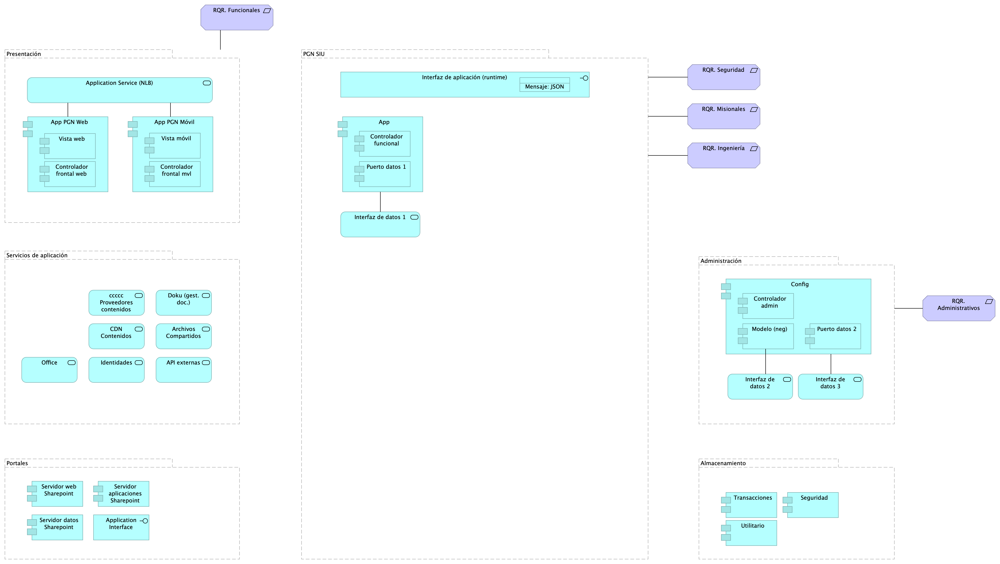{#fig:id-id-2efb9df070e94a1b8eba05a57ed55eaf width=}

_Fuente: ${4:Diagnóstico SOA. E-Service (2022).}_

 

### Catálogo de Elementos

| Tema           | Tema | Tema | Tema |
|----------------|------|------|------|
| API externas | Application Service |  |  |
| Administración | Grouping |  |  |
| Almacenamiento | Grouping |  |  |
| App | Application Component |  |  |
| App PGN Móvil | Application Component |  |  |
| App PGN Web | Application Component |  |  |
| Application Interface | Application Interface |  |  |
| Application Service (NLB) | Application Service |  |  |
| Archivos Compartidos | Application Service |  |  |
| CDN Contenidos | Application Service |  |  |
| Config | Application Component |  |  |
| Controlador admin | Application Component |  |  |
| Controlador frontal mvl | Application Component |  |  |
| Controlador frontal web | Application Component |  |  |
| Controlador funcional | Application Component |  |  |
| Doku (gest. doc.) | Application Service |  |  |
| Identidades | Application Service |  |  |
| Interfaz de aplicación (runtime) | Application Interface |  |  |
| Interfaz de datos 1 | Application Service |  |  |
| Interfaz de datos 2 | Application Service |  |  |
| Interfaz de datos 3 | Application Service |  |  |
| Mensaje: JSON | Data Object |  |  |
| Modelo (neg) | Application Component |  |  |
| Office | Application Service |  |  |
| PGN SIU | Grouping | El objetivo principal de la arquitectura del SUI de la migración es la centralización de los conceptos misionales: concentrar los conceptos misionales en componentes aislados; dejar por fuera de estos componentes misionales todo lo distintos a la misionalidad de la PGN.  Los objetivos secundarios de esta arquitectura SUI de la migración son flexibilidad y extensibilidad. Dichos objetivos son independientes. Es decir, estos pueden ser maximizados sin conclifcto entre ellos.   |  |
| Portales | Grouping | Submódulo de portales internos de la PGN a donde llega el SUI. Interfaz web que usa al SUI para llegar a direcciones y subdirecciones de la PGN. La plataforma principal de portales en este contexto es Sharepoint de Microsoft.  |  |
| Presentación | Grouping | Submódulo de presentación del SUI. interfaz gráfica, interfaz web visible a los usuarios clientes y funcionarios de la PGN.  |  |
| Puerto datos 1 | Application Component |  |  |
| Puerto datos 2 | Application Component |  |  |
| RQR. Administrativos | Requirement |  |  |
| RQR. Funcionales | Requirement |  |  |
| RQR. Ingeniería | Requirement |  |  |
| RQR. Misionales | Requirement |  |  |
| RQR. Seguridad | Requirement | Requerimientos de seguridad, SUI, Migración, en aspectos de comunicación, autenticación, autorización y (manejo de) sesiones.  |  |
| Seguridad | Application Component |  |  |
| Servicios de aplicación | Grouping | Submódulo de servicios utilitarios que sirven al SUI. Servicios variados que cumplen roles facilitadores de las actividades misionales del SUI. Ejemplos de estos servicios son los de gestión documental, implementado por Doku en el contexto de PGN.  |  |
| Servidor aplicaciones Sharepoint | Application Component |  |  |
| Servidor datos Sharepoint | Application Component |  |  |
| Servidor web Sharepoint | Application Component |  |  |
| Transacciones | Application Component |  |  |
| Utilitario | Application Component |  |  |
| Vista móvil | Application Component |  |  |
| Vista web | Application Component |  |  |
| ccccc Proveedores contenidos | Application Service |  |  |

Table: Elementos de la vista. {#tbl:tblelement-Seguridad.Migracion.1.SIUmodulos-id}

<tr class="hidden id-model undefined id-id-4f2604a6793e41ce9eb978dca0209b03 id-id-6dcada718c1446f69884dc7418828c51 id-id-1cf93f4f9b4e49e3af39acf22f3c2445 id-id-2efb9df070e94a1b8eba05a57ed55eaf">
	<td>
	<td>Composition Relationship
	<td>PGN SIU
	<td>Interfaz de datos 1
	<td>

<tr class="hidden id-model undefined id-id-4f2604a6793e41ce9eb978dca0209b03 id-id-6dcada718c1446f69884dc7418828c51 id-id-2efb9df070e94a1b8eba05a57ed55eaf">
	<td>
	<td>Composition Relationship
	<td>PGN SIU
	<td>Interfaz de aplicación (runtime)
	<td>

<tr class="hidden id-model undefined id-id-4f2604a6793e41ce9eb978dca0209b03 id-id-6dcada718c1446f69884dc7418828c51 id-id-1cf93f4f9b4e49e3af39acf22f3c2445 id-id-2efb9df070e94a1b8eba05a57ed55eaf">
	<td>
	<td>Composition Relationship
	<td>PGN SIU
	<td>App
	<td>

<tr class="hidden id-model undefined id-id-4f2604a6793e41ce9eb978dca0209b03 id-id-6dcada718c1446f69884dc7418828c51 id-id-2efb9df070e94a1b8eba05a57ed55eaf">
	<td>
	<td>Association Relationship
	<td>PGN SIU
	<td>RQR. Seguridad
	<td>

<tr class="hidden id-model undefined id-id-4f2604a6793e41ce9eb978dca0209b03 id-id-ae9dc2de036e435fbcba8497224653a7 id-id-6dcada718c1446f69884dc7418828c51 id-id-1cf93f4f9b4e49e3af39acf22f3c2445 id-id-2efb9df070e94a1b8eba05a57ed55eaf">
	<td>
	<td>Access Relationship
	<td>Interfaz de aplicación (runtime)
	<td>Mensaje: JSON
	<td>

<tr class="hidden id-model undefined id-id-4f2604a6793e41ce9eb978dca0209b03 id-id-ae9dc2de036e435fbcba8497224653a7 id-id-6dcada718c1446f69884dc7418828c51 id-id-1cf93f4f9b4e49e3af39acf22f3c2445 id-id-2efb9df070e94a1b8eba05a57ed55eaf">
	<td>
	<td>Composition Relationship
	<td>App
	<td>Puerto datos 1
	<td>

<tr class="hidden id-model undefined id-id-4f2604a6793e41ce9eb978dca0209b03 id-id-ae9dc2de036e435fbcba8497224653a7 id-id-6dcada718c1446f69884dc7418828c51 id-id-1cf93f4f9b4e49e3af39acf22f3c2445 id-id-2efb9df070e94a1b8eba05a57ed55eaf">
	<td>
	<td>Composition Relationship
	<td>App
	<td>Controlador funcional
	<td>

<tr class="hidden id-model undefined id-id-d1c66332737c4f8294474c4bbd0ebd52 id-id-f3eee2e860604899903c6b48c2f76335 id-id-4f2604a6793e41ce9eb978dca0209b03 id-id-ae9dc2de036e435fbcba8497224653a7 id-id-6dcada718c1446f69884dc7418828c51 id-id-280f63efee9b49e892eb38e7104d2d85 id-id-1cf93f4f9b4e49e3af39acf22f3c2445 id-id-2efb9df070e94a1b8eba05a57ed55eaf">
	<td>
	<td>Association Relationship
	<td>App
	<td>Interfaz de datos 1
	<td>

<tr class="hidden id-model undefined id-id-6dcada718c1446f69884dc7418828c51 id-id-2efb9df070e94a1b8eba05a57ed55eaf">
	<td>
	<td>Association Relationship
	<td>RQR. Funcionales
	<td>Presentación
	<td>

<tr class="hidden id-model undefined id-id-4f2604a6793e41ce9eb978dca0209b03 id-id-6dcada718c1446f69884dc7418828c51 id-id-2efb9df070e94a1b8eba05a57ed55eaf">
	<td>
	<td>Association Relationship
	<td>RQR. Ingeniería
	<td>PGN SIU
	<td>

<tr class="hidden id-model undefined id-id-6dcada718c1446f69884dc7418828c51 id-id-2efb9df070e94a1b8eba05a57ed55eaf">
	<td>
	<td>Composition Relationship
	<td>Presentación
	<td>App PGN Web
	<td>

<tr class="hidden id-model undefined id-id-6dcada718c1446f69884dc7418828c51 id-id-2efb9df070e94a1b8eba05a57ed55eaf">
	<td>
	<td>Composition Relationship
	<td>Presentación
	<td>Application Service (NLB)
	<td>

<tr class="hidden id-model undefined id-id-6dcada718c1446f69884dc7418828c51 id-id-2efb9df070e94a1b8eba05a57ed55eaf">
	<td>
	<td>Composition Relationship
	<td>Presentación
	<td>App PGN Móvil
	<td>

<tr class="hidden id-model undefined id-id-4f2604a6793e41ce9eb978dca0209b03 id-id-ae9dc2de036e435fbcba8497224653a7 id-id-6dcada718c1446f69884dc7418828c51 id-id-1cf93f4f9b4e49e3af39acf22f3c2445 id-id-2efb9df070e94a1b8eba05a57ed55eaf">
	<td>
	<td>Composition Relationship
	<td>App PGN Web
	<td>Vista web
	<td>

<tr class="hidden id-model undefined id-id-4f2604a6793e41ce9eb978dca0209b03 id-id-ae9dc2de036e435fbcba8497224653a7 id-id-6dcada718c1446f69884dc7418828c51 id-id-1cf93f4f9b4e49e3af39acf22f3c2445 id-id-2efb9df070e94a1b8eba05a57ed55eaf">
	<td>
	<td>Composition Relationship
	<td>App PGN Web
	<td>Controlador frontal web
	<td>

<tr class="hidden id-model undefined id-id-d1c66332737c4f8294474c4bbd0ebd52 id-id-f3eee2e860604899903c6b48c2f76335 id-id-4f2604a6793e41ce9eb978dca0209b03 id-id-ae9dc2de036e435fbcba8497224653a7 id-id-6dcada718c1446f69884dc7418828c51 id-id-280f63efee9b49e892eb38e7104d2d85 id-id-1cf93f4f9b4e49e3af39acf22f3c2445 id-id-2efb9df070e94a1b8eba05a57ed55eaf">
	<td>
	<td>Association Relationship
	<td>Application Service (NLB)
	<td>App PGN Web
	<td>

<tr class="hidden id-model undefined id-id-d1c66332737c4f8294474c4bbd0ebd52 id-id-f3eee2e860604899903c6b48c2f76335 id-id-4f2604a6793e41ce9eb978dca0209b03 id-id-ae9dc2de036e435fbcba8497224653a7 id-id-6dcada718c1446f69884dc7418828c51 id-id-280f63efee9b49e892eb38e7104d2d85 id-id-1cf93f4f9b4e49e3af39acf22f3c2445 id-id-2efb9df070e94a1b8eba05a57ed55eaf">
	<td>
	<td>Association Relationship
	<td>Application Service (NLB)
	<td>App PGN Móvil
	<td>

<tr class="hidden id-model undefined id-id-4f2604a6793e41ce9eb978dca0209b03 id-id-ae9dc2de036e435fbcba8497224653a7 id-id-6dcada718c1446f69884dc7418828c51 id-id-1cf93f4f9b4e49e3af39acf22f3c2445 id-id-2efb9df070e94a1b8eba05a57ed55eaf">
	<td>
	<td>Composition Relationship
	<td>App PGN Móvil
	<td>Vista móvil
	<td>

<tr class="hidden id-model undefined id-id-4f2604a6793e41ce9eb978dca0209b03 id-id-ae9dc2de036e435fbcba8497224653a7 id-id-6dcada718c1446f69884dc7418828c51 id-id-1cf93f4f9b4e49e3af39acf22f3c2445 id-id-2efb9df070e94a1b8eba05a57ed55eaf">
	<td>
	<td>Composition Relationship
	<td>App PGN Móvil
	<td>Controlador frontal mvl
	<td>

<tr class="hidden id-model undefined id-id-6dcada718c1446f69884dc7418828c51 id-id-2efb9df070e94a1b8eba05a57ed55eaf">
	<td>
	<td>Composition Relationship
	<td>Almacenamiento
	<td>Transacciones
	<td>

<tr class="hidden id-model undefined id-id-6dcada718c1446f69884dc7418828c51 id-id-2efb9df070e94a1b8eba05a57ed55eaf">
	<td>
	<td>Composition Relationship
	<td>Almacenamiento
	<td>Seguridad
	<td>

<tr class="hidden id-model undefined id-id-6dcada718c1446f69884dc7418828c51 id-id-2efb9df070e94a1b8eba05a57ed55eaf">
	<td>
	<td>Composition Relationship
	<td>Almacenamiento
	<td>Utilitario
	<td>

<tr class="hidden id-model undefined id-id-6dcada718c1446f69884dc7418828c51 id-id-2efb9df070e94a1b8eba05a57ed55eaf">
	<td>
	<td>Association Relationship
	<td>RQR. Misionales
	<td>PGN SIU
	<td>

<tr class="hidden id-model undefined id-id-6dcada718c1446f69884dc7418828c51 id-id-2efb9df070e94a1b8eba05a57ed55eaf">
	<td>
	<td>Composition Relationship
	<td>Administración
	<td>Config
	<td>

<tr class="hidden id-model undefined id-id-6dcada718c1446f69884dc7418828c51 id-id-2efb9df070e94a1b8eba05a57ed55eaf">
	<td>
	<td>Composition Relationship
	<td>Administración
	<td>Interfaz de datos 2
	<td>

<tr class="hidden id-model undefined id-id-6dcada718c1446f69884dc7418828c51 id-id-2efb9df070e94a1b8eba05a57ed55eaf">
	<td>
	<td>Composition Relationship
	<td>Administración
	<td>Interfaz de datos 3
	<td>

<tr class="hidden id-model undefined id-id-6dcada718c1446f69884dc7418828c51 id-id-2efb9df070e94a1b8eba05a57ed55eaf">
	<td>
	<td>Association Relationship
	<td>Administración
	<td>RQR. Administrativos
	<td>

<tr class="hidden id-model undefined id-id-4f2604a6793e41ce9eb978dca0209b03 id-id-ae9dc2de036e435fbcba8497224653a7 id-id-6dcada718c1446f69884dc7418828c51 id-id-1cf93f4f9b4e49e3af39acf22f3c2445 id-id-2efb9df070e94a1b8eba05a57ed55eaf">
	<td>
	<td>Composition Relationship
	<td>Config
	<td>Modelo (neg)
	<td>

<tr class="hidden id-model undefined id-id-4f2604a6793e41ce9eb978dca0209b03 id-id-ae9dc2de036e435fbcba8497224653a7 id-id-6dcada718c1446f69884dc7418828c51 id-id-1cf93f4f9b4e49e3af39acf22f3c2445 id-id-2efb9df070e94a1b8eba05a57ed55eaf">
	<td>
	<td>Composition Relationship
	<td>Config
	<td>Controlador admin
	<td>

<tr class="hidden id-model undefined id-id-4f2604a6793e41ce9eb978dca0209b03 id-id-ae9dc2de036e435fbcba8497224653a7 id-id-6dcada718c1446f69884dc7418828c51 id-id-1cf93f4f9b4e49e3af39acf22f3c2445 id-id-2efb9df070e94a1b8eba05a57ed55eaf">
	<td>
	<td>Composition Relationship
	<td>Config
	<td>Puerto datos 2
	<td>

<tr class="hidden id-model undefined id-id-4f2604a6793e41ce9eb978dca0209b03 id-id-ae9dc2de036e435fbcba8497224653a7 id-id-6dcada718c1446f69884dc7418828c51 id-id-1cf93f4f9b4e49e3af39acf22f3c2445 id-id-2efb9df070e94a1b8eba05a57ed55eaf">
	<td>
	<td>Association Relationship
	<td>Config
	<td>Interfaz de datos 3
	<td>

<tr class="hidden id-model undefined id-id-4f2604a6793e41ce9eb978dca0209b03 id-id-ae9dc2de036e435fbcba8497224653a7 id-id-6dcada718c1446f69884dc7418828c51 id-id-1cf93f4f9b4e49e3af39acf22f3c2445 id-id-2efb9df070e94a1b8eba05a57ed55eaf">
	<td>
	<td>Association Relationship
	<td>Modelo (neg)
	<td>Interfaz de datos 2
	<td>

<tr class="hidden id-model undefined id-id-6dcada718c1446f69884dc7418828c51 id-id-2efb9df070e94a1b8eba05a57ed55eaf">
	<td>
	<td>Composition Relationship
	<td>Servicios de aplicación
	<td>Archivos Compartidos
	<td>

<tr class="hidden id-model undefined id-id-6dcada718c1446f69884dc7418828c51 id-id-2efb9df070e94a1b8eba05a57ed55eaf">
	<td>
	<td>Composition Relationship
	<td>Servicios de aplicación
	<td>API externas
	<td>

<tr class="hidden id-model undefined id-id-6dcada718c1446f69884dc7418828c51 id-id-2efb9df070e94a1b8eba05a57ed55eaf">
	<td>
	<td>Composition Relationship
	<td>Servicios de aplicación
	<td>ccccc Proveedores contenidos
	<td>

<tr class="hidden id-model undefined id-id-6dcada718c1446f69884dc7418828c51 id-id-2efb9df070e94a1b8eba05a57ed55eaf">
	<td>
	<td>Composition Relationship
	<td>Servicios de aplicación
	<td>Identidades
	<td>

<tr class="hidden id-model undefined id-id-6dcada718c1446f69884dc7418828c51 id-id-2efb9df070e94a1b8eba05a57ed55eaf">
	<td>
	<td>Composition Relationship
	<td>Servicios de aplicación
	<td>Doku (gest. doc.)
	<td>

<tr class="hidden id-model undefined id-id-6dcada718c1446f69884dc7418828c51 id-id-2efb9df070e94a1b8eba05a57ed55eaf">
	<td>
	<td>Composition Relationship
	<td>Servicios de aplicación
	<td>CDN Contenidos
	<td>

<tr class="hidden id-model undefined id-id-6dcada718c1446f69884dc7418828c51 id-id-2efb9df070e94a1b8eba05a57ed55eaf">
	<td>
	<td>Composition Relationship
	<td>Servicios de aplicación
	<td>Office
	<td>

<tr class="hidden id-model undefined id-id-6dcada718c1446f69884dc7418828c51 id-id-2efb9df070e94a1b8eba05a57ed55eaf">
	<td>
	<td>Composition Relationship
	<td>Portales
	<td>Servidor web Sharepoint
	<td>

<tr class="hidden id-model undefined id-id-6dcada718c1446f69884dc7418828c51 id-id-2efb9df070e94a1b8eba05a57ed55eaf">
	<td>
	<td>Composition Relationship
	<td>Portales
	<td>Servidor aplicaciones Sharepoint
	<td>

<tr class="hidden id-model undefined id-id-6dcada718c1446f69884dc7418828c51 id-id-2efb9df070e94a1b8eba05a57ed55eaf">
	<td>
	<td>Composition Relationship
	<td>Portales
	<td>Servidor datos Sharepoint
	<td>

<tr class="hidden id-model undefined id-id-6dcada718c1446f69884dc7418828c51 id-id-2efb9df070e94a1b8eba05a57ed55eaf">
	<td>
	<td>Composition Relationship
	<td>Portales
	<td>Application Interface
	<td>

## Seguridad.Doc.1.Datos SUI

undefined

{#fig:id-id-eea5edcc8ccb4c0c96297df2d689d6c2 width=}

_Fuente: ${4:Diagnóstico SOA. E-Service (2022).}_

 

### Catálogo de Elementos

| Tema           | Tema | Tema | Tema |
|----------------|------|------|------|
|  | Device |  |  |
|  | Device |  |  |
|  | Device |  |  |
| BD PRD | Application Component |  |  |
| Descripción de Entidades de Datos Migración SUI PGN | Grouping |  |  |
| Gestión de funcionarios PGN | Business Actor |  |  |

Table: Elementos de la vista. {#tbl:tblelement-Seguridad.Doc.1.DatosSUI-id}

## Seguridad.Doc.1.Datos SUI

undefined

{#fig:id-id-873b4fcee97c46fba4132d60a65a40b1 width=}

_Fuente: ${4:Diagnóstico SOA. E-Service (2022).}_

 

### Catálogo de Elementos

| Tema           | Tema | Tema | Tema |
|----------------|------|------|------|
|  | Meaning |  |  |
| API (administración de claves) | Business Object | Administración de claves. 
  |  |
| Autenticación | Business Object | Los tipos de autenticacion realizadas a partir de las identidades adminsitradas de los recursos de Azure, entidades de Servicio y Certificado y entidaded de servicio secreto.
  |  |
| BD PRD | Application Component | Gestor de Base de datos SQL Server |  |
| Cifrado de Datos en tránsito | Business Object | Establecer mecanismos de cifrado, como el protocolo TLS ( Transport Layer Security) que permite a dos partes identificarse y autenticarse entre sí y comunicarse con confidencialidad e integridad de datos a partir de la conexión del usuario y un servidor WEB. |  |
| Cifrado de datos | Business Object | Establecer mecanismos de cifrado, como el protocolo TLS ( Transport Layer Security) que permite a dos partes identificarse y autenticarse entre sí y comunicarse con confidencialidad e integridad de datos a partir de la conexión del usuario y un servidor WEB. |  |
| Descripción de Entidades de Datos Migración SUI PGN | Grouping |  |  |
| Gestión de funcionarios PGN | Business Actor | La autenticacion de usuarios estará enmarcada en en tres factores de autenticación a partir del controlador de Dominio, y el acceso por VPN. |  |
| Hominis | Business Object | Entidades de datos de negocio de capital humano de la PGN. Sistema de información Homini.  |  |
| Ofuscamiento de datos | Business Object | Pemitirá enmascarar los datos a nivel de columna, teniendo en cuenta el enmascaramiento dinamico de datos (DDM). |  |
| Roles de Key Vault | Business Object | Control de acceso que define los roles y los privilegios para determinar si a un usuario se le debe dar acceso a un recurso |  |
| Security Administrator | Business Actor | La autenticacion de usuarios estará enmarcada en en tres factores de autenticación:
 control de acceso basado en roles (RBAC), mecanismo de control de acceso que define los roles y los privilegios para determinar si a un usuario se le debe dar acceso a un recurso.
 Conexión de accecso por DA de Azure: Servicio de administración de acceso e identidades basado en la nube.
 Red Privada Virtual de Azure:  bloque de compilación fundamental para las redes privadas en Azure |  |
| WAF | Node | El WAF es la medida de implementacion del muro de protección (firewall) de Aplicaciones WEB del SUI necesario para el control de las peticiones realizadas desde fuera del perímetro de red y hacia los sistemas de Informacion de la PGN.   |  |

Table: Elementos de la vista. {#tbl:tblelement-Seguridad.Doc.1.DatosSUI-id}

<tr class="hidden id-model undefined id-id-873b4fcee97c46fba4132d60a65a40b1">
	<td>
	<td>Association Relationship
	<td>BD PRD
	<td>Gestión de funcionarios PGN
	<td>

<tr class="hidden id-model undefined id-id-873b4fcee97c46fba4132d60a65a40b1">
	<td>
	<td>Access Relationship
	<td>BD PRD
	<td>Hominis
	<td>

<tr class="hidden id-model undefined id-id-873b4fcee97c46fba4132d60a65a40b1">
	<td>
	<td>Association Relationship
	<td>Hominis
	<td>Cifrado de datos
	<td>

<tr class="hidden id-model undefined id-id-873b4fcee97c46fba4132d60a65a40b1">
	<td>
	<td>Association Relationship
	<td>
	<td>WAF
	<td>

<tr class="hidden id-model undefined id-id-873b4fcee97c46fba4132d60a65a40b1">
	<td>
	<td>Association Relationship
	<td>Security Administrator
	<td>
	<td>

<tr class="hidden id-model undefined id-id-873b4fcee97c46fba4132d60a65a40b1">
	<td>
	<td>Association Relationship
	<td>Security Administrator
	<td>API (administración de claves)
	<td>

<tr class="hidden id-model undefined id-id-873b4fcee97c46fba4132d60a65a40b1">
	<td>
	<td>Association Relationship
	<td>Autenticación
	<td>Descripción de Entidades de Datos Migración SUI PGN
	<td>

<tr class="hidden id-model undefined id-id-873b4fcee97c46fba4132d60a65a40b1">
	<td>
	<td>Association Relationship
	<td>Cifrado de Datos en tránsito
	<td>Descripción de Entidades de Datos Migración SUI PGN
	<td>

<tr class="hidden id-model undefined id-id-873b4fcee97c46fba4132d60a65a40b1">
	<td>
	<td>Association Relationship
	<td>Cifrado de Datos en tránsito
	<td>WAF
	<td>

<tr class="hidden id-model undefined id-id-873b4fcee97c46fba4132d60a65a40b1">
	<td>
	<td>Association Relationship
	<td>Roles de Key Vault
	<td>Descripción de Entidades de Datos Migración SUI PGN
	<td>

<tr class="hidden id-model undefined id-id-873b4fcee97c46fba4132d60a65a40b1">
	<td>
	<td>Association Relationship
	<td>Roles de Key Vault
	<td>WAF
	<td>

<tr class="hidden id-model undefined id-id-873b4fcee97c46fba4132d60a65a40b1">
	<td>
	<td>Association Relationship
	<td>Roles de Key Vault
	<td>Autenticación
	<td>

<tr class="hidden id-model undefined id-id-873b4fcee97c46fba4132d60a65a40b1">
	<td>
	<td>Association Relationship
	<td>WAF
	<td>Autenticación
	<td>

<tr class="hidden id-model undefined id-id-873b4fcee97c46fba4132d60a65a40b1">
	<td>
	<td>Association Relationship
	<td>API (administración de claves)
	<td>Autenticación
	<td>

<tr class="hidden id-model undefined id-id-873b4fcee97c46fba4132d60a65a40b1">
	<td>
	<td>Association Relationship
	<td>BD PRD
	<td>
	<td>

## Seguridad.Organización. 1n.1. Mapa producto PGN. Relatoría

Procuraduría General de la Nación
Proyecto Migración SIU, 2023. Fase II

SIREL (Relatoría). Organización de trabajo. 
Características funcionales, sistémicas, seguridad.

versión 0.12

Organización y distribución de las características técnicas y funcionales del módulo de Relatoría. 

Características principales:
* Utilización de metadatos
* Búsqueda de contenido (intradocumental y por metadatos)
* Procesos de recolección y sincronización de contenidos

De arriba a abajo: 
1. Fila 1, planificación de espacios de trabajo (iteraciones, para este caso) restringido al alcance del proyecto Migración PGN 2023.
1. Debajo, lo hitos importantes organizados en el tiempo.
1. Fila 3. Evolución de las características en los aspectos funcionales, técnico, hardware y software del módulo Relatoría de PGN. 
1. FInalmente, fila final del diagrama, la entrega en el tiempo de las capacidades del módulo de relatoría (épicas, para el caso de Scrum). La prioridad de liberación de estas la determina el equipo funcional de este módulo de la PGN.

&lt;br&gt;

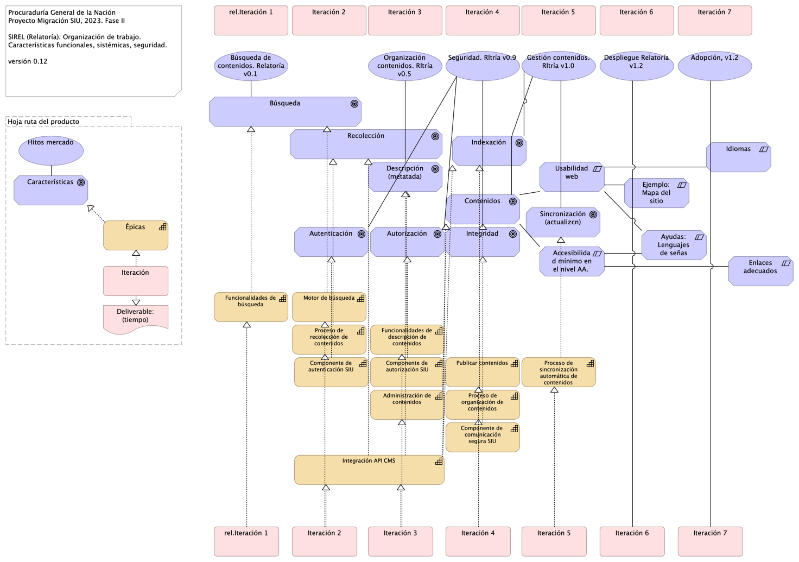{#fig:id-id-d455b60f8f5448b581a3eddd7364c86f width=}

_Fuente: ${4:Diagnóstico SOA. E-Service (2022).}_

 

### Catálogo de Elementos

| Tema           | Tema | Tema | Tema |
|----------------|------|------|------|
| Accesibilidad mínimo en el nivel AA.  | Constraint | Caracteristicas: 
 - Inclusión para los contenidos audivisuales, subtitulos incorporados o textos escondidos, (Closed Caption).
 - Inclusion de lengua de señas Colombiana para interacciones con la ciudadanía. 
 
  |  |
| Administración de contenidos | Capability |  |  |
| Adopción, v1.2 | Value |  |  |
| Autenticación | Goal |  |  |
| Autorización | Goal |  |  |
| Ayudas: Lenguajes de señas | Constraint |  |  |
| Búsqueda | Goal |  |  |
| Búsqueda de contenidos. Relatoría v0.1 | Value |  |  |
| Características | Goal |  |  |
| Componente de  comunicación segura SIU | Capability |  |  |
| Componente de autenticación SIU | Capability |  |  |
| Componente de autorización SIU | Capability |  |  |
| Contenidos | Goal | Se tendran que adecuar los contenidos audivisuales de los sitios web, con subtitulos o CLosed Caption y la apropiacion de lenguajes de señas.  |  |
| Deliverable: (tiempo) | Deliverable |  |  |
| Descripción (metatada) | Goal |  |  |
| Despliegue Relatoría v1.2 | Value |  |  |
| Ejemplo: Mapa del sitio | Constraint | Capa que permita reforzar las busquedas en los motores de Busquedas, y que ayude a facilitar la accesibilidad de los usuarios, de forma que pueda estar indexada de forma adecuada. 
 Caracteristicas:
 Mayor Navegacion del sitio. 
 Mejor referenciación de contenido. 
 Mayor facilidad de busqueda en los Mavegadores web. 
 
  |  |
| Enlaces adecuados | Constraint | Los enlaces deberan ser identificados de forma clara, y el indicativo del sitio o la ventana que se abrirá o la ruta al documento que llegará. 
  |  |
| Funcionalidades de búsqueda | Capability |  |  |
| Funcionalidades de descripción de contenidos | Capability |  |  |
| Gestión contenidos. Rltría v1.0 | Value |  |  |
| Hitos mercado | Value |  |  |
| Hoja ruta del producto | Grouping |  |  |
| Idiomas | Constraint | Tener en cuenta el idioma del sitio web, para que en el marco del contexto de ubicación pueda ser interpretado, de acuerdo con el país de ubicación. |  |
| Indexación | Goal |  |  |
| Integración API CMS | Capability |  |  |
| Integridad | Goal |  |  |
| Iteración | Work Package |  |  |
| Iteración 2 | Work Package |  |  |
| Iteración 3 | Work Package |  |  |
| Iteración 4 | Work Package |  |  |
| Iteración 5 | Work Package |  |  |
| Iteración 6 | Work Package |  |  |
| Iteración 7 | Work Package |  |  |
| Motor de búsqueda | Capability |  |  |
| Organización contenidos. Rltría v0.5 | Value |  |  |
| Proceso de organización de contenidos | Capability |  |  |
| Proceso de recolección de contenidos | Capability |  |  |
| Proceso de sincronización automática de contenidos | Capability |  |  |
| Publicar contenidos | Capability |  |  |
| Recolección | Goal |  |  |
| Seguridad. Rltría v0.9 | Value |  |  |
| Sincronización (actualizcn) | Goal |  |  |
| Usabilidad web | Constraint | Principios utilizados para optimizar la navegación, de forma que sea intuitiva, agradable, segura y de facil navegación.  |  |
| rel.Iteración 1 | Work Package |  |  |
| Épicas | Capability |  |  |

Table: Elementos de la vista. {#tbl:tblelement-Seguridad.Organización.1n.1.MapaproductoPGN.Relatoría-id}

<tr class="hidden id-model undefined id-id-26b58fc2a55d40b7a082500205f47e61 id-id-e1a40cd4109d4e12af8226d9b063dfb2 id-id-2dff7e836da042a9a55c3c635828070e id-id-b7bbdb516c71447e866452edcce2c9e8 id-id-9e62cc661c6a48ffb0b344b3dbe37852 id-id-4acba5538de34883abe9b4900042f7bd id-id-70003079a85b445a816e59199a97925a id-id-125d1b49b13f492ca225313c1b544613 id-id-4523fca069074c39901d92e952d21734 id-id-212758d2fc8748b7bcc05868ff393b18 id-id-9636a665a6e945f0a5f43b53d1dd0f27 id-id-d455b60f8f5448b581a3eddd7364c86f">
	<td>
	<td>Composition Relationship
	<td>Hoja ruta del producto
	<td>Hitos mercado
	<td>

<tr class="hidden id-model undefined id-id-26b58fc2a55d40b7a082500205f47e61 id-id-e1a40cd4109d4e12af8226d9b063dfb2 id-id-2dff7e836da042a9a55c3c635828070e id-id-b7bbdb516c71447e866452edcce2c9e8 id-id-9e62cc661c6a48ffb0b344b3dbe37852 id-id-4acba5538de34883abe9b4900042f7bd id-id-70003079a85b445a816e59199a97925a id-id-125d1b49b13f492ca225313c1b544613 id-id-4523fca069074c39901d92e952d21734 id-id-212758d2fc8748b7bcc05868ff393b18 id-id-9636a665a6e945f0a5f43b53d1dd0f27 id-id-d455b60f8f5448b581a3eddd7364c86f">
	<td>
	<td>Composition Relationship
	<td>Hoja ruta del producto
	<td>Iteración
	<td>

<tr class="hidden id-model undefined id-id-26b58fc2a55d40b7a082500205f47e61 id-id-e1a40cd4109d4e12af8226d9b063dfb2 id-id-2dff7e836da042a9a55c3c635828070e id-id-b7bbdb516c71447e866452edcce2c9e8 id-id-9e62cc661c6a48ffb0b344b3dbe37852 id-id-4acba5538de34883abe9b4900042f7bd id-id-70003079a85b445a816e59199a97925a id-id-125d1b49b13f492ca225313c1b544613 id-id-4523fca069074c39901d92e952d21734 id-id-212758d2fc8748b7bcc05868ff393b18 id-id-9636a665a6e945f0a5f43b53d1dd0f27 id-id-d455b60f8f5448b581a3eddd7364c86f">
	<td>
	<td>Composition Relationship
	<td>Hoja ruta del producto
	<td>Características
	<td>

<tr class="hidden id-model undefined id-id-26b58fc2a55d40b7a082500205f47e61 id-id-e1a40cd4109d4e12af8226d9b063dfb2 id-id-2dff7e836da042a9a55c3c635828070e id-id-b7bbdb516c71447e866452edcce2c9e8 id-id-9e62cc661c6a48ffb0b344b3dbe37852 id-id-4acba5538de34883abe9b4900042f7bd id-id-70003079a85b445a816e59199a97925a id-id-125d1b49b13f492ca225313c1b544613 id-id-4523fca069074c39901d92e952d21734 id-id-212758d2fc8748b7bcc05868ff393b18 id-id-9636a665a6e945f0a5f43b53d1dd0f27 id-id-d455b60f8f5448b581a3eddd7364c86f">
	<td>
	<td>Composition Relationship
	<td>Hoja ruta del producto
	<td>Épicas
	<td>

<tr class="hidden id-model undefined id-id-26b58fc2a55d40b7a082500205f47e61 id-id-e1a40cd4109d4e12af8226d9b063dfb2 id-id-2dff7e836da042a9a55c3c635828070e id-id-b7bbdb516c71447e866452edcce2c9e8 id-id-9e62cc661c6a48ffb0b344b3dbe37852 id-id-4acba5538de34883abe9b4900042f7bd id-id-70003079a85b445a816e59199a97925a id-id-125d1b49b13f492ca225313c1b544613 id-id-4523fca069074c39901d92e952d21734 id-id-212758d2fc8748b7bcc05868ff393b18 id-id-9636a665a6e945f0a5f43b53d1dd0f27 id-id-d455b60f8f5448b581a3eddd7364c86f">
	<td>
	<td>Composition Relationship
	<td>Hoja ruta del producto
	<td>Deliverable: (tiempo)
	<td>

<tr class="hidden id-model undefined id-id-26b58fc2a55d40b7a082500205f47e61 id-id-e1a40cd4109d4e12af8226d9b063dfb2 id-id-2dff7e836da042a9a55c3c635828070e id-id-b7bbdb516c71447e866452edcce2c9e8 id-id-9e62cc661c6a48ffb0b344b3dbe37852 id-id-4acba5538de34883abe9b4900042f7bd id-id-70003079a85b445a816e59199a97925a id-id-125d1b49b13f492ca225313c1b544613 id-id-4523fca069074c39901d92e952d21734 id-id-212758d2fc8748b7bcc05868ff393b18 id-id-9636a665a6e945f0a5f43b53d1dd0f27 id-id-d455b60f8f5448b581a3eddd7364c86f">
	<td>
	<td>Realization Relationship
	<td>Iteración
	<td>Épicas
	<td>

<tr class="hidden id-model undefined id-id-26b58fc2a55d40b7a082500205f47e61 id-id-e1a40cd4109d4e12af8226d9b063dfb2 id-id-2dff7e836da042a9a55c3c635828070e id-id-b7bbdb516c71447e866452edcce2c9e8 id-id-9e62cc661c6a48ffb0b344b3dbe37852 id-id-4acba5538de34883abe9b4900042f7bd id-id-70003079a85b445a816e59199a97925a id-id-125d1b49b13f492ca225313c1b544613 id-id-4523fca069074c39901d92e952d21734 id-id-212758d2fc8748b7bcc05868ff393b18 id-id-9636a665a6e945f0a5f43b53d1dd0f27 id-id-d455b60f8f5448b581a3eddd7364c86f">
	<td>
	<td>Realization Relationship
	<td>Iteración
	<td>Deliverable: (tiempo)
	<td>

<tr class="hidden id-model undefined id-id-26b58fc2a55d40b7a082500205f47e61 id-id-e1a40cd4109d4e12af8226d9b063dfb2 id-id-2dff7e836da042a9a55c3c635828070e id-id-b7bbdb516c71447e866452edcce2c9e8 id-id-9e62cc661c6a48ffb0b344b3dbe37852 id-id-4acba5538de34883abe9b4900042f7bd id-id-70003079a85b445a816e59199a97925a id-id-125d1b49b13f492ca225313c1b544613 id-id-4523fca069074c39901d92e952d21734 id-id-212758d2fc8748b7bcc05868ff393b18 id-id-9636a665a6e945f0a5f43b53d1dd0f27 id-id-d455b60f8f5448b581a3eddd7364c86f">
	<td>
	<td>Association Relationship
	<td>Características
	<td>Hitos mercado
	<td>

<tr class="hidden id-model undefined id-id-26b58fc2a55d40b7a082500205f47e61 id-id-e1a40cd4109d4e12af8226d9b063dfb2 id-id-2dff7e836da042a9a55c3c635828070e id-id-b7bbdb516c71447e866452edcce2c9e8 id-id-9e62cc661c6a48ffb0b344b3dbe37852 id-id-4acba5538de34883abe9b4900042f7bd id-id-70003079a85b445a816e59199a97925a id-id-125d1b49b13f492ca225313c1b544613 id-id-4523fca069074c39901d92e952d21734 id-id-212758d2fc8748b7bcc05868ff393b18 id-id-9636a665a6e945f0a5f43b53d1dd0f27 id-id-d455b60f8f5448b581a3eddd7364c86f">
	<td>
	<td>Realization Relationship
	<td>Épicas
	<td>Características
	<td>

<tr class="hidden id-model undefined id-id-e1a40cd4109d4e12af8226d9b063dfb2 id-id-2dff7e836da042a9a55c3c635828070e id-id-b7bbdb516c71447e866452edcce2c9e8 id-id-d455b60f8f5448b581a3eddd7364c86f">
	<td>
	<td>Association Relationship
	<td>Indexación
	<td>Gestión contenidos. Rltría v1.0
	<td>

<tr class="hidden id-model undefined id-id-e1a40cd4109d4e12af8226d9b063dfb2 id-id-2dff7e836da042a9a55c3c635828070e id-id-b7bbdb516c71447e866452edcce2c9e8 id-id-d455b60f8f5448b581a3eddd7364c86f">
	<td>
	<td>Association Relationship
	<td>Contenidos
	<td>Gestión contenidos. Rltría v1.0
	<td>

<tr class="hidden id-model undefined id-id-e1a40cd4109d4e12af8226d9b063dfb2 id-id-2dff7e836da042a9a55c3c635828070e id-id-b7bbdb516c71447e866452edcce2c9e8 id-id-d455b60f8f5448b581a3eddd7364c86f">
	<td>
	<td>Association Relationship
	<td>Recolección
	<td>Organización contenidos. Rltría v0.5
	<td>

<tr class="hidden id-model undefined id-id-e1a40cd4109d4e12af8226d9b063dfb2 id-id-2dff7e836da042a9a55c3c635828070e id-id-b7bbdb516c71447e866452edcce2c9e8 id-id-d455b60f8f5448b581a3eddd7364c86f">
	<td>
	<td>Association Relationship
	<td>Búsqueda
	<td>Búsqueda de contenidos. Relatoría v0.1
	<td>

<tr class="hidden id-model undefined id-id-e1a40cd4109d4e12af8226d9b063dfb2 id-id-2dff7e836da042a9a55c3c635828070e id-id-b7bbdb516c71447e866452edcce2c9e8 id-id-d455b60f8f5448b581a3eddd7364c86f">
	<td>
	<td>Association Relationship
	<td>Sincronización (actualizcn)
	<td>Gestión contenidos. Rltría v1.0
	<td>
Principios que permiten optimizar la navegación, para que sea sencilla, intuitiva, agradable y Segura.

<tr class="hidden id-model undefined id-id-e1a40cd4109d4e12af8226d9b063dfb2 id-id-2dff7e836da042a9a55c3c635828070e id-id-b7bbdb516c71447e866452edcce2c9e8 id-id-d455b60f8f5448b581a3eddd7364c86f">
	<td>
	<td>Association Relationship
	<td>Descripción (metatada)
	<td>Organización contenidos. Rltría v0.5
	<td>

<tr class="hidden id-model undefined id-id-e1a40cd4109d4e12af8226d9b063dfb2 id-id-2dff7e836da042a9a55c3c635828070e id-id-b7bbdb516c71447e866452edcce2c9e8 id-id-d455b60f8f5448b581a3eddd7364c86f">
	<td>
	<td>Realization Relationship
	<td>Funcionalidades de búsqueda
	<td>Búsqueda
	<td>

<tr class="hidden id-model undefined id-id-e1a40cd4109d4e12af8226d9b063dfb2 id-id-2dff7e836da042a9a55c3c635828070e id-id-b7bbdb516c71447e866452edcce2c9e8 id-id-d455b60f8f5448b581a3eddd7364c86f">
	<td>
	<td>Realization Relationship
	<td>Proceso de organización de contenidos
	<td>Indexación
	<td>

<tr class="hidden id-model undefined id-id-e1a40cd4109d4e12af8226d9b063dfb2 id-id-2dff7e836da042a9a55c3c635828070e id-id-b7bbdb516c71447e866452edcce2c9e8 id-id-d455b60f8f5448b581a3eddd7364c86f">
	<td>
	<td>Realization Relationship
	<td>Funcionalidades de descripción de contenidos
	<td>Descripción (metatada)
	<td>

<tr class="hidden id-model undefined id-id-e1a40cd4109d4e12af8226d9b063dfb2 id-id-2dff7e836da042a9a55c3c635828070e id-id-b7bbdb516c71447e866452edcce2c9e8 id-id-d455b60f8f5448b581a3eddd7364c86f">
	<td>
	<td>Realization Relationship
	<td>Proceso de sincronización automática de contenidos
	<td>Sincronización (actualizcn)
	<td>

<tr class="hidden id-model undefined id-id-e1a40cd4109d4e12af8226d9b063dfb2 id-id-2dff7e836da042a9a55c3c635828070e id-id-b7bbdb516c71447e866452edcce2c9e8 id-id-d455b60f8f5448b581a3eddd7364c86f">
	<td>
	<td>Realization Relationship
	<td>Proceso de recolección de contenidos
	<td>Recolección
	<td>

<tr class="hidden id-model undefined id-id-e1a40cd4109d4e12af8226d9b063dfb2 id-id-2dff7e836da042a9a55c3c635828070e id-id-b7bbdb516c71447e866452edcce2c9e8 id-id-d455b60f8f5448b581a3eddd7364c86f">
	<td>
	<td>Realization Relationship
	<td>Administración de contenidos
	<td>Contenidos
	<td>

<tr class="hidden id-model undefined id-id-e1a40cd4109d4e12af8226d9b063dfb2 id-id-2dff7e836da042a9a55c3c635828070e id-id-b7bbdb516c71447e866452edcce2c9e8 id-id-d455b60f8f5448b581a3eddd7364c86f">
	<td>
	<td>Realization Relationship
	<td>Motor de búsqueda
	<td>Búsqueda
	<td>

<tr class="hidden id-model undefined id-id-2dff7e836da042a9a55c3c635828070e id-id-d455b60f8f5448b581a3eddd7364c86f">
	<td>
	<td>Association Relationship
	<td>Autenticación
	<td>Seguridad. Rltría v0.9
	<td>

<tr class="hidden id-model undefined id-id-2dff7e836da042a9a55c3c635828070e id-id-d455b60f8f5448b581a3eddd7364c86f">
	<td>
	<td>Association Relationship
	<td>Autorización
	<td>Seguridad. Rltría v0.9
	<td>

<tr class="hidden id-model undefined id-id-2dff7e836da042a9a55c3c635828070e id-id-d455b60f8f5448b581a3eddd7364c86f">
	<td>
	<td>Association Relationship
	<td>Integridad
	<td>Seguridad. Rltría v0.9
	<td>

<tr class="hidden id-model undefined id-id-e1a40cd4109d4e12af8226d9b063dfb2 id-id-2dff7e836da042a9a55c3c635828070e id-id-b7bbdb516c71447e866452edcce2c9e8 id-id-d455b60f8f5448b581a3eddd7364c86f">
	<td>
	<td>Realization Relationship
	<td>Componente de autenticación SIU
	<td>Autenticación
	<td>

<tr class="hidden id-model undefined id-id-e1a40cd4109d4e12af8226d9b063dfb2 id-id-2dff7e836da042a9a55c3c635828070e id-id-b7bbdb516c71447e866452edcce2c9e8 id-id-d455b60f8f5448b581a3eddd7364c86f">
	<td>
	<td>Realization Relationship
	<td>Componente de autorización SIU
	<td>Autorización
	<td>

<tr class="hidden id-model undefined id-id-e1a40cd4109d4e12af8226d9b063dfb2 id-id-2dff7e836da042a9a55c3c635828070e id-id-b7bbdb516c71447e866452edcce2c9e8 id-id-d455b60f8f5448b581a3eddd7364c86f">
	<td>
	<td>Realization Relationship
	<td>Componente de  comunicación segura SIU
	<td>Integridad
	<td>

<tr class="hidden id-model undefined id-id-e1a40cd4109d4e12af8226d9b063dfb2 id-id-2dff7e836da042a9a55c3c635828070e id-id-b7bbdb516c71447e866452edcce2c9e8 id-id-d455b60f8f5448b581a3eddd7364c86f">
	<td>
	<td>Realization Relationship
	<td>Integración API CMS
	<td>Recolección
	<td>

<tr class="hidden id-model undefined id-id-e1a40cd4109d4e12af8226d9b063dfb2 id-id-2dff7e836da042a9a55c3c635828070e id-id-b7bbdb516c71447e866452edcce2c9e8 id-id-d455b60f8f5448b581a3eddd7364c86f">
	<td>
	<td>Realization Relationship
	<td>Integración API CMS
	<td>Descripción (metatada)
	<td>

<tr class="hidden id-model undefined id-id-e1a40cd4109d4e12af8226d9b063dfb2 id-id-2dff7e836da042a9a55c3c635828070e id-id-b7bbdb516c71447e866452edcce2c9e8 id-id-d455b60f8f5448b581a3eddd7364c86f">
	<td>
	<td>Realization Relationship
	<td>Integración API CMS
	<td>Indexación
	<td>

<tr class="hidden id-model undefined id-id-e1a40cd4109d4e12af8226d9b063dfb2 id-id-2dff7e836da042a9a55c3c635828070e id-id-b7bbdb516c71447e866452edcce2c9e8 id-id-d455b60f8f5448b581a3eddd7364c86f">
	<td>
	<td>Realization Relationship
	<td>Integración API CMS
	<td>Contenidos
	<td>

<tr class="hidden id-model undefined id-id-2dff7e836da042a9a55c3c635828070e id-id-d455b60f8f5448b581a3eddd7364c86f">
	<td>
	<td>Realization Relationship
	<td>rel.Iteración 1
	<td>Funcionalidades de búsqueda
	<td>

<tr class="hidden id-model undefined id-id-2dff7e836da042a9a55c3c635828070e id-id-d455b60f8f5448b581a3eddd7364c86f">
	<td>
	<td>Realization Relationship
	<td>Iteración 2
	<td>Proceso de recolección de contenidos
	<td>

<tr class="hidden id-model undefined id-id-2dff7e836da042a9a55c3c635828070e id-id-d455b60f8f5448b581a3eddd7364c86f">
	<td>
	<td>Realization Relationship
	<td>Iteración 2
	<td>Motor de búsqueda
	<td>

<tr class="hidden id-model undefined id-id-2dff7e836da042a9a55c3c635828070e id-id-d455b60f8f5448b581a3eddd7364c86f">
	<td>
	<td>Realization Relationship
	<td>Iteración 2
	<td>Integración API CMS
	<td>

<tr class="hidden id-model undefined id-id-2dff7e836da042a9a55c3c635828070e id-id-d455b60f8f5448b581a3eddd7364c86f">
	<td>
	<td>Realization Relationship
	<td>Iteración 3
	<td>Funcionalidades de descripción de contenidos
	<td>

<tr class="hidden id-model undefined id-id-2dff7e836da042a9a55c3c635828070e id-id-d455b60f8f5448b581a3eddd7364c86f">
	<td>
	<td>Realization Relationship
	<td>Iteración 3
	<td>Integración API CMS
	<td>

<tr class="hidden id-model undefined id-id-2dff7e836da042a9a55c3c635828070e id-id-d455b60f8f5448b581a3eddd7364c86f">
	<td>
	<td>Realization Relationship
	<td>Iteración 3
	<td>Administración de contenidos
	<td>

<tr class="hidden id-model undefined id-id-2dff7e836da042a9a55c3c635828070e id-id-d455b60f8f5448b581a3eddd7364c86f">
	<td>
	<td>Realization Relationship
	<td>Iteración 4
	<td>Proceso de organización de contenidos
	<td>

<tr class="hidden id-model undefined id-id-2dff7e836da042a9a55c3c635828070e id-id-d455b60f8f5448b581a3eddd7364c86f">
	<td>
	<td>Realization Relationship
	<td>Iteración 4
	<td>Publicar contenidos
	<td>

<tr class="hidden id-model undefined id-id-2dff7e836da042a9a55c3c635828070e id-id-d455b60f8f5448b581a3eddd7364c86f">
	<td>
	<td>Realization Relationship
	<td>Iteración 5
	<td>Proceso de sincronización automática de contenidos
	<td>

<tr class="hidden id-model undefined id-id-d455b60f8f5448b581a3eddd7364c86f">
	<td>
	<td>Association Relationship
	<td>Iteración 6
	<td>Despliegue Relatoría v1.2
	<td>

<tr class="hidden id-model undefined id-id-d455b60f8f5448b581a3eddd7364c86f">
	<td>
	<td>Association Relationship
	<td>Iteración 7
	<td>Adopción, v1.2
	<td>

<tr class="hidden id-model undefined id-id-2dff7e836da042a9a55c3c635828070e id-id-d455b60f8f5448b581a3eddd7364c86f">
	<td>
	<td>Realization Relationship
	<td>Publicar contenidos
	<td>Contenidos
	<td>

<tr class="hidden id-model undefined id-id-d455b60f8f5448b581a3eddd7364c86f">
	<td>
	<td>Association Relationship
	<td>Usabilidad web
	<td>Contenidos
	<td>

<tr class="hidden id-model undefined id-id-d455b60f8f5448b581a3eddd7364c86f">
	<td>
	<td>Association Relationship
	<td>Usabilidad web
	<td>Ayudas: Lenguajes de señas
	<td>

<tr class="hidden id-model undefined id-id-d455b60f8f5448b581a3eddd7364c86f">
	<td>
	<td>Association Relationship
	<td>Accesibilidad mínimo en el nivel AA. 
	<td>Contenidos
	<td>

<tr class="hidden id-model undefined id-id-d455b60f8f5448b581a3eddd7364c86f">
	<td>
	<td>Association Relationship
	<td>Accesibilidad mínimo en el nivel AA. 
	<td>Ayudas: Lenguajes de señas
	<td>

<tr class="hidden id-model undefined id-id-d455b60f8f5448b581a3eddd7364c86f">
	<td>
	<td>Association Relationship
	<td>Ejemplo: Mapa del sitio
	<td>Usabilidad web
	<td>

<tr class="hidden id-model undefined id-id-d455b60f8f5448b581a3eddd7364c86f">
	<td>
	<td>Association Relationship
	<td>Idiomas
	<td>Usabilidad web
	<td>

<tr class="hidden id-model undefined id-id-d455b60f8f5448b581a3eddd7364c86f">
	<td>
	<td>Association Relationship
	<td>Enlaces adecuados
	<td>Accesibilidad mínimo en el nivel AA. 
	<td>

## Requerimientos de Administración
1.	Las soluciones deben permitir la administración de los Roles de Usuarios: esta funcionalidad debe permitir configurar los diferentes roles de los usuarios funcionales de los procesos. 
2.	Administrar los Perfiles de acceso por rol: Esta funcionalidad permitirá configurar a que funcionalidades u opciones de la solución puede entrar un usuario con un rol específico. 
Administrar los Usuarios de la Solución: Esta funcionalidad debe permitir configurar, activar, desactivar usuarios de las soluciones desarrolladas.
4.	Para los casos que aplique se debe asociar el desarrollo con el mecanismo de Firmas (digital, electrónica o mecánica): Esta funcionalidad debe permitir configurar los usuarios que tienen permitida la aprobación de documentos desde la solución implementada, a través del tipo de firma que corresponda. 
5.	Administrar los Permisos de acceso: Esta funcionalidad permite definir específicamente a que servicios de la solución puede ingresar un usuario (CRUD). 
6.	En los desarrollos se debe contar con un módulo de auditoría que permita generar consultas para conocer quién y cuándo se ha realizado una actuación determinada dentro de procesos críticos, almacenando el código del usuario la actuación, la acción, la fecha, la hora, y la dirección IP de la máquina. 
7.	Las soluciones deben permitir la configuración de permisos de consulta con diferentes alcances para cada tipo de usuario. 
8.	Desde la interfaz de usuario se debe poder crear, modificar o inactivar usuarios, perfiles o roles, permisos a las diferentes funcionalidades de la solución. 
9.	Las soluciones deben permitir la definición de varios tipos de usuario. 
10.	Las soluciones deben permitir la parametrización de los consecutivos que maneja la entidad para los diferentes documentos generados por las soluciones. 
11.	Debe permitir parametrizar la vinculación del consecutivo a un documento en forma manual o automática. 
12.	Las soluciones deben permitir que se configure la autenticación de forma interna integrándose con LDAP el acceso de los usuarios y actores de las diferentes dependencias de la entidad que interactúen con los demás sistemas. 

 

## Requerimientos de Seguridad
1. Las soluciones deben dar cumplimiento a las políticas institucionales del sistema de gestión de seguridad de la información establecidas por la entidad que busca garantizar la confidencialidad, integridad y disponibilidad de la información que se genera, procesa, almacena y/o transmite en los sistemas de Información de la Entidad. 
1. Las soluciones de automatización de procesos a implementar deben permitir la Gestión de Seguridad de Usuarios, grupos de usuarios y asignación de Roles y perfiles de usuarios, permitiendo asociar las acciones disponibles en la solución con respecto a roles de usuario, permitiendo parametrizar las funcionalidades que cada actor puede usar en la solución. 
1. Un usuario puede estar asociado a uno o más roles, de tal manera que los menús de navegación de la solución se muestran o despliegan dependiendo de las acciones asociadas a cada rol de usuario, permitiendo así que cuando el usuario es autenticado correctamente, la solución verifica los roles que tiene activos para otorgarle únicamente las acciones autorizadas. 
1. El diseño de la solución debe definir los criterios necesarios para asegurar la trazabilidad y auditoría sobre las acciones de creación, actualización, modificación o borrado de los componentes de información, de tal manera que la solución debe permitirle al administrador de la solución parametrizar las tablas y eventos que pueden auditarse. 
1. Las soluciones deben tener en cuenta mecanismos que aseguren el registro histórico para poder mantener la trazabilidad de las acciones realizadas por los usuarios, contemplando el registro de auditoría que contiene información de fecha y hora, identificación del registro, tabla afectada, descripción del evento, tipo de evento, usuario que realiza la acción, identificación de sesión y dirección IP del usuario que efectuó la transacción. 
1. La solución debe proveer una consulta que permita a un usuario con los privilegios asignados, consultar los registros de auditoría, aplicando criterios de filtro (usuario, maquina, rango de fechas y tipo de operación). 
1. Las soluciones deben integrarse con LDAP – (Lightweight Directory Access Protocol) para los procesos de inicio de sesión y autenticación. La solución debe soportar la integración Nativa con Active Directory de Microsoft. Para usuarios externos el mecanismo de autorización, autenticación y acceso será controlado a través del modelo de seguridad de la solución (no habrá autenticación para usuarios externos). 
1. Las soluciones deben cumplir con los lineamientos de seguridad relacionados a su utilización a través de redes públicas y privadas, garantizando la confidencialidad e integridad de la información y acceso a ella. 
1. Debe evidenciar que, a través de pruebas de vulnerabilidad, garantiza la seguridad de la información. Estas pruebas deben suministrar evidencia de que se usaron umbrales de seguridad para establecer niveles mínimos aceptables de calidad de la seguridad y de la privacidad. 
1. Debe incluir un mecanismo de cifrado de los datos que se transportan entre los diferentes componentes tecnológicos y los datos sensibles de la base de datos que representen un alto nivel de confidencialidad. 
1. A nivel de la base de datos debe poder definirse reglas de validación de integridad de datos (unicidad, referencial y negocio). 
1. Debe contemplar el cumplimiento de la normatividad vigente en cuanto a protección de datos personales y debe permitir el manejo de excepciones. 
1. Para los casos que aplique se debe permitir el manejo de certificados y/o firmas digitales en los documentos que así se definan para efectos de aprobación y digitalización. 
1. Debe contemplar las prácticas de desarrollo seguro de aplicaciones y/o implementación segura de productos, para su naturaleza Web based. 
1. Debe funcionar sobre protocolo SSL (certificados internos de la entidad cuando los sistemas de información sean internas y certificados validos públicamente cuando los sistemas de información estén expuestas a internet). 
1. Debe entregar un procedimiento para el respaldo de la información de acuerdo con las necesidades de la entidad. 
1. Debe incluir uso de criptografía para transacciones y/o campos sensibles según lo indiquen las normas vigentes y las necesidades específicas del negocio de acuerdo como lo determine la entidad. 
1. Debe contemplar un modelo de datos que garantice base de datos única para evitar que se pueda presentar duplicidad de información. 
1. En la información confidencial solo puede ser consultada por los perfiles autorizados e igualmente restringir documentos de consulta según los privilegios o permisos asociados. 
1. A nivel de la base de datos debe poder definirse reglas de validación de integridad de datos (unicidad, referencial y negocio). 
1. Debe cerrar las transacciones luego de máximo 10 minutos de inactividad. 
1. Debe incluir controles de bloqueo de cuenta después de un máximo de 5 intentos erróneos a fin de evitar ataques de fuerza bruta. 
1. Debe evidenciar el resultado positivo frente apruebas de ethical hacking, análisis de vulnerabilidades, carga, estrés y desempeño antes de la puesta en operación de acuerdo con los lineamientos de la entidad. 
1. Debe cumplir con todos los lineamientos de desarrollo seguro establecidos en The OWASP Foundation recomendados en la “Guía de desarrollo OWASP” y “OWAS Cheat Sheet”. 

 

---
title: Documento de Arquitectura Migración Funcional PGN SIU
subtitle: OP 078-2023 - Fase 2, PGN Migración Funcional SIU
geometry:
  - top=1in
  - bottom=1in
fignos-cleveref: True
fignos-plus-name: Fig.
fignos-caption-name: Imagen
tablenos-caption-name: Tabla
...

\newpage

 

 

 

 

 

 

| **Versión** del producto 1.3e81c4f de 25 Sep 2023

| **Presentado a**

| Procuraduría General de la Nación (PGN)

|

| **Fecha**

| 25 Sep 2023

\newpage

# Descripción de Infraestructura Migración SUI PGN

## Objetivo del Documento
Descripción de los productos del trabajo de infraestructura del proyecto Migración SUI, Fase 2, de la Procuraduría General de la Nación (PGN en adelante), Contrato 078-2023. El principal propósito de este documento es informar de las decisiones sobre la disposición física de las ítems de hardware, redes y cómputo (procesamiento, comunicación y almacenamiento) del sistema SUI Migración. Por tanto, el documento contiene información estratégica para la toma de decisiones de plataforma y servicios de infraestructura, no un diseño detallado. Puntualmente, refleja decisiones sobre la plataforma tecnológica seleccionada, así como consideraciones importantes para el diseño y desarrollo, con procura de garantizar una solución técnicamente viable y óptima para el proyecto.

 

##  Control de Cambios {.page_break_before}
| Tema           | OP 078-2023 Fase 2, PGN Migración Funcional SIU      |
|----------------|----------------------------|
| Palabras clave | SIU, Softgic, PGN, Análisis de brecha, GAP, Infraestrctura, PasS |
| Autor          |                            |
| Fuente         |                            |
| Versión        | 1.3e81c4f del 25 Sep 2023 |
| Vínculos       | [N003a Vista Segmento PGN SIU](N03a%a20Vsta%20aSegenta%20SOA%20PGN.md) |

 

 

\newpage

# Documento de Arquitectura Infraestructura SUI PGN
* [Descripción de Infraestructura Migración SUI PGN](#descripción-de-infraestructura-migración-sui-pgn)
	* [Lineabase.1a.SIU componentes. infraestrcutura](#lineabase.1a.siu-componentes.-infraestrcutura)
	* [Lineabase.0.SIU applicación. física](#lineabase.0.siu-applicación.-física)
	* [Seguridad. Lineabase.0.SIU applicación](#seguridad.-lineabase.0.siu-applicación)

\newpage

# Descripción de Infraestructura Migración SUI PGN
## Lineabase.1a.SIU componentes. infraestrcutura
{#fig:Lineabase.1a.SIUcomponentes.infraestrcutura width=}

Dependencias de infraestructura entre los servicios que integran el modelo de aplicación de SUI, Migración. 

* Servidor de Canales (App PGN web y móvil)
* Servidor Web App (App SUI)
* Servidor Lappiz (Config SUI)
* Servidor BDD App (Transaccional)
* Servidor BDD Config (Configuración)

### Catálogo de Elementos
| Name| Type| Description| Properties
|:--------|:--------|:--------|:--------|
|**Persistencia**|application-collaboration|||
|**App**|application-component||*plataforma:* node Js |
|**App PGN Móvil**|application-component|||
|**App PGN Web**|application-component||*plataforma:* angular 11 |
|**Config**|application-component||*plataforma:* cs |
|**Controlador admin**|application-component||*plataforma:* cs |
|**Controlador frontal mvl**|application-component||*plataforma:* js |
|**Controlador frontal web**|application-component||*plataforma:* js |
|**Controlador funcional**|application-component||*plataforma:* js |
|**Modelo (neg)**|application-component||*plataforma:* cs |
|**Puerto datos 1**|application-component||*plataforma:* js |
|**Puerto datos 2**|application-component||*plataforma:* cs |
|**Seguridad**|application-component||*plataforma:* sql |
|**Transacciones**|application-component||*plataforma:* sql |
|**Utilitario**|application-component||*plataforma:* no-sql |
|**Vista móvil**|application-component||*plataforma:* js |
|**Vista web**|application-component||*plataforma:* html |
|**Interfaz de aplicación (runtime)**|application-interface||*plataforma:* angular 11 |
|**API externas**|application-service|||
|**Application Service (NLB)**|application-service||*plataforma:* angular 11 |
|**Archivos Compartidos**|application-service|||
|**CDN Contenidos**|application-service|||
|**Doku (gest. doc.)**|application-service|||
|**Identidades**|application-service|||
|**Interfaz de datos 1**|application-service|||
|**Interfaz de datos 2**|application-service|||
|**Interfaz de datos 3**|application-service|||
|**ccccc Proveedores contenidos**|application-service|||
|**Mensaje: JSON**|data-object|||
|**Infraestructura SUI**|grouping|Soporte de infraestructura a los componentes del SUI Migración. Servidores y ambientes de cómputo para la ejecución del software base de los componentes misionales del SUI de PGN. ||
|**PGN SIU**|grouping|El objetivo principal de la arquitectura del SUI de la migración es la centralización de los conceptos misionales: concentrar los conceptos misionales en componentes aislados; dejar por fuera de estos componentes misionales todo lo distintos a la misionalidad de la PGN. Los objetivos secundarios de esta arquitectura SUI de la migración son flexibilidad y extensibilidad. Dichos objetivos son independientes. Es decir, estos pueden ser maximizados sin conclifcto entre ellos. ||
|**Servidor BDD App**|node|||
|**Servidor BDD Config**|node|||
|**Servidor Lappiz **|node|||
|**Servidor Web App**|node|||
|**Servidor Web Canales**|node|Nombre físico IP LAN IP Pública ||

## Lineabase.0.SIU applicación. física
{#fig:Lineabase.0.SIUapplicación.física width=}

## Representación Arquitectónica
Con una arquitectura orientada a servicios SUI recopila:

1. Runtime: Es el servicio que interactúa con el usuario final (GUI) elaborado en Angular 11
1. API Tx: Servicio api rest base node encargado de realizar las transacciones básicas CRUD
1. API Config / Seguridad. Servicio Web API .Net Framework encargado de gestionar características con la autenticación y configuración

### Catálogo de Elementos
| Name| Type| Description| Properties
|:--------|:--------|:--------|:--------|
|**Application Collaboration**|application-collaboration|||
|**Application Collaboration**|application-collaboration|||
|**App**|application-component||*plataforma:* node Js |
|**App PGN Móvil**|application-component|||
|**App PGN Web**|application-component||*plataforma:* angular 11 |
|**Config**|application-component||*plataforma:* cs |
|**Punto acceso público**|application-interface|URL tipo C HTTP||
|**Application Service (NLB)**|application-service||*plataforma:* angular 11 |
|**Interfaz de datos 1**|application-service|||
|**Interfaz de datos 2**|application-service|||
|**Communication Network (DMZ)**|communication-network|||
|**Communication Network (LAN)**|communication-network|||
|**Communication Network (internet)**|communication-network|||
|**Balanceador**|node|||
|**Servidor BDD App**|node|||
|**Servidor BDD Config**|node|||
|**Servidor Lappiz **|node|||
|**Servidor Web App**|node|||
|**Servidor Web Canales**|node|Nombre físico IP LAN IP Pública ||
|**www pgn com**|technology-interface|||

## Seguridad. Lineabase.0.SIU applicación
{#fig:Seguridad.Lineabase.0.SIUapplicación width=}

## Representación Arquitectónica
Con una arquitectura orientada a servicios SUI recopila:

1. Runtime: Es el servicio que interactúa con el usuario final (GUI) elaborado en Angular 11
1. API Tx: Servicio api rest base node encargado de realizar las transacciones básicas CRUD
1. API Config / Seguridad. Servicio Web API .Net Framework encargado de gestionar características con la autenticación y configuración

### Catálogo de Elementos
| Name| Type| Description| Properties
|:--------|:--------|:--------|:--------|
|**Application Collaboration**|application-collaboration|||
|**Application Collaboration**|application-collaboration|||
|**App**|application-component||*plataforma:* node Js |
|**App PGN Móvil**|application-component|||
|**App PGN Web**|application-component||*plataforma:* angular 11 |
|**Config**|application-component||*plataforma:* cs |
|**Punto acceso público**|application-interface|URL tipo C HTTP||
|**Application Service (NLB)**|application-service||*plataforma:* angular 11 |
|**Interfaz de datos 1**|application-service|||
|**Interfaz de datos 2**|application-service|||
|**Communication Network (DMZ)**|communication-network|||
|**Communication Network (LAN)**|communication-network|||
|**Communication Network (internet)**|communication-network|||
|**Balanceador**|node|||
|**FW BD.**|node|||
|**Network Firewall/WAF**|node|||
|**Servidor BDD App**|node|||
|**Servidor BDD Config**|node|||
|**Servidor Lappiz **|node|||
|**Servidor Web App**|node|||
|**Servidor Web Canales**|node|Nombre físico IP LAN IP Pública ||
|**Sistema de Seguridad (LDAP) 1**|node|Sistema de Seguridad (LDAP) 1. Control de acceso internet ||
|**Sistema de Seguridad (LDAP) 2**|node|Sistema de Seguridad (LDAP) 2. Control de acceso a datos||
|**Analizador de acceso a la red. SIEM- EDR**|resource|||
|**www pgn com**|technology-interface|||
|**Asignación de Tokens**|value-stream|||
|**HTTPS, TLS, SSL**|value-stream|||
|**Requiere 2 MFA**|value-stream|||
|**Uso de claves criptograficas.**|value-stream|||
|**Uso de claves criptograficas. (copy)**|value-stream|||

``Generated on: Wed Sep 13 2023 17:07:58 GMT-0500 (COT)``

---
title: Documento de Arquitectura Migración Funcional PGN SIU
subtitle: OP 078-2023 - Fase 2, PGN Migración Funcional SIU
geometry:
  - top=1in
  - bottom=1in
fignos-cleveref: True
fignos-plus-name: Fig.
fignos-caption-name: Imagen
tablenos-caption-name: Tabla
...

\newpage

 

 

 

 

 

 

| **Versión** del producto 1.3e81c4f de 25 Sep 2023

| **Presentado a**

| Procuraduría General de la Nación (PGN)

|

| **Fecha**

| 25 Sep 2023

\newpage

# Documento de Descripción de Entidades de Datos. Migración SUI PGN

## Objetivo del Documento
Descripción de los productos de trabajo de la arquitectura de datos del proyecto Migración SUI, Fase 2, de la Procuraduría General de la Nación (PGN en adelante), Contrato 078-2023. El principal propósito de este documento es informar de las decisiones sobre la disposición lógica y física de las componentes de datos relevantes a la arquitectura del sistema SUI Migración. Por tanto, el documento contiene información estratégica para la toma de decisiones en cuanto al transporte, organización y mantenimiento de los entidades de datos de negocio, no un diseño detallado. Puntualmente, refleja decisiones sobre la plataforma tecnológica seleccionada, así como consideraciones importantes para el diseño y desarrollo, con procura de garantizar una solución técnicamente viable y óptima para el proyecto.

 

##  Control de Cambios {.page_break_before}
| Tema           | OP 078-2023 Fase 2, PGN Migración Funcional SIU      |
|----------------|----------------------------|
| Palabras clave | SIU, Softgic, PGN, Análisis de brecha, GAP, Entidades, Datos  |
| Autor          |                            |
| Fuente         |                            |
| Versión        | 1.3e81c4f del 25 Sep 2023 |
| Vínculos       | [N003a Vista Segmento PGN SIU](N03a%a20Vsta%20aSegenta%20SOA%20PGN.md) |

 

 

\newpage

# Documento de Arquitectura Datos SUI
* [Descripción de Entidades de Datos Migración SUI PGN](#descripción-de-entidades-de-datos-migración-sui-pgn)
	* [Migracion.2. datos](#migracion.2.-datos)
	* [Migracion.2a. datos Hominis](#migracion.2a.-datos-hominis)
	* [Migracion.2c. datos Control interno](#migracion.2c.-datos-control-interno)
	* [Migracion.2d. datos SIRI](#migracion.2d.-datos-siri)
	* [Migracion.2b. datos SIM](#migracion.2b.-datos-sim)

\newpage

# Descripción de Entidades de Datos Migración SUI PGN
## Migracion.2. datos
{#fig:Migracion.2.datos width=5.32in}

Modelo de acceso y procesamiento a datos de negocio del SUI. Presentamos la organización de los ítems de datos de negocio necesarios para que los módulos del SUI puedan recolectar, procesar, integrar y almacenarlos de forma organizada y escalable.

Mediante esta organización, los datos de negocio son transportados desde sus respectivas fuentes mediante interfaces (por principio de extensión y mantenibilidad). Los datos externos, entendidos como los de otros proveedores, son obtenidos mediante un intermediario: el bus de datos del SUI.

Consideramos tres tipos datos: datos transaccionales, históricos y externos, y presentamos una manera distinta de tratarlos y transportarlos.

### Catálogo de Elementos
| Name| Type| Description| Properties
|:--------|:--------|:--------|:--------|
|**cc:PGN SUI (misional)**|application-collaboration|||
|**APP1.Relatoría**|application-component|Módulo del SUI. Relatoría pública. Publicación de información de referencia para funcionarios y personas naturales, cientes de la PGN.  ||
|**APP2.SIRI**|application-component|||
|**APP3.Control interno**|application-component|||
|**APP4.Hominis**|application-component|Módulo del SUI. Gestión de capital humano, funcionarios y cargos de representación y libre remoción de la PGN. ||
|**APP5.SIM**|application-component|||
|**APP6.Estratego**|application-component|||
|**Interfaz de Acceso Proveedores**|application-interface|Interfaz de acceso a los tipos de datos externos al SUI. ||
|**Interfaz de Almacenaniento**|application-interface|Interfaz de acceso a los repositorio, base de datos relacionales y no jerárquicas. Tipos de datos transaccionales, internos, del SUI. ||
|**Procesamiento batch PGN**|application-process|Los procesos de lotes, que requieren volumenes de datos altos, deben hacer parte de la arquitectura de datos del SUI. ||
|**Bus de datos**|application-service|El patrón de bus de datos tiene el rol de unir y referir a los datos externos al SUI de tal manera que hace transparente la localización y el formato de este tipo de datos. ||
|**Datos externos**|data-object|||
|**Datos históricos**|data-object|||
|**Datos transaccionales**|data-object|||

## Migracion.2a. datos Hominis
{#fig:Migracion.2a.datosHominis width=5.32in}

Identificación de entidades de datos de negocio relacionadas al módulo de gestión de capital del SUI, Hominis.

Estas entidades de datos de negocio son los que llamamos los tipos de datos internos del SUI y deben ser consideradas para la creación de las API de manejo del ciclo de vida de los datos de este módulo.

### Catálogo de Elementos
| Name| Type| Description| Properties
|:--------|:--------|:--------|:--------|
|**APP4.Hominis**|application-component|Módulo del SUI. Gestión de capital humano, funcionarios y cargos de representación y libre remoción de la PGN. ||
|**DAT.Cargo**|business-object|||
|**DAT.Código Actuación**|business-object|||
|**DAT.Código Jurisdicción**|business-object|||
|**DAT.Código Regional**|business-object|||
|**DAT.Código SNIES**|business-object|||
|**DAT.Código dependencia superior**|business-object|||
|**DAT.Código regional**|business-object|||
|**DAT.Decreto de la creación**|business-object|||
|**DAT.Diciplina Area**|business-object|||
|**DAT.Encargo del cargo**|business-object|||
|**DAT.Ley vigente**|business-object|||
|**DAT.Materia**|business-object|||
|**DAT.Nivel**|business-object|||
|**DAT.Nombre Actuación**|business-object|||
|**DAT.Nombre Jurisdicción**|business-object|||
|**DAT.Nombre Regional**|business-object|||
|**DAT.Nombre dependencia superior**|business-object|||
|**DAT.Tipo de inscripcion**|business-object|||
|**DAT.Vinculación**|business-object|||

## Migracion.2c. datos Control interno
{#fig:Migracion.2c.datosControlinterno width=}

Identificación de entidades de datos de negocio relacionadas al módulo de seguimiento del desempeño de la PGN del SUI, Control Interno.

Estas entidades de datos de negocio son los que llamamos los tipos de datos internos del SUI y deben ser consideradas para la creación de las API de manejo del ciclo de vida de los datos de este módulo. 

### Catálogo de Elementos
| Name| Type| Description| Properties
|:--------|:--------|:--------|:--------|
|**APP3.Control interno**|application-component|||
|**DAT.Dependencia**|business-object|||
|**DAT.Funcionario**|business-object|||
|**DAT.Proceso**|business-object|||
|**DAT.Tipo de proceso**|business-object|||

## Migracion.2d. datos SIRI
{#fig:Migracion.2d.datosSIRI width=}

Identificación de entidades de datos de negocio relacionadas al módulo del SUI, SIRI.

Estas entidades de datos de negocio son los que llamamos los tipos de datos internos del SUI y deben ser consideradas para la creación de las API de manejo del ciclo de vida de los datos de este módulo. 

### Catálogo de Elementos
| Name| Type| Description| Properties
|:--------|:--------|:--------|:--------|
|**APP2.SIRI**|application-component|||
|**DAT.Entidad**|business-object|||

## Migracion.2b. datos SIM
{#fig:Migracion.2b.datosSIM width=}

Identificación de entidades de datos de negocio relacionadas al módulo de SUI, SIM.

Estas entidades de datos de negocio son los que llamamos los tipos de datos internos del SUI y deben ser consideradas para la creación de las API de manejo del ciclo de vida de los datos de este módulo. 

### Catálogo de Elementos
| Name| Type| Description| Properties
|:--------|:--------|:--------|:--------|
|**APP5.SIM**|application-component|||
|**DAT.Corregimiento**|business-object|||
|**DAT.Departamento**|business-object|||
|**DAT.Municipio**|business-object|||
|**DAT.País**|business-object|||

``Generated on: Wed Sep 13 2023 12:45:59 GMT-0500 (COT)``

\newpage

# Referencias {.page_break_before}
<!-- Explicitly insert bibliography here -->

@eservices1-22 @eservices3-22 @eservices4-22 @eservices5-23 @eservices6-12 @eservices7-23 @bptrends07

